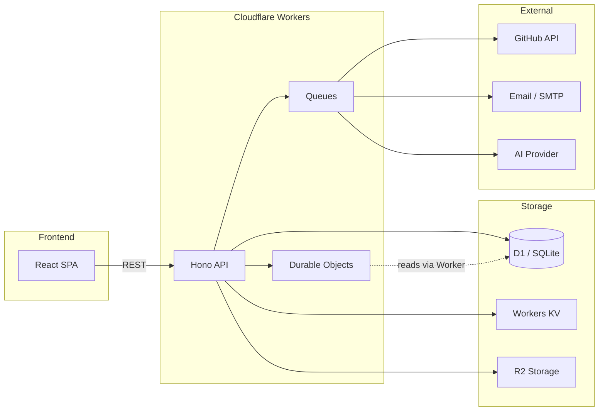

# DevSage

**GitHub-native hackathon management platform.**

DevSage is an edge-native platform for running hackathons end-to-end — from registration through judging. Built on Cloudflare Workers with Hono, D1, and Durable Objects on the backend, and a React SPA with Tailwind and shadcn/ui on the frontend. Everything runs at the edge, close to your participants.

## Key Features

- **GitHub bot integration** — tracks commits, PRs, and activity across team repositories
- **Tag-based submissions** — teams submit by pushing a Git tag; no forms, no uploads
- **Exactly-once submission locking** — Durable Objects guarantee one submission per team, no race conditions
- **Force push detection** — catches post-deadline tampering via webhook analysis
- **AI-assisted code reviews** — automated first-pass reviews to help judges scale
- **Structured rubric scoring** — configurable criteria with weighted scoring for consistent judging
- **Real-time activity feeds** — live updates on team progress, submissions, and announcements
- **Custom branding** — per-hackathon themes, logos, and landing pages

## Architecture

```
DevSage/
├── apps/
│   ├── api/          # Cloudflare Worker — Hono API + Durable Objects + Queues
│   └── web/          # React SPA — Vite + Tailwind + shadcn/ui
├── packages/
│   ├── config/       # Shared tsconfig + ESLint config
│   ├── db/           # Drizzle ORM schemas + D1 migrations
│   └── shared/       # Zod schemas, types, constants
└── docs/             # Architecture, setup, deployment guides
```



## Tech Stack

| Layer | Technology |
|-------|------------|
| Runtime | Cloudflare Workers |
| Framework | Hono |
| Database | Cloudflare D1 (SQLite) via Drizzle ORM |
| State machine | Durable Objects (SQLite-backed) |
| Queues | Cloudflare Queues (webhooks + notifications) |
| Frontend | React 18 + Vite + Tailwind CSS v4 + shadcn/ui |
| Auth | Manual OAuth 2.0 (GitHub + Google) → JWT |
| Validation | Zod (shared between API + frontend) |
| Monorepo | Turborepo + pnpm workspaces |
| Testing | Vitest + @cloudflare/vitest-pool-workers + Testing Library |

## Quick Start

```bash
# Prerequisites: Node.js >= 20, pnpm >= 8
git clone https://github.com/qwertystars/DevSage.git
cd DevSage
pnpm install
pnpm dev
```

> The API requires a `.dev.vars` file for secrets (OAuth credentials, JWT keys, etc.). See [docs/v2/setup.md](docs/v2/setup.md) for full instructions.

## Scripts

| Script | Description |
|--------|-------------|
| `pnpm dev` | Start all apps in parallel (Turborepo) |
| `pnpm build` | Build all packages and apps |
| `pnpm test` | Run all test suites |
| `pnpm lint` | Lint all packages |
| `pnpm typecheck` | Type-check all packages |
| `pnpm deploy:api` | Deploy API worker to Cloudflare |
| `pnpm deploy:web` | Deploy web app to Cloudflare |
| `pnpm secrets:scan` | Scan repo for leaked secrets |

## Documentation

- [Architecture](docs/v2/architecture/00-overview.md) — System architecture and design decisions
- [Setup](docs/v2/setup.md) — Developer setup guide
- [Deployment](docs/v2/deployment.md) — Production deployment
- [Secrets](docs/v2/secrets.md) — Secrets management conventions
- [Contributing](docs/v2/contributing.md) — Contributing guidelines

## Project Status

Early development. Building toward the first 3 hackathons with ~500 users.

---

Built by [SHIKDD](https://github.com/SHIKDD-org)
