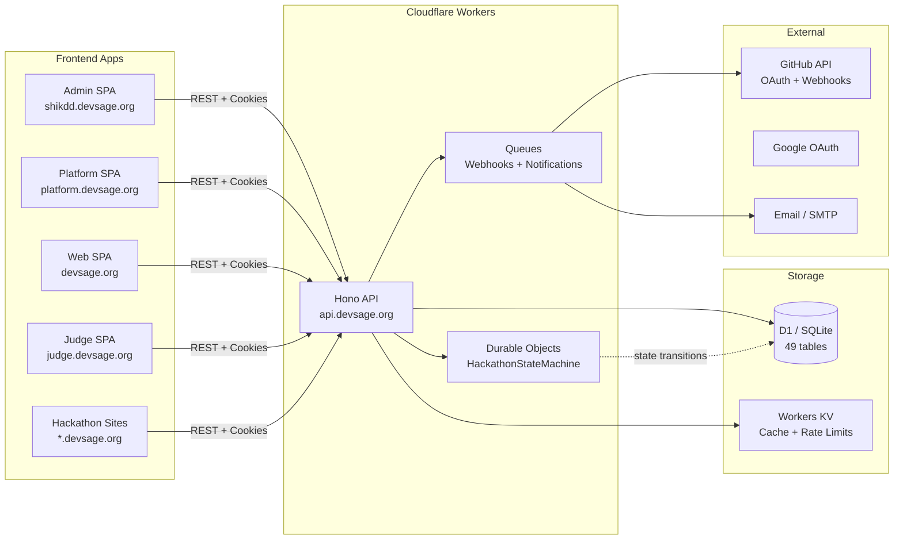

# DevSage

**GitHub-native hackathon management platform.**

DevSage is an edge-native platform for running hackathons end-to-end — from creation requests through judging and results. Built on Cloudflare Workers with Hono, D1, and Durable Objects on the backend, and React SPAs with Tailwind and shadcn/ui on the frontend. Everything runs at the edge, close to your participants.

## Key Features

- **Hackathon creation requests** — organizers submit requests, admins review & approve via a tracked pipeline (submitted → under_review → approved → building → ready)
- **Package-tracking-style status** — organizers see real-time status updates like Amazon order tracking
- **GitHub bot integration** — tracks commits, PRs, and activity across team repositories
- **Tag-based submissions** — teams submit by pushing a Git tag; no forms, no uploads
- **Exactly-once submission locking** — Durable Objects guarantee one submission per team, no race conditions
- **Force push detection** — catches post-deadline tampering via webhook analysis
- **AI-assisted code reviews** — automated first-pass reviews to help judges scale
- **Structured rubric scoring** — configurable criteria with weighted scoring for consistent judging
- **Multi-app platform** — separate apps for admins, organizers, judges, and participants
- **Per-hackathon branded sites** — auto-deployed via CLI tool with custom theming
- **Custom branding** — per-hackathon themes, logos, and landing pages at custom subdomains

## Architecture

```
DevSage/
├── apps/
│   ├── api/          # Cloudflare Worker — Hono API + D1 + Durable Objects + Queues
│   ├── admin/        # React SPA — Platform admin dashboard (shikdd.devsage.org)
│   ├── platform/     # React SPA — Organizer workspace (platform.devsage.org)
│   ├── web/          # React SPA — Participant-facing site (devsage.org)
│   └── judge/        # React SPA — Judge scoring portal (judge.devsage.org)
├── packages/
│   ├── config/       # Shared tsconfig + ESLint config
│   ├── db/           # Drizzle ORM schemas + D1 migrations
│   ├── local-data/   # Frontend-only runtime: Dexie (IndexedDB) local adapter + demo seed
│   └── shared/       # Zod schemas, types, constants
├── scripts/
│   └── generate-hackathon-site.js  # CLI tool for deploying hackathon sites
└── docs/             # Architecture, API contracts, deployment guides
```



## Live URLs

| App | Production URL | Workers.dev URL |
|-----|---------------|-----------------|
| API | `api.devsage.org` | `api.devsage-org.workers.dev` |
| Web (Participants) | `devsage.org` | `web.devsage-org.workers.dev` |
| Platform (Organizers) | `platform.devsage.org` | `platform.devsage-org.workers.dev` |
| Admin (SHIKDD) | `shikdd.devsage.org` | `admin.devsage-org.workers.dev` |
| Judge Portal | `judge.devsage.org` | `judge.devsage-org.workers.dev` |

### Hackathon Frontend URLs

| Type | Pattern | Example |
|------|---------|---------|
| Club hackathon | `{slug}.{workspace}.devsage.org` | `code-sprint.ieee-vit.devsage.org` |
| Individual hackathon | `{slug}.hackathon.devsage.org` | `weekend-jam.hackathon.devsage.org` |

## Tech Stack

| Layer | Technology |
|-------|------------|
| Runtime | Cloudflare Workers |
| Framework | Hono 4.6 |
| Database | Cloudflare D1 (SQLite) via Drizzle ORM — 49 tables, 148 indexes |
| Local runtime | Dexie (IndexedDB) via `@devsage/local-data` — all 4 SPAs run offline against a seeded local adapter |
| State machine | Durable Objects (HackathonStateMachine) |
| Queues | Cloudflare Queues (github-webhooks + devsage-notifications) |
| Frontend | React 18 + Vite 6 + Tailwind CSS v4 + shadcn/ui |
| Auth | Cookie-based JWT (access_token + refresh_token) — GitHub & Google OAuth |
| Validation | Zod (shared between API + frontend) |
| Monorepo | Turborepo + pnpm workspaces |
| Testing | Vitest + @cloudflare/vitest-pool-workers |
| CI/CD | GitHub Actions + Wrangler |

## Quick Start

```bash
# Prerequisites: Node.js >= 20, pnpm >= 10
git clone https://github.com/SHIKDD-org/DevSage.git
cd DevSage
pnpm install
pnpm dev
```

> The API requires a `.dev.vars` file for secrets (OAuth credentials, JWT keys, SMTP, etc.). See [docs/development-guide.md](docs/development-guide.md).

## Scripts

| Script | Description |
|--------|-------------|
| `pnpm dev` | Start all apps in parallel (Turborepo) |
| `pnpm build` | Build all packages and apps |
| `pnpm test` | Run all test suites |
| `pnpm lint` | Lint all packages |
| `pnpm typecheck` | Type-check all packages |
| `pnpm deploy:api` | Deploy API worker to Cloudflare |
| `pnpm deploy:web` | Deploy web app to Cloudflare |
| `pnpm deploy:platform` | Deploy platform app to Cloudflare |
| `pnpm deploy:admin` | Deploy admin app to Cloudflare |
| `pnpm deploy:judge` | Deploy judge app to Cloudflare |
| `pnpm deploy:all` | Deploy all apps |

## Documentation

- [Documentation Index](docs/index.md) — Start here
- [Project Overview](docs/project-overview.md) — High-level summary
- [Architecture — API](docs/architecture-api.md) — Backend architecture
- [Architecture — Frontends](docs/architecture-frontends.md) — Frontend apps
- [API Contracts](docs/api-contracts.md) — Endpoint reference (108 endpoints)
- [Data Models](docs/data-models.md) — Database schema (49 tables)
- [User Flows](docs/user-flows.md) — Complete user journeys for all 4 roles
- [Deployment Guide](docs/deployment.md) — Production deployment & CLI tool
- [Development Guide](docs/development-guide.md) — Local setup & contribution

## Project Status

Production-ready. Platform is live with full E2E flows tested for all 4 roles (Admin, Organizer, Judge, Participant).

---

Built by [SHIKDD](https://github.com/SHIKDD-org)
