# UX Design Specification DevSage

**Author:** Srijan
**Date:** 2026-02-19

---

## Executive Summary

### Project Vision

DevSage is a full-stack hackathon management platform that replaces fragmented university hackathon tooling (Google Forms, spreadsheets, WhatsApp coordination, paper-based judging) with a single, branded, end-to-end system covering the entire hackathon lifecycle. The platform spans four deployment surfaces:

- **Main Website** (`devsage.org`) — Participant-facing: browsing hackathons, registration, team formation, submission tracking
- **Platform App** (`platform.devsage.org`) — Organizer and Judge dashboard: hackathon configuration, judge management, scoring, real-time monitoring
- **Admin Panel** (`shikdd.devsage.org`) — SHIKDD team: hackathon creation request queue, platform-wide monitoring, workspace management
- **Participant Sites** (`{slug}.devsage.org`) — Per-hackathon branded sites: public leaderboard, hackathon info, team listings

The core UX innovation is **observed-workflow submissions** — participants submit by pushing git tags from their terminal, and the platform watches, timestamps, and records submissions without requiring forms, uploads, or context-switching. This is not a UX improvement on existing submission mechanisms; it is a fundamentally different category of interaction.

The UX must convey **trust and institutional-grade professionalism** while remaining accessible to users with widely varying technical skill levels — from first-year CS students who have never used git tags to seasoned developers judging as a favor.

### Target Users

Seven personas span the entire hackathon ecosystem, each with distinct UX needs:

| Persona | Role | Primary Need | Device Context | Emotional State |
|---------|------|-------------|----------------|-----------------|
| **Priya** (20, CS student) | Participant | Register fast, submit naturally, see results | Mobile-first discovery, desktop for coding | Excited but easily confused |
| **Arjun** (21, club secretary) | Organizer | Configure without complexity, monitor without anxiety | Desktop for config, mobile for monitoring | Stressed, wants control |
| **Nikhil** (28, startup engineer) | Judge | Score fast, pick up where left off, never waste time | Desktop primary, mobile fallback | Reluctant, time-pressured |
| **Srijan** (founder) | Platform Admin | Process requests fast, monitor platform health | Desktop only | Efficiency-focused |
| **Meera** (19, first-year) | Spectator | See leaderboard, share with friends | Mobile-only | Curious, 30-second attention span |
| **Ravi** (volunteer) | Co-organizer | Help manage without breaking things | Desktop primary | Cautious, wants guardrails |
| **Rohit** (teammate) | Team Lead | Create team, link repo, manage submissions | Desktop for repo setup, mobile for status | Focused, technically capable |

**Design principle:** All personas require fully responsive experiences. Design for the lowest common denominator of technical skill while not patronizing advanced users.

### Key Design Challenges

1. **Multi-surface coherence** — Four distinct apps need a cohesive design language while serving wildly different personas and use cases. Shared component library (shadcn/ui + Radix UI + Tailwind v4) provides the foundation, but visual coherence requires deliberate design system work.

2. **Git-tag submission education** — The core innovation requires participants who "have never tagged" to learn a new workflow. If this fails, the entire product thesis fails. The UX must make git tag submission feel obvious, not learned.

3. **Judge experience minimalism** — Nikhil is a reluctant user. Every extra click is friction toward "never doing this again." The scoring interface must be invisible infrastructure — a task list that shrinks to zero. No feature bloat, no dashboard chrome, just code review and score sliders.

4. **Information density management** — Organizer dashboards need real-time data (judge progress, submission counts, team status, audit events) without overwhelming a 21-year-old club secretary who's never used a platform more complex than Google Sheets.

5. **Responsive complex flows** — Judging scoring with rubric criteria, hackathon multi-round configuration, and real-time monitoring dashboards must work on mobile. This is a genuine design challenge for data-dense interfaces.

### Design Opportunities

1. **The "magic moment" of git-tag submission** — When Priya pushes a tag and sees instant confirmation on the hackathon site, that's the product's conversion moment. Designing this feedback loop to feel magical (real-time update, satisfying confirmation animation, clear status) is the single highest-leverage UX investment.

2. **Progressive disclosure for organizers** — Arjun doesn't need to see everything at once. Smart progressive disclosure can turn a complex 21-page platform app into a guided, confident experience. Show what matters now, reveal complexity on demand.

3. **Judge-as-task-list pattern** — Designing the judge experience as a pure "task list that shrinks to zero" is a rare chance to build something genuinely delightful through extreme simplicity. Progress bar, assignment cards, score → next. That's it.

## Core User Experience

### Defining Experience

The signature interaction of DevSage is the **git-tag submission flow**: a participant pushes a git tag from their terminal, and within seconds, a confirmation appears on the hackathon participant site with a browser push notification or toast. This is the product's conversion moment — the instant where "something I did in my terminal showed up on a website instantly" transforms DevSage from "another platform" to "fundamentally different infrastructure."

Every other interaction in the product aspires to this level of directness: action → immediate, visible result. No intermediate screens, no confirmation dialogs, no "your submission is being processed" loading states that last longer than a breath.

The organizer's "aha" moment is equally clear: when the leaderboard updates in real-time after judge scores are submitted, without any manual recalculation or spreadsheet refresh. That's when Arjun realizes this is fundamentally better than Google Sheets.

### Platform Strategy

- **Platform:** Fully responsive web across all four deployment surfaces. No native mobile apps. No offline support needed.
- **Interaction model:** Mouse/keyboard primary for organizers, judges, and admins. Touch-friendly for participants and spectators on mobile.
- **Device strategy:** Design for the smallest screen first for participant-facing surfaces (Web, Participant Sites). Desktop-first for complex configuration surfaces (Platform, Admin) with responsive fallback.
- **Performance targets:** Participant site FCP < 2 seconds. Platform app page load < 3 seconds. Admin panel < 5 seconds (internal tool behind Zero Trust).
- **Browser support:** Modern evergreen browsers. No IE11. No legacy mobile browsers.

### Effortless Interactions

Each persona has a core action that must feel **completely effortless** — zero friction, zero learning curve:

| Persona | Core Action | Effortless Target |
|---------|------------|-------------------|
| **Participant** | Git tag push → submission | Push tag from terminal → see confirmation in seconds. Zero forms, zero uploads, zero context-switching |
| **Participant** | Register → team → repo linked | < 3 minutes from clicking a WhatsApp link to being on a team with a linked repo. Zero support messages |
| **Judge** | Score all assignments | Task list that shrinks to zero. Open assignment → review code → slide scores → submit → next. Pick up across sessions. Total < 90 minutes |
| **Organizer** | Configure → publish hackathon | < 30 minutes from workspace creation to branded site live. Guided flow, not blank canvas |
| **Spectator** | View leaderboard | Tap link → see rankings. No login, no registration, no interstitial |

**Automatic actions (no user intervention):**
- Submission creation from webhook events
- Leaderboard recalculation on score finalization
- Elimination of teams below thresholds between rounds
- Deadline reminder notifications
- Judge assignment via round-robin distribution

### Critical Success Moments

| Moment | Persona | Why It's Make-or-Break |
|--------|---------|----------------------|
| Git tag push → instant confirmation | Participant | The conversion moment. If this feels magical, the product thesis validates. If it fails at 11:58 PM before a deadline, trust collapses irreversibly |
| Leaderboard updates in real-time after scoring | Organizer | The "aha" moment where spreadsheets die forever. Real-time visibility without manual recalculation |
| Judge finishes all assignments in < 90 minutes | Judge | The moment that turns "never again" into "sure, if it's on that same platform" |
| Branded site goes live on subdomain | Organizer | Professional credibility — the club looks institutional, not cobbled together |
| First 20 teams register without intervention | Organizer | Arjun's conversion moment — autonomy without anxiety |

### Experience Principles

Five guiding principles that inform every UX decision in DevSage:

1. **"The Platform Disappears"** — The best experience is one where no user thinks about DevSage. Participants think about their code. Judges think about the projects. Organizers think about decisions. The platform is invisible infrastructure that surfaces only when something is accomplished.

2. **"Push and See"** — The git-tag submission moment is the product's signature interaction. It must feel like magic: push a tag from terminal → instant confirmation appears. Every other interaction should aspire to this level of directness — action yields immediate, visible result.

3. **"Task List to Zero"** — Every persona has a clear "done state." Judges: all assignments scored. Organizers: all rounds finalized. Participants: submission confirmed. Design every flow as a task list that visibly shrinks to completion. Progress indicators everywhere. Completion is the reward.

4. **"Progressive Confidence"** — Don't overwhelm. Reveal complexity progressively. Show what's needed now, hide what's needed later. An organizer configuring their first hackathon shouldn't see the same interface density as one managing their fifth. Earn the right to show more by proving the user needs it.

5. **"Trust Through Transparency"** — The institutional-grade promise is fulfilled through visible audit trails, clear timestamps, hash-verified records, and status indicators everywhere. Users trust DevSage not because we say "trust us" but because every action is visible, verifiable, and accountable.

## Desired Emotional Response

### Primary Emotional Goals

Each persona has a distinct emotional target that the UX must deliver:

| Persona | Primary Emotion | Expression | Design Implication |
|---------|----------------|------------|-------------------|
| **Organizer (Arjun)** | Confident and in control | "I've got this under control" | Real-time dashboards with clear status indicators, no surprises. Show what's happening, what needs attention, and what's on track |
| **Participant (Priya)** | Accomplishment | "I just submitted, I'm done!" | Instant confirmation with celebratory feedback. Clear completion states. The moment of submission should feel like crossing a finish line |
| **Judge (Nikhil)** | Clarity | "I know exactly what to do and where I am" | Zero ambiguity interface. Clear progress tracking. One action per screen. Never wonder "what do I do next?" |
| **Platform Admin (Srijan)** | Efficiency | "Processed three requests before lunch" | Batch-friendly workflows. Queue-based interface. Minimal clicks per action |
| **Spectator (Meera)** | Impression | "This looks legit" | Polished, branded surfaces. Professional typography. Clean data presentation |
| **Co-organizer (Ravi)** | Safety | "I can help without breaking things" | Clear permission boundaries. Visible guardrails. Audit trail shows his actions are tracked |
| **Team Lead (Rohit)** | Ownership | "My team's setup and ready to go" | Clear team status dashboard. Visible repo link status. Submission history |

### Emotional Journey Mapping

**First Contact → Core Action → Completion → Return:**

| Stage | Participant | Organizer | Judge |
|-------|------------|-----------|-------|
| **Discovery** | "This looks professional, not sketchy" | "This could replace my Google Sheets nightmare" | "One click to accept? That's reasonable" |
| **Onboarding** | "That was fast — I'm already on a team" | "The setup wizard is guiding me, not overwhelming me" | "I can see exactly what I need to score" |
| **Core Action** | "I pushed a tag and it just... worked" | "Submissions are flowing in, judges are scoring, I'm just watching" | "Score, submit, next. I'm making progress" |
| **Completion** | "I can see my submission confirmed, we placed #3!" | "Results are ready, the PDF looks professional, zero complaints" | "All done in 80 minutes. I'd do this again" |
| **Return** | "I already have an account, team creation takes 30 seconds" | "I'll clone last semester's config in 5 minutes" | "Sure, if it's on that same platform" |

### Micro-Emotions

**Critical micro-emotions to design for:**

- **Confidence over confusion** — At every decision point, the user should feel "I know what this does" not "I wonder what happens if I click this"
- **Trust over skepticism** — Timestamps, audit indicators, and status badges build trust continuously, not through a single "trust us" moment
- **Accomplishment over frustration** — Every completed action gets acknowledged: checkmarks, progress bars, status transitions, toast confirmations
- **Belonging over isolation** — Team dashboards show activity, not silence. Participants see their team members, submission history, and collective progress

**Emotions to actively prevent:**
- 🚫 **Anxiety** — "Did my submission go through?" → Always show clear confirmation
- 🚫 **Confusion** — "What do I do now?" → Always show the next action
- 🚫 **Distrust** — "Can I rely on this?" → Always show verifiable proof
- 🚫 **Frustration** — "This broke and I can't recover" → Always provide a recovery path

### Design Implications

**Emotion → UX Design Approach:**

| Emotional Goal | UX Approach |
|---------------|-------------|
| Confidence (Organizer) | Real-time status dashboards, color-coded health indicators, notification badges for items needing attention |
| Accomplishment (Participant) | Celebratory confirmation on submission (✓ animation, details shown), leaderboard position visibility, team progress indicators |
| Clarity (Judge) | Single-purpose scoring interface, linear task flow, persistent progress bar ("4/8 completed"), no navigation distractions |
| Trust (All) | Timestamps on every action, audit trail accessibility, hash verification indicators, status badges |
| Safety (Co-organizer) | Permission-aware UI — disabled buttons for unauthorized actions with explanatory tooltips, not hidden functionality |

**Error Handling Emotional Design:**

- **Approach:** Reassuring + transparent + always a recovery path
- **Submission pipeline failures:** Webhook failure → fallback to manual commit SHA upload, or `main` branch as default submission. Never leave a participant in a dead-end state
- **Score save failures:** Auto-save drafts locally, retry automatically, show "saved" vs "saving..." indicator
- **Network errors:** Queue action for retry, show clear "offline" state with "will sync when connected" messaging
- **Principle:** Error states lead with the solution ("Here's what to do"), not the problem ("Something went wrong")

### Emotional Design Principles

1. **"Certainty Over Speed"** — It's better to show a clear "processing..." state than to be fast but ambiguous. Users need to know what happened, even if it takes a second longer. Loading states should communicate progress, not just spin.

2. **"Recovery, Not Apology"** — Error states lead with the solution, not the problem. "Upload your commit SHA manually" is better than "Webhook failed." Show what to do next, not just what went wrong.

3. **"Progress Is Reward"** — Every completed action should be visibly acknowledged. Checkmarks, progress bars, "4 of 8 done," status transitions from "draft" to "submitted." Completion is the dopamine. The platform should feel like a task list that shrinks to zero.

## UX Pattern Analysis & Inspiration

### Inspiring Products Analysis

Three products provide the primary UX inspiration for DevSage, each contributing distinct patterns:

**1. GitHub — Developer Workflow Familiarity**
- **Core pattern:** Repository-scoped context. Everything lives within a repo, with consistent navigation and status indicators
- **Key UX strengths:** Real-time status checks (green ✓ / red ✗), inline code review, activity timelines, commit SHA references, familiar developer visual language
- **Onboarding:** Progressive — start with repos, discover features through use
- **Error handling:** Actionable error messages with "try again" or alternative actions
- **Relevance:** DevSage's git-tag submissions are literally a GitHub workflow. Users will expect GitHub-like visual language for commit SHAs, status badges, and activity feeds

**2. Stripe Dashboard — Data-Dense Clarity**
- **Core pattern:** Massive amounts of transactional data presented without overwhelming the user
- **Key UX strengths:** Clean sidebar → content area layout, excellent filtering and time-range controls, data tables with inline actions, clear status indicators (succeeded/failed/pending), charts that inform rather than decorate
- **Navigation:** Sidebar with clear hierarchy. Content area adapts to context. Breadcrumbs for deep pages
- **Relevance:** Organizer dashboards need Stripe-level data density management — submission counts, judge progress, team status, audit events — all without visual chaos

**3. Vercel — Real-Time Pipeline Status**
- **Core pattern:** Deployment pipelines made transparent and trustworthy through real-time status communication
- **Key UX strengths:** The deployment status indicator (building → ready → live) is a masterclass in status communication. Real-time log streaming builds trust. Project-scoped dashboards
- **Visual design:** Minimal, monochromatic with strategic color for status. Clean typography. Generous whitespace
- **Relevance:** The webhook pipeline (tag push → processing → submission created) should feel exactly like a Vercel deployment. The state machine transitions (draft → active → judging → completed → archived) should have this same visual clarity

### Transferable UX Patterns

**Navigation Patterns:**
- **Hackathon-scoped navigation** (from GitHub's repo-scoped model) — All navigation within the platform app is scoped to the selected hackathon. Sidebar shows hackathon-specific sections. Context switch between hackathons via dropdown
- **Sidebar + content area** (from Stripe) — Clean sidebar hierarchy for platform and admin apps. Content area adapts to selected section. Breadcrumbs for deep pages

**Interaction Patterns:**
- **Status pipeline visualization** (from Vercel) — Submission pipeline and state machine transitions shown as visual pipelines with clear status indicators at each stage
- **Data tables with inline actions** (from Stripe) — Team listings, submission tables, judge assignment tables use inline action buttons rather than navigation to separate pages
- **Activity timeline** (from GitHub) — Audit trail and submission history displayed as chronological activity feeds with actor, action, and timestamp
- **Status badges** (from GitHub) — Green ✓ / red ✗ / yellow ⏳ for team readiness, submission status, judge completion, repo link status

**Visual Patterns:**
- **Monochromatic base with strategic color** (from Vercel) — Neutral palette for chrome, color reserved for status indicators and CTAs. Trust comes from restraint, not decoration
- **Data-first layouts** (from Stripe) — Metrics cards at top, filterable data tables below, charts as supporting context. Organizers see numbers, not decoration
- **Progressive detail** (from all three) — Summary → detail → deep-dive. Never dump all information at once

### Anti-Patterns to Avoid

1. **Devpost/HackerEarth form-heavy submission** — No upload forms, no paste-a-link text fields, no "describe your project" mandatory forms before submission. DevSage's thesis is that submissions happen through git, not forms
2. **Information overload dashboards** — Don't show every metric, every table, every chart on a single dashboard page. Progressive disclosure: show what matters now, reveal more on demand
3. **Generic error messages** — "Something went wrong" without a recovery path is forbidden. Every error state must include what happened and what to do next
4. **Feature-first navigation** — Don't organize navigation by feature ("Submissions," "Teams," "Judges" as top-level nav). Organize by workflow state and persona tasks ("Setup," "Active Event," "Judging," "Results")
5. **Forced tutorials and walkthroughs** — No unskippable onboarding flows. Contextual help on demand — tooltips, inline help text, documentation links. Respect the user's time
6. **Marketplace aesthetics** — DevSage is not a hackathon discovery platform. Avoid card grids, browse/discover patterns, and marketplace-style layouts. Each hackathon is an institutional workflow, not a product listing

### Design Inspiration Strategy

**Adopt directly:**
- GitHub's status badge system (✓/✗/⏳) for all binary/ternary states
- Stripe's sidebar + content area + data table pattern for all management surfaces
- Vercel's pipeline status visualization for submission and state machine flows

**Adapt for context:**
- GitHub's activity feed → DevSage's audit trail (simplified for organizers, detailed for admins)
- Stripe's data density → Tuned for a 21-year-old club secretary, not a payments engineer. Larger typography, more whitespace, fewer columns
- Vercel's deployment log streaming → DevSage's real-time submission feed (simpler, no raw logs)

**Avoid deliberately:**
- Any pattern from hackathon marketplaces (Devpost, Devfolio, HackerEarth)
- Complex configuration panels with dozens of options visible at once
- Dashboard widgets that exist for visual impressiveness rather than decision-making

## Design System Foundation

### Design System Choice

**Selected:** shadcn/ui + Radix UI + Tailwind CSS v4 + CVA (retain and extend existing stack)

This is a **Themeable System** approach — shadcn/ui provides proven, accessible components with full customization control, Radix UI ensures accessibility compliance, Tailwind CSS v4 provides the theming/styling layer, and CVA manages component variants. The stack is already established in the codebase and proven to work across all three frontend apps.

**Complete design system stack:**

| Layer | Technology | Role |
|-------|-----------|------|
| CSS Framework | Tailwind CSS v4 | Utility-first styling, CSS-first config via `@tailwindcss/vite` plugin |
| Headless Primitives | Radix UI | Accessible, unstyled component primitives (dialog, dropdown, tabs, etc.) |
| Styled Components | shadcn/ui pattern | Pre-styled compositions of Radix primitives in `components/ui/` |
| Variant System | CVA (Class Variance Authority) | Type-safe component variants (size, color, state) |
| Class Merging | `cn()` (clsx + tailwind-merge) | Conflict-free class composition |
| Icons | Lucide React | Consistent icon set across all surfaces |
| Animations | Framer Motion + GSAP (web only) | Component transitions + landing page animations |
| Toasts | Sonner | Notification toasts across all apps |
| Theming | HSL CSS variables | Design tokens (background, foreground, primary, destructive, etc.) |

### Rationale for Selection

1. **Already proven in codebase** — The stack is established and working. Changing it would mean rewriting existing components for no UX benefit
2. **Perfect alignment with inspiration** — GitHub, Stripe, and Vercel all use similar minimal, clean aesthetics that shadcn/ui + Tailwind produce naturally
3. **Accessibility built-in** — Radix UI provides WCAG-compliant primitives (keyboard navigation, screen reader support, focus management) out of the box
4. **Full brand control** — Unlike opinionated systems like Material UI, shadcn/ui + Tailwind allow complete visual customization through CSS variables
5. **Developer experience** — The team is already familiar with the stack. CVA provides type-safe variants. Tailwind v4's CSS-first config reduces configuration overhead
6. **Performance** — Tailwind's utility classes produce minimal CSS. Radix components are tree-shakeable. No heavy runtime CSS-in-JS

### Implementation Approach

**New `@devsage/ui` shared package:**

A new package at `packages/ui/` will centralize design tokens and shared components:

```
packages/ui/
├── src/
│   ├── components/     # Shared shadcn/ui components
│   │   ├── button.tsx
│   │   ├── card.tsx
│   │   ├── dialog.tsx
│   │   ├── data-table.tsx
│   │   ├── status-badge.tsx
│   │   ├── progress-bar.tsx
│   │   ├── pipeline-status.tsx
│   │   └── ...
│   ├── tokens/         # Design tokens as CSS variables
│   │   ├── colors.css
│   │   ├── typography.css
│   │   ├── spacing.css
│   │   └── animations.css
│   ├── hooks/          # Shared UI hooks
│   │   ├── use-theme.ts
│   │   └── use-media-query.ts
│   └── index.ts        # Barrel exports
├── package.json
└── tsconfig.json
```

**Dependency graph update:**
```
apps/admin    → @devsage/shared, @devsage/ui
apps/platform → @devsage/shared, @devsage/ui
apps/web      → @devsage/shared, @devsage/ui
```

### Customization Strategy

**Dark/Light Mode:**
- System preference auto-detection via `prefers-color-scheme` media query
- User toggle persisted in localStorage
- HSL CSS variables swap between light and dark token sets
- `@custom-variant dark` already configured in Tailwind v4

**Per-App Visual Tuning:**
- Shared base tokens (colors, typography, spacing) across all apps
- App-specific accent colors possible via CSS variable overrides
- Platform app: data-dense layouts with smaller base typography
- Web app: larger typography, more whitespace for marketing/participant surfaces
- Admin app: compact, functional styling optimized for throughput

**Per-Hackathon Branding (Participant Sites):**
- CSS variable overrides for hackathon-specific colors and branding
- Organizer-configurable primary/accent colors injected at build time
- Logo and brand assets served from hackathon configuration

**Custom Components (DevSage-specific):**
- `<StatusBadge>` — GitHub-style ✓/✗/⏳ indicators
- `<PipelineStatus>` — Vercel-style pipeline visualization for submission flow and state machine
- `<ProgressTracker>` — Judge task completion (4/8 scored)
- `<DataTable>` — Stripe-style filterable data table with inline actions
- `<ActivityFeed>` — GitHub-style chronological activity timeline for audit trail
- `<MetricCard>` — Dashboard KPI cards with trend indicators

## Defining Core Experience

### Defining Experience

DevSage has two defining experiences — one for each primary persona:

**"Push to Submit" (Participant):** `git tag r1_submission_v1 && git push origin --tags` → instant confirmation on the hackathon site. This is the moment that makes DevSage fundamentally different from every other hackathon platform. The participant never leaves their terminal. The platform observes their natural workflow and turns it into structured, auditable data.

**"Run on Autopilot" (Organizer):** Configure once → watch the dashboard as submissions flow in, judges score, leaderboards compute, and results finalize — all without touching a spreadsheet or sending a single WhatsApp message. The organizer's role shifts from logistics janitor to decision-maker.

### User Mental Model

**Participant mental model shift:**
- **Current expectation:** "I'll need to fill out a form, paste a GitHub link, maybe upload a zip file" (Google Forms / Devpost / Devfolio pattern)
- **DevSage reality:** "I push a git tag from my terminal and the platform picks it up automatically"
- **Education required:** Git tags are not widely understood by second-year CS students. The concept is simple but unfamiliar. Must be taught through multiple touchpoints

**Organizer mental model shift:**
- **Current expectation:** "I'll coordinate everything via WhatsApp, Google Sheets will handle scoring, I'll be up at midnight fixing things"
- **DevSage reality:** "I configure the hackathon once and the platform runs itself"
- **Education required:** Trust that the platform works. First-time organizers need visible proof (real-time dashboards, audit trails) that things are running correctly

**Judge mental model:**
- **Current expectation:** "Here's a Google Sheet with 25 tabs. Good luck"
- **DevSage reality:** "Here are 8 assignments. Score each one. You're done when the progress bar hits 100%"
- **Education required:** None. The interface should be self-explanatory. If a judge needs instructions, the UX has failed

### Success Criteria

**"Push to Submit" success criteria:**
- Tag push → visible confirmation in < 30 seconds (p95)
- Confirmation includes: tag name, commit SHA, timestamp, submission number
- Browser push notification or toast appears on the hackathon site
- Organizer dashboard updates in real-time (no manual refresh)
- Failed submissions → clear error with recovery path (manual SHA upload fallback)

**"Run on Autopilot" success criteria:**
- Hackathon configured and published in < 30 minutes
- Zero WhatsApp messages from participants during the event
- Judge progress visible in real-time (who's scoring, who's lagging)
- Leaderboard auto-computes after scoring completes
- Exportable PDF/CSV ready for Prof. Sharma without manual data manipulation

**Judge scoring success criteria:**
- All assignments scored in < 90 minutes across 1-2 sessions
- Pick up exactly where left off between sessions
- Never wonder "what do I do next?" — always a clear next action
- Score submission feels instant and satisfying (✓ animation)

### Novel UX Patterns

**Novel: Git-tag submission (requires education):**
DevSage introduces a fundamentally new submission paradigm. Users are accustomed to form-based submission. The git-tag model is conceptually simple but behaviorally unfamiliar. Education strategy:

1. **Participant site "How to Submit" section** — Terminal-style code blocks (copy-pasteable) showing exact commands: `git tag r1_submission_v1 && git push origin --tags`
2. **Repo link setup flow** — When a team links their repo, immediately show submission instructions and tag pattern for the current round
3. **Pre-hackathon email** — 30-second tag tutorial sent to all registered participants before the hackathon starts
4. **Interactive "Test Your Setup" workflow** — Before the hackathon goes active, teams can push a test tag to verify their webhook connection works. Confirmation: "✓ Your setup is working! You'll submit just like this during the hackathon."
5. **In-context reminders** — On the team dashboard, always show the current round's tag pattern and submission command

**Established patterns (leverage familiarity):**
- Sidebar + content area navigation (Stripe-familiar)
- Status badges and pipeline indicators (GitHub/Vercel-familiar)
- Data tables with filtering and sorting (universal)
- Progress bars and task lists (universal)
- Toast notifications for actions (universal)

### Experience Mechanics

**"Push to Submit" — Step-by-step flow:**

```
1. INITIATION
   Participant finishes coding
   → Types: git tag r1_submission_v1 && git push origin --tags
   → Terminal shows: "Tag pushed to origin"

2. PROCESSING (invisible to user)
   GitHub webhook fires → DevSage API receives
   → HMAC verification → Normalize event → Enqueue
   → Queue consumer creates submission record
   → Server timestamp applied (authoritative, not git timestamp)

3. FEEDBACK (< 30 seconds)
   → Browser push notification: "Submission received ✓"
   → Participant site updates: Submission card appears with:
     - Tag name: r1_submission_v1
     - Commit SHA: a3f8c2d (truncated, clickable to GitHub)
     - Received: 23:45:32 IST
     - Status: ✓ On time / ⚠️ Late
   → Organizer dashboard: submission count increments, activity feed updates

4. COMPLETION
   → Team dashboard shows: "Submission confirmed ✓"
   → If multiple submissions: latest marked as final (is_final flag)
   → Previous submissions visible in history for audit
   → Status badge: green ✓ on team card in organizer view

5. ERROR RECOVERY
   → If webhook fails: DLQ captures event, retry automatically
   → If still failing: Participant sees "Submission pending verification ⏳"
   → Fallback: Manual commit SHA upload on team dashboard
   → Nuclear option: Organizer triggers "Reconcile submissions" to compare repo tags vs records
```

**"Run on Autopilot" — Organizer dashboard mechanics:**

```
1. SETUP PHASE (draft state)
   → Guided configuration wizard (not blank canvas)
   → Steps: Basic info → Rounds → Rubrics → Judges → Review → Publish
   → Each step validates before allowing next
   → Preview of branded participant site before publishing

2. ACTIVE PHASE
   → Dashboard shows: Team count, Submission count, Deadline countdown
   → Real-time activity feed: registrations, team formations, submissions
   → Notification badges for items needing attention
   → No action required unless something needs a decision

3. JUDGING PHASE
   → Judge progress panel: per-judge progress bars (0% → 100%)
   → One-click nudge for lagging judges
   → Judge reassignment if someone drops out
   → Leaderboard preview (frozen until organizer reveals)

4. COMPLETION PHASE
   → Finalize round → Elimination applied automatically
   → Leaderboard published → Notifications sent to all participants
   → Export: PDF leaderboard, CSV results, audit log
   → Clone configuration for next semester
```

## Visual Design Foundation

### Color System

**Brand Identity: Dark + Lime Green (#CCFF00)**

DevSage's visual identity centers on a dark-first theme with a vibrant lime green accent. This creates a bold, developer-oriented aesthetic that stands apart from the corporate blandness of existing hackathon platforms while maintaining professionalism.

**App-Specific Theming:**

| Surface | Base Theme | Accent | Rationale |
|---------|-----------|--------|-----------|
| **Platform App** | Dark (#000000 background) | Lime #CCFF00 | Core brand identity. Organizers and judges spend the most time here — dark theme reduces eye strain during long sessions |
| **Web App** | Dark (#000000 background) | Lime #CCFF00 | Unified brand identity with Platform. Participants see the same DevSage brand |
| **Admin Panel** | Light default + dark mode | Navy primary | Functional, neutral tool. Admin is an internal surface — doesn't need brand personality |
| **Participant Sites** | Dark base | Organizer-customizable | Hackathon's brand colors override DevSage accent. The organizer's brand is front-and-center |

**Core Color Tokens (HSL CSS Variables):**

```css
/* Platform & Web — Dark + Lime */
--background: 0 0% 0%;           /* Pure black */
--foreground: 0 0% 95%;          /* Off-white text */
--primary: 73 100% 50%;          /* Lime green */
--primary-foreground: 0 0% 0%;   /* Black on lime */
--secondary: 0 0% 8%;            /* Very dark gray */
--muted: 0 0% 15%;               /* Muted gray */
--accent: 73 100% 50%;           /* Lime accent */
--destructive: 0 84% 60%;        /* Red */
--border: 0 0% 12%;              /* Dark border */
--lime: #CCFF00;                 /* Brand lime */
--lime-dim: rgba(204, 255, 0, 0.15);  /* Subtle lime backgrounds */
--lime-glow: rgba(204, 255, 0, 0.06); /* Ultra-subtle lime wash */

/* Semantic Colors (all surfaces) */
--success: 142 76% 36%;          /* Green — submission confirmed, team ready */
--warning: 38 92% 50%;           /* Amber — late submission, deadline approaching */
--error: 0 84% 60%;              /* Red — failed, blocked, error state */
--info: 217 91% 60%;             /* Blue — informational, neutral status */
```

**Dark/Light Mode Strategy:**
- System preference auto-detection via `prefers-color-scheme`
- User toggle persisted in localStorage
- Platform + Web: dark by default (brand identity)
- Admin: follows system preference
- `@custom-variant dark` configured in Tailwind v4

### Typography System

**Font Stack:**

| Role | Font | Weight Range | Usage |
|------|------|-------------|-------|
| **Primary (sans-serif)** | Inter | 400 (regular), 500 (medium), 600 (semibold), 700 (bold) | Body text, headings, UI labels, navigation |
| **Monospace** | JetBrains Mono | 400, 500 | Commit SHAs, tag names, code snippets, terminal commands, timestamps |
| **Fallback** | system-ui, sans-serif | — | Graceful degradation |

**Type Scale:**

| Level | Size | Weight | Line Height | Usage |
|-------|------|--------|------------|-------|
| Display | 2.25rem (36px) | 700 | 1.2 | Landing page hero, major announcements |
| H1 | 1.875rem (30px) | 700 | 1.3 | Page titles |
| H2 | 1.5rem (24px) | 600 | 1.35 | Section headings |
| H3 | 1.25rem (20px) | 600 | 1.4 | Card titles, subsection headings |
| H4 | 1.125rem (18px) | 500 | 1.4 | Label headings |
| Body Large | 1rem (16px) | 400 | 1.6 | Primary body text, descriptions |
| Body | 0.875rem (14px) | 400 | 1.5 | Default body text, table cells, form inputs |
| Small | 0.75rem (12px) | 400 | 1.4 | Timestamps, metadata, secondary labels |
| Tiny | 0.625rem (10px) | 500 | 1.3 | Status badges, micro-labels |

**Monospace usage:** Commit SHAs (`a3f8c2d`), tag names (`r1_submission_v1`), terminal commands (`git push origin --tags`), timestamps in audit trails. Styled with slightly reduced font size (0.85em) and lime-tinted background for visual distinction.

### Spacing & Layout Foundation

**Base Unit:** 4px
**Spacing Scale:** 4, 8, 12, 16, 20, 24, 32, 40, 48, 64, 80, 96px

**Adaptive Density Strategy:**
- **Desktop dashboards:** Compact spacing. 8-12px gaps between cards, 16px section padding, dense data tables
- **Desktop public pages:** Moderate spacing. 16-24px gaps, 32px section padding
- **Mobile (all surfaces):** Spacious spacing. 16-24px gaps, larger touch targets (min 44px), 24-32px section padding

**Layout Patterns:**

| Surface | Layout | Grid | Notes |
|---------|--------|------|-------|
| **Platform App** | Sidebar (240px collapsed/expanded) + Content | 12-column | Data-dense dashboards. Sidebar always visible on desktop, sheet on mobile |
| **Web App** | Top nav + Content | 12-column | Full-width hero sections, contained content areas (max-width: 1280px) |
| **Admin Panel** | Sidebar + Content | 12-column | Similar to Platform but simpler layout |
| **Participant Sites** | Single column + sections | Max-width 960px | Clean, focused, scrollable. No sidebar. Mobile-optimized |

**Component Spacing:**
- Card padding: 16px (mobile), 20-24px (desktop)
- Table row height: 40-48px
- Button height: 36px (compact), 40px (default), 48px (large/mobile CTA)
- Form input height: 40px
- Section gap: 24px (compact), 32-48px (spacious)

### Accessibility Considerations

- **Contrast ratios:** All text meets WCAG AA (4.5:1 for body, 3:1 for large text). Lime #CCFF00 on dark background passes AA for large text but needs testing for small text
- **Focus indicators:** Visible focus rings using lime accent color (2px solid, 2px offset)
- **Touch targets:** Minimum 44x44px on all interactive elements (mobile)
- **Color independence:** Never rely solely on color to convey meaning. Status badges include icons (✓, ✗, ⏳) alongside color
- **Reduced motion:** Respect `prefers-reduced-motion` — disable GSAP animations, Framer Motion transitions, and lime glow effects
- **Screen reader support:** Radix UI provides ARIA attributes out of the box. Custom components must match
- **Keyboard navigation:** All interactive elements reachable via Tab. Modal/dialog focus trapping via Radix

---

## 9. Design Directions & Visual Strategy

> **Interactive Mockups:** See `_bmad-output/planning-artifacts/ux-design-directions.html` for full visual showcase

### Selected Approach: All 6 Directions — Unified System

All 6 design directions were evaluated and selected as a **complementary system** — each direction covers a distinct persona/screen, and together they form the cohesive DevSage experience.

### Direction Map

| Direction | Screen/Persona | Pattern | Purpose |
|---|---|---|---|
| **A: Dashboard-Centric** | Organizer Dashboard (Platform) | Stripe — Sidebar + metrics + data tables | Primary management view for hackathon organizers |
| **B: Task-Focused** | Judge Scoring (Platform) | Linear task list → zero | Judge assignments with progressive completion |
| **C: Activity Feed** | Activity Timeline (Platform) | GitHub — Real-time event stream | Live hackathon narrative with color-coded events |
| **D: Pipeline Status** | Submission Tracking (Platform + Participant Site) | Vercel — Stage-by-stage pipeline | Transparent submission processing visualization |
| **E: Submission Magic** | Confirmation Screen (Participant Site) | Receipt/Verification | The "Push and See" conversion moment |
| **F: Command Center** | Hackathon Setup (Platform) | Progressive disclosure wizard | Step-by-step configuration with progress tracking |

### Visual Embellishment Level: Glossy

The platform embraces a **premium, glossy** visual treatment:

- **Glassmorphism:** Subtle frosted-glass panels with `backdrop-filter: blur()` and semi-transparent backgrounds
- **Lime glow effects:** Key interactive elements emit a soft lime glow (`box-shadow: 0 0 12px rgba(204, 255, 0, 0.15)`)
- **Surface layering:** Multiple depth levels via transparency — cards float above backgrounds
- **Hover states:** Elements lift subtly with increased glow intensity on interaction
- **Consistent across apps:** Platform and Web share the glossy treatment; Admin uses a toned-down version

### Key Design Patterns Established

#### Pattern 1: Hackathon State Pipeline
Used in Directions A and D. A horizontal pipeline showing the 5-state lifecycle (`draft → active → judging → completed → archived`). Each step shows completion with checkmarks, active state with lime accent, and future states dimmed.

#### Pattern 2: Progress-to-Zero Task List
Used in Direction B. Completed items visually recede (opacity reduction), the next action is highlighted with lime accent, and a persistent progress bar shows exactly how far the user has come. "Score Now" CTA appears only on the next unscored item.

#### Pattern 3: Color-Coded Activity Events
Used in Direction C. Each event type has a distinct avatar color:
- **Green** (`#22c55e`): Submissions, completions, acceptances
- **Lime** (`#CCFF00`): Scoring, active operations
- **Blue** (`#3b82f6`): Team activities, links, registrations
- **Amber** (`#f59e0b`): Warnings, late submissions, lagging judges
- **Red** (`#ef4444`): Errors, failures, rejections

#### Pattern 4: Submission Receipt Card
Used in Direction E. The critical "Push and See" moment:
- Large success checkmark hero element (80px diameter)
- Clean card with all verification details (team, tag, SHA, timestamp, status)
- "On time" badge as immediate anxiety relief
- Audit hash indicator for institutional trust
- Monospace for technical details, sans-serif for everything else

#### Pattern 5: Progressive Disclosure Wizard
Used in Direction F. Multi-step configuration with:
- Segmented progress bar (color-coded: green=done, lime=current, gray=future)
- Completed steps collapse to summary cards
- Active step shows full form
- Back/Continue navigation — never lost

#### Pattern 6: Metric Cards Grid
Used in Directions A and C. Four-column metric cards:
- Large number as hero value
- Small uppercase label
- Trend indicator with color-coded direction
- Warning state when attention needed (amber)

### Design Direction Synthesis

The unified design language combines:
1. **Stripe's data density** for organizer management screens
2. **Vercel's pipeline transparency** for submission processing
3. **GitHub's activity narrative** for real-time event streaming
4. **Todoist/Linear's task completion** for judge workflows
5. **Premium glassmorphism** as the cohesive visual glue across all patterns

---

## 10. User Journey Flows

> Detailed interaction flows for the 4 critical personas: Participant (Priya), Organizer (Arjun), Judge (Nikhil), and Platform Admin (Srijan). Flows for Spectator (Meera), Co-organizer (Ravi), and Team Lead (Rohit) inherit patterns from these primary flows.

---

### Journey 1: Priya — The Participant

Priya's journey is split into 3 flows: **Onboarding**, **Submission**, and **Post-Submission**.

#### Flow 1A: Participant Onboarding

**Entry point:** Priya receives a WhatsApp link to `codecraft-spring-hack.devsage.org`

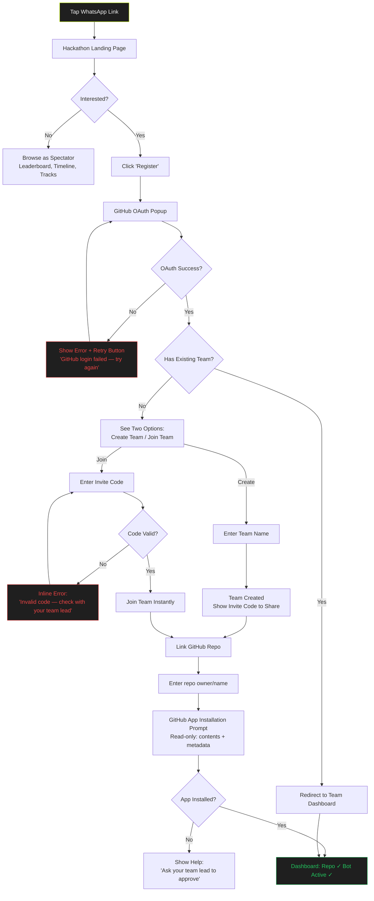

**Key UX Decisions:**
- **No forms:** GitHub OAuth is the only registration mechanism — zero friction
- **Invite code join:** Single text input, instant validation, no approval flow
- **Repo linking as onboarding step:** Not hidden in settings — it's part of the setup checklist
- **Error recovery:** Every failure state has a visible recovery action (retry, re-enter, ask team lead)
- **Target time:** WhatsApp link to "on a team with linked repo" < 3 minutes

#### Flow 1B: Participant Submission (The Magic Moment)

**Entry point:** Priya runs `git tag r1_submission_v1 && git push origin --tags` in terminal

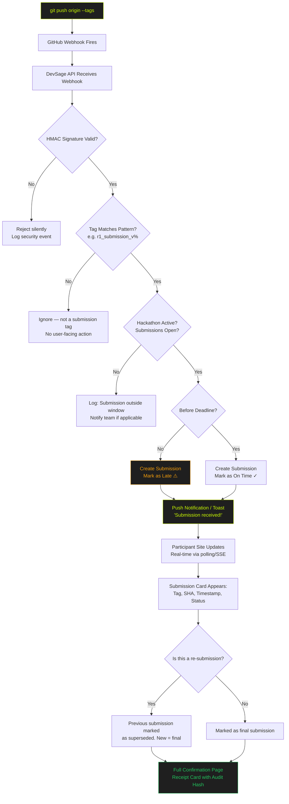

**Key UX Decisions:**
- **Toast notification first:** Instant "Submission received!" toast within seconds of push — anxiety relief
- **Full confirmation page second:** Navigable receipt with all details (tag, SHA, timestamp, on-time status, audit hash)
- **Late submissions always accepted:** Marked with amber ⚠️, never silently rejected — organizer discretion on penalty
- **Re-submission handling:** Latest tag becomes `is_final`, previous preserved in audit trail
- **No form fallback:** If webhook fails, manual commit SHA upload is available (error recovery path)

**Error Recovery — Submission Failure:**

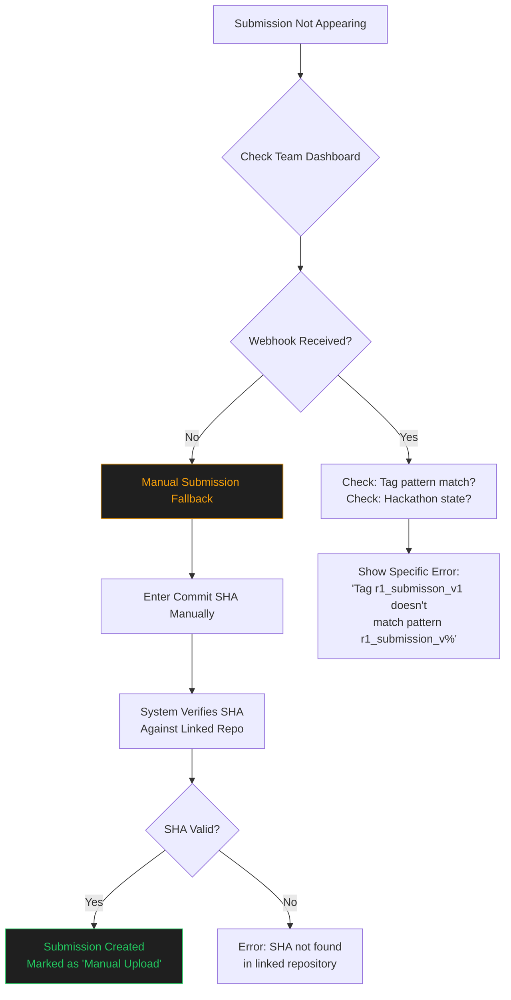

#### Flow 1C: Post-Submission (Results & Feedback)

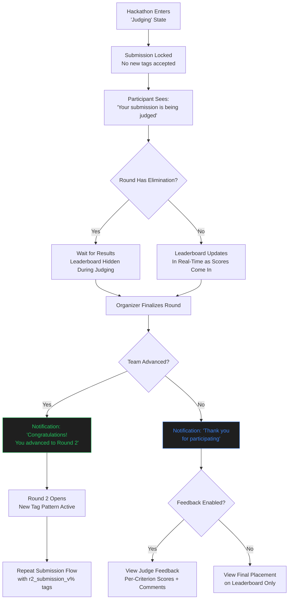

---

### Journey 2: Arjun — The Organizer

Arjun's journey splits into: **Setup** (wizard + checklist), **Live Management** (dashboard), and **Post-Hackathon** (export + review).

#### Flow 2A: Hackathon Setup (Wizard → Checklist Hybrid)

**Entry point:** Arjun logs into `platform.devsage.org`, workspace already exists

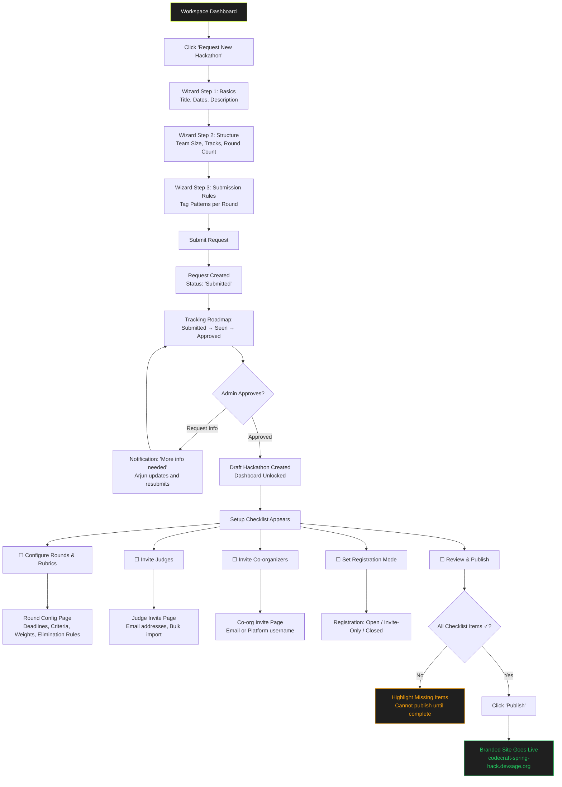

**Key UX Decisions:**
- **Wizard for initial creation:** 3 steps to capture essentials — keeps the request submission fast
- **Checklist for remaining config:** After approval, dashboard shows checkmark list — non-linear, complete in any order
- **Cannot publish until complete:** Publish button disabled with clear indicator of what's missing
- **Request tracking roadmap:** Arjun sees status transitions with timestamps — trust through transparency
- **Target time:** Initial request submission < 10 minutes; full configuration < 25 minutes

#### Flow 2B: Live Hackathon Management (Dashboard-Centric)

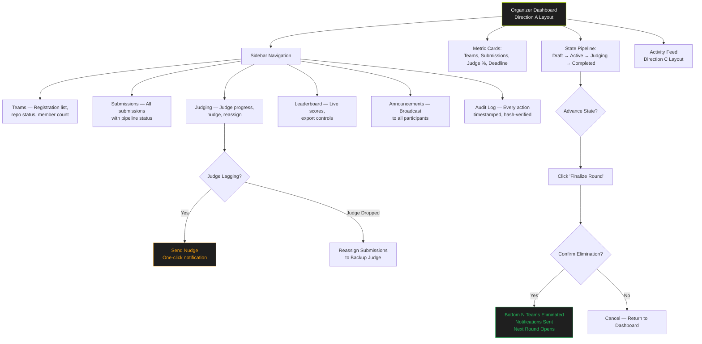

**Key UX Decisions:**
- **Dashboard as command center:** All critical information visible on one screen (Direction A layout)
- **State pipeline always visible:** Arjun always knows what state the hackathon is in
- **Inline actions:** "Send Nudge" and "Reassign" are contextual — no navigation to separate pages
- **Confirmation for destructive actions:** "Finalize Round" requires explicit confirmation with preview of consequences
- **Activity feed as secondary view:** Direction C layout accessible from sidebar — the living narrative of the hackathon

#### Flow 2C: Post-Hackathon (Export & Review)

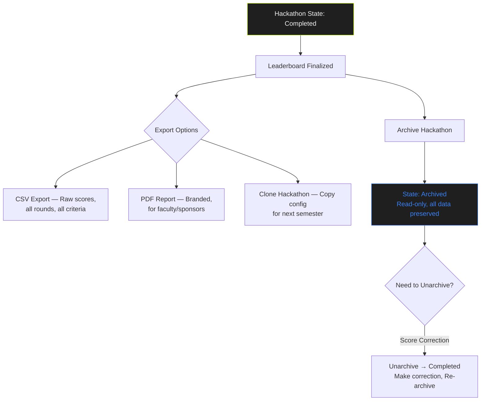

---

### Journey 3: Nikhil — The Judge

Nikhil's flow is the most linear: **Accept Invitation → Score Assignments → Done**.

#### Flow 3A: Judge Onboarding & Assignment

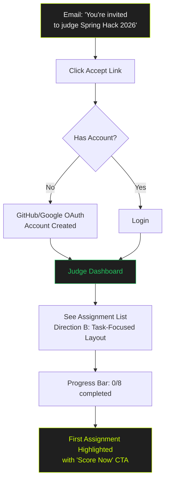

#### Flow 3B: Scoring Interaction (Full-Screen Per-Team)

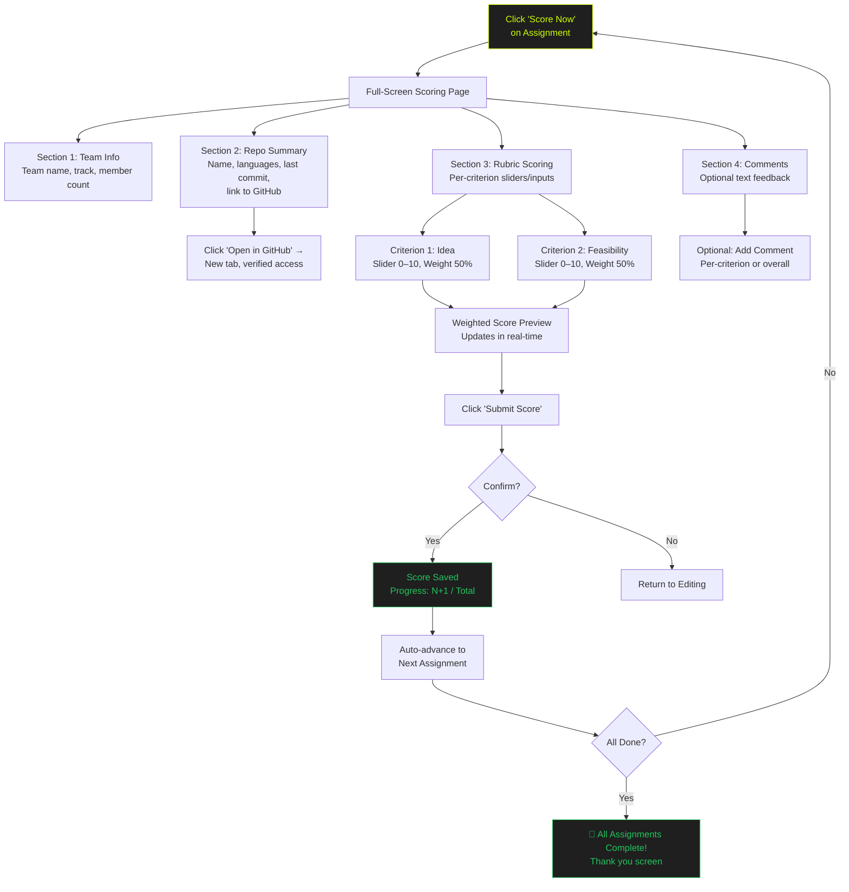

**Key UX Decisions:**
- **Full-screen per team:** No distractions — judge focuses on one team at a time
- **Repo summary card:** Name, language stats (bar chart), last commit date/SHA — quick context without leaving the page
- **"Open in GitHub" in new tab:** Verified access via GitHub App — no broken links, no access requests
- **Real-time weighted score preview:** Judge sees the composite score update as they adjust sliders
- **Auto-advance after scoring:** Submit → next assignment appears automatically — "Task List to Zero" principle
- **Multi-session persistence:** Close tab at 4/8, return next day to see "4/8 completed" — pick up instantly
- **Completion celebration:** Brief "All done!" screen after last assignment — "Progress Is Reward" principle

---

### Journey 4: Srijan — The Platform Admin

Srijan's flow centers on the request queue at `shikdd.devsage.org`.

#### Flow 4A: Request Processing Queue

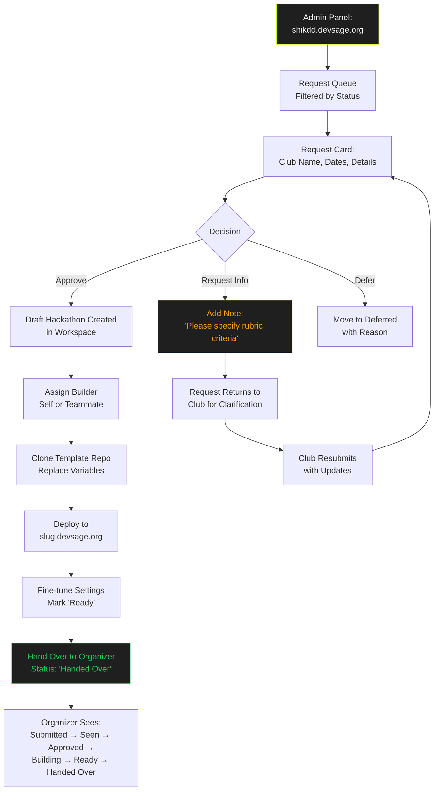

#### Flow 4B: Active Hackathon Monitoring

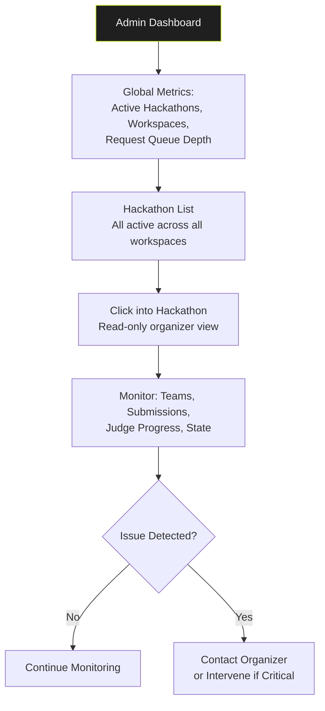

**Key UX Decisions:**
- **Request queue as primary view:** Admin panel opens directly to the queue — no dashboard overhead
- **Three-action decision:** Approve, Request Info, or Defer — clear, fast, no ambiguity
- **Status roadmap visible to organizer:** Every status transition timestamped — trust through transparency
- **Builder assignment:** Admin assigns self or teammate — supports future team scaling
- **Read-only hackathon view:** Admin can monitor any active hackathon without risk of accidental changes

---

### Journey Patterns

Across all 4 journeys, these reusable patterns emerge:

#### Pattern: Progressive Status Roadmap
Used by: Organizer (request tracking), Admin (processing pipeline), Participant (submission pipeline)
- Horizontal pipeline showing ordered stages
- Each stage shows: name, completion status, timestamp
- Current stage highlighted with lime accent
- Future stages dimmed but visible — user always knows what comes next

#### Pattern: Task List to Zero
Used by: Judge (scoring assignments), Organizer (setup checklist)
- Items start as pending, active item highlighted
- Completed items visually recede (opacity 0.5, checkmark icon)
- Persistent progress bar at top
- Auto-advance to next item on completion
- Celebration micro-interaction on 100% completion

#### Pattern: Confirmation Receipt
Used by: Participant (submission), Organizer (publish), Admin (approve)
- Large hero icon (checkmark, rocket, etc.)
- Detail card with all relevant metadata
- Monospace for technical identifiers (SHA, tag, timestamps)
- Audit hash for institutional trust
- Clear "what happens next" guidance

#### Pattern: Error → Recovery Action
Used by: All personas
- Error messages are specific, never generic ("Invalid invite code" not "Something went wrong")
- Every error state includes a visible recovery action (retry button, alternative input, help link)
- Errors use the "Recovery, Not Apology" principle — lead with solution, not problem
- Example: "Submission not appearing? Enter commit SHA manually →"

#### Pattern: Contextual Inline Actions
Used by: Organizer (nudge judge), Admin (request info), Judge (open in GitHub)
- Actions appear in context where they're needed
- No navigation to separate pages for common actions
- Confirmations for destructive actions; immediate for safe actions

### Flow Optimization Principles

1. **Minimize steps to value:** Participant reaches "on a team" in < 3 minutes. Judge reaches "first score submitted" in < 5 minutes. Organizer reaches "hackathon published" in < 25 minutes.

2. **Reduce cognitive load at decision points:** Binary choices where possible (Approve/Deny). Sliders with numeric preview for scoring. Checklists instead of free-form configuration.

3. **Progress feedback at every step:** Toast for instant acknowledgment, full confirmation for record. Progress bars with fraction (5/8, not just a bar). Pipeline stages with checkmarks.

4. **Error recovery without punishment:** Late submissions accepted (flagged, not rejected). Manual SHA upload as webhook failure fallback. "Request Info" instead of "Reject" for incomplete requests.

5. **Multi-session continuity:** Judge progress persists across sessions. Organizer checklist saves state. Admin queue maintains position. No "start over" scenarios.

---

## 11. Component Strategy

### Design System Components (shadcn/ui — Use As-Is)

| Category | Components | DevSage Usage |
|---|---|---|
| **Inputs** | Button, Input, Select, Textarea, Switch, Checkbox, Slider | Forms, config, scoring, settings |
| **Layout** | Card, Separator, Tabs, Accordion, Sheet | Dashboard panels, sections, mobile drawers |
| **Data Display** | Table/DataTable, Badge, Avatar, Skeleton | Teams list, status, user avatars, loading |
| **Feedback** | Toast (Sonner), Progress, Tooltip, Alert | Notifications, progress bars, help text |
| **Overlay** | Dialog, Popover, Dropdown Menu, Command | Modals, actions, search, quick nav |
| **Form** | Form (react-hook-form + Zod), Label | All validated forms across all apps |

### Custom Components (`@devsage/ui`)

All 12 custom components live in the `@devsage/ui` shared package, built on shadcn/ui primitives and DevSage design tokens.

---

#### 1. StatePipeline

**Purpose:** Visualizes the hackathon 5-state lifecycle as a horizontal pipeline. The primary navigation anchor for organizers — always visible, always accurate.

**Anatomy:**
- 5 pipeline segments: `Draft → Active → Judging → Completed → Archived`
- Connecting arrows between segments
- Optional: "Advance" action button on current state

**States:**
| State | Visual |
|---|---|
| `completed` | Green background, checkmark icon, solid border |
| `current` | Lime background + lime glow, dot icon, pulsing border |
| `future` | Gray background, no icon, dashed border |
| `error` | Red background, warning icon (e.g., failed transition) |

**Variants:**
- `full` — All 5 states with labels (desktop)
- `compact` — Current state + next state only (mobile)
- `readonly` — No action button (admin monitoring view)
- `interactive` — "Advance" button on current state (organizer view)

**Accessibility:**
- `role="progressbar"` with `aria-valuenow` (current step index) and `aria-valuemax` (5)
- Each step has `aria-label` describing state name and status
- Keyboard: Arrow keys navigate between steps, Enter activates "Advance" on current

**Interaction:**
- Click on current state → shows "Advance to [next state]?" confirmation dialog
- Click on completed state → shows timestamp of transition
- Hover on any state → tooltip with transition details

---

#### 2. SubmissionPipeline

**Purpose:** Shows the real-time processing pipeline for a single submission. Makes the invisible visible — webhook receipt, HMAC verification, submission creation.

**Anatomy:**
- 4 pipeline stages: `Tag Pushed → Webhook Received → HMAC Verified → Submission Created`
- Left border color indicating overall status
- Metadata row: SHA, timestamp, on-time status

**States:**
| Stage State | Visual |
|---|---|
| `completed` | Green, checkmark |
| `processing` | Lime, animated pulse |
| `pending` | Gray, empty |
| `failed` | Red, X icon |
| `late` | Amber, warning icon |

**Variants:**
- `expanded` — Full pipeline with metadata (submission detail view)
- `collapsed` — Status badge only (submission list row)
- `participant` — Simplified: "Processing..." → "Confirmed ✓" (participant site)

**Accessibility:**
- `role="status"` with `aria-live="polite"` for real-time updates
- Each stage has descriptive `aria-label`

**Interaction:**
- Stages animate from left to right as processing completes
- Failed stage shows error details on click/hover
- "Manual upload" fallback link appears if pipeline stalls > 30 seconds

---

#### 3. MetricCard

**Purpose:** Displays a single KPI with large number, label, trend indicator. The at-a-glance information unit for dashboards.

**Anatomy:**
- Uppercase label (12px, gray)
- Hero value (28px, bold, color varies by state)
- Trend line/text (12px, directional arrow + delta)

**States:**
| State | Value Color | Trend Color |
|---|---|---|
| `normal` | White | Green (positive) or gray |
| `warning` | Amber | Amber |
| `critical` | Red | Red |
| `highlight` | Lime | Lime |

**Variants:**
- `default` — Number value (e.g., "15 Teams")
- `percentage` — Percentage with progress bar underneath
- `countdown` — Live countdown timer (e.g., "2h 15m")
- `compact` — Smaller, for sidebar quick stats

**Accessibility:**
- `role="status"` with `aria-label` combining label + value + trend
- Countdown variant uses `aria-live="polite"` for periodic updates

**Interaction:**
- Click → navigates to detail view (e.g., metric card "Teams" → Teams list)
- Hover → shows extended info tooltip (e.g., "15 registered, 12 with repos linked")

---

#### 4. ActivityFeedItem

**Purpose:** A single event in the activity timeline. Color-coded avatar, narrative text, optional code block, timestamp.

**Anatomy:**
- Color-coded avatar circle (32px) with icon
- Text block: `<Actor> <action> <target>` format
- Optional: code/detail block (monospace)
- Timestamp (monospace, relative + absolute)

**Event Types & Colors:**
| Event | Avatar Color | Icon |
|---|---|---|
| Submission | Green | ✓ |
| Score | Lime | ⚖ |
| Team Activity | Blue | 👥 |
| Warning | Amber | ⚠ |
| Error | Red | ✗ |
| System | Gray | ⚙ |

**Variants:**
- `default` — Full feed item with all elements
- `compact` — Icon + one-line text + relative time (dense feed)
- `grouped` — Multiple events from same actor collapsed

**Accessibility:**
- Feed uses `role="feed"` container, items use `role="article"`
- `aria-label` on each item describing full event text
- New items announced via `aria-live="polite"` on feed container

**Interaction:**
- Click on actor name → navigate to actor profile/detail
- Click on target → navigate to target (team, submission, etc.)
- New items prepend with subtle fade-in animation

---

#### 5. TaskListItem

**Purpose:** A single judge assignment in the "Task List to Zero" pattern. Shows completion status, team info, and score or CTA.

**Anatomy:**
- Circular check indicator (left)
- Team name + meta info (center)
- Score display or "Score Now" button (right)

**States:**
| State | Visual |
|---|---|
| `pending` | Empty circle, full opacity, "Pending" badge |
| `active` | Lime border circle + arrow icon, lime glow background, "Score Now" CTA |
| `completed` | Green filled circle + checkmark, opacity 0.5, score displayed |
| `skipped` | Gray circle + dash, opacity 0.3, "Reassigned" badge |

**Variants:**
- `default` — Standard list item
- `expanded` — Shows rubric criteria preview inline

**Accessibility:**
- List uses `role="list"`, items use `role="listitem"`
- Active item has `aria-current="step"`
- Completed items include score in `aria-label`
- "Score Now" button has `aria-label="Score [Team Name]"`

**Interaction:**
- Click on active item → opens full-screen scoring page
- Click on completed item → opens score review (read-only)
- Keyboard: Arrow keys navigate list, Enter opens active item

---

#### 6. SubmissionReceipt

**Purpose:** The "Push and See" confirmation moment. A receipt-style card showing all verification details of a confirmed submission. This is the most emotionally important component.

**Anatomy:**
- Hero success icon (80px checkmark circle)
- Title: "Submission Received!"
- Subtitle: "Your team's work has been recorded and timestamped"
- Detail card: Team, Tag (mono/lime), Commit SHA (mono), Timestamp (mono), Status badge
- Footer: Submission count, final submission indicator, audit hash

**States:**
| State | Hero Icon | Border |
|---|---|---|
| `confirmed_ontime` | Green checkmark | Green left border |
| `confirmed_late` | Amber clock | Amber left border |
| `processing` | Lime spinner | Lime left border |
| `failed` | Red X + recovery link | Red left border |

**Variants:**
- `full` — Complete receipt with all details (confirmation page)
- `toast` — Abbreviated: "Submission received! ✓" (toast notification)
- `card` — Compact receipt in submission history list

**Accessibility:**
- `role="alert"` on initial display (screen reader announces immediately)
- All monospace identifiers have `aria-label` (e.g., "Commit SHA: a3f8c2d")
- Status badge has descriptive `aria-label` (e.g., "Status: submitted on time")

**Interaction:**
- Appears with entrance animation (scale up from center, lime glow pulse)
- Reduced motion: instant display, no animation
- "View submission history" link below receipt

---

#### 7. SetupChecklist

**Purpose:** Non-linear configuration checklist for hackathon setup. Shows what's complete and what's remaining.

**Anatomy:**
- Ordered list of checklist items
- Each item: checkbox icon, title, subtitle, status badge
- Overall progress indicator at top

**States per item:**
| State | Icon | Visual |
|---|---|---|
| `complete` | Green check | Dimmed text, "✓ Configured" badge |
| `in_progress` | Lime dot | Full brightness, "Editing" badge |
| `pending` | Gray circle | Normal text, "Required" badge |
| `optional` | Gray circle | Normal text, "Optional" badge |
| `blocked` | Red lock | Dimmed, "Requires [dependency]" text |

**Variants:**
- `vertical` — Full checklist (desktop setup page)
- `horizontal` — Step indicator bar (wizard header)

**Accessibility:**
- `role="list"` with `aria-label="Setup checklist, N of M complete"`
- Each item has `aria-label` with name + status
- Blocked items explain dependency in `aria-description`

**Interaction:**
- Click on item → navigates to configuration page for that item
- Items completable in any order (unless blocked by dependency)
- Progress updates in real-time as items are completed

---

#### 8. ScoreSlider

**Purpose:** Dual-input scoring control — drag slider OR type number. Shows real-time weighted score preview. The most-used interactive component for judges.

**Anatomy:**
- Criterion label + weight badge (e.g., "Idea — 50%")
- Horizontal slider track (0–10 range, 0.5 step)
- Numeric input field (synced with slider)
- Weighted contribution preview (e.g., "→ 4.5 weighted")

**States:**
| State | Visual |
|---|---|
| `default` | Gray track, no value |
| `active` | Lime thumb + filled track, value displayed |
| `submitted` | Green filled track, read-only |
| `error` | Red border on input (out of range) |

**Variants:**
- `default` — Slider + numeric input + weight preview
- `readonly` — Score display only (review mode)
- `compact` — Smaller, without weight preview (summary view)

**Accessibility:**
- Slider: `role="slider"`, `aria-valuemin="0"`, `aria-valuemax="10"`, `aria-valuenow`
- `aria-label="Score for [criterion name], weight [percentage]"`
- Keyboard: Arrow keys adjust by 0.5, Page Up/Down by 1.0
- Numeric input: `type="number"`, `step="0.5"`, `min="0"`, `max="10"`

**Interaction:**
- Dragging slider updates numeric input in real-time
- Typing number updates slider position in real-time
- Weighted contribution recalculates on every change
- Tab order: slider → input → next criterion

---

#### 9. RepoSummaryCard

**Purpose:** Quick-glance GitHub repository context for judges. Shows enough to orient without leaving the scoring page.

**Anatomy:**
- Repository name (bold) with GitHub icon
- Language stats bar (colored segments by language %)
- Last commit: SHA + relative time + author
- "Open in GitHub" button (opens new tab)

**States:**
| State | Visual |
|---|---|
| `loaded` | Full content displayed |
| `loading` | Skeleton placeholder |
| `error` | "Repository unavailable" with retry link |
| `private` | Lock icon + "Private repository" label |

**Variants:**
- `default` — Full card with all details
- `compact` — Repo name + language bar + link only

**Accessibility:**
- `aria-label="Repository summary for [repo name]"`
- Language bar segments have `aria-label` (e.g., "Python 45%, JavaScript 35%")
- "Open in GitHub" has `aria-label="Open [repo name] in GitHub, opens in new tab"`

**Interaction:**
- "Open in GitHub" → new tab, verified read-only access via GitHub App
- Hover on language segment → tooltip with language name + percentage
- Click on commit SHA → link to commit on GitHub

---

#### 10. StatusRoadmap

**Purpose:** Tracks the lifecycle of a request/process through ordered stages with timestamps. Used for hackathon request tracking.

**Anatomy:**
- Vertical timeline with stage markers
- Each marker: stage name, status icon, timestamp
- Connecting line between stages (solid=complete, dashed=future)

**States per stage:**
| State | Icon | Line |
|---|---|---|
| `completed` | Green check | Solid green |
| `current` | Lime pulse | Dashed lime |
| `future` | Gray dot | Dashed gray |
| `rejected` | Red X | Solid red (terminated) |

**Variants:**
- `vertical` — Full timeline (detail view)
- `horizontal` — Compact bar (list row)
- `mini` — Current stage badge only

**Accessibility:**
- `role="progressbar"` with step values
- Each stage has `aria-label` with name + status + timestamp

**Interaction:**
- Hover on completed stage → shows exact timestamp + actor who triggered transition
- Click on current stage → shows expected next action

---

#### 11. CountdownTimer

**Purpose:** Live countdown to deadline. Changes urgency color as time decreases.

**Anatomy:**
- Time remaining (large, e.g., "2h 15m" or "02:15:32")
- Label (small, e.g., "R1 Deadline")
- Absolute date/time below (mono, e.g., "Feb 20, 11:59 PM IST")

**States:**
| Time Remaining | Color |
|---|---|
| > 24 hours | White (calm) |
| 2–24 hours | Lime (attention) |
| 30 min – 2 hours | Amber (urgency) |
| < 30 minutes | Red (critical, pulse animation) |
| Expired | Red, "ENDED" text |

**Variants:**
- `hero` — Large countdown for dashboard metric card
- `inline` — Small, fits in a table cell or header bar
- `banner` — Full-width bar at top of participant site

**Accessibility:**
- `role="timer"` with `aria-label` describing remaining time
- `aria-live="polite"` — announces time changes every 5 minutes (not every second)
- Critical state (< 30 min): `aria-live="assertive"` for single announcement

**Interaction:**
- Updates every second (visual), announced every 5 minutes (screen reader)
- Pulse animation in critical state (respects `prefers-reduced-motion`)

---

#### 12. LeaderboardRow

**Purpose:** A single team's ranking in the leaderboard. Shows rank, team, score, and optional per-round breakdown.

**Anatomy:**
- Rank number (large, bold)
- Team avatar + name
- Total score (large, right-aligned)
- Optional: per-round score chips
- Optional: advancement badge (Advanced / Eliminated)

**States:**
| State | Visual |
|---|---|
| `default` | Normal row |
| `highlighted` | Lime left border (user's own team) |
| `eliminated` | Red strike-through, opacity 0.5 |
| `advanced` | Green "Advanced" badge |
| `top3` | Gold/silver/bronze rank icon |

**Variants:**
- `full` — All details including per-round breakdown
- `compact` — Rank + name + score only
- `spectator` — Public view, no per-round details

**Accessibility:**
- Table row with `aria-label="Rank [N], Team [name], Score [score]"`
- Highlighted row has `aria-current="true"`
- Eliminated teams have `aria-label` suffix "eliminated"

**Interaction:**
- Click on team → expand to show per-round scores (if authorized)
- Hover on rank → tooltip with rank change since last round
- Public leaderboard auto-refreshes with new scores

---

### Component Implementation Strategy

**Package Structure:** All 12 components in `@devsage/ui`

```
packages/ui/
├── src/
│   ├── components/
│   │   ├── state-pipeline.tsx
│   │   ├── submission-pipeline.tsx
│   │   ├── metric-card.tsx
│   │   ├── activity-feed-item.tsx
│   │   ├── task-list-item.tsx
│   │   ├── submission-receipt.tsx
│   │   ├── setup-checklist.tsx
│   │   ├── score-slider.tsx
│   │   ├── repo-summary-card.tsx
│   │   ├── status-roadmap.tsx
│   │   ├── countdown-timer.tsx
│   │   └── leaderboard-row.tsx
│   ├── tokens/
│   │   ├── colors.ts
│   │   ├── typography.ts
│   │   └── spacing.ts
│   ├── hooks/
│   │   ├── use-countdown.ts
│   │   └── use-reduced-motion.ts
│   └── index.ts           # Barrel export with .js extensions
├── package.json
└── tsconfig.json           # extends @devsage/config/react
```

**Build approach:**
- Components built with shadcn/ui primitives (Slider, Badge, Card, Progress) + custom composition
- All design tokens from `tokens/` — no hardcoded values
- CVA (class-variance-authority) for variant management
- `cn()` utility for className merging
- Tree-shakeable ESM exports

### Implementation Roadmap

**Phase 1 — Critical Path Components (blocks judge + participant flows):**
1. `SubmissionReceipt` — needed for the "Push and See" magic moment
2. `SubmissionPipeline` — needed for submission transparency
3. `ScoreSlider` — needed for judge scoring interaction
4. `TaskListItem` — needed for judge assignment list
5. `RepoSummaryCard` — needed for judge context

**Phase 2 — Organizer Dashboard Components:**
6. `StatePipeline` — needed for hackathon lifecycle visualization
7. `MetricCard` — needed for dashboard KPIs
8. `ActivityFeedItem` — needed for real-time event feed
9. `SetupChecklist` — needed for hackathon configuration flow
10. `CountdownTimer` — needed for deadline visibility

**Phase 3 — Supporting Components:**
11. `StatusRoadmap` — needed for request tracking
12. `LeaderboardRow` — needed for results display

---

## 12. UX Consistency Patterns

> Rules for how DevSage behaves in common situations. Every button, error, form, and navigation should feel predictable across all 3 apps.

### Button Hierarchy

**3-tier system:** Primary → Secondary → Destructive

| Tier | Visual | Use Case | Example |
|---|---|---|---|
| **Primary** | Solid lime (#CCFF00) background, black text | The ONE main action on the screen | "Score Now", "Publish", "Submit", "Approve" |
| **Secondary (Ghost)** | Transparent, white text, gray border | Alternative actions, back navigation | "Cancel", "Back", "Send Nudge", "Export CSV" |
| **Destructive** | Transparent, red text, red border (hover: red fill) | Irreversible or high-impact actions | "Delete Hackathon", "Remove Judge", "Finalize Round" |

**Button Rules:**
- **One primary per screen.** If two actions compete for attention, the less important one is secondary
- **Destructive buttons require confirmation dialog** — never instant-execute
- **Icon + text** preferred over icon-only (except well-known icons: ×, ←, →)
- **Loading state:** Replace text with spinner + "Processing..." — disable all buttons in the group
- **Minimum touch target:** 44×44px on mobile, 36×36px on desktop
- **Button order:** Primary right, Secondary left (forms). Destructive always isolated (e.g., bottom of page or inside danger zone)

### Feedback Patterns

**Sonner toasts for ALL transient feedback.** Positioned bottom-right on desktop, bottom-center on mobile.

| Type | Icon | Duration | Color |
|---|---|---|---|
| **Success** | ✓ checkmark | 4 seconds | Green border + icon |
| **Error** | ✗ cross | 8 seconds (longer to read) | Red border + icon |
| **Warning** | ⚠ triangle | 6 seconds | Amber border + icon |
| **Info** | ℹ circle | 4 seconds | Blue border + icon |
| **Loading** | Spinner | Until complete | Lime border + icon |

**Toast Rules:**
- **Max 3 toasts visible** at once — older toasts dismissed
- **Toasts are dismissible** with × button (don't force users to wait)
- **Action toasts** include an inline button (e.g., "Submission received ✓ — View receipt →")
- **Never use toasts for critical errors** that require user action — use a dialog instead
- **Screen reader:** Toasts announced via `aria-live="polite"` region

**Non-Toast Feedback:**
- **Persistent banners** for site-wide announcements (e.g., "Hackathon deadline in 2 hours")
- **Confirmation dialogs** for destructive actions (with explicit "Delete" / "Cancel" buttons)
- **Inline validation messages** on form fields (see Form Patterns)

### Form Patterns

**Validation approach:** Real-time inline validation — validate as user types/leaves field.

**Validation Rules:**
- **On blur:** Validate when user leaves a field (not on every keystroke — avoid annoying partial input errors)
- **On change for selects/toggles:** Validate immediately when selection changes
- **Error messages appear below the field** in red text with error icon
- **Success indicator:** Green checkmark appears next to valid fields (only for fields with complex validation, e.g., tag patterns)
- **Submit button disabled** until all required fields pass validation

**Form Layout:**
- **Single-column layout** for all forms — never side-by-side fields (except name: first + last)
- **Labels above fields** (not floating labels — better for accessibility)
- **Required indicator:** Red asterisk (*) next to label
- **Help text:** Gray text below field for guidance (e.g., "Tag pattern supports % as wildcard")
- **Field grouping:** Related fields grouped with subtle separator + group label

**Zod Integration:**
- All form schemas defined in `@devsage/shared` as Zod schemas
- React Hook Form with `@hookform/resolvers/zod` for client-side validation
- Server-side validation uses same Zod schemas — guaranteed consistency

### Navigation Patterns

**Platform + Admin Apps (authenticated):**
- **Sidebar navigation** (collapsible on mobile → hamburger)
- **Hackathon-scoped context:** Top of sidebar shows current hackathon name + state pipeline
- **Section icons + text labels** — never icon-only in sidebar
- **Active state:** Lime left border + lime text + lime glow background
- **Mobile:** Sidebar becomes bottom tab bar for top-level navigation, sub-navigation in sheet drawers

**Web App + Participant Sites (public/mixed):**
- **Top bar navigation** with centered logo, right-aligned auth controls
- **Page-level navigation** via URL routing (no sidebar needed — simpler IA)
- **Active state:** Lime underline on active tab

**Breadcrumbs:**
- Used in Platform + Admin when navigating into detail views (e.g., Hackathon → Teams → NeuralNinjas)
- Not used in Web app (flat navigation)

**Back Navigation:**
- Ghost button with ← arrow, always top-left of content area
- Never rely solely on browser back — explicit back button on every detail page

### Modal & Overlay Patterns

**Dialog (Modal):**
- **When to use:** Confirmations, destructive actions, focused input (e.g., invite judge)
- **Never for:** Information display (use pages), multi-step flows (use wizard pages)
- **Overlay:** Semi-transparent black (rgba(0,0,0,0.6))
- **Size:** Small (400px) for confirmations, Medium (560px) for forms, never full-screen
- **Focus trap:** Radix Dialog handles this — Tab cycles within modal
- **Close:** × button + Escape key + click outside (except destructive confirmation: no click-outside)
- **Mobile:** Dialogs become full-width bottom sheets (Sheet component)

**Sheet (Drawer):**
- **When to use:** Mobile navigation, secondary panels, filters
- **Direction:** Bottom on mobile, right on desktop
- **Size:** 80% of viewport height on mobile

**Popover:**
- **When to use:** Quick actions, contextual info, inline editing
- **Trigger:** Click (not hover — better for touch and accessibility)
- **Position:** Auto-placement with Radix, preference for bottom-start

### Empty & Loading States

**Empty States:**
- **Never show a blank page.** Every empty state has:
  1. Illustrative icon (Lucide icon, 48px, gray)
  2. Heading (what's empty)
  3. Description (why it's empty + what to do)
  4. Action button (primary CTA to resolve emptiness)
- **Examples:**
  - Teams list empty: "No teams yet" + "Teams will appear here once participants register" + [Share Registration Link]
  - Submissions empty: "No submissions received" + "Submissions appear automatically when teams push git tags" + [View Tag Instructions]
  - Judge assignments empty: "No assignments yet" + "The organizer will assign submissions for you to score"

**Loading States:**
- **Skeleton screens** for page-level loading (Skeleton component from shadcn/ui)
- **Spinner + text** for action loading (button loading state)
- **Progressive loading:** Show available content immediately, skeleton for loading sections
- **Never show spinners for > 10 seconds** without progress indication or retry option
- **Error after 30 seconds:** Show timeout error with retry button

**Error States:**
- **Page-level error:** Centered error icon + "Something went wrong" + specific error message + retry button
- **Network error:** "Unable to connect. Check your connection and try again." + auto-retry after 5 seconds
- **404:** "Page not found" + navigation suggestions + link to dashboard
- **All error states follow "Recovery, Not Apology" principle** — lead with the solution

### Search & Filtering Patterns

**Search:**
- **Instant search** with debounce (300ms) — results update as user types
- **Search input:** Magnifying glass icon + placeholder text describing scope (e.g., "Search teams...")
- **No results:** "No results for '[query]'" + suggestion to broaden search or check spelling
- **Keyboard shortcut:** Cmd/Ctrl+K opens Command palette (global search via shadcn Command component)

**Filtering:**
- **Filter bar** above data tables — horizontal chips/dropdowns
- **Active filters** shown as dismissible chips with × button
- **Filter types:** Status dropdown, date range picker, text search
- **URL-synced:** Filter state stored in URL params (shareable, bookmarkable)
- **Reset:** "Clear all filters" link when any filter is active
- **Mobile:** Filters collapse into a "Filters" sheet/drawer

**Sorting:**
- **Table headers are clickable** for sorting — arrow indicator shows direction
- **Default sort:** Most recently created/updated (descending)
- **Multi-column sort:** Not supported — keep it simple

**Pagination:**
- **Offset-based** with limit/offset params (default 20 per page)
- **Controls:** Previous / Next buttons + "Showing 1–20 of 42"
- **Mobile:** Load more button instead of pagination (simpler)
- **Preserve state:** Page position maintained when returning from detail view

---

## 13. Responsive Design & Accessibility

### Responsive Strategy

**Approach:** Adaptive — mobile-first for participant-facing surfaces, desktop-first for management tools.

| App | Approach | Primary Device | Rationale |
|---|---|---|---|
| **Web** (devsage.org) | Mobile-first | Phone → Desktop | Participants discover via WhatsApp links on mobile |
| **Participant Sites** ({slug}.devsage.org) | Mobile-first | Phone → Desktop | Same as Web — WhatsApp/social media discovery |
| **Platform** (platform.devsage.org) | Desktop-first | Desktop → Tablet → Phone | Organizers and judges work on desktops primarily |
| **Admin** (shikdd.devsage.org) | Desktop-first | Desktop only | Admin operations are desktop workflows |

### Breakpoint Strategy

Using Tailwind CSS v4 defaults — battle-tested, well-documented, supported by all component libraries:

| Breakpoint | Width | Usage |
|---|---|---|
| `default` | 0–639px | Mobile (phone portrait) |
| `sm` | 640px+ | Mobile landscape / small tablet |
| `md` | 768px+ | Tablet portrait |
| `lg` | 1024px+ | Tablet landscape / small desktop |
| `xl` | 1280px+ | Desktop |
| `2xl` | 1536px+ | Large desktop / widescreen |

**Key Adaptation Points:**

| Component | Mobile (<768) | Tablet (768–1023) | Desktop (1024+) |
|---|---|---|---|
| **Sidebar** | Bottom tab bar (5 items max) | Collapsed icon sidebar | Full sidebar with labels |
| **Data Tables** | Card list view | Scrollable table | Full table with all columns |
| **Metric Cards** | 2×2 grid | 2×2 grid | 4×1 row |
| **StatePipeline** | Current + next only (compact) | Full 5 states (compact) | Full 5 states with labels |
| **Activity Feed** | Full width, no sidebar | Full width, no sidebar | Feed + sidebar layout |
| **Score Slider** | Stacked: slider above input | Side by side | Side by side with preview |
| **Dialogs** | Full-width bottom sheet | Centered modal | Centered modal |
| **Navigation** | Hamburger + bottom tabs | Top bar + collapsible sidebar | Sidebar always visible |

### Device-Specific Adaptations

**Mobile (< 768px):**
- Touch targets: 44×44px minimum on all interactive elements
- Bottom sheet for all overlays (no centered modals)
- Swipe gestures: swipe right on task list item to quick-score (judge)
- Pull-to-refresh on activity feed and submission list
- Sticky headers on long pages (never lose context)
- No hover states — all interactions are tap-based
- Load more button instead of pagination

**Tablet (768–1023px):**
- Touch-optimized but can show more content
- Split view where useful (e.g., team list + detail)
- Same bottom sheet pattern for overlays

**Desktop (1024+):**
- Hover states enabled (border glow, preview on hover)
- Keyboard shortcuts active (Cmd/Ctrl+K for search, arrow keys for navigation)
- Higher information density (more columns, smaller spacing)
- Sidebar always visible on Platform and Admin

### Accessibility Strategy — WCAG AA

**Target:** WCAG 2.1 Level AA compliance across all apps.

#### Color & Contrast

- **Normal text:** Minimum 4.5:1 contrast ratio against background
- **Large text (≥18px bold or ≥24px):** Minimum 3:1 contrast ratio
- **Interactive elements:** Minimum 3:1 contrast ratio against adjacent colors
- **Lime (#CCFF00) on dark:** 14.4:1 contrast ratio ✓ (passes AA and AAA for all sizes)
- **Gray text (#666 on #000):** 3.9:1 — **fails AA for normal text.** Use #888 (5.1:1) minimum for body text
- **Status colors:** Never rely solely on color — always pair with icon (✓, ✗, ⚠, ℹ)

#### Keyboard Navigation

- **All interactive elements** reachable via Tab key
- **Focus order** follows visual reading order (top-left to bottom-right)
- **Focus indicators:** 2px solid lime outline with 2px offset — always visible, never removed
- **Skip links:** "Skip to main content" link visible on Tab (first focusable element on every page)
- **Escape key:** Closes any overlay (dialog, sheet, popover, dropdown)
- **Arrow keys:** Navigate within groups (tabs, radio, menu items, task list, slider)
- **Enter/Space:** Activate buttons, links, and interactive elements

#### Screen Reader Support

- **Semantic HTML:** Use `<nav>`, `<main>`, `<aside>`, `<header>`, `<footer>`, `<section>`, `<article>` for page landmarks
- **Headings hierarchy:** One `<h1>` per page, proper nesting (h1 → h2 → h3, no skipping levels)
- **ARIA landmarks:** `role="banner"`, `role="navigation"`, `role="main"`, `role="contentinfo"`
- **Live regions:** `aria-live="polite"` for toasts, feed updates, countdown changes
- **Custom components:** All 12 `@devsage/ui` components have full ARIA support (documented per component in Section 11)
- **Radix UI:** Provides ARIA-correct behavior for all shadcn/ui primitives — dialog focus trapping, menu navigation, etc.

#### Motion & Animation

- **Respect `prefers-reduced-motion`:**
  - When set: disable all GSAP animations, Framer Motion transitions, lime glow pulses, auto-scrolling
  - Keep: opacity changes, color transitions (these are not motion)
- **No essential information conveyed through animation alone**
- **Auto-playing animations:** None in DevSage — all animations are triggered by user action

#### Forms & Inputs

- **All form fields have visible labels** (not placeholder-only)
- **Required fields:** Indicated with red asterisk (*) AND `aria-required="true"`
- **Error messages:** Associated with fields via `aria-describedby`
- **Error announcement:** Errors announced via `aria-live="assertive"` when validation fails
- **Autocomplete attributes** on standard fields (name, email) for autofill support

### Testing Strategy

**Automated Testing:**
- **axe-core** via `@axe-core/react` in development (highlights violations in browser console)
- **eslint-plugin-jsx-a11y** — catches common ARIA and accessibility issues at lint time
- **Lighthouse Accessibility audit** as part of CI (target: 90+ score)

**Manual Testing:**
- **Keyboard-only navigation test** on every new page/feature — Tab through entire flow without mouse
- **Screen reader testing** with VoiceOver (macOS/iOS) and NVDA (Windows) for critical flows
- **Color contrast check** with browser DevTools or Contrast Checker extension
- **Zoom testing:** All pages usable at 200% browser zoom (no horizontal scrolling)

**Device Testing:**
- **Real devices:** iPhone (Safari), Android (Chrome), iPad (Safari)
- **Browser matrix:** Chrome, Firefox, Safari, Edge (latest 2 versions)
- **Screen sizes:** Test at each breakpoint boundary (639px, 640px, 767px, 768px, 1023px, 1024px)

### Implementation Guidelines

**CSS Approach:**
- Use Tailwind utility classes with responsive prefixes (`sm:`, `md:`, `lg:`)
- Mobile-first apps: `className="grid grid-cols-1 md:grid-cols-2 lg:grid-cols-4"`
- Desktop-first apps: Use `max-md:` for mobile overrides
- No `!important` — use Tailwind's specificity system
- Use `rem` for font sizes, `px` for borders and fine details

**HTML Structure:**
- Semantic elements over `<div>` — `<nav>`, `<main>`, `<section>`, `<article>`
- One `<h1>` per page, hierarchical heading structure
- Images: `alt` text required (empty `alt=""` for decorative images)
- Links: Descriptive text (not "click here"), `target="_blank"` includes `rel="noopener noreferrer"`

**Focus Management:**
- On route change: move focus to page heading or main content area
- On dialog open: focus first interactive element inside dialog
- On dialog close: return focus to trigger element
- Radix handles focus trapping — do not re-implement

**Dark Mode Considerations:**
- System preference detection via `prefers-color-scheme` media query
- User toggle stored in localStorage, overrides system preference
- DevSage default: dark mode (the primary brand experience)
- Ensure all states (error, warning, success) are legible in both modes
- Admin app: neutral dark with blue-gray tones (no lime glow)
