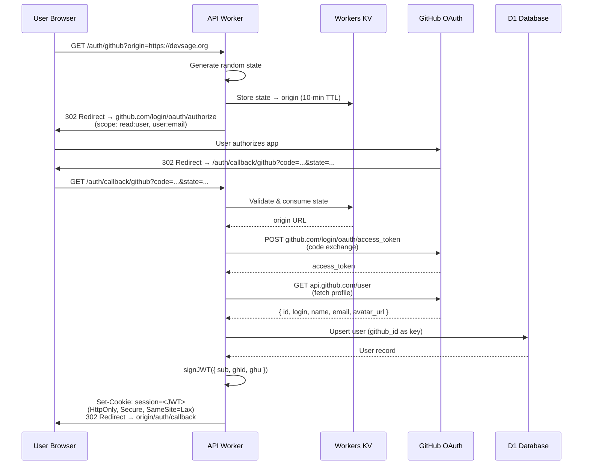
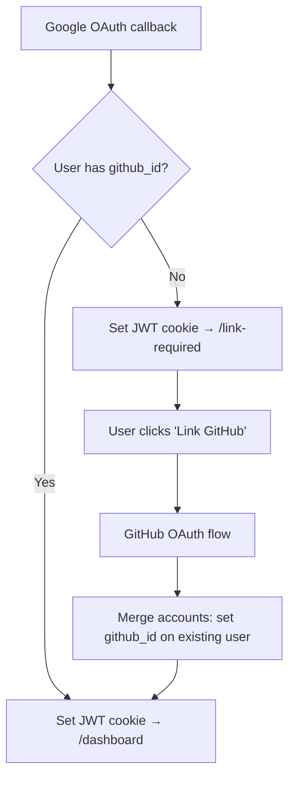
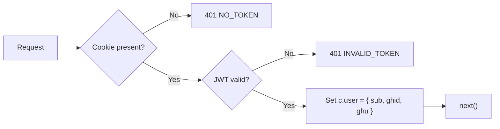
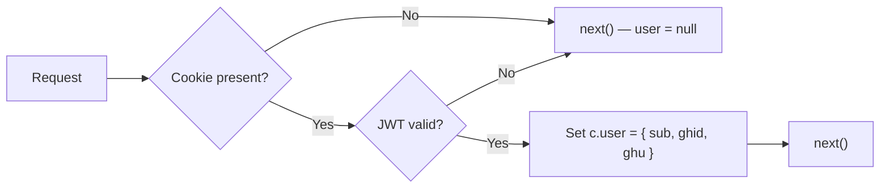
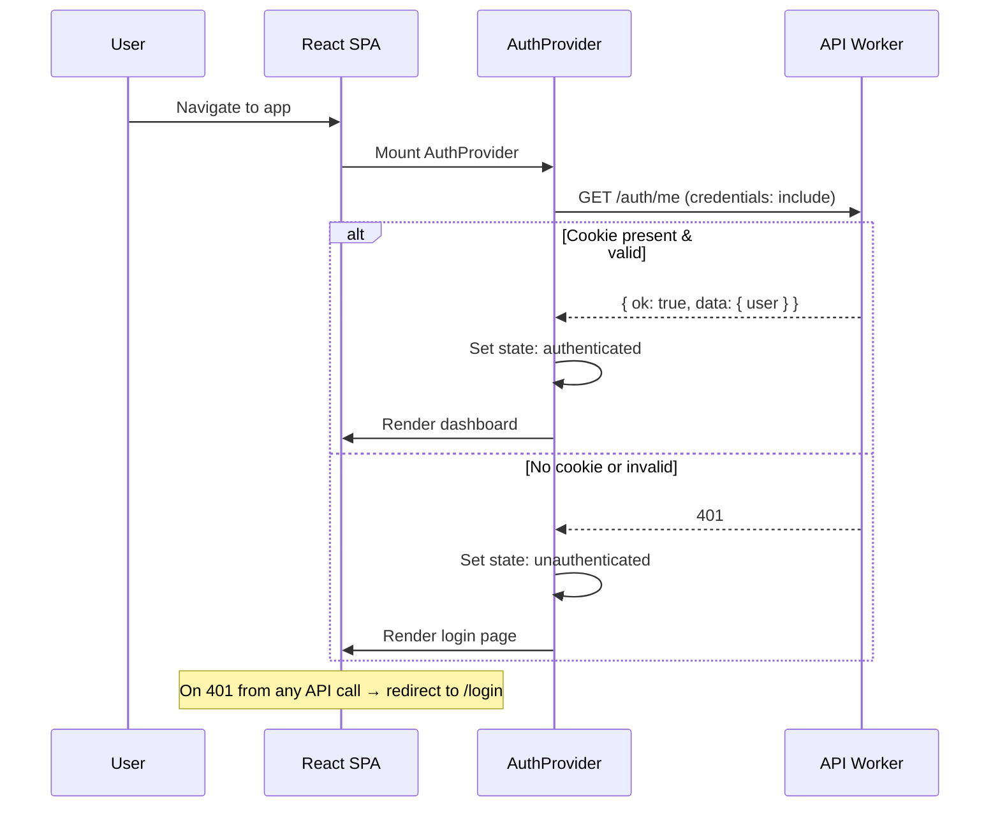

# 01 — Authentication & Sessions

> Manual OAuth 2.0 with GitHub (primary) and Google (secondary), stateless JWT in HttpOnly cookies, no external auth libraries.

**Related docs:** [Roles & Permissions](./06-roles-permissions.md) | [API Design](./11-api-design.md) | [Infrastructure](./12-infrastructure.md)

---

## Overview

DevSage uses a custom authentication system built entirely on Web Crypto APIs (`crypto.subtle`). No external JWT libraries. No `@hono/oauth-providers` (broken on Cloudflare Workers).

- **Providers**: GitHub (primary, required), Google (secondary, optional)
- **Token**: Stateless JWT stored in HttpOnly cookie
- **Session**: No server-side session state — JWT is self-contained
- **Roles**: NOT stored in JWT — resolved per-request per-hackathon (see [06-roles-permissions.md](./06-roles-permissions.md))

---

## OAuth 2.0 Flow

### GitHub OAuth (Primary)



### Google OAuth (Secondary)

Same flow but:
- Endpoint: `accounts.google.com/o/oauth2/v2/auth`
- Scope: `openid profile email`
- Token exchange: `oauth2.googleapis.com/token`
- Profile: decoded from ID token or `googleapis.com/oauth2/v2/userinfo`
- On callback: if user has no `github_id` → redirect to `/link-required` (GitHub is required for bot features)

### Account Linking

Users who sign in with Google first must link a GitHub account:



---

## JWT Token Design

### Payload Structure

```typescript
interface JWTPayload {
  sub: string;    // user.id (UUID)
  ghid: number;   // github_id
  ghu: string;    // github_username
  iat: number;    // issued at (Unix seconds)
  exp: number;    // expiry (Unix seconds)
}
```

### Implementation Details

| Property | Value |
|----------|-------|
| Algorithm | HMAC-SHA256 via `crypto.subtle` |
| Secret | `JWT_SECRET` (Worker secret) |
| Expiry | 7 days (604,800 seconds) |
| Storage | HttpOnly cookie named `session` |
| CSRF protection | `SameSite=Lax` (dev) / `SameSite=Strict` + `Secure` (prod) |
| Verification cost | ~0.5ms CPU per request |
| Server-side state | None (fully stateless) |

### What is NOT in the JWT

- **Roles** — resolved per-request per-hackathon via database query
- **Email** — may change; always fetch from DB
- **Display name** — may change; always fetch from DB
- **Permissions** — derived from roles at request time

---

## Cookie Configuration

```typescript
// Production
{
  httpOnly: true,
  secure: true,
  sameSite: 'Strict',
  path: '/',
  maxAge: 604800,         // 7 days
  domain: '.devsage.org'  // Shared across subdomains
}

// Development
{
  httpOnly: true,
  secure: false,
  sameSite: 'Lax',
  path: '/',
  maxAge: 604800
}
```

---

## Middleware Chain

### `authMiddleware` (strict)

Used on all protected routes. Rejects unauthenticated requests.



### `optionalAuth` (lenient)

Used on public routes that benefit from knowing the user (e.g., leaderboard visibility).



---

## Frontend Auth Flow



### AuthContext API

```typescript
const { user, isAuthenticated, isLoading, logout } = useAuth();
```

| Field | Type | Description |
|-------|------|-------------|
| `user` | `User \| null` | Current user object with `id`, `github_username`, `display_name`, etc. |
| `isAuthenticated` | `boolean` | Whether user is logged in |
| `isLoading` | `boolean` | True during initial `/auth/me` check |
| `logout()` | `() => Promise<void>` | Calls `POST /auth/logout`, clears state, redirects to `/` |

---

## Security Considerations

| Threat | Mitigation |
|--------|-----------|
| XSS token theft | HttpOnly cookie — JS cannot access |
| CSRF | `SameSite=Strict` (prod) + `Origin` header check on mutations |
| Token replay | 7-day expiry; no refresh tokens (user re-authenticates) |
| Timing attacks on JWT verify | `crypto.subtle` uses constant-time comparison internally |
| OAuth state forgery | Random state stored in KV with 10-min TTL, consumed on use |
| Account takeover | GitHub ID is the primary key; Google ID is optional secondary |

---

## File References

| File | Purpose |
|------|---------|
| `apps/api/src/routes/auth.ts` | OAuth routes (initiate, callback, /me, logout) |
| `apps/api/src/lib/jwt.ts` | `signJWT()`, `verifyJWT()` — HMAC SHA-256 |
| `apps/api/src/lib/cookies.ts` | `setSessionCookie()`, `getSessionCookie()`, `clearSessionCookie()` |
| `apps/api/src/lib/oauth.ts` | Manual OAuth HTTP flows for GitHub + Google |
| `apps/api/src/middleware/auth.ts` | `authMiddleware`, `optionalAuth` |
| `apps/web/src/contexts/auth-context.tsx` | `AuthProvider`, `useAuth()` hook |
| `apps/web/src/lib/api.ts` | `apiRequest()` — auto-includes credentials |
| `apps/web/src/pages/login.tsx` | OAuth button UI |
| `apps/web/src/pages/auth-callback.tsx` | Post-OAuth redirect handler |
| `apps/web/src/pages/link-required.tsx` | GitHub account linking flow |
