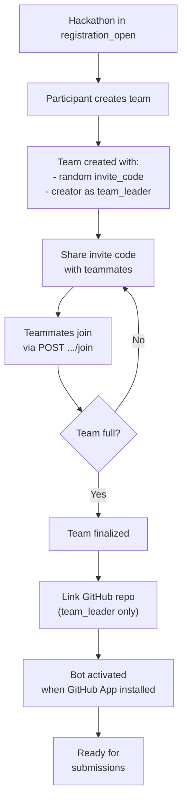
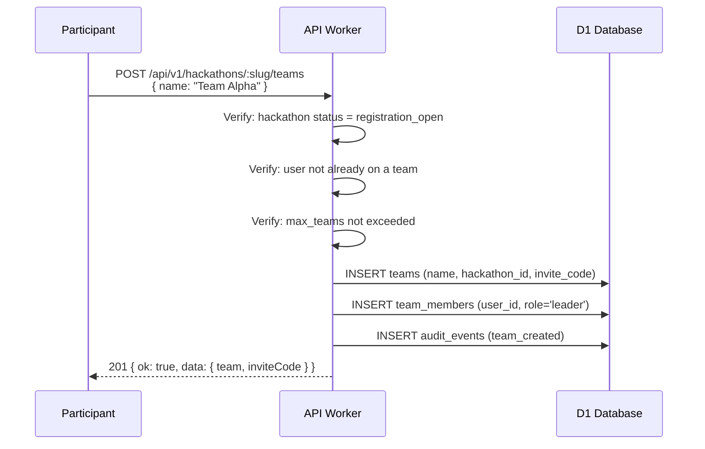
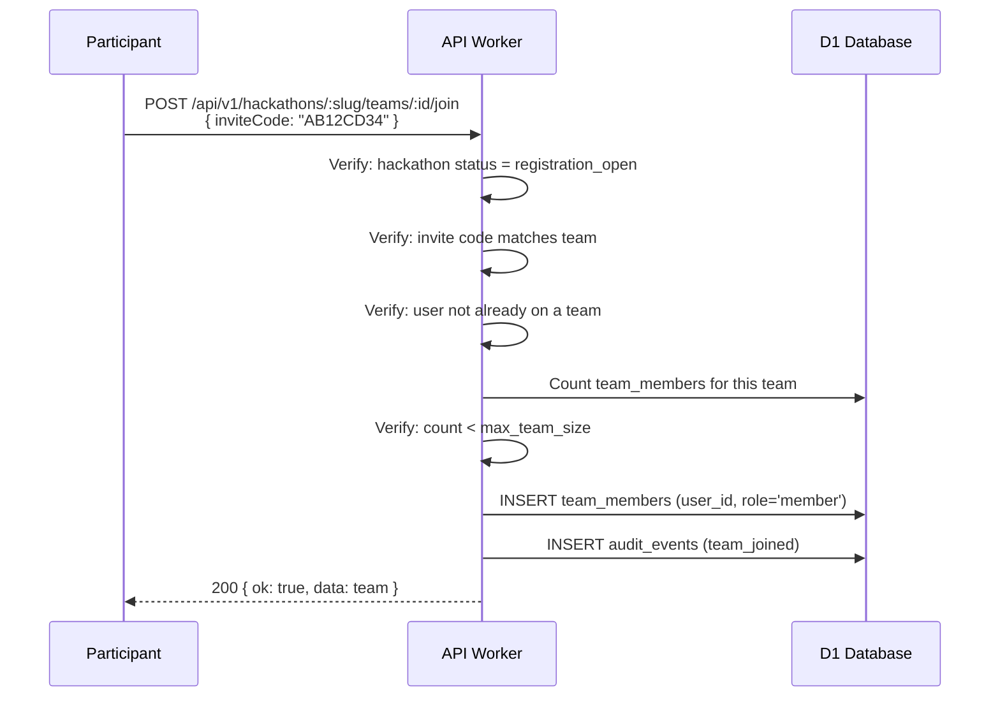
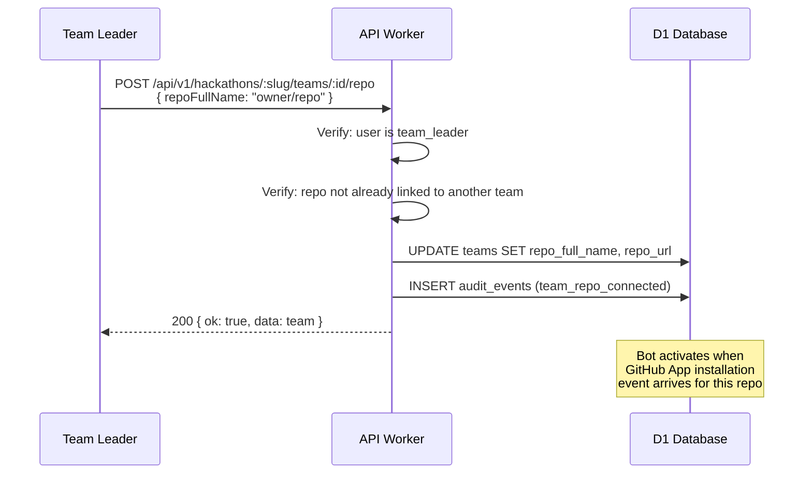
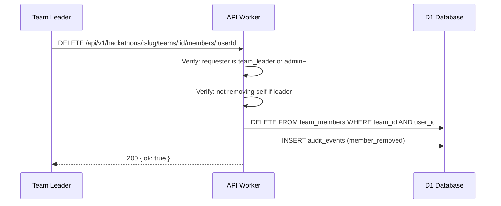
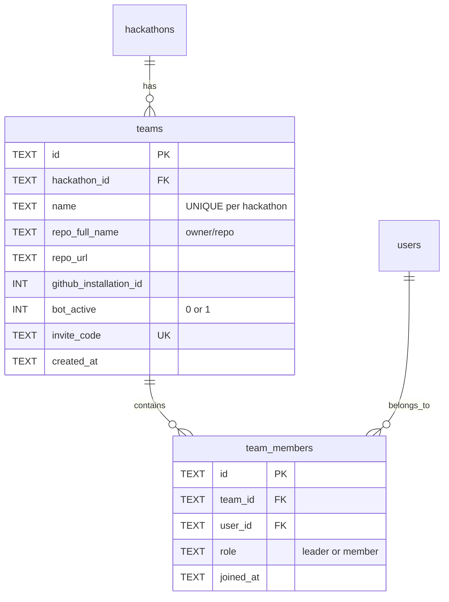
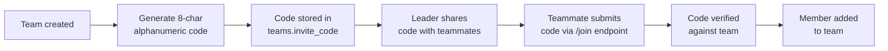
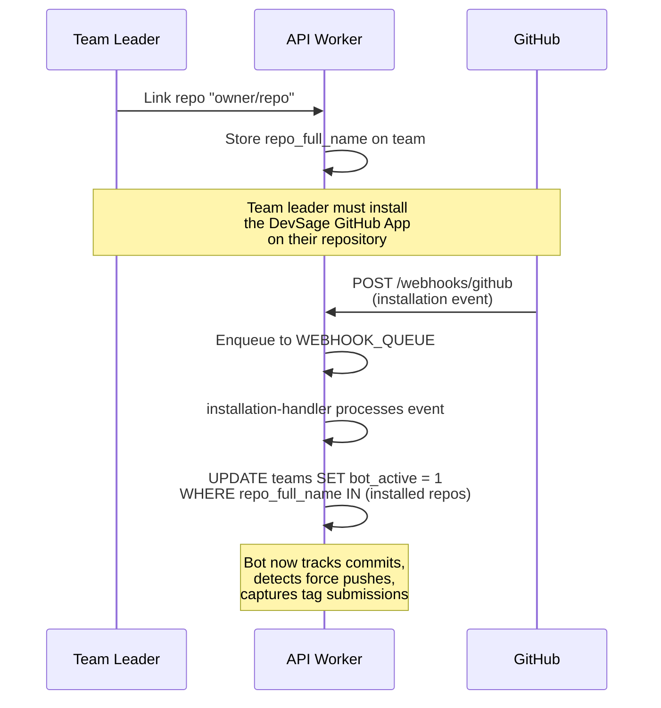

# 03 — Team Management

> Participants register teams during the registration phase, join via invite codes, link GitHub repos, and manage membership. Team size is enforced by hackathon configuration.

**Related docs:** [Hackathon Lifecycle](./02-hackathon-lifecycle.md) | [Submissions](./04-submissions.md) | [Roles & Permissions](./06-roles-permissions.md)

---

## Team Lifecycle

---

## Core Operations

### Create Team

**Constraints:**
- Team name must be 2-50 characters, unique per hackathon
- User can only be on one team per hackathon
- `max_teams` limit checked before creation
- Invite code: 8-character random alphanumeric string

### Join Team

### Connect GitHub Repo

### Remove Member

---

## Data Model

### Constraints

| Constraint | Columns | Purpose |
|------------|---------|---------|
| `UNIQUE(hackathon_id, name)` | teams | No duplicate team names per hackathon |
| `UNIQUE(hackathon_id, repo_full_name)` | teams | One repo per hackathon |
| `UNIQUE(invite_code)` | teams | Global invite code uniqueness |
| `UNIQUE(team_id, user_id)` | team_members | User can't join same team twice |

---

## Invite Code System

- Length: 8 characters (configurable via `JOIN_CODE_LENGTH`)
- Character set: alphanumeric
- Globally unique across all teams
- No expiration (valid until hackathon leaves registration phase)

---

## Bot Activation Flow

When a team links a GitHub repo, the bot becomes active only after the GitHub App is installed:

---

## Team Member Roles

| Role | Permissions |
|------|-------------|
| `leader` | Create team, link repo, remove members, finalize submission |
| `member` | View team, push code, create tags |

The `leader` role maps to `team_leader` in the hackathon role hierarchy. The `member` role maps to `participant`.

---

## Validation Rules

| Rule | Enforcement |
|------|-------------|
| Team creation only during `registration_open` | Checked in route handler |
| Team join only during `registration_open` | Checked in route handler |
| User can only be on one team per hackathon | Checked via DB query before insert |
| Team name 2-50 chars | Zod schema validation |
| Team name unique per hackathon | DB UNIQUE constraint |
| Team size ≤ `max_team_size` | Count check before join |
| Repo not already linked to another team | DB UNIQUE constraint on `(hackathon_id, repo_full_name)` |
| Solo participation allowed | `min_team_size` defaults to 1 (team of one) |

---

## File References

| File | Purpose |
|------|---------|
| `apps/api/src/routes/teams.ts` | Team CRUD routes |
| `apps/api/src/queue/installation-handler.ts` | Bot activation on GitHub App install |
| `packages/shared/src/schemas/team.ts` | `TeamSchema`, `CreateTeamRequestSchema`, `JoinTeamRequestSchema` |
| `packages/shared/src/schemas/team-member.ts` | `TeamMemberSchema` |
| `packages/db/src/schema/teams.ts` | Teams table definition |
| `packages/db/src/schema/team-members.ts` | Team members table definition |
| `apps/web/src/pages/hackathon-detail.tsx` | Team creation/joining UI |
| `apps/web/src/pages/team-management.tsx` | Team member management UI |
