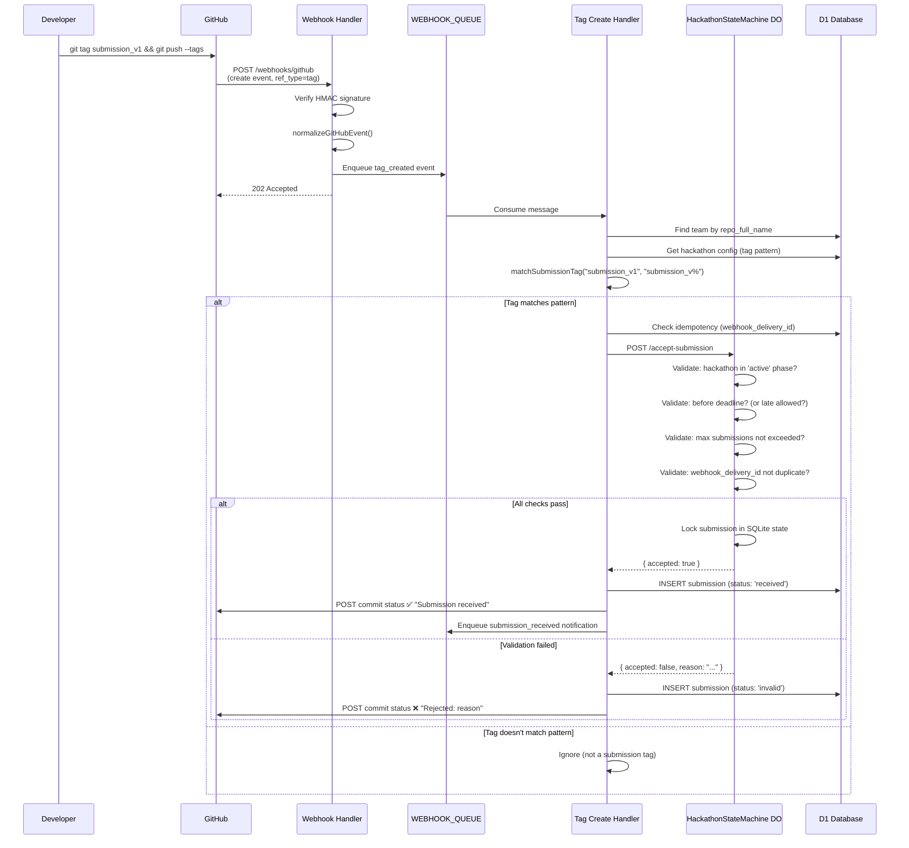
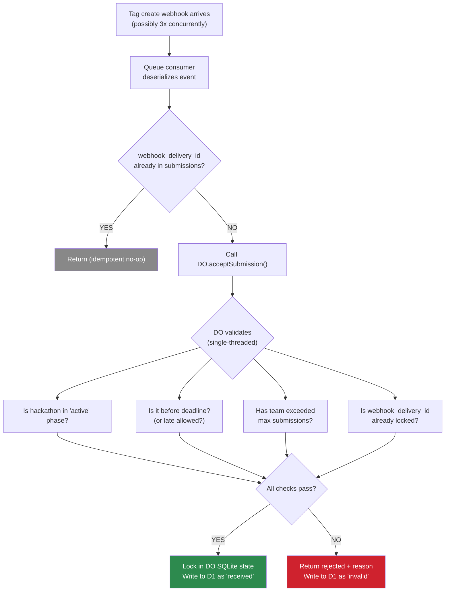
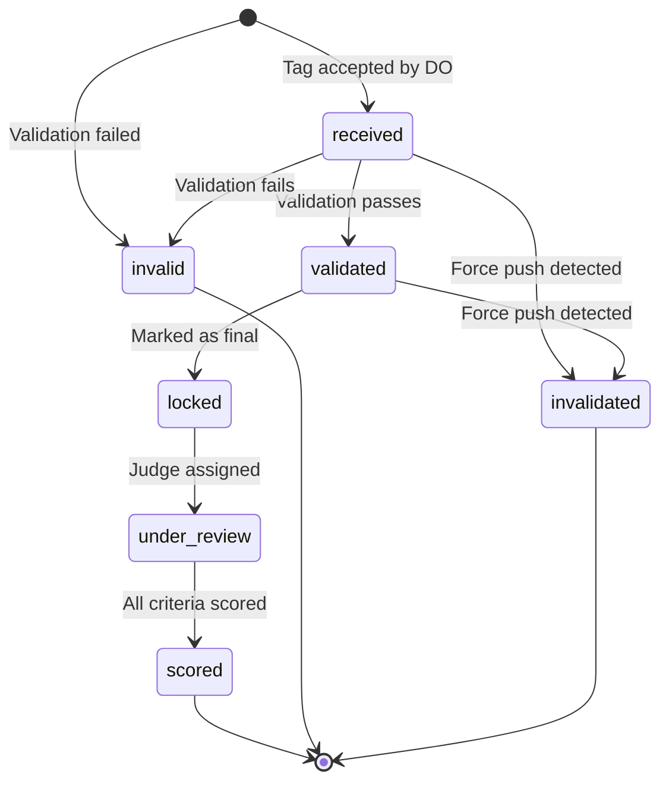
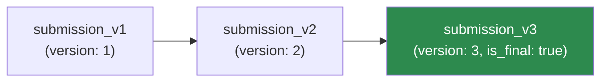
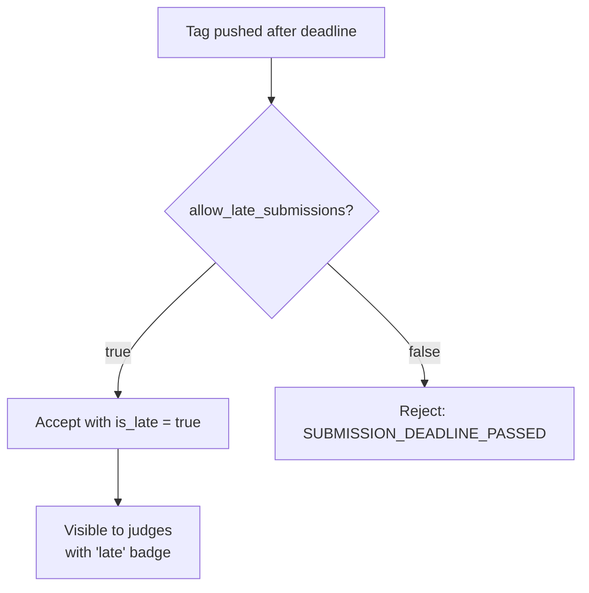
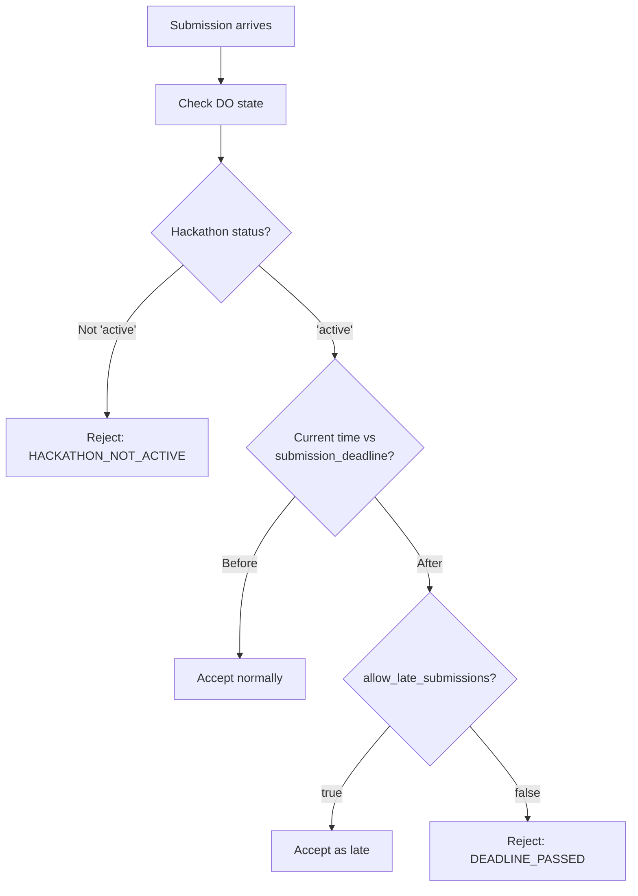
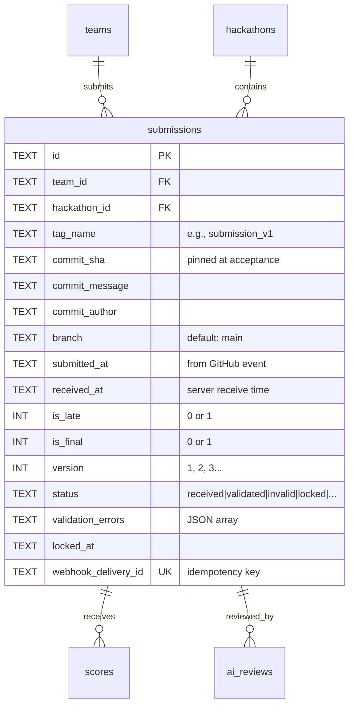

# 04 — Submissions & Locking

> Teams submit by pushing a Git tag matching a configurable pattern. A Durable Object guarantees exactly-once acceptance per team via single-writer locking. No forms, no uploads, no manual intervention.

**Related docs:** [Hackathon Lifecycle](./02-hackathon-lifecycle.md) | [Webhooks & GitHub](./07-webhooks-integrations.md) | [Judging](./05-judging.md)

---

## Submission Flow (End-to-End)

---

## Exactly-Once Locking

The Durable Object guarantees that even if GitHub delivers the same webhook 3 times concurrently, only one submission is accepted:

**Why Durable Objects?** The DO's single-threaded execution model prevents all race conditions. Even with concurrent webhook deliveries, submissions are serialized through one DO instance per hackathon.

---

## Submission States

| Status | Description |
|--------|-------------|
| `received` | Tag accepted by DO, written to D1 |
| `validated` | Additional validation passed (README check, etc.) |
| `invalid` | Failed validation (deadline, max submissions, pattern mismatch) |
| `locked` | Marked as team's final submission |
| `under_review` | Assigned to judge(s) |
| `scored` | All assigned judges have scored |
| `invalidated` | Retroactively invalidated (force push detected) |

---

## Tag Pattern Matching

Teams submit by pushing a Git tag that matches the hackathon's `submission_tag_pattern`:

| Pattern | Example Tags | Match? |
|---------|-------------|--------|
| `submission_v%` | `submission_v1`, `submission_v2`, `submission_v10` | Yes |
| `submission_v%` | `release_v1`, `submission_`, `submission_vX` | No |
| `final_%` | `final_v1`, `final_submission` | Yes |

The `%` wildcard matches any sequence of characters (SQL LIKE semantics). The version number is extracted from the matched portion.

---

## Submission Versioning

Teams can submit multiple versions (if `max_submissions_per_team` allows):

- Each tag creates a new submission record with an incrementing `version`
- Only one submission can be `is_final = true` per team
- Team leader manually marks a submission as final via `POST .../submissions/:id/finalize`
- If no submission is manually finalized, the latest is used for judging

---

## Late Submission Handling

Late submissions are tracked with `is_late = true` and `submitted_at` (from GitHub event timestamp, not server receive time) for fairness.

---

## Deadline Enforcement

**Two enforcement layers:**
1. **DO alarm** — fires at exact deadline, transitions hackathon to `judging` state
2. **Cron trigger** — hourly safety net that catches any missed transitions

---

## Idempotency

Multiple layers prevent duplicate submission processing:

| Layer | Mechanism | Key |
|-------|-----------|-----|
| D1 | `UNIQUE(webhook_delivery_id)` on submissions | GitHub delivery ID |
| D1 | `UNIQUE(team_id, tag_name)` on submissions | Team + tag combo |
| DO | `UNIQUE(webhook_delivery_id)` in submission_locks | GitHub delivery ID |
| Handler | Pre-check query before DO call | `SELECT ... WHERE webhook_delivery_id = ?` |

---

## Commit Status Posting

After processing a submission, the API posts a commit status back to GitHub:

| Outcome | Status | Description |
|---------|--------|-------------|
| Accepted | `success` | "Submission submission_v1 received by DevSage" |
| Rejected | `failure` | "Submission rejected: Deadline passed" |
| Processing | `pending` | "Submission being processed..." |

This appears as a check on the tagged commit in GitHub's UI.

---

## Data Model

---

## File References

| File | Purpose |
|------|---------|
| `apps/api/src/routes/submissions.ts` | Submission query routes |
| `apps/api/src/queue/tag-create-handler.ts` | Core submission processing pipeline |
| `apps/api/src/durable-objects/hackathon-state-machine.ts` | Exactly-once locking via `acceptSubmission()` |
| `apps/api/src/lib/submission-tag.ts` | `matchSubmissionTag()` pattern matching |
| `apps/api/src/services/github.ts` | `postCommitStatus()` — fail-open |
| `packages/shared/src/schemas/submission.ts` | `SubmissionSchema` |
| `packages/db/src/schema/submissions.ts` | Submissions table definition |
| `apps/web/src/pages/team-management.tsx` | Submission status UI |
