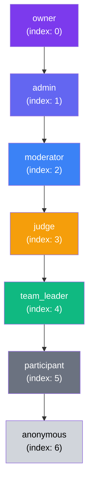
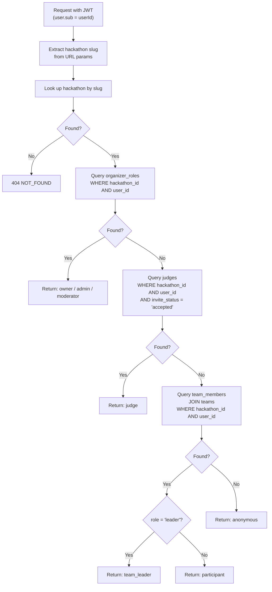
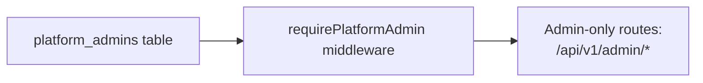
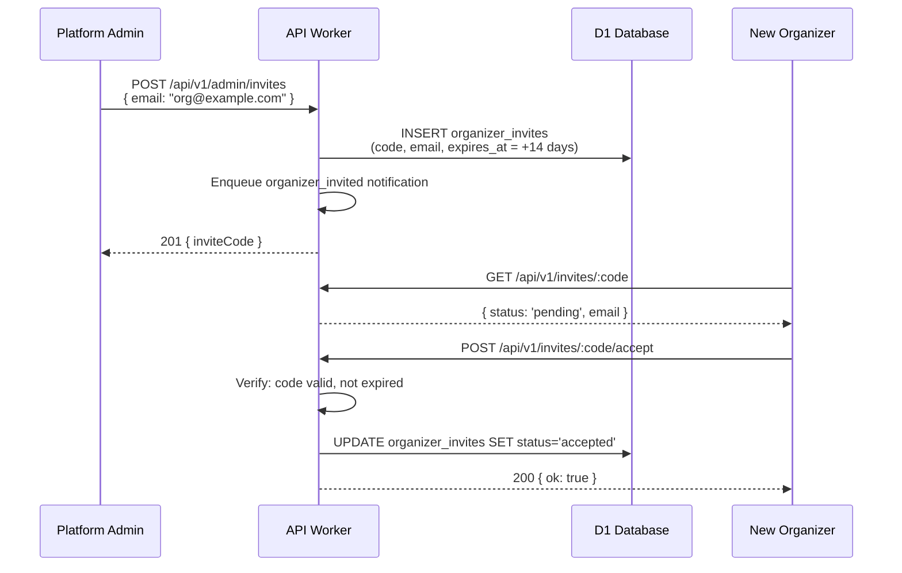
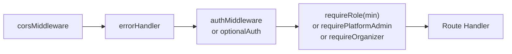

# 06 — Roles & Permissions

> 7-tier per-hackathon role hierarchy resolved per-request via database lookup. Roles are NOT stored in the JWT — a user's role can differ across hackathons.

**Related docs:** [Authentication](./01-authentication.md) | [API Design](./11-api-design.md) | [Data Model](./10-data-model.md)

---

## Role Hierarchy



Higher privilege (lower index) inherits all permissions of lower roles. `requireRole('admin')` grants access to `admin` and `owner`.

---

## Role Definitions

| Role | Source Table | Scope | Description |
|------|-------------|-------|-------------|
| `owner` | `organizer_roles` | Per-hackathon | Created the hackathon. Full control including deletion |
| `admin` | `organizer_roles` | Per-hackathon | Invited organizer with full management access |
| `moderator` | `organizer_roles` | Per-hackathon | Can view all teams, force pushes, activity feeds |
| `judge` | `judges` | Per-hackathon | Invited judge with `invite_status = 'accepted'` |
| `team_leader` | `team_members` | Per-hackathon | Team creator with `role = 'leader'` |
| `participant` | `team_members` | Per-hackathon | Team member with `role = 'member'` |
| `anonymous` | (fallback) | Per-hackathon | Authenticated user with no relationship to the hackathon |

**Note:** `anonymous` here means "authenticated but no role in this hackathon" — not "unauthenticated." Unauthenticated users are blocked by `authMiddleware` before role resolution.

---

## Resolution Algorithm



### Resolution Order (Priority)

1. **organizer_roles** — checked first (highest privilege: owner > admin > moderator)
2. **judges** — only if `invite_status = 'accepted'`
3. **team_members** — joined through `teams` table to match hackathon
4. **Fallback** — `anonymous`

A user can technically exist in multiple tables (e.g., both an organizer and a judge), but the resolution returns the **highest** role found.

---

## Platform Admin (Separate System)

In addition to per-hackathon roles, there's a **platform-level** admin system:



| Field | Description |
|-------|-------------|
| Table | `platform_admins` |
| Scope | Global (not per-hackathon) |
| Check | `requirePlatformAdmin` middleware |
| Routes | `/api/v1/admin/invites`, `/api/v1/admin/admins` |

Platform admins can:
- Create organizer invites
- List/revoke organizer invites
- View all platform admins

---

## Organizer Invite Flow

New organizers join via invite codes (managed by platform admins):



---

## Permission Matrix

| Action | anon | participant | team_leader | judge | mod | admin | owner |
|--------|:----:|:-----------:|:-----------:|:-----:|:---:|:-----:|:-----:|
| View public hackathon info | Y | Y | Y | Y | Y | Y | Y |
| Register team | - | Y | Y | - | - | Y | Y |
| Join team | - | Y | Y | - | - | Y | Y |
| Connect repo | - | - | Y | - | - | Y | Y |
| View own team | - | Y | Y | - | - | Y | Y |
| View all teams | - | - | - | - | Y | Y | Y |
| View own submissions | - | Y | Y | - | - | Y | Y |
| View all submissions | - | - | - | assigned | Y | Y | Y |
| Finalize submission | - | - | Y | - | - | Y | Y |
| Score submissions | - | - | - | Y | - | - | - |
| View commit log (own) | - | Y | Y | - | - | Y | Y |
| View commit log (all) | - | - | - | assigned | Y | Y | Y |
| View force pushes | - | - | - | - | Y | Y | Y |
| View leaderboard | * | * | * | * | Y | Y | Y |
| Edit hackathon config | - | - | - | - | - | Y | Y |
| Manage judges | - | - | - | - | - | Y | Y |
| Set rubric | - | - | - | - | - | Y | Y |
| Transition phase | - | - | - | - | - | Y | Y |
| Delete hackathon | - | - | - | - | - | - | Y |

*Leaderboard visibility depends on hackathon status (see [05-judging.md](./05-judging.md)).

---

## Middleware Implementation

### `requireRole(minRole)`

Applied per-route to enforce minimum role:

```typescript
// Usage in route file:
app.get('/teams', optionalAuth, requireRole('anonymous'), handler);     // Public
app.post('/teams', authMiddleware, requireRole('participant'), handler); // Auth + role
app.put('/', authMiddleware, requireRole('admin'), handler);            // Admin only
app.delete('/', authMiddleware, requireRole('owner'), handler);         // Owner only
```

### Middleware Chain Order



### What `requireRole` Sets on Context

| Key | Type | Value |
|-----|------|-------|
| `c.get('user')` | `JWTPayload` | From auth middleware |
| `c.get('hackathon')` | `Hackathon` | Looked up by slug |
| `c.get('role')` | `Role` | Resolved via `resolveRole()` |

---

## Additional Middleware

### `requireOrganizer`

Checks if user is a platform admin OR has an accepted organizer invite. Used for hackathon creation (before any hackathon-specific role exists).

### `requirePlatformAdmin`

Checks `platform_admins` table. Used exclusively for `/api/v1/admin/*` routes.

---

## Key Design Decisions

| Decision | Rationale |
|----------|-----------|
| Roles NOT in JWT | A user's role differs per hackathon. Embedding roles would require token refresh on every role change |
| Per-request resolution | Always accurate. No stale role data. ~1 DB query per request |
| Highest-wins resolution | User who is both an organizer and a judge gets `admin` (not `judge`) |
| `anonymous` means authenticated | Unauthenticated users are blocked at the auth middleware layer |
| Platform admin is separate | Global admin ≠ per-hackathon admin. Different concern, different table |

---

## File References

| File | Purpose |
|------|---------|
| `apps/api/src/middleware/role.ts` | `resolveRole()`, `requireRole()`, `ROLE_HIERARCHY`, `isRoleAtLeast()` |
| `apps/api/src/middleware/auth.ts` | `authMiddleware`, `optionalAuth` |
| `apps/api/src/middleware/platform-admin.ts` | `requirePlatformAdmin` |
| `apps/api/src/middleware/require-organizer.ts` | `requireOrganizer` |
| `packages/shared/src/schemas/constants.ts` | `ROLES`, `ORGANIZER_ROLES`, `TEAM_MEMBER_ROLES` |
| `packages/db/src/schema/organizer-roles.ts` | Organizer roles table |
| `packages/db/src/schema/platform-admins.ts` | Platform admins table |
| `packages/db/src/schema/organizer-invites.ts` | Organizer invites table |
| `apps/api/src/routes/admin.ts` | Platform admin routes |
| `apps/api/src/routes/invites.ts` | Organizer invite acceptance |
