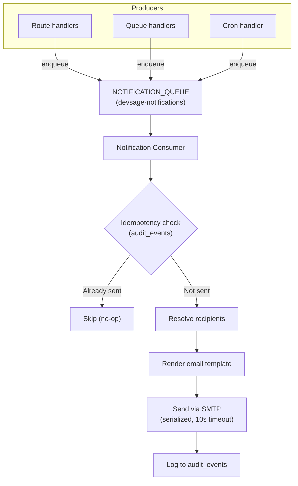
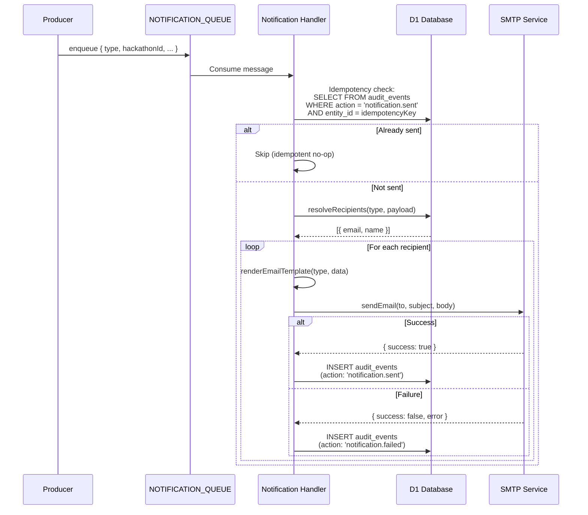
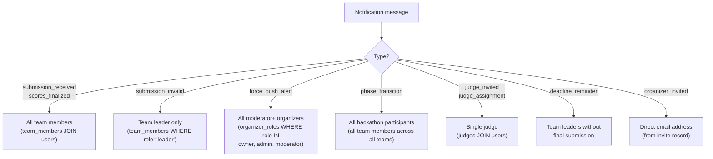
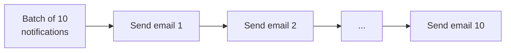
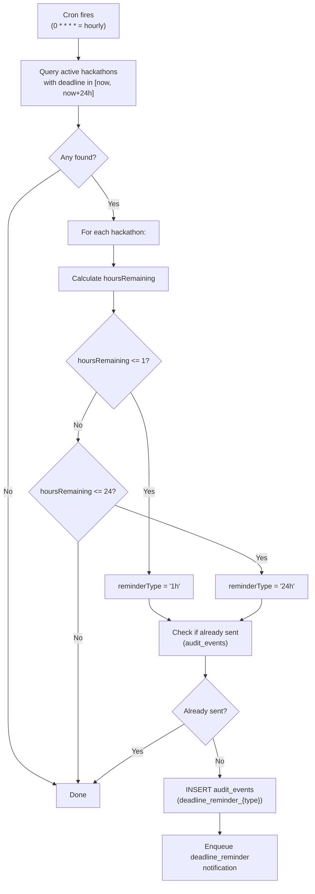

# 08 — Notification System

> Queue-based email notifications via custom SMTP. 9 event types with per-type recipient resolution. Idempotent delivery, fail-open, serialized sending.

**Related docs:** [Webhooks](./07-webhooks-integrations.md) | [Audit Trail](./09-audit-trail.md) | [Infrastructure](./12-infrastructure.md)

---

## Architecture



---

## Notification Types

| Type | Trigger | Recipients | Priority |
|------|---------|------------|----------|
| `submission_received` | Tag accepted by DO | All team members | Normal |
| `submission_invalid` | Tag rejected by DO | Team leader only | Normal |
| `force_push_alert` | Force push detected | All moderator+ organizers | High |
| `phase_transition` | Hackathon state change | All hackathon participants | Normal |
| `judge_invited` | Admin invites judge | Invited judge | Normal |
| `judge_assignment` | Auto-assignment run | Assigned judge | Normal |
| `scores_finalized` | Judging completed | All team members | Normal |
| `deadline_reminder` | Cron (T-24h or T-1h) | Team leaders without final submission | Normal |
| `organizer_invited` | Platform admin invites | Invite email address | Normal |

---

## Processing Flow



---

## Recipient Resolution

Each notification type has specific rules for determining recipients:



### Deadline Reminder Recipients

```sql
-- Team leaders who haven't finalized a submission
SELECT u.email, u.display_name
FROM team_members tm
  JOIN teams t ON tm.team_id = t.id
  JOIN users u ON tm.user_id = u.id
WHERE t.hackathon_id = ?
  AND tm.role = 'leader'
  AND t.id NOT IN (
    SELECT team_id FROM submissions
    WHERE hackathon_id = ? AND is_final = 1
  )
```

---

## Email Service (SMTP)

| Property | Value |
|----------|-------|
| Protocol | HTTP-based SMTP API (Workers can't do raw TCP) |
| Timeout | 10 seconds (AbortController) |
| Failure mode | Fail-open: returns `{ success: false, error }`, never throws |
| Rate limit | 500 emails/hour (self-hosted SMTP) |
| Format | Plain text + minimal HTML |

### Sending Pattern

Emails within a batch are sent **serially** (no concurrent SMTP connections):



**Reason:** Serialize to respect SMTP rate limits and avoid connection issues.

---

## Deadline Reminders via Cron



### Reminder Schedule

| Reminder | Window | Idempotency Key |
|----------|--------|-----------------|
| T-24h | 23-24 hours before deadline | `deadline_reminder_24h:{hackathonId}` |
| T-1h | 0-1 hours before deadline | `deadline_reminder_1h:{hackathonId}` |

---

## Idempotency

Multiple layers prevent duplicate notifications:

| Layer | Mechanism |
|-------|-----------|
| Cron | Checks audit_events before enqueuing reminders |
| Handler | Checks audit_events before sending (notification.sent + idempotencyKey) |
| Queue | Retry with backoff on failure (ack only after success or dead-letter) |

Idempotency key format: `{type}:{hackathonId}:{entityId}:{timestamp_bucket}`

---

## Queue Configuration

| Property | Value |
|----------|-------|
| Queue name | `devsage-notifications` |
| Binding | `NOTIFICATION_QUEUE` |
| Max batch size | 10 |
| Max retries | 3 |
| Retry backoff | Exponential (base seconds × attempts, max 5 min) |
| Dead letter | Audit event logged on final failure |

---

## File References

| File | Purpose |
|------|---------|
| `apps/api/src/queue/notification-handler.ts` | Notification consumer |
| `apps/api/src/queue/notification-logic.ts` | `resolveRecipients()`, `renderEmailTemplate()` |
| `apps/api/src/services/smtp.ts` | `sendEmail()` — HTTP-based SMTP, fail-open |
| `apps/api/src/queue/index.ts` | Queue dispatcher |
| `apps/api/src/index.ts` | Cron handler (deadline reminders) |
