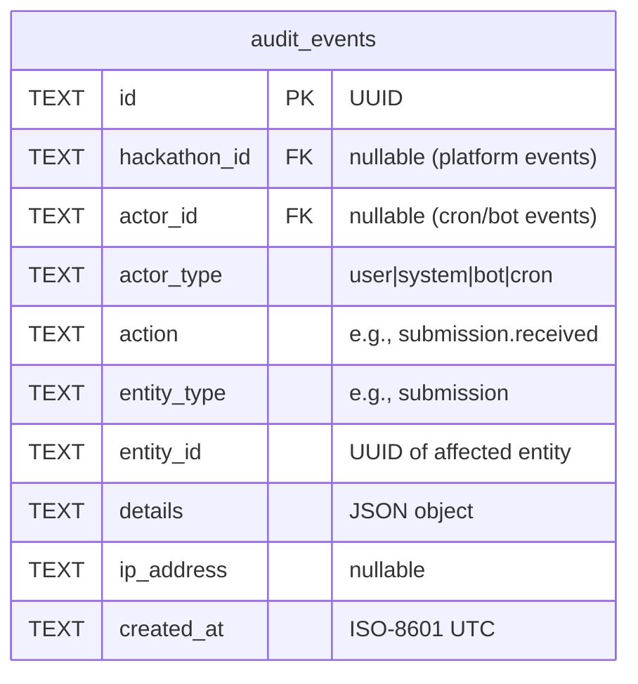
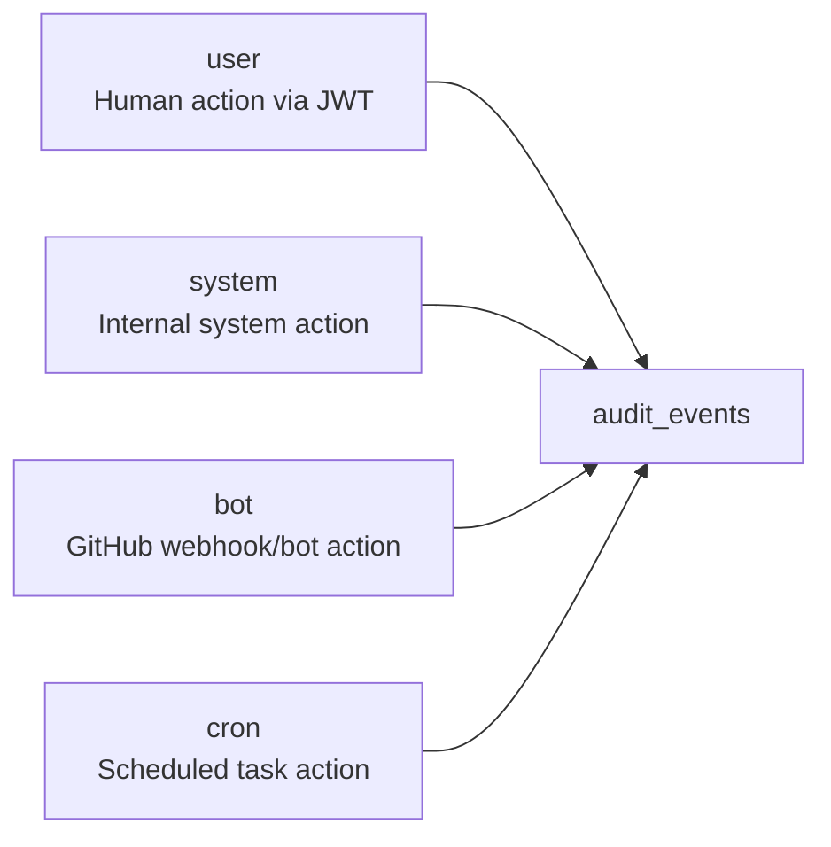
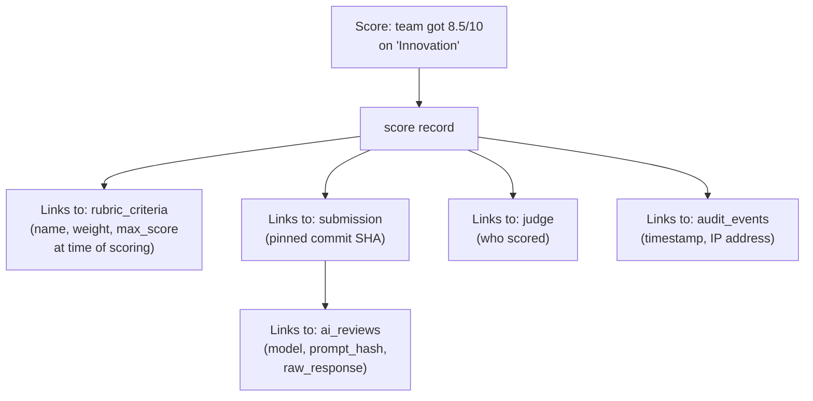

# 09 — Audit Trail

> Every state-changing operation produces an append-only audit event. Events are never updated or deleted. The audit trail enables decision traceability, compliance, and debugging.

**Related docs:** [Roles & Permissions](./06-roles-permissions.md) | [Data Model](./10-data-model.md) | [Submissions](./04-submissions.md)

---

## Design Principles

| Principle | Implementation |
|-----------|---------------|
| **Append-only** | No UPDATE or DELETE on `audit_events` table. Ever. |
| **Fail-open** | `insertAuditEvent()` never throws — logs warning if DB insert fails |
| **Actor attribution** | Every event records WHO (actor_id + actor_type) and WHAT |
| **Context-rich** | JSON `details` field captures action-specific data |
| **Non-blocking** | Audit failures never block the primary operation |

---

## Audit Event Structure



---

## Actor Types



| Actor Type | When | actor_id |
|-----------|------|----------|
| `user` | Human-initiated actions (create, update, delete, score) | User UUID from JWT |
| `system` | Internal system operations (auto-assignment, notifications) | null |
| `bot` | GitHub App webhook-triggered actions (submission, force push) | null |
| `cron` | Scheduled task actions (deadline reminders, auto-transitions) | null |

---

## Event Catalog

### Hackathon Events

| Action | Actor | Entity | Details |
|--------|-------|--------|---------|
| `hackathon.created` | user | hackathon | `{ slug, title }` |
| `hackathon.updated` | user | hackathon | `{ changedFields }` |
| `hackathon.deleted` | user | hackathon | `{ slug }` |
| `hackathon.phase_transitioned` | user/cron | hackathon | `{ from, to }` |

### Team Events

| Action | Actor | Entity | Details |
|--------|-------|--------|---------|
| `team.created` | user | team | `{ name, hackathonId }` |
| `team.joined` | user | team | `{ userId }` |
| `team.member_removed` | user | team | `{ removedUserId, removedBy }` |
| `team.repo_connected` | user | team | `{ repoFullName }` |

### Submission Events

| Action | Actor | Entity | Details |
|--------|-------|--------|---------|
| `submission.received` | bot | submission | `{ tagName, commitSha, version }` |
| `submission.rejected` | bot | submission | `{ tagName, reason }` |
| `submission.finalized` | user | submission | `{ tagName, version }` |

### Force Push Events

| Action | Actor | Entity | Details |
|--------|-------|--------|---------|
| `force_push.detected` | bot | team | `{ before, after, estimatedLost }` |

### Judging Events

| Action | Actor | Entity | Details |
|--------|-------|--------|---------|
| `judge.invited` | user | judge | `{ userId, hackathonId }` |
| `judge.responded` | user | judge | `{ accepted: boolean }` |
| `judge.assigned` | system | judge_assignment | `{ judgeId, teamId, submissionId }` |
| `score.submitted` | user | score | `{ judgeId, criteriaId, score }` |

### Installation Events

| Action | Actor | Entity | Details |
|--------|-------|--------|---------|
| `installation.activated` | bot | team | `{ repos[], installationId }` |
| `installation.deactivated` | bot | team | `{ repos[], installationId }` |

### Tag Events

| Action | Actor | Entity | Details |
|--------|-------|--------|---------|
| `tag.deleted` | bot | team | `{ tagName, repo, sender }` |

### Notification Events

| Action | Actor | Entity | Details |
|--------|-------|--------|---------|
| `notification.sent` | system | notification | `{ type, recipient, subject }` |
| `notification.failed` | system | notification | `{ type, recipient, error }` |

### Cron Events

| Action | Actor | Entity | Details |
|--------|-------|--------|---------|
| `deadline_reminder_24h` | cron | hackathon | `{ hackathonId, deadline }` |
| `deadline_reminder_1h` | cron | hackathon | `{ hackathonId, deadline }` |

### Webhook Events

| Action | Actor | Entity | Details |
|--------|-------|--------|---------|
| `webhook.dead_lettered` | system | webhook | `{ type, deliveryId, attempts }` |

---

## Decision Traceability

Every evaluation decision is fully traceable through the audit trail:



This chain answers:
- **What** was scored? → Exact commit SHA, tag name
- **By whom?** → Judge identity
- **Against what criteria?** → Rubric at time of scoring (with weight)
- **When?** → Timestamp in audit event
- **Was AI involved?** → AI review linked to same submission + commit
- **Was the prompt reproducible?** → Prompt hash stored

---

## Querying the Audit Trail

### Indexes

```sql
CREATE INDEX idx_audit_hackathon ON audit_events(hackathon_id, created_at);
CREATE INDEX idx_audit_entity ON audit_events(entity_type, entity_id);
```

### Common Queries

```sql
-- All events for a hackathon (chronological)
SELECT * FROM audit_events
WHERE hackathon_id = ? ORDER BY created_at DESC;

-- All actions by a specific user
SELECT * FROM audit_events
WHERE actor_id = ? ORDER BY created_at DESC;

-- All events for a specific entity
SELECT * FROM audit_events
WHERE entity_type = 'submission' AND entity_id = ?
ORDER BY created_at;

-- All force push events for a hackathon
SELECT * FROM audit_events
WHERE hackathon_id = ? AND action = 'force_push.detected'
ORDER BY created_at DESC;

-- Idempotency check (used by cron and notifications)
SELECT 1 FROM audit_events
WHERE hackathon_id = ? AND action = ?
LIMIT 1;
```

---

## Implementation

```typescript
// Fail-open: never throws, never blocks
async function insertAuditEvent(db: DbClient, input: {
  hackathonId?: string;
  actorId?: string;
  actorType: 'user' | 'system' | 'bot' | 'cron';
  action: string;
  entityType: string;
  entityId: string;
  details?: Record<string, unknown>;
  ipAddress?: string;
}): Promise<void> {
  try {
    await db.insert(auditEvents).values({
      id: crypto.randomUUID(),
      hackathon_id: input.hackathonId ?? null,
      actor_id: input.actorId ?? null,
      actor_type: input.actorType,
      action: input.action,
      entity_type: input.entityType,
      entity_id: input.entityId,
      details: input.details ? JSON.stringify(input.details) : null,
      ip_address: input.ipAddress ?? null,
    });
  } catch (error) {
    console.warn('Failed to insert audit event:', error);
    // Never throw — audit failure must not block primary operation
  }
}
```

---

## File References

| File | Purpose |
|------|---------|
| `apps/api/src/lib/audit.ts` | `insertAuditEvent()` — core audit function |
| `packages/db/src/schema/audit-events.ts` | Audit events table definition |
| `packages/shared/src/schemas/audit-event.ts` | `AuditEventSchema` Zod schema |
| `packages/shared/src/schemas/constants.ts` | `ACTOR_TYPES` |
