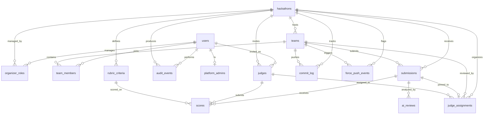

# 10 — Data Model & Schema

> 17 tables in Cloudflare D1 (SQLite) via Drizzle ORM. UUID primary keys, ISO-8601 timestamps, snake_case columns, camelCase Drizzle references. Estimated ~17 MB at target scale.

**Related docs:** [Infrastructure](./12-infrastructure.md) | [API Design](./11-api-design.md) | [Audit Trail](./09-audit-trail.md)

---

## Entity Relationship Diagram



---

## Table Catalog

### Identity & Access Control

#### `users`

| Column | Type | Constraints | Description |
|--------|------|-------------|-------------|
| `id` | TEXT | PK | UUID |
| `github_id` | INTEGER | UNIQUE NOT NULL | GitHub user ID (primary identity) |
| `google_id` | TEXT | UNIQUE | Google user ID (optional, for account linking) |
| `github_username` | TEXT | NOT NULL | GitHub login handle |
| `display_name` | TEXT | NOT NULL | Display name from OAuth |
| `email` | TEXT | | Email from OAuth profile |
| `avatar_url` | TEXT | | Avatar URL from OAuth |
| `created_at` | TEXT | NOT NULL | ISO-8601 UTC |
| `updated_at` | TEXT | NOT NULL | ISO-8601 UTC |

#### `platform_admins`

| Column | Type | Constraints | Description |
|--------|------|-------------|-------------|
| `id` | TEXT | PK | UUID |
| `user_id` | TEXT | FK users(id), UNIQUE | One admin record per user |
| `created_at` | TEXT | NOT NULL | ISO-8601 UTC |

#### `organizer_invites`

| Column | Type | Constraints | Description |
|--------|------|-------------|-------------|
| `id` | TEXT | PK | UUID |
| `email` | TEXT | NOT NULL | Invitee email |
| `invite_code` | TEXT | UNIQUE | 8-char alphanumeric |
| `status` | TEXT | NOT NULL | pending / accepted / expired / revoked |
| `invited_by` | TEXT | FK users(id) | Platform admin who invited |
| `accepted_by` | TEXT | FK users(id) | User who accepted |
| `accepted_at` | TEXT | | When accepted |
| `expires_at` | TEXT | NOT NULL | 14 days from creation |
| `created_at` | TEXT | NOT NULL | ISO-8601 UTC |

---

### Hackathon Lifecycle

#### `hackathons`

| Column | Type | Constraints | Description |
|--------|------|-------------|-------------|
| `id` | TEXT | PK | UUID |
| `slug` | TEXT | UNIQUE NOT NULL | URL-safe identifier |
| `title` | TEXT | NOT NULL | Display name |
| `description` | TEXT | | Markdown |
| `rules_md` | TEXT | | Competition rules |
| `registration_opens` | TEXT | NOT NULL | ISO-8601 UTC |
| `registration_closes` | TEXT | NOT NULL | ISO-8601 UTC |
| `submission_deadline` | TEXT | NOT NULL | ISO-8601 UTC |
| `judging_starts` | TEXT | | ISO-8601 UTC |
| `judging_ends` | TEXT | | ISO-8601 UTC |
| `min_team_size` | INTEGER | NOT NULL, DEFAULT 1 | |
| `max_team_size` | INTEGER | NOT NULL, DEFAULT 5 | |
| `max_teams` | INTEGER | | NULL = unlimited |
| `submission_tag_pattern` | TEXT | NOT NULL, DEFAULT 'submission_v%' | Git tag pattern |
| `max_submissions_per_team` | INTEGER | | NULL = unlimited |
| `allow_late_submissions` | INTEGER | NOT NULL, DEFAULT 0 | Boolean |
| `primary_color` | TEXT | DEFAULT '#6366f1' | Theme color |
| `logo_r2_key` | TEXT | | R2 storage key |
| `banner_r2_key` | TEXT | | R2 storage key |
| `custom_subdomain` | TEXT | | e.g., "acmhack" |
| `status` | TEXT | NOT NULL, DEFAULT 'draft' | CHECK: 7 valid states |
| `created_by` | TEXT | FK users(id), NOT NULL | Owner |
| `created_at` | TEXT | NOT NULL | ISO-8601 UTC |
| `updated_at` | TEXT | NOT NULL | ISO-8601 UTC |

#### `organizer_roles`

| Column | Type | Constraints | Description |
|--------|------|-------------|-------------|
| `id` | TEXT | PK | UUID |
| `hackathon_id` | TEXT | FK hackathons(id) CASCADE | |
| `user_id` | TEXT | FK users(id) | |
| `role` | TEXT | NOT NULL, DEFAULT 'admin' | owner / admin / moderator |
| `created_at` | TEXT | NOT NULL | ISO-8601 UTC |

Unique: `(hackathon_id, user_id)`

---

### Teams & Participation

#### `teams`

| Column | Type | Constraints | Description |
|--------|------|-------------|-------------|
| `id` | TEXT | PK | UUID |
| `hackathon_id` | TEXT | FK hackathons(id) CASCADE | |
| `name` | TEXT | NOT NULL | 2-50 characters |
| `repo_full_name` | TEXT | | "owner/repo" |
| `repo_url` | TEXT | | GitHub URL |
| `github_installation_id` | INTEGER | | GitHub App installation |
| `bot_active` | INTEGER | NOT NULL, DEFAULT 0 | Boolean |
| `invite_code` | TEXT | UNIQUE | 8-char join code |
| `created_at` | TEXT | NOT NULL | ISO-8601 UTC |

Unique: `(hackathon_id, name)`, `(hackathon_id, repo_full_name)`

#### `team_members`

| Column | Type | Constraints | Description |
|--------|------|-------------|-------------|
| `id` | TEXT | PK | UUID |
| `team_id` | TEXT | FK teams(id) CASCADE | |
| `user_id` | TEXT | FK users(id) | |
| `role` | TEXT | NOT NULL, DEFAULT 'member' | leader / member |
| `joined_at` | TEXT | NOT NULL | ISO-8601 UTC |

Unique: `(team_id, user_id)`

---

### Submissions & Activity

#### `submissions`

| Column | Type | Constraints | Description |
|--------|------|-------------|-------------|
| `id` | TEXT | PK | UUID |
| `team_id` | TEXT | FK teams(id) CASCADE | |
| `hackathon_id` | TEXT | FK hackathons(id) CASCADE | |
| `tag_name` | TEXT | NOT NULL | e.g., "submission_v1" |
| `commit_sha` | TEXT | NOT NULL | Pinned at acceptance |
| `commit_message` | TEXT | | Truncated to 500 chars |
| `commit_author` | TEXT | | Truncated to 100 chars |
| `branch` | TEXT | DEFAULT 'main' | |
| `submitted_at` | TEXT | NOT NULL | From GitHub event timestamp |
| `received_at` | TEXT | NOT NULL | Server receive time |
| `is_late` | INTEGER | NOT NULL, DEFAULT 0 | Boolean |
| `is_final` | INTEGER | NOT NULL, DEFAULT 0 | Boolean |
| `version` | INTEGER | NOT NULL | 1, 2, 3... |
| `status` | TEXT | NOT NULL, DEFAULT 'received' | 7 valid states |
| `validation_errors` | TEXT | | JSON array |
| `locked_at` | TEXT | | When DO locked |
| `webhook_delivery_id` | TEXT | UNIQUE | Idempotency key |

Unique: `(team_id, tag_name)`

#### `commit_log` (append-only)

| Column | Type | Constraints | Description |
|--------|------|-------------|-------------|
| `id` | TEXT | PK | UUID |
| `team_id` | TEXT | FK teams(id) CASCADE | |
| `hackathon_id` | TEXT | FK hackathons(id) CASCADE | |
| `commit_sha` | TEXT | NOT NULL | |
| `message` | TEXT | | Truncated to 500 chars |
| `author_username` | TEXT | | |
| `branch` | TEXT | DEFAULT 'main' | |
| `pushed_at` | TEXT | NOT NULL | From GitHub event |
| `is_force_push` | INTEGER | NOT NULL, DEFAULT 0 | Boolean |
| `commits_in_push` | INTEGER | DEFAULT 1 | |
| `webhook_delivery_id` | TEXT | | |
| `created_at` | TEXT | NOT NULL | ISO-8601 UTC |

#### `force_push_events`

| Column | Type | Constraints | Description |
|--------|------|-------------|-------------|
| `id` | TEXT | PK | UUID |
| `team_id` | TEXT | FK teams(id) CASCADE | |
| `hackathon_id` | TEXT | FK hackathons(id) CASCADE | |
| `before_sha` | TEXT | NOT NULL | Previous HEAD |
| `after_sha` | TEXT | NOT NULL | New HEAD |
| `branch` | TEXT | NOT NULL | |
| `commits_lost_shas` | TEXT | | JSON array |
| `commits_lost_count` | INTEGER | DEFAULT 0 | |
| `detected_at` | TEXT | NOT NULL | ISO-8601 UTC |
| `notified_organizer` | INTEGER | NOT NULL, DEFAULT 0 | Boolean |
| `action_taken` | TEXT | DEFAULT 'logged' | logged / warned / flagged |
| `submissions_invalidated` | TEXT | | JSON array of IDs |
| `webhook_delivery_id` | TEXT | | |

---

### Judging System

#### `judges`

| Column | Type | Constraints | Description |
|--------|------|-------------|-------------|
| `id` | TEXT | PK | UUID |
| `hackathon_id` | TEXT | FK hackathons(id) CASCADE | |
| `user_id` | TEXT | FK users(id) | |
| `invite_status` | TEXT | NOT NULL, DEFAULT 'pending' | pending / accepted / declined |
| `invited_at` | TEXT | NOT NULL | ISO-8601 UTC |
| `accepted_at` | TEXT | | |

Unique: `(hackathon_id, user_id)`

#### `rubric_criteria`

| Column | Type | Constraints | Description |
|--------|------|-------------|-------------|
| `id` | TEXT | PK | UUID |
| `hackathon_id` | TEXT | FK hackathons(id) CASCADE | |
| `name` | TEXT | NOT NULL | e.g., "Innovation" |
| `description` | TEXT | | |
| `max_score` | INTEGER | NOT NULL, DEFAULT 10 | |
| `weight` | REAL | NOT NULL, DEFAULT 1.0 | |
| `sort_order` | INTEGER | NOT NULL, DEFAULT 0 | Display order |

Unique: `(hackathon_id, name)`

#### `judge_assignments`

| Column | Type | Constraints | Description |
|--------|------|-------------|-------------|
| `id` | TEXT | PK | UUID |
| `judge_id` | TEXT | FK judges(id) CASCADE | |
| `team_id` | TEXT | FK teams(id) CASCADE | |
| `hackathon_id` | TEXT | FK hackathons(id) CASCADE | |
| `submission_id` | TEXT | FK submissions(id) | Pinned submission (nullable) |
| `status` | TEXT | NOT NULL, DEFAULT 'pending' | pending / in_progress / completed |
| `assigned_at` | TEXT | NOT NULL | ISO-8601 UTC |

Unique: `(judge_id, team_id)`

#### `scores` (write-once)

| Column | Type | Constraints | Description |
|--------|------|-------------|-------------|
| `id` | TEXT | PK | UUID |
| `submission_id` | TEXT | FK submissions(id) | |
| `judge_id` | TEXT | FK judges(id) | |
| `criteria_id` | TEXT | FK rubric_criteria(id) | |
| `score` | INTEGER | NOT NULL, CHECK >= 0 | |
| `comment` | TEXT | | Optional remark |
| `scored_at` | TEXT | NOT NULL | ISO-8601 UTC |

Unique: `(submission_id, judge_id, criteria_id)`

#### `ai_reviews` (append-only)

| Column | Type | Constraints | Description |
|--------|------|-------------|-------------|
| `id` | TEXT | PK | UUID |
| `submission_id` | TEXT | FK submissions(id) | |
| `commit_sha` | TEXT | NOT NULL | Pinned to exact commit |
| `provider` | TEXT | NOT NULL | e.g., "openai-compatible" |
| `model` | TEXT | NOT NULL | e.g., "gpt-4o-mini" |
| `prompt_hash` | TEXT | NOT NULL | SHA-256 for reproducibility |
| `summary` | TEXT | | |
| `strengths` | TEXT | | JSON array |
| `concerns` | TEXT | | JSON array |
| `raw_response` | TEXT | | Full response for audit |
| `tokens_used` | INTEGER | | |
| `created_at` | TEXT | NOT NULL | ISO-8601 UTC |

---

### Audit & Compliance

#### `audit_events` (append-only)

| Column | Type | Constraints | Description |
|--------|------|-------------|-------------|
| `id` | TEXT | PK | UUID |
| `hackathon_id` | TEXT | FK hackathons(id) | Nullable (platform events) |
| `actor_id` | TEXT | FK users(id) | Nullable (cron/bot) |
| `actor_type` | TEXT | NOT NULL | user / system / bot / cron |
| `action` | TEXT | NOT NULL | e.g., "submission.received" |
| `entity_type` | TEXT | NOT NULL | e.g., "submission" |
| `entity_id` | TEXT | NOT NULL | UUID of affected entity |
| `details` | TEXT | | JSON object |
| `ip_address` | TEXT | | |
| `created_at` | TEXT | NOT NULL | ISO-8601 UTC |

---

## Indexes

```sql
CREATE INDEX idx_teams_hackathon ON teams(hackathon_id);
CREATE INDEX idx_teams_repo ON teams(repo_full_name);
CREATE INDEX idx_team_members_user ON team_members(user_id);
CREATE INDEX idx_team_members_team ON team_members(team_id);
CREATE INDEX idx_submissions_team ON submissions(team_id);
CREATE INDEX idx_submissions_hackathon ON submissions(hackathon_id);
CREATE INDEX idx_submissions_status ON submissions(hackathon_id, status);
CREATE INDEX idx_submissions_webhook ON submissions(webhook_delivery_id);
CREATE INDEX idx_commit_log_team ON commit_log(team_id, pushed_at);
CREATE INDEX idx_commit_log_hackathon ON commit_log(hackathon_id, pushed_at);
CREATE INDEX idx_force_push_team ON force_push_events(team_id);
CREATE INDEX idx_scores_submission ON scores(submission_id);
CREATE INDEX idx_scores_judge ON scores(judge_id);
CREATE INDEX idx_judge_assignments_judge ON judge_assignments(judge_id);
CREATE INDEX idx_judge_assignments_hackathon ON judge_assignments(hackathon_id);
CREATE INDEX idx_audit_hackathon ON audit_events(hackathon_id, created_at);
CREATE INDEX idx_audit_entity ON audit_events(entity_type, entity_id);
```

---

## Storage Estimates

| Table | Rows (3 hackathons, 500 users) | Size |
|-------|-------------------------------|------|
| users | 500 | ~200 KB |
| hackathons | 3 | ~15 KB |
| teams | 150 | ~60 KB |
| team_members | 500 | ~50 KB |
| submissions | 450 | ~150 KB |
| commit_log | 15,000 | ~5 MB |
| force_push_events | ~50 | ~30 KB |
| judges | ~30 | ~10 KB |
| rubric_criteria | ~15 | ~5 KB |
| judge_assignments | ~450 | ~100 KB |
| scores | 4,500 | ~1 MB |
| ai_reviews | 450 | ~2 MB |
| audit_events | 25,000 | ~8 MB |
| platform_admins | ~5 | ~1 KB |
| organizer_invites | ~20 | ~5 KB |
| organizer_roles | ~15 | ~5 KB |
| **Total** | | **~17 MB** |

D1 free tier: 5 GB. Effectively infinite at this scale.

---

## Conventions

| Convention | Rule |
|------------|------|
| Primary keys | TEXT UUIDs via `crypto.randomUUID()` |
| Timestamps | TEXT ISO-8601 UTC (`new Date().toISOString()`) |
| Column names | snake_case in SQL |
| Drizzle refs | camelCase in TypeScript |
| Booleans | INTEGER 0/1 (SQLite has no native bool) |
| JSON fields | TEXT with `JSON.stringify()` / `JSON.parse()` |
| Cascading deletes | ON DELETE CASCADE on child tables |
| Migrations | `drizzle-kit generate` from `packages/db/` |

---

## File References

| File | Purpose |
|------|---------|
| `packages/db/src/schema/*.ts` | All 17 table definitions |
| `packages/db/src/schema/index.ts` | Barrel export |
| `packages/db/src/client.ts` | `createDbClient()` factory |
| `packages/db/drizzle.config.ts` | Drizzle kit configuration |
| `packages/db/migrations/` | Generated SQL migration files |
