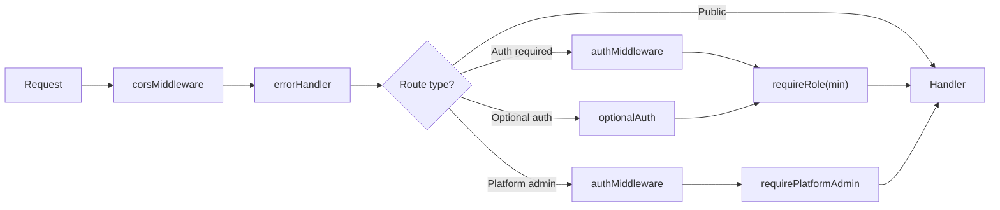

# 11 — API Design & Conventions

> REST API via Hono on Cloudflare Workers. Slug-based hackathon addressing, standard JSON envelope, Zod validation, per-request role resolution, and consistent error codes.

**Related docs:** [Roles & Permissions](./06-roles-permissions.md) | [Authentication](./01-authentication.md) | [Data Model](./10-data-model.md)

---

## Design Principles

| Principle | Implementation |
|-----------|---------------|
| **Slug-based addressing** | `/api/v1/hackathons/:slug` not `/:id` |
| **Consistent envelope** | All responses wrapped in `{ ok, data/error, meta }` |
| **Zod validation** | All request bodies validated via `@hono/zod-validator` |
| **Per-request auth** | Roles resolved per-request per-hackathon |
| **Audit logging** | Every mutation produces audit events |

---

## Response Envelope

### Success Response

```json
{
  "ok": true,
  "data": { ... },
  "meta": {
    "etag": "W/\"abc123\"",
    "cached": false
  }
}
```

### Paginated Response

```json
{
  "ok": true,
  "data": [ ... ],
  "meta": {
    "total": 42,
    "limit": 10,
    "offset": 0
  }
}
```

### Error Response

```json
{
  "ok": false,
  "error": {
    "code": "SUBMISSION_DEADLINE_PASSED",
    "message": "The submission deadline was 2026-03-15T23:59:59Z",
    "details": { ... }
  }
}
```

---

## Pagination

All list endpoints support pagination:

| Parameter | Type | Default | Range |
|-----------|------|---------|-------|
| `limit` | integer | 10-20 (varies) | 1-100 |
| `offset` | integer | 0 | 0+ |

```
GET /api/v1/hackathons?limit=20&offset=40
```

---

## Complete Route Table

### Authentication (`/auth/*`)

| Method | Path | Auth | Description |
|--------|------|------|-------------|
| GET | `/auth/github` | - | Initiate GitHub OAuth |
| GET | `/auth/callback/github` | - | GitHub OAuth callback |
| GET | `/auth/google` | - | Initiate Google OAuth |
| GET | `/auth/callback/google` | - | Google OAuth callback |
| GET | `/auth/me` | JWT | Current user + roles |
| POST | `/auth/logout` | JWT | Clear session cookie |

### Hackathons (`/api/v1/hackathons/*`)

| Method | Path | Auth | Min Role | Description |
|--------|------|------|----------|-------------|
| GET | `/api/v1/hackathons` | - | - | List non-draft hackathons (paginated) |
| POST | `/api/v1/hackathons` | JWT | organizer | Create hackathon |
| GET | `/api/v1/hackathons/:slug` | - | - | Get hackathon by slug |
| PUT | `/api/v1/hackathons/:slug` | JWT | admin | Update hackathon (draft only) |
| PATCH | `/api/v1/hackathons/:slug/status` | JWT | admin | Transition phase |
| DELETE | `/api/v1/hackathons/:slug` | JWT | owner | Delete hackathon (draft only) |

### Teams

| Method | Path | Auth | Min Role | Description |
|--------|------|------|----------|-------------|
| POST | `.../:slug/teams` | JWT | participant | Create team |
| GET | `.../:slug/teams` | JWT | participant | List teams (paginated) |
| GET | `.../:slug/teams/:teamId` | JWT | participant | Get team with members |
| POST | `.../:slug/teams/:teamId/join` | JWT | participant | Join via invite code |
| DELETE | `.../:slug/teams/:teamId/members/:userId` | JWT | participant | Remove member |
| POST | `.../:slug/teams/:teamId/repo` | JWT | participant | Connect GitHub repo |

### Submissions

| Method | Path | Auth | Min Role | Description |
|--------|------|------|----------|-------------|
| GET | `.../:slug/submissions` | JWT | participant | List submissions |
| GET | `.../:slug/submissions/:teamId` | JWT | participant | Get team's submissions |

### Judging

| Method | Path | Auth | Min Role | Description |
|--------|------|------|----------|-------------|
| POST | `.../:slug/judges` | JWT | admin | Invite judge |
| GET | `.../:slug/judges` | JWT | admin | List judges |
| POST | `.../:slug/judges/:id/respond` | JWT | anonymous | Accept/decline invite |
| GET | `.../:slug/rubric` | opt | anonymous | Get rubric criteria |
| POST | `.../:slug/rubric` | JWT | admin | Bulk upsert rubric |
| POST | `.../:slug/judges/assign` | JWT | admin | Round-robin assignment |
| POST | `.../:slug/scores` | JWT | anonymous | Submit score |
| GET | `.../:slug/leaderboard` | opt | anonymous | Weighted leaderboard |

### Webhooks

| Method | Path | Auth | Description |
|--------|------|------|-------------|
| POST | `/webhooks/github` | HMAC | GitHub App webhook receiver |

### Platform Admin (`/api/v1/admin/*`)

| Method | Path | Auth | Description |
|--------|------|------|-------------|
| POST | `/api/v1/admin/invites` | JWT + platform-admin | Create organizer invite |
| GET | `/api/v1/admin/invites` | JWT + platform-admin | List invites (paginated) |
| DELETE | `/api/v1/admin/invites/:id` | JWT + platform-admin | Revoke invite |
| GET | `/api/v1/admin/admins` | JWT + platform-admin | List platform admins |

### Organizer Invites (`/api/v1/invites/*`)

| Method | Path | Auth | Description |
|--------|------|------|-------------|
| GET | `/api/v1/invites/:code` | - | Check invite status |
| POST | `/api/v1/invites/:code/accept` | JWT | Accept organizer invite |

---

## Error Codes

### Authentication Errors (401)

| Code | Description |
|------|-------------|
| `NO_TOKEN` | No JWT cookie present |
| `INVALID_TOKEN` | JWT expired or invalid signature |

### Authorization Errors (403)

| Code | Description |
|------|-------------|
| `INSUFFICIENT_ROLE` | User's role is below minimum required |
| `NOT_PLATFORM_ADMIN` | User is not a platform admin |
| `NOT_ORGANIZER` | User is not an organizer or platform admin |

### Validation Errors (400)

| Code | Description |
|------|-------------|
| `VALIDATION_ERROR` | Zod schema validation failed |
| `BAD_REQUEST` | Missing required parameter |
| `INVALID_TRANSITION` | State machine transition not allowed |
| `SCORE_OUT_OF_RANGE` | Score outside [0, max_score] |
| `DUPLICATE_SCORE` | Score already submitted for this combination |

### Not Found (404)

| Code | Description |
|------|-------------|
| `NOT_FOUND` | Hackathon, team, or resource not found |
| `JUDGE_NOT_FOUND` | Judge record not found |
| `CRITERIA_NOT_FOUND` | Rubric criteria not found |
| `SUBMISSION_NOT_FOUND` | Submission not found |

### Conflict (409)

| Code | Description |
|------|-------------|
| `ALREADY_ON_TEAM` | User already on a team in this hackathon |
| `TEAM_FULL` | Team at max_team_size |
| `DUPLICATE_TEAM_NAME` | Team name already taken |
| `REPO_ALREADY_LINKED` | Repo linked to another team |

### Business Logic (422)

| Code | Description |
|------|-------------|
| `HACKATHON_NOT_ACTIVE` | Operation requires active hackathon |
| `REGISTRATION_CLOSED` | Registration period ended |
| `SUBMISSION_DEADLINE_PASSED` | Deadline has passed |
| `NOT_ASSIGNED` | Judge not assigned to this team |

---

## Middleware Chain



---

## CORS Configuration

```typescript
{
  origin: [
    env.FRONTEND_URL,     // https://devsage.org
    env.PLATFORM_URL,     // https://platform.devsage.org
    env.ADMIN_URL,        // https://admin.devsage.org
    'http://localhost:5173',  // dev
    'http://localhost:5174',
    'http://localhost:5175',
  ],
  credentials: true,
  allowMethods: ['GET', 'POST', 'PUT', 'PATCH', 'DELETE', 'OPTIONS'],
  allowHeaders: ['Content-Type', 'Authorization'],
}
```

---

## Request Validation

All request bodies are validated using `@hono/zod-validator` with schemas from `@devsage/shared`:

```typescript
app.post(
  '/teams',
  authMiddleware,
  requireRole('participant'),
  zValidator('json', CreateTeamRequestSchema),
  async (c) => {
    const body = c.req.valid('json');
    // body is fully typed and validated
  }
);
```

---

## File References

| File | Purpose |
|------|---------|
| `apps/api/src/index.ts` | Route mounting, middleware registration |
| `apps/api/src/routes/*.ts` | All route handlers |
| `apps/api/src/middleware/*.ts` | All middleware |
| `apps/api/src/lib/response.ts` | `successResponse()`, `errorResponse()`, `paginatedResponse()` |
| `apps/api/src/middleware/cors.ts` | CORS configuration |
| `apps/api/src/middleware/error-handler.ts` | Global error handler |
| `packages/shared/src/schemas/api.ts` | `ApiErrorSchema`, pagination types |
| `apps/web/src/lib/api.ts` | Frontend API client |
