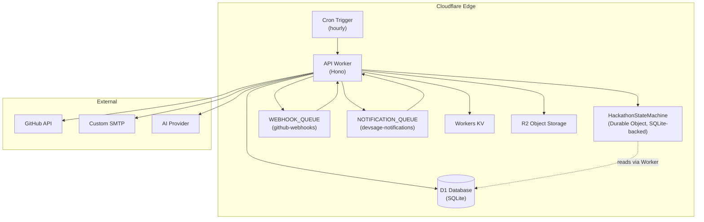
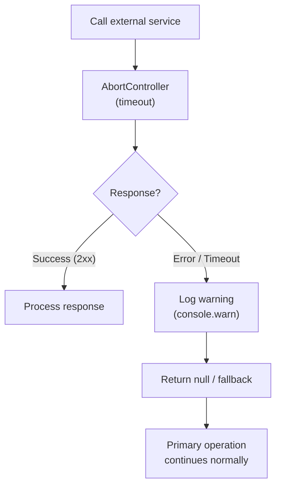
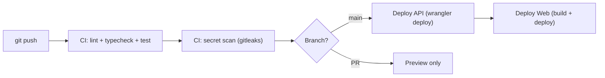
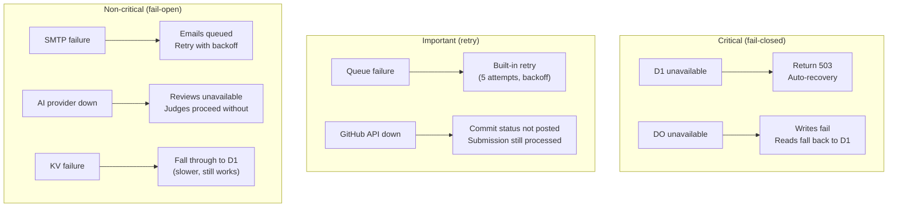

# 12 — Infrastructure & Deployment

> Edge-native on Cloudflare Workers. Single Worker handles API, Durable Objects, Queue consumers, and Cron Triggers. All Cloudflare first-party primitives. $0/month at target scale.

**Related docs:** [Overview](./00-overview.md) | [Data Model](./10-data-model.md) | [Webhooks](./07-webhooks-integrations.md)

---

## Infrastructure Topology



---

## Cloudflare Primitives

### Worker Bindings

| Binding | Type | Name / Class | Purpose |
|---------|------|--------------|---------|
| `DB` | D1 Database | `devsage-db` | Primary datastore (17 tables) |
| `KV` | KV Namespace | — | OAuth state (10-min TTL), session cache |
| `HACKATHON_SM` | Durable Object | `HackathonStateMachine` | State machine, submission locking, alarms |
| `WEBHOOK_QUEUE` | Queue (producer) | `github-webhooks` | GitHub event processing |
| `NOTIFICATION_QUEUE` | Queue (producer) | `devsage-notifications` | Email dispatch |

### Queue Consumer Configuration

| Queue | Max Batch | Max Retries | Retry Backoff |
|-------|-----------|-------------|---------------|
| `github-webhooks` | 10 | 3 | Exponential (capped at 5 min) |
| `devsage-notifications` | 10 | 3 | Exponential (capped at 5 min) |

### Cron Triggers

| Schedule | Purpose |
|----------|---------|
| `0 * * * *` (hourly) | Check approaching deadlines, send reminders, auto-transition phases |

### Worker Configuration

| Setting | Value |
|---------|-------|
| Compatibility date | 2026-01-01 |
| Compatibility flags | `nodejs_compat` |
| DO migrations | `new_sqlite_classes: [HackathonStateMachine]` |
| Observability | Enabled |

---

## Resource Limits & Budget

### Workers Free Plan (Current)

| Resource | Free Limit | DevSage Usage | Headroom |
|----------|-----------|--------------|----------|
| Requests | 100k/day | ~25k/day avg | 4x |
| CPU time | 10ms/invocation | Target <8ms p99 | OK |
| D1 rows read | 5M/day | ~200k/day avg | 25x |
| D1 rows written | 100k/day | ~20k/day avg | 5x |
| D1 storage | 5 GB | ~17 MB | 300x |
| KV reads | 100k/day | ~10k/day avg | 10x |
| KV writes | 1k/day | ~1.7k/day avg | Tight |
| Queues ops | 10k/day | ~3.3k/day avg | 3x |
| DO storage | 5 GB | ~10 MB | 500x |
| Bundle size | 10 MB compressed | ~1 MB | 10x |
| Memory | 128 MB per isolate | Well under | OK |

### Upgrade Trigger ($5/month Workers Paid)

Upgrade when any of these are consistently exceeded:
- Daily requests > 80k (80% of 100k free limit)
- KV writes > 800/day (80% of 1k free limit)
- Queue ops > 8k/day (80% of 10k free limit)

---

## External Services

| Service | Purpose | Failure Mode | Timeout | Rate Limit |
|---------|---------|-------------|---------|------------|
| GitHub API | OAuth, commit status | Fail-open | 10s | 5,000 req/hr |
| Custom SMTP | Email notifications | Fail-open | 10s | 500 emails/hr |
| AI Provider | Advisory code reviews | Fail-open | 25s | Per-token |

### Fail-Open Pattern

All external services follow the same pattern:



---

## Secrets Management

### Development

```
apps/api/.dev.vars  (gitignored)
```

| Secret | Purpose |
|--------|---------|
| `JWT_SECRET` | JWT signing key |
| `GOOGLE_CLIENT_ID` | Google OAuth |
| `GOOGLE_CLIENT_SECRET` | Google OAuth |
| `GITHUB_CLIENT_ID` | GitHub OAuth |
| `GITHUB_CLIENT_SECRET` | GitHub OAuth |
| `GITHUB_WEBHOOK_SECRET` | Webhook HMAC verification |
| `FRONTEND_URL` | CORS origin |
| `PLATFORM_URL` | CORS origin |
| `ADMIN_URL` | CORS origin |
| `SMTP_URL` | SMTP endpoint |
| `SMTP_USERNAME` | SMTP auth |
| `SMTP_PASSWORD` | SMTP auth |
| `SMTP_EMAIL_ADDR` | Sender address |

### Production

```bash
# Individual secret
wrangler secret put JWT_SECRET

# Bulk from file
wrangler secret bulk .env.production
```

### Security Guardrails

| Layer | Protection |
|-------|-----------|
| Pre-commit hook | `secretlint` scans staged files — blocks commits with secrets |
| Pre-push hook | Full repo secret scan — blocks pushes with secrets |
| CI | `gitleaks` on every PR + push to main |
| `.gitignore` | All `.env*` files (except `apps/web/.env.production`) |
| Web app | Only `VITE_*` variables (client-visible, no secrets) |

---

## Deployment

### Commands

```bash
# Deploy API worker
pnpm deploy:api
# → pnpm --filter @devsage/api run deploy → wrangler deploy

# Upload production secrets
pnpm deploy:api:secrets

# Deploy web app
pnpm deploy:web

# Run all locally
pnpm dev
```

### Pipeline



### Wrangler Configuration

Located at `apps/api/wrangler.jsonc` (NOT `.toml`). Never run wrangler from repo root.

Key sections:
- D1 database binding with migrations path (`../../packages/db/migrations`)
- KV namespace binding
- DO binding (`HackathonStateMachine`, SQLite-backed)
- Queue producer bindings (2 queues)
- Queue consumer bindings (2 queues)
- Cron trigger schedule
- DO migrations (new_sqlite_classes)

---

## Monorepo Tooling

| Tool | Purpose |
|------|---------|
| **Turborepo** | Build orchestration, caching, task parallelism |
| **pnpm** | Package manager with workspaces |
| **TypeScript** | Strict mode throughout |
| **Vitest** | Testing (API: `@cloudflare/vitest-pool-workers`, Web: jsdom) |
| **ESLint 9** | Flat config, shared via `packages/config` |
| **Drizzle ORM** | Type-safe D1 access |

### Build Commands

```bash
pnpm dev          # All apps dev (turbo --parallel)
pnpm build        # Build all (turbo)
pnpm test         # Test all (turbo)
pnpm lint         # Lint all
pnpm typecheck    # Type-check all
pnpm secrets:scan # Full repo secret scan
```

---

## Failure Modes



| Dependency | Criticality | Failure Behavior | Recovery |
|-----------|------------|------------------|----------|
| D1 | Critical | Fail-closed: return 503 | Automatic (Cloudflare-managed) |
| Durable Objects | Critical (mutations) | Fail-closed for writes; reads fall back to D1 | Automatic |
| KV | Non-critical | Fall through to D1 (slower) | Automatic |
| Queues | Important | Processing delayed | Built-in retry (3 attempts) |
| GitHub API | Important | Commit status not posted | Retry via queue |
| SMTP | Non-critical | Emails queued, delivered later | Retry with backoff |
| AI Provider | Non-critical | Reviews unavailable | Judges proceed without |

---

## File References

| File | Purpose |
|------|---------|
| `apps/api/wrangler.jsonc` | Worker configuration |
| `apps/api/src/index.ts` | Entry point: app, DO re-exports, queue handler, cron handler |
| `apps/api/src/types/env.ts` | Worker binding types |
| `turbo.json` | Turborepo task configuration |
| `pnpm-workspace.yaml` | Workspace definition |
| `docs/v2/deployment.md` | Production deployment guide |
| `docs/v2/secrets.md` | Secrets management conventions |
| `docs/v2/setup.md` | Developer setup guide |
