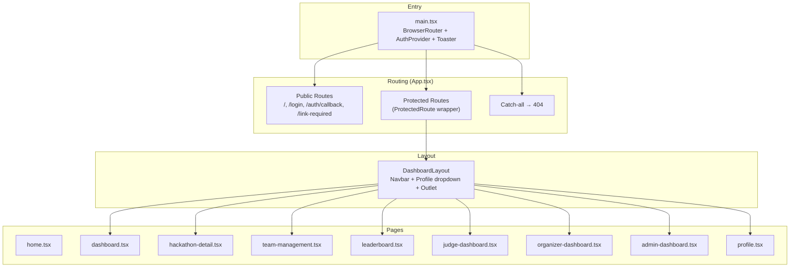
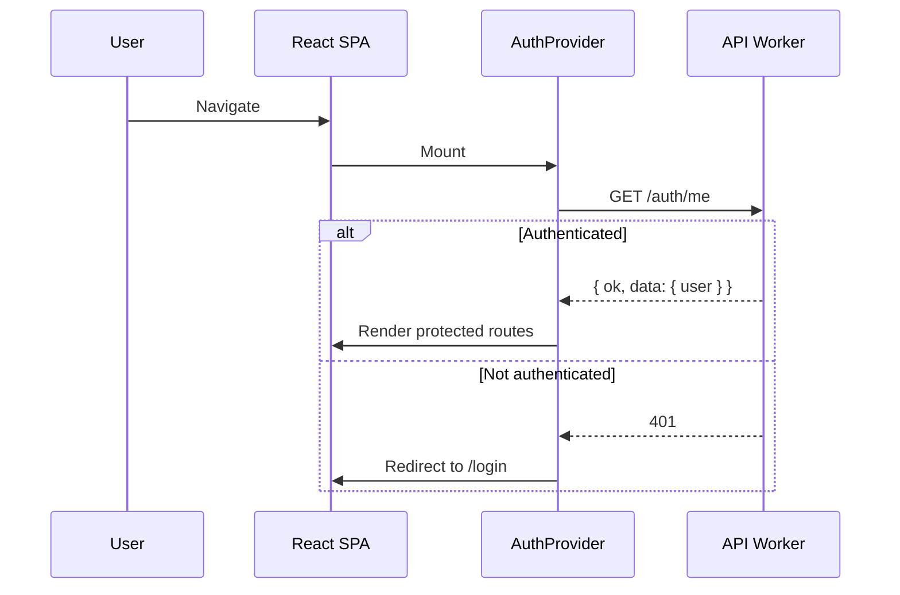

# 13 — Frontend Architecture & Implementation Plan

> React SPA with Vite, Tailwind CSS v4, and shadcn/ui. Full coverage of every v2 API endpoint with role-aware UI for participants, judges, organizers, and platform admins.

**Related docs:** [API Design](./11-api-design.md) | [Roles & Permissions](./06-roles-permissions.md) | [Authentication](./01-authentication.md)

---

## Overview

The DevSage frontend is a single-page React application that consumes the v2 REST API. Every documented API endpoint must have a corresponding UI surface. The frontend is organized by user role:

- **Public** — Landing page, login, hackathon browsing
- **Participant** — Dashboard, team management, submission status, leaderboard
- **Judge** — Scoring dashboard, rubric reference, assignment queue
- **Organizer** — Hackathon CRUD, rubric configuration, judge management, phase transitions, team oversight
- **Platform Admin** — Organizer invite management, platform admin list

---

## Tech Stack

| Layer | Technology |
|-------|------------|
| Framework | React 18 |
| Build | Vite |
| Routing | React Router v7 |
| Styling | Tailwind CSS v4 |
| Components | shadcn/ui (Radix primitives) |
| Animations | Framer Motion |
| Icons | Lucide React |
| Toasts | Sonner |
| HTTP Client | Custom `apiRequest()` wrapper |
| Deploy | Cloudflare Workers Static Assets |

---

## Application Architecture



---

## Route Table

### Public Routes

| Route | Page | Description |
|-------|------|-------------|
| `/` | `home.tsx` | Marketing landing page |
| `/login` | `login.tsx` | OAuth buttons (GitHub + Google) |
| `/auth/callback` | `auth-callback.tsx` | Post-OAuth redirect handler |
| `/link-required` | `link-required.tsx` | GitHub account linking prompt |
| `/about` | `about.tsx` | About DevSage |

### Protected Routes (require authentication)

| Route | Page | Min Role | Description |
|-------|------|----------|-------------|
| `/dashboard` | `dashboard.tsx` | any | Hackathon browser with tabs |
| `/hackathons/:slug` | `hackathon-detail.tsx` | any | Hackathon detail + participant actions |
| `/hackathons/:slug/teams` | `team-management.tsx` | participant | Team members, repo linking, invite code |
| `/hackathons/:slug/leaderboard` | `leaderboard.tsx` | any | Weighted score rankings |
| `/hackathons/:slug/judge` | `judge-dashboard.tsx` | judge | Scoring interface with rubric |
| `/hackathons/:slug/manage` | `hackathon-manage.tsx` | admin | Full organizer management panel |
| `/organiser` | `organizer-dashboard.tsx` | organizer | Organizer's hackathon list + create |
| `/admin` | `admin-dashboard.tsx` | platform_admin | Platform admin panel |
| `/admin/invites` | (within admin) | platform_admin | Organizer invite management |
| `/profile` | `profile.tsx` | any | User profile display |

---

## API Endpoint Coverage

Every v2 API endpoint must map to a UI action. Current status:

### Authentication (6/6 covered ✅)

| Endpoint | UI Surface | Status |
|----------|-----------|--------|
| `GET /auth/github` | Login page OAuth button | ✅ |
| `GET /auth/callback/github` | auth-callback.tsx router | ✅ |
| `GET /auth/google` | Login page OAuth button | ✅ |
| `GET /auth/callback/google` | auth-callback.tsx router | ✅ |
| `GET /auth/me` | AuthProvider on mount | ✅ |
| `POST /auth/logout` | DashboardLayout dropdown | ✅ |

### Hackathons (6/6 needed)

| Endpoint | UI Surface | Status |
|----------|-----------|--------|
| `GET /api/v1/hackathons` | dashboard.tsx, organizer-dashboard.tsx | ✅ |
| `POST /api/v1/hackathons` | organizer-dashboard.tsx create dialog | 🔧 Fix path |
| `GET /api/v1/hackathons/:slug` | hackathon-detail.tsx | ✅ |
| `PUT /api/v1/hackathons/:slug` | hackathon-manage.tsx edit form | 🆕 Build |
| `PATCH /api/v1/hackathons/:slug/status` | hackathon-manage.tsx phase controls | 🆕 Build |
| `DELETE /api/v1/hackathons/:slug` | hackathon-manage.tsx danger zone | 🆕 Build |

### Teams (6/6 needed)

| Endpoint | UI Surface | Status |
|----------|-----------|--------|
| `POST .../:slug/teams` | hackathon-detail.tsx create form | 🔧 Fix fields |
| `GET .../:slug/teams` | hackathon-detail.tsx team list | ✅ |
| `GET .../:slug/teams/:id` | team-management.tsx | ✅ |
| `POST .../:slug/teams/:id/join` | hackathon-detail.tsx join form | 🔧 Fix endpoint |
| `DELETE .../:slug/teams/:id/members/:userId` | team-management.tsx remove button | 🆕 Build |
| `POST .../:slug/teams/:id/repo` | team-management.tsx repo form | ✅ |

### Submissions (2/2 needed)

| Endpoint | UI Surface | Status |
|----------|-----------|--------|
| `GET .../:slug/submissions` | hackathon-detail.tsx, team-management.tsx | ✅ |
| `GET .../:slug/submissions/:teamId` | hackathon-manage.tsx per-team view | 🆕 Build |

### Judging (8/8 needed)

| Endpoint | UI Surface | Status |
|----------|-----------|--------|
| `POST .../:slug/judges` | hackathon-manage.tsx invite form | 🆕 Build |
| `GET .../:slug/judges` | hackathon-manage.tsx judge list | 🆕 Build |
| `POST .../:slug/judges/:id/respond` | judge invite response (email link) | 🆕 Build |
| `GET .../:slug/rubric` | judge-dashboard.tsx sidebar | ✅ |
| `POST .../:slug/rubric` | hackathon-manage.tsx rubric editor | 🆕 Build |
| `POST .../:slug/judges/assign` | hackathon-manage.tsx assign button | 🆕 Build |
| `POST .../:slug/scores` | judge-dashboard.tsx score form | ✅ |
| `GET .../:slug/leaderboard` | leaderboard.tsx | 🔧 Use real endpoint |

### Platform Admin (4/4 needed)

| Endpoint | UI Surface | Status |
|----------|-----------|--------|
| `POST /api/v1/admin/invites` | admin-dashboard.tsx invite form | 🆕 Build |
| `GET /api/v1/admin/invites` | admin-dashboard.tsx invite list | 🆕 Build |
| `DELETE /api/v1/admin/invites/:id` | admin-dashboard.tsx revoke button | 🆕 Build |
| `GET /api/v1/admin/admins` | admin-dashboard.tsx admin list | 🆕 Build |

### Organizer Invites (2/2 needed)

| Endpoint | UI Surface | Status |
|----------|-----------|--------|
| `GET /api/v1/invites/:code` | invite-accept.tsx status display | 🆕 Build |
| `POST /api/v1/invites/:code/accept` | invite-accept.tsx accept button | 🆕 Build |

---

## Pages to Build / Fix

### 🔧 Fix Existing Pages

#### 1. hackathon-detail.tsx

**Issues:**
- Uses wrong field names: `registration_start_date` → `registration_opens`, `hacking_start_date` → should not exist, `captain_id` → resolve via `team_members` role, `join_code` → `invite_code`
- Status enum uses `DRAFT`, `HACKING` (uppercase/wrong) instead of `draft`, `active` (lowercase v2 values)
- Join team calls `POST .../teams/join` instead of `POST .../teams/:id/join` with `{ inviteCode }`
- Leave team calls non-existent `/leave` endpoint instead of `DELETE .../teams/:id/members/:userId`
- Hardcoded prize "$10,000"
- Organizer tabs hidden with `{false &&}`

**Fix:**
- Align all interfaces and field names with v2 API response shapes
- Fix join team to pass team ID + inviteCode
- Replace leave with proper member removal (DELETE)
- Remove organizer tabs (moved to hackathon-manage.tsx)
- Remove hardcoded prize

#### 2. organizer-dashboard.tsx

**Issues:**
- Creates hackathon at `/hackathons` instead of `/api/v1/hackathons`
- Uses wrong status enums (`DRAFT`, `HACKING`, `SUBMISSION_CLOSED`)
- Calls non-existent `/lifecycle` and `/transition` endpoints
- Field names don't match v2 API (`registrationStartDate` → `registration_opens`, `hackingStartDate` → no equivalent)
- Teams/Registrations counts show "-" placeholder

**Fix:**
- Fix create endpoint to `/api/v1/hackathons`
- Align form fields with `CreateHackathonRequestSchema` (slug, title, description, registration_opens, registration_closes, submission_deadline, min_team_size, max_team_size)
- Use `PATCH .../status` for phase transitions
- Show real team counts

#### 3. team-management.tsx

**Issues:**
- Uses `captain_id` instead of checking `team_members` role
- Uses `join_code` instead of `invite_code`
- Uses `user.name` instead of `user.display_name`
- Calls non-existent `/leave` endpoint

**Fix:**
- Align field names with v2 API
- Identify team leader via `team_members` where `role = 'leader'`
- Replace leave with `DELETE .../teams/:id/members/:userId`
- Add member removal UI for team leader

#### 4. leaderboard.tsx

**Issues:**
- Does NOT use `GET .../leaderboard` endpoint (builds leaderboard from raw submissions sorted by date)
- No actual weighted scoring display

**Fix:**
- Use `GET /api/v1/hackathons/:slug/leaderboard` endpoint
- Display weighted percentages, judge count, proper ranking

#### 5. judge-dashboard.tsx

**Issues:**
- Score submission uses `assignmentId` as `submissionId` (field mismatch)
- Assignment data structure may not match API response

**Fix:**
- Verify assignment response shape matches API
- Ensure `submissionId` in score POST uses actual submission ID, not assignment ID

### 🆕 New Pages to Build

#### 1. hackathon-manage.tsx — Organizer Management Panel

**Route:** `/hackathons/:slug/manage`
**Role:** admin+
**Sections:**
- **Overview** — Hackathon config display, status badge, phase transition buttons
- **Edit** — Update hackathon details (PUT endpoint)
- **Rubric** — Configure scoring criteria (bulk upsert)
- **Judges** — Invite judges, view status, trigger assignment
- **Teams** — View all teams, submissions, force push flags
- **Submissions** — View all submissions with status filters
- **Danger Zone** — Delete hackathon (owner only)

**API Endpoints Used:**
- `GET/PUT /api/v1/hackathons/:slug`
- `PATCH /api/v1/hackathons/:slug/status`
- `DELETE /api/v1/hackathons/:slug`
- `GET/POST /api/v1/hackathons/:slug/rubric`
- `GET/POST /api/v1/hackathons/:slug/judges`
- `POST /api/v1/hackathons/:slug/judges/assign`
- `GET /api/v1/hackathons/:slug/submissions`
- `GET /api/v1/hackathons/:slug/teams`

#### 2. admin-dashboard.tsx — Platform Admin Panel

**Route:** `/admin`
**Role:** platform_admin
**Sections:**
- **Invites** — Create, list, revoke organizer invites
- **Admins** — List platform admins

**API Endpoints Used:**
- `POST/GET/DELETE /api/v1/admin/invites`
- `GET /api/v1/admin/admins`

#### 3. invite-accept.tsx — Organizer Invite Acceptance

**Route:** `/invites/:code`
**Role:** authenticated
**Flow:**
1. Fetch invite status (`GET /api/v1/invites/:code`)
2. Show invite details (email, status, expiry)
3. Accept button (`POST /api/v1/invites/:code/accept`)

#### 4. judge-invite-respond.tsx — Judge Invite Response

**Route:** `/hackathons/:slug/judge/respond`
**Role:** authenticated
**Flow:**
1. Show judge invite details
2. Accept/decline buttons (`POST .../judges/:id/respond`)

---

## Component Architecture

### Shared Components

| Component | Location | Purpose |
|-----------|----------|---------|
| `DashboardLayout` | `components/dashboard-layout.tsx` | Sticky navbar + profile dropdown |
| `ProtectedRoute` | `components/protected-route.tsx` | Auth + role guard |
| `ErrorBoundary` | `components/ErrorBoundary.tsx` | React error boundary |
| shadcn/ui primitives | `components/ui/` | Button, Card, Dialog, Badge, Input, Skeleton, Tabs, DropdownMenu |

### New Components Needed

| Component | Purpose |
|-----------|---------|
| `RubricEditor` | Drag-sortable criteria list with weight/max_score inputs |
| `PhaseTransitionBar` | Status stepper showing current phase with next-step button |
| `JudgeInviteForm` | Search users + invite as judge |
| `TeamOverviewTable` | Teams with member count, repo, submission status |
| `SubmissionTable` | Submissions with status, tag, commit SHA, late flag |
| `ForceRushAlert` | Force push warning banner with affected submissions |
| `InviteManagement` | Create/list/revoke organizer invites |

---

## Data Flow

### API Client Pattern

All API calls go through `apiRequest<T>()`:

```typescript
const res = await apiRequest<{ ok: true; data: Hackathon; meta: unknown }>(
  `/api/v1/hackathons/${slug}`
);
// res.data is typed as Hackathon
```

### Response Type Convention

Every API call should use the standard envelope type:

```typescript
interface ApiResponse<T> {
  ok: true;
  data: T;
  meta?: { total?: number; limit?: number; offset?: number; etag?: string };
}
```

### Auth Flow



---

## Navigation Structure

### Navbar Links (DashboardLayout)

| Link | Visible To | Route |
|------|-----------|-------|
| Dashboard | All | `/dashboard` |
| Organiser | Users with organizerRoles | `/organiser` |
| Admin | Platform admins | `/admin` |

### Hackathon Detail Sub-Navigation

| Link | Visible To | Route |
|------|-----------|-------|
| Overview | All | `/hackathons/:slug` |
| My Team | Participants | `/hackathons/:slug/teams` |
| Leaderboard | All (when visible) | `/hackathons/:slug/leaderboard` |
| Judge Panel | Judges | `/hackathons/:slug/judge` |
| Manage | Admin+ | `/hackathons/:slug/manage` |

---

## Design System

| Token | Value | Usage |
|-------|-------|-------|
| Background | `#000000` | Page background |
| Text primary | `#FFFFFF` | Headings, body |
| Text secondary | `rgba(255,255,255,0.5)` | Muted text |
| Accent | `#CCFF00` | CTAs, active states, brand |
| Accent secondary | `#00D4FF` | Ongoing states |
| Error | `#FF6B6B` | Destructive actions |
| Border | `rgba(255,255,255,0.1)` | Card borders |
| Surface | `rgba(255,255,255,0.03)` | Card backgrounds |

---

## File References

| File | Purpose |
|------|---------|
| `apps/web/src/main.tsx` | Bootstrap: BrowserRouter + AuthProvider + Toaster |
| `apps/web/src/App.tsx` | All route definitions |
| `apps/web/src/lib/api.ts` | `apiRequest()` — fetch wrapper with credentials |
| `apps/web/src/lib/utils.ts` | `cn()` — clsx + tailwind-merge |
| `apps/web/src/contexts/auth-context.tsx` | `AuthProvider`, `useAuth()` |
| `apps/web/src/components/protected-route.tsx` | Auth + role guard |
| `apps/web/src/components/dashboard-layout.tsx` | Shared layout |
| `apps/web/src/components/ui/*.tsx` | shadcn/ui primitives |
| `apps/web/src/pages/*.tsx` | All page components |
| `apps/web/src/index.css` | Tailwind v4 directives + theme vars |
| `apps/web/vite.config.ts` | Vite config + API dev proxy |
| `apps/web/.env.production` | `VITE_API_ORIGIN=https://api.devsage.org` |
