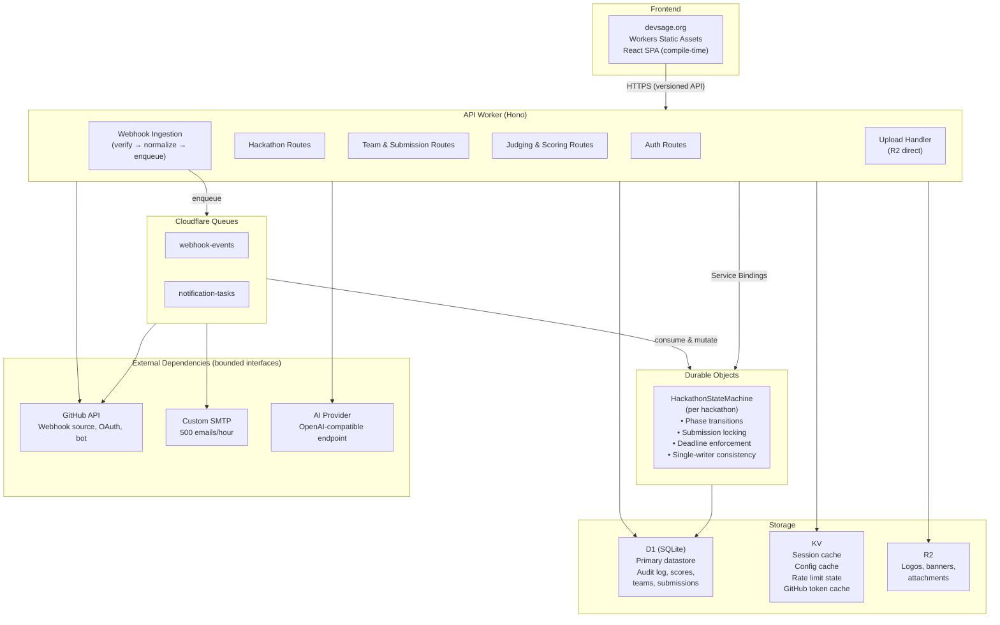
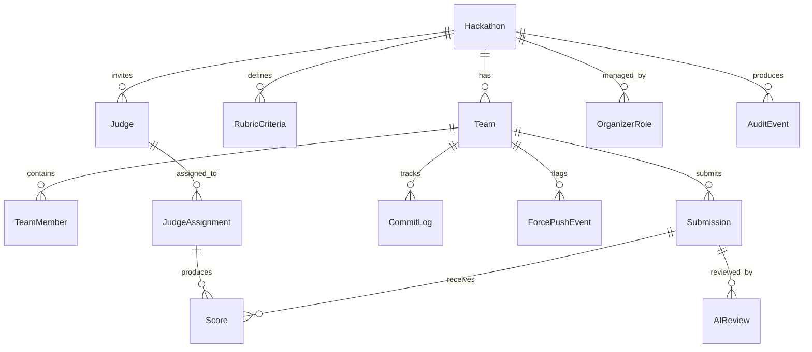
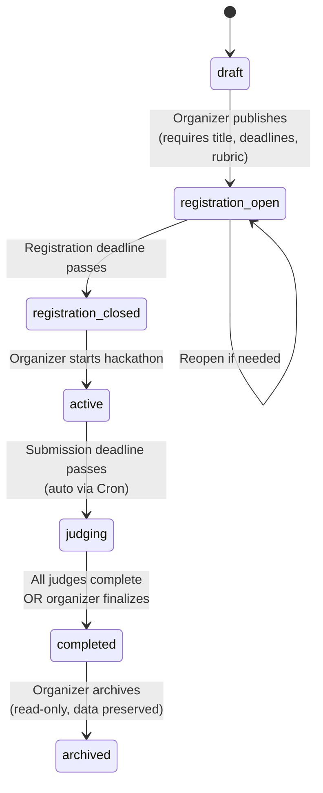
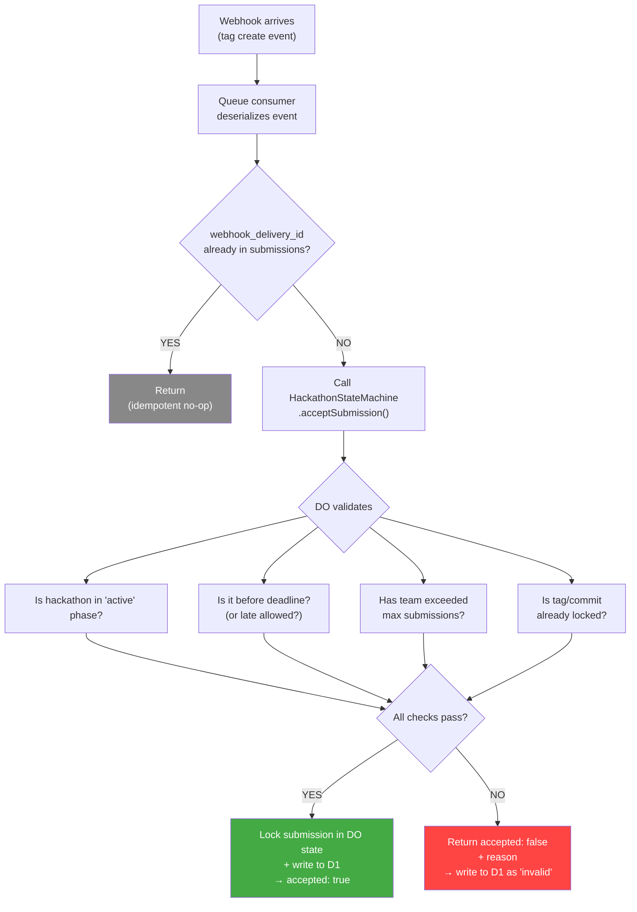
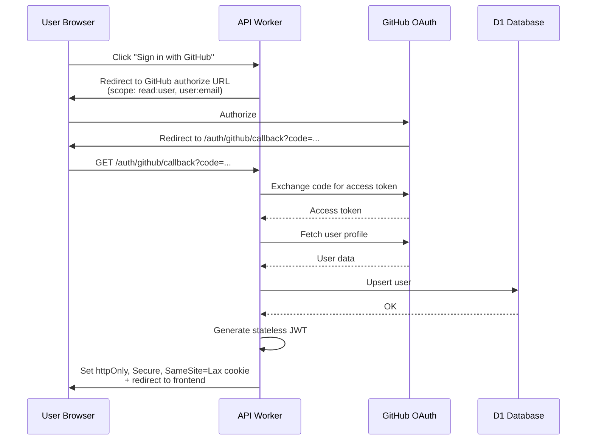
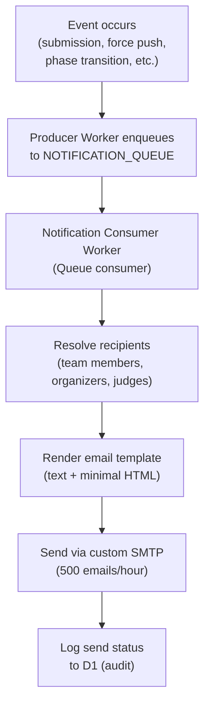

# DevSage — Backend Architecture Document v2

**Domain:** devsage.org  
**Version:** 2.1 — Edge-Native, Correctness-First Rewrite  
**Date:** February 2026  
**Author:** Srijan Guchhait (srijan.guchhait@gmail.com)  
**GitHub:** qwertystars

---

## Table of Contents

1. [Executive Summary](#1-executive-summary)
2. [Architectural Principles](#2-architectural-principles)
3. [System Topology](#3-system-topology)
4. [Cloudflare Primitives & Budget](#4-cloudflare-primitives--budget)
5. [Domain Model](#5-domain-model)
6. [Database Schema (D1)](#6-database-schema-d1)
7. [Durable Objects — Hackathon State Machines](#7-durable-objects--hackathon-state-machines)
8. [Authentication & Authorization](#8-authentication--authorization)
9. [GitHub App Integration & Webhook Pipeline](#9-github-app-integration--webhook-pipeline)
10. [API Surface](#10-api-surface)
11. [Frontend Architecture](#11-frontend-architecture)
12. [Notification System](#12-notification-system)
13. [Judge Evaluation Workflow](#13-judge-evaluation-workflow)
14. [AI-Assisted Review Layer](#14-ai-assisted-review-layer)
15. [Observability & Audit](#15-observability--audit)
16. [Failure Modes & Degradation](#16-failure-modes--degradation)
17. [Competitive Differentiation](#17-competitive-differentiation)
18. [Worker Code Organization](#18-worker-code-organization)
19. [Deployment & Configuration](#19-deployment--configuration)
20. [Development Roadmap](#20-development-roadmap)
21. [Open Questions](#21-open-questions)

---

## 1. Executive Summary

DevSage is a GitHub-native hackathon management platform. Organizers create hackathons with declarative configuration. Participants connect GitHub repos. A GitHub App (bot) tracks commits, detects force pushes, captures tag-based submissions, and enforces deadlines — all without manual intervention.

**Architectural stance:** Edge-native, single-tenant, correctness-first. The entire system runs within Cloudflare Workers and its first-party primitives. No external compute, no third-party databases, no background workers outside of Queues and Cron Triggers. Every design decision accounts for Workers' constraints on CPU time (10ms free / 30s default paid, configurable up to 5 min, per invocation), memory per isolate (128 MB), subrequest limits (50 free / 1,000 paid per request), and request duration.

**Scale target:** 3 concurrent hackathons, ~500 total users, 2–5 member teams.

**Infrastructure cost:** $0/month on Workers Free plan at initial scale. Upgrade to $5/month Workers Paid plan if daily request limits (100k/day), CPU time (10ms/invocation), or Queue operations (10k/day) are exceeded under load.

---

## 2. Architectural Principles

These are non-negotiable constraints that govern every design decision:

**P1 — Deterministic State Transitions.** All hackathon lifecycle mutations (phase transitions, submission acceptance, score finalization) occur through Durable Objects operating under a single-writer model. No race conditions. No eventual consistency on fairness-critical paths.

**P2 — Bounded Execution.** Every Worker invocation completes within CPU and wall-clock limits. No unbounded loops, no streaming large payloads into memory, no recursive GitHub API pagination without explicit depth limits. Unused response bodies are canceled early.

**P3 — Idempotent Operations.** All webhook handlers and state mutations are keyed by explicit identifiers (webhook delivery ID, commit SHA, submission tag). Safe to retry under network failure or redelivery storms.

**P4 — Explicit Failure Modes.** Every external dependency (GitHub API, SMTP, AI provider) has a bounded interface with defined fail-open or fail-closed behavior. No silent failures. No implicit retries without backoff.

**P5 — Auditability.** Every state-changing operation produces an append-only audit event. Scores, remarks, AI summaries, and phase transitions are linked to originating criteria and submission snapshots. Tamper-evident by construction.

**P6 — Graceful Degradation.** Non-critical features (AI summaries, real-time activity feeds, email notifications) degrade without affecting core submission and evaluation paths. The system never blocks a fairness-critical workflow on an auxiliary dependency.

**P7 — No External Compute.** If Cloudflare doesn't offer it as a first-party primitive, it doesn't exist in this architecture. The only exception is the GitHub API (external by necessity) and a custom SMTP server for email.

---

## 3. System Topology



---

## 4. Cloudflare Primitives & Budget

### 4.1 Workers Free Plan (Starting Point) / Paid Plan ($5/month if needed)

Durable Objects (SQLite-backed), Queues, D1, KV, and R2 are all available on the Workers Free plan. The Paid plan ($5/month) provides higher CPU time limits, more subrequests per request, and monthly (rather than daily) usage quotas. Start on Free; upgrade only if daily limits are hit under peak load.

| Primitive | Free Limit | Paid Limit | DevSage Usage (peak) | Headroom (Free) |
|-----------|-----------|-----------|---------------------|----------|
| Workers requests | 100k/day (~3M/month) | 10M/month | ~750k/month (~25k/day avg) | 4× daily |
| Workers CPU time | 10ms per invocation | 30s default (up to 5 min); 30M CPU-ms/month | Target <8ms p99 | OK if routes stay lean |
| D1 rows read | 5M/day | 25B/month | ~6M/month (~200k/day avg) | OK |
| D1 rows written | 100k/day | 50M/month | ~600k/month (~20k/day avg) | 5× daily |
| D1 storage | 5 GB | 10 GB | ~50 MB | 100× |
| KV reads | 100k/day | 10M/month | ~300k/month (~10k/day avg) | 10× daily |
| KV writes | 1k/day | 1M/month | ~50k/month (~1.7k/day avg) | Tight on free — consider caching strategy |
| R2 storage | 10 GB (free) | 10 GB (free) | ~2 GB | 5× |
| R2 Class A ops | 1M/month (free) | 1M/month (free) | ~100k/month | 10× |
| R2 Class B ops | 10M/month (free) | 10M/month (free) | ~500k/month | 20× |
| Queues operations | 10k/day (free, 24h retention) | 1M/month (14-day retention) | ~100k/month (~3.3k/day avg) | 3× daily (watch burst days) |
| Durable Objects (SQLite) | 5 GB storage, daily request limits | 1M requests/month included, unlimited storage | ~200k/month | OK |
| Durable Objects duration | Included (free) | 400k GB-s/month included | Well within | ✅ |
| Cron Triggers | 5 per Worker | 5 per Worker | 2-3 needed | ✅ |
| Subrequests per request | 50 (1,000 for internal: KV, D1, DO) | 1,000 | Target <10 | 5× |

### 4.2 External Services

| Service | Purpose | Limit | Cost |
|---------|---------|-------|------|
| GitHub App | OAuth, webhooks, bot API | 5000 req/hr (authenticated) | Free |
| Custom SMTP | Transactional email | 500 emails/hour | Self-hosted |
| AI Provider | Advisory review summaries | Per-token, usage-based | Variable |

### 4.3 Per-Isolate Constraints (Design Implications)

| Constraint | Free Limit | Paid Limit | Design Implication |
|------------|-----------|------------|-------------------|
| Memory | 128 MB | 128 MB | No in-memory caching of large datasets; stream or paginate |
| CPU time (Worker) | 10ms | 30s default (up to 5 min) | Keep free-tier routes under 10ms; offload heavy processing to Queues or Durable Objects |
| CPU time (DO) | 30s wall-clock | 30s default (configurable) | Sufficient for state machine transitions |
| Bundle size | 10 MB compressed | 10 MB compressed | Keep dependencies minimal; Hono (~14KB) not Express |
| Subrequests | 50 per request (1,000 for internal) | 1,000 per request | Batch D1 queries; limit GitHub API fan-out |
| Concurrent connections | 6 | 6 | Serialize external API calls where possible |

---

## 5. Domain Model

### 5.1 Entity Relationship



### 5.2 Hackathon Lifecycle (State Machine)



**Transition rules:**
- Only forward transitions allowed (no `judging` → `active`)
- `draft` → `registration_open` requires: title, description, deadlines, at least 1 rubric criterion
- `active` → `judging` requires: submission deadline has passed
- `judging` → `completed` requires: all assigned judges have submitted scores OR organizer forces finalization
- Each transition is a single Durable Object alarm or explicit organizer action
- All transitions produce audit events

---

## 6. Database Schema (D1)

D1 is SQLite-based. All primary keys are TEXT UUIDs generated via `crypto.randomUUID()`. All timestamps are ISO 8601 TEXT stored in UTC.

### 6.1 Core Tables

```sql
-- ============================================================
-- USERS
-- ============================================================
CREATE TABLE users (
  id                TEXT PRIMARY KEY,
  github_id         INTEGER UNIQUE NOT NULL,
  google_id         TEXT UNIQUE,                -- NULL if GitHub-only auth
  github_username   TEXT NOT NULL,
  display_name      TEXT NOT NULL,
  email             TEXT,
  avatar_url        TEXT,
  created_at        TEXT NOT NULL DEFAULT (datetime('now')),
  updated_at        TEXT NOT NULL DEFAULT (datetime('now'))
);

-- ============================================================
-- HACKATHONS
-- ============================================================
CREATE TABLE hackathons (
  id                    TEXT PRIMARY KEY,
  slug                  TEXT UNIQUE NOT NULL,
  title                 TEXT NOT NULL,
  description           TEXT,
  rules_md              TEXT,

  -- Timing (all UTC ISO 8601)
  registration_opens    TEXT NOT NULL,
  registration_closes   TEXT NOT NULL,
  submission_deadline   TEXT NOT NULL,
  judging_starts        TEXT,
  judging_ends          TEXT,

  -- Team constraints
  min_team_size         INTEGER NOT NULL DEFAULT 1,
  max_team_size         INTEGER NOT NULL DEFAULT 5,
  max_teams             INTEGER,                      -- NULL = unlimited

  -- Submission config
  submission_tag_pattern TEXT NOT NULL DEFAULT 'submission_v%',
  max_submissions_per_team INTEGER DEFAULT NULL,       -- NULL = unlimited
  allow_late_submissions INTEGER NOT NULL DEFAULT 0,

  -- Branding
  primary_color         TEXT DEFAULT '#6366f1',
  logo_r2_key           TEXT,
  banner_r2_key         TEXT,
  custom_subdomain      TEXT,                          -- e.g., "acmhack" → acmhack.devsage.org

  -- State (authoritative copy in Durable Object; D1 is read replica)
  status                TEXT NOT NULL DEFAULT 'draft'
                        CHECK(status IN (
                          'draft','registration_open','registration_closed',
                          'active','judging','completed','archived'
                        )),

  created_by            TEXT NOT NULL REFERENCES users(id),
  created_at            TEXT NOT NULL DEFAULT (datetime('now')),
  updated_at            TEXT NOT NULL DEFAULT (datetime('now'))
);

-- ============================================================
-- ORGANIZER ROLES
-- ============================================================
CREATE TABLE organizer_roles (
  id              TEXT PRIMARY KEY,
  hackathon_id    TEXT NOT NULL REFERENCES hackathons(id) ON DELETE CASCADE,
  user_id         TEXT NOT NULL REFERENCES users(id),
  role            TEXT NOT NULL DEFAULT 'admin'
                  CHECK(role IN ('owner','admin','moderator')),
  created_at      TEXT NOT NULL DEFAULT (datetime('now')),

  UNIQUE(hackathon_id, user_id)
);

-- ============================================================
-- TEAMS
-- ============================================================
CREATE TABLE teams (
  id                      TEXT PRIMARY KEY,
  hackathon_id            TEXT NOT NULL REFERENCES hackathons(id) ON DELETE CASCADE,
  name                    TEXT NOT NULL,
  repo_full_name          TEXT,               -- "owner/repo"
  repo_url                TEXT,
  github_installation_id  INTEGER,
  bot_active              INTEGER NOT NULL DEFAULT 0,
  invite_code             TEXT UNIQUE,         -- for team join links
  created_at              TEXT NOT NULL DEFAULT (datetime('now')),

  UNIQUE(hackathon_id, name),
  UNIQUE(hackathon_id, repo_full_name)        -- one repo per hackathon
);

-- ============================================================
-- TEAM MEMBERS
-- ============================================================
CREATE TABLE team_members (
  id          TEXT PRIMARY KEY,
  team_id     TEXT NOT NULL REFERENCES teams(id) ON DELETE CASCADE,
  user_id     TEXT NOT NULL REFERENCES users(id),
  role        TEXT NOT NULL DEFAULT 'member'
              CHECK(role IN ('leader','member')),
  joined_at   TEXT NOT NULL DEFAULT (datetime('now')),

  UNIQUE(team_id, user_id)
);

-- ============================================================
-- SUBMISSIONS
-- Immutable once status transitions past 'received'.
-- Keyed by (team_id, tag_name) for idempotent webhook processing.
-- ============================================================
CREATE TABLE submissions (
  id                TEXT PRIMARY KEY,
  team_id           TEXT NOT NULL REFERENCES teams(id) ON DELETE CASCADE,
  hackathon_id      TEXT NOT NULL REFERENCES hackathons(id) ON DELETE CASCADE,
  tag_name          TEXT NOT NULL,
  commit_sha        TEXT NOT NULL,            -- pinned at acceptance time
  commit_message    TEXT,
  commit_author     TEXT,
  branch            TEXT DEFAULT 'main',
  submitted_at      TEXT NOT NULL,            -- timestamp from GitHub event
  received_at       TEXT NOT NULL DEFAULT (datetime('now')),
  is_late           INTEGER NOT NULL DEFAULT 0,
  is_final          INTEGER NOT NULL DEFAULT 0,
  version           INTEGER NOT NULL,
  status            TEXT NOT NULL DEFAULT 'received'
                    CHECK(status IN (
                      'received','validated','invalid','locked',
                      'under_review','scored','invalidated'
                    )),
  validation_errors TEXT,                     -- JSON array
  locked_at         TEXT,                     -- set when exactly-once lock acquired
  webhook_delivery_id TEXT UNIQUE,            -- GitHub delivery ID for idempotency

  UNIQUE(team_id, tag_name)
);

-- ============================================================
-- COMMIT LOG
-- Append-only. Never updated or deleted.
-- ============================================================
CREATE TABLE commit_log (
  id                TEXT PRIMARY KEY,
  team_id           TEXT NOT NULL REFERENCES teams(id) ON DELETE CASCADE,
  hackathon_id      TEXT NOT NULL REFERENCES hackathons(id) ON DELETE CASCADE,
  commit_sha        TEXT NOT NULL,
  message           TEXT,
  author_username   TEXT,
  branch            TEXT DEFAULT 'main',
  pushed_at         TEXT NOT NULL,
  is_force_push     INTEGER NOT NULL DEFAULT 0,
  commits_in_push   INTEGER DEFAULT 1,
  webhook_delivery_id TEXT,

  created_at        TEXT NOT NULL DEFAULT (datetime('now'))
);

-- ============================================================
-- FORCE PUSH EVENTS
-- Separate audit trail for force pushes.
-- ============================================================
CREATE TABLE force_push_events (
  id                  TEXT PRIMARY KEY,
  team_id             TEXT NOT NULL REFERENCES teams(id) ON DELETE CASCADE,
  hackathon_id        TEXT NOT NULL REFERENCES hackathons(id) ON DELETE CASCADE,
  before_sha          TEXT NOT NULL,
  after_sha           TEXT NOT NULL,
  branch              TEXT NOT NULL,
  commits_lost_shas   TEXT,                   -- JSON array of lost SHAs
  commits_lost_count  INTEGER DEFAULT 0,
  detected_at         TEXT NOT NULL DEFAULT (datetime('now')),
  notified_organizer  INTEGER NOT NULL DEFAULT 0,
  action_taken        TEXT DEFAULT 'logged'
                      CHECK(action_taken IN ('logged','warned','flagged')),
  submissions_invalidated TEXT,               -- JSON array of affected submission IDs
  webhook_delivery_id TEXT
);

-- ============================================================
-- JUDGES
-- ============================================================
CREATE TABLE judges (
  id              TEXT PRIMARY KEY,
  hackathon_id    TEXT NOT NULL REFERENCES hackathons(id) ON DELETE CASCADE,
  user_id         TEXT NOT NULL REFERENCES users(id),
  invite_status   TEXT NOT NULL DEFAULT 'pending'
                  CHECK(invite_status IN ('pending','accepted','declined')),
  invited_at      TEXT NOT NULL DEFAULT (datetime('now')),
  accepted_at     TEXT,

  UNIQUE(hackathon_id, user_id)
);

-- ============================================================
-- RUBRIC CRITERIA
-- ============================================================
CREATE TABLE rubric_criteria (
  id              TEXT PRIMARY KEY,
  hackathon_id    TEXT NOT NULL REFERENCES hackathons(id) ON DELETE CASCADE,
  name            TEXT NOT NULL,
  description     TEXT,
  max_score       INTEGER NOT NULL DEFAULT 10,
  weight          REAL NOT NULL DEFAULT 1.0,
  sort_order      INTEGER NOT NULL DEFAULT 0,

  UNIQUE(hackathon_id, name)
);

-- ============================================================
-- JUDGE ASSIGNMENTS
-- ============================================================
CREATE TABLE judge_assignments (
  id              TEXT PRIMARY KEY,
  judge_id        TEXT NOT NULL REFERENCES judges(id) ON DELETE CASCADE,
  team_id         TEXT NOT NULL REFERENCES teams(id) ON DELETE CASCADE,
  hackathon_id    TEXT NOT NULL REFERENCES hackathons(id) ON DELETE CASCADE,
  submission_id   TEXT REFERENCES submissions(id),  -- pinned to specific submission
  status          TEXT NOT NULL DEFAULT 'pending'
                  CHECK(status IN ('pending','in_progress','completed')),
  assigned_at     TEXT NOT NULL DEFAULT (datetime('now')),

  UNIQUE(judge_id, team_id)
);

-- ============================================================
-- SCORES
-- Immutable once submitted. Linked to specific submission + criteria.
-- ============================================================
CREATE TABLE scores (
  id              TEXT PRIMARY KEY,
  submission_id   TEXT NOT NULL REFERENCES submissions(id),
  judge_id        TEXT NOT NULL REFERENCES judges(id),
  criteria_id     TEXT NOT NULL REFERENCES rubric_criteria(id),
  score           INTEGER NOT NULL CHECK(score >= 0),
  comment         TEXT,
  scored_at       TEXT NOT NULL DEFAULT (datetime('now')),

  UNIQUE(submission_id, judge_id, criteria_id)
);

-- ============================================================
-- AI REVIEW ARTIFACTS
-- Advisory only. Versioned and pinned to submission state.
-- ============================================================
CREATE TABLE ai_reviews (
  id              TEXT PRIMARY KEY,
  submission_id   TEXT NOT NULL REFERENCES submissions(id),
  commit_sha      TEXT NOT NULL,             -- pinned to exact commit
  provider        TEXT NOT NULL,             -- 'openai', 'anthropic', etc.
  model           TEXT NOT NULL,
  prompt_hash     TEXT NOT NULL,             -- SHA256 of prompt for reproducibility
  summary         TEXT,
  strengths       TEXT,                      -- JSON array
  concerns        TEXT,                      -- JSON array
  raw_response    TEXT,                      -- full API response for audit
  tokens_used     INTEGER,
  created_at      TEXT NOT NULL DEFAULT (datetime('now'))
);

-- ============================================================
-- AUDIT LOG
-- Append-only. Never updated or deleted.
-- ============================================================
CREATE TABLE audit_events (
  id              TEXT PRIMARY KEY,
  hackathon_id    TEXT REFERENCES hackathons(id),
  actor_id        TEXT REFERENCES users(id),
  actor_type      TEXT NOT NULL CHECK(actor_type IN ('user','system','bot','cron')),
  action          TEXT NOT NULL,
  entity_type     TEXT NOT NULL,             -- 'hackathon','team','submission','score', etc.
  entity_id       TEXT NOT NULL,
  details         TEXT,                      -- JSON object with action-specific data
  ip_address      TEXT,
  created_at      TEXT NOT NULL DEFAULT (datetime('now'))
);

-- ============================================================
-- INDEXES
-- ============================================================
CREATE INDEX idx_teams_hackathon ON teams(hackathon_id);
CREATE INDEX idx_teams_repo ON teams(repo_full_name);
CREATE INDEX idx_team_members_user ON team_members(user_id);
CREATE INDEX idx_team_members_team ON team_members(team_id);
CREATE INDEX idx_submissions_team ON submissions(team_id);
CREATE INDEX idx_submissions_hackathon ON submissions(hackathon_id);
CREATE INDEX idx_submissions_status ON submissions(hackathon_id, status);
CREATE INDEX idx_submissions_webhook ON submissions(webhook_delivery_id);
CREATE INDEX idx_commit_log_team ON commit_log(team_id, pushed_at);
CREATE INDEX idx_commit_log_hackathon ON commit_log(hackathon_id, pushed_at);
CREATE INDEX idx_force_push_team ON force_push_events(team_id);
CREATE INDEX idx_scores_submission ON scores(submission_id);
CREATE INDEX idx_scores_judge ON scores(judge_id);
CREATE INDEX idx_judge_assignments_judge ON judge_assignments(judge_id);
CREATE INDEX idx_judge_assignments_hackathon ON judge_assignments(hackathon_id);
CREATE INDEX idx_audit_hackathon ON audit_events(hackathon_id, created_at);
CREATE INDEX idx_audit_entity ON audit_events(entity_type, entity_id);
```

### 6.2 Storage Estimate

| Table | Estimated Rows (3 hackathons, 500 users) | Size |
|-------|------------------------------------------|------|
| users | 500 | ~200 KB |
| hackathons | 3 | ~15 KB |
| teams | 150 | ~60 KB |
| team_members | 500 | ~50 KB |
| submissions | 450 | ~150 KB |
| commit_log | 15,000 | ~5 MB |
| force_push_events | ~50 | ~30 KB |
| scores | 4,500 | ~1 MB |
| audit_events | 25,000 | ~8 MB |
| ai_reviews | 450 | ~2 MB |
| **Total** | | **~17 MB** |

5 GB D1 limit is effectively infinite at this scale. Even at 100 hackathons / 10,000 users, total storage stays under 500 MB.

---

## 7. Durable Objects — Hackathon State Machines

Each hackathon has exactly one Durable Object instance (`HackathonStateMachine`). This is the single source of truth for:

- Current phase/status
- Submission locking (exactly-once acceptance)
- Deadline enforcement via alarms
- Phase transition validation

### 7.1 Interface

```typescript
interface HackathonState {
  hackathonId: string;
  status: HackathonStatus;
  config: {
    registrationOpens: string;
    registrationCloses: string;
    submissionDeadline: string;
    judgingStarts: string | null;
    judgingEnds: string | null;
    maxTeams: number | null;
    maxSubmissionsPerTeam: number | null;
    allowLateSubmissions: boolean;
    submissionTagPattern: string;
  };
  teamCount: number;
  lockedSubmissions: Map<string, string>;  // teamId → submissionId (final lock)
}
```

### 7.2 Operations (all idempotent)

```typescript
class HackathonStateMachine extends DurableObject {
  // Phase transitions — validates preconditions, writes D1, emits audit
  async transitionTo(targetStatus: HackathonStatus, actorId: string): Promise<Result>

  // Submission lock — exactly-once semantics
  // Returns { accepted: true } or { accepted: false, reason: string }
  async acceptSubmission(params: {
    teamId: string;
    submissionId: string;
    tagName: string;
    commitSha: string;
    timestamp: string;
    webhookDeliveryId: string;
  }): Promise<SubmissionResult>

  // Check if submissions are currently accepted
  async canAcceptSubmissions(): Promise<{
    allowed: boolean;
    reason?: string;
    deadlineRemaining?: number;
  }>

  // Deadline enforcement via alarm
  async alarm(): Promise<void>
  // Scheduled at: submissionDeadline, judgingEnds
  // On fire: auto-transition to next phase if conditions met
}
```

### 7.3 Exactly-Once Submission Locking



This guarantees that even if GitHub delivers the same webhook 3 times concurrently, only one submission is accepted. The Durable Object's single-threaded execution model prevents all race conditions.

### 7.4 Alarm Schedule

```typescript
async initializeAlarms() {
  const deadlines = [
    { time: this.state.config.registrationCloses, action: 'close_registration' },
    { time: this.state.config.submissionDeadline, action: 'close_submissions' },
    { time: this.state.config.judgingEnds, action: 'finalize_judging' },
  ].filter(d => d.time && new Date(d.time) > new Date());

  // Set alarm for nearest upcoming deadline
  if (deadlines.length > 0) {
    deadlines.sort((a, b) => new Date(a.time).getTime() - new Date(b.time).getTime());
    await this.ctx.storage.setAlarm(new Date(deadlines[0].time));
    await this.ctx.storage.put('pendingAlarms', deadlines);
  }
}
```

---

## 8. Authentication & Authorization

### 8.1 OAuth 2.0 Flow

Supported providers: GitHub (primary), Google (secondary).



### 8.2 Token Design

```typescript
interface JWTPayload {
  sub: string;          // user.id
  ghid: number;         // github_id
  ghu: string;          // github_username
  iat: number;          // issued at
  exp: number;          // expiry (24h)
}
```

- Signed with HMAC-SHA256 using Worker secret (`JWT_SECRET`)
- Verified on every request in Hono middleware (~0.5ms CPU)
- No KV/D1 lookup required per request (stateless)
- CSRF mitigated via `SameSite=Lax` + checking `Origin` header on mutations

### 8.3 Authorization Model

Role resolution is per-request, per-hackathon. No global session state.

```typescript
type Role = 'anonymous' | 'participant' | 'team_leader' | 'judge' | 'moderator' | 'admin' | 'owner';

// Resolved via single D1 query per request (cached in KV for 60s)
async function resolveRole(userId: string, hackathonId: string): Promise<Role> {
  // Check organizer_roles first (owner > admin > moderator)
  // Then judges
  // Then team_members (leader > member → participant)
  // Else anonymous
}
```

**Permission matrix:**

| Action | anon | participant | leader | judge | mod | admin | owner |
|--------|------|-------------|--------|-------|-----|-------|-------|
| View hackathon | ✅ | ✅ | ✅ | ✅ | ✅ | ✅ | ✅ |
| Register team | ❌ | ✅ | ✅ | ❌ | ❌ | ✅ | ✅ |
| Connect repo | ❌ | ❌ | ✅ | ❌ | ❌ | ✅ | ✅ |
| View submissions | ❌ | own | own | assigned | ✅ | ✅ | ✅ |
| Score submissions | ❌ | ❌ | ❌ | ✅ | ❌ | ❌ | ❌ |
| View commit log | ❌ | own | own | assigned | ✅ | ✅ | ✅ |
| View force pushes | ❌ | ❌ | ❌ | ❌ | ✅ | ✅ | ✅ |
| Edit hackathon | ❌ | ❌ | ❌ | ❌ | ❌ | ✅ | ✅ |
| Manage judges | ❌ | ❌ | ❌ | ❌ | ❌ | ✅ | ✅ |
| Transition phase | ❌ | ❌ | ❌ | ❌ | ❌ | ✅ | ✅ |
| Delete hackathon | ❌ | ❌ | ❌ | ❌ | ❌ | ❌ | ✅ |

---

## 9. GitHub App Integration & Webhook Pipeline

### 9.1 GitHub App Configuration

**Permissions (minimum required):**

| Permission | Level | Purpose |
|-----------|-------|---------|
| Contents | Read | Read commit info, verify README exists |
| Metadata | Read | Mandatory for all apps |

**Subscribed events:** `push`, `create`, `delete`, `installation`, `installation_repositories`

**Webhook URL:** `https://api.devsage.org/webhooks/github`

### 9.2 Webhook Ingestion (Synchronous Worker)

The webhook handler is deliberately minimal. It verifies, normalizes, and enqueues. No D1 writes, no GitHub API calls, no business logic.

```typescript
async function handleWebhook(request: Request, env: Env): Promise<Response> {
  // 1. Verify HMAC-SHA256 signature
  const isValid = await verifyGitHubSignature(
    request,
    env.GITHUB_WEBHOOK_SECRET
  );
  if (!isValid) return new Response('Invalid signature', { status: 401 });

  // 2. Extract delivery ID for idempotency
  const deliveryId = request.headers.get('x-github-delivery');
  if (!deliveryId) return new Response('Missing delivery ID', { status: 400 });

  // 3. Parse event type
  const eventType = request.headers.get('x-github-event');
  const payload = await request.json();

  // 4. Normalize into internal event envelope
  const event = normalizeGitHubEvent(eventType, payload, deliveryId);
  if (!event) {
    // Unknown or irrelevant event type — acknowledge and discard
    return new Response('OK', { status: 200 });
  }

  // 5. Enqueue for async processing
  await env.WEBHOOK_QUEUE.send(event);

  // 6. Return 200 immediately (GitHub expects <10s response)
  return new Response('Accepted', { status: 202 });
}
```

**Wall-clock budget:** <50ms. Signature verification + JSON parse + queue send.

### 9.3 Webhook Processing (Queue Consumer)

```typescript
async function processWebhookBatch(
  batch: MessageBatch<NormalizedGitHubEvent>,
  env: Env
): Promise<void> {
  for (const message of batch.messages) {
    const event = message.body;

    try {
      switch (event.type) {
        case 'push':
          await handlePush(event, env);
          break;
        case 'tag_created':
          await handleTagCreate(event, env);
          break;
        case 'tag_deleted':
          await handleTagDelete(event, env);
          break;
        case 'installation':
          await handleInstallation(event, env);
          break;
        default:
          // Log and ack
          break;
      }
      message.ack();
    } catch (error) {
      // Retry with backoff (Queues handles this)
      message.retry({ delaySeconds: Math.min(300, 30 * message.attempts) });
    }
  }
}
```

**Queue config:** `max_batch_size: 10`, `max_batch_timeout: 30`, `max_retries: 5`

### 9.4 Push Handler

```typescript
async function handlePush(event: PushEvent, env: Env): Promise<void> {
  // 1. Look up team by repo_full_name
  const team = await env.DB.prepare(
    'SELECT id, hackathon_id FROM teams WHERE repo_full_name = ? AND bot_active = 1'
  ).bind(event.repoFullName).first();
  if (!team) return; // Not a tracked repo

  // 2. Log commits (bounded — only process event.commits, not full history)
  const commitInserts = event.commits.slice(0, 20).map(c => ({
    id: crypto.randomUUID(),
    team_id: team.id,
    hackathon_id: team.hackathon_id,
    commit_sha: c.sha,
    message: c.message?.substring(0, 500), // Bounded
    author_username: c.author?.username?.substring(0, 100),
    branch: event.ref.replace('refs/heads/', ''),
    pushed_at: event.timestamp,
    is_force_push: event.forced ? 1 : 0,
    commits_in_push: event.commits.length,
    webhook_delivery_id: event.deliveryId,
  }));

  // Batch insert (bounded at 20 commits)
  const stmt = env.DB.prepare(`
    INSERT INTO commit_log (id, team_id, hackathon_id, commit_sha, message,
      author_username, branch, pushed_at, is_force_push, commits_in_push,
      webhook_delivery_id)
    VALUES (?, ?, ?, ?, ?, ?, ?, ?, ?, ?, ?)
  `);

  await env.DB.batch(
    commitInserts.map(c => stmt.bind(
      c.id, c.team_id, c.hackathon_id, c.commit_sha, c.message,
      c.author_username, c.branch, c.pushed_at, c.is_force_push,
      c.commits_in_push, c.webhook_delivery_id
    ))
  );

  // 3. Force push detection
  if (event.forced) {
    await handleForcePush(event, team, env);
  }
}
```

### 9.5 Force Push Handler

```typescript
async function handleForcePush(
  event: PushEvent,
  team: { id: string; hackathon_id: string },
  env: Env
): Promise<void> {
  // GitHub push event includes event.before (old HEAD) and event.after (new HEAD)
  // Commits between before..after that are NOT in the new push are "lost"

  // We cannot enumerate lost commits without API call (compare endpoint).
  // Instead, record the before/after SHAs and the count delta.
  const forcePushId = crypto.randomUUID();
  const estimatedLost = Math.max(0, event.size - event.commits.length);

  await env.DB.prepare(`
    INSERT INTO force_push_events
    (id, team_id, hackathon_id, before_sha, after_sha, branch,
     commits_lost_count, detected_at, webhook_delivery_id)
    VALUES (?, ?, ?, ?, ?, ?, ?, datetime('now'), ?)
  `).bind(
    forcePushId, team.id, team.hackathon_id,
    event.before, event.after,
    event.ref.replace('refs/heads/', ''),
    estimatedLost, event.deliveryId
  ).run();

  // Check if any accepted submissions reference the old HEAD lineage
  const affectedSubmissions = await env.DB.prepare(`
    SELECT id, commit_sha, tag_name FROM submissions
    WHERE team_id = ? AND status IN ('received','validated','locked','under_review')
  `).bind(team.id).all();

  // For each affected submission, we cannot verify commit ancestry without
  // GitHub API call. Flag for organizer review instead of auto-invalidating.
  if (affectedSubmissions.results.length > 0) {
    await env.DB.prepare(`
      UPDATE force_push_events SET action_taken = 'flagged',
        submissions_invalidated = ?
      WHERE id = ?
    `).bind(
      JSON.stringify(affectedSubmissions.results.map(s => s.id)),
      forcePushId
    ).run();
  }

  // Notify organizer via notification queue
  await env.NOTIFICATION_QUEUE.send({
    type: 'force_push_alert',
    hackathonId: team.hackathon_id,
    teamId: team.id,
    forcePushId,
    affectedSubmissionCount: affectedSubmissions.results.length,
  });

  // Audit
  await insertAuditEvent(env.DB, {
    hackathonId: team.hackathon_id,
    actorType: 'bot',
    action: 'force_push_detected',
    entityType: 'team',
    entityId: team.id,
    details: { before: event.before, after: event.after, estimatedLost },
  });
}
```

### 9.6 Tag Create Handler (Submission)

```typescript
async function handleTagCreate(event: TagCreateEvent, env: Env): Promise<void> {
  const team = await env.DB.prepare(
    'SELECT id, hackathon_id FROM teams WHERE repo_full_name = ? AND bot_active = 1'
  ).bind(event.repoFullName).first();
  if (!team) return;

  // 1. Check tag matches pattern
  const hackathon = await env.DB.prepare(
    'SELECT submission_tag_pattern FROM hackathons WHERE id = ?'
  ).bind(team.hackathon_id).first();

  const match = matchSubmissionTag(event.tagName, hackathon.submission_tag_pattern);
  if (!match.matches) return; // Not a submission tag — ignore

  // 2. Idempotency check
  const existing = await env.DB.prepare(
    'SELECT id FROM submissions WHERE webhook_delivery_id = ?'
  ).bind(event.deliveryId).first();
  if (existing) return; // Already processed

  // 3. Ask Durable Object for exactly-once acceptance
  const doId = env.HACKATHON_DO.idFromName(team.hackathon_id);
  const doStub = env.HACKATHON_DO.get(doId);

  const result = await doStub.fetch('https://internal/accept-submission', {
    method: 'POST',
    body: JSON.stringify({
      teamId: team.id,
      tagName: event.tagName,
      commitSha: event.commitSha,
      timestamp: event.timestamp,
      version: match.version,
      webhookDeliveryId: event.deliveryId,
    }),
  }).then(r => r.json());

  // 4. Write to D1 (the DO already validated; this is the read-replica write)
  const submissionId = crypto.randomUUID();
  await env.DB.prepare(`
    INSERT INTO submissions
    (id, team_id, hackathon_id, tag_name, commit_sha, commit_message,
     commit_author, submitted_at, is_late, version, status,
     validation_errors, webhook_delivery_id)
    VALUES (?, ?, ?, ?, ?, ?, ?, ?, ?, ?, ?, ?, ?)
  `).bind(
    submissionId, team.id, team.hackathon_id, event.tagName,
    event.commitSha, event.commitMessage?.substring(0, 500),
    event.commitAuthor?.substring(0, 100), event.timestamp,
    result.isLate ? 1 : 0, match.version,
    result.accepted ? 'received' : 'invalid',
    result.accepted ? null : JSON.stringify([result.reason]),
    event.deliveryId
  ).run();

  // 5. Post GitHub commit status
  // Bounded: single API call, 10s timeout
  await postCommitStatus(env, {
    repoFullName: event.repoFullName,
    sha: event.commitSha,
    state: result.accepted ? 'success' : 'failure',
    description: result.accepted
      ? `Submission ${event.tagName} received by DevSage`
      : `Submission rejected: ${result.reason}`,
    context: 'devsage/submission',
  });

  // 6. Notify team
  if (result.accepted) {
    await env.NOTIFICATION_QUEUE.send({
      type: 'submission_received',
      teamId: team.id,
      hackathonId: team.hackathon_id,
      tagName: event.tagName,
      version: match.version,
    });
  }
}
```

---

## 10. API Surface

Framework: **Hono** (~14KB, built for Workers, type-safe middleware).

All requests and responses are validated via **Zod** schemas. All mutations produce audit events. All GET endpoints support conditional requests (`ETag` / `If-None-Match`) for cache-aware reads.

### 10.1 Route Table

```
── Authentication ──────────────────────────────────────────
GET    /auth/github                     → GitHub OAuth redirect
GET    /auth/github/callback            → OAuth code exchange
GET    /auth/google                     → Google OAuth redirect
GET    /auth/google/callback            → OAuth code exchange
POST   /auth/logout                     → Clear session cookie
GET    /auth/me                         → Current user + roles

── Hackathons ──────────────────────────────────────────────
GET    /api/v1/hackathons               → List public hackathons
POST   /api/v1/hackathons               → Create hackathon [owner]
GET    /api/v1/hackathons/:slug         → Hackathon details (public)
PUT    /api/v1/hackathons/:slug         → Update config [admin+]
PATCH  /api/v1/hackathons/:slug/status  → Transition phase [admin+]
DELETE /api/v1/hackathons/:slug         → Delete (draft only) [owner]

── Teams ───────────────────────────────────────────────────
POST   /api/v1/hackathons/:slug/teams           → Create team [participant]
GET    /api/v1/hackathons/:slug/teams           → List teams
GET    /api/v1/hackathons/:slug/teams/:id       → Team detail
POST   /api/v1/hackathons/:slug/teams/:id/join  → Join via invite code
POST   /api/v1/hackathons/:slug/teams/:id/repo  → Connect GitHub repo [leader]
DELETE /api/v1/hackathons/:slug/teams/:id/members/:uid → Remove member [leader/admin]

── Submissions ─────────────────────────────────────────────
GET    /api/v1/hackathons/:slug/submissions         → List [scoped by role]
GET    /api/v1/hackathons/:slug/submissions/:id     → Detail + commit info
POST   /api/v1/hackathons/:slug/submissions/:id/finalize → Mark final [leader]

── Activity ────────────────────────────────────────────────
GET    /api/v1/hackathons/:slug/activity            → Commit feed [mod+]
GET    /api/v1/hackathons/:slug/force-pushes        → Force push log [mod+]

── Judging ─────────────────────────────────────────────────
POST   /api/v1/hackathons/:slug/judges              → Invite judge [admin+]
GET    /api/v1/hackathons/:slug/judges              → List judges [admin+]
POST   /api/v1/hackathons/:slug/judges/assign       → Auto-assign [admin+]
GET    /api/v1/hackathons/:slug/rubric              → Get criteria
POST   /api/v1/hackathons/:slug/rubric              → Set criteria [admin+]
POST   /api/v1/hackathons/:slug/scores              → Submit score [judge]
GET    /api/v1/hackathons/:slug/leaderboard         → Aggregated results [scoped]

── Uploads ─────────────────────────────────────────────────
POST   /api/v1/upload                               → R2 upload (logos, banners)

── Webhooks ────────────────────────────────────────────────
POST   /webhooks/github                              → GitHub webhook receiver
```

### 10.2 Response Envelope

All API responses follow a consistent envelope:

```typescript
// Success
{
  "ok": true,
  "data": { ... },
  "meta": {
    "etag": "W/\"abc123\"",
    "cached": false
  }
}

// Error
{
  "ok": false,
  "error": {
    "code": "SUBMISSION_DEADLINE_PASSED",
    "message": "The submission deadline was 2026-03-15T23:59:59Z",
    "details": { ... }
  }
}
```

### 10.3 Caching Strategy

| Endpoint Pattern | Cache | TTL | Invalidation |
|-----------------|-------|-----|-------------|
| `GET /hackathons` | Cache API | 60s | On hackathon create/update |
| `GET /hackathons/:slug` | ETag + Cache API | 300s | On config change or phase transition |
| `GET /hackathons/:slug/teams` | ETag | 30s | On team join/leave |
| `GET /hackathons/:slug/submissions` | ETag | 15s | On new submission |
| `GET /hackathons/:slug/activity` | No cache | — | Real-time data |
| `GET /hackathons/:slug/leaderboard` | Cache API | 60s | On score submission |
| `GET /auth/me` | No cache | — | Session data |

---

## 11. Frontend Architecture

### 11.1 Build & Deployment

- **Framework:** React SPA (Vite build)
- **Deployment:** Workers Static Assets (not Pages — single Worker handles both API and frontend)
- **Routing:** Client-side (React Router), with fallback to `index.html` for all non-API, non-asset paths
- **Code splitting:** Route-based lazy loading via `React.lazy()` and `Suspense`
- **Static rendering:** Non-interactive views (rules page, public hackathon listing) pre-rendered at build time

### 11.2 Asset Constraints

| Constraint | Limit | Target |
|-----------|-------|--------|
| Files per version | 20,000 | <500 |
| Total asset size | 25 MB | <5 MB (gzipped) |
| Single file max | 25 MB | <1 MB per chunk |

### 11.3 Frontend–Backend Contract

All API interactions go through a typed client generated from Zod schemas (shared between Worker and frontend via a shared package):

```typescript
// Shared types (e.g., @devsage/shared)
import { z } from 'zod';

export const HackathonSchema = z.object({
  id: z.string().uuid(),
  slug: z.string(),
  title: z.string(),
  status: z.enum([
    'draft','registration_open','registration_closed',
    'active','judging','completed','archived'
  ]),
  // ...
});

export type Hackathon = z.infer<typeof HackathonSchema>;
```

### 11.4 Degradation Behavior

| Dependency | Failure Mode | Frontend Behavior |
|-----------|-------------|-------------------|
| API Worker down | 5xx / timeout | Show cached data with stale indicator |
| D1 read failure | API returns partial | Render available data, hide missing sections |
| AI review not available | API returns null | Hide AI summary section, show only judge scores |
| GitHub status unknown | Webhook delayed | Show "Submission processing..." with auto-refresh |

---

## 12. Notification System

### 12.1 Architecture

Email is the only notification channel (no push, no SMS). Sent via custom SMTP server (500 emails/hour).



### 12.2 Email Types

| Event | Recipients | Priority |
|-------|-----------|----------|
| Submission received | Team members | Normal |
| Submission invalid | Team leader | Normal |
| Force push detected | Organizer(s) | High |
| Phase transition | All hackathon participants | Normal |
| Judge invited | Judge | Normal |
| Judge assignment | Judge | Normal |
| Scores finalized | Team members | Normal |
| Deadline reminder (T-24h, T-1h) | All active teams | Normal |

### 12.3 Rate Limiting

- Queue consumer processes max 10 messages per batch
- SMTP calls serialized within batch (no concurrent connections)
- At 500 emails/hour limit: burst of 500 users getting phase transition email takes ~60 minutes to fully deliver
- Priority emails (force push alerts) are sent first via separate priority queue or queue message priority field

### 12.4 Deadline Reminders via Cron Triggers

```toml
# wrangler.toml
[triggers]
crons = [
  "0 * * * *"   # Every hour — check for upcoming deadlines
]
```

```typescript
async function handleCron(env: Env): Promise<void> {
  const now = new Date();
  const oneHourFromNow = new Date(now.getTime() + 60 * 60 * 1000);
  const twentyFourHoursFromNow = new Date(now.getTime() + 24 * 60 * 60 * 1000);

  // Find hackathons with upcoming deadlines
  const approaching = await env.DB.prepare(`
    SELECT id, slug, title, submission_deadline FROM hackathons
    WHERE status = 'active'
    AND (
      (submission_deadline > ? AND submission_deadline <= ?)
      OR (submission_deadline > ? AND submission_deadline <= ?)
    )
  `).bind(
    now.toISOString(), oneHourFromNow.toISOString(),
    now.toISOString(), twentyFourHoursFromNow.toISOString()
  ).all();

  for (const hackathon of approaching.results) {
    const deadline = new Date(hackathon.submission_deadline);
    const hoursRemaining = (deadline.getTime() - now.getTime()) / (60 * 60 * 1000);

    // Send T-24h or T-1h reminder (check if already sent via audit log)
    const reminderType = hoursRemaining <= 1 ? '1h' : '24h';
    const alreadySent = await env.DB.prepare(`
      SELECT 1 FROM audit_events
      WHERE hackathon_id = ? AND action = ?
    `).bind(hackathon.id, `deadline_reminder_${reminderType}`).first();

    if (!alreadySent) {
      await env.NOTIFICATION_QUEUE.send({
        type: 'deadline_reminder',
        hackathonId: hackathon.id,
        reminderType,
        deadlineAt: hackathon.submission_deadline,
      });

      await insertAuditEvent(env.DB, {
        hackathonId: hackathon.id,
        actorType: 'cron',
        action: `deadline_reminder_${reminderType}`,
        entityType: 'hackathon',
        entityId: hackathon.id,
      });
    }
  }
}
```

---

## 13. Judge Evaluation Workflow

### 13.1 Principles

- Judges operate on **immutable submission snapshots** (pinned commit SHA + tag)
- Scores are **write-once** per (judge, submission, criterion) tuple
- No score visibility to participants until organizer finalizes judging phase
- All scoring produces audit events linking score → judge → submission → criteria config

### 13.2 Assignment Algorithm

```typescript
async function autoAssignJudges(hackathonId: string, env: Env): Promise<void> {
  const judges = await getAcceptedJudges(hackathonId, env.DB);
  const teams = await getTeamsWithFinalSubmissions(hackathonId, env.DB);

  if (judges.length === 0 || teams.length === 0) {
    throw new AppError('NO_JUDGES_OR_TEAMS', 'Cannot assign without judges and submissions');
  }

  // Round-robin assignment ensuring each team gets reviewed by
  // at least N judges (configurable, default: min(3, judges.length))
  const reviewsPerTeam = Math.min(3, judges.length);
  const assignments: { judgeId: string; teamId: string }[] = [];

  for (let i = 0; i < teams.length; i++) {
    for (let j = 0; j < reviewsPerTeam; j++) {
      const judgeIndex = (i + j) % judges.length;
      assignments.push({
        judgeId: judges[judgeIndex].id,
        teamId: teams[i].id,
      });
    }
  }

  // Batch insert (bounded)
  const stmt = env.DB.prepare(`
    INSERT OR IGNORE INTO judge_assignments
    (id, judge_id, team_id, hackathon_id, submission_id, status)
    VALUES (?, ?, ?, ?, ?, 'pending')
  `);

  await env.DB.batch(
    assignments.map(a => {
      const finalSubmission = teams.find(t => t.id === a.teamId)?.finalSubmissionId;
      return stmt.bind(
        crypto.randomUUID(), a.judgeId, a.teamId, hackathonId, finalSubmission
      );
    })
  );
}
```

### 13.3 Leaderboard Aggregation

```sql
-- Weighted average score per team
SELECT
  t.id AS team_id,
  t.name AS team_name,
  ROUND(
    SUM(s.score * rc.weight) / SUM(rc.max_score * rc.weight) * 100,
    2
  ) AS weighted_percentage,
  COUNT(DISTINCT s.judge_id) AS judges_completed,
  GROUP_CONCAT(DISTINCT s.judge_id) AS judge_ids
FROM scores s
JOIN rubric_criteria rc ON s.criteria_id = rc.id
JOIN submissions sub ON s.submission_id = sub.id
JOIN teams t ON sub.team_id = t.id
WHERE sub.hackathon_id = ?
  AND sub.is_final = 1
  AND sub.status = 'scored'
GROUP BY t.id
ORDER BY weighted_percentage DESC;
```

Leaderboard is cached via Cache API with 60s TTL, invalidated on score insert.

---

## 14. AI-Assisted Review Layer

### 14.1 Design Constraints

- **Provider-agnostic:** OpenAI-compatible endpoint. Swap providers without code changes.
- **Advisory only:** AI outputs never replace or override judge scores.
- **Bounded:** Prompt size capped at 4000 tokens. Response streamed to avoid memory pressure. Total wall-clock bounded at 30s.
- **Reproducible:** Each AI review is versioned with prompt hash, model ID, and linked to exact commit SHA.
- **Fail-open:** If AI provider is unavailable, judge workflow proceeds without AI summaries. No blocking.

### 14.2 What AI Analyzes (Without Code Execution)

- Commit history metadata: frequency, message quality, contribution distribution
- Diff statistics: files changed, additions/deletions ratio, language breakdown
- README quality: structure, completeness, clarity (via text analysis)
- Contributor attribution: who wrote what, collaboration patterns

### 14.3 Implementation

```typescript
async function generateAIReview(
  submission: Submission,
  commitHistory: CommitLogEntry[],
  env: Env
): Promise<AIReview | null> {
  // Fail-open: wrap entire function in try-catch
  try {
    const prompt = buildReviewPrompt(submission, commitHistory);
    const promptHash = await sha256(prompt);

    // Check cache (same commit + same prompt = same review)
    const cached = await env.DB.prepare(
      'SELECT * FROM ai_reviews WHERE submission_id = ? AND prompt_hash = ?'
    ).bind(submission.id, promptHash).first();
    if (cached) return cached as AIReview;

    // Call AI provider (bounded timeout)
    const controller = new AbortController();
    const timeout = setTimeout(() => controller.abort(), 25_000); // 25s

    const response = await fetch(env.AI_ENDPOINT, {
      method: 'POST',
      headers: {
        'Content-Type': 'application/json',
        'Authorization': `Bearer ${env.AI_API_KEY}`,
      },
      body: JSON.stringify({
        model: env.AI_MODEL || 'gpt-4o-mini',
        messages: [{ role: 'user', content: prompt }],
        max_tokens: 1000,
        temperature: 0.3, // Low temp for consistency
      }),
      signal: controller.signal,
    });

    clearTimeout(timeout);

    if (!response.ok) return null; // Fail-open

    const data = await response.json();
    const content = data.choices?.[0]?.message?.content;
    if (!content) return null;

    // Parse structured response
    const parsed = parseAIResponse(content);

    // Store (append-only)
    const reviewId = crypto.randomUUID();
    await env.DB.prepare(`
      INSERT INTO ai_reviews
      (id, submission_id, commit_sha, provider, model, prompt_hash,
       summary, strengths, concerns, raw_response, tokens_used)
      VALUES (?, ?, ?, ?, ?, ?, ?, ?, ?, ?, ?)
    `).bind(
      reviewId, submission.id, submission.commit_sha,
      'openai-compatible', env.AI_MODEL || 'gpt-4o-mini', promptHash,
      parsed.summary, JSON.stringify(parsed.strengths),
      JSON.stringify(parsed.concerns), content,
      data.usage?.total_tokens
    ).run();

    return { id: reviewId, ...parsed };
  } catch (error) {
    // AI failure is non-critical — log and continue
    console.error('AI review failed:', error);
    return null;
  }
}
```

---

## 15. Observability & Audit

### 15.1 Structured Logging

All Workers emit structured JSON logs via `console.log` (captured by Workers Logs):

```typescript
interface LogEntry {
  level: 'info' | 'warn' | 'error';
  service: string;       // 'api' | 'webhook' | 'queue' | 'cron'
  action: string;        // 'submission_accepted' | 'force_push_detected' | ...
  hackathonId?: string;
  teamId?: string;
  userId?: string;
  duration_ms?: number;
  error?: string;
  details?: Record<string, unknown>;
}
```

Log size is bounded per entry (<1KB). No request/response body logging. No PII in logs beyond user IDs.

### 15.2 Audit Events

Every state-changing operation writes to `audit_events`. This table is append-only and never updated or deleted:

| Action | Actor Type | Entity |
|--------|-----------|--------|
| hackathon_created | user | hackathon |
| hackathon_phase_transitioned | user/cron | hackathon |
| team_created | user | team |
| team_repo_connected | user | team |
| submission_accepted | bot | submission |
| submission_rejected | bot | submission |
| submission_finalized | user | submission |
| force_push_detected | bot | team |
| score_submitted | user | score |
| judge_assigned | system | judge_assignment |
| judge_invited | user | judge |
| ai_review_generated | system | ai_review |
| deadline_reminder_sent | cron | hackathon |

### 15.3 Decision Traceability

Every score links to:
- The specific `rubric_criteria` configuration (including weight and max_score at time of scoring)
- The specific `submission` (pinned commit SHA)
- The `judge` who scored it
- Timestamp of scoring

Every AI review links to:
- The specific submission + commit SHA
- The exact model and provider used
- A hash of the prompt (for reproducibility)
- The raw response (for audit)

This chain makes every evaluation decision fully traceable and reproducible.

---

## 16. Failure Modes & Degradation

### 16.1 Failure Classification

| Dependency | Criticality | Failure Behavior | Recovery |
|-----------|------------|------------------|----------|
| D1 | Critical | Fail-closed: return 503 | Automatic (Cloudflare-managed) |
| Durable Objects | Critical (for mutations) | Fail-closed for writes; reads fall back to D1 | Automatic |
| KV | Non-critical | Fall through to D1 (slower) | Automatic |
| R2 | Non-critical | Assets show placeholder | Manual re-upload |
| Queues | Important | Webhook processing delayed | Built-in retry (5 attempts) |
| GitHub API | Important | Commit status not posted; validation degraded | Retry via queue |
| SMTP | Non-critical | Emails queued, delivered later | Retry with backoff |
| AI Provider | Non-critical | AI summaries unavailable | Judges proceed without AI |

### 16.2 Webhook Redelivery Handling

GitHub may redeliver webhooks up to 3 times. All handlers are idempotent:

- `webhook_delivery_id` is stored on submissions and commit_log entries
- Before processing, check if delivery ID already exists
- If exists, acknowledge and skip (no duplicate data)
- Durable Object submission lock is idempotent by (teamId + tagName)

### 16.3 Queue Consumer Failures

- Failed messages retry with exponential backoff: 30s, 60s, 120s, 240s, 300s
- After 5 failures, message is dead-lettered (logged via audit event)
- Organizer dashboard shows "unprocessed webhook" indicator for dead-lettered events

---

## 17. Competitive Differentiation

### 17.1 Feature Comparison

| Feature | Devpost | Devfolio | DevSage |
|---------|---------|----------|---------|
| Submission method | Link/file upload | GitHub link paste | Auto-tracked via bot |
| Commit visibility | None | None | Full timeline per team |
| Force push detection | N/A | N/A | Detected, logged, alerted |
| Deadline enforcement | Honor system | Basic | Automated (tag timestamp) |
| Cheating prevention | None | None | Commit audit trail |
| Exactly-once submissions | N/A | N/A | Durable Object lock |
| Organizer effort | High | Medium | Minimal (config once) |
| Custom branding | Limited | Limited | Full (colors, logo, subdomain) |
| Judge workflow | Basic form | Basic form | Assigned + rubric + AI-assisted |
| Real-time activity | None | None | Commit feed dashboard |
| Cost for organizers | $$$ enterprise | Free/paid | Free for early adopters |
| Audit trail | None | None | Append-only, tamper-evident |

### 17.2 Pitch Summary

> **For organizers:** "Configure your hackathon once. We handle submissions, deadlines, cheating detection, and judge assignments. You focus on the event."
>
> **For participants:** "Code in your IDE. Push to GitHub. Tag to submit. No forms, no uploads, no friction."
>
> **For judges:** "Review code with full commit history, AI-generated summaries, and structured scoring rubrics. No more guessing what teams actually built."

### 17.3 Early Adopter Strategy (3 Hackathons, ~500 Users)

- Free access for all 3 hackathons
- Dedicated onboarding support
- Feedback loop shapes the product
- Case studies and testimonials for future marketing
- Goal: prove the core value prop works before charging

---

## 18. Worker Code Organization

```
devsage/
├── packages/
│   └── shared/                        — Shared Zod schemas, types, constants
│       ├── src/
│       │   ├── schemas/               — Zod schemas for all entities
│       │   ├── types/                 — TypeScript types derived from schemas
│       │   └── constants/             — Status enums, error codes
│       └── package.json
│
├── apps/
│   ├── api/                           — Main API Worker
│   │   ├── src/
│   │   │   ├── index.ts               — Hono app, route registration, error handler
│   │   │   ├── bindings.ts            — Env type definition (D1, KV, R2, DO, Queue)
│   │   │   ├── middleware/
│   │   │   │   ├── auth.ts            — JWT verification
│   │   │   │   ├── role.ts            — Per-hackathon role resolution
│   │   │   │   ├── cache.ts           — ETag + Cache API middleware
│   │   │   │   └── validate.ts        — Zod request validation
│   │   │   ├── routes/
│   │   │   │   ├── auth.ts
│   │   │   │   ├── hackathons.ts
│   │   │   │   ├── teams.ts
│   │   │   │   ├── submissions.ts
│   │   │   │   ├── judging.ts
│   │   │   │   ├── uploads.ts
│   │   │   │   └── webhooks.ts        — GitHub webhook ingestion (verify → enqueue)
│   │   │   ├── services/
│   │   │   │   ├── github.ts          — GitHub API client (bounded, retry-safe)
│   │   │   │   ├── smtp.ts            — Email via custom SMTP
│   │   │   │   ├── ai.ts              — Provider-agnostic AI client
│   │   │   │   └── scoring.ts         — Leaderboard aggregation
│   │   │   ├── db/
│   │   │   │   ├── migrations/        — D1 migration files
│   │   │   │   └── queries.ts         — Typed query helpers
│   │   │   ├── durable-objects/
│   │   │   │   └── hackathon-state.ts — HackathonStateMachine DO
│   │   │   └── lib/
│   │   │       ├── jwt.ts
│   │   │       ├── hmac.ts            — Webhook signature verification
│   │   │       ├── audit.ts           — Audit event helper
│   │   │       └── errors.ts          — Typed error classes
│   │   ├── wrangler.toml
│   │   └── package.json
│   │
│   ├── queue-consumer/                — Webhook + notification processing
│   │   ├── src/
│   │   │   ├── index.ts               — Queue consumer entry
│   │   │   ├── handlers/
│   │   │   │   ├── push.ts
│   │   │   │   ├── tag-create.ts
│   │   │   │   ├── tag-delete.ts
│   │   │   │   ├── installation.ts
│   │   │   │   └── notifications.ts   — Email rendering + SMTP send
│   │   │   └── lib/
│   │   │       └── email-templates.ts
│   │   ├── wrangler.toml
│   │   └── package.json
│   │
│   └── web/                           — React SPA frontend
│       ├── src/
│       │   ├── main.tsx
│       │   ├── router.tsx             — React Router with lazy loading
│       │   ├── api/                   — Typed API client (uses shared schemas)
│       │   ├── pages/
│       │   │   ├── Home.tsx
│       │   │   ├── HackathonPublic.tsx
│       │   │   ├── Dashboard.tsx      — Organizer dashboard
│       │   │   ├── TeamView.tsx
│       │   │   ├── JudgePanel.tsx
│       │   │   └── Leaderboard.tsx
│       │   ├── components/
│       │   └── hooks/
│       ├── vite.config.ts
│       └── package.json
│
├── turbo.json                         — Turborepo config (monorepo)
└── package.json
```

---

## 19. Deployment & Configuration

### 19.1 wrangler.toml (API Worker)

```toml
name = "devsage-api"
main = "src/index.ts"
compatibility_date = "2026-01-01"

[observability]
enabled = true

# Secrets (set via `wrangler secret put`):
# GITHUB_APP_ID
# GITHUB_CLIENT_ID
# GITHUB_CLIENT_SECRET
# GITHUB_WEBHOOK_SECRET
# GITHUB_PRIVATE_KEY
# GOOGLE_CLIENT_ID
# GOOGLE_CLIENT_SECRET
# JWT_SECRET
# AI_API_KEY
# SMTP_HOST
# SMTP_PORT
# SMTP_USER
# SMTP_PASS

[vars]
FRONTEND_URL = "https://devsage.org"
AI_ENDPOINT = "https://api.openai.com/v1/chat/completions"
AI_MODEL = "gpt-4o-mini"

[[d1_databases]]
binding = "DB"
database_name = "devsage-production"
database_id = "<auto-generated>"

[[r2_buckets]]
binding = "ASSETS"
bucket_name = "devsage-assets"

[[kv_namespaces]]
binding = "CACHE"
id = "<auto-generated>"

[[queues.producers]]
binding = "WEBHOOK_QUEUE"
queue = "devsage-webhooks"

[[queues.producers]]
binding = "NOTIFICATION_QUEUE"
queue = "devsage-notifications"

[durable_objects]
bindings = [
  { name = "HACKATHON_DO", class_name = "HackathonStateMachine" }
]

[[migrations]]
tag = "v1"
new_classes = ["HackathonStateMachine"]

[triggers]
crons = ["0 * * * *"]  # Hourly deadline check
```

### 19.2 Deploy Commands

```bash
# Initial setup
wrangler d1 create devsage-production
wrangler r2 bucket create devsage-assets
wrangler queues create devsage-webhooks
wrangler queues create devsage-notifications

# Set secrets
wrangler secret put GITHUB_CLIENT_SECRET
wrangler secret put GITHUB_WEBHOOK_SECRET
wrangler secret put GITHUB_PRIVATE_KEY
wrangler secret put JWT_SECRET
# ... etc

# Run migrations
wrangler d1 execute devsage-production --file=./src/db/migrations/001_initial.sql

# Deploy
wrangler deploy

# Frontend (separate, or via Workers Static Assets in same worker)
cd apps/web && npm run build
# Copy dist/ to api worker's public/ directory for Static Assets
```

---

## 20. Development Roadmap

### Phase 1 — Core (Weeks 1–4)
- [ ] Monorepo scaffold (Turborepo + shared package)
- [ ] D1 schema + migrations
- [ ] GitHub OAuth + JWT auth
- [ ] Hackathon CRUD + Durable Object state machine
- [ ] GitHub App registration + webhook ingestion Worker
- [ ] Queue consumer: push handler + tag create handler
- [ ] Basic React frontend: auth, hackathon creation, team creation

### Phase 2 — Submissions & Judging (Weeks 5–8)
- [ ] Repo connection flow (GitHub App installation)
- [ ] Exactly-once submission locking via DO
- [ ] Force push detection + organizer alerts
- [ ] Commit status posting to GitHub
- [ ] Judge invite + assignment
- [ ] Rubric configuration + scoring interface
- [ ] Leaderboard aggregation

### Phase 3 — Polish & Notifications (Weeks 9–12)
- [ ] Custom SMTP email integration
- [ ] Deadline reminders via Cron Triggers
- [ ] Custom branding (logo, colors, subdomain routing)
- [ ] Organizer dashboard (activity feed, force push log, analytics)
- [ ] Submission validation (README check, deadline enforcement)
- [ ] ETag caching on all read endpoints
- [ ] Public hackathon discovery page

### Phase 4 — AI & Scale (Post-launch)
- [ ] AI-assisted review layer (provider-agnostic)
- [ ] Judge code viewer (or GitHub deep-link strategy)
- [ ] Team formation / matchmaking
- [ ] Sponsor integration (tracks, logo placement)
- [ ] Paid tiers for large events

---

## 21. Open Questions

| # | Question | Impact | Default if Unresolved |
|---|----------|--------|----------------------|
| 1 | Team size: strict enforcement or soft/hard limits? | Registration UX | Strict (reject if over max) |
| 2 | Solo participants: allow teamless individuals? | Registration flow | Yes, team of 1 |
| 3 | Multiple repos per team? | Bot complexity | One repo per team per hackathon |
| 4 | Judge code viewer: built-in or GitHub deep-link? | Build effort (weeks) | Deep-link to GitHub (MVP) |
| 5 | Offline judge scoring? | Sync complexity | No — online only |
| 6 | Hackathon templates (clone previous config)? | Organizer UX | Not in MVP |
| 7 | Queue consumer: single Worker or separate from API? | Deployment complexity | Separate Worker (cleaner) |
| 8 | Frontend: Workers Static Assets in same Worker or separate Pages deploy? | Routing complexity | Same Worker (single deploy) |
| 9 | Google OAuth: implement in Phase 1 or defer? | Auth scope | Phase 1 (GitHub only), Phase 2 (add Google) |
| 10 | Custom subdomain routing: wildcard DNS or per-hackathon? | DNS config | Wildcard `*.devsage.org` → Worker route |

---

*This document is the single source of truth for DevSage's architecture. All implementation decisions must be traceable to constraints and principles defined here. Update as decisions are made on open questions.*
