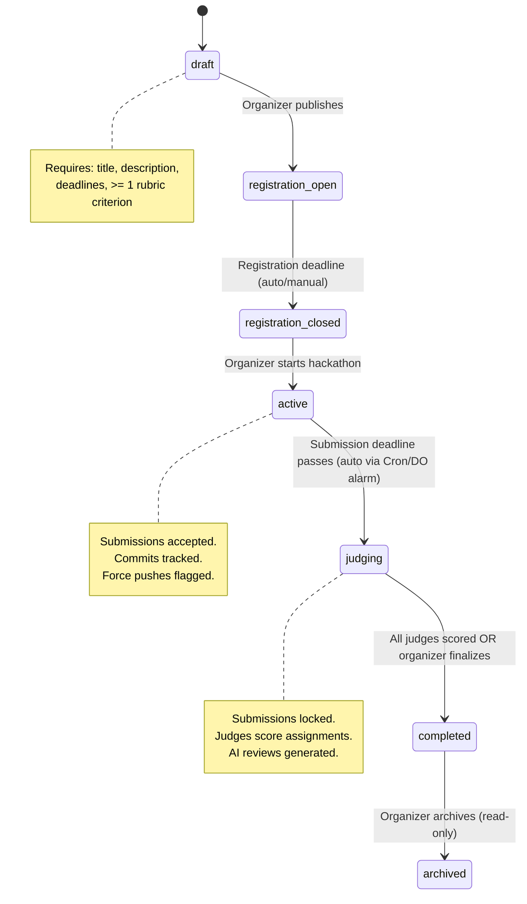
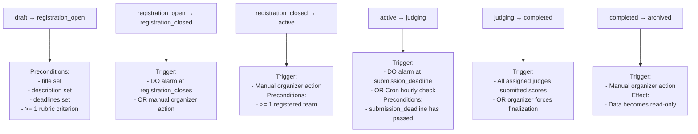
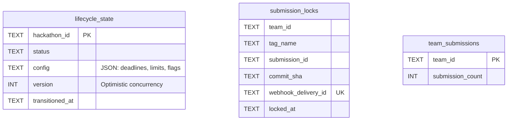
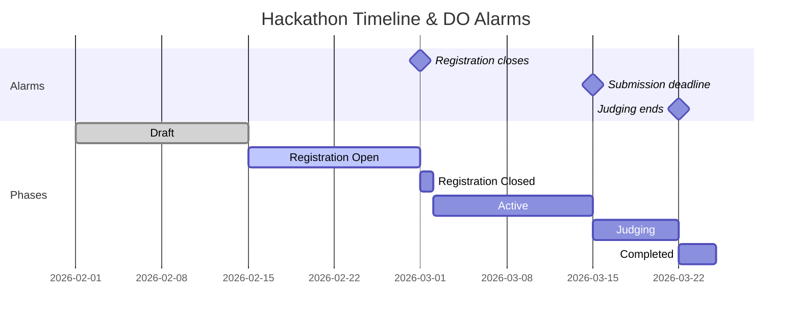
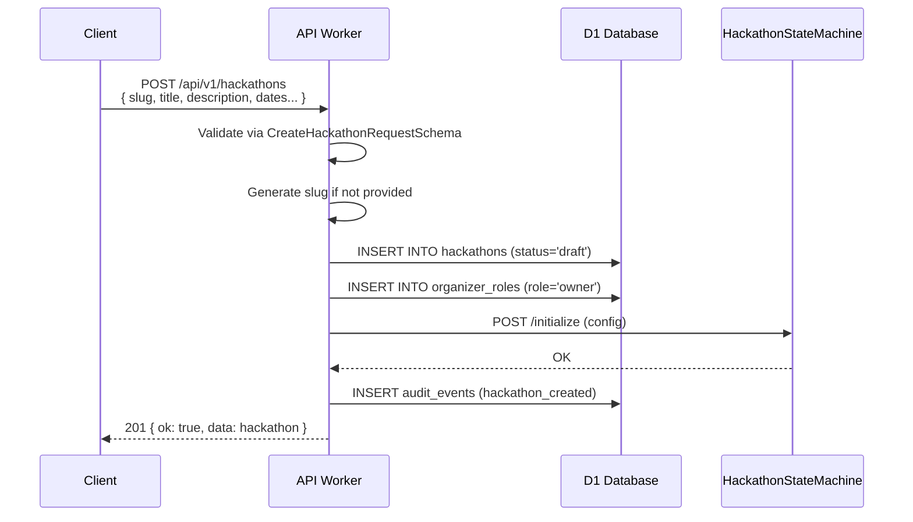
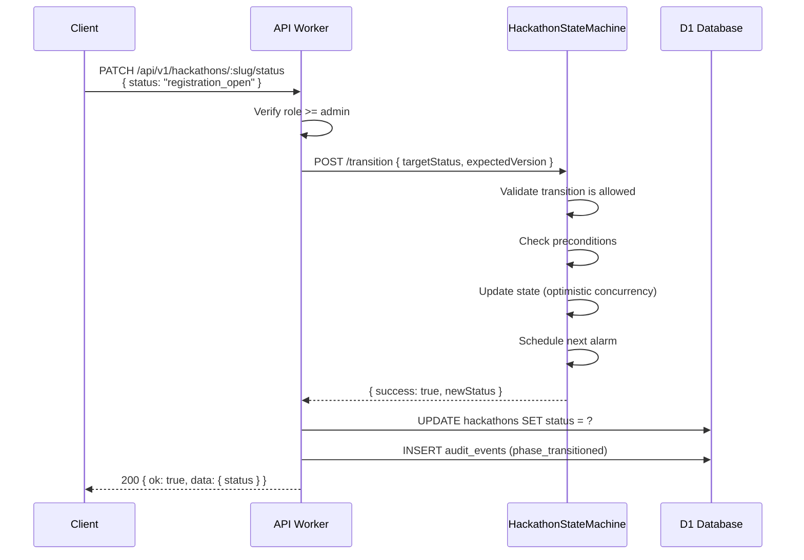
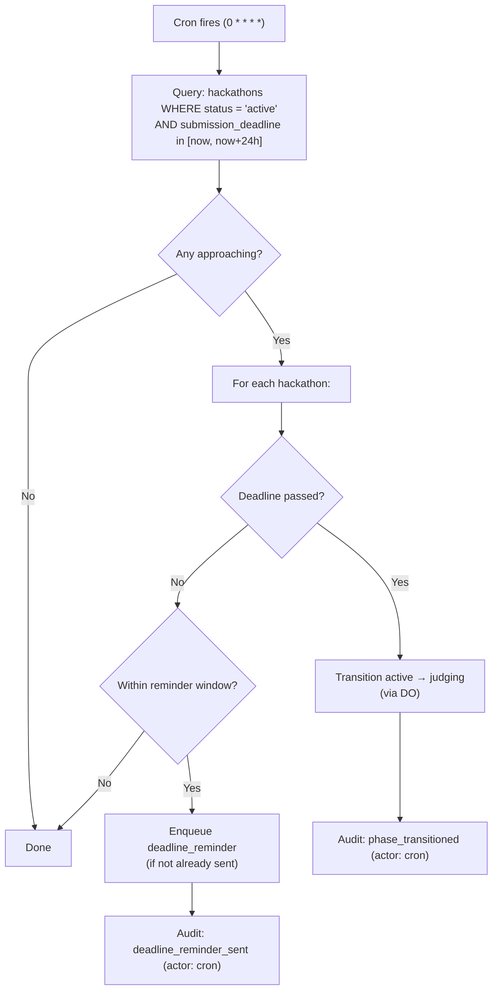

# 02 — Hackathon Lifecycle

> Every hackathon progresses through a 7-state forward-only state machine, enforced by a Durable Object with single-writer consistency. No backward transitions, no skipping states.

**Related docs:** [Submissions](./04-submissions.md) | [Judging](./05-judging.md) | [Infrastructure](./12-infrastructure.md)

---

## State Machine



---

## States & Allowed Actions

| State | Description | Allowed Actions |
|-------|-------------|-----------------|
| `draft` | Initial creation. Not visible to public. | Edit config, set rubric, invite organizers, delete |
| `registration_open` | Participants can register teams and join. | Create/join teams. Organizer can edit non-critical fields |
| `registration_closed` | Registration ended. Teams are finalized. | No new teams. Organizer prepares for start |
| `active` | Hackathon is running. Submissions accepted. | Push code, submit via tag, connect repos |
| `judging` | Submission deadline passed. Judges score. | Score submissions, generate AI reviews |
| `completed` | All judging finished. Results visible. | View leaderboard, download results |
| `archived` | Read-only historical record. | View only. Data preserved indefinitely |

---

## Transition Rules



### Valid Transitions (Source of Truth)

```typescript
const HACKATHON_STATUS_TRANSITIONS = {
  draft:               ['registration_open'],
  registration_open:   ['registration_closed'],
  registration_closed: ['active'],
  active:              ['judging'],
  judging:             ['completed'],
  completed:           ['archived'],
  archived:            [],  // Terminal state
};
```

**Enforcement**: Attempting any transition not in this map returns `INVALID_TRANSITION` error. No backward transitions, no state skipping.

---

## Durable Object: HackathonStateMachine

One DO instance per hackathon, addressed by hackathon ID. This is the **single source of truth** for:

1. Current phase/status
2. Submission locking (exactly-once acceptance)
3. Deadline enforcement via alarms
4. Phase transition validation

### Internal State (SQLite-backed)



### DO HTTP Endpoints

| Method | Path | Purpose |
|--------|------|---------|
| POST | `/initialize` | Set initial config (deadlines, limits, tag pattern) |
| POST | `/transition` | Transition to target status (with optimistic concurrency `expectedVersion`) |
| GET | `/state` | Fetch current state |
| POST | `/accept-submission` | Lock a submission (exactly-once semantics) |
| GET | `/can-accept-submissions` | Check if submissions are currently accepted |

### Alarm Schedule

The DO uses Cloudflare's alarm API for deadline enforcement:



When an alarm fires:
1. Check which deadline passed
2. Auto-transition to the next state if preconditions met
3. Schedule the next upcoming alarm
4. Write transition audit event

### Optimistic Concurrency

State transitions use version-based optimistic concurrency:

```sql
UPDATE lifecycle_state
SET status = ?, version = version + 1, transitioned_at = ?
WHERE hackathon_id = ? AND version = ?
-- If rowsWritten = 0 → concurrent modification detected → retry
```

---

## CRUD Operations

### Create Hackathon



### Transition Phase



---

## Automated Transitions

### Cron Trigger (Hourly)



### DO Alarm (Precise)

The DO alarm fires at the exact deadline timestamp for immediate transitions. The hourly cron acts as a safety net in case the DO alarm fails.

---

## Hackathon Configuration

| Field | Type | Default | Description |
|-------|------|---------|-------------|
| `slug` | TEXT | auto-generated | URL-safe identifier |
| `title` | TEXT | required | Display name |
| `description` | TEXT | — | Markdown description |
| `rules_md` | TEXT | — | Competition rules (Markdown) |
| `registration_opens` | ISO-8601 | required | When registration starts |
| `registration_closes` | ISO-8601 | required | When registration ends |
| `submission_deadline` | ISO-8601 | required | Final submission cutoff |
| `judging_starts` | ISO-8601 | — | When judging opens |
| `judging_ends` | ISO-8601 | — | When judging closes |
| `min_team_size` | INT | 1 | Minimum members per team |
| `max_team_size` | INT | 5 | Maximum members per team |
| `max_teams` | INT | unlimited | Cap on total teams |
| `submission_tag_pattern` | TEXT | `submission_v%` | Git tag pattern for submissions |
| `max_submissions_per_team` | INT | unlimited | Submission version limit |
| `allow_late_submissions` | BOOL | false | Accept tags after deadline |
| `primary_color` | TEXT | `#6366f1` | Theme color |
| `logo_r2_key` | TEXT | — | R2 key for logo asset |
| `banner_r2_key` | TEXT | — | R2 key for banner asset |

---

## File References

| File | Purpose |
|------|---------|
| `apps/api/src/routes/hackathons.ts` | CRUD routes + phase transition endpoint |
| `apps/api/src/durable-objects/hackathon-state-machine.ts` | Core DO: state management, submission locking, alarms |
| `packages/shared/src/schemas/hackathon.ts` | Zod schemas for hackathon entity + requests |
| `packages/shared/src/schemas/constants.ts` | `HACKATHON_STATUS_TRANSITIONS` source of truth |
| `packages/db/src/schema/hackathons.ts` | Drizzle table definition |
| `apps/web/src/pages/hackathon-detail.tsx` | Frontend hackathon detail page |
| `apps/web/src/pages/dashboard.tsx` | Dashboard with hackathon list by status |
