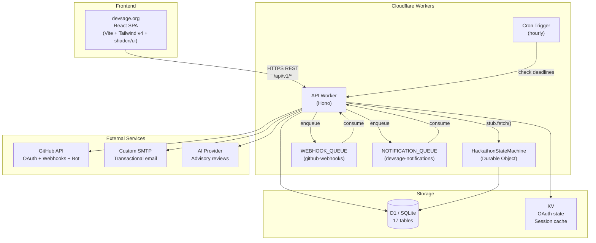
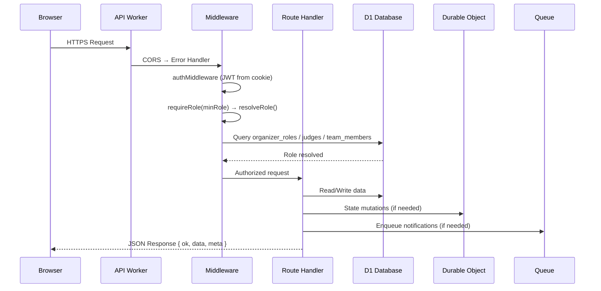
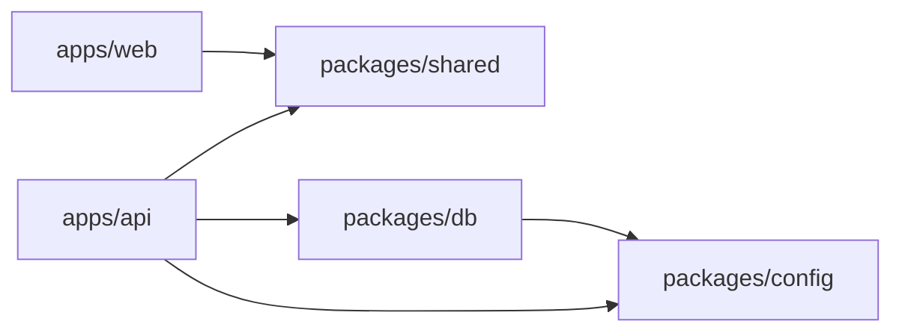

# 00 — System Overview

> DevSage is a GitHub-native hackathon management platform. Organizers configure hackathons declaratively. Participants connect GitHub repos. A GitHub App tracks commits, detects force pushes, captures tag-based submissions, and enforces deadlines — all without manual intervention.

**Related docs:** [Infrastructure](./12-infrastructure.md) | [Data Model](./10-data-model.md) | [API Design](./11-api-design.md)

---

## Architecture Principles

| ID | Principle | Implication |
|----|-----------|-------------|
| P1 | **Deterministic State Transitions** | All lifecycle mutations (phase transitions, submission acceptance, score finalization) go through Durable Objects — single-writer, no race conditions |
| P2 | **Bounded Execution** | Every Worker invocation completes within CPU/wall-clock limits. No unbounded loops or pagination without depth limits |
| P3 | **Idempotent Operations** | Webhook handlers and state mutations are keyed by delivery ID / commit SHA / tag name. Safe to retry |
| P4 | **Explicit Failure Modes** | Every external dependency has defined fail-open or fail-closed behavior. No silent failures |
| P5 | **Auditability** | Every state-changing operation produces an append-only audit event |
| P6 | **Graceful Degradation** | Non-critical features (AI summaries, email, activity feeds) degrade without blocking core submission/judging paths |
| P7 | **No External Compute** | Only Cloudflare first-party primitives + GitHub API + custom SMTP |

---

## High-Level Architecture



---

## Business Domains

DevSage is organized around 8 core business domains:

```mermaid
graph TD
    DS((DevSage))

    DS --- AUTH["Authentication"]
    DS --- HL["Hackathon Lifecycle"]
    DS --- TM["Team Management"]
    DS --- SUB["Submissions"]
    DS --- JDG["Judging"]
    DS --- GHI["GitHub Integration"]
    DS --- NTF["Notifications"]
    DS --- AUD["Audit & Compliance"]

    AUTH --- AUTH1["GitHub OAuth"]
    AUTH --- AUTH2["Google OAuth"]
    AUTH --- AUTH3["JWT Sessions"]
    AUTH --- AUTH4["Account Linking"]

    HL --- HL1["7-State Machine"]
    HL --- HL2["Phase Transitions"]
    HL --- HL3["Deadline Enforcement"]
    HL --- HL4["Durable Objects"]

    TM --- TM1["Registration"]
    TM --- TM2["Invite Codes"]
    TM --- TM3["Repo Linking"]
    TM --- TM4["Member Roles"]

    SUB --- SUB1["Tag-Based Capture"]
    SUB --- SUB2["Exactly-Once Locking"]
    SUB --- SUB3["Version Tracking"]
    SUB --- SUB4["Late Detection"]

    JDG --- JDG1["Judge Invitations"]
    JDG --- JDG2["Rubric Criteria"]
    JDG --- JDG3["Round-Robin Assignment"]
    JDG --- JDG4["Weighted Scoring"]
    JDG --- JDG5["Leaderboard"]

    GHI --- GHI1["Webhook Pipeline"]
    GHI --- GHI2["Commit Tracking"]
    GHI --- GHI3["Force Push Detection"]
    GHI --- GHI4["Bot Status Posting"]

    NTF --- NTF1["Email via SMTP"]
    NTF --- NTF2["9 Event Types"]
    NTF --- NTF3["Deadline Reminders"]
    NTF --- NTF4["Recipient Resolution"]

    AUD --- AUD1["Append-Only Log"]
    AUD --- AUD2["4 Actor Types"]
    AUD --- AUD3["Decision Traceability"]
    AUD --- AUD4["AI Review Provenance"]
```



---

## Request Lifecycle



---

## Monorepo Structure

```
DevSage/
├── apps/
│   ├── api/              # Cloudflare Worker — Hono API + DO + Queue + Cron
│   └── web/              # React SPA — Vite + React Router v7 + Tailwind v4
├── packages/
│   ├── config/           # Shared tsconfig (base, react, worker) + ESLint flat config
│   ├── db/               # Drizzle ORM schemas (17 tables) + D1 migrations
│   └── shared/           # Zod schemas, types, constants (only dep: zod)
└── docs/
    └── v2/
        ├── architecture/ # This documentation
        ├── setup.md
        ├── deployment.md
        ├── secrets.md
        └── contributing.md
```

### Dependency Graph



---

## Scale Target

- 3 concurrent hackathons, ~500 total users, 2-5 member teams
- Infrastructure cost: $0/month on Workers Free plan at initial scale
- D1 storage: ~17 MB estimated (5 GB limit = effectively infinite)

---

## Document Index

| # | Document | Domain |
|---|----------|--------|
| [00](./00-overview.md) | System Overview | Architecture |
| [01](./01-authentication.md) | Authentication & Sessions | Identity |
| [02](./02-hackathon-lifecycle.md) | Hackathon Lifecycle | Core Logic |
| [03](./03-team-management.md) | Team Management | Participation |
| [04](./04-submissions.md) | Submissions & Locking | Core Logic |
| [05](./05-judging.md) | Judging & Scoring | Evaluation |
| [06](./06-roles-permissions.md) | Roles & Permissions | Access Control |
| [07](./07-webhooks-integrations.md) | Webhooks & GitHub Integration | Integration |
| [08](./08-notifications.md) | Notification System | Communication |
| [09](./09-audit-trail.md) | Audit Trail | Compliance |
| [10](./10-data-model.md) | Data Model & Schema | Storage |
| [11](./11-api-design.md) | API Design & Conventions | Interface |
| [12](./12-infrastructure.md) | Infrastructure & Deployment | Operations |
