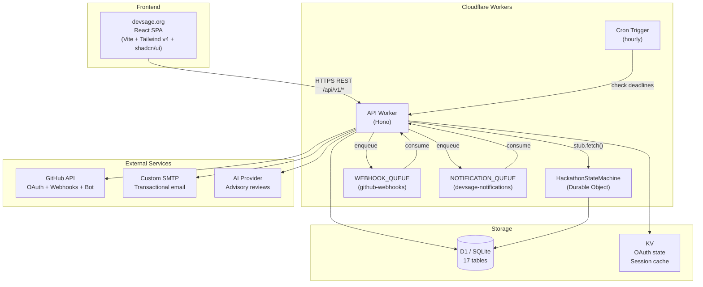
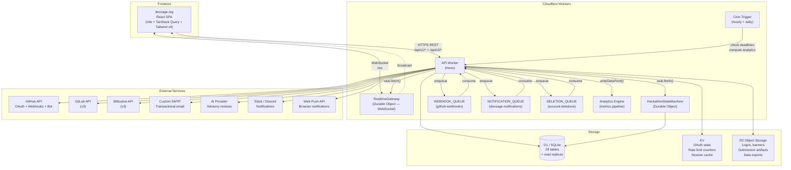
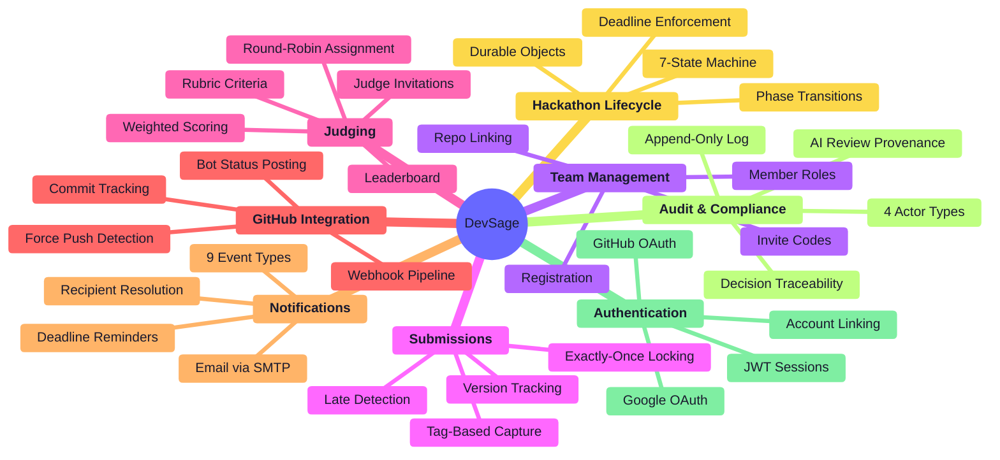
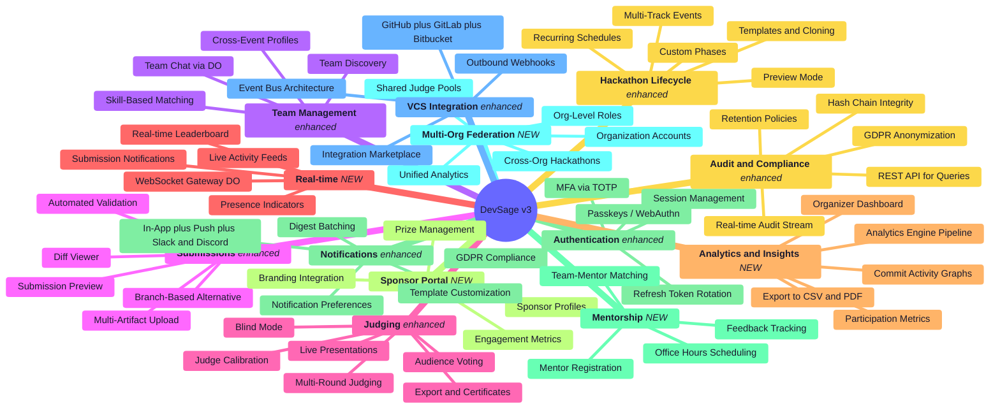
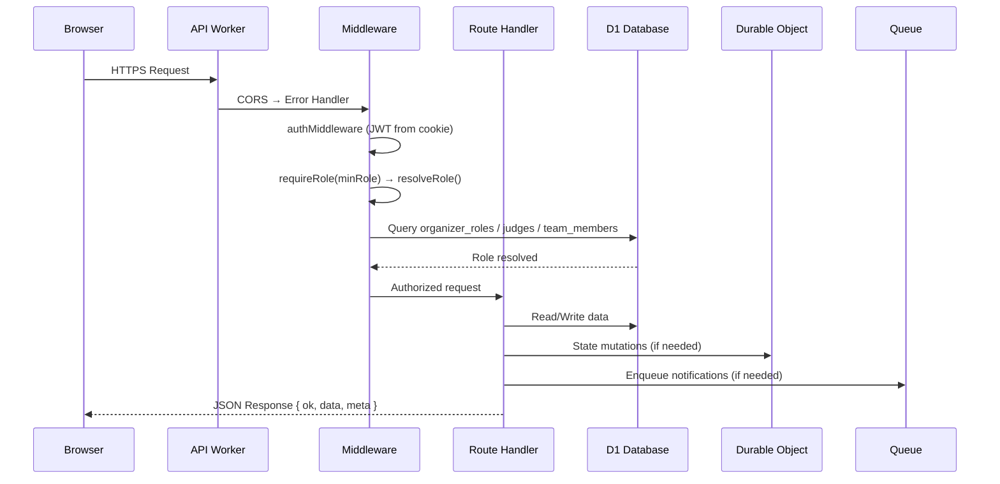
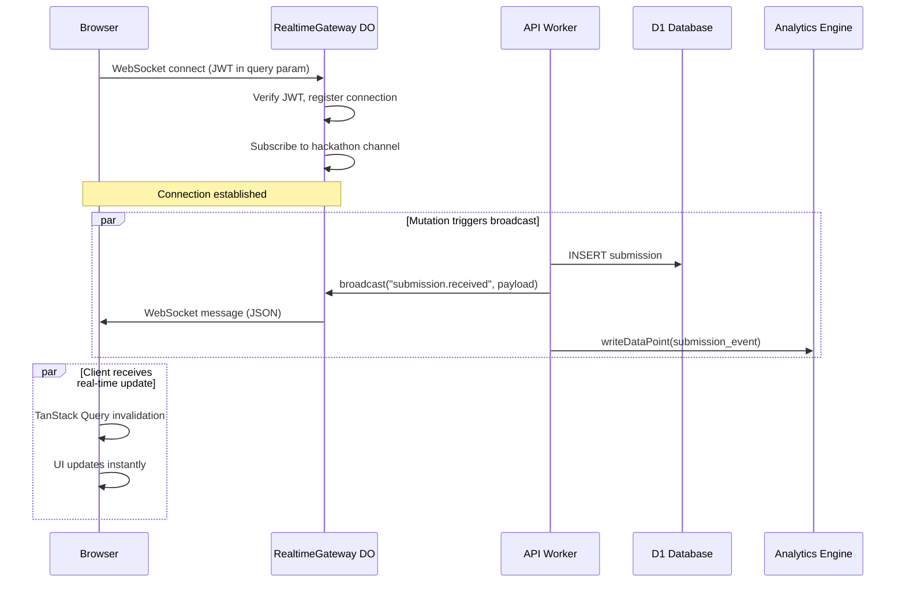
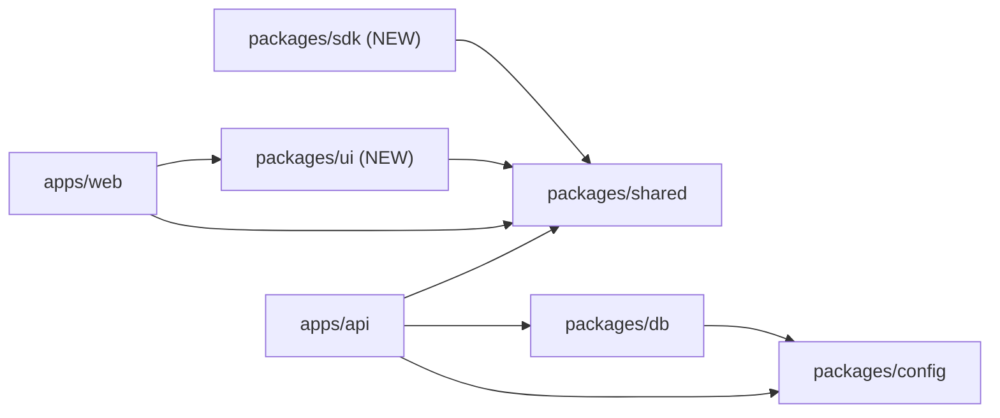
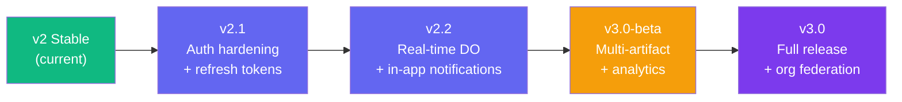

# 00 — System Overview

> DevSage is a GitHub-native hackathon management platform. Organizers configure hackathons declaratively. Participants connect GitHub repos. A GitHub App tracks commits, detects force pushes, captures tag-based submissions, and enforces deadlines — all without manual intervention.

**Related docs:** [Infrastructure](./12-infrastructure.md) | [Data Model](./10-data-model.md) | [API Design](./11-api-design.md) | [Frontend](./13-frontend.md)

---

## Architecture Principles

### Current (v2)

| ID | Principle | Implication |
|----|-----------|-------------|
| P1 | **Deterministic State Transitions** | All lifecycle mutations (phase transitions, submission acceptance, score finalization) go through Durable Objects — single-writer, no race conditions |
| P2 | **Bounded Execution** | Every Worker invocation completes within CPU/wall-clock limits. No unbounded loops or pagination without depth limits |
| P3 | **Idempotent Operations** | Webhook handlers and state mutations are keyed by delivery ID / commit SHA / tag name. Safe to retry |
| P4 | **Explicit Failure Modes** | Every external dependency has defined fail-open or fail-closed behavior. No silent failures |
| P5 | **Auditability** | Every state-changing operation produces an append-only audit event |
| P6 | **Graceful Degradation** | Non-critical features (AI summaries, email, activity feeds) degrade without blocking core submission/judging paths |
| P7 | **No External Compute** | Only Cloudflare first-party primitives + GitHub API + custom SMTP |

### New in v3

| ID | Principle | Implication |
|----|-----------|-------------|
| P8 | **Real-time First** | Every user-facing state change propagates to connected clients within 500ms via WebSocket/SSE through Durable Objects. Polling is a fallback, not the default |
| P9 | **Multi-tenant Isolation** | Organization-scoped resources with strict data boundaries. One org's hackathon data is never accessible to another org, enforced at the query layer |
| P10 | **Plugin Extensibility** | Core platform exposes an event bus and webhook system that external integrations consume without modifying platform code |
| P11 | **Offline Resilience** | Frontend caches critical data locally. Draft submissions, team notes, and form state survive network interruptions |

---

## High-Level Architecture (Current — v2)



---

## v3 Target Architecture



### Key Differences from v2

| Component | v2 | v3 |
|-----------|----|----|
| Real-time | Polling only | WebSocket via `RealtimeGateway` Durable Object |
| VCS providers | GitHub only | GitHub + GitLab + Bitbucket |
| Notifications | Email only | Email + in-app + push + Slack/Discord |
| File storage | R2 for logos only | R2 for all artifacts (videos, decks, exports) |
| API versions | `/api/v1/` | `/api/v1/` (maintained) + `/api/v2/` (new endpoints) |
| Analytics | None | Analytics Engine + pre-computed snapshots |
| Data model | 17 tables | 28 tables |
| Account management | Login/logout only | Deletion, GDPR export, MFA, session management |
| Auth | Long-lived JWT | Short-lived access + rotating refresh tokens |
| Queues | 2 (webhooks, notifications) | 3 (+ account deletions) |
| Multi-org | Single-tenant | Organization-scoped multi-tenancy |

---

## Business Domains

### Current (v2) — 8 Domains



### v3 — 13 Domains (+5 New)



---

## Request Lifecycle



### v3 Real-time Request Lifecycle



---

## Monorepo Structure

### Current (v2)

```
DevSage/
├── apps/
│   ├── api/              # Cloudflare Worker — Hono API + DO + Queue + Cron
│   └── web/              # React SPA — Vite + React Router v7 + Tailwind v4
├── packages/
│   ├── config/           # Shared tsconfig (base, react, worker) + ESLint flat config
│   ├── db/               # Drizzle ORM schemas (17 tables) + D1 migrations
│   └── shared/           # Zod schemas, types, constants (only dep: zod)
└── docs/
    └── v2/
        ├── architecture/ # This documentation
        ├── setup.md
        ├── deployment.md
        ├── secrets.md
        └── contributing.md
```

### v3 — Planned Additions

```
DevSage/
├── apps/
│   ├── api/              # Cloudflare Worker — Hono API + DO + Queue + Cron
│   └── web/              # React SPA — Vite + React Router v7 + Tailwind v4
├── packages/
│   ├── config/           # Shared tsconfig (base, react, worker) + ESLint flat config
│   ├── db/               # Drizzle ORM schemas (28 tables) + D1 migrations
│   ├── shared/           # Zod schemas, types, constants (only dep: zod)
│   ├── ui/               # (NEW) Shared component library — extracted from apps/web
│   └── sdk/              # (NEW) @devsage/sdk — TypeScript API client, auto-generated from Zod
├── docs/
│   ├── v2/               # Frozen — previous version docs
│   ├── v3/               # Current planning docs
│   └── adr/              # (NEW) Architecture Decision Records
└── .github/
    └── workflows/        # (NEW) CI/CD: lint, test, deploy, secret scan, Lighthouse
```

### v3 Dependency Graph



---

## Scale Targets

### v2 (Current)

- 3 concurrent hackathons, ~500 total users, 2-5 member teams
- Infrastructure cost: $0/month on Workers Free plan at initial scale
- D1 storage: ~17 MB estimated (5 GB limit = effectively infinite)

### v3 (Target)

| Metric | v2 | v3 Target | Growth |
|--------|----|-----------|----- |
| Concurrent hackathons | 3 | 50+ | 17x |
| Total users | 500 | 10,000+ | 20x |
| Teams per hackathon | ~50 | 200+ | 4x |
| Submissions per hackathon | ~150 | 500+ | 3x |
| Concurrent WebSocket connections | 0 | 2,000 | -- |
| D1 storage | 17 MB | ~500 MB | 30x |
| D1 rows read/day | 200k | 2M | 10x |
| D1 rows written/day | 20k | 150k | 7.5x |

### Cost Projections

| Scale | Plan | Estimated Monthly Cost |
|-------|------|----------------------|
| 500 users, 3 hackathons | Workers Free | $0 |
| 2,000 users, 15 hackathons | Workers Paid | $5 |
| 5,000 users, 30 hackathons | Workers Paid | $10-15 |
| 10,000 users, 50+ hackathons | Workers Paid | $20-25 |
| 25,000 users, 100+ hackathons | Workers Paid + D1 scaling | $50-75 |

All costs are Cloudflare-only. External services (SMTP, AI provider) are billed separately.

---

## v3 Roadmap

### Phase 1 — Real-time and Auth Hardening (Q2 2026)

| Deliverable | Domain | Complexity |
|-------------|--------|------------|
| `RealtimeGateway` Durable Object | Real-time | High |
| WebSocket integration in frontend | Frontend / Real-time | Medium |
| Refresh token rotation | Authentication | Medium |
| Rate limiting on auth endpoints | Authentication | Low |
| TanStack Query migration | Frontend | Medium |
| In-app notification system | Notifications | Medium |
| Health check endpoint | Infrastructure | Low |

### Phase 2 — Multi-artifact and Advanced Judging (Q3 2026)

| Deliverable | Domain | Complexity |
|-------------|--------|------------|
| R2 file upload for submissions | Submissions | Medium |
| Submission preview rendering | Submissions | Medium |
| Multi-round judging | Judging | High |
| Blind judging mode | Judging | Low |
| Audience voting | Judging | Medium |
| Hackathon templates | Hackathon Lifecycle | Medium |
| Team discovery and matching | Team Management | High |
| OpenAPI spec generation | API Design | Medium |

### Phase 3 — Analytics and Integrations (Q4 2026)

| Deliverable | Domain | Complexity |
|-------------|--------|------------|
| Analytics Engine pipeline | Analytics | High |
| Organizer analytics dashboard | Analytics / Frontend | High |
| GitLab + Bitbucket support | VCS Integration | High |
| Outbound webhooks (Slack, Discord) | Webhooks | Medium |
| Event bus architecture | Webhooks | High |
| Push notifications (Web Push API) | Notifications | Medium |
| Notification preferences UI | Notifications / Frontend | Medium |
| TypeScript SDK (`@devsage/sdk`) | API Design | Medium |

### Phase 4 — Federation and Scale (Q1 2027)

| Deliverable | Domain | Complexity |
|-------------|--------|------------|
| Organization accounts | Multi-Org Federation | High |
| Org-level roles and permissions | Multi-Org / Roles | High |
| Sponsor portal | Sponsor Portal | High |
| Mentor matching system | Mentorship | Medium |
| Multi-track hackathons | Hackathon Lifecycle | Medium |
| Custom roles with granular permissions | Roles & Permissions | High |
| Account deletion / GDPR compliance | Authentication | High |
| Passkey / WebAuthn support | Authentication | High |
| Staging environment | Infrastructure | Medium |
| CI/CD automation | Infrastructure | Medium |

---

## Migration Path: v2 to v3

### Strategy: Additive, Non-Breaking

v3 is an evolution, not a rewrite. All changes are additive:

1. **Database**: New tables added via Drizzle migrations. No existing columns are removed or renamed. New columns on existing tables use defaults or are nullable.
2. **API**: New endpoints go under `/api/v2/`. All `/api/v1/` endpoints remain functional with no breaking changes. `/api/v1/` routes receive a `Sunset` header when a v2 replacement exists.
3. **Frontend**: New features are lazy-loaded. Existing pages are enhanced incrementally. TanStack Query replaces raw `apiRequest()` calls gradually, page by page.
4. **Durable Objects**: `RealtimeGateway` is a new DO class alongside the existing `HackathonStateMachine`. No changes to existing DO state.
5. **Queues**: New `DELETION_QUEUE` is added. Existing queues are unchanged.

### Migration Sequence



---

## Document Index

### Architecture (v2 + v3)

| # | Document | Domain | v3 Changes |
|---|----------|--------|------------|
| [00](./00-overview.md) | System Overview | Architecture | v3 vision, roadmap, scale targets |
| [01](./01-authentication.md) | Authentication & Sessions | Identity | Passkeys, refresh tokens, MFA, GDPR |
| [02](./02-hackathon-lifecycle.md) | Hackathon Lifecycle | Core Logic | Templates, multi-track, custom phases |
| [03](./03-team-management.md) | Team Management | Participation | Discovery, matching, chat |
| [04](./04-submissions.md) | Submissions & Locking | Core Logic | Multi-artifact, automated validation |
| [05](./05-judging.md) | Judging & Scoring | Evaluation | Multi-round, blind mode, audience voting |
| [06](./06-roles-permissions.md) | Roles & Permissions | Access Control | Custom roles, org-level hierarchy |
| [07](./07-webhooks-integrations.md) | Webhooks & Integrations | Integration | Multi-provider VCS, event bus |
| [08](./08-notifications.md) | Notification System | Communication | In-app, push, Slack/Discord, preferences |
| [09](./09-audit-trail.md) | Audit Trail | Compliance | REST API, hash chain, GDPR |
| [10](./10-data-model.md) | Data Model & Schema | Storage | 28 tables, updated ERD, migration plan |
| [11](./11-api-design.md) | API Design & Conventions | Interface | v2 endpoints, SSE, rate limiting, SDK |
| [12](./12-infrastructure.md) | Infrastructure & Deployment | Operations | Multi-region, CI/CD, monitoring |
| [13](./13-frontend.md) | Frontend Architecture | Frontend | **NEW** — Full frontend architecture doc |

### Guides

| Document | v3 Changes |
|----------|------------|
| [Developer Setup](../setup.md) | Docker Compose, seed data, VS Code config |
| [Deployment](../deployment.md) | CI/CD pipeline, staging, preview deploys |
| [Secrets](../secrets.md) | Rotation automation, new v3 secrets |
| [Contributing](../contributing.md) | ADRs, RFC process, perf budgets, a11y CI |
