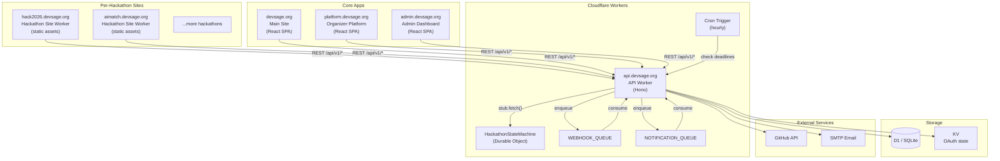
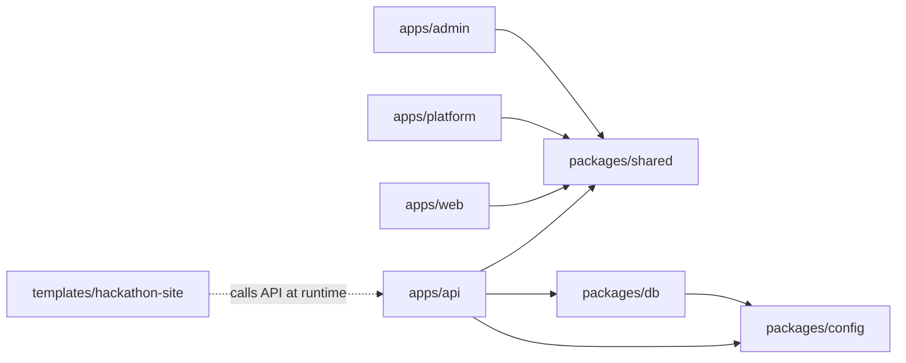
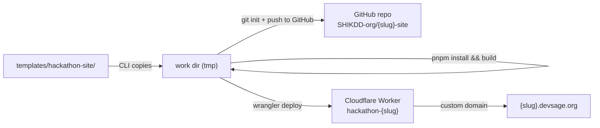
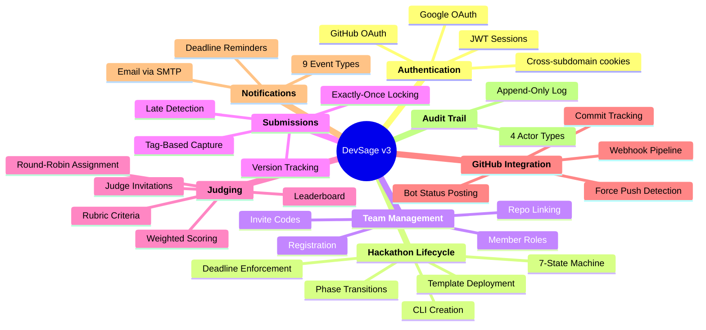
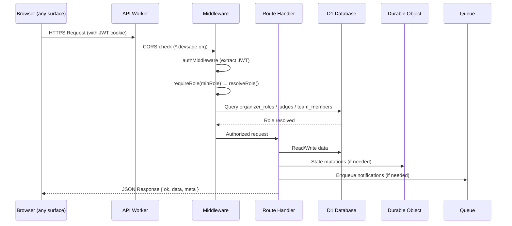

# 00 — System Overview

> DevSage is a white-label hackathon platform. Each hackathon gets its own website at `{slug}.devsage.org`, deployed as a Cloudflare Worker serving static assets. A CLI tool creates hackathons from a template. An admin dashboard configures them. An organizer platform manages them. A shared API backend powers everything.

**Related docs:** [Authentication](./01-authentication.md) | [Hackathon Lifecycle](./02-hackathon-lifecycle.md) | [Data Model](./03-data-model.md) | [API Design](./04-api-design.md) | [Hackathon Site](./05-hackathon-site.md) | [CLI](./06-cli.md) | [Organizer Platform](./07-organizer-platform.md) | [Admin & Web](./08-admin-and-web.md) | [Infrastructure](./13-infrastructure.md)

---

## Architecture Principles

| ID | Principle | Implication |
|----|-----------|-------------|
| P1 | **Deterministic State Transitions** | All lifecycle mutations go through Durable Objects — single-writer, no race conditions |
| P2 | **Bounded Execution** | Every Worker invocation completes within CPU/wall-clock limits |
| P3 | **Idempotent Operations** | Webhook handlers keyed by delivery ID / commit SHA / tag name. Safe to retry |
| P4 | **Explicit Failure Modes** | Every external dependency has defined fail-open or fail-closed behavior |
| P5 | **Auditability** | Every state-changing operation produces an append-only audit event |
| P6 | **Graceful Degradation** | Non-critical features degrade without blocking core submission/judging paths |
| P7 | **No External Compute** | Only Cloudflare first-party primitives + GitHub API + custom SMTP |
| P8 | **Per-Hackathon Isolation** | Each hackathon runs on its own subdomain with its own deployed site. One hackathon's issues cannot affect another |
| P9 | **CLI-First Infrastructure** | Hackathon creation is automated — DNS, deployment, and DB setup happen via a single CLI command |

---

## High-Level Architecture



---

## The Five Surfaces

DevSage has five distinct user-facing surfaces, each deployed as its own Cloudflare Worker:

| Surface | URL | Purpose | Users | Source |
|---------|-----|---------|-------|-------|
| **Hackathon Site** | `{slug}.devsage.org` | Full participant + judge experience for a single hackathon | Participants, judges | `templates/hackathon-site/` (cloned per hackathon) |
| **Main Site** | `devsage.org` | Hackathon discovery, marketing, user profile | Public, logged-in users | `apps/web/` |
| **Organizer Platform** | `platform.devsage.org` | Hackathon management for organizers | Organizers | `apps/platform/` |
| **Admin Dashboard** | `admin.devsage.org` | Internal DevSage team configuration | DevSage team only | `apps/admin/` |
| **API** | `api.devsage.org` | Shared REST backend | All surfaces | `apps/api/` |

### User Journeys

```
DEVSSAGE TEAM creates a hackathon:
  1. Runs: devsage create hack2026 --name "Hack 2026"
  2. CLI copies template → writes config → deploys to Workers
  3. Sets up hack2026.devsage.org custom domain
  4. Hackathon site is live and ready

DEVSSAGE TEAM configures via admin:
  1. Visits admin.devsage.org
  2. Invites organizers for the hackathon
  3. Configures platform-wide settings

ORGANIZER manages via platform:
  1. Visits platform.devsage.org
  2. Configures hackathon: dates, rubric, prizes, rules
  3. Invites judges, manages teams
  4. Transitions hackathon phases (DRAFT → ACTIVE → JUDGING → ...)
  5. Views judge progress, leaderboard

PARTICIPANT joins a hackathon:
  1. Visits hack2026.devsage.org
  2. Sees hackathon landing page (Hero, Dates, Prizes, Teams)
  3. Clicks "Register Now" → OAuth login
  4. JWT cookie set on Domain=.devsage.org
  5. Creates/joins a team, links GitHub repo
  6. Submits via git tag push
  7. Views leaderboard

JUDGE scores submissions:
  1. Gets invite email → visits hack2026.devsage.org (or platform.devsage.org)
  2. Logs in → sees assigned submissions
  3. Scores using rubric criteria
  4. Views leaderboard
```

---

## Monorepo Structure

```
DevSage/
├── apps/
│   ├── api/                 # Cloudflare Worker — Hono API + DO + Queue + Cron
│   ├── web/                 # Main site at devsage.org — discovery, profile
│   ├── platform/            # Organizer dashboard at platform.devsage.org
│   └── admin/               # Internal admin at admin.devsage.org
├── packages/
│   ├── config/              # Shared tsconfig (base, react, worker) + ESLint flat config
│   ├── db/                  # Drizzle ORM schemas + D1 migrations
│   └── shared/              # Zod schemas, types, constants (only dep: zod)
├── templates/
│   └── hackathon-site/      # Template hackathon site — copied per hackathon
│       ├── src/             # React SPA (Vite + Tailwind v4)
│       ├── site.config.json # Per-hackathon config (slug, title, colors, dates)
│       └── wrangler.template.jsonc  # Wrangler template for deployment
├── scripts/
│   ├── generate-hackathon-site.js   # CLI: create + deploy hackathon sites
│   └── generate-hackathon-pages.js  # Generate hackathon page stubs in apps/web
└── docs/
    ├── v2/                  # Archived v2 docs
    └── v3/                  # This documentation
```

### Dependency Graph



> **Note:** The hackathon site template is NOT a workspace package. It's a standalone project that gets copied per hackathon. It calls the API at runtime via `fetch()` using the `apiOrigin` from `site.config.json`. It does not import from `@devsage/*` packages.

---

## Per-Hackathon Deployment Model

Each hackathon is a separate Cloudflare Worker serving static assets. The template is copied, configured, built, and deployed by the CLI.

### Template → Deployed Site Flow



### What Each Deployed Site Contains

The built Worker serves a React SPA that reads config from `site.config.json` (baked in at build time) and fetches all dynamic data from `api.devsage.org`:

```json
{
  "slug": "hack2026",
  "title": "Hack 2026",
  "description": "A weekend of building and innovation.",
  "accentColor": "#2DD4BF",
  "registrationStart": "2026-03-01T00:00:00Z",
  "hackingStart": "2026-03-15T00:00:00Z",
  "submissionDeadline": "2026-03-17T00:00:00Z",
  "maxTeamSize": 4,
  "prizePool": "$10,000",
  "apiOrigin": "https://api.devsage.org",
  "logoUrl": null,
  "bannerUrl": null,
  "rules": null
}
```

### Workers Static Hosting (Not Pages)

```jsonc
// wrangler.jsonc per hackathon
{
  "name": "hackathon-hack2026",
  "account_id": "cf3386ad...",
  "compatibility_date": "2025-12-01",
  "assets": {
    "directory": "./dist",
    "not_found_handling": "single-page-application"
  }
}
```

---

## Authentication Model

All surfaces share a single authentication system via cross-subdomain cookies:

1. User clicks "Login" on any `*.devsage.org` surface
2. Redirected to `api.devsage.org/auth/github` (or `/auth/google`) with `redirect_to` param
3. OAuth completes → API sets JWT in HttpOnly cookie with `Domain=.devsage.org`
4. Cookie is sent to ALL `*.devsage.org` subdomains automatically
5. User is redirected back to the originating surface

**Cookie settings (production):**
- `Domain=.devsage.org` — covers all subdomains
- `HttpOnly` — not accessible via JavaScript
- `SameSite=Lax` — sent on top-level navigations
- `Secure` — HTTPS only
- `Path=/`
- 7-day expiry

See [01-authentication.md](./01-authentication.md) for details.

---

## CORS Configuration

The API dynamically allows any `*.devsage.org` origin:

```typescript
// Simplified — see apps/api/src/middleware/cors.ts for full implementation
const origin = request.headers.get('Origin');
if (origin && (
  origin === env.FRONTEND_URL ||
  origin === env.PLATFORM_URL ||
  origin === env.ADMIN_URL ||
  /^https:\/\/[a-z0-9-]+\.devsage\.org$/.test(origin)
)) {
  // Allow this origin
}
```

For local development, `localhost:5173/5174/5175` are also allowed.

---

## Roles & Access Control

Roles are resolved per-request per-hackathon, not stored in JWT:

| Role | Scope | Access |
|------|-------|--------|
| `anonymous` | Per-hackathon | Public read access |
| `participant` | Per-hackathon | Team member in this hackathon |
| `team_leader` | Per-hackathon | Team leader in this hackathon |
| `judge` | Per-hackathon | Accepted judge for this hackathon |
| `moderator` | Per-hackathon | Organizer role: moderator |
| `admin` | Per-hackathon | Organizer role: admin |
| `owner` | Per-hackathon | Hackathon creator |

`platform_admin` is a separate platform-wide role (stored in `platform_admins` table).

---

## Business Domains



---

## Request Lifecycle



---

## Scale Targets

| Metric | Current | v3 Target |
|--------|---------|-----------|
| Concurrent hackathons | 3 | 20+ |
| Total registered users | 500 | 5,000+ |
| Teams per hackathon | ~50 | 100+ |
| Submissions per hackathon | ~150 | 300+ |
| API requests/day | ~5,000 | ~100,000 |
| Deployed hackathon sites | 1 | 20+ |

---

## Conventions

| Convention | Rule |
|------------|------|
| **ESM strict** | All imports use explicit `.js` extensions in barrel exports |
| **No console.log** | Only `console.warn` / `console.error` |
| **Timestamps** | UTC ISO-8601 (`new Date().toISOString()`) |
| **UUIDs** | `crypto.randomUUID()` (Workers-native) |
| **Response envelope** | `{ ok: true, data, meta }` / `{ ok: false, error: { code, message } }` |
| **Roles** | 7 per-hackathon roles, resolved per-request via `resolveRole()` |
| **Auth** | Manual OAuth 2.0 → JWT in HttpOnly cookie. No external JWT libs |
| **State machine** | Forward-only: DRAFT → REGISTRATION_OPEN → ... → ARCHIVED |
| **Services** | Fail-open pattern — 10s timeout, log warning, never throw |
| **Audit** | Every mutation logs via `insertAuditEvent()` |
| **Type safety** | No `as any`, `@ts-ignore`, `@ts-expect-error` |

---

## Anti-Patterns

| Anti-Pattern | Why |
|-------------|-----|
| `@hono/oauth-providers` | Broken on Cloudflare Workers — use manual OAuth |
| `wrangler.toml` | Use `wrangler.jsonc` only |
| Prisma | Incompatible with Workers/D1 — use Drizzle |
| D1 access from inside DOs | Worker mediates all D1 writes |
| External JWT libraries | Use `crypto.subtle` only |
| Roles in JWT | Resolve per-request per-hackathon |
| Backward state transitions | Forward-only through 7 states |
| `console.log` | Use `console.warn` / `console.error` |
| Cloudflare Pages | Use Workers Static Assets for hackathon sites |
| Shared Worker for all hackathons | Each hackathon gets its own Worker deployment |

---

## Document Index

| # | Document | Description |
|---|----------|-------------|
| [00](./00-overview.md) | System Overview | Architecture, surfaces, deployment model |
| [01](./01-authentication.md) | Authentication | Cross-subdomain OAuth, JWT cookies |
| [02](./02-hackathon-lifecycle.md) | Hackathon Lifecycle | CLI creation → config → participation → completion |
| [03](./03-data-model.md) | Data Model | All DB tables, relationships, migrations |
| [04](./04-api-design.md) | API Design | Routes, middleware, error codes |
| [05](./05-hackathon-site.md) | Hackathon Site Template | Template SPA architecture, pages, config |
| [06](./06-cli.md) | CLI Tool | Commands, domain setup, deployment |
| [07](./07-organizer-platform.md) | Organizer Platform | Hackathon management dashboard |
| [08](./08-admin-and-web.md) | Admin & Main Site | Admin dashboard + devsage.org |
| [09](./09-judging.md) | Judging System | Rubric, scoring, leaderboard |
| [10](./10-roles-permissions.md) | Roles & Permissions | 7-tier hierarchy, resolution |
| [11](./11-webhooks.md) | Webhooks & GitHub | Webhook pipeline, commit tracking |
| [12](./12-notifications.md) | Notifications | Email system, event types |
| [13](./13-infrastructure.md) | Infrastructure | Deployment, DNS, CI/CD |

### Guides

| Document | Description |
|----------|-------------|
| [Developer Setup](../setup.md) | Local environment setup |
| [Deployment](../deployment.md) | Production deployment |
| [Secrets](../secrets.md) | Secret management |
| [Contributing](../contributing.md) | Code style, PR process |
