# 00 — System Overview

> DevSage is a GitHub-native hackathon management platform. Organizers configure hackathons declaratively. Participants connect GitHub repos. A GitHub App tracks commits, detects force pushes, captures tag-based submissions, and enforces deadlines — all without manual intervention.

**Related docs:** [Infrastructure](./12-infrastructure.md) | [Data Model](./10-data-model.md) | [API Design](./11-api-design.md) | [Frontend](./13-frontend.md) | [Real-time](./14-real-time.md) | [Analytics](./15-analytics.md) | [Sponsor Portal](./16-sponsor-portal.md)

---

## Architecture Principles

### Current (v2)

| ID | Principle | Implication |
|----|-----------|-------------|
| P1 | **Deterministic State Transitions** | All lifecycle mutations (phase transitions, submission acceptance, score finalization) go through Durable Objects — single-writer, no race conditions |
| P2 | **Bounded Execution** | Every Worker invocation completes within CPU/wall-clock limits. No unbounded loops or pagination without depth limits |
| P3 | **Idempotent Operations** | Webhook handlers and state mutations are keyed by delivery ID / commit SHA / tag name. Safe to retry |
| P4 | **Explicit Failure Modes** | Every external dependency has defined fail-open or fail-closed behavior. No silent failures |
| P5 | **Auditability** | Every state-changing operation produces an append-only audit event |
| P6 | **Graceful Degradation** | Non-critical features (AI summaries, email, activity feeds) degrade without blocking core submission/judging paths |
| P7 | **No External Compute** | Only Cloudflare first-party primitives + GitHub API + custom SMTP |

### v3 Principles

| ID | Principle | Implication |
|----|-----------|-------------|
| P8 | **Real-time First** | Every user-facing state change propagates to connected clients within 200ms via WebSocket/SSE through Durable Objects. Polling is a fallback, never the primary path |
| P9 | **Multi-tenant Isolation** | Each hackathon's data, compute, and rate limits are isolated at the Durable Object and D1 database level. One hackathon's traffic spike cannot degrade another's experience. Organization-scoped resources enforce strict data boundaries at the query layer |
| P10 | **Plugin Extensibility** | Core platform exposes lifecycle hooks (pre-submit, post-judge, on-phase-change) that external integrations consume via registered webhook endpoints. Third-party scoring algorithms, custom notification channels, and sponsor-specific dashboards plug in without forking |

> **Continuity note:** P1-P7 remain foundational. P8-P10 extend the architecture for multi-org scale without contradicting existing guarantees.

---

## High-Level Architecture

### Current (v2)

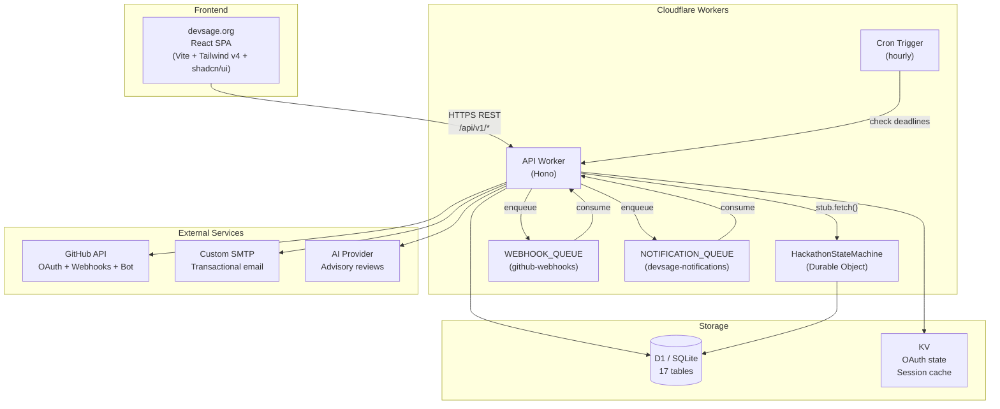

### v3 Vision — Target Architecture

```mermaid
graph TD
    subgraph Frontend["Frontend Layer"]
        WEB["devsage.org<br/>React SPA<br/>(Vite + Tailwind v4 + shadcn/ui)"]
        SPONSOR["Sponsor Portal<br/>React SPA<br/>(shared component library)"]
    end

    WEB -->|"HTTPS REST<br/>/api/v1/*"| API
    WEB <-->|"WebSocket<br/>/ws/*"| WS_GW
    SPONSOR -->|"HTTPS REST<br/>/api/v1/sponsors/*"| API

    subgraph CF["Cloudflare Workers — Compute"]
        API["API Worker<br/>(Hono)"]
        WS_GW["WebSocket Gateway<br/>(Durable Object)"]
        DO["HackathonStateMachine<br/>(Durable Object)"]
        MENTOR_DO["MentorshipSession<br/>(Durable Object)"]
        Q_WH["WEBHOOK_QUEUE<br/>(github-webhooks)"]
        Q_NF["NOTIFICATION_QUEUE<br/>(devsage-notifications)"]
        Q_AN["ANALYTICS_QUEUE<br/>(devsage-analytics)"]
        CRON["Cron Trigger<br/>(hourly + 5-min)"]
        AI_SVC["AI Review Service<br/>(Dedicated Worker)"]
    end

    API -->|"stub.fetch()"| DO
    API -->|"stub.fetch()"| WS_GW
    API -->|"stub.fetch()"| MENTOR_DO
    API -->|"enqueue"| Q_WH
    API -->|"enqueue"| Q_NF
    API -->|"enqueue"| Q_AN
    DO -->|"broadcast"| WS_GW
    CRON -->|"check deadlines"| API

    subgraph Storage["Storage Layer"]
        D1[("D1 / SQLite<br/>~25 tables")]
        KV["KV<br/>OAuth state<br/>Session cache<br/>Rate limit counters"]
        R2["R2 Object Storage<br/>Media uploads<br/>Sponsor assets<br/>Export archives"]
        AE["Analytics Engine<br/>Event stream<br/>Time-series metrics"]
    end

    API --> D1
    API --> KV
    API --> R2
    DO --> D1
    Q_AN -->|"consume"| AE

    subgraph External["External Services"]
        GH["GitHub API<br/>OAuth + Webhooks + Bot"]
        SMTP["Custom SMTP<br/>Transactional email"]
        AI_EXT["AI Provider<br/>(OpenAI / Anthropic)"]
    end

    Q_WH -->|"consume"| API
    Q_NF -->|"consume"| API
    AI_SVC --> AI_EXT
    API --> GH
    API --> SMTP
    API -->|"service binding"| AI_SVC
```

### What Changes from v2 to v3

| Component | v2 | v3 |
|-----------|----|----|
| **Client-server communication** | REST only | REST + WebSocket (Durable Object-backed) |
| **Real-time updates** | Polling / manual refresh | WebSocket push via gateway DO, SSE fallback |
| **Media storage** | Not supported | R2 for sponsor logos, team avatars, export ZIPs |
| **Analytics** | None | Analytics Engine for event stream + D1 for aggregated dashboards |
| **AI reviews** | Inline in API Worker | Dedicated Worker via service binding (isolated CPU budget) |
| **Cron frequency** | Hourly | Hourly (deadlines) + every 5 min (analytics rollup, mentor matching) |
| **D1 schema** | 17 tables | ~25 tables (adds sponsors, mentorship, analytics_snapshots, plugins, federation) |
| **Queue count** | 2 queues | 3 queues (adds ANALYTICS_QUEUE) |
| **Durable Objects** | 1 class (HackathonStateMachine) | 3 classes (+ WebSocketGateway, MentorshipSession) |
| **KV usage** | OAuth state only | OAuth state + rate limiting + session cache |
| **Sponsor support** | None | Dedicated portal, tier management, asset hosting |
| **Multi-org** | Single-org implicit | Federation protocol for cross-org hackathon discovery |

---

## Business Domains

### Current (v2) — 8 Domains

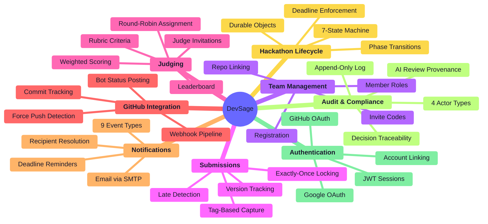

### v3 Vision — 13 Domains

v3 adds 5 new business domains while enhancing all 8 existing ones:

```mermaid
%%{init: {'theme': 'base', 'themeVariables': {'primaryColor': '#e8e8ff', 'primaryTextColor': '#1a1a2e', 'primaryBorderColor': '#6366f1', 'lineColor': '#6366f1', 'secondaryColor': '#f0fdf4', 'secondaryTextColor': '#1a1a2e', 'tertiaryColor': '#fef3c7', 'tertiaryTextColor': '#1a1a2e'}}}%%
mindmap
  root((DevSage v3))
    **Authentication** *(v2 + enhanced)*
      GitHub OAuth
      Google OAuth
      JWT Sessions
      Account Linking
      Refresh Token Rotation
      Session Management
    **Hackathon Lifecycle** *(v2 + enhanced)*
      7-State Machine
      Phase Transitions
      Deadline Enforcement
      Durable Objects
      Templates and Cloning
      Multi-Track Events
    **Team Management** *(v2 + enhanced)*
      Registration
      Invite Codes
      Repo Linking
      Member Roles
      Skill-Based Matching
      Team Discovery
    **Submissions** *(v2 + enhanced)*
      Tag-Based Capture
      Exactly-Once Locking
      Version Tracking
      Late Detection
      Multi-Artifact Upload via R2
      Submission Preview
    **Judging** *(v2 + enhanced)*
      Judge Invitations
      Rubric Criteria
      Round-Robin Assignment
      Weighted Scoring
      Leaderboard
      Multi-Round Judging
      Blind Mode
    **GitHub Integration** *(v2)*
      Webhook Pipeline
      Commit Tracking
      Force Push Detection
      Bot Status Posting
    **Notifications** *(v2 + enhanced)*
      Email via SMTP
      In-App Push via WebSocket
      12 Event Types
      Deadline Reminders
      Recipient Resolution
    **Audit & Compliance** *(v2)*
      Append-Only Log
      4 Actor Types
      Decision Traceability
      AI Review Provenance
    **Real-time** *(v3 NEW)*
      WebSocket Gateway DO
      SSE Fallback
      Presence Tracking
      Live Activity Feed
      Typing Indicators
    **Analytics & Insights** *(v3 NEW)*
      Analytics Engine Pipeline
      Commit Velocity Graphs
      Judge Progress Tracking
      Organizer Dashboard
      Export to CSV/JSON
    **Sponsor Portal** *(v3 NEW)*
      Tier Management
      Asset Hosting on R2
      Branded Hackathon Pages
      Lead Capture
      ROI Reporting
    **Mentorship System** *(v3 NEW)*
      Mentor-Team Matching
      Session Scheduling DO
      In-Platform Messaging
      Feedback Collection
      Availability Calendar
    **Multi-org Federation** *(v3 NEW)*
      Cross-Org Discovery
      Shared Participant Profiles
      Federated Leaderboards
      Organization Namespaces
      Trust Verification
```

### v3 Domain Interaction Map

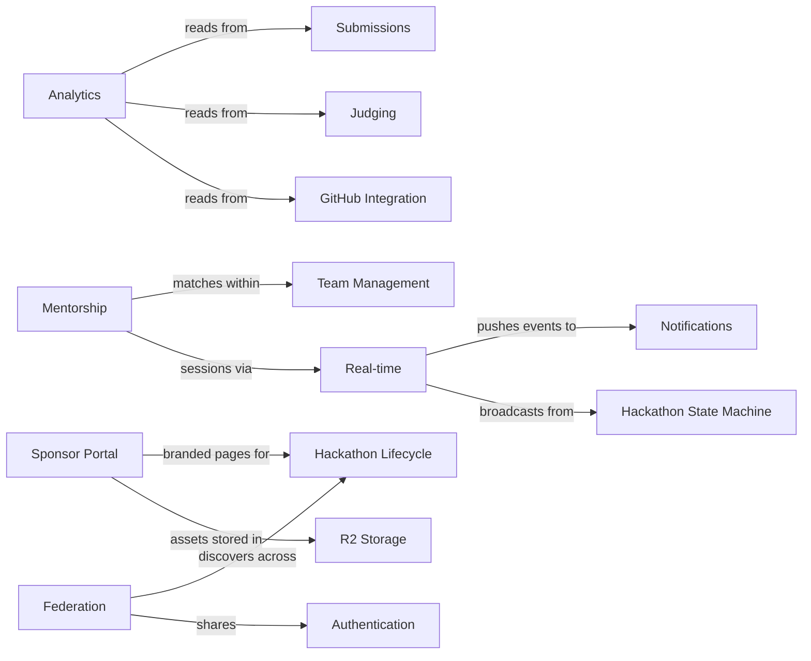

---

## Request Lifecycle

### Current (v2) — REST Request

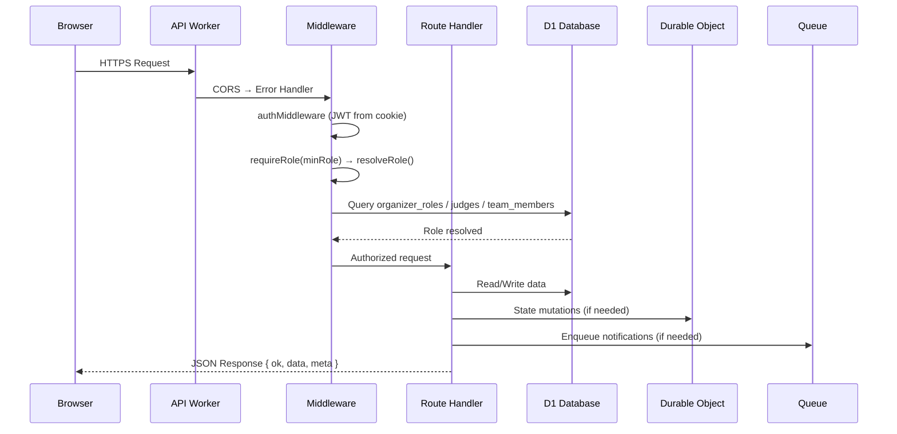

### v3 Vision — WebSocket Connection Lifecycle

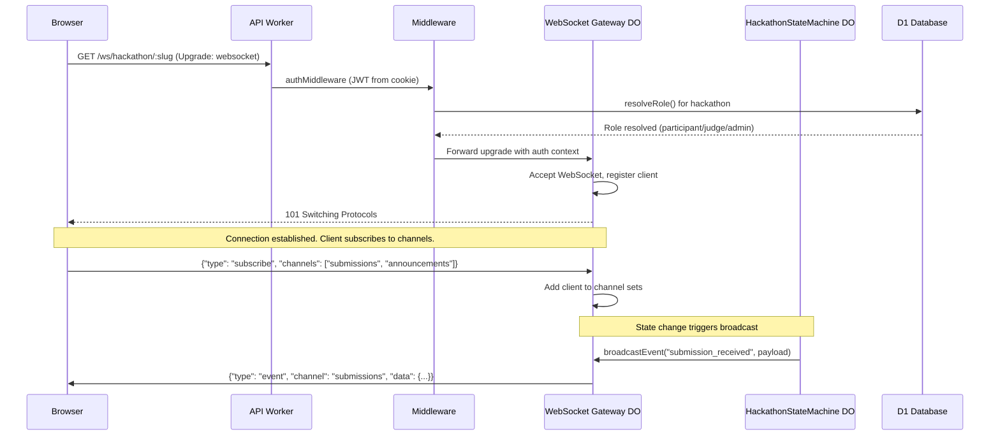

### v3 Vision — Analytics Event Pipeline

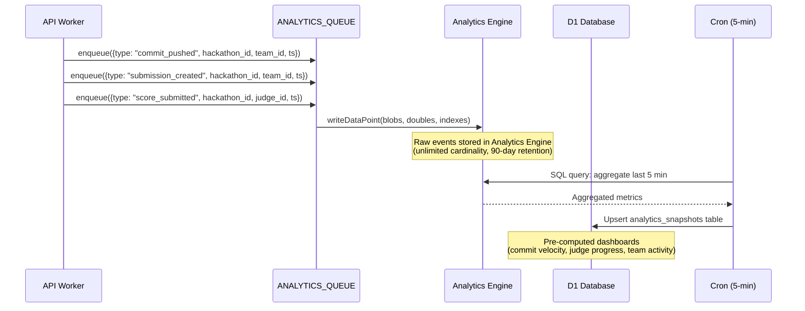

---

## Monorepo Structure

### Current (v2)

```
DevSage/
├── apps/
│   ├── api/              # Cloudflare Worker — Hono API + DO + Queue + Cron
│   └── web/              # React SPA — Vite + React Router v7 + Tailwind v4
├── packages/
│   ├── config/           # Shared tsconfig (base, react, worker) + ESLint flat config
│   ├── db/               # Drizzle ORM schemas (17 tables) + D1 migrations
│   └── shared/           # Zod schemas, types, constants (only dep: zod)
└── docs/
    └── v2/
        ├── architecture/ # This documentation
        ├── setup.md
        ├── deployment.md
        ├── secrets.md
        └── contributing.md
```

### v3 Vision — Expanded Monorepo

```
DevSage/
├── apps/
│   ├── api/              # Cloudflare Worker — Hono API + DO + Queue + Cron
│   ├── web/              # React SPA — Vite + React Router v7 + Tailwind v4
│   ├── ai-worker/        # (NEW) Dedicated AI review Worker (service binding from api)
│   └── sponsor-portal/   # (NEW) Sponsor-facing React SPA (shared UI library)
├── packages/
│   ├── config/           # Shared tsconfig (base, react, worker) + ESLint flat config
│   ├── db/               # Drizzle ORM schemas (~25 tables) + D1 migrations
│   ├── shared/           # Zod schemas, types, constants (only dep: zod)
│   ├── ui/               # (NEW) Shared React component library (extracted from web)
│   └── realtime/         # (NEW) WebSocket protocol types, client SDK, reconnection logic
├── docs/
│   ├── v2/               # Archived v2 documentation
│   └── v3/
│       ├── architecture/ # This documentation
│       ├── setup.md
│       ├── deployment.md
│       ├── secrets.md
│       └── contributing.md
└── tools/
    └── analytics-cli/    # (NEW) CLI for querying Analytics Engine (local dev + CI)
```

### Dependency Graph

#### Current (v2)

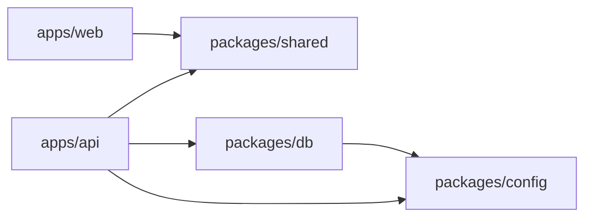

#### v3 Vision

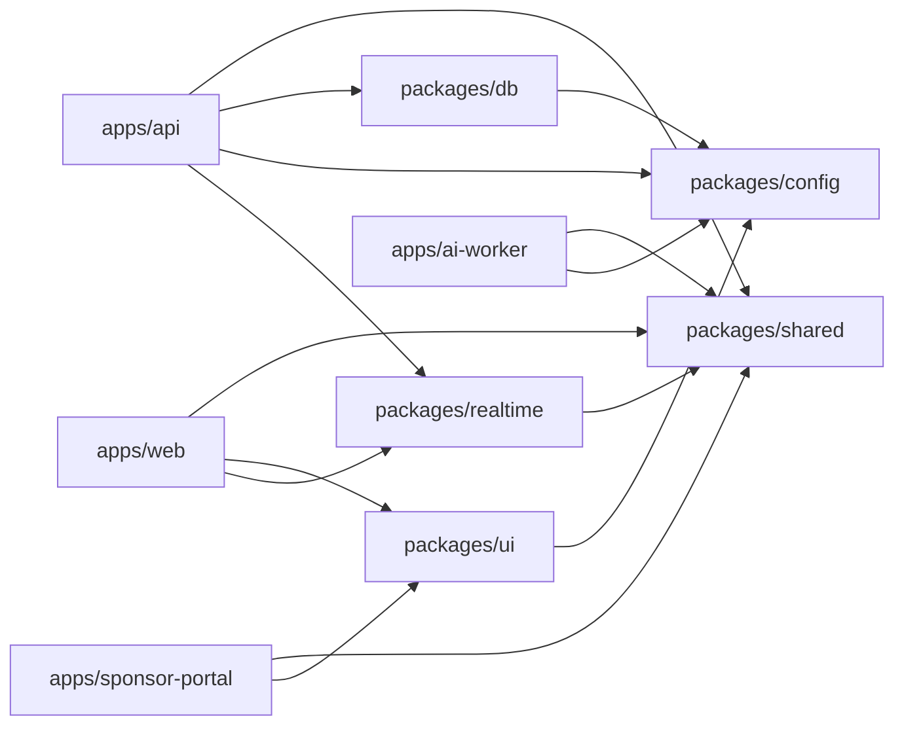

---

## Scale Targets

### Current (v2)

- 3 concurrent hackathons, ~500 total users, 2-5 member teams
- Infrastructure cost: $0/month on Workers Free plan at initial scale
- D1 storage: ~17 MB estimated (5 GB limit = effectively infinite)

### v3 Vision — 10,000+ Users

| Metric | v2 (Current) | v3 (Target) | Headroom |
|--------|-------------|-------------|----------|
| **Concurrent hackathons** | 3 | 50+ | DO isolation per hackathon |
| **Total registered users** | 500 | 10,000+ | D1 row limits: 10B rows |
| **Teams per hackathon** | ~50 | 200+ | D1 query optimization + KV caching |
| **Submissions per hackathon** | ~150 | 500+ | Exactly-once locking scales per DO |
| **Concurrent WebSocket connections** | N/A | 5,000 | 1 DO handles ~2,000 connections; shard by hackathon |
| **Webhook events/day** | ~200 | ~50,000 | Queue throughput: 5,000 msg/s |
| **D1 storage** | ~17 MB | ~500 MB | 5 GB limit per database |
| **R2 storage** | N/A | ~10 GB | Sponsor assets, exports, media |
| **Analytics events/day** | N/A | ~200,000 | Analytics Engine: 100M events/day |
| **API requests/day** | ~5,000 | ~500,000 | Workers: 100K req/day free, $5/10M paid |

#### Cost Projections

| Tier | Users | Hackathons | Estimated Monthly Cost | Plan |
|------|-------|------------|----------------------|------|
| **Free** | 0-500 | 1-3 | $0 | Workers Free |
| **Growth** | 500-2,000 | 3-15 | $5-15 | Workers Paid ($5 base) |
| **Scale** | 2,000-10,000 | 15-50 | $15-50 | Workers Paid + R2 + AE |
| **Enterprise** | 10,000+ | 50+ | $50-150 | Workers Paid + all primitives |

All costs are Cloudflare-only. External services (SMTP, AI provider) are billed separately.

> **Key insight:** Cloudflare's per-request pricing means cost scales linearly with actual usage, not provisioned capacity. A hackathon with 0 active users costs $0 in compute. This is the core economic advantage of edge-native architecture.

#### D1 Storage Breakdown (v3 projected)

| Table Group | Rows (est.) | Size (est.) | Notes |
|-------------|-------------|-------------|-------|
| Users + auth | 10,000 | 5 MB | User profiles, OAuth tokens, sessions |
| Hackathons + config | 500 | 2 MB | Hackathon metadata, phases, settings |
| Teams + members | 5,000 | 3 MB | Team registrations, member links |
| Submissions + versions | 15,000 | 10 MB | Tag captures, version history |
| Judging + scores | 50,000 | 20 MB | Rubric criteria, individual scores |
| GitHub events | 200,000 | 100 MB | Webhook payloads, commit records |
| Audit log | 500,000 | 150 MB | Append-only, never deleted |
| Analytics snapshots | 100,000 | 50 MB | Pre-aggregated dashboard data |
| Sponsors + assets | 1,000 | 2 MB | Metadata only; blobs in R2 |
| Mentorship | 5,000 | 3 MB | Sessions, feedback, availability |
| Federation | 500 | 1 MB | Org links, trust records |
| **Total** | **~886,000** | **~346 MB** | **Well within 5 GB D1 limit** |

---

## v3 Component Deep Dives

### WebSocket Gateway (Durable Object)

The WebSocket Gateway is a Durable Object class that manages persistent WebSocket connections for a single hackathon. Each hackathon gets its own gateway instance, providing natural tenant isolation via the Hibernation API.

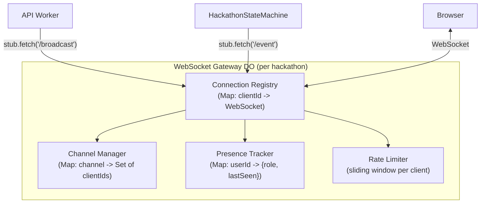

**Channels per hackathon:**

| Channel | Events | Subscribers |
|---------|--------|-------------|
| `announcements` | Phase changes, organizer messages | All connected users |
| `submissions` | New submission, version update | Organizers, judges |
| `activity` | Commits pushed, PRs opened | All connected users |
| `judging` | Score submitted, round complete | Judges, organizers |
| `leaderboard` | Score updates, rank changes | All connected users (if public) |
| `mentorship` | Session requests, availability | Mentors, team members |
| `presence` | User join/leave, typing | All connected users |

**Connection limits:** 200 concurrent connections per hackathon gateway. At 50 hackathons, this supports 10,000 simultaneous WebSocket connections across the platform.

### AI Review Service (Dedicated Worker)

v2 runs AI reviews inline within the API Worker, sharing its CPU budget. v3 extracts this into a dedicated Worker connected via Cloudflare Service Bindings.

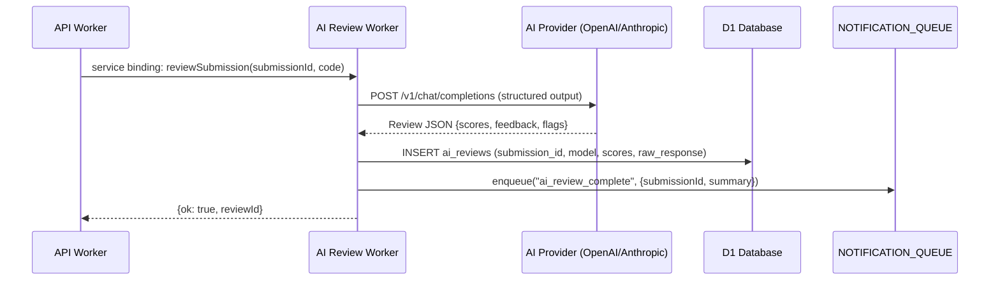

**Why a separate Worker:**
- AI API calls take 5-30 seconds; isolating them prevents CPU budget contention with the main API
- Service bindings have zero-latency overhead (same Cloudflare colo)
- Independent scaling: AI Worker can have its own rate limits and retry logic
- Clean separation of AI provider credentials from main API secrets

### Analytics Pipeline

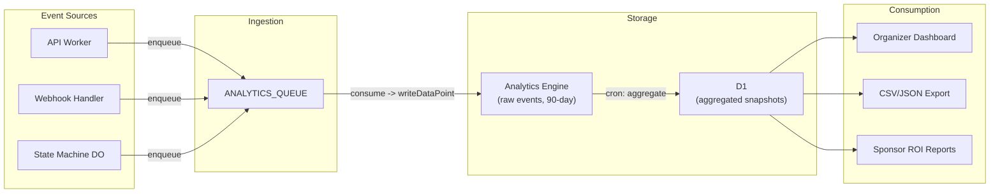

**Event types tracked:**

| Event | Source | Indexed By |
|-------|--------|-----------|
| `user_registered` | API | hackathon_id, timestamp |
| `team_created` | API | hackathon_id, timestamp |
| `commit_pushed` | Webhook handler | hackathon_id, team_id, timestamp |
| `submission_created` | State machine DO | hackathon_id, team_id, timestamp |
| `score_submitted` | API | hackathon_id, judge_id, timestamp |
| `phase_changed` | State machine DO | hackathon_id, new_phase, timestamp |
| `page_viewed` | API (optional) | hackathon_id, page, timestamp |
| `mentor_session_started` | Mentorship DO | hackathon_id, mentor_id, timestamp |

### Sponsor Portal

Sponsors interact with DevSage through a dedicated portal that provides branding tools, lead capture, and ROI measurement.

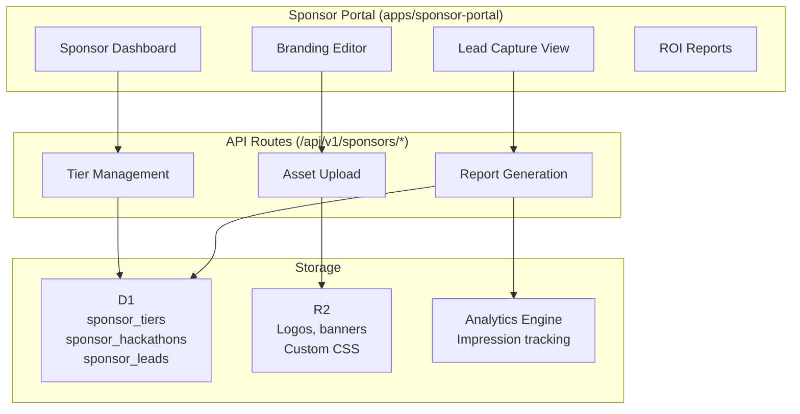

**Sponsor tiers:**

| Tier | Features | Price Point |
|------|----------|-------------|
| **Bronze** | Logo on hackathon page, mention in emails | Free / in-kind |
| **Silver** | Bronze + branded challenge track, lead capture | Paid |
| **Gold** | Silver + custom landing page, judge seat, analytics | Paid |
| **Title** | Gold + naming rights, keynote slot, full export | Paid |

### Mentorship System

The mentorship system uses a dedicated Durable Object to manage real-time mentor-team sessions with scheduling, messaging, and feedback.

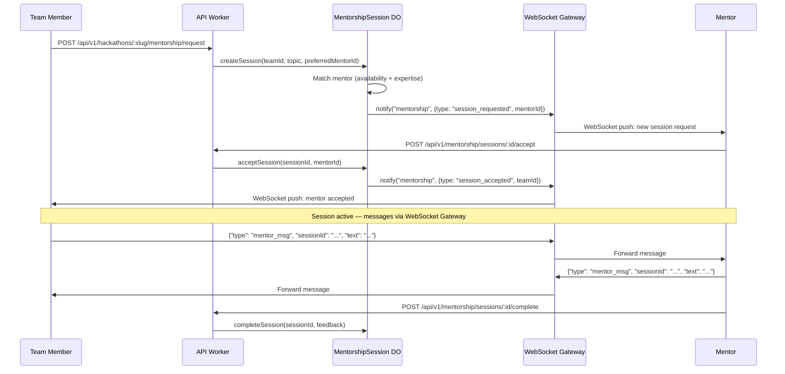

### Multi-org Federation

Federation enables organizations to discover and cross-list hackathons, share participant profiles (with consent), and aggregate leaderboards across organizational boundaries.

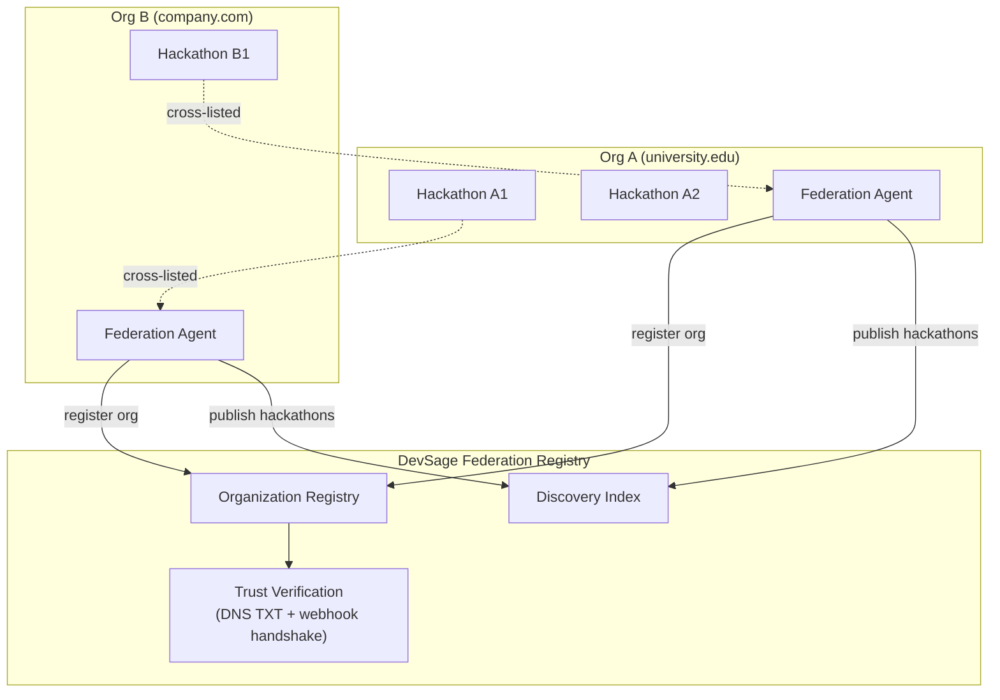

**Federation protocol:**
1. **Registration:** Organization admin registers their DevSage instance, verified via DNS TXT record
2. **Discovery:** Published hackathons appear in the federated discovery index (opt-in per hackathon)
3. **Cross-listing:** Participants from Org B can view and register for Org A's hackathons
4. **Profile sharing:** Participant profiles are shared across federated orgs with explicit user consent
5. **Trust levels:** `none` (public listing only) -> `basic` (cross-registration) -> `full` (shared judging, merged leaderboards)

---

## Migration Path: v2 to v3

### Strategy: Incremental, Non-Breaking

v3 is not a rewrite. It is an incremental expansion of v2. Every v3 feature is additive — no existing API endpoint changes signature, no existing table drops columns, no existing Durable Object changes its state format.

1. **Database**: New tables added via Drizzle migrations. No existing columns are removed or renamed. New columns on existing tables use defaults or are nullable.
2. **API**: All `/api/v1/` endpoints remain functional with no breaking changes. New v3 features are added as new routes under existing prefixes.
3. **Frontend**: New features are lazy-loaded. Existing pages are enhanced incrementally.
4. **Durable Objects**: `WebSocketGateway` and `MentorshipSession` are new DO classes alongside the existing `HackathonStateMachine`. No changes to existing DO state.
5. **Queues**: New `ANALYTICS_QUEUE` is added. Existing queues are unchanged.

### Migration Sequence

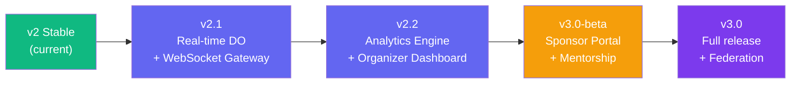

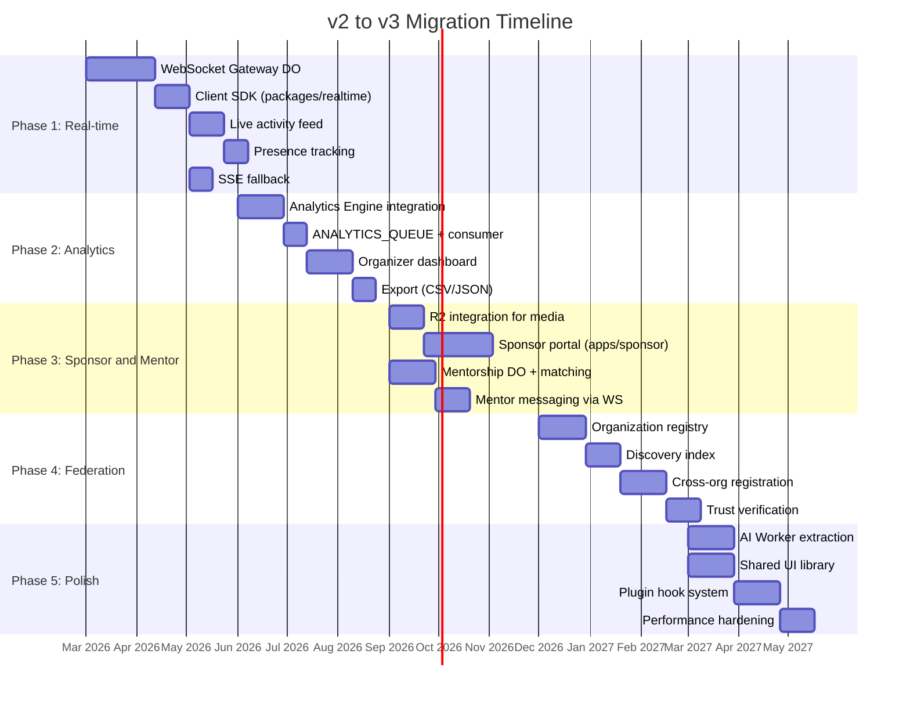

### Phase Details

#### Phase 1: Real-time Foundation (Q1 2026)

**Goal:** Every state change in a hackathon is pushed to connected clients in real-time.

| Task | Cloudflare Primitive | Risk | Mitigation |
|------|---------------------|------|------------|
| WebSocket Gateway DO | Durable Objects (WebSocket Hibernation API) | DO memory limits at high connection count | Shard by hackathon; each DO handles max 200 connections |
| Client reconnection SDK | N/A (client-side) | Reconnection storms after deploy | Exponential backoff with jitter, max 30s delay |
| SSE fallback | Workers (standard response streaming) | Corporate proxies dropping SSE | Automatic fallback detection in client SDK |
| Presence tracking | DO in-memory state | State loss on DO eviction | Presence is ephemeral by design; clients re-announce on reconnect |

**Database migrations:** None. Real-time is stateless (DO memory + WebSocket connections).

**Breaking changes:** None. REST API continues to work. WebSocket is additive.

#### Phase 2: Analytics & Insights (Q2 2026)

**Goal:** Organizers see real-time dashboards showing commit velocity, judge progress, and team engagement.

| Task | Cloudflare Primitive | Risk | Mitigation |
|------|---------------------|------|------------|
| Event ingestion queue | Cloudflare Queues | Queue backpressure at high event volume | Batch writes to Analytics Engine (up to 25 per batch) |
| Analytics Engine writes | Analytics Engine | 90-day retention limit | Cron job aggregates into D1 for long-term storage |
| Dashboard queries | D1 (pre-aggregated) | Query latency on large datasets | Pre-compute all dashboard views in analytics_snapshots table |
| CSV/JSON export | R2 (generated files) | Large export file generation time | Generate async via queue, notify via WebSocket when ready |

**Database migrations:**
- `CREATE TABLE analytics_snapshots` (hackathon_id, metric_type, period, value, computed_at)
- `CREATE TABLE analytics_exports` (hackathon_id, format, r2_key, requested_by, created_at)

**Breaking changes:** None. Analytics is a new read path.

#### Phase 3: Sponsor Portal & Mentorship (Q3 2026)

**Goal:** Sponsors manage branding and track ROI. Mentors connect with teams in real-time.

**Database migrations:**
- `CREATE TABLE sponsors` (id, name, org_id, contact_email, created_at)
- `CREATE TABLE sponsor_tiers` (id, hackathon_id, sponsor_id, tier, config_json)
- `CREATE TABLE sponsor_assets` (id, sponsor_id, r2_key, asset_type, uploaded_at)
- `CREATE TABLE mentor_profiles` (id, user_id, expertise, availability_json)
- `CREATE TABLE mentorship_sessions` (id, hackathon_id, team_id, mentor_id, status, started_at, ended_at)
- `CREATE TABLE mentorship_feedback` (id, session_id, from_user_id, rating, comment)

**Breaking changes:** None. New routes under `/api/v1/sponsors/*` and `/api/v1/mentorship/*`.

#### Phase 4: Multi-org Federation (Q4 2026)

**Goal:** Organizations discover each other's hackathons and enable cross-registration.

**Database migrations:**
- `CREATE TABLE organizations` (id, name, domain, verified, trust_level, registered_at)
- `CREATE TABLE federation_links` (id, org_a_id, org_b_id, trust_level, established_at)
- `CREATE TABLE federated_hackathons` (id, hackathon_id, org_id, visibility, listed_at)

**Breaking changes:** None. Federation is opt-in per organization and per hackathon.

#### Phase 5: Extraction & Extensibility (Q1 2027)

**Goal:** Extract AI reviews into a dedicated Worker. Build the plugin hook system. Harden for 10,000+ users.

| Task | Details |
|------|---------|
| AI Worker extraction | Move AI review logic from `apps/api/src/services/ai.ts` to `apps/ai-worker/`. Connect via Cloudflare Service Binding. Zero-latency, isolated CPU budget |
| Shared UI library | Extract common components from `apps/web/src/components/ui/` into `packages/ui/`. Both `apps/web` and `apps/sponsor-portal` consume it |
| Plugin hooks | Define lifecycle events (pre-submit, post-judge, on-phase-change). Plugins register webhook URLs. Events dispatched via NOTIFICATION_QUEUE with plugin-specific routing |
| Performance hardening | D1 query optimization, KV caching for hot paths, connection pooling analysis, load testing at 10K concurrent users |

---

## v3 New Durable Object Classes

| Class | Purpose | State Model | Scaling |
|-------|---------|-------------|---------|
| `HackathonStateMachine` *(existing)* | Lifecycle phases, submission locking, deadline alarms | SQLite-backed (persistent) | 1 per hackathon |
| `WebSocketGateway` *(v3 new)* | Real-time event broadcast, presence, channel subscriptions | In-memory (ephemeral) + WebSocket Hibernation API | 1 per hackathon |
| `MentorshipSession` *(v3 new)* | Mentor-team matching, session lifecycle, message relay | SQLite-backed (persistent) | 1 per hackathon |

### Durable Object Communication Pattern

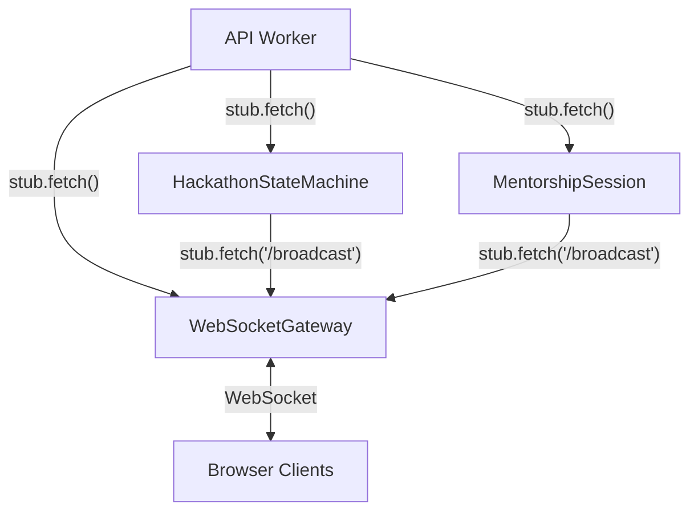

> **Rule:** Durable Objects never call each other directly except through the WebSocket Gateway broadcast endpoint. All other inter-DO communication goes through the API Worker to maintain the single-writer guarantee from P1.

---

## v3 New Storage Primitives

| Primitive | v2 Usage | v3 Usage |
|-----------|----------|----------|
| **D1** | 17 tables, primary data store | ~25 tables, primary data store + analytics snapshots |
| **KV** | OAuth state (10-min TTL) | OAuth state + rate limit counters + session cache + feature flags |
| **R2** | Not used | Sponsor assets (logos, banners), export archives (CSV/ZIP), team avatars |
| **Analytics Engine** | Not used | Raw event stream (commits, submissions, scores, page views). 90-day retention. SQL query API |
| **Queues** | 2 (webhooks, notifications) | 3 (+ analytics). Same consumer Worker pattern |

---

## v3 API Route Additions

| Method | Route | Domain | Auth |
|--------|-------|--------|------|
| GET | `/ws/hackathon/:slug` | Real-time | JWT (WebSocket upgrade) |
| GET | `/api/v1/hackathons/:slug/analytics` | Analytics | admin+ |
| GET | `/api/v1/hackathons/:slug/analytics/export` | Analytics | admin+ |
| POST | `/api/v1/hackathons/:slug/analytics/export` | Analytics | admin+ |
| GET | `/api/v1/sponsors` | Sponsor Portal | authenticated |
| POST | `/api/v1/hackathons/:slug/sponsors` | Sponsor Portal | admin+ |
| PUT | `/api/v1/hackathons/:slug/sponsors/:id` | Sponsor Portal | admin+ |
| POST | `/api/v1/hackathons/:slug/sponsors/:id/assets` | Sponsor Portal | admin+ |
| GET | `/api/v1/hackathons/:slug/mentorship/mentors` | Mentorship | authenticated |
| POST | `/api/v1/hackathons/:slug/mentorship/request` | Mentorship | participant+ |
| POST | `/api/v1/mentorship/sessions/:id/accept` | Mentorship | mentor |
| POST | `/api/v1/mentorship/sessions/:id/complete` | Mentorship | mentor |
| GET | `/api/v1/federation/orgs` | Federation | authenticated |
| POST | `/api/v1/federation/orgs` | Federation | owner |
| GET | `/api/v1/federation/discover` | Federation | authenticated |

---

## Document Index

### Architecture (v2 + v3)

| # | Document | Domain | Status |
|---|----------|--------|--------|
| [00](./00-overview.md) | System Overview | Architecture | Current + v3 planning |
| [01](./01-authentication.md) | Authentication & Sessions | Identity | Current |
| [02](./02-hackathon-lifecycle.md) | Hackathon Lifecycle | Core Logic | Current |
| [03](./03-team-management.md) | Team Management | Participation | Current |
| [04](./04-submissions.md) | Submissions & Locking | Core Logic | Current |
| [05](./05-judging.md) | Judging & Scoring | Evaluation | Current |
| [06](./06-roles-permissions.md) | Roles & Permissions | Access Control | Current |
| [07](./07-webhooks-integrations.md) | Webhooks & GitHub Integration | Integration | Current |
| [08](./08-notifications.md) | Notification System | Communication | Current |
| [09](./09-audit-trail.md) | Audit Trail | Compliance | Current |
| [10](./10-data-model.md) | Data Model & Schema | Storage | Current |
| [11](./11-api-design.md) | API Design & Conventions | Interface | Current |
| [12](./12-infrastructure.md) | Infrastructure & Deployment | Operations | Current |
| [13](./13-frontend.md) | Frontend Architecture | UI/UX | Current |

### Planned (v3) Documents

| # | Document | Domain | Status |
|---|----------|--------|--------|
| [14](./14-real-time.md) | Real-time System | Communication | Planned |
| [15](./15-analytics.md) | Analytics & Insights | Intelligence | Planned |
| [16](./16-sponsor-portal.md) | Sponsor Portal | Monetization | Planned |
| [17](./17-mentorship.md) | Mentorship System | Engagement | Planned |
| [18](./18-federation.md) | Multi-org Federation | Scale | Planned |
| [19](./19-plugin-system.md) | Plugin Extensibility | Platform | Planned |

### Guides

| Document | Description |
|----------|------------|
| [Developer Setup](../setup.md) | Local environment setup |
| [Deployment](../deployment.md) | Production deployment to Cloudflare |
| [Secrets](../secrets.md) | Secret management conventions |
| [Contributing](../contributing.md) | Code style, PR checklist, anti-patterns |

---

## v3 Roadmap Summary

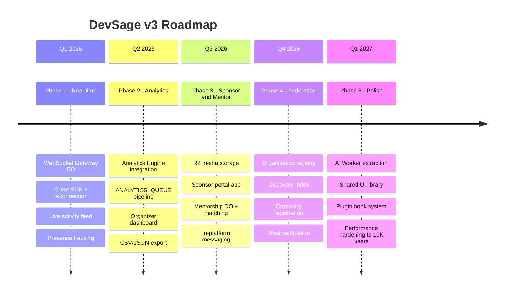

---

## Decision Log

| Decision | Rationale | Alternatives Considered |
|----------|-----------|------------------------|
| WebSocket via Durable Objects (not Pub/Sub) | DO provides per-hackathon isolation, built-in hibernation API, and direct integration with state machine broadcasts. Pub/Sub lacks per-topic access control | Cloudflare Pub/Sub (beta, no auth), external WebSocket service (violates P7) |
| Analytics Engine over external analytics | Zero-egress, same-colo as Workers, SQL query API, 100M events/day free tier. Keeps all data on Cloudflare | PostHog (external, egress cost), custom D1 tables (no time-series optimization) |
| R2 for media over D1 BLOBs | R2 handles large objects (logos, exports) with CDN caching. D1 BLOBs degrade query performance | D1 BLOB columns (size limits, slow queries), external S3 (violates P7) |
| Dedicated AI Worker over inline | AI calls take 5-30s, consuming API Worker CPU budget. Service binding has zero latency overhead | Inline with timeout (CPU contention), external microservice (violates P7, adds latency) |
| Federation via DNS TXT verification | Standard, decentralized, no central authority needed. Same pattern as DKIM/SPF | OAuth between orgs (complex), manual admin approval (doesn't scale) |
| Plugin hooks via webhook dispatch | Reuses existing NOTIFICATION_QUEUE infrastructure. No new runtime dependency. Plugins are external HTTP endpoints | In-process plugins (security risk), WASM plugins (complexity), event bus (new infrastructure) |
