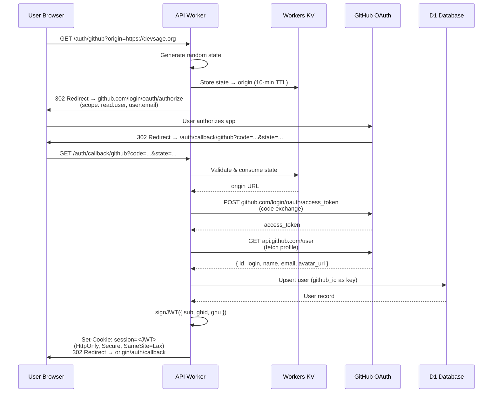
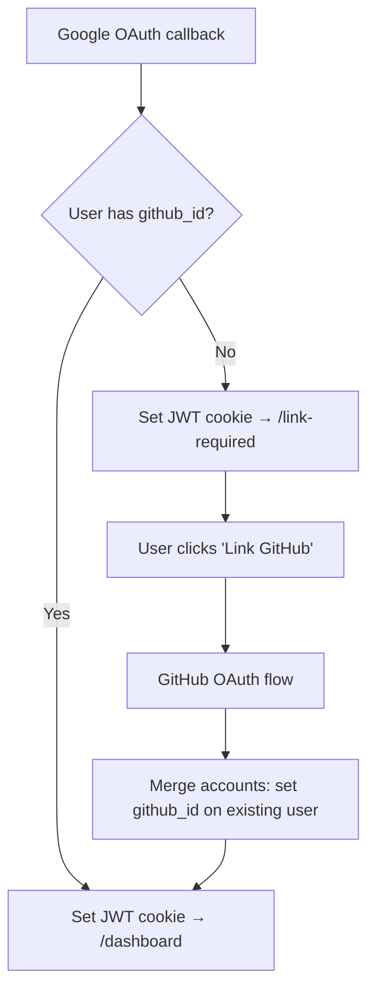
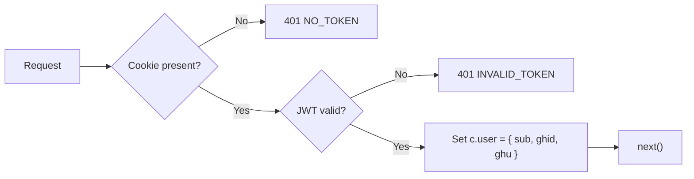
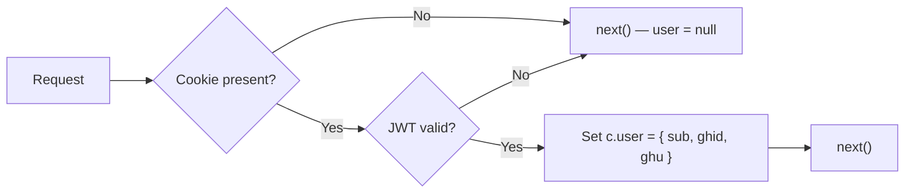
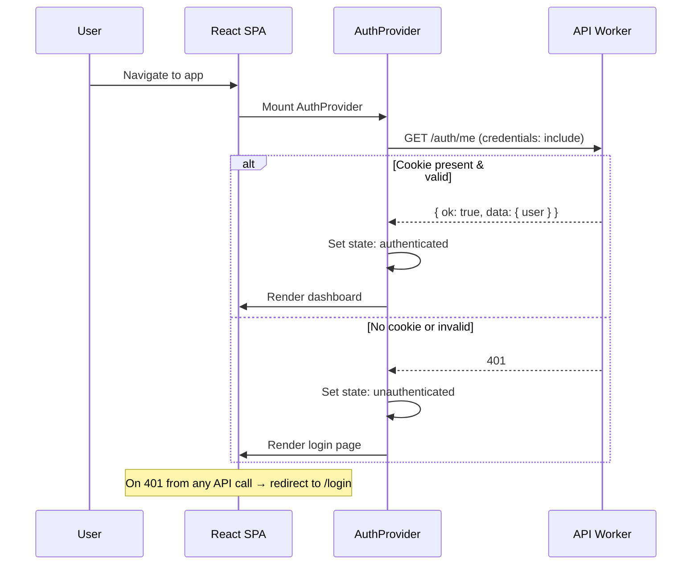
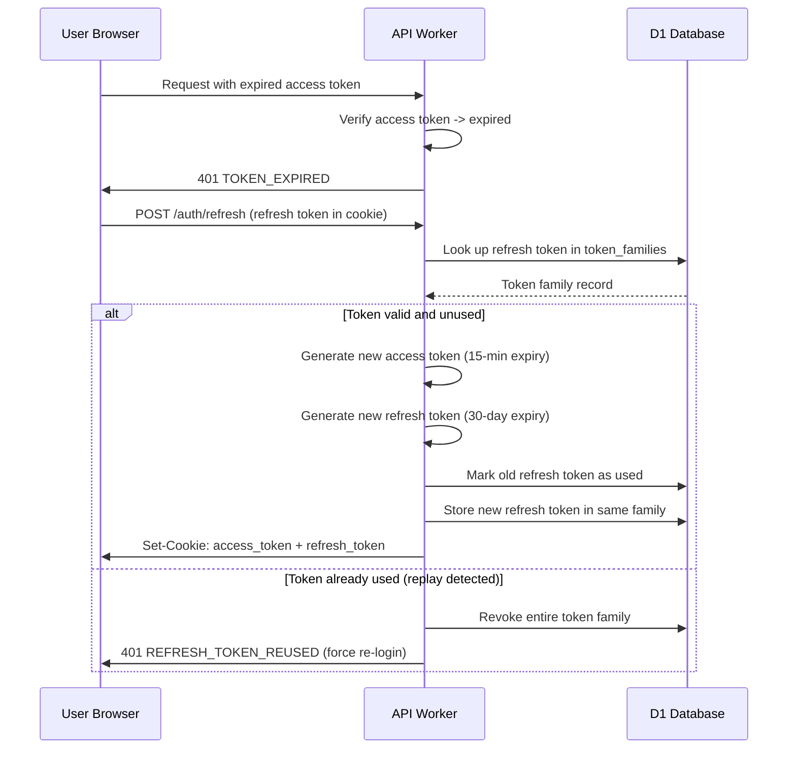

# 01 — Authentication & Sessions

> Manual OAuth 2.0 with GitHub (primary) and Google (secondary), stateless JWT in HttpOnly cookies, no external auth libraries.

**Related docs:** [Roles & Permissions](./06-roles-permissions.md) | [API Design](./11-api-design.md) | [Infrastructure](./12-infrastructure.md)

---

## Overview

DevSage uses a custom authentication system built entirely on Web Crypto APIs (`crypto.subtle`). No external JWT libraries. No `@hono/oauth-providers` (broken on Cloudflare Workers).

- **Providers**: GitHub (primary, required), Google (secondary, optional)
- **Token**: Stateless JWT stored in HttpOnly cookie
- **Session**: No server-side session state — JWT is self-contained
- **Roles**: NOT stored in JWT — resolved per-request per-hackathon (see [06-roles-permissions.md](./06-roles-permissions.md))

---

## OAuth 2.0 Flow

### GitHub OAuth (Primary)



### Google OAuth (Secondary)

Same flow but:
- Endpoint: `accounts.google.com/o/oauth2/v2/auth`
- Scope: `openid profile email`
- Token exchange: `oauth2.googleapis.com/token`
- Profile: decoded from ID token or `googleapis.com/oauth2/v2/userinfo`
- On callback: if user has no `github_id` → redirect to `/link-required` (GitHub is required for bot features)

### Account Linking

Users who sign in with Google first must link a GitHub account:



---

## JWT Token Design

### Payload Structure

```typescript
interface JWTPayload {
  sub: string;    // user.id (UUID)
  ghid: number;   // github_id
  ghu: string;    // github_username
  iat: number;    // issued at (Unix seconds)
  exp: number;    // expiry (Unix seconds)
}
```

### Implementation Details

| Property | Value |
|----------|-------|
| Algorithm | HMAC-SHA256 via `crypto.subtle` |
| Secret | `JWT_SECRET` (Worker secret) |
| Expiry | 7 days (604,800 seconds) |
| Storage | HttpOnly cookie named `session` |
| CSRF protection | `SameSite=Lax` (dev) / `SameSite=Strict` + `Secure` (prod) |
| Verification cost | ~0.5ms CPU per request |
| Server-side state | None (fully stateless) |

### What is NOT in the JWT

- **Roles** — resolved per-request per-hackathon via database query
- **Email** — may change; always fetch from DB
- **Display name** — may change; always fetch from DB
- **Permissions** — derived from roles at request time

---

## Cookie Configuration

```typescript
// Production
{
  httpOnly: true,
  secure: true,
  sameSite: 'Strict',
  path: '/',
  maxAge: 604800,         // 7 days
  domain: '.devsage.org'  // Shared across subdomains
}

// Development
{
  httpOnly: true,
  secure: false,
  sameSite: 'Lax',
  path: '/',
  maxAge: 604800
}
```

---

## Middleware Chain

### `authMiddleware` (strict)

Used on all protected routes. Rejects unauthenticated requests.



### `optionalAuth` (lenient)

Used on public routes that benefit from knowing the user (e.g., leaderboard visibility).



---

## Frontend Auth Flow



### AuthContext API

```typescript
const { user, isAuthenticated, isLoading, logout } = useAuth();
```

| Field | Type | Description |
|-------|------|-------------|
| `user` | `User \| null` | Current user object with `id`, `github_username`, `display_name`, etc. |
| `isAuthenticated` | `boolean` | Whether user is logged in |
| `isLoading` | `boolean` | True during initial `/auth/me` check |
| `logout()` | `() => Promise<void>` | Calls `POST /auth/logout`, clears state, redirects to `/` |

---

## Security Considerations

| Threat | Mitigation |
|--------|-----------|
| XSS token theft | HttpOnly cookie — JS cannot access |
| CSRF | `SameSite=Strict` (prod) + `Origin` header check on mutations |
| Token replay | 7-day expiry; no refresh tokens (user re-authenticates) |
| Timing attacks on JWT verify | `crypto.subtle` uses constant-time comparison internally |
| OAuth state forgery | Random state stored in KV with 10-min TTL, consumed on use |
| Account takeover | GitHub ID is the primary key; Google ID is optional secondary |

---

## v3 Planned Enhancements

### Passkey / WebAuthn Support

Add passkeys as a third authentication provider alongside GitHub and Google. Users register a platform authenticator (fingerprint, Face ID, hardware key) during account setup or from a settings page. The server stores the credential public key in a new `user_credentials` table. On login, the browser performs a WebAuthn assertion ceremony, and the Worker verifies the signature via `crypto.subtle` (no external libraries).

| Property | Value |
|----------|-------|
| Attestation | `none` (privacy-preserving, no attestation verification) |
| User verification | `preferred` (biometric when available) |
| Discoverable credentials | Yes (passkey auto-fill in browsers) |
| Credential storage | `user_credentials` table in D1 (credential ID, public key, sign count, transports) |
| Fallback | OAuth login remains available; passkeys are additive |

### Refresh Token Rotation

Replace the current single long-lived JWT with a short-lived access token and a rotating refresh token pair. Access tokens expire in 15 minutes. Refresh tokens expire in 30 days but are single-use: each refresh request issues a new refresh token and invalidates the old one. Both tokens are stored in HttpOnly cookies on separate paths to limit exposure.



| Property | Value |
|----------|-------|
| Access token expiry | 15 minutes |
| Refresh token expiry | 30 days |
| Rotation | Every refresh issues a new pair |
| Replay detection | Reuse of a consumed refresh token revokes the entire family |
| Cookie paths | Access: `/`; Refresh: `/auth/refresh` |
| Storage | `token_families` table in D1 (family_id, token_hash, used_at, revoked_at) |

### Session Management Dashboard

Expose a `/settings/sessions` page where users can view all active sessions and revoke them remotely. Each refresh token family maps to a session. The API returns device metadata (User-Agent parsed into OS, browser, device type) and approximate location (Cloudflare `cf-ipcountry` header captured at token issuance). Revoking a session invalidates the entire token family, forcing re-authentication on that device.

| Field | Source | Example |
|-------|--------|---------|
| Device | Parsed `User-Agent` | "Chrome on macOS" |
| Location | `cf-ipcountry` header | "US" |
| Created | Token family `created_at` | "2026-02-10T14:30:00Z" |
| Last active | Most recent refresh `created_at` | "2026-02-13T09:15:00Z" |
| Current | Matches requesting token family | Boolean |

### OAuth Scope Expansion for GitHub

Request additional GitHub OAuth scopes to enable bot write features. The initial login continues with `read:user` and `user:email`. When a team leader links a repo and needs bot capabilities (auto-commenting on PRs, creating issues for submission status), the app triggers an incremental authorization flow that requests `repo` scope. The elevated access token is stored encrypted in D1, scoped to the team's repo, and used exclusively by the queue consumer for bot operations.

| Scope | When Requested | Purpose |
|-------|---------------|---------|
| `read:user, user:email` | Initial login | Profile, identity |
| `repo` | Repo linking (incremental auth) | Bot: PR comments, commit statuses, issue creation |
| `admin:repo_hook` | Repo linking (incremental auth) | Manage webhooks programmatically |

### Rate Limiting on Auth Endpoints

Apply Cloudflare Rate Limiting rules to all `/auth/*` endpoints to prevent credential stuffing and OAuth abuse. Rate limits are enforced at the edge before the Worker executes, using the client IP as the key. Failed attempts (invalid state, expired codes) count toward stricter limits.

| Endpoint | Limit | Window | Action |
|----------|-------|--------|--------|
| `GET /auth/github` | 10 requests | 1 minute | Block for 5 minutes |
| `GET /auth/google` | 10 requests | 1 minute | Block for 5 minutes |
| `GET /auth/callback/*` | 20 requests | 1 minute | Block for 10 minutes |
| `POST /auth/refresh` | 30 requests | 1 minute | Block for 5 minutes |
| `POST /auth/logout` | 10 requests | 1 minute | Block for 1 minute |

### Account Deletion and GDPR Data Export

Implement `DELETE /auth/account` for full account deletion and `GET /auth/account/export` for GDPR-compliant data export. Deletion is a two-phase process: the user requests deletion, receives a confirmation email with a time-limited token, and confirms via `POST /auth/account/delete-confirm`. On confirmation, the Worker enqueues a `DELETION_QUEUE` job that cascades through all user data: team memberships (reassign leader if needed), scores, audit events (anonymized, not deleted), and OAuth tokens. Data export generates a JSON archive of all user-associated records and delivers it via a signed R2 URL valid for 24 hours.

| Phase | Action | Timeline |
|-------|--------|----------|
| Request | `DELETE /auth/account` | Immediate |
| Confirmation email | Token valid for 24 hours | Sent via NOTIFICATION_QUEUE |
| Confirm | `POST /auth/account/delete-confirm` | Within 24 hours |
| Execution | Queue job cascades deletions | Within 1 hour of confirmation |
| Data export | `GET /auth/account/export` | JSON archive via signed R2 URL (24-hour expiry) |

### Multi-Factor Authentication (TOTP)

Add TOTP-based MFA as an optional security layer. Users enroll from `/settings/security` by scanning a QR code (otpauth URI) with an authenticator app. The shared secret is encrypted at rest in D1. On login, after OAuth completes, users with MFA enabled are redirected to a TOTP challenge page. The server validates the 6-digit code with a 30-second window and one-step tolerance. Recovery codes (10 single-use codes) are generated at enrollment and shown once.

| Property | Value |
|----------|-------|
| Algorithm | TOTP (RFC 6238) via `crypto.subtle` HMAC-SHA1 |
| Period | 30 seconds |
| Digits | 6 |
| Window tolerance | 1 step (previous + current + next) |
| Secret storage | AES-256-GCM encrypted in `user_mfa` table |
| Recovery codes | 10 single-use codes, bcrypt-hashed |
| Enforcement | Optional per-user; organizers can require MFA for admin+ roles |

### Planned Feature Summary

| Feature | Priority | Complexity | New Tables | Key Dependencies |
|---------|----------|------------|------------|------------------|
| Refresh token rotation | High | Medium | `token_families` | Cookie path splitting, frontend retry logic |
| Rate limiting | High | Low | None | Cloudflare dashboard configuration |
| Passkey/WebAuthn | Medium | High | `user_credentials` | WebAuthn browser API, `crypto.subtle` verification |
| MFA (TOTP) | Medium | Medium | `user_mfa`, `recovery_codes` | QR code generation, HMAC-SHA1 |
| Session management | Medium | Medium | None (uses `token_families`) | Refresh token rotation (prerequisite) |
| OAuth scope expansion | Medium | Low | Column on `users` | Incremental OAuth flow |
| Account deletion / GDPR | Medium | High | `deletion_requests` | Cascade logic, R2 signed URLs |

---

## File References

| File | Purpose |
|------|---------|
| `apps/api/src/routes/auth.ts` | OAuth routes (initiate, callback, /me, logout) |
| `apps/api/src/lib/jwt.ts` | `signJWT()`, `verifyJWT()` — HMAC SHA-256 |
| `apps/api/src/lib/cookies.ts` | `setSessionCookie()`, `getSessionCookie()`, `clearSessionCookie()` |
| `apps/api/src/lib/oauth.ts` | Manual OAuth HTTP flows for GitHub + Google |
| `apps/api/src/middleware/auth.ts` | `authMiddleware`, `optionalAuth` |
| `apps/web/src/contexts/auth-context.tsx` | `AuthProvider`, `useAuth()` hook |
| `apps/web/src/lib/api.ts` | `apiRequest()` — auto-includes credentials |
| `apps/web/src/pages/login.tsx` | OAuth button UI |
| `apps/web/src/pages/auth-callback.tsx` | Post-OAuth redirect handler |
| `apps/web/src/pages/link-required.tsx` | GitHub account linking flow |
