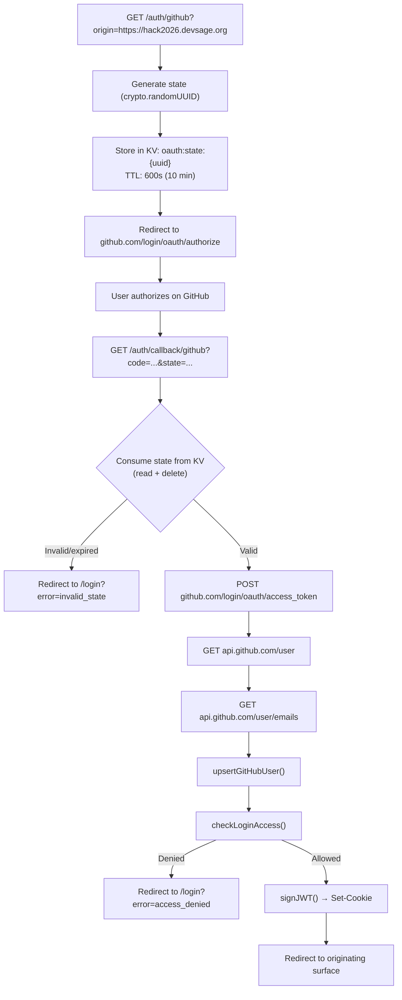
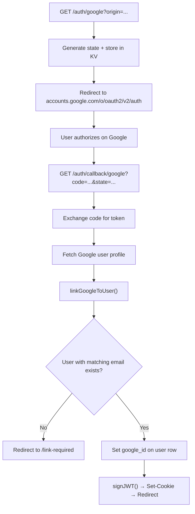

# 01 — Authentication & Sessions

> Cross-subdomain OAuth 2.0 authentication via GitHub and Google. JWT stored in an HttpOnly cookie scoped to `Domain=.devsage.org`, shared across all surfaces. Manual implementation using `crypto.subtle` -- no external JWT libraries, no `@hono/oauth-providers`.

**Related docs:** [System Overview](./00-overview.md) | [Hackathon Lifecycle](./02-hackathon-lifecycle.md) | [Data Model](./03-data-model.md) | [Roles & Permissions](./10-roles-permissions.md)

---

## How It Works

All five surfaces (`devsage.org`, `platform.devsage.org`, `admin.devsage.org`, `{slug}.devsage.org`, `api.devsage.org`) share a single authentication system. A user logs in once and the session cookie is valid everywhere.

```mermaid
sequenceDiagram
    participant U as User Browser
    participant S as Any *.devsage.org Surface
    participant API as api.devsage.org
    participant KV as Workers KV
    participant GH as GitHub / Google

    U->>S: Clicks "Login with GitHub"
    S->>API: Redirect to /auth/github?origin=https://hack2026.devsage.org
    API->>KV: Store OAuth state (10-min TTL)
    API->>GH: Redirect to GitHub authorization URL
    GH->>U: User authorizes
    GH->>API: Callback with code + state
    API->>KV: Consume + delete OAuth state
    API->>GH: Exchange code for access token
    API->>GH: Fetch user profile + emails
    API->>API: Upsert user in D1
    API->>API: Sign JWT (HMAC SHA-256)
    API->>U: Set-Cookie: session=<JWT>; Domain=.devsage.org
    API->>S: Redirect back to originating surface
```

---

## OAuth Providers

Two providers are supported. GitHub is the primary identity provider; Google is a secondary link.

| Provider | Scopes | Primary? | Account Creation |
|----------|--------|----------|------------------|
| **GitHub** | `read:user`, `user:email` | Yes | Creates new user if none exists |
| **Google** | `openid`, `email`, `profile` | No | Links to existing user by email match |

### Why Manual OAuth (Not `@hono/oauth-providers`)

The `@hono/oauth-providers` package is broken on Cloudflare Workers. DevSage implements OAuth 2.0 manually:

1. Build the authorization URL with client ID, redirect URI, scopes, and state
2. Exchange the authorization code for an access token via `POST` to the provider's token endpoint
3. Fetch the user profile using the access token
4. Upsert or link the user in D1

All external HTTP calls use a 10-second timeout via `AbortController` (fail-open pattern).

---

## OAuth Flow: GitHub



### GitHub Email Resolution

The API fetches both `/user` and `/user/emails` to find the best email address. Priority order:

1. `user.email` (if set on GitHub profile)
2. Primary verified email from `/user/emails`
3. Any verified email from `/user/emails`
4. First email in the list

### User Upsert Logic

On GitHub login, `upsertGitHubUser()` in `user-service.ts`:

- **Existing user** (matched by `github_id`): Updates `github_username`, `display_name`, `email`, `avatar_url`, `updated_at`
- **New user**: Inserts with `crypto.randomUUID()` as `id`

---

## OAuth Flow: Google (Account Linking)

Google is a secondary provider. It does not create new accounts -- it links to an existing user matched by email.



### Account Linking Rules

- A user must sign in with GitHub first to create their account
- Google login matches by `email` in the `users` table
- If no user with that email exists, the user is redirected to `/link-required`
- On successful link, the `google_id` column is set on the existing user row

---

## JWT

### Token Structure

The JWT uses HMAC SHA-256 (`HS256`) signed with `crypto.subtle`. No external JWT libraries.

| Field | Type | Description |
|-------|------|-------------|
| `sub` | `string` | User UUID (primary key in `users` table) |
| `ghid` | `number` | GitHub user ID |
| `ghu` | `string` | GitHub username |
| `iat` | `number` | Issued at (Unix timestamp) |
| `exp` | `number` | Expiration (Unix timestamp, `iat + 7 days`) |

### What Is NOT in the JWT

Roles are **not** stored in the JWT. They are resolved per-request per-hackathon by `resolveRole()` in the middleware layer. This means a user's role can differ across hackathons without re-issuing the token.

### Signing

```typescript
// Simplified from apps/api/src/lib/jwt.ts
const header = { alg: 'HS256', typ: 'JWT' };
const payload = { sub, ghid, ghu, iat, exp };

const signingInput = base64url(header) + '.' + base64url(payload);
const key = await crypto.subtle.importKey('raw', secret, { name: 'HMAC', hash: 'SHA-256' }, false, ['sign']);
const signature = await crypto.subtle.sign('HMAC', key, signingInput);

return signingInput + '.' + base64url(signature);
```

### Verification

`verifyJWT()` performs these checks in order:

1. Token has exactly 3 dot-separated parts
2. Header has `alg: 'HS256'` and `typ: 'JWT'`
3. HMAC signature is valid via `crypto.subtle.verify()`
4. Payload has all required fields with correct types
5. Token has not expired (`exp > now`)

Returns `null` on any failure -- no error messages leaked to the caller.

### Expiry

| Setting | Value |
|---------|-------|
| JWT lifetime | 7 days (`JWT_EXPIRY_SECONDS = 604800`) |
| Cookie `maxAge` | 7 days (matches JWT) |

There are no refresh tokens. When the JWT expires, the user must log in again.

---

## Cookie Configuration

The session cookie is named `session` and managed by Hono's cookie helpers (`setCookie`, `getCookie`, `deleteCookie`).

### Production (`*.devsage.org`)

| Attribute | Value | Why |
|-----------|-------|-----|
| `HttpOnly` | `true` | Not accessible via JavaScript -- prevents XSS token theft |
| `SameSite` | `None` | Required for cross-origin requests between subdomains and `api.devsage.org` |
| `Secure` | `true` | HTTPS only (required when `SameSite=None`) |
| `Path` | `/` | Available on all paths |
| `maxAge` | `604800` (7 days) | Matches JWT expiry |

> **Note on `Domain`:** The current `cookies.ts` implementation does not explicitly set `Domain=.devsage.org`. The cookie is set by `api.devsage.org` with `SameSite=None`, which allows it to be sent on cross-origin requests from any `*.devsage.org` surface. The browser scopes the cookie to `api.devsage.org` by default.

### Local Development (`localhost`)

| Attribute | Value | Why |
|-----------|-------|-----|
| `HttpOnly` | `true` | Same as production |
| `SameSite` | `Lax` | Cross-origin not needed on localhost |
| `Secure` | `false` | No HTTPS locally |
| `Path` | `/` | Same as production |
| `maxAge` | `604800` | Same as production |

The `isProduction()` check in `cookies.ts` determines the environment by checking if `FRONTEND_URL` uses `https:`.

---

## OAuth State Management

OAuth state parameters prevent CSRF attacks during the OAuth flow. State is stored in Workers KV with a 10-minute TTL.

### State Record

```typescript
interface OAuthStateRecord {
  provider: 'google' | 'github';
  redirectUri: string;       // OAuth callback URL
  frontendOrigin: string;    // Where to redirect after login
  createdAt: string;         // ISO-8601 timestamp
}
```

### KV Key Format

```
oauth:state:{uuid}
```

### Lifecycle

1. **Generate**: `crypto.randomUUID()` creates the state value
2. **Store**: Written to KV with key `oauth:state:{uuid}` and `expirationTtl: 600` (10 minutes)
3. **Consume**: On callback, the state is read from KV and immediately deleted (one-time use)
4. **Expire**: If not consumed within 10 minutes, KV auto-deletes the entry

---

## Cross-Surface Login Flow

### How a Hackathon Site Initiates Login

When a user clicks "Login" on `hack2026.devsage.org`:

1. The hackathon site redirects to `api.devsage.org/auth/github?origin=https://hack2026.devsage.org`
2. The `origin` query parameter tells the API where to redirect after login
3. The API stores `frontendOrigin` in the OAuth state record
4. After OAuth completes, the API redirects back to `https://hack2026.devsage.org/dashboard`

### Origin Resolution

The `resolveFrontendOrigin()` function validates the `origin` parameter:

- If `origin` matches `FRONTEND_URL`, `PLATFORM_URL`, or `ADMIN_URL` -- use it
- Otherwise -- fall back to `FRONTEND_URL` (the main site)

> **Note:** Hackathon site origins (`{slug}.devsage.org`) currently fall through to the `FRONTEND_URL` fallback. The `origin` parameter is accepted but the redirect goes to the main site unless the origin matches one of the three configured URLs.

### Access Control by Surface

Different surfaces have different access requirements, checked by `checkLoginAccess()`:

| Surface | Who Can Log In |
|---------|---------------|
| Hackathon site / Main site (`participant`) | Anyone with a GitHub account |
| Organizer platform (`platform`) | Platform admins OR users with an accepted organizer invite |
| Admin dashboard (`admin`) | Platform admins only |

If access is denied, the user is redirected to `/login?error=access_denied&message=...`.

### Post-Login Redirect Paths

| Surface | Redirect Path |
|---------|---------------|
| Admin dashboard | `/` |
| Organizer platform | `/dashboard` |
| Hackathon site / Main site | `/dashboard` |

---

## Auth Middleware

Two middleware functions extract and verify the JWT from the session cookie:

### `authMiddleware` (Required Auth)

Used on protected routes. Returns `401` if no token or invalid token.

```typescript
// apps/api/src/middleware/auth.ts
const token = getSessionCookie(c);        // Read 'session' cookie
const payload = await verifyJWT(token, c.env.JWT_SECRET);
c.set('user', { sub: payload.sub, ghid: payload.ghid, ghu: payload.ghu });
```

Sets `c.get('user')` with `{ sub, ghid, ghu }` for downstream handlers.

### `optionalAuth` (Optional Auth)

Used on routes that work for both authenticated and anonymous users. Sets `c.get('user')` if a valid token is present, otherwise continues without it.

### Middleware Chain

```
Public routes:     → handler
Protected routes:  → authMiddleware → requireRole(minRole) → handler
Optional routes:   → optionalAuth → handler
```

---

## Logout

`POST /auth/logout` clears the session cookie by calling `clearSessionCookie()`, which uses `deleteCookie()` with matching `path`, `secure`, and `sameSite` attributes.

---

## Security Properties

| Property | Implementation |
|----------|---------------|
| **No token in URL** | JWT is in HttpOnly cookie, never in query params or `Authorization` header |
| **CSRF protection** | `SameSite=None` + CORS origin validation on API |
| **OAuth CSRF** | State parameter in KV with 10-min TTL, consumed on use |
| **No token leakage** | `verifyJWT()` returns `null` on failure -- no error details |
| **XSS mitigation** | `HttpOnly` cookie -- JavaScript cannot read the token |
| **Timing attacks** | `crypto.subtle.verify()` uses constant-time comparison |
| **Secret rotation** | Change `JWT_SECRET` env var -- all existing tokens invalidate |

---

## Limitations

| Limitation | Impact |
|------------|--------|
| No refresh tokens | User must re-authenticate after 7 days |
| No token revocation | Cannot invalidate a specific user's session without rotating `JWT_SECRET` (which invalidates all sessions) |
| GitHub-first accounts | Users must sign in with GitHub before linking Google |
| No MFA | Single-factor authentication only |
| No passkeys | Password-less auth not implemented |

---

## File References

| File | Purpose |
|------|---------|
| `apps/api/src/lib/jwt.ts` | `signJWT()`, `verifyJWT()`, `JWTPayload` interface |
| `apps/api/src/lib/cookies.ts` | `setSessionCookie()`, `getSessionCookie()`, `clearSessionCookie()` |
| `apps/api/src/lib/oauth.ts` | OAuth state management, authorization URLs, token exchange, profile fetching |
| `apps/api/src/lib/user-service.ts` | `upsertGitHubUser()`, `linkGoogleToUser()`, `callbackUrl()` |
| `apps/api/src/lib/constants.ts` | `JWT_EXPIRY_SECONDS` (604800 = 7 days) |
| `apps/api/src/middleware/auth.ts` | `authMiddleware`, `optionalAuth` |
| `apps/api/src/routes/auth.ts` | OAuth initiation, callbacks, `/auth/me`, `/auth/logout` |
| `packages/db/src/schema/users.ts` | `users` table: `github_id`, `google_id`, `email` columns |
