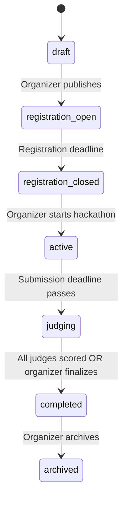
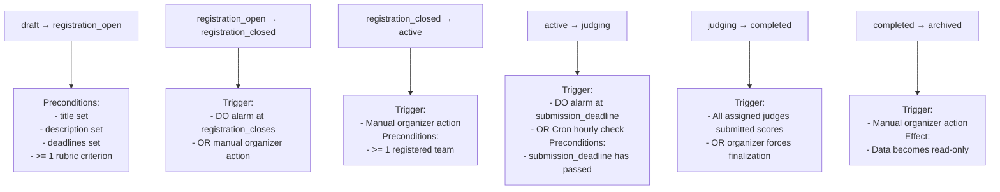
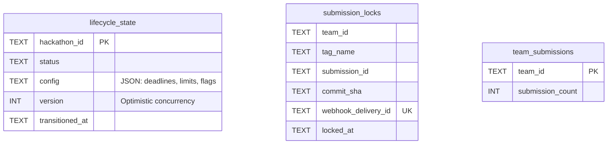
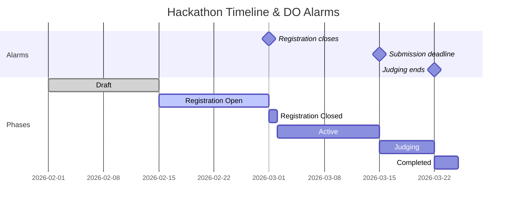
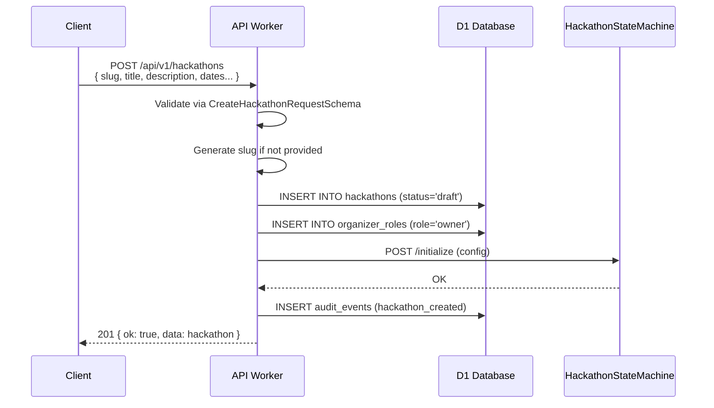
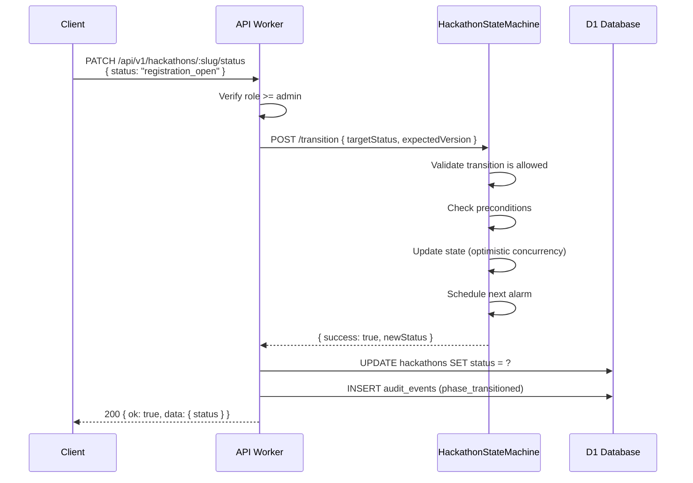
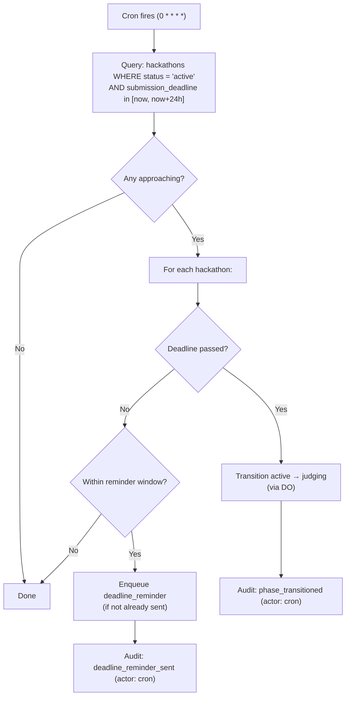
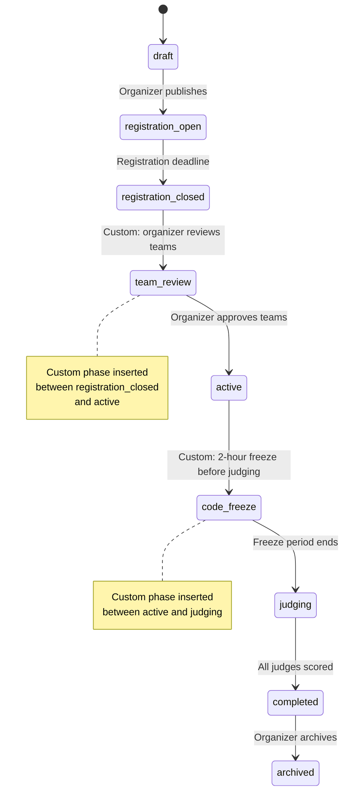

# 02 — Hackathon Lifecycle

> Every hackathon progresses through a 7-state forward-only state machine, enforced by a Durable Object with single-writer consistency. No backward transitions, no skipping states.

**Related docs:** [Submissions](./04-submissions.md) | [Judging](./05-judging.md) | [Infrastructure](./12-infrastructure.md)

---

## State Machine



**State notes:**

| State | Key Behavior |
|-------|-------------|
| `draft` | Requires: title, description, deadlines, at least 1 rubric criterion |
| `active` | Submissions accepted. Commits tracked. Force pushes flagged. |
| `judging` | Submissions locked. Judges score assignments. AI reviews generated. |

---

## States & Allowed Actions

| State | Description | Allowed Actions |
|-------|-------------|-----------------|
| `draft` | Initial creation. Not visible to public. | Edit config, set rubric, invite organizers, delete |
| `registration_open` | Participants can register teams and join. | Create/join teams. Organizer can edit non-critical fields |
| `registration_closed` | Registration ended. Teams are finalized. | No new teams. Organizer prepares for start |
| `active` | Hackathon is running. Submissions accepted. | Push code, submit via tag, connect repos |
| `judging` | Submission deadline passed. Judges score. | Score submissions, generate AI reviews |
| `completed` | All judging finished. Results visible. | View leaderboard, download results |
| `archived` | Read-only historical record. | View only. Data preserved indefinitely |

---

## Transition Rules



### Valid Transitions (Source of Truth)

```typescript
const HACKATHON_STATUS_TRANSITIONS = {
  draft:               ['registration_open'],
  registration_open:   ['registration_closed'],
  registration_closed: ['active'],
  active:              ['judging'],
  judging:             ['completed'],
  completed:           ['archived'],
  archived:            [],  // Terminal state
};
```

**Enforcement**: Attempting any transition not in this map returns `INVALID_TRANSITION` error. No backward transitions, no state skipping.

---

## Durable Object: HackathonStateMachine

One DO instance per hackathon, addressed by hackathon ID. This is the **single source of truth** for:

1. Current phase/status
2. Submission locking (exactly-once acceptance)
3. Deadline enforcement via alarms
4. Phase transition validation

### Internal State (SQLite-backed)



### DO HTTP Endpoints

| Method | Path | Purpose |
|--------|------|---------|
| POST | `/initialize` | Set initial config (deadlines, limits, tag pattern) |
| POST | `/transition` | Transition to target status (with optimistic concurrency `expectedVersion`) |
| GET | `/state` | Fetch current state |
| POST | `/accept-submission` | Lock a submission (exactly-once semantics) |
| GET | `/can-accept-submissions` | Check if submissions are currently accepted |

### Alarm Schedule

The DO uses Cloudflare's alarm API for deadline enforcement:



When an alarm fires:
1. Check which deadline passed
2. Auto-transition to the next state if preconditions met
3. Schedule the next upcoming alarm
4. Write transition audit event

### Optimistic Concurrency

State transitions use version-based optimistic concurrency:

```sql
UPDATE lifecycle_state
SET status = ?, version = version + 1, transitioned_at = ?
WHERE hackathon_id = ? AND version = ?
-- If rowsWritten = 0 → concurrent modification detected → retry
```

---

## CRUD Operations

### Create Hackathon



### Transition Phase



---

## Automated Transitions

### Cron Trigger (Hourly)



### DO Alarm (Precise)

The DO alarm fires at the exact deadline timestamp for immediate transitions. The hourly cron acts as a safety net in case the DO alarm fails.

---

## Hackathon Configuration

| Field | Type | Default | Description |
|-------|------|---------|-------------|
| `slug` | TEXT | auto-generated | URL-safe identifier |
| `title` | TEXT | required | Display name |
| `description` | TEXT | — | Markdown description |
| `rules_md` | TEXT | — | Competition rules (Markdown) |
| `registration_opens` | ISO-8601 | required | When registration starts |
| `registration_closes` | ISO-8601 | required | When registration ends |
| `submission_deadline` | ISO-8601 | required | Final submission cutoff |
| `judging_starts` | ISO-8601 | — | When judging opens |
| `judging_ends` | ISO-8601 | — | When judging closes |
| `min_team_size` | INT | 1 | Minimum members per team |
| `max_team_size` | INT | 5 | Maximum members per team |
| `max_teams` | INT | unlimited | Cap on total teams |
| `submission_tag_pattern` | TEXT | `submission_v%` | Git tag pattern for submissions |
| `max_submissions_per_team` | INT | unlimited | Submission version limit |
| `allow_late_submissions` | BOOL | false | Accept tags after deadline |
| `primary_color` | TEXT | `#6366f1` | Theme color |
| `logo_r2_key` | TEXT | — | R2 key for logo asset |
| `banner_r2_key` | TEXT | — | R2 key for banner asset |

---

## v3 Planned Enhancements

### Hackathon Templates

Allow organizers to clone configuration from a previous hackathon into a new one. A template captures the full hackathon configuration snapshot: rubric criteria, team size limits, submission tag pattern, phase durations, branding assets (R2 keys), and judge invite list. Templates are stored as JSON blobs in a `hackathon_templates` table. The `POST /api/v1/hackathons` endpoint accepts an optional `templateId` parameter that pre-fills all configuration fields, which the organizer can then override before publishing.

| Property | Value |
|----------|-------|
| Storage | `hackathon_templates` table in D1 (id, source_hackathon_id, name, config JSON, created_by, created_at) |
| Captured fields | Rubric, team limits, tag pattern, deadlines (as relative durations), branding R2 keys, judge user IDs |
| NOT captured | Teams, submissions, scores, audit events (event-specific data) |
| Creation | `POST /api/v1/hackathons/:slug/template` (admin+) |
| Usage | `POST /api/v1/hackathons { templateId: "..." }` |

### Recurring Hackathons

Support scheduled recurring events that auto-create new hackathon instances from a template. Organizers configure a recurrence rule (weekly, biweekly, monthly, or custom cron expression) on a template. A new cron handler checks the `recurring_schedules` table hourly and creates hackathon instances when the next occurrence is due. Each instance is created in `draft` status with dates offset according to the recurrence interval. The organizer receives a notification and can review before publishing.

| Field | Type | Description |
|-------|------|-------------|
| `template_id` | TEXT FK | Source template |
| `cron_expression` | TEXT | e.g., `0 0 1 * *` (monthly) |
| `next_run_at` | ISO-8601 | Next scheduled creation |
| `auto_publish` | BOOL | If true, skip draft and go straight to `registration_open` |
| `max_instances` | INT | Cap on total auto-created hackathons (null = unlimited) |
| `instances_created` | INT | Counter |

### Custom Phase Definitions

Allow organizers to insert custom phases between the standard lifecycle states. Custom phases are defined as named intervals with optional entry/exit conditions. They slot into the state machine between existing states without breaking the forward-only invariant. The DO validates that custom phases maintain a valid topological order. Each custom phase can have its own alarm deadline and webhook notification.



Custom phases are stored in a `custom_phases` table:

| Field | Type | Description |
|-------|------|-------------|
| `id` | TEXT PK | Phase identifier |
| `hackathon_id` | TEXT FK | Parent hackathon |
| `name` | TEXT | Display name (e.g., "Team Review") |
| `slug` | TEXT | URL-safe identifier |
| `after_phase` | TEXT | Standard phase this follows (e.g., `registration_closed`) |
| `before_phase` | TEXT | Standard phase this precedes (e.g., `active`) |
| `deadline` | ISO-8601 | Optional auto-transition deadline |
| `webhook_url` | TEXT | Optional external notification URL |

### Phase Webhooks

Notify external systems when a hackathon transitions between phases. Organizers configure webhook URLs per hackathon (or per phase) via `POST /api/v1/hackathons/:slug/webhooks`. On each phase transition, the Worker enqueues a `PHASE_WEBHOOK_QUEUE` message containing the hackathon ID, old phase, new phase, timestamp, and transition actor. The queue consumer delivers the payload with HMAC-SHA256 signature verification (using a per-webhook secret) and retries up to 3 times with exponential backoff.

| Property | Value |
|----------|-------|
| Payload | `{ hackathonId, slug, oldPhase, newPhase, transitionedAt, actor }` |
| Signature | `X-DevSage-Signature: sha256=<HMAC of body>` |
| Retries | 3 attempts, exponential backoff (1s, 5s, 25s) |
| Timeout | 10 seconds per delivery attempt |
| Storage | `phase_webhooks` table (id, hackathon_id, url, secret, phases_filter, active) |

### Hackathon Preview Mode

Allow organizers to experience the hackathon as a participant would, without affecting real data. Preview mode creates a sandboxed view where the organizer sees the registration flow, team creation, submission UI, and judging interface with synthetic data. The preview is implemented as a query parameter (`?preview=true`) that the frontend uses to render mock data from a dedicated preview API endpoint. No records are written to D1 during preview.

| Aspect | Behavior |
|--------|----------|
| Activation | Admin+ clicks "Preview as Participant" in dashboard |
| Data | Synthetic teams, submissions, and scores generated server-side |
| Persistence | None (stateless, generated per request) |
| Phases | Organizer can preview any phase regardless of current status |
| Restrictions | Preview flag is validated server-side; only admin+ can access |

### Multi-Track Hackathons

Support parallel tracks within a single hackathon (e.g., "AI Track", "Web3 Track", "Open Innovation Track"). Each track has its own rubric criteria, judge pool, and leaderboard, while sharing the same timeline, teams, and submission infrastructure. Teams select a track during registration. Judges are assigned per-track. The leaderboard page shows per-track rankings and an optional combined ranking.

| Property | Value |
|----------|-------|
| Storage | `hackathon_tracks` table (id, hackathon_id, name, slug, description, rubric_criteria IDs) |
| Team assignment | `teams.track_id` FK (nullable for single-track hackathons) |
| Judge assignment | `judge_assignments.track_id` FK |
| Leaderboard | Per-track + optional combined (weighted by track) |
| Backward compatibility | Single-track hackathons have zero rows in `hackathon_tracks` (no migration needed) |

### Planned Feature Summary

| Feature | Priority | Complexity | New Tables / Columns | Key Dependencies |
|---------|----------|------------|---------------------|------------------|
| Hackathon templates | High | Medium | `hackathon_templates` | Template JSON schema definition |
| Phase webhooks | High | Medium | `phase_webhooks` | PHASE_WEBHOOK_QUEUE, HMAC signing |
| Multi-track hackathons | High | High | `hackathon_tracks`, `teams.track_id` | Rubric per-track, leaderboard per-track |
| Custom phase definitions | Medium | High | `custom_phases` | DO state machine extension, topological validation |
| Recurring hackathons | Medium | Medium | `recurring_schedules` | Templates (prerequisite), cron handler |
| Preview mode | Low | Medium | None | Synthetic data generator, preview API endpoint |

---

## File References

| File | Purpose |
|------|---------|
| `apps/api/src/routes/hackathons.ts` | CRUD routes + phase transition endpoint |
| `apps/api/src/durable-objects/hackathon-state-machine.ts` | Core DO: state management, submission locking, alarms |
| `packages/shared/src/schemas/hackathon.ts` | Zod schemas for hackathon entity + requests |
| `packages/shared/src/schemas/constants.ts` | `HACKATHON_STATUS_TRANSITIONS` source of truth |
| `packages/db/src/schema/hackathons.ts` | Drizzle table definition |
| `apps/web/src/pages/hackathon-detail.tsx` | Frontend hackathon detail page |
| `apps/web/src/pages/dashboard.tsx` | Dashboard with hackathon list by status |
