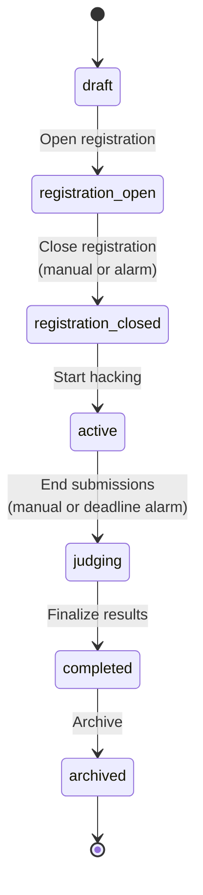
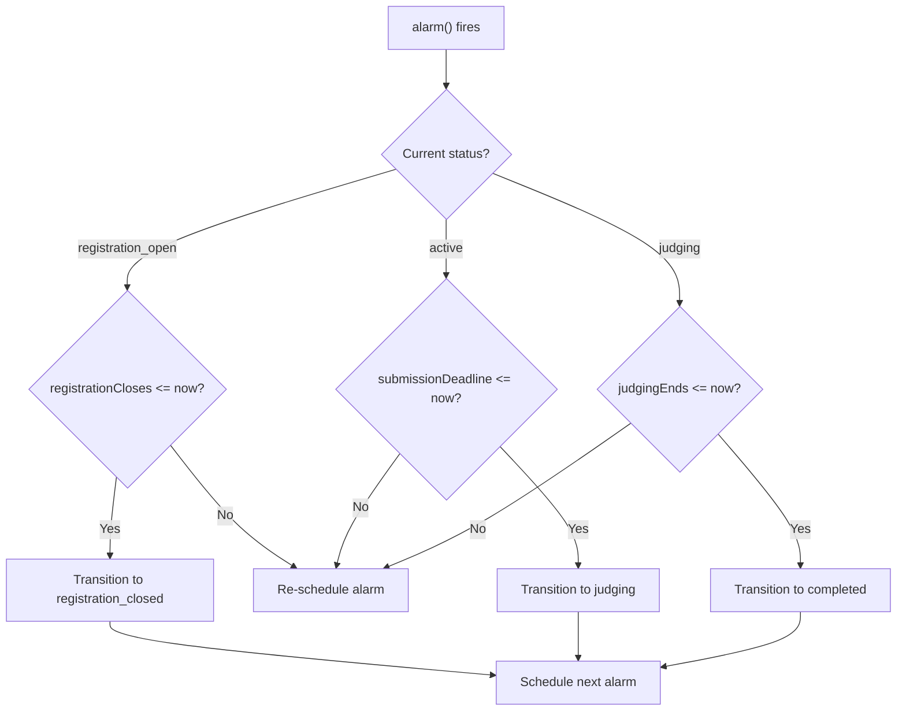
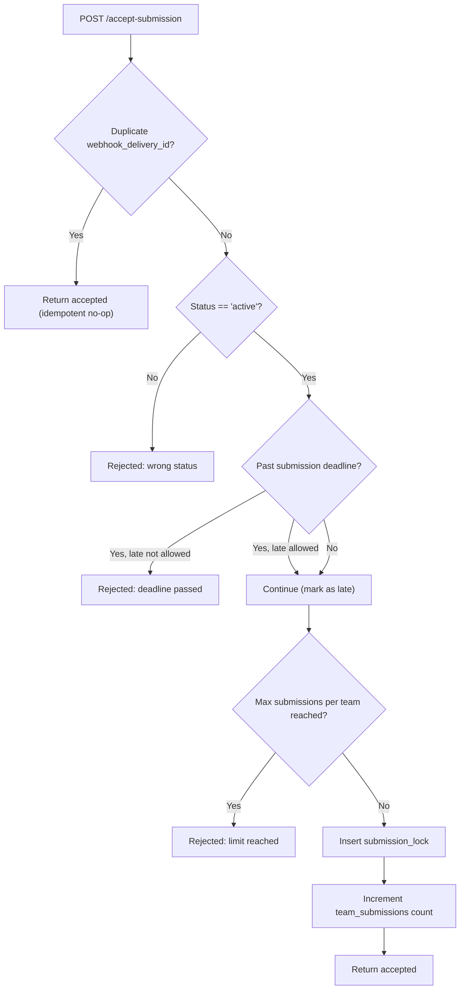

# 02 — Hackathon Lifecycle

> A hackathon moves through seven states from creation to archival. The CLI creates it, the admin configures it, the organizer manages it, participants hack in it, judges score it. A Durable Object enforces forward-only state transitions, submission locking, and deadline alarms -- no race conditions, no backward moves.

**Related docs:** [System Overview](./00-overview.md) | [Authentication](./01-authentication.md) | [Data Model](./03-data-model.md) | [CLI](./06-cli.md) | [Organizer Platform](./07-organizer-platform.md)

---

## Full Lifecycle

A hackathon's life spans five phases of ownership, from DevSage team creation through participant archival:

```
CLI Creation → Admin Configuration → Organizer Setup → Participant Experience → Archival
```

| Phase | Who | What Happens |
|-------|-----|-------------|
| **1. CLI Creation** | DevSage team | Runs `devsage create {slug}` -- copies template, deploys Worker, sets up DNS, creates DB record in `draft` state |
| **2. Admin Configuration** | DevSage team | Visits `admin.devsage.org` -- invites organizers, configures platform-level settings |
| **3. Organizer Setup** | Organizers | Visits `platform.devsage.org` -- sets dates, rubric, prizes, rules, invites judges, transitions to `registration_open` |
| **4. Participant Experience** | Participants + Judges | Register on `{slug}.devsage.org`, form teams, link repos, submit via git tags, judges score submissions |
| **5. Archival** | Organizers / DevSage team | Hackathon marked `completed` then `archived` -- read-only, no further mutations |

---

## State Machine

Seven states, forward-only. Defined in `packages/shared/src/schemas/constants.ts` as the single source of truth.



### Transition Rules

| From | To | Trigger | Notes |
|------|----|---------|-------|
| `draft` | `registration_open` | Manual (organizer) | Hackathon becomes visible for registration |
| `registration_open` | `registration_closed` | Manual or alarm | Alarm fires when `registrationCloses` date passes |
| `registration_closed` | `active` | Manual (organizer) | Submissions now accepted |
| `active` | `judging` | Manual or alarm | Alarm fires when `submissionDeadline` passes. Submissions locked |
| `judging` | `completed` | Manual or alarm | Alarm fires when `judgingEnds` passes (if set). Scores finalized |
| `completed` | `archived` | Manual (organizer) | Read-only. No further mutations |
| `archived` | _(none)_ | Terminal state | Cannot transition out |

### Constraints

- **Forward-only**: No backward transitions. Cannot go from `judging` back to `active`
- **No skipping**: Cannot jump from `draft` to `active`. Must pass through each intermediate state
- **Single next state**: Each state has exactly one valid successor (or none for `archived`)

```typescript
// packages/shared/src/schemas/constants.ts
export const HACKATHON_STATUS_TRANSITIONS: Record<HackathonStatus, HackathonStatus[]> = {
  draft: ['registration_open'],
  registration_open: ['registration_closed'],
  registration_closed: ['active'],
  active: ['judging'],
  judging: ['completed'],
  completed: ['archived'],
  archived: [],
};
```

---

## Durable Object: HackathonStateMachine

One Durable Object instance per hackathon, addressed by hackathon ID. The DO is the single writer for state transitions and submission locking -- no race conditions possible.

### Why a Durable Object?

| Problem | DO Solution |
|---------|-------------|
| Two organizers transition state simultaneously | Single-threaded execution -- one wins, one gets `VERSION_MISMATCH` |
| Two teams submit at the exact same millisecond | Submission locks are serialized inside the DO |
| Deadline passes while API is idle | DO alarms fire independently of incoming requests |
| Webhook retry delivers duplicate submission | `webhook_delivery_id` UNIQUE constraint in DO's SQLite |

### Internal SQLite Tables

The DO uses SQLite-backed storage (`new_sqlite_classes`) with three internal tables:

| Table | Purpose | Key Columns |
|-------|---------|-------------|
| `lifecycle_state` | Current hackathon state | `hackathon_id` PK, `status`, `config` (JSON), `version`, `transitioned_at` |
| `submission_locks` | Exactly-once submission tracking | `team_id`, `tag_name`, `submission_id`, `commit_sha`, `webhook_delivery_id` UNIQUE |
| `team_submissions` | Per-team submission count | `team_id` PK, `submission_count` |

> These are internal to the DO's SQLite, separate from the D1 database. The DO never touches D1 directly -- the Worker mediates all D1 writes.

### HTTP Endpoints

The Worker communicates with the DO via `stub.fetch()`:

| Method | Path | Purpose |
|--------|------|---------|
| `POST` | `/initialize` | Set up state machine with hackathon config |
| `POST` | `/transition` | Transition to a new state |
| `GET` | `/state` | Read current state, config, version |
| `POST` | `/accept-submission` | Lock a submission (exactly-once) |
| `GET` | `/can-accept-submissions` | Check if submissions are currently accepted |

### Optimistic Concurrency

State transitions use version-based optimistic concurrency:

```sql
UPDATE lifecycle_state
SET status = ?, version = version + 1, transitioned_at = ?
WHERE hackathon_id = ? AND version = ?
```

If `rowsWritten === 0`, the version has changed since the read -- the transition is rejected with `VERSION_MISMATCH`. Callers can optionally pass `expectedVersion` to detect conflicts.

---

## Deadline Alarms

The DO schedules alarms for upcoming deadlines. When an alarm fires, the DO checks if a transition should happen automatically.



### Alarm Scheduling Logic

After any state change, `scheduleNextAlarm()` finds the next relevant deadline:

| Current Status | Deadline Checked |
|---------------|-----------------|
| `registration_open` | `registrationCloses` |
| `registration_closed` | `submissionDeadline` |
| `active` | `submissionDeadline`, `judgingEnds` |
| `judging` | `judgingEnds` |

If no future deadline exists, the alarm is deleted. The DO also has a backup: the Worker's hourly cron trigger checks all hackathons for missed deadlines.

---

## Submission Locking

When a team pushes a git tag matching the hackathon's `submissionTagPattern`, the webhook pipeline eventually calls the DO's `/accept-submission` endpoint.

### Acceptance Flow



### Exactly-Once Guarantee

The `webhook_delivery_id` column has a UNIQUE constraint. If a webhook is retried (GitHub retries on timeout), the DO detects the duplicate and returns success without creating a second lock. This is the idempotency mechanism.

---

## Hackathon Configuration

The DO stores hackathon configuration as a JSON blob in the `config` column of `lifecycle_state`:

| Field | Type | Description |
|-------|------|-------------|
| `registrationOpens` | `string` (ISO-8601) | When registration opens |
| `registrationCloses` | `string` (ISO-8601) | When registration closes |
| `submissionDeadline` | `string` (ISO-8601) | Submission cutoff |
| `judgingStarts` | `string \| null` | When judging begins (optional) |
| `judgingEnds` | `string \| null` | When judging ends (optional, triggers auto-transition) |
| `maxTeams` | `number \| null` | Team cap (optional) |
| `maxSubmissionsPerTeam` | `number \| null` | Submission limit per team (optional) |
| `allowLateSubmissions` | `number` (0/1) | Whether to accept submissions after deadline |
| `submissionTagPattern` | `string` | Git tag pattern for submissions (default: `submission_v%`) |

---

## CLI Creation Flow

The `devsage create` command (implemented in `scripts/generate-hackathon-site.js`) automates the full creation pipeline:

```mermaid
flowchart LR
    A["devsage create hack2026<br/>--name 'Hack 2026'"] --> B["Copy templates/hackathon-site/<br/>to work directory"]
    B --> C["Write site.config.json<br/>(slug, title, colors, dates)"]
    C --> D["Write wrangler.jsonc<br/>(worker name, assets config)"]
    D --> E["pnpm install && pnpm build"]
    E --> F["git init + push to GitHub<br/>(SHIKDD-org/{slug}-site)"]
    F --> G["wrangler deploy"]
    G --> H["Set up custom domain<br/>{slug}.devsage.org"]
    H --> I["Create hackathon record<br/>in D1 (status: draft)"]
    I --> J["Initialize DO<br/>HackathonStateMachine"]
```



After CLI creation, the hackathon exists in `draft` state with:
- A deployed Worker serving the hackathon site at `{slug}.devsage.org`
- A GitHub repository at `SHIKDD-org/{slug}-site`
- A database record in the `hackathons` table
- An initialized Durable Object ready for state transitions

---

## Phase Details

### Draft

- Hackathon exists but is not visible to participants
- Organizers configure dates, rules, rubric, prizes via `platform.devsage.org`
- Admin can invite organizers via `admin.devsage.org`
- No registration, no submissions

### Registration Open

- Hackathon landing page is live at `{slug}.devsage.org`
- Users can register and create/join teams
- Team invite codes are active
- Auto-transitions to `registration_closed` when `registrationCloses` date passes

### Registration Closed

- No new team creation or joining
- Existing teams can still link repositories
- Organizers prepare for hacking phase

### Active

- Submissions are accepted via git tag pushes
- Commit tracking is active (push events logged)
- Force push detection is active
- Auto-transitions to `judging` when `submissionDeadline` passes

### Judging

- No new submissions accepted (unless `allowLateSubmissions` is enabled)
- Judges are assigned to submissions (round-robin)
- Judges score using rubric criteria
- Leaderboard is calculated
- Auto-transitions to `completed` when `judgingEnds` passes (if set)

### Completed

- All scores are finalized
- Leaderboard is public
- No further scoring changes
- Can be archived by organizer

### Archived

- Terminal state -- no transitions out
- Read-only access to all data
- Hackathon site remains accessible for historical reference

---

## Cron Trigger

A Worker cron trigger runs hourly (`0 * * * *`) as a backup for DO alarms. It checks all active hackathons for missed deadlines and triggers transitions if needed. This handles edge cases where a DO alarm might not fire (e.g., DO eviction).

---

## File References

| File | Purpose |
|------|---------|
| `apps/api/src/durable-objects/hackathon-state-machine.ts` | `HackathonStateMachine` DO class -- state transitions, submission locking, alarms |
| `packages/shared/src/schemas/constants.ts` | `HACKATHON_STATUS_TRANSITIONS` -- source of truth for valid transitions |
| `packages/shared/src/schemas/hackathon.ts` | `HackathonStatusEnum` Zod schema, `HackathonStatus` type |
| `packages/db/src/schema/hackathons.ts` | `hackathons` table -- `status` column with 7-state enum |
| `apps/api/src/routes/hackathons.ts` | `PATCH /api/v1/hackathons/:slug/status` -- transition endpoint |
| `apps/api/src/lib/constants.ts` | `DO_PATHS` -- well-known DO endpoint paths |
| `scripts/generate-hackathon-site.js` | CLI tool for hackathon creation and deployment |
| `templates/hackathon-site/` | Template project copied per hackathon |
