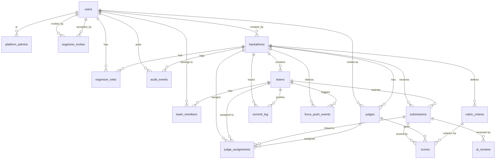
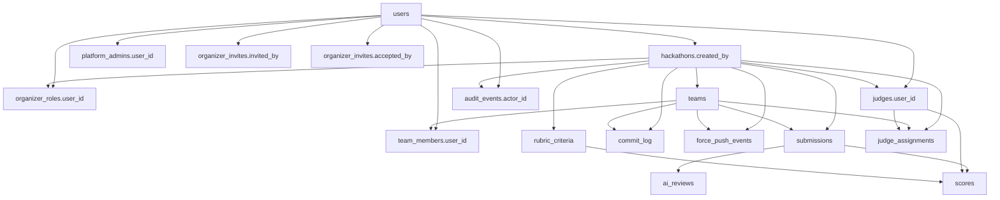

# 03 — Data Model & Schema

> 16 tables in Cloudflare D1 (SQLite) managed by Drizzle ORM. TEXT UUIDs for all primary keys, ISO-8601 TEXT timestamps, snake_case columns, INTEGER booleans. The schema covers users, hackathons, teams, submissions, judging, audit, and platform administration.

**Related docs:** [System Overview](./00-overview.md) | [Authentication](./01-authentication.md) | [Hackathon Lifecycle](./02-hackathon-lifecycle.md) | [Roles & Permissions](./10-roles-permissions.md)

---

## ER Diagram



---

## Table Reference

### users

User accounts. GitHub is the primary identity; Google can be linked as a secondary provider.

| Column | Type | Constraints | Description |
|--------|------|-------------|-------------|
| `id` | TEXT | PK | UUID (`crypto.randomUUID()`) |
| `github_id` | INTEGER | NOT NULL, UNIQUE | GitHub user ID |
| `google_id` | TEXT | UNIQUE | Google user ID (set when Google is linked) |
| `github_username` | TEXT | NOT NULL | GitHub login handle |
| `display_name` | TEXT | NOT NULL | Display name (from GitHub or Google) |
| `email` | TEXT | | Email address |
| `avatar_url` | TEXT | | Profile picture URL |
| `created_at` | TEXT | NOT NULL | ISO-8601 timestamp |
| `updated_at` | TEXT | NOT NULL | ISO-8601 timestamp |

**Schema file:** `packages/db/src/schema/users.ts`

---

### platform_admins

Platform-wide admin privileges. Separate from per-hackathon roles.

| Column | Type | Constraints | Description |
|--------|------|-------------|-------------|
| `id` | TEXT | PK | UUID |
| `user_id` | TEXT | NOT NULL, UNIQUE, FK `users.id` | The admin user |
| `created_at` | TEXT | NOT NULL | ISO-8601 timestamp |

**Schema file:** `packages/db/src/schema/platform-admins.ts`

---

### organizer_invites

Invitations for users to become organizers on the platform.

| Column | Type | Constraints | Description |
|--------|------|-------------|-------------|
| `id` | TEXT | PK | UUID |
| `email` | TEXT | NOT NULL | Invitee email address |
| `invite_code` | TEXT | NOT NULL, UNIQUE | Unique invite code |
| `status` | TEXT | NOT NULL, DEFAULT `'pending'` | `pending` \| `accepted` \| `expired` \| `revoked` |
| `invited_by` | TEXT | NOT NULL, FK `users.id` | User who sent the invite |
| `accepted_by` | TEXT | FK `users.id` | User who accepted (null until accepted) |
| `accepted_at` | TEXT | | ISO-8601 timestamp of acceptance |
| `expires_at` | TEXT | NOT NULL | ISO-8601 expiration timestamp |
| `created_at` | TEXT | NOT NULL | ISO-8601 timestamp |

**Schema file:** `packages/db/src/schema/organizer-invites.ts`

---

### hackathons

Core hackathon entity. One row per hackathon. Status tracks the 7-state lifecycle.

| Column | Type | Constraints | Description |
|--------|------|-------------|-------------|
| `id` | TEXT | PK | UUID |
| `slug` | TEXT | NOT NULL, UNIQUE | URL-safe identifier (e.g., `hack2026`) |
| `title` | TEXT | NOT NULL | Display title |
| `description` | TEXT | | Markdown description |
| `rules_md` | TEXT | | Rules in Markdown |
| `registration_opens` | TEXT | NOT NULL | ISO-8601 timestamp |
| `registration_closes` | TEXT | NOT NULL | ISO-8601 timestamp |
| `submission_deadline` | TEXT | NOT NULL | ISO-8601 timestamp |
| `judging_starts` | TEXT | | ISO-8601 timestamp (optional) |
| `judging_ends` | TEXT | | ISO-8601 timestamp (optional) |
| `min_team_size` | INTEGER | NOT NULL, DEFAULT `1` | Minimum members per team |
| `max_team_size` | INTEGER | NOT NULL, DEFAULT `5` | Maximum members per team |
| `max_teams` | INTEGER | | Team cap (null = unlimited) |
| `submission_tag_pattern` | TEXT | NOT NULL, DEFAULT `'submission_v%'` | Git tag pattern (`%` = version wildcard) |
| `max_submissions_per_team` | INTEGER | | Submission limit (null = unlimited) |
| `allow_late_submissions` | INTEGER | NOT NULL, DEFAULT `0` | 0 = reject late, 1 = accept late |
| `primary_color` | TEXT | DEFAULT `'#6366f1'` | Branding accent color |
| `logo_r2_key` | TEXT | | R2 object key for logo |
| `banner_r2_key` | TEXT | | R2 object key for banner |
| `custom_subdomain` | TEXT | | Custom subdomain override |
| `status` | TEXT | NOT NULL, DEFAULT `'draft'` | `draft` \| `registration_open` \| `registration_closed` \| `active` \| `judging` \| `completed` \| `archived` |
| `created_by` | TEXT | NOT NULL, FK `users.id` | Creator user |
| `created_at` | TEXT | NOT NULL | ISO-8601 timestamp |
| `updated_at` | TEXT | NOT NULL | ISO-8601 timestamp |

**Schema file:** `packages/db/src/schema/hackathons.ts`

---

### organizer_roles

Per-hackathon organizer roles. Maps users to hackathons with a role level.

| Column | Type | Constraints | Description |
|--------|------|-------------|-------------|
| `id` | TEXT | PK | UUID |
| `hackathon_id` | TEXT | NOT NULL, FK `hackathons.id` (CASCADE) | Target hackathon |
| `user_id` | TEXT | NOT NULL, FK `users.id` | Organizer user |
| `role` | TEXT | NOT NULL, DEFAULT `'admin'` | `owner` \| `admin` \| `moderator` |
| `created_at` | TEXT | NOT NULL | ISO-8601 timestamp |

**Unique constraint:** `(hackathon_id, user_id)`

**Schema file:** `packages/db/src/schema/organizer-roles.ts`

---

### teams

Teams within a hackathon. Each team has a unique invite code for joining.

| Column | Type | Constraints | Description |
|--------|------|-------------|-------------|
| `id` | TEXT | PK | UUID |
| `hackathon_id` | TEXT | NOT NULL, FK `hackathons.id` (CASCADE) | Parent hackathon |
| `name` | TEXT | NOT NULL | Team display name |
| `repo_full_name` | TEXT | | GitHub repo (e.g., `org/repo`) |
| `repo_url` | TEXT | | Full GitHub repo URL |
| `github_installation_id` | INTEGER | | GitHub App installation ID |
| `bot_active` | INTEGER | NOT NULL, DEFAULT `0` | Whether GitHub bot is active (0/1) |
| `invite_code` | TEXT | UNIQUE | Join code for team membership |
| `created_at` | TEXT | NOT NULL | ISO-8601 timestamp |

**Unique constraints:** `(hackathon_id, name)`, `(hackathon_id, repo_full_name)`

**Indexes:** `idx_teams_hackathon` on `(hackathon_id)`, `idx_teams_repo` on `(repo_full_name)`

**Schema file:** `packages/db/src/schema/teams.ts`

---

### team_members

Membership records linking users to teams.

| Column | Type | Constraints | Description |
|--------|------|-------------|-------------|
| `id` | TEXT | PK | UUID |
| `team_id` | TEXT | NOT NULL, FK `teams.id` (CASCADE) | Parent team |
| `user_id` | TEXT | NOT NULL, FK `users.id` | Member user |
| `role` | TEXT | NOT NULL, DEFAULT `'member'` | `leader` \| `member` |
| `joined_at` | TEXT | NOT NULL | ISO-8601 timestamp |

**Unique constraint:** `(team_id, user_id)`

**Indexes:** `idx_team_members_user` on `(user_id)`, `idx_team_members_team` on `(team_id)`

**Schema file:** `packages/db/src/schema/team-members.ts`

---

### submissions

Project submissions captured from git tag pushes.

| Column | Type | Constraints | Description |
|--------|------|-------------|-------------|
| `id` | TEXT | PK | UUID |
| `team_id` | TEXT | NOT NULL, FK `teams.id` (CASCADE) | Submitting team |
| `hackathon_id` | TEXT | NOT NULL, FK `hackathons.id` (CASCADE) | Parent hackathon |
| `tag_name` | TEXT | NOT NULL | Git tag (e.g., `submission_v1`) |
| `commit_sha` | TEXT | NOT NULL | Full commit SHA |
| `commit_message` | TEXT | | Commit message |
| `commit_author` | TEXT | | Git author username |
| `branch` | TEXT | DEFAULT `'main'` | Branch the tag points to |
| `submitted_at` | TEXT | NOT NULL | When the tag was pushed (from webhook) |
| `received_at` | TEXT | NOT NULL | When the API received the webhook |
| `is_late` | INTEGER | NOT NULL, DEFAULT `0` | 1 if submitted after deadline |
| `is_final` | INTEGER | NOT NULL, DEFAULT `0` | 1 if marked as final submission |
| `version` | INTEGER | NOT NULL | Submission version number |
| `status` | TEXT | NOT NULL, DEFAULT `'received'` | `received` \| `validated` \| `invalid` \| `locked` \| `under_review` \| `scored` \| `invalidated` |
| `validation_errors` | TEXT | | JSON array of validation error messages |
| `locked_at` | TEXT | | ISO-8601 timestamp when locked by DO |
| `webhook_delivery_id` | TEXT | UNIQUE | GitHub webhook delivery ID (idempotency key) |

**Unique constraint:** `(team_id, tag_name)`

**Indexes:** `idx_submissions_team` on `(team_id)`, `idx_submissions_hackathon` on `(hackathon_id)`, `idx_submissions_status` on `(hackathon_id, status)`, `idx_submissions_webhook` on `(webhook_delivery_id)`

**Schema file:** `packages/db/src/schema/submissions.ts`

---

### commit_log

Git push events tracked per team. Records individual commits from webhook payloads.

| Column | Type | Constraints | Description |
|--------|------|-------------|-------------|
| `id` | TEXT | PK | UUID |
| `team_id` | TEXT | NOT NULL, FK `teams.id` (CASCADE) | Pushing team |
| `hackathon_id` | TEXT | NOT NULL, FK `hackathons.id` (CASCADE) | Parent hackathon |
| `commit_sha` | TEXT | NOT NULL | Full commit SHA |
| `message` | TEXT | | Commit message |
| `author_username` | TEXT | | Git author |
| `branch` | TEXT | DEFAULT `'main'` | Branch pushed to |
| `pushed_at` | TEXT | NOT NULL | When the push occurred |
| `is_force_push` | INTEGER | NOT NULL, DEFAULT `0` | 1 if this was a force push |
| `commits_in_push` | INTEGER | DEFAULT `1` | Number of commits in the push event |
| `webhook_delivery_id` | TEXT | | GitHub webhook delivery ID |
| `created_at` | TEXT | NOT NULL | ISO-8601 timestamp |

**Indexes:** `idx_commit_log_team` on `(team_id, pushed_at)`, `idx_commit_log_hackathon` on `(hackathon_id, pushed_at)`

**Schema file:** `packages/db/src/schema/commit-log.ts`

---

### force_push_events

Detected force pushes that may indicate post-deadline tampering.

| Column | Type | Constraints | Description |
|--------|------|-------------|-------------|
| `id` | TEXT | PK | UUID |
| `team_id` | TEXT | NOT NULL, FK `teams.id` (CASCADE) | Team that force-pushed |
| `hackathon_id` | TEXT | NOT NULL, FK `hackathons.id` (CASCADE) | Parent hackathon |
| `before_sha` | TEXT | NOT NULL | SHA before force push |
| `after_sha` | TEXT | NOT NULL | SHA after force push |
| `branch` | TEXT | NOT NULL | Affected branch |
| `commits_lost_shas` | TEXT | | JSON array of lost commit SHAs |
| `commits_lost_count` | INTEGER | DEFAULT `0` | Number of commits lost |
| `detected_at` | TEXT | NOT NULL | ISO-8601 timestamp |
| `notified_organizer` | INTEGER | NOT NULL, DEFAULT `0` | 1 if organizer was notified |
| `action_taken` | TEXT | DEFAULT `'logged'` | `logged` \| `warned` \| `flagged` |
| `submissions_invalidated` | TEXT | | JSON array of invalidated submission IDs |
| `webhook_delivery_id` | TEXT | | GitHub webhook delivery ID |

**Indexes:** `idx_force_push_team` on `(team_id)`

**Schema file:** `packages/db/src/schema/force-push-events.ts`

---

### judges

Judge invitations per hackathon. A user becomes a judge by accepting an invite.

| Column | Type | Constraints | Description |
|--------|------|-------------|-------------|
| `id` | TEXT | PK | UUID |
| `hackathon_id` | TEXT | NOT NULL, FK `hackathons.id` (CASCADE) | Target hackathon |
| `user_id` | TEXT | NOT NULL, FK `users.id` | Invited user |
| `invite_status` | TEXT | NOT NULL, DEFAULT `'pending'` | `pending` \| `accepted` \| `declined` |
| `invited_at` | TEXT | NOT NULL | ISO-8601 timestamp |
| `accepted_at` | TEXT | | ISO-8601 timestamp of acceptance |

**Unique constraint:** `(hackathon_id, user_id)`

**Schema file:** `packages/db/src/schema/judges.ts`

---

### rubric_criteria

Scoring criteria for a hackathon's judging rubric.

| Column | Type | Constraints | Description |
|--------|------|-------------|-------------|
| `id` | TEXT | PK | UUID |
| `hackathon_id` | TEXT | NOT NULL, FK `hackathons.id` (CASCADE) | Parent hackathon |
| `name` | TEXT | NOT NULL | Criterion name (e.g., "Innovation") |
| `description` | TEXT | | What this criterion measures |
| `max_score` | INTEGER | NOT NULL, DEFAULT `10` | Maximum score value |
| `weight` | REAL | NOT NULL, DEFAULT `1.0` | Weight multiplier for scoring |
| `sort_order` | INTEGER | NOT NULL, DEFAULT `0` | Display order |

**Unique constraint:** `(hackathon_id, name)`

**Schema file:** `packages/db/src/schema/rubric-criteria.ts`

---

### judge_assignments

Maps judges to teams/submissions for scoring. Created via round-robin assignment.

| Column | Type | Constraints | Description |
|--------|------|-------------|-------------|
| `id` | TEXT | PK | UUID |
| `judge_id` | TEXT | NOT NULL, FK `judges.id` (CASCADE) | Assigned judge |
| `team_id` | TEXT | NOT NULL, FK `teams.id` (CASCADE) | Assigned team |
| `hackathon_id` | TEXT | NOT NULL, FK `hackathons.id` (CASCADE) | Parent hackathon |
| `submission_id` | TEXT | FK `submissions.id` | Linked submission (may be null initially) |
| `status` | TEXT | NOT NULL, DEFAULT `'pending'` | `pending` \| `in_progress` \| `completed` |
| `assigned_at` | TEXT | NOT NULL | ISO-8601 timestamp |

**Unique constraint:** `(judge_id, team_id)`

**Indexes:** `idx_judge_assignments_judge` on `(judge_id)`, `idx_judge_assignments_hackathon` on `(hackathon_id)`

**Schema file:** `packages/db/src/schema/judge-assignments.ts`

---

### scores

Individual scores given by judges per rubric criterion per submission.

| Column | Type | Constraints | Description |
|--------|------|-------------|-------------|
| `id` | TEXT | PK | UUID |
| `submission_id` | TEXT | NOT NULL, FK `submissions.id` | Scored submission |
| `judge_id` | TEXT | NOT NULL, FK `judges.id` | Scoring judge |
| `criteria_id` | TEXT | NOT NULL, FK `rubric_criteria.id` | Rubric criterion |
| `score` | INTEGER | NOT NULL | Score value (0 to `max_score`) |
| `comment` | TEXT | | Judge's comment for this criterion |
| `scored_at` | TEXT | NOT NULL | ISO-8601 timestamp |

**Unique constraint:** `(submission_id, judge_id, criteria_id)` -- one score per judge per criterion per submission

**Indexes:** `idx_scores_submission` on `(submission_id)`, `idx_scores_judge` on `(judge_id)`

**Schema file:** `packages/db/src/schema/scores.ts`

---

### ai_reviews

AI-generated code reviews for submissions.

| Column | Type | Constraints | Description |
|--------|------|-------------|-------------|
| `id` | TEXT | PK | UUID |
| `submission_id` | TEXT | NOT NULL, FK `submissions.id` | Reviewed submission |
| `commit_sha` | TEXT | NOT NULL | Commit SHA that was reviewed |
| `provider` | TEXT | NOT NULL | AI provider name |
| `model` | TEXT | NOT NULL | Model identifier |
| `prompt_hash` | TEXT | NOT NULL | Hash of the prompt used |
| `summary` | TEXT | | Review summary |
| `strengths` | TEXT | | Identified strengths (JSON or text) |
| `concerns` | TEXT | | Identified concerns (JSON or text) |
| `raw_response` | TEXT | | Full AI response |
| `tokens_used` | INTEGER | | Token count |
| `created_at` | TEXT | NOT NULL | ISO-8601 timestamp |

**Schema file:** `packages/db/src/schema/ai-reviews.ts`

---

### audit_events

Append-only audit log for all state-changing operations.

| Column | Type | Constraints | Description |
|--------|------|-------------|-------------|
| `id` | TEXT | PK | UUID |
| `hackathon_id` | TEXT | FK `hackathons.id` | Scoped hackathon (null for platform-wide events) |
| `actor_id` | TEXT | FK `users.id` | Who performed the action (null for system/cron) |
| `actor_type` | TEXT | NOT NULL | `user` \| `system` \| `bot` \| `cron` |
| `action` | TEXT | NOT NULL | Action name (e.g., `hackathon.created`, `submission.locked`) |
| `entity_type` | TEXT | NOT NULL | Entity type (e.g., `hackathon`, `team`, `submission`) |
| `entity_id` | TEXT | NOT NULL | Entity UUID |
| `details` | TEXT | | JSON blob with additional context |
| `ip_address` | TEXT | | Client IP address |
| `created_at` | TEXT | NOT NULL | ISO-8601 timestamp |

**Indexes:** `idx_audit_hackathon` on `(hackathon_id, created_at)`, `idx_audit_entity` on `(entity_type, entity_id)`

**Schema file:** `packages/db/src/schema/audit-events.ts`

---

## Table Count Summary

| # | Table | Rows Per Hackathon (est.) | Purpose |
|---|-------|--------------------------|---------|
| 1 | `users` | Global (~500 total) | User accounts |
| 2 | `platform_admins` | Global (~5 total) | Platform-wide admins |
| 3 | `organizer_invites` | Global (~20 total) | Organizer invitations |
| 4 | `hackathons` | 1 | Hackathon configuration |
| 5 | `organizer_roles` | ~5 | Per-hackathon organizer assignments |
| 6 | `teams` | ~50 | Teams |
| 7 | `team_members` | ~150 | Team membership |
| 8 | `submissions` | ~150 | Git tag submissions |
| 9 | `commit_log` | ~2,000 | Push event tracking |
| 10 | `force_push_events` | ~5 | Force push detection |
| 11 | `judges` | ~10 | Judge invitations |
| 12 | `rubric_criteria` | ~5 | Scoring rubric |
| 13 | `judge_assignments` | ~150 | Judge-to-team mapping |
| 14 | `scores` | ~750 | Individual scores |
| 15 | `ai_reviews` | ~150 | AI code reviews |
| 16 | `audit_events` | ~5,000 | Audit trail |

**Total estimated rows per hackathon:** ~8,500
**Total estimated rows for 20 hackathons:** ~170,000

---

## Indexes

All indexes defined in the schema:

| Index | Table | Columns | Purpose |
|-------|-------|---------|---------|
| `idx_teams_hackathon` | `teams` | `hackathon_id` | List teams by hackathon |
| `idx_teams_repo` | `teams` | `repo_full_name` | Lookup team by GitHub repo (webhook routing) |
| `idx_team_members_user` | `team_members` | `user_id` | Find all teams a user belongs to |
| `idx_team_members_team` | `team_members` | `team_id` | List members of a team |
| `idx_submissions_team` | `submissions` | `team_id` | List submissions by team |
| `idx_submissions_hackathon` | `submissions` | `hackathon_id` | List submissions by hackathon |
| `idx_submissions_status` | `submissions` | `hackathon_id, status` | Filter submissions by status |
| `idx_submissions_webhook` | `submissions` | `webhook_delivery_id` | Idempotency check on webhook processing |
| `idx_commit_log_team` | `commit_log` | `team_id, pushed_at` | Team activity timeline |
| `idx_commit_log_hackathon` | `commit_log` | `hackathon_id, pushed_at` | Hackathon activity timeline |
| `idx_force_push_team` | `force_push_events` | `team_id` | Force push history per team |
| `idx_judge_assignments_judge` | `judge_assignments` | `judge_id` | Assignments for a judge |
| `idx_judge_assignments_hackathon` | `judge_assignments` | `hackathon_id` | All assignments in a hackathon |
| `idx_scores_submission` | `scores` | `submission_id` | All scores for a submission |
| `idx_scores_judge` | `scores` | `judge_id` | All scores by a judge |
| `idx_audit_hackathon` | `audit_events` | `hackathon_id, created_at` | Audit log by hackathon (chronological) |
| `idx_audit_entity` | `audit_events` | `entity_type, entity_id` | Audit log by entity |

---

## Unique Constraints

| Table | Columns | Purpose |
|-------|---------|---------|
| `users` | `github_id` | One account per GitHub user |
| `users` | `google_id` | One Google link per account |
| `platform_admins` | `user_id` | One admin record per user |
| `organizer_invites` | `invite_code` | Unique invite codes |
| `hackathons` | `slug` | Unique URL slugs |
| `organizer_roles` | `hackathon_id, user_id` | One role per user per hackathon |
| `teams` | `hackathon_id, name` | Unique team names within a hackathon |
| `teams` | `hackathon_id, repo_full_name` | One repo per team per hackathon |
| `teams` | `invite_code` | Unique join codes |
| `team_members` | `team_id, user_id` | One membership per user per team |
| `submissions` | `team_id, tag_name` | One submission per tag per team |
| `submissions` | `webhook_delivery_id` | Idempotent webhook processing |
| `judges` | `hackathon_id, user_id` | One judge invite per user per hackathon |
| `rubric_criteria` | `hackathon_id, name` | Unique criterion names per hackathon |
| `judge_assignments` | `judge_id, team_id` | One assignment per judge per team |
| `scores` | `submission_id, judge_id, criteria_id` | One score per judge per criterion per submission |

---

## Foreign Key Relationships



### CASCADE Deletes

These foreign keys use `ON DELETE CASCADE`:

| Parent Table | Child Table | Effect |
|-------------|-------------|--------|
| `hackathons` | `organizer_roles` | Deleting a hackathon removes its organizer roles |
| `hackathons` | `teams` | Deleting a hackathon removes its teams |
| `hackathons` | `submissions` | Deleting a hackathon removes its submissions |
| `hackathons` | `commit_log` | Deleting a hackathon removes its commit log |
| `hackathons` | `force_push_events` | Deleting a hackathon removes its force push events |
| `hackathons` | `judges` | Deleting a hackathon removes its judge invites |
| `hackathons` | `rubric_criteria` | Deleting a hackathon removes its rubric |
| `hackathons` | `judge_assignments` | Deleting a hackathon removes its assignments |
| `teams` | `team_members` | Deleting a team removes its members |
| `teams` | `submissions` | Deleting a team removes its submissions |
| `teams` | `commit_log` | Deleting a team removes its commit log |
| `teams` | `force_push_events` | Deleting a team removes its force push events |
| `teams` | `judge_assignments` | Deleting a team removes its assignments |
| `judges` | `judge_assignments` | Deleting a judge removes their assignments |

---

## Conventions

| Convention | Rule | Example |
|------------|------|---------|
| **Primary keys** | TEXT column storing UUID | `crypto.randomUUID()` |
| **Timestamps** | TEXT column, UTC ISO-8601 | `new Date().toISOString()` → `"2026-03-15T00:00:00.000Z"` |
| **Column naming** | snake_case in SQL | `created_at`, `hackathon_id`, `invite_status` |
| **Booleans** | INTEGER (0 = false, 1 = true) | `is_late`, `bot_active`, `allow_late_submissions` |
| **Enums** | TEXT with Drizzle `enum` constraint | `status: text('status', { enum: ['draft', ...] })` |
| **Foreign keys** | TEXT column referencing parent PK | `team_id: text('team_id').references(() => teams.id)` |
| **JSON blobs** | TEXT column with JSON string | `details`, `validation_errors`, `commits_lost_shas` |
| **Weights/decimals** | REAL type | `weight: real('weight').default(1.0)` |
| **Optional fields** | Nullable (no `.notNull()`) | `description`, `judging_starts`, `max_teams` |

---

## Storage Estimates

Based on 20 concurrent hackathons with ~50 teams each:

| Table | Rows | Avg Row Size | Total |
|-------|------|-------------|-------|
| `users` | 5,000 | ~300 B | ~1.5 MB |
| `platform_admins` | 5 | ~100 B | <1 KB |
| `organizer_invites` | 50 | ~250 B | ~12 KB |
| `hackathons` | 20 | ~800 B | ~16 KB |
| `organizer_roles` | 100 | ~150 B | ~15 KB |
| `teams` | 1,000 | ~250 B | ~250 KB |
| `team_members` | 3,000 | ~150 B | ~450 KB |
| `submissions` | 3,000 | ~400 B | ~1.2 MB |
| `commit_log` | 40,000 | ~300 B | ~12 MB |
| `force_push_events` | 100 | ~400 B | ~40 KB |
| `judges` | 200 | ~150 B | ~30 KB |
| `rubric_criteria` | 100 | ~200 B | ~20 KB |
| `judge_assignments` | 3,000 | ~200 B | ~600 KB |
| `scores` | 15,000 | ~200 B | ~3 MB |
| `ai_reviews` | 3,000 | ~2 KB | ~6 MB |
| `audit_events` | 100,000 | ~400 B | ~40 MB |
| **Total** | **~173,000** | | **~65 MB** |

Well within D1's 10 GB database size limit. The largest table by row count is `audit_events`; the largest by size is also `audit_events` due to the `details` JSON column.

---

## Migrations

Migrations are generated by Drizzle Kit and stored in `packages/db/migrations/`. The API Worker's `wrangler.jsonc` references them via a relative path:

```jsonc
{
  "d1_databases": [{
    "migrations_dir": "../../packages/db/migrations"
  }]
}
```

### Generating Migrations

```bash
# From packages/db/
pnpm generate    # runs drizzle-kit generate
```

### Applying Migrations

Migrations are applied automatically by Wrangler on deploy, or manually:

```bash
# From apps/api/
wrangler d1 migrations apply devsage-db
```

---

## Durable Object Storage (Separate from D1)

The `HackathonStateMachine` Durable Object has its own SQLite database, separate from D1. See [02-hackathon-lifecycle.md](./02-hackathon-lifecycle.md) for its internal tables (`lifecycle_state`, `submission_locks`, `team_submissions`).

---

## File References

| File | Purpose |
|------|---------|
| `packages/db/src/schema/index.ts` | Barrel export of all 16 tables |
| `packages/db/src/schema/users.ts` | `users` table definition |
| `packages/db/src/schema/platform-admins.ts` | `platform_admins` table definition |
| `packages/db/src/schema/organizer-invites.ts` | `organizer_invites` table definition |
| `packages/db/src/schema/hackathons.ts` | `hackathons` table definition |
| `packages/db/src/schema/organizer-roles.ts` | `organizer_roles` table definition |
| `packages/db/src/schema/teams.ts` | `teams` table definition |
| `packages/db/src/schema/team-members.ts` | `team_members` table definition |
| `packages/db/src/schema/submissions.ts` | `submissions` table definition |
| `packages/db/src/schema/commit-log.ts` | `commit_log` table definition |
| `packages/db/src/schema/force-push-events.ts` | `force_push_events` table definition |
| `packages/db/src/schema/judges.ts` | `judges` table definition |
| `packages/db/src/schema/rubric-criteria.ts` | `rubric_criteria` table definition |
| `packages/db/src/schema/judge-assignments.ts` | `judge_assignments` table definition |
| `packages/db/src/schema/scores.ts` | `scores` table definition |
| `packages/db/src/schema/ai-reviews.ts` | `ai_reviews` table definition |
| `packages/db/src/schema/audit-events.ts` | `audit_events` table definition |
| `packages/db/src/client.ts` | `createDbClient()` factory |
| `packages/db/drizzle.config.ts` | Drizzle Kit configuration |
