# 03 — Team Management

> Participants register teams during the registration phase, join via invite codes, link GitHub repos, and manage membership. Team size is enforced by hackathon configuration.

**Related docs:** [Hackathon Lifecycle](./02-hackathon-lifecycle.md) | [Submissions](./04-submissions.md) | [Roles & Permissions](./06-roles-permissions.md)

---

## Team Lifecycle

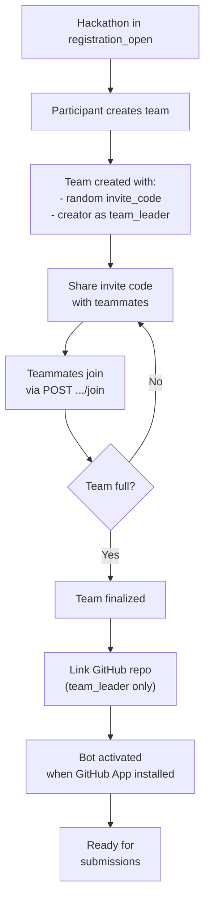

---

## Core Operations

### Create Team

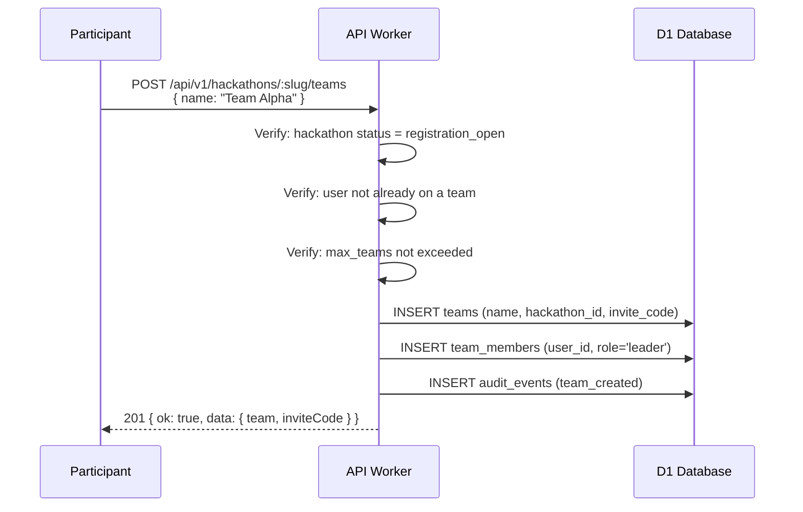

**Constraints:**
- Team name must be 2-50 characters, unique per hackathon
- User can only be on one team per hackathon
- `max_teams` limit checked before creation
- Invite code: 8-character random alphanumeric string

### Join Team

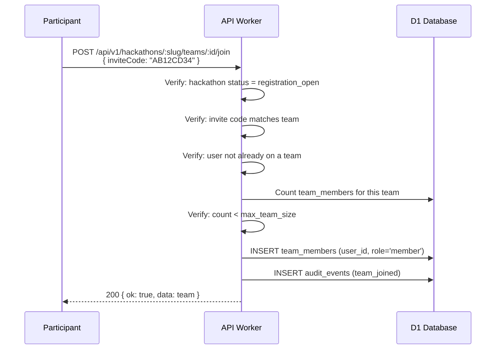

### Connect GitHub Repo

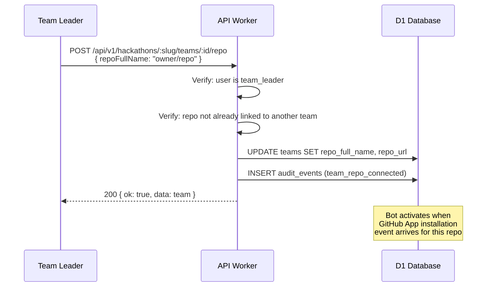

### Remove Member

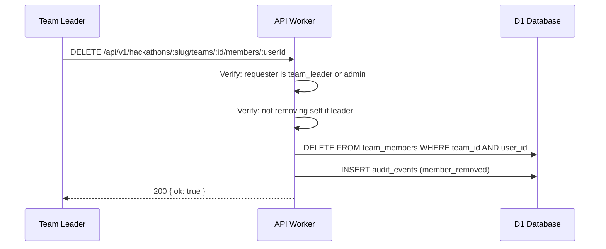

---

## Data Model

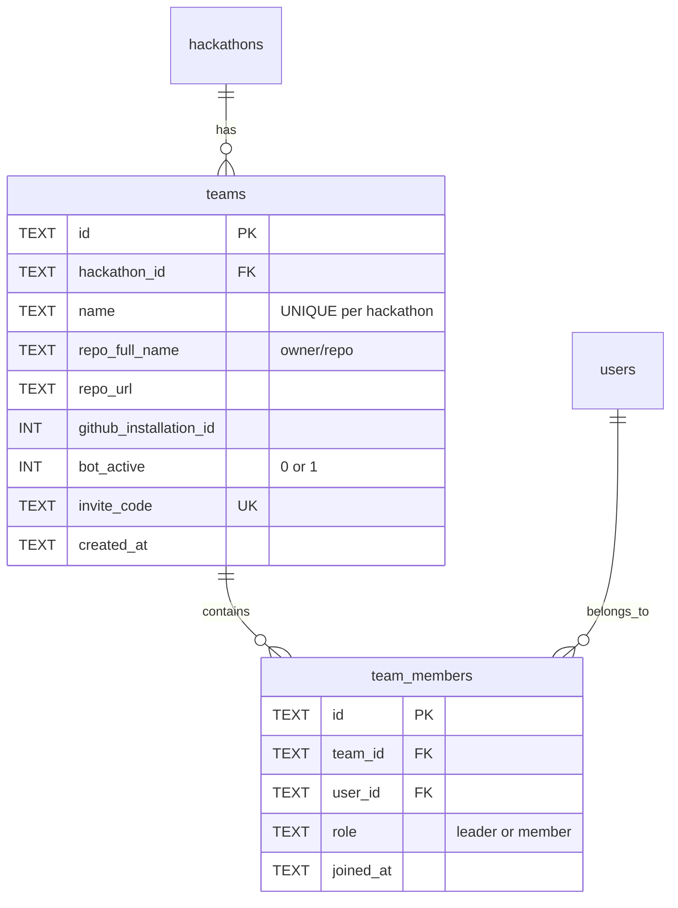

### Constraints

| Constraint | Columns | Purpose |
|------------|---------|---------|
| `UNIQUE(hackathon_id, name)` | teams | No duplicate team names per hackathon |
| `UNIQUE(hackathon_id, repo_full_name)` | teams | One repo per hackathon |
| `UNIQUE(invite_code)` | teams | Global invite code uniqueness |
| `UNIQUE(team_id, user_id)` | team_members | User can't join same team twice |

---

## Invite Code System

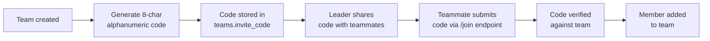

- Length: 8 characters (configurable via `JOIN_CODE_LENGTH`)
- Character set: alphanumeric
- Globally unique across all teams
- No expiration (valid until hackathon leaves registration phase)

---

## Bot Activation Flow

When a team links a GitHub repo, the bot becomes active only after the GitHub App is installed:

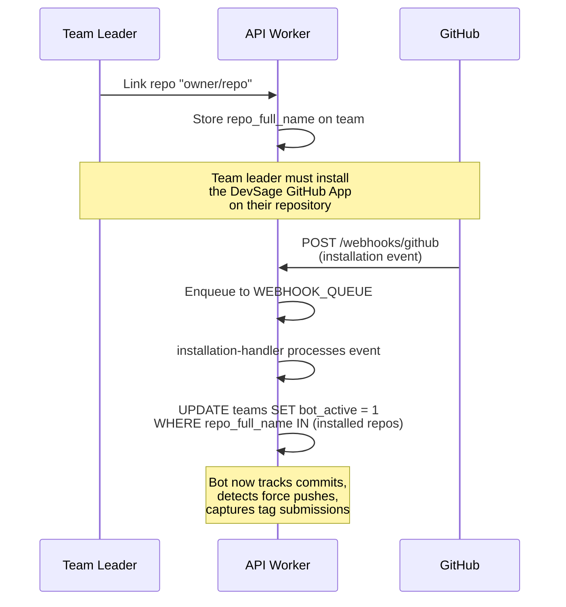

---

## Team Member Roles

| Role | Permissions |
|------|-------------|
| `leader` | Create team, link repo, remove members, finalize submission |
| `member` | View team, push code, create tags |

The `leader` role maps to `team_leader` in the hackathon role hierarchy. The `member` role maps to `participant`.

---

## Validation Rules

| Rule | Enforcement |
|------|-------------|
| Team creation only during `registration_open` | Checked in route handler |
| Team join only during `registration_open` | Checked in route handler |
| User can only be on one team per hackathon | Checked via DB query before insert |
| Team name 2-50 chars | Zod schema validation |
| Team name unique per hackathon | DB UNIQUE constraint |
| Team size ≤ `max_team_size` | Count check before join |
| Repo not already linked to another team | DB UNIQUE constraint on `(hackathon_id, repo_full_name)` |
| Solo participation allowed | `min_team_size` defaults to 1 (team of one) |

---

## v3 Planned Enhancements

### Team Discovery

Add a public team listing during the `registration_open` phase so participants without a team can find one. Teams opt in to discovery by setting a `looking_for_members` flag. The listing shows team name, current size, available slots, and an optional description of what the team is building. Participants browse the listing and request to join; the team leader approves or rejects the request. This replaces the invite-code-only model with a complementary discovery channel (invite codes remain functional).

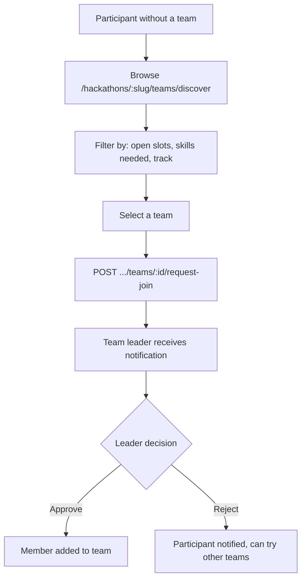

| Field | Table | Description |
|-------|-------|-------------|
| `looking_for_members` | `teams` | Boolean flag, default false |
| `discovery_description` | `teams` | Optional text (max 280 chars) describing what the team needs |
| `skills_needed` | `teams` | JSON array of skill tags (e.g., `["backend", "ML", "design"]`) |

### Skill-Based Matching

Build a recommendation engine that suggests teams to participants and participants to teams based on skill profiles. Participants list their skills during registration (free-form tags normalized to a controlled vocabulary). Teams list the skills they need. The matching algorithm computes a compatibility score based on skill overlap, team size gaps, and optionally track preference. Results are surfaced on the discovery page as "Recommended for you" and in the team dashboard as "Recommended participants."

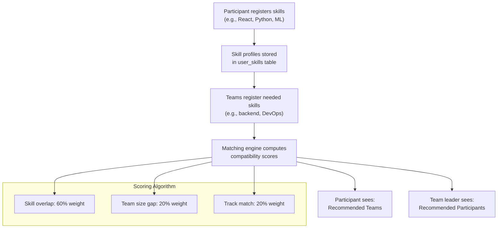

| Property | Value |
|----------|-------|
| Skill storage | `user_skills` table (user_id, skill_tag, proficiency_level) |
| Team needs | `team_skill_needs` table (team_id, skill_tag, priority) |
| Vocabulary | Controlled list in `skill_tags` table (tag, category, aliases) |
| Algorithm | Weighted Jaccard similarity with size and track bonuses |
| Computation | On-demand per request (D1 query, no background job needed for <1000 participants) |
| Cache | KV cache with 5-minute TTL per hackathon for recommendation results |

### Team Chat Integration

Embed a lightweight real-time chat within each team's dashboard using a Durable Object per team. The DO maintains a WebSocket connection per connected team member, stores the last 500 messages in its SQLite state, and broadcasts new messages to all connected clients. Messages are plain text with optional markdown rendering on the frontend. No external chat service dependency.

| Property | Value |
|----------|-------|
| Transport | WebSocket via Durable Object (one DO per team) |
| Message storage | DO SQLite state (last 500 messages, older messages archived to D1) |
| Message format | `{ senderId, senderName, content, timestamp }` |
| Max message length | 2000 characters |
| Features | Text messages, @mentions (notify via push), message history on reconnect |
| Authentication | WebSocket upgrade requires valid JWT; DO validates team membership |
| Scaling | One DO per team; each DO handles up to `max_team_size` concurrent connections |

### Cross-Hackathon Team Profiles

Allow teams to persist their identity across multiple hackathons. A `team_profiles` table stores a team's display name, avatar (R2 key), bio, and member roster as a persistent entity independent of any single hackathon. When creating a team for a new hackathon, the leader can link it to an existing team profile, pre-filling the name and auto-inviting previous members. The profile page shows the team's hackathon history, past submissions, and aggregate scores.

| Field | Type | Description |
|-------|------|-------------|
| `id` | TEXT PK | Persistent team profile ID |
| `name` | TEXT | Display name |
| `avatar_r2_key` | TEXT | R2 key for team avatar |
| `bio` | TEXT | Team description (max 500 chars) |
| `created_by` | TEXT FK | Original team creator |
| `created_at` | ISO-8601 | Profile creation date |

Linking: `teams.profile_id` FK (nullable) references `team_profiles.id`.

### Team Size Flexibility (Mid-Hackathon Merges)

Allow small teams to merge during the `active` phase with admin approval. When two teams both have fewer members than `min_team_size` (or a configurable merge threshold), either team leader can propose a merge. The other leader must accept. An admin then approves the merge, which transfers all members of the smaller team into the larger one, reassigns submissions, and archives the dissolved team. The merge is recorded as an audit event with full before/after state.

| Step | Actor | Action |
|------|-------|--------|
| 1 | Team Leader A | `POST .../teams/:idA/propose-merge { targetTeamId: idB }` |
| 2 | Team Leader B | `POST .../teams/:idA/merge-requests/:reqId/accept` |
| 3 | Admin | `POST .../teams/:idA/merge-requests/:reqId/approve` |
| 4 | System | Transfer members, reassign submissions, archive team B |

Constraints:
- Both teams must be below the merge threshold (default: `min_team_size`)
- Merged team must not exceed `max_team_size`
- Only allowed during `active` phase
- All submissions from the dissolved team are re-linked to the surviving team

### GitHub Org-Based Team Auto-Formation

Allow teams to form automatically based on GitHub organization membership. During registration, if a participant belongs to a GitHub org that is registered with the hackathon, they are auto-assigned to the corresponding team. The organizer registers GitHub org names via `POST /api/v1/hackathons/:slug/github-orgs`. When a participant with a matching org signs up, the system checks their GitHub org membership via the GitHub API (using the participant's OAuth token) and either creates the team (if it does not exist) or adds them to it.

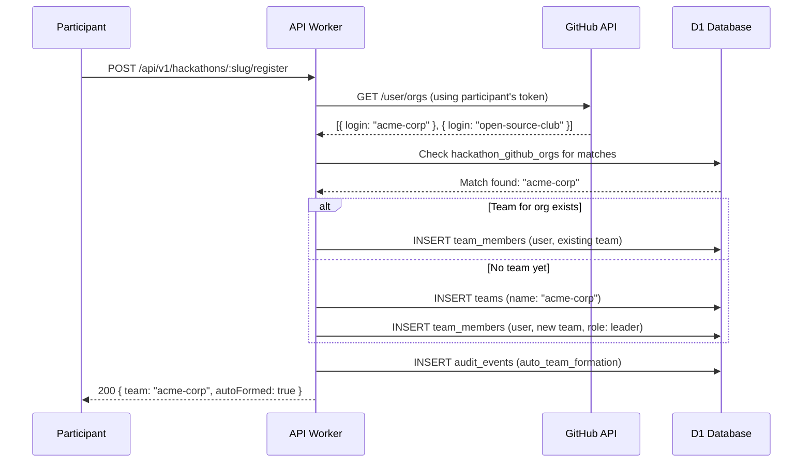

### Planned Feature Summary

| Feature | Priority | Complexity | New Tables / Columns | Key Dependencies |
|---------|----------|------------|---------------------|------------------|
| Team discovery | High | Medium | `teams.looking_for_members`, `teams.discovery_description`, `join_requests` | Notification for join requests |
| Skill-based matching | Medium | High | `user_skills`, `team_skill_needs`, `skill_tags` | Team discovery (prerequisite), controlled vocabulary |
| Team chat | Medium | High | DO SQLite state, `chat_messages` (archive) | New Durable Object class, WebSocket upgrade |
| Cross-hackathon profiles | Medium | Medium | `team_profiles`, `teams.profile_id` | R2 for avatars |
| Team merges | Low | High | `merge_requests` | Admin approval flow, submission reassignment |
| GitHub org auto-formation | Low | Medium | `hackathon_github_orgs` | GitHub API org membership endpoint, OAuth token storage |

---

## File References

| File | Purpose |
|------|---------|
| `apps/api/src/routes/teams.ts` | Team CRUD routes |
| `apps/api/src/queue/installation-handler.ts` | Bot activation on GitHub App install |
| `packages/shared/src/schemas/team.ts` | `TeamSchema`, `CreateTeamRequestSchema`, `JoinTeamRequestSchema` |
| `packages/shared/src/schemas/team-member.ts` | `TeamMemberSchema` |
| `packages/db/src/schema/teams.ts` | Teams table definition |
| `packages/db/src/schema/team-members.ts` | Team members table definition |
| `apps/web/src/pages/hackathon-detail.tsx` | Team creation/joining UI |
| `apps/web/src/pages/team-management.tsx` | Team member management UI |
