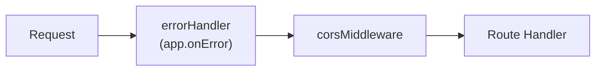
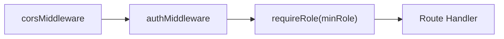
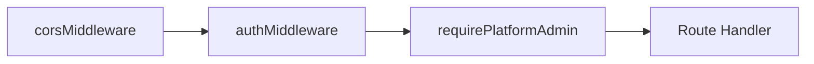
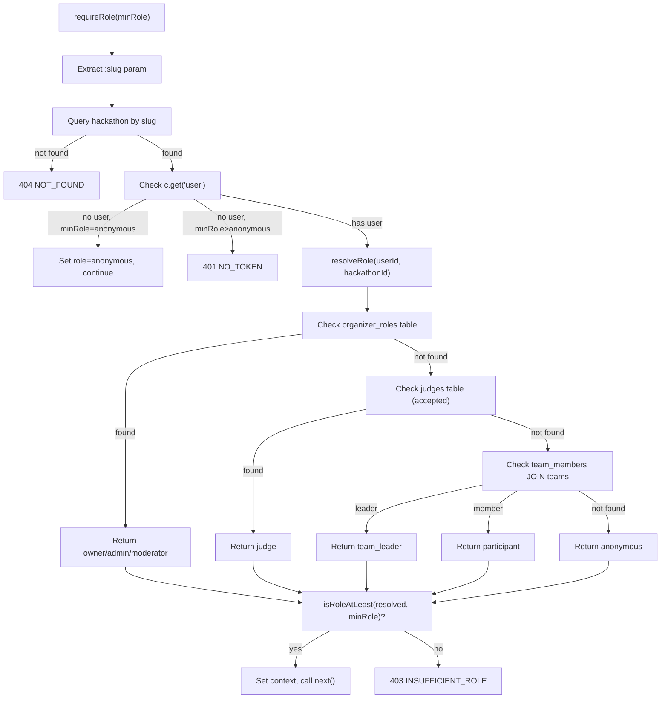

# 04 — API Design & Conventions

> The DevSage API is a single Cloudflare Worker (Hono) at `api.devsage.org` serving all five surfaces. Routes use slug-based multi-tenant addressing, a standard JSON envelope, and per-request role resolution. Request validation uses Zod schemas shared between API and frontends.

**Related docs:** [System Overview](./00-overview.md) | [Authentication](./01-authentication.md) | [Hackathon Lifecycle](./02-hackathon-lifecycle.md) | [Data Model](./03-data-model.md) | [Roles & Permissions](./10-roles-permissions.md)

---

## Base URL

```
Production:  https://api.devsage.org
Development: http://localhost:8787
```

All versioned routes use the `/api/v1/` prefix. Auth and webhook routes sit outside the versioned namespace.

---

## Response Envelope

Every response follows a standard JSON envelope. No exceptions.

### Success

```json
{
  "ok": true,
  "data": { ... },
  "meta": {}
}
```

### Success (Paginated)

```json
{
  "ok": true,
  "data": [ ... ],
  "meta": {
    "total": 42,
    "limit": 20,
    "offset": 0
  }
}
```

### Error

```json
{
  "ok": false,
  "error": {
    "code": "NOT_FOUND",
    "message": "Hackathon not found",
    "details": {}
  }
}
```

The `details` field is optional and only present when additional context is useful (e.g., validation errors, state machine conflicts).

### Response Helpers

Three helpers in `apps/api/src/lib/response.ts` enforce the envelope:

| Helper | Signature | Purpose |
|--------|-----------|---------|
| `successResponse()` | `(c, data, meta?, status?)` | Standard success response |
| `errorResponse()` | `(c, status, code, message, details?)` | Standard error response |
| `paginatedResponse()` | `(c, data[], total, limit, offset, meta?)` | Paginated list response |

---

## Pagination

All list endpoints accept pagination query parameters:

| Parameter | Type | Default | Range | Description |
|-----------|------|---------|-------|-------------|
| `limit` | number | 10-20 (varies) | 1-100 | Items per page |
| `offset` | number | 0 | 0+ | Items to skip |

Pagination is validated via `PaginationQuerySchema` from `@devsage/shared`. The response `meta` always includes `total`, `limit`, and `offset`.

---

## Multi-Tenant Addressing

All hackathon-scoped routes use slug-based addressing:

```
/api/v1/hackathons/:slug/teams
/api/v1/hackathons/:slug/submissions
/api/v1/hackathons/:slug/judges
/api/v1/hackathons/:slug/leaderboard
```

The `:slug` parameter is resolved to a hackathon record by middleware (`requireRole` or `hackathonMiddleware`), which sets `c.get('hackathon')` on the Hono context. All downstream handlers access the hackathon via context, never by re-querying.

---

## Middleware Chain

Requests flow through middleware in a fixed order. The exact chain depends on the route's auth requirements.

### Global Middleware (all routes)



### Protected Hackathon Routes



### Admin Routes



### Middleware Reference

| Middleware | File | Purpose |
|------------|------|---------|
| `errorHandler` | `middleware/error-handler.ts` | Global catch-all. Returns `{ ok: false, error: { code: "INTERNAL_ERROR" } }` |
| `corsMiddleware` | `middleware/cors.ts` | Dynamic origin allowlist for `*.devsage.org` |
| `authMiddleware` | `middleware/auth.ts` | Extracts and verifies JWT from HttpOnly cookie. Sets `c.get('user')` |
| `optionalAuth` | `middleware/auth.ts` | Like `authMiddleware` but does not reject unauthenticated requests |
| `requireRole(minRole)` | `middleware/role.ts` | Resolves hackathon from `:slug`, resolves user role, enforces minimum. Sets `c.get('hackathon')` and `c.get('role')` |
| `hackathonMiddleware` | `middleware/hackathon.ts` | Resolves hackathon from `:slug` without role checks. Sets `c.get('hackathon')` |
| `requirePlatformAdmin` | `middleware/platform-admin.ts` | Checks `platform_admins` table. Returns 403 if not admin |
| `requireOrganizer` | `middleware/require-organizer.ts` | Checks organizer invite or platform admin status |

---

## CORS Configuration

The API must accept requests from any `*.devsage.org` subdomain (each hackathon site is a different origin) plus the three core apps.

The CORS middleware checks the `Origin` header against an explicit allowlist plus a dynamic subdomain regex for hackathon sites:

```typescript
function getAllowedOrigins(env: Env): string[] {
  return [
    env.FRONTEND_URL,    // devsage.org
    env.PLATFORM_URL,    // platform.devsage.org
    env.ADMIN_URL,       // admin.devsage.org
    ...DEV_ORIGINS,      // localhost:5173/5174/5175
  ].filter(Boolean);
}

// Dynamic subdomain matching for hackathon sites
/^https:\/\/[a-z0-9-]+\.devsage\.org$/.test(origin)
```

### CORS Headers Set

| Header | Value |
|--------|-------|
| `Access-Control-Allow-Origin` | Requesting origin (if allowed) |
| `Access-Control-Allow-Credentials` | `true` |
| `Access-Control-Allow-Headers` | `Content-Type` |
| `Access-Control-Allow-Methods` | `GET,POST,PUT,PATCH,DELETE,OPTIONS` |
| `Vary` | `Origin` |

Preflight `OPTIONS` requests return `204` immediately.

---

## Request Validation

All request bodies are validated using `@hono/zod-validator` with schemas from `@devsage/shared`:

```typescript
import { zValidator } from '@hono/zod-validator';
import { CreateTeamRequestSchema } from '@devsage/shared';

router.post(
  '/:slug/teams',
  authMiddleware,
  requireRole('participant'),
  zValidator('json', CreateTeamRequestSchema),
  async (c) => {
    const body = c.req.valid('json'); // Fully typed
    // ...
  },
);
```

### Validation Schemas Used

| Schema | Route | Package |
|--------|-------|---------|
| `CreateHackathonRequestSchema` | `POST /hackathons` | `@devsage/shared` |
| `UpdateHackathonRequestSchema` | `PUT /hackathons/:slug` | `@devsage/shared` |
| `StatusTransitionRequestSchema` | `PATCH /hackathons/:slug/status` | `@devsage/shared` |
| `PaginationQuerySchema` | All list endpoints | `@devsage/shared` |
| `CreateTeamRequestSchema` | `POST /:slug/teams` | `@devsage/shared` |
| `JoinTeamRequestSchema` | `POST /:slug/teams/:id/join` | `@devsage/shared` |
| `ConnectTeamRepoRequestSchema` | `POST /:slug/teams/:id/repo` | `@devsage/shared` |
| `InviteJudgeRequestSchema` | `POST /:slug/judges` | `@devsage/shared` |
| `RespondToJudgeInviteRequestSchema` | `POST /:slug/judges/:id/respond` | `@devsage/shared` |
| `BulkRubricRequestSchema` | `POST /:slug/rubric` | `@devsage/shared` |
| `SubmitScoreRequestSchema` | `POST /:slug/scores` | `@devsage/shared` |

---

## Route Reference

### Authentication (`/auth`)

No `/api/v1/` prefix. Handles OAuth flows and session management.

| Method | Path | Auth | Description |
|--------|------|------|-------------|
| GET | `/auth/github` | -- | Initiate GitHub OAuth. Accepts `?origin=` to track calling app |
| GET | `/auth/callback/github` | -- | GitHub OAuth callback. Sets JWT cookie, redirects to frontend |
| GET | `/auth/google` | -- | Initiate Google OAuth. Accepts `?origin=` |
| GET | `/auth/callback/google` | -- | Google OAuth callback. Sets JWT cookie, redirects to frontend |
| GET | `/auth/me` | JWT | Returns current user, organizer roles, platform admin status |
| POST | `/auth/logout` | JWT | Clears session cookie |

**Access control for login:** The API checks which app initiated the OAuth flow (`participant`, `platform`, or `admin`) and enforces access. Platform login requires an accepted organizer invite or platform admin status. Admin login requires platform admin status.

### Hackathons (`/api/v1/hackathons`)

| Method | Path | Auth | Min Role | Description |
|--------|------|------|----------|-------------|
| GET | `/hackathons` | -- | -- | List hackathons (excludes drafts). Paginated |
| POST | `/hackathons` | JWT | organizer | Create hackathon. Initializes DO state machine |
| GET | `/hackathons/:slug` | optional | -- | Get hackathon by slug. Drafts visible only to moderator+ |
| PUT | `/hackathons/:slug` | JWT | admin | Update hackathon (draft status only) |
| PATCH | `/hackathons/:slug/status` | JWT | admin | Transition hackathon phase via Durable Object |
| DELETE | `/hackathons/:slug` | JWT | owner | Delete hackathon (draft status only) |

### Teams (`/api/v1/hackathons/:slug/teams`)

| Method | Path | Auth | Min Role | Description |
|--------|------|------|----------|-------------|
| POST | `/:slug/teams` | JWT | participant | Create team. Generates invite code. Registration must be open |
| GET | `/:slug/teams` | JWT | -- | List teams for hackathon. Paginated |
| GET | `/:slug/teams/:teamId` | JWT | participant | Get team with member details |
| POST | `/:slug/teams/:teamId/join` | JWT | participant | Join team via invite code. Checks team size limit |
| DELETE | `/:slug/teams/:teamId/members/:userId` | JWT | participant | Remove member (self) or team_leader+ (others) |
| POST | `/:slug/teams/:teamId/repo` | JWT | team_leader | Connect GitHub repo. Stores mapping in KV |

### Submissions (`/api/v1/hackathons/:slug/submissions`)

Submissions are managed by the HackathonStateMachine Durable Object. The API routes delegate to the DO via `stub.fetch()`.

| Method | Path | Auth | Min Role | Description |
|--------|------|------|----------|-------------|
| GET | `/:slug/submissions` | JWT | participant | List all submissions (via DO) |
| GET | `/:slug/submissions/:teamId` | JWT | participant | Get submission for a specific team (via DO) |

Submissions are created automatically when a team pushes a matching git tag. The webhook pipeline processes the tag event and locks the submission in the DO.

### Judging (`/api/v1/hackathons/:slug`)

| Method | Path | Auth | Min Role | Description |
|--------|------|------|----------|-------------|
| POST | `/:slug/judges` | JWT | admin | Invite a judge by user ID |
| GET | `/:slug/judges` | JWT | admin | List judges with user details |
| POST | `/:slug/judges/:judgeId/respond` | JWT | anonymous | Accept or decline judge invite (own invite only) |
| GET | `/:slug/rubric` | optional | anonymous | Get rubric criteria (ordered by sort_order) |
| POST | `/:slug/rubric` | JWT | admin | Bulk upsert rubric criteria (draft/registration_open only) |
| POST | `/:slug/judges/assign` | JWT | admin | Round-robin assign accepted judges to teams with submissions |
| POST | `/:slug/scores` | JWT | anonymous | Submit score for submission+criteria pair. Write-once (409 on duplicate) |
| GET | `/:slug/leaderboard` | optional | anonymous | Weighted leaderboard. Public after judging; admin+ anytime |

### Webhooks (`/webhooks`)

| Method | Path | Auth | Description |
|--------|------|------|-------------|
| POST | `/webhooks/github` | HMAC | GitHub App webhook receiver |

Webhook processing:
1. Verify `X-Hub-Signature-256` via HMAC SHA-256 with `GITHUB_WEBHOOK_SECRET`
2. Parse `X-GitHub-Event` and `X-GitHub-Delivery` headers
3. Normalize event via `normalizeGitHubEvent()` into typed union
4. Enqueue to `WEBHOOK_QUEUE` for async processing
5. Return `202 Accepted`

Unrecognized event types return `200` with an acknowledgment message.

### Admin (`/api/v1/admin`)

All admin routes require platform admin status (checked via `platform_admins` table).

| Method | Path | Auth | Description |
|--------|------|------|-------------|
| POST | `/admin/invites` | JWT + platform_admin | Create organizer invite. Sends email notification |
| GET | `/admin/invites` | JWT + platform_admin | List organizer invites. Paginated |
| DELETE | `/admin/invites/:id` | JWT + platform_admin | Revoke pending invite (cannot revoke accepted) |
| GET | `/admin/admins` | JWT + platform_admin | List platform admins with user details |

### Invites (`/api/v1/invites`)

Public-facing invite acceptance flow for organizers.

| Method | Path | Auth | Description |
|--------|------|------|-------------|
| GET | `/invites/:code` | -- | Look up invite by code. Shows status (pending/expired/accepted) |
| POST | `/invites/:code/accept` | JWT | Accept organizer invite. Grants organizer access |

### Health Check

| Method | Path | Auth | Description |
|--------|------|------|-------------|
| GET | `/` | -- | Returns `{ status: "ok", message: "DevSage API" }` |

---

## Route Mounting

Routes are mounted in `apps/api/src/index.ts`:

```typescript
app.route('/auth', auth);
app.route('/api/v1/hackathons', hackathons);
app.route('/api/v1/hackathons', teams);        // Same prefix, different handlers
app.route('/webhooks', webhooks);
app.route('/api/v1/hackathons', submissions);  // Same prefix, different handlers
app.route('/api/v1/hackathons', judging);      // Same prefix, different handlers
app.route('/api/v1/admin', admin);
app.route('/api/v1/invites', invites);
```

Teams, submissions, and judging routes all mount under `/api/v1/hackathons` because they use `/:slug/` sub-paths. Hono resolves the correct handler based on the full path.

---

## Error Codes

All error codes used across the API:

### Authentication & Authorization

| Code | HTTP | Description |
|------|------|-------------|
| `NO_TOKEN` | 401 | No JWT cookie present |
| `INVALID_TOKEN` | 401 | JWT expired or signature invalid |
| `USER_NOT_FOUND` | 404 | JWT valid but user deleted from DB |
| `MISSING_OAUTH_PARAMS` | 400 | OAuth callback missing `code` or `state` |
| `INVALID_OAUTH_STATE` | 400 | OAuth state mismatch or expired (10-min TTL) |
| `FORBIDDEN` | 403 | Authenticated but lacks permission |
| `INSUFFICIENT_ROLE` | 403 | User's resolved role is below the required minimum |
| `NOT_PLATFORM_ADMIN` | 403 | Route requires platform admin status |

### Hackathons

| Code | HTTP | Description |
|------|------|-------------|
| `NOT_FOUND` | 404 | Hackathon, team, member, or invite not found |
| `SLUG_TAKEN` | 409 | Hackathon slug already in use |
| `INVALID_STATUS` | 400 | Operation not allowed in current hackathon phase |
| `LIFECYCLE_INIT_FAILED` | 500 | Durable Object initialization failed |
| `TRANSITION_FAILED` | 400 | State machine rejected the phase transition |
| `BAD_REQUEST` | 400 | Missing hackathon slug parameter |

### Teams

| Code | HTTP | Description |
|------|------|-------------|
| `ALREADY_ON_TEAM` | 409 | User already belongs to a team in this hackathon |
| `TEAM_FULL` | 409 | Team has reached `max_team_size` |
| `INVALID_INVITE_CODE` | 403 | Incorrect team invite code |
| `REPO_ALREADY_CONNECTED` | 409 | Repository already linked to another team |

### Judging

| Code | HTTP | Description |
|------|------|-------------|
| `DUPLICATE_INVITE` | 409 | Judge already invited to this hackathon |
| `NO_JUDGES` | 400 | No accepted judges available for assignment |
| `NO_SUBMISSIONS` | 400 | No teams with submissions to assign |

### Submissions

| Code | HTTP | Description |
|------|------|-------------|
| `SUBMISSIONS_FETCH_FAILED` | varies | DO returned error fetching submissions |
| `SUBMISSION_FETCH_FAILED` | varies | DO returned error fetching single submission |

### Webhooks

| Code | HTTP | Description |
|------|------|-------------|
| `MISSING_WEBHOOK_HEADERS` | 400 | Missing `X-Hub-Signature-256`, `X-GitHub-Delivery`, or `X-GitHub-Event` |
| `INVALID_SIGNATURE` | 401 | HMAC signature verification failed |
| `INVALID_BODY` | 400 | Request body is not valid JSON |

### Admin & Invites

| Code | HTTP | Description |
|------|------|-------------|
| `INVALID_EMAIL` | 400 | Missing or malformed email address |
| `INVITE_EXISTS` | 409 | Organizer invite already exists for this email |
| `ALREADY_ACCEPTED` | 400 | Cannot revoke an already-accepted invite |
| `INVITE_NOT_FOUND` | 404 | Invite code not found or already used |
| `INVITE_EXPIRED` | 410 | Invite has passed its expiry date |

### System

| Code | HTTP | Description |
|------|------|-------------|
| `INTERNAL_ERROR` | 500 | Unhandled exception (global error handler) |
| `DB_ERROR` | 500 | Database query failed in middleware |
| `ROLE_RESOLUTION_ERROR` | 500 | Role resolution threw an unexpected error |

---

## Role Resolution Flow

The `requireRole(minRole)` middleware resolves the user's role for the specific hackathon identified by `:slug`:



---

## Durable Object Communication

Routes that need state machine operations communicate with the `HackathonStateMachine` DO via internal fetch:

```typescript
const stub = getStateMachineStub(c.env, hackathon.id);
const result = await fetchDO(stub, DO_PATHS.TRANSITION, {
  method: 'POST',
  body: { targetStatus, expectedVersion },
});
```

The DO never accesses D1 directly. The Worker mediates all database writes after the DO confirms the operation.

---

## Audit Trail

Every state-changing operation logs an audit event via `insertAuditEvent()`:

```typescript
await insertAuditEvent(db, {
  hackathonId: hackathon.id,
  actorId: user.sub,
  actorType: 'user',        // 'user' | 'system' | 'bot' | 'cron'
  action: 'team.create',
  entityType: 'team',
  entityId: teamId,
  details: { name: body.name },
});
```

See [03-data-model.md](./03-data-model.md) for the full `audit_events` table schema.

---

## File References

| File | Purpose |
|------|---------|
| `apps/api/src/index.ts` | Entry point: route mounting, queue handler, cron handler |
| `apps/api/src/routes/auth.ts` | OAuth flows, `/auth/me`, logout |
| `apps/api/src/routes/hackathons.ts` | Hackathon CRUD and state transitions |
| `apps/api/src/routes/teams.ts` | Team creation, joining, repo linking |
| `apps/api/src/routes/submissions.ts` | Submission queries (delegates to DO) |
| `apps/api/src/routes/judging.ts` | Judge invites, rubric, scoring, leaderboard |
| `apps/api/src/routes/webhooks.ts` | GitHub webhook receiver with HMAC verification |
| `apps/api/src/routes/admin.ts` | Platform admin operations (invites, admin list) |
| `apps/api/src/routes/invites.ts` | Public invite lookup and acceptance |
| `apps/api/src/middleware/cors.ts` | Dynamic CORS for `*.devsage.org` |
| `apps/api/src/middleware/auth.ts` | JWT extraction from HttpOnly cookie |
| `apps/api/src/middleware/role.ts` | Per-request role resolution and enforcement |
| `apps/api/src/middleware/error-handler.ts` | Global error handler |
| `apps/api/src/middleware/hackathon.ts` | Hackathon lookup by slug |
| `apps/api/src/middleware/platform-admin.ts` | Platform admin check |
| `apps/api/src/middleware/require-organizer.ts` | Organizer access check |
| `apps/api/src/lib/response.ts` | `successResponse()`, `errorResponse()`, `paginatedResponse()` |
| `apps/api/src/lib/audit.ts` | `insertAuditEvent()` |
| `packages/shared/` | Zod validation schemas shared with frontends |
