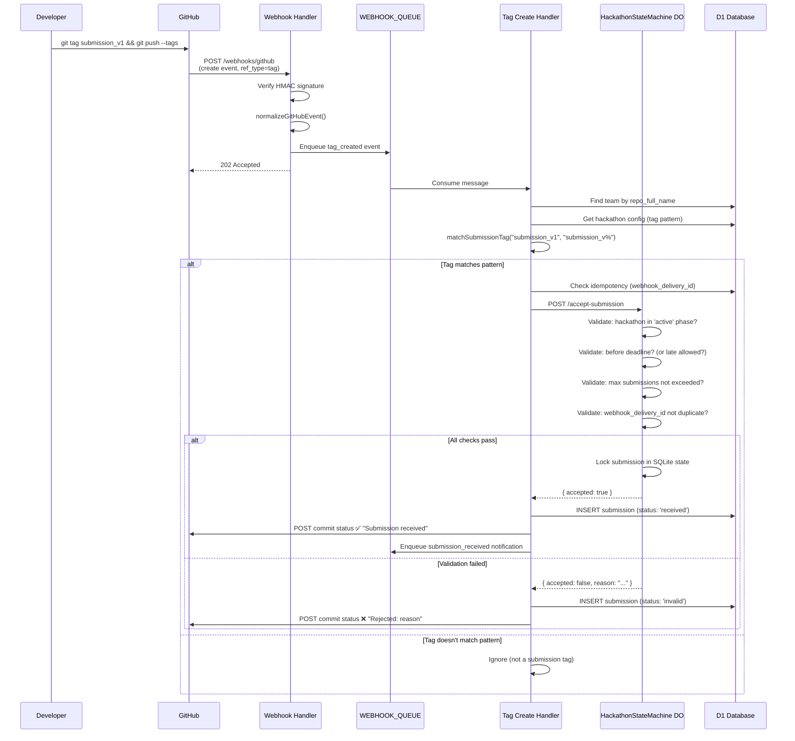
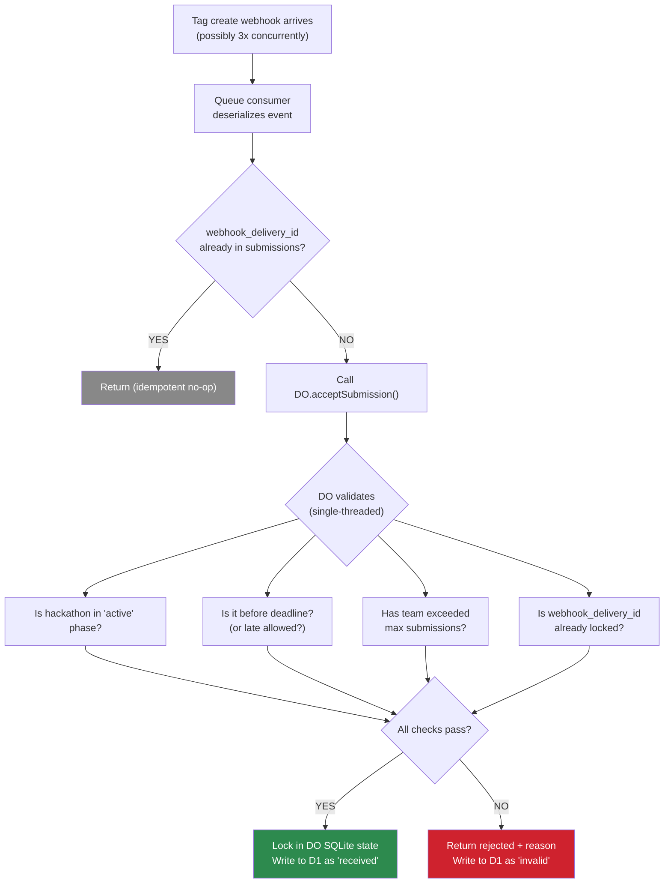
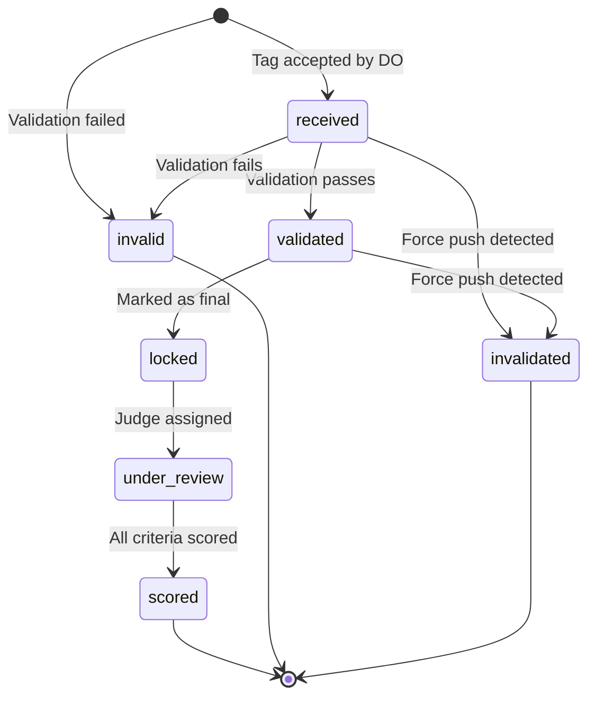
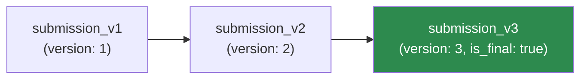
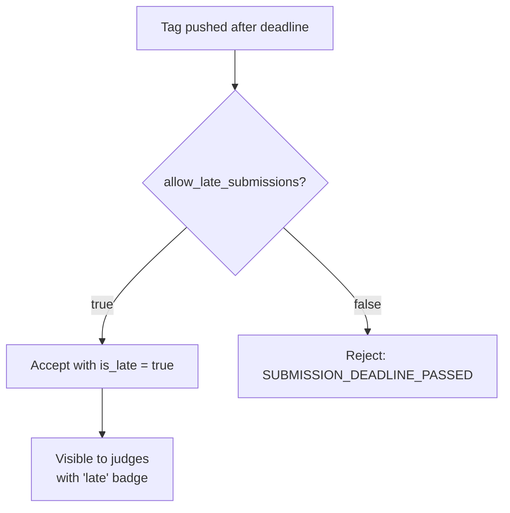
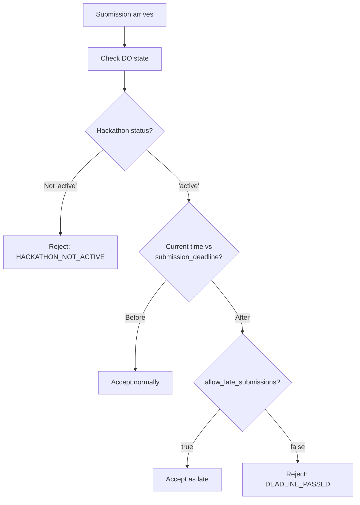
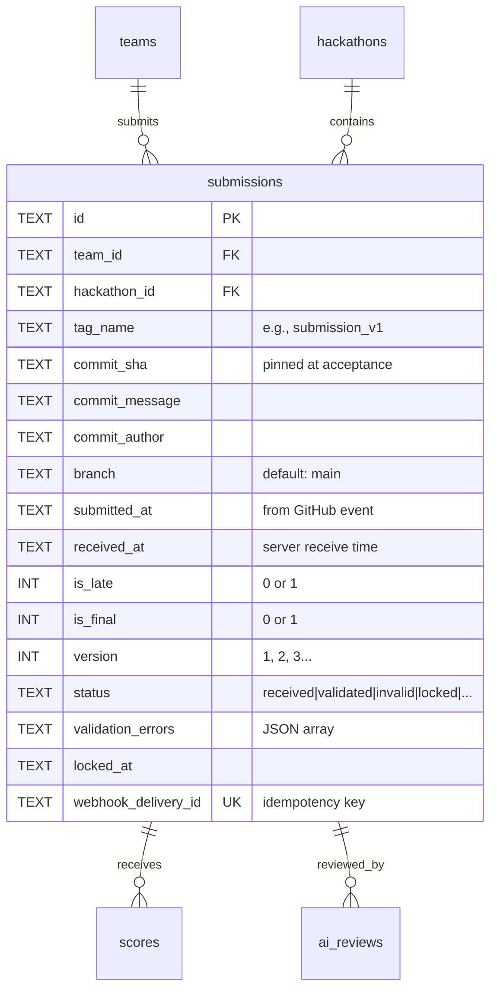
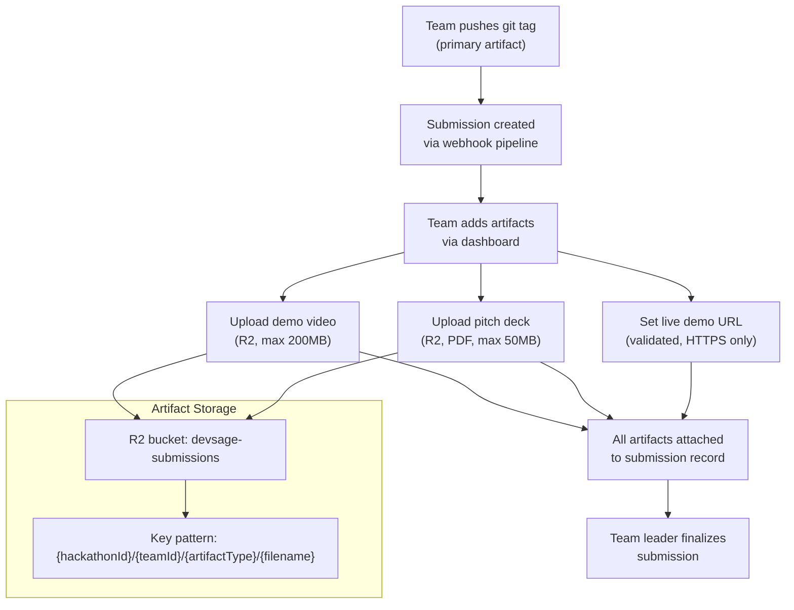
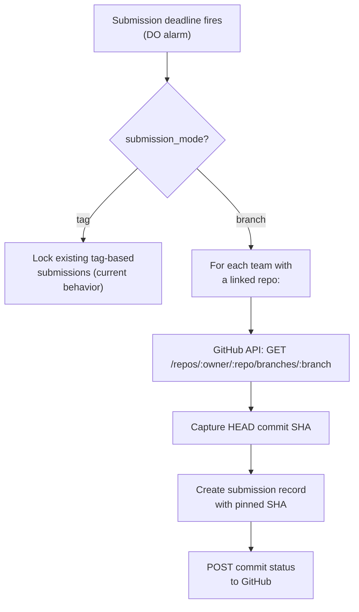

# 04 — Submissions & Locking

> Teams submit by pushing a Git tag matching a configurable pattern. A Durable Object guarantees exactly-once acceptance per team via single-writer locking. No forms, no uploads, no manual intervention.

**Related docs:** [Hackathon Lifecycle](./02-hackathon-lifecycle.md) | [Webhooks & GitHub](./07-webhooks-integrations.md) | [Judging](./05-judging.md)

---

## Submission Flow (End-to-End)



---

## Exactly-Once Locking

The Durable Object guarantees that even if GitHub delivers the same webhook 3 times concurrently, only one submission is accepted:



**Why Durable Objects?** The DO's single-threaded execution model prevents all race conditions. Even with concurrent webhook deliveries, submissions are serialized through one DO instance per hackathon.

---

## Submission States



| Status | Description |
|--------|-------------|
| `received` | Tag accepted by DO, written to D1 |
| `validated` | Additional validation passed (README check, etc.) |
| `invalid` | Failed validation (deadline, max submissions, pattern mismatch) |
| `locked` | Marked as team's final submission |
| `under_review` | Assigned to judge(s) |
| `scored` | All assigned judges have scored |
| `invalidated` | Retroactively invalidated (force push detected) |

---

## Tag Pattern Matching

Teams submit by pushing a Git tag that matches the hackathon's `submission_tag_pattern`:

| Pattern | Example Tags | Match? |
|---------|-------------|--------|
| `submission_v%` | `submission_v1`, `submission_v2`, `submission_v10` | Yes |
| `submission_v%` | `release_v1`, `submission_`, `submission_vX` | No |
| `final_%` | `final_v1`, `final_submission` | Yes |

The `%` wildcard matches any sequence of characters (SQL LIKE semantics). The version number is extracted from the matched portion.

---

## Submission Versioning

Teams can submit multiple versions (if `max_submissions_per_team` allows):



- Each tag creates a new submission record with an incrementing `version`
- Only one submission can be `is_final = true` per team
- Team leader manually marks a submission as final via `POST .../submissions/:id/finalize`
- If no submission is manually finalized, the latest is used for judging

---

## Late Submission Handling



Late submissions are tracked with `is_late = true` and `submitted_at` (from GitHub event timestamp, not server receive time) for fairness.

---

## Deadline Enforcement



**Two enforcement layers:**
1. **DO alarm** — fires at exact deadline, transitions hackathon to `judging` state
2. **Cron trigger** — hourly safety net that catches any missed transitions

---

## Idempotency

Multiple layers prevent duplicate submission processing:

| Layer | Mechanism | Key |
|-------|-----------|-----|
| D1 | `UNIQUE(webhook_delivery_id)` on submissions | GitHub delivery ID |
| D1 | `UNIQUE(team_id, tag_name)` on submissions | Team + tag combo |
| DO | `UNIQUE(webhook_delivery_id)` in submission_locks | GitHub delivery ID |
| Handler | Pre-check query before DO call | `SELECT ... WHERE webhook_delivery_id = ?` |

---

## Commit Status Posting

After processing a submission, the API posts a commit status back to GitHub:

| Outcome | Status | Description |
|---------|--------|-------------|
| Accepted | `success` | "Submission submission_v1 received by DevSage" |
| Rejected | `failure` | "Submission rejected: Deadline passed" |
| Processing | `pending` | "Submission being processed..." |

This appears as a check on the tagged commit in GitHub's UI.

---

## Data Model



---

## v3 Planned Enhancements

### Multi-Artifact Submissions

Extend submissions beyond Git tags to support multiple artifact types. Each submission becomes a container that holds one or more artifacts: the Git tag (primary, required), a demo video (uploaded to R2), a pitch deck (PDF uploaded to R2), and a live demo URL. Artifacts are added incrementally via `POST /api/v1/hackathons/:slug/submissions/:id/artifacts`. The DO validates that the primary Git tag artifact exists before allowing finalization.



| Artifact Type | Storage | Max Size | Format | Required |
|--------------|---------|----------|--------|----------|
| `git_tag` | GitHub (commit SHA pinned) | N/A | Git tag | Yes |
| `demo_video` | R2 | 200 MB | MP4, WebM | No |
| `pitch_deck` | R2 | 50 MB | PDF | No |
| `live_url` | D1 (URL string) | N/A | HTTPS URL | No |
| `screenshot` | R2 | 10 MB | PNG, JPG, WebP | No |

New table: `submission_artifacts` (id, submission_id, type, r2_key, url, filename, size_bytes, mime_type, uploaded_at).

### Submission Preview

Auto-generate a rich preview for each submission that judges can view without cloning the repo. The preview includes: rendered README (fetched from GitHub at the pinned commit SHA), repository statistics (commit count, contributor count, language breakdown), a contributor graph (commits per team member), and file tree snapshot. Previews are generated asynchronously via `PREVIEW_QUEUE` after submission acceptance and cached in KV with the commit SHA as the cache key.

| Component | Source | Cache |
|-----------|--------|-------|
| README render | GitHub API: `GET /repos/:owner/:repo/readme?ref=<sha>` | KV, keyed by `preview:{sha}:readme` |
| Repo stats | GitHub API: `GET /repos/:owner/:repo` + `/contributors` | KV, keyed by `preview:{sha}:stats` |
| Language breakdown | GitHub API: `GET /repos/:owner/:repo/languages` | KV, keyed by `preview:{sha}:langs` |
| Contributor graph | Computed from commit history (already tracked) | KV, keyed by `preview:{sha}:contributors` |
| File tree | GitHub API: `GET /repos/:owner/:repo/git/trees/<sha>?recursive=1` | KV, keyed by `preview:{sha}:tree` |

### Automated Validation Pipeline

Run configurable validation checks on each submission before it reaches judges. Organizers define validation rules during hackathon setup. The pipeline runs asynchronously via `VALIDATION_QUEUE` after submission acceptance. Each check produces a pass/fail result with a message. Failed checks do not reject the submission but flag it with warnings visible to judges.

| Check | Implementation | Default |
|-------|---------------|---------|
| README exists | GitHub API: check for README.md at pinned SHA | Enabled |
| Minimum commits | Count commits on default branch since hackathon start | >= 5 commits |
| CI passing | GitHub API: check commit status / check runs | Disabled (opt-in) |
| Minimum contributors | Count distinct commit authors | >= 2 (for teams > 1) |
| License file exists | GitHub API: check for LICENSE at pinned SHA | Disabled |
| Custom regex check | Match file contents against organizer-defined pattern | Disabled |

New table: `validation_results` (id, submission_id, check_name, status, message, checked_at).

### Submission Diff Viewer

Allow judges and team leaders to compare submission versions side-by-side. The diff viewer shows the Git diff between two tagged commits (e.g., `submission_v1` vs `submission_v2`), including file changes, additions, deletions, and a summary of what changed. The diff is fetched via the GitHub API (`GET /repos/:owner/:repo/compare/:base...:head`) and rendered in the frontend with syntax highlighting. Diffs are cached in KV to avoid repeated API calls.

| Property | Value |
|----------|-------|
| API | `GET /api/v1/hackathons/:slug/submissions/:id/diff?compareWith=:otherId` |
| GitHub API | `GET /repos/:owner/:repo/compare/:sha1...:sha2` |
| Cache | KV, keyed by `diff:{sha1}:{sha2}`, 24-hour TTL |
| Frontend | Side-by-side diff view with syntax highlighting (Monaco or custom) |
| Access | Team members (own submissions), judges (assigned submissions), admin+ (all) |

### Post-Deadline Grace Period with Penalty Scoring

Introduce a configurable grace period after the submission deadline during which teams can still submit, but with an automatic score penalty. The organizer sets `grace_period_minutes` and `grace_penalty_percent` on the hackathon configuration. Submissions received during the grace period are accepted with `is_grace_period = true` and the penalty percentage is applied to the final weighted score during leaderboard computation.

| Field | Type | Default | Description |
|-------|------|---------|-------------|
| `grace_period_minutes` | INT | 0 (disabled) | Minutes after deadline that submissions are still accepted |
| `grace_penalty_percent` | REAL | 10.0 | Percentage deducted from final score for grace period submissions |
| `is_grace_period` | BOOL | false | Set on submission if received during grace window |

Leaderboard adjustment:
```sql
-- Grace period penalty applied during leaderboard computation
CASE WHEN sub.is_grace_period = 1
  THEN weighted_percentage * (1 - h.grace_penalty_percent / 100.0)
  ELSE weighted_percentage
END AS final_percentage
```

### Branch-Based Submissions

Offer branch-based submissions as an alternative to tag-based for hackathons where participants are less familiar with Git tags. The organizer configures `submission_mode` as either `tag` (default, current behavior) or `branch`. In branch mode, the team designates a submission branch (default: `main`), and the system captures the HEAD commit SHA at the submission deadline. The DO locks the commit SHA at deadline time rather than on tag push.

| Mode | Trigger | Commit Pinning | Versioning |
|------|---------|---------------|------------|
| `tag` (default) | Team pushes matching tag | SHA from tag event | Multiple tags = multiple versions |
| `branch` | Deadline passes | HEAD of designated branch at deadline | Single version (latest commit) |



### Planned Feature Summary

| Feature | Priority | Complexity | New Tables / Columns | Key Dependencies |
|---------|----------|------------|---------------------|------------------|
| Multi-artifact submissions | High | High | `submission_artifacts` | R2 upload endpoints, presigned URLs |
| Submission preview | High | Medium | None (KV cache) | GitHub API, PREVIEW_QUEUE |
| Automated validation | Medium | Medium | `validation_results`, `validation_rules` | VALIDATION_QUEUE, GitHub API |
| Grace period scoring | Medium | Low | `hackathons.grace_period_minutes`, `hackathons.grace_penalty_percent`, `submissions.is_grace_period` | Leaderboard query adjustment |
| Diff viewer | Medium | Medium | None (KV cache) | GitHub compare API, frontend diff renderer |
| Branch-based submissions | Low | High | `hackathons.submission_mode`, `teams.submission_branch` | DO alarm-based capture, GitHub branch API |

---

## File References

| File | Purpose |
|------|---------|
| `apps/api/src/routes/submissions.ts` | Submission query routes |
| `apps/api/src/queue/tag-create-handler.ts` | Core submission processing pipeline |
| `apps/api/src/durable-objects/hackathon-state-machine.ts` | Exactly-once locking via `acceptSubmission()` |
| `apps/api/src/lib/submission-tag.ts` | `matchSubmissionTag()` pattern matching |
| `apps/api/src/services/github.ts` | `postCommitStatus()` — fail-open |
| `packages/shared/src/schemas/submission.ts` | `SubmissionSchema` |
| `packages/db/src/schema/submissions.ts` | Submissions table definition |
| `apps/web/src/pages/team-management.tsx` | Submission status UI |
