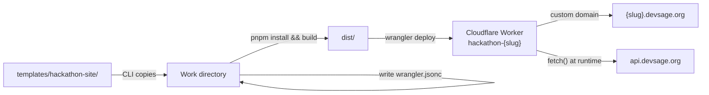

# 05 — Hackathon Site Template

> Each hackathon gets its own website at `{slug}.devsage.org`, deployed as a Cloudflare Worker serving static assets. The site is built from a shared template (`templates/hackathon-site/`) that is copied, configured, and deployed per hackathon via the CLI tool.

**Related docs:** [System Overview](./00-overview.md) | [CLI Tool](./06-cli.md) | [API Design](./04-api-design.md) | [Authentication](./01-authentication.md) | [Infrastructure](./13-infrastructure.md)

---

## Architecture

The hackathon site is a standalone React SPA. It is NOT a workspace package -- it has no `@devsage/*` imports and is not part of the Turborepo dependency graph. Each deployed site is an independent Cloudflare Worker serving static assets from a Vite build.



### Tech Stack

| Layer | Technology | Version |
|-------|------------|---------|
| Framework | React | 18.x |
| Build | Vite | 6.x |
| Styling | Tailwind CSS | v4 |
| Language | TypeScript | 5.7+ |
| Hosting | Cloudflare Workers (Static Assets) | -- |
| Deployment | Wrangler | 4.x |

### Key Constraints

- **Standalone project** -- no `@devsage/*` package imports, no workspace dependencies
- **Config baked at build time** -- `site.config.json` is imported statically via Vite
- **API calls at runtime** -- dynamic data fetched from `api.devsage.org` via `fetch()`
- **Cross-subdomain auth** -- JWT cookie set with `Domain=.devsage.org` is sent automatically

---

## Current State

The template currently renders a single-page landing experience with six components. There is no client-side routing, no auth context, and no interactive features beyond viewing teams.

### Component Tree

```
App
├── Hero          — Title, description, logo, accent color, CTA button
├── Dates         — Registration, hacking, and submission dates
├── Prizes        — Prize pool display
├── Teams         — Live team list (fetched from API)
├── About         — Description and rules
└── Footer        — "Powered by DevSage" link
```

### Component Details

| Component | File | Data Source | Description |
|-----------|------|-------------|-------------|
| `Hero` | `src/components/Hero.tsx` | `site.config.json` | Full-viewport hero with gradient title, logo/initial, accent-colored CTA. Links to `devsage.org/hackathons/{slug}` for registration |
| `Dates` | `src/components/Dates.tsx` | `site.config.json` | Three-column grid showing registration, hacking, and submission dates. Formatted with `toLocaleDateString()` |
| `Prizes` | `src/components/Prizes.tsx` | `site.config.json` | Large prize pool display with accent-colored text and glow effect |
| `Teams` | `src/components/Teams.tsx` | API (`/api/v1/hackathons/:slug/teams`) | Live team list fetched from API. Shows loading skeletons, error state, empty state. Uses `credentials: 'include'` |
| `About` | `src/components/About.tsx` | `site.config.json` | Description text and optional rules section |
| `Footer` | `src/components/Footer.tsx` | `site.config.json` | Links to `devsage.org` and hackathon registration page |

### How the Template Talks to the API

The `Teams` component demonstrates the API communication pattern:

```typescript
fetch(`${config.apiOrigin}/api/v1/hackathons/${config.slug}/teams`, {
  signal: controller.signal,
  credentials: 'include',  // Sends JWT cookie cross-subdomain
})
```

Key points:
- `config.apiOrigin` is read from `site.config.json` (defaults to `https://api.devsage.org`)
- `credentials: 'include'` ensures the JWT cookie (set with `Domain=.devsage.org`) is sent
- Responses follow the standard envelope: `{ ok, data, meta }`
- `AbortController` is used for cleanup on unmount

---

## site.config.json

Every hackathon site has a `site.config.json` at the project root. It is imported at build time and drives all static content.

| Field | Type | Required | Default | Description |
|-------|------|----------|---------|-------------|
| `slug` | string | yes | -- | Hackathon identifier. Used in API calls and URLs |
| `title` | string | yes | -- | Hackathon name. Displayed in Hero, page title |
| `description` | string | yes | -- | Hackathon description. Displayed in Hero and About |
| `accentColor` | string | no | `#2DD4BF` | Hex color used for gradients, buttons, badges, glows |
| `registrationStart` | string | no | `now` | ISO 8601 date. Displayed in Dates component |
| `hackingStart` | string | no | `now` | ISO 8601 date. Displayed in Dates component |
| `submissionDeadline` | string | no | `now` | ISO 8601 date. Displayed in Dates component |
| `maxTeamSize` | number | no | `4` | Displayed in Hero meta info |
| `prizePool` | string | no | `$10,000` | Displayed in Hero meta and Prizes component |
| `apiOrigin` | string | no | `https://api.devsage.org` | API base URL for runtime fetch calls |
| `logoUrl` | string\|null | no | `null` | Logo image URL. If null, shows first letter of title |
| `bannerUrl` | string\|null | no | `null` | Banner image URL (reserved for future use) |
| `rules` | string\|null | no | `null` | Rules text. If present, shown in About section |

### Example

```json
{
  "slug": "hack2026",
  "title": "Hack 2026",
  "description": "A weekend of building and innovation.",
  "accentColor": "#2DD4BF",
  "registrationStart": "2026-03-01T00:00:00Z",
  "hackingStart": "2026-03-15T00:00:00Z",
  "submissionDeadline": "2026-03-17T00:00:00Z",
  "maxTeamSize": 4,
  "prizePool": "$10,000",
  "apiOrigin": "https://api.devsage.org",
  "logoUrl": null,
  "bannerUrl": null,
  "rules": null
}
```

### Config Type Definition

```typescript
// src/config.ts
export interface SiteConfig {
  slug: string;
  title: string;
  description: string;
  accentColor: string;
  registrationStart: string;
  hackingStart: string;
  submissionDeadline: string;
  maxTeamSize: number;
  prizePool: string;
  apiOrigin: string;
  logoUrl: string | null;
  bannerUrl: string | null;
  rules: string | null;
}

export const config: SiteConfig = siteConfig as SiteConfig;
```

---

## Deployment Model

### Workers Static Assets (Not Pages)

Hackathon sites use Cloudflare Workers with the `assets` configuration, not Cloudflare Pages. This gives full control over the Worker name, routing, and custom domains.

### wrangler.jsonc Structure

Each deployed site gets a `wrangler.jsonc` generated from the template:

```jsonc
{
  "$schema": "node_modules/wrangler/config-schema.json",
  "name": "hackathon-{slug}",
  "account_id": "cf3386ad...",
  "compatibility_date": "2025-12-01",
  "assets": {
    "directory": "./dist",
    "not_found_handling": "single-page-application"
  }
}
```

| Field | Value | Purpose |
|-------|-------|---------|
| `name` | `hackathon-{slug}` | Worker name on Cloudflare (e.g., `hackathon-hack2026`) |
| `account_id` | Hardcoded | DevSage Cloudflare account |
| `compatibility_date` | `2025-12-01` | Workers runtime compatibility |
| `assets.directory` | `./dist` | Vite build output |
| `assets.not_found_handling` | `single-page-application` | All unknown paths serve `index.html` (SPA routing) |

### Template vs. Deployed

The template contains `wrangler.template.jsonc` with a `{SLUG}` placeholder. The CLI replaces this with the actual slug when generating the site's `wrangler.jsonc`.

---

## Entry Point

```typescript
// src/main.tsx
import { StrictMode } from 'react';
import { createRoot } from 'react-dom/client';
import App from './App';
import './index.css';

createRoot(document.getElementById('root')!).render(
  <StrictMode>
    <App />
  </StrictMode>,
);
```

```typescript
// src/App.tsx
export default function App() {
  return (
    <div className="min-h-screen bg-[#0b1120] text-white">
      <Hero />
      <Dates />
      <Prizes />
      <Teams />
      <About />
      <Footer />
    </div>
  );
}
```

No router, no providers, no context. The app is a single scrollable page.

---

## v3 Vision

The hackathon site template will evolve from a static landing page into a full participant and judge experience. The goal is that participants and judges do everything on `{slug}.devsage.org` -- they should rarely need to visit `devsage.org` or `platform.devsage.org`.

### Multi-Page SPA with React Router

```
/                    — Landing page (current Hero + Dates + Prizes + About)
/register            — Registration form (create account or login)
/teams               — Browse teams, create team, join team
/teams/:teamId       — Team detail, members, repo link
/dashboard           — Participant dashboard (my team, submission status, deadlines)
/submissions         — Submission status and history
/leaderboard         — Public leaderboard (visible after judging)
/judge               — Judge scoring interface (assigned submissions)
/judge/:submissionId — Score a specific submission against rubric
```

### Auth Context

```typescript
// Planned: src/contexts/auth-context.tsx
const AuthProvider = ({ children }) => {
  // Read JWT cookie via /auth/me call
  // Provide: { user, isAuthenticated, isLoading, logout }
};
```

The auth context will call `GET /auth/me` on mount (with `credentials: 'include'`) to check if the user has a valid session. The JWT cookie is already set cross-subdomain by the API.

### Planned Pages

| Page | API Endpoints Used | Description |
|------|-------------------|-------------|
| Landing | -- | Current static landing page |
| Register | `GET /auth/github`, `GET /auth/google` | OAuth login buttons, redirect to API |
| Teams | `GET /:slug/teams`, `POST /:slug/teams` | Browse and create teams |
| Team Detail | `GET /:slug/teams/:id`, `POST /:slug/teams/:id/join`, `POST /:slug/teams/:id/repo` | Join team, link repo |
| Dashboard | `GET /auth/me`, `GET /:slug/teams`, `GET /:slug/submissions/:teamId` | Personal dashboard |
| Submissions | `GET /:slug/submissions/:teamId` | Submission status and version history |
| Leaderboard | `GET /:slug/leaderboard` | Weighted scoring results |
| Judge Scoring | `GET /:slug/rubric`, `POST /:slug/scores` | Score submissions against rubric criteria |

### Planned Component Architecture

```
App
├── AuthProvider
├── Router
│   ├── / → LandingPage (Hero, Dates, Prizes, Teams, About, Footer)
│   ├── /register → RegisterPage
│   ├── /teams → TeamsPage
│   ├── /teams/:id → TeamDetailPage
│   ├── /dashboard → ProtectedRoute → DashboardPage
│   ├── /submissions → ProtectedRoute → SubmissionsPage
│   ├── /leaderboard → LeaderboardPage
│   └── /judge → ProtectedRoute → JudgeScoringPage
└── Footer
```

### Still Standalone

Even with these additions, the hackathon site will remain a standalone project. It will NOT become a workspace package or import from `@devsage/*`. All API communication will continue via `fetch()` with `credentials: 'include'`.

---

## File References

| File | Purpose |
|------|---------|
| `templates/hackathon-site/src/App.tsx` | Root component, renders all sections |
| `templates/hackathon-site/src/main.tsx` | Entry point, React root |
| `templates/hackathon-site/src/config.ts` | Config type and import from `site.config.json` |
| `templates/hackathon-site/src/components/Hero.tsx` | Hero section with title, CTA, accent styling |
| `templates/hackathon-site/src/components/Dates.tsx` | Important dates grid |
| `templates/hackathon-site/src/components/Prizes.tsx` | Prize pool display |
| `templates/hackathon-site/src/components/Teams.tsx` | Live team list from API |
| `templates/hackathon-site/src/components/About.tsx` | Description and rules |
| `templates/hackathon-site/src/components/Footer.tsx` | Footer with DevSage link |
| `templates/hackathon-site/site.config.json` | Default config (overwritten per hackathon) |
| `templates/hackathon-site/wrangler.template.jsonc` | Wrangler config template with `{SLUG}` placeholder |
| `templates/hackathon-site/package.json` | Dependencies: React 18, Vite 6, Tailwind v4 |
| `scripts/generate-hackathon-site.js` | CLI that copies template and deploys |
