# 05 — Judging & Scoring

> Structured evaluation with configurable rubrics, weighted scoring, round-robin judge assignment, and an optional AI-assisted review layer. Scores are write-once, immutable, and linked to pinned submission snapshots.

**Related docs:** [Submissions](./04-submissions.md) | [Roles & Permissions](./06-roles-permissions.md) | [Audit Trail](./09-audit-trail.md)

---

## Judging Flow (End-to-End)

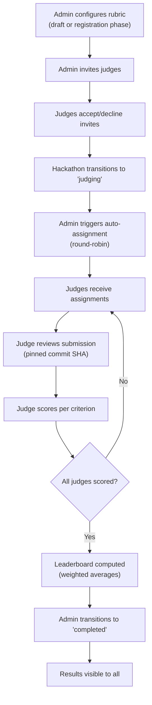

---

## 1. Rubric Configuration

Organizers define scoring criteria with weights during the `draft` or `registration_open` phase:

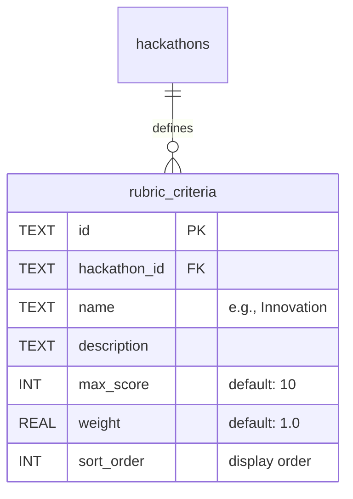

### Example Rubric

| Criterion | Max Score | Weight | Description |
|-----------|-----------|--------|-------------|
| Innovation | 10 | 2.0 | Originality of the idea and approach |
| Technical Execution | 10 | 1.5 | Code quality, architecture, completeness |
| User Experience | 10 | 1.0 | Design, usability, accessibility |
| Presentation | 10 | 0.5 | README quality, demo clarity |

**Operations:**
- `POST /api/v1/hackathons/:slug/rubric` — Bulk upsert (delete all existing, insert new). Only allowed in `draft` or `registration_open` status.
- `GET /api/v1/hackathons/:slug/rubric` — Public read (visible to judges and participants).

---

## 2. Judge Invitations

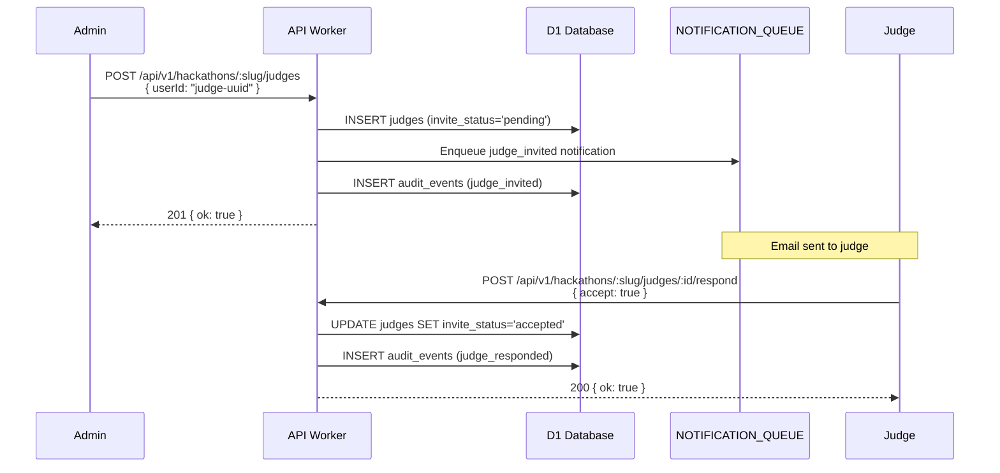

### Judge Invite States

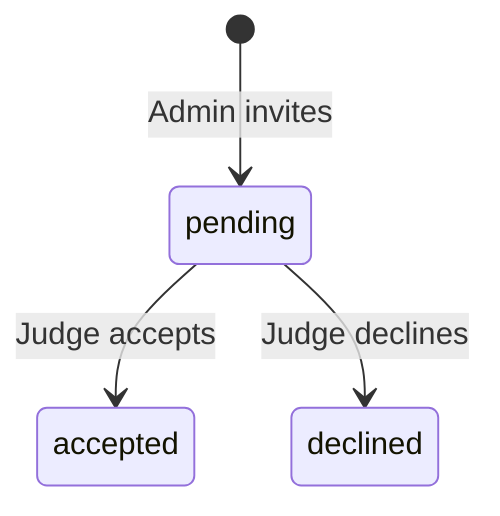

---

## 3. Round-Robin Assignment

When the admin triggers assignment, judges are distributed across teams:

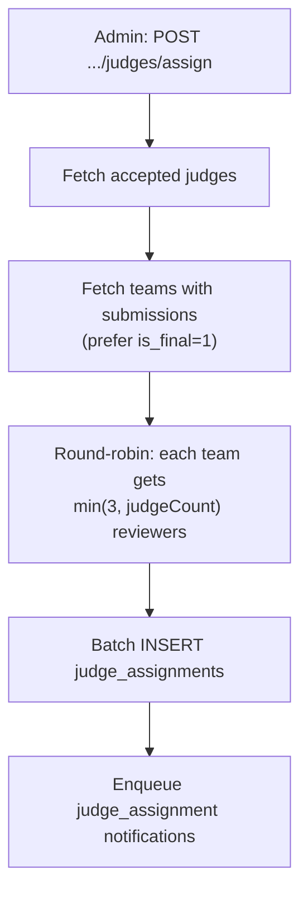

### Assignment Algorithm

```
For each team[i]:
  For j in range(reviewsPerTeam):
    Assign judges[(i + j) % judges.length] to team[i]
```

This ensures:
- Every team gets reviewed by the same number of judges (up to 3)
- Workload is balanced across judges
- No judge reviews the same team twice (`UNIQUE(judge_id, team_id)`)

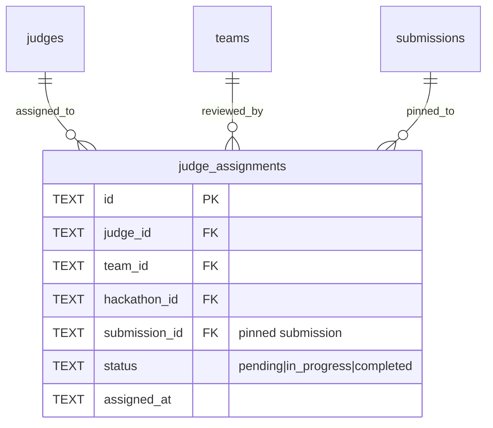

---

## 4. Scoring

Judges score each criterion for each assigned submission. Scores are **write-once** — once submitted, they cannot be changed.

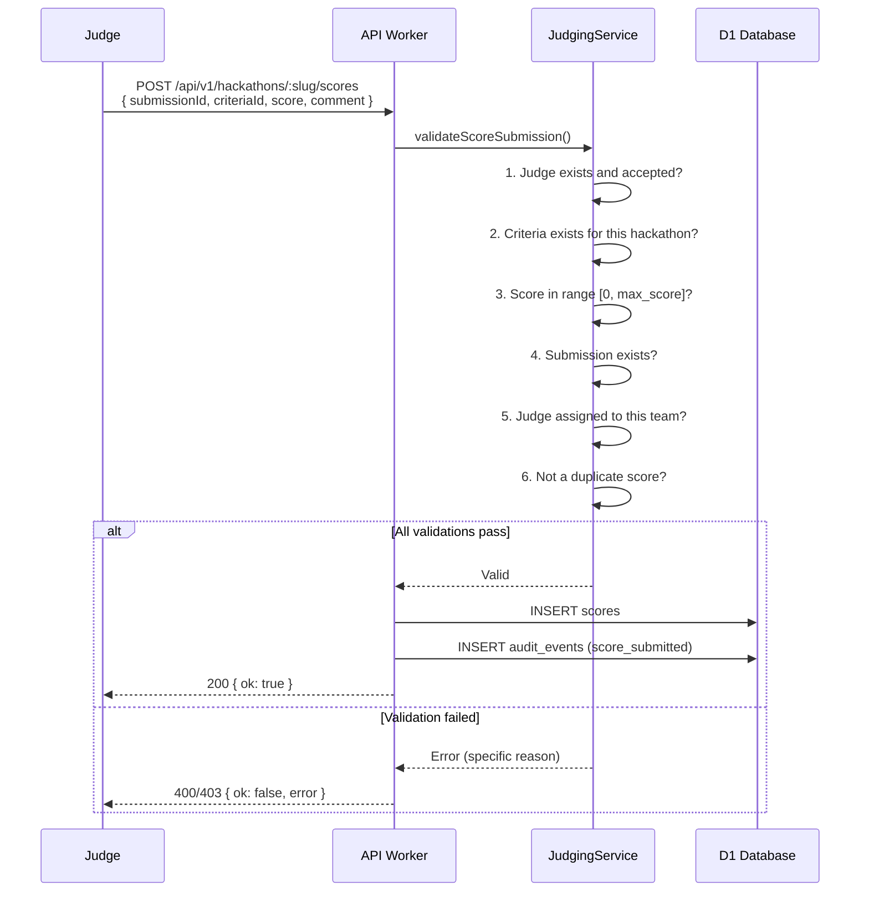

### Score Validation (6-Step)

| Step | Check | Error Code |
|------|-------|------------|
| 1 | Judge exists and `invite_status = accepted` | `JUDGE_NOT_FOUND` |
| 2 | Criterion belongs to this hackathon | `CRITERIA_NOT_FOUND` |
| 3 | `0 <= score <= max_score` for this criterion | `SCORE_OUT_OF_RANGE` |
| 4 | Submission exists and belongs to hackathon | `SUBMISSION_NOT_FOUND` |
| 5 | Judge is assigned to the submission's team | `NOT_ASSIGNED` |
| 6 | No existing score for this (judge, submission, criterion) | `DUPLICATE_SCORE` |

### Score Immutability

The `UNIQUE(submission_id, judge_id, criteria_id)` constraint enforces one score per judge per criterion per submission. There is no update endpoint — scores are final.

---

## 5. Leaderboard

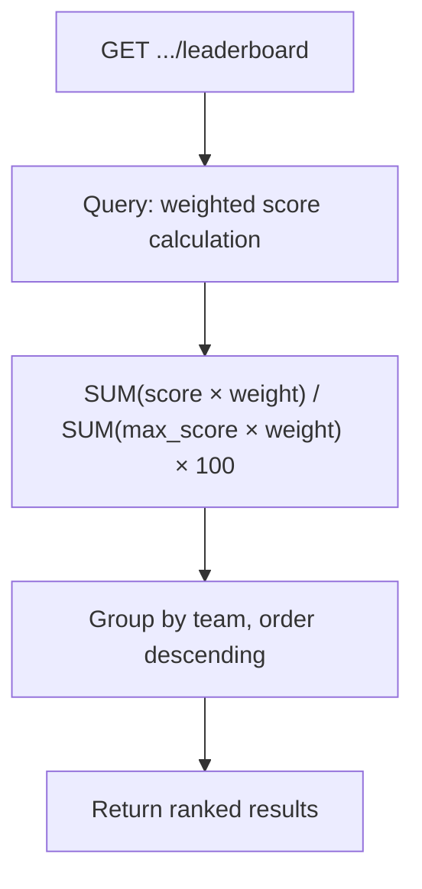

### Weighted Score Formula

```sql
SELECT
  t.id, t.name,
  ROUND(
    SUM(s.score * rc.weight) / SUM(rc.max_score * rc.weight) * 100,
    2
  ) AS weighted_percentage,
  COUNT(DISTINCT s.judge_id) AS judges_completed
FROM scores s
  JOIN rubric_criteria rc ON s.criteria_id = rc.id
  JOIN submissions sub ON s.submission_id = sub.id
  JOIN teams t ON sub.team_id = t.id
WHERE sub.hackathon_id = ?
  AND sub.is_final = 1
GROUP BY t.id
ORDER BY weighted_percentage DESC
```

### Visibility Rules

| Viewer Role | Before `completed` | After `completed` |
|-------------|--------------------|--------------------|
| Participant | Own team's scores only | Full leaderboard |
| Judge | Own scores only | Full leaderboard |
| Admin+ | Full leaderboard | Full leaderboard |
| Anonymous | Nothing | Public leaderboard |

---

## 6. AI-Assisted Reviews

Optional, advisory-only layer. Never replaces or overrides judge scores.

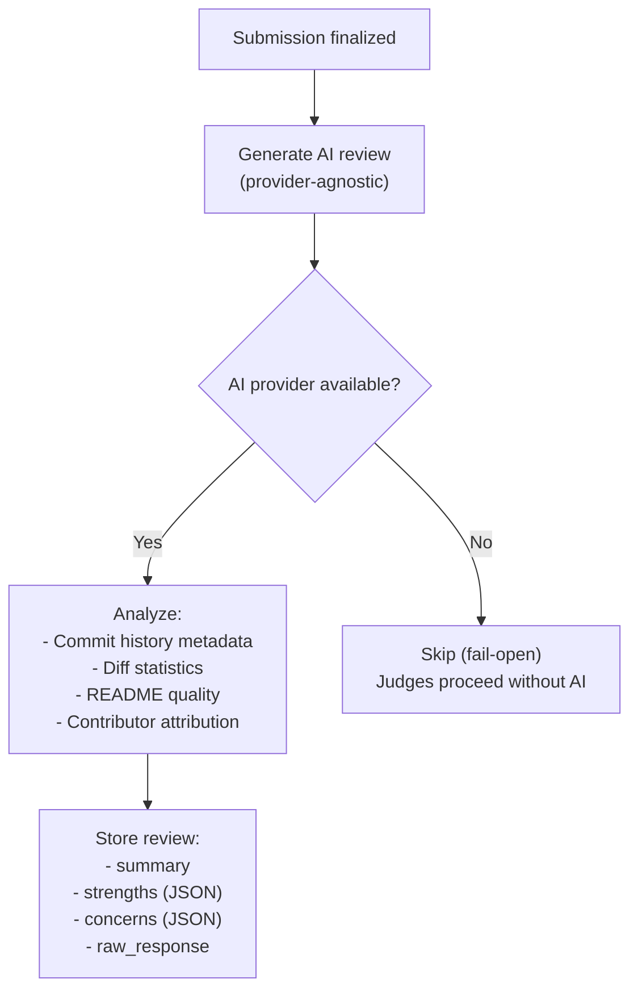

### AI Review Properties

| Property | Value |
|----------|-------|
| Provider | OpenAI-compatible endpoint (swappable) |
| Model | Configurable (default: `gpt-4o-mini`) |
| Timeout | 25 seconds (fail-open) |
| Reproducibility | Prompt hash stored for audit |
| Pinning | Tied to exact commit SHA |
| Caching | Same prompt + commit = cached response |
| Temperature | 0.3 (low variance for consistency) |

---

## Data Model

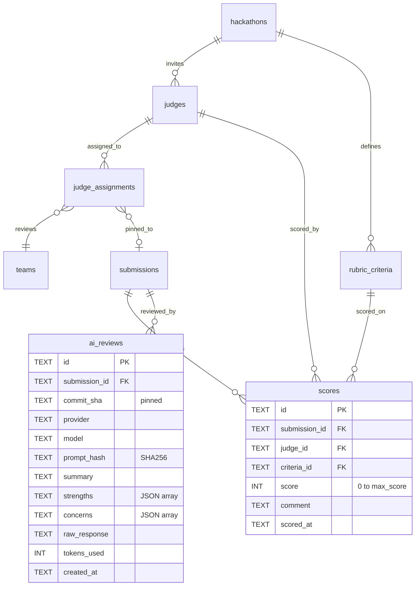

---

## v3 Planned Enhancements

### Multi-Round Judging

Support a multi-round judging process where a preliminary round eliminates lower-scoring submissions and a final round produces the definitive ranking. Organizers configure the number of rounds and the advancement threshold (top N teams or minimum score percentage) for each round. Each round has its own judge assignments and can use different rubric criteria. The leaderboard reflects the current round's results, and the final leaderboard aggregates across rounds according to organizer-configured weights.

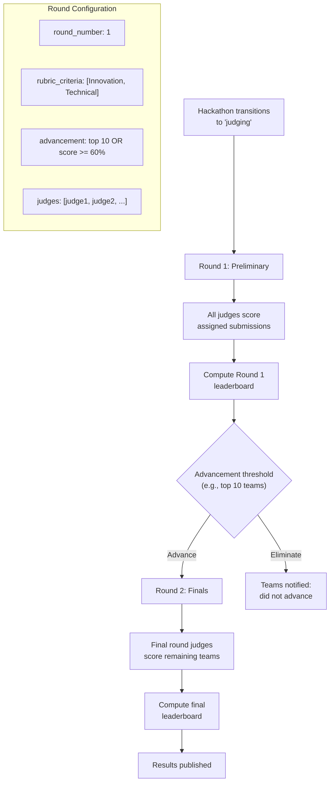

New table: `judging_rounds` (id, hackathon_id, round_number, name, rubric_criteria_ids JSON, advancement_type, advancement_threshold, status, started_at, completed_at).

Modified: `judge_assignments.round_id` FK, `scores.round_id` FK.

### Blind Judging Mode

Hide team identities from judges during scoring. When `blind_judging` is enabled on a hackathon, the judging UI replaces team names with anonymized identifiers (e.g., "Submission A", "Submission B"). The API strips team names, member names, and GitHub usernames from all judge-facing endpoints. The mapping between anonymized IDs and real teams is stored server-side and only revealed when the organizer transitions to `completed`. Repository URLs are replaced with proxied read-only views that strip identifying information from commit authors.

| Property | Value |
|----------|-------|
| Configuration | `hackathons.blind_judging` (BOOL, default false) |
| Anonymization | Server-side: API never sends team/member names to judge endpoints |
| Identifier format | "Submission {letter}" (A, B, C...) — stable per judge session |
| Reveal | Automatic on transition to `completed` |
| Commit author masking | Proxied view replaces author names with "Participant 1", "Participant 2" |
| AI review masking | AI reviews regenerated without team-identifying context |

### Judge Calibration Sessions

Before formal scoring begins, judges participate in a calibration session where they all score the same sample submission and discuss their scores to align on rubric interpretation. The organizer selects 1-3 submissions as calibration samples. All judges score these samples, then the system displays a comparison view showing each judge's scores alongside the group average and standard deviation per criterion. Judges can adjust their understanding before scoring real submissions. Calibration scores are not included in the final leaderboard.

| Step | Action |
|------|--------|
| 1 | Organizer selects calibration submissions: `POST .../judging/calibration { submissionIds }` |
| 2 | Judges score calibration submissions (same scoring UI, flagged as calibration) |
| 3 | System computes per-criterion statistics: mean, median, std dev, min, max |
| 4 | Organizer hosts calibration review (scores displayed in comparison table) |
| 5 | Judges discuss and align on rubric interpretation |
| 6 | Organizer marks calibration complete: `POST .../judging/calibration/complete` |
| 7 | Formal scoring begins |

New table: `calibration_scores` (id, submission_id, judge_id, criteria_id, score, comment, scored_at). Separate from `scores` to avoid contaminating the leaderboard.

### Audience Choice Voting

Add a public voting mechanism alongside judge scoring. During the `judging` phase, authenticated users who are not judges can cast one vote per hackathon for their favorite submission. Votes are stored in a `audience_votes` table with a `UNIQUE(hackathon_id, user_id)` constraint to enforce one-vote-per-person. The audience choice winner is displayed separately on the leaderboard (not mixed into judge scores). Optionally, organizers can weight audience votes into the final score.

| Property | Value |
|----------|-------|
| Eligibility | Any authenticated user except judges for this hackathon |
| Limit | 1 vote per user per hackathon |
| Voting period | During `judging` phase only |
| Display | Separate "Audience Choice" section on leaderboard |
| Optional weighting | `audience_vote_weight` on hackathon config (default: 0, meaning display-only) |
| Anti-gaming | Rate limiting (5 vote changes per hour), account age minimum (created > 24h before voting opens) |

### Live Judging with Presentation Scheduling

Support live presentation-based judging where teams present to judges in scheduled time slots. The organizer creates a presentation schedule with time-boxed slots (e.g., 10 minutes per team: 7 minutes presentation + 3 minutes Q&A). The system provides a timer UI for judges, auto-advances to the next team, and sends notifications to the next team 5 minutes before their slot. Judges score immediately after each presentation.

| Field | Type | Description |
|-------|------|-------------|
| `presentation_slots` table | — | id, hackathon_id, team_id, round_id, start_time, duration_minutes, room |
| Timer | Frontend | Countdown timer visible to judges and presenting team |
| Notifications | Queue | 5-minute warning to next team, "you're up" notification |
| Scoring window | Config | Judges must score within N minutes of presentation end |
| Recording | Optional | Link to recording URL (external, e.g., Zoom recording) |

### AI-Powered Rubric Suggestions

When an organizer creates a hackathon and provides a theme/description, offer AI-generated rubric suggestions. The system sends the hackathon title, description, and track information to an AI provider and returns 4-6 suggested criteria with descriptions, max scores, and weights. The organizer can accept, modify, or reject each suggestion. Suggestions are generated once and cached; they are advisory only and never auto-applied.

| Property | Value |
|----------|-------|
| Trigger | Organizer clicks "Suggest Rubric" in hackathon setup |
| Input | Hackathon title, description, track names |
| Output | 4-6 criteria with name, description, suggested max_score, suggested weight |
| Provider | Same AI provider as AI reviews (configurable) |
| Cache | KV, keyed by hash of (title + description), 7-day TTL |
| Application | Manual — organizer reviews and applies individually |

### Export Results

Provide multiple export formats for judging results. Organizers can export the full leaderboard, per-team score breakdowns, and judge-level detail in CSV, JSON, or PDF format. PDF exports include auto-generated certificates for winning teams (top 3 by default, configurable). An API endpoint (`GET /api/v1/hackathons/:slug/results/export?format=csv`) generates the export on demand. For PDF certificates, the system uses a template stored in R2 with variable substitution (team name, rank, hackathon name, date).

| Format | Endpoint | Content |
|--------|----------|---------|
| CSV | `GET .../results/export?format=csv` | Leaderboard with all scores, weighted percentages, judge comments |
| JSON | `GET .../results/export?format=json` | Structured data matching the leaderboard API response |
| PDF (leaderboard) | `GET .../results/export?format=pdf` | Formatted leaderboard with hackathon branding |
| PDF (certificates) | `GET .../results/certificates` | Per-team certificates for top N teams |
| API | `GET .../results` | Standard JSON API (already exists) |

### Planned Feature Summary

| Feature | Priority | Complexity | New Tables / Columns | Key Dependencies |
|---------|----------|------------|---------------------|------------------|
| Multi-round judging | High | High | `judging_rounds`, `judge_assignments.round_id`, `scores.round_id` | Round advancement logic, per-round leaderboard |
| Blind judging | High | Medium | `hackathons.blind_judging`, `blind_mappings` | API response filtering, commit author masking |
| Export results | High | Medium | None | CSV/PDF generation, R2 certificate templates |
| Audience choice voting | Medium | Low | `audience_votes` | Rate limiting, eligibility checks |
| Judge calibration | Medium | Medium | `calibration_scores` | Calibration UI, statistics computation |
| Live judging | Medium | High | `presentation_slots` | Timer UI, scheduling algorithm, notifications |
| AI rubric suggestions | Low | Low | None (KV cache) | AI provider integration |

---

## File References

| File | Purpose |
|------|---------|
| `apps/api/src/routes/judging.ts` | All judging endpoints (587 LOC) |
| `apps/api/src/services/judging-service.ts` | Business logic: assignment, validation, leaderboard |
| `packages/shared/src/schemas/judge.ts` | `JudgeSchema`, `InviteJudgeRequestSchema` |
| `packages/shared/src/schemas/rubric.ts` | `RubricCriteriaSchema`, `BulkRubricRequestSchema` |
| `packages/shared/src/schemas/score.ts` | `ScoreSchema`, `SubmitScoreRequestSchema` |
| `packages/shared/src/schemas/judge-assignment.ts` | `JudgeAssignmentSchema` |
| `packages/shared/src/schemas/ai-review.ts` | `AiReviewSchema` |
| `packages/db/src/schema/judges.ts` | Judges table |
| `packages/db/src/schema/rubric-criteria.ts` | Rubric criteria table |
| `packages/db/src/schema/scores.ts` | Scores table |
| `packages/db/src/schema/judge-assignments.ts` | Assignment table |
| `packages/db/src/schema/ai-reviews.ts` | AI reviews table |
| `apps/web/src/pages/judge-dashboard.tsx` | Judge scoring UI |
| `apps/web/src/pages/leaderboard.tsx` | Leaderboard display |
