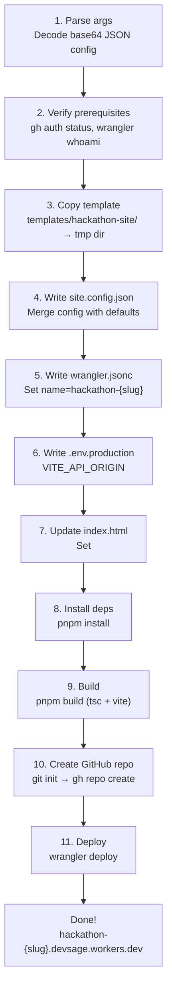

# 06 — CLI Tool

> The CLI tool creates and deploys hackathon sites from the shared template. It copies the template, writes per-hackathon config, builds the site, creates a GitHub repo, and deploys to Cloudflare Workers -- all in a single command.

**Related docs:** [System Overview](./00-overview.md) | [Hackathon Site Template](./05-hackathon-site.md) | [Infrastructure](./13-infrastructure.md)

---

## Current State

The CLI is a single Node.js script at `scripts/generate-hackathon-site.js`. It is invoked via pnpm and handles the full lifecycle of creating a hackathon site.

### Usage

```bash
pnpm generate:site --config '<base64-encoded-json>'
```

The config is passed as base64-encoded JSON to avoid shell escaping issues.

### Example

```bash
# Create a hackathon site
echo '{"slug":"hack2026","title":"Hack 2026","accentColor":"#FF6B6B"}' | base64

pnpm generate:site --config "eyJzbHVnIjoiaGFjazIwMjYiLCJ0aXRsZSI6IkhhY2sgMjAyNiIsImFjY2VudENvbG9yIjoiI0ZGNkI2QiJ9"
```

### Help

```bash
pnpm generate:site --help
```

---

## Config Fields

| Field | Type | Required | Default | Description |
|-------|------|----------|---------|-------------|
| `slug` | string | yes | -- | Hackathon identifier (e.g., `hack2026`). Used in Worker name, repo name, subdomain |
| `title` | string | yes | -- | Hackathon display name |
| `description` | string | no | `""` | Description text for landing page |
| `accentColor` | string | no | `#2DD4BF` | Hex color for branding |
| `registrationStart` | string | no | `now` | ISO 8601 date |
| `hackingStart` | string | no | `now` | ISO 8601 date |
| `submissionDeadline` | string | no | `now` | ISO 8601 date |
| `maxTeamSize` | number | no | `4` | Maximum team members |
| `prizePool` | string | no | `$10,000` | Prize pool display text |
| `apiOrigin` | string | no | `https://api.devsage.org` | API base URL |
| `logoUrl` | string\|null | no | `null` | Logo image URL |
| `bannerUrl` | string\|null | no | `null` | Banner image URL |
| `rules` | string\|null | no | `null` | Rules text |

---

## Execution Flow

The CLI runs 10 sequential steps:



### Step Details

| Step | Command / Action | Description |
|------|-----------------|-------------|
| 1 | `parseArgs()` | Decode base64 config, validate required fields (`slug`, `title`), apply defaults |
| 2 | `gh auth status`, `wrangler whoami` | Verify GitHub CLI and Wrangler are authenticated. Exits on failure |
| 3 | `copyDirSync()` | Recursively copy template directory to a temp directory. Skips `node_modules`, `dist`, `.wrangler` |
| 4 | Write `site.config.json` | Write merged config object as JSON |
| 5 | Write `wrangler.jsonc` | Generate Wrangler config with `name: "hackathon-{slug}"` and hardcoded `account_id` |
| 6 | Write `.env.production` | Set `VITE_API_ORIGIN` for the Vite build |
| 7 | Update `index.html` | Replace `<title>Hackathon</title>` with `<title>{title}</title>` |
| 8 | `pnpm install` | Install dependencies in the work directory |
| 9 | `pnpm build` | Run `tsc --noEmit && vite build` to produce `dist/` |
| 10 | `git init && git add -A && git commit && gh repo create` | Create a public GitHub repo under `SHIKDD-org/{slug}-site` |
| 11 | `npx wrangler deploy` | Deploy the built site to Cloudflare Workers |

### Output

On success, the CLI prints:

```
  GitHub:     https://github.com/SHIKDD-org/{slug}-site
  Deployed:   https://hackathon-{slug}.devsage.workers.dev
  Work dir:   /tmp/hackathon-site-{slug}-{timestamp}
```

---

## Constants

| Constant | Value | Description |
|----------|-------|-------------|
| `TEMPLATE_DIR` | `templates/hackathon-site/` | Source template directory (relative to repo root) |
| `CF_ACCOUNT_ID` | `cf3386ad...` | Cloudflare account ID (hardcoded) |
| `GITHUB_ORG` | `SHIKDD-org` | GitHub organization for hackathon site repos |
| `API_ORIGIN` | `https://api.devsage.org` | Default API origin |

---

## Prerequisites

The CLI requires two authenticated CLI tools:

| Tool | Check Command | Purpose |
|------|--------------|---------|
| `gh` (GitHub CLI) | `gh auth status` | Create GitHub repos under `SHIKDD-org` |
| `wrangler` (Cloudflare) | `wrangler whoami` | Deploy Workers to Cloudflare |

Both must be authenticated before running the CLI. The script exits with an error if either check fails.

---

## Custom Domain Setup

### Current State

The CLI deploys to `hackathon-{slug}.devsage.workers.dev` (the default Workers subdomain). Custom domain setup (`{slug}.devsage.org`) is done manually after deployment via the Cloudflare dashboard or Wrangler CLI.

### v3 Vision

The CLI will automate custom domain setup via the Cloudflare API:

1. Add a Workers Route for `{slug}.devsage.org/*` pointing to the `hackathon-{slug}` Worker
2. Create a DNS CNAME record for `{slug}.devsage.org` (if using Cloudflare DNS)
3. Verify the domain is active and serving

This eliminates the manual step and makes hackathon creation fully automated.

---

## v3 Vision: Proper CLI Tool

The current single-script approach will evolve into a proper CLI tool at `tools/cli/` using Commander.js for command parsing and Inquirer.js for interactive prompts.

### Planned Structure

```
tools/
└── cli/
    ├── package.json
    ├── src/
    │   ├── index.ts          # Entry point, Commander setup
    │   ├── commands/
    │   │   ├── create.ts     # devsage create <slug>
    │   │   ├── deploy.ts     # devsage deploy <slug>
    │   │   ├── list.ts       # devsage list
    │   │   ├── domain.ts     # devsage domain <slug>
    │   │   └── update.ts     # devsage update-template
    │   ├── lib/
    │   │   ├── cloudflare.ts # Cloudflare API client
    │   │   ├── github.ts     # GitHub API client
    │   │   ├── template.ts   # Template copy and config
    │   │   └── config.ts     # CLI config and constants
    │   └── types/
    │       └── index.ts
    └── tsconfig.json
```

### Planned Commands

#### `devsage create <slug>`

Create a new hackathon site from the template.

```bash
devsage create hack2026 --name "Hack 2026" --color "#FF6B6B" --prize "\$15,000"
```

Interactive mode (if flags omitted):

```bash
devsage create hack2026
# ? Hackathon name: Hack 2026
# ? Accent color (#hex): #FF6B6B
# ? Prize pool: $15,000
# ? Registration start (ISO date): 2026-03-01T00:00:00Z
# ...
```

Replaces the current base64-encoded config approach with named flags and interactive prompts.

#### `devsage deploy <slug>`

Rebuild and redeploy an existing hackathon site.

```bash
devsage deploy hack2026
```

Pulls the latest code from the GitHub repo, rebuilds, and deploys. Useful for config changes or template updates.

#### `devsage list`

List all deployed hackathon sites.

```bash
devsage list
# SLUG         TITLE          STATUS    URL
# hack2026     Hack 2026      active    hack2026.devsage.org
# aimatch      AI Match       draft     aimatch.devsage.org
```

Queries the Cloudflare API for Workers matching the `hackathon-*` naming pattern and cross-references with the DevSage API.

#### `devsage domain <slug>`

Set up or verify the custom domain for a hackathon site.

```bash
devsage domain hack2026
# Setting up hack2026.devsage.org...
# DNS CNAME record created
# Workers Route configured
# Domain active and serving
```

Automates the Cloudflare API calls to configure `{slug}.devsage.org` routing.

#### `devsage update-template`

Redeploy all hackathon sites with the latest template.

```bash
devsage update-template
# Found 5 deployed hackathon sites
# Updating hack2026... done
# Updating aimatch... done
# ...
```

Iterates over all deployed sites, pulls their `site.config.json`, rebuilds with the latest template, and redeploys. Useful when the template gets new features or bug fixes.

### Planned Improvements

| Area | Current | v3 |
|------|---------|-----|
| Config input | Base64-encoded JSON | Named flags + interactive prompts |
| Domain setup | Manual | Automated via Cloudflare API |
| Redeployment | Manual | `devsage deploy <slug>` |
| Template updates | Manual per-site | `devsage update-template` (batch) |
| Site listing | None | `devsage list` |
| Error handling | `process.exit(1)` | Structured errors with recovery suggestions |
| Logging | `console.log` | Structured output with `--verbose` and `--json` flags |
| Testing | None | Unit tests for template generation, integration tests for deploy |

---

## File References

| File | Purpose |
|------|---------|
| `scripts/generate-hackathon-site.js` | Current CLI script (Node.js, CommonJS) |
| `templates/hackathon-site/` | Source template directory |
| `templates/hackathon-site/site.config.json` | Default config (overwritten per hackathon) |
| `templates/hackathon-site/wrangler.template.jsonc` | Wrangler config template with `{SLUG}` placeholder |
| `templates/hackathon-site/package.json` | Template dependencies |
