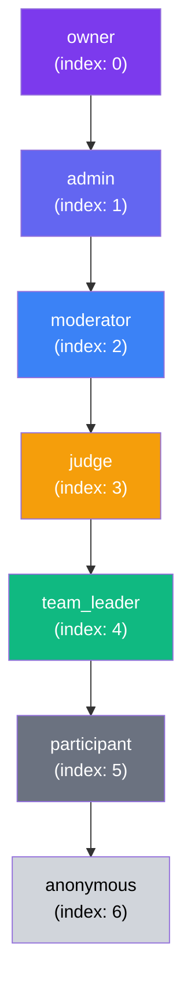
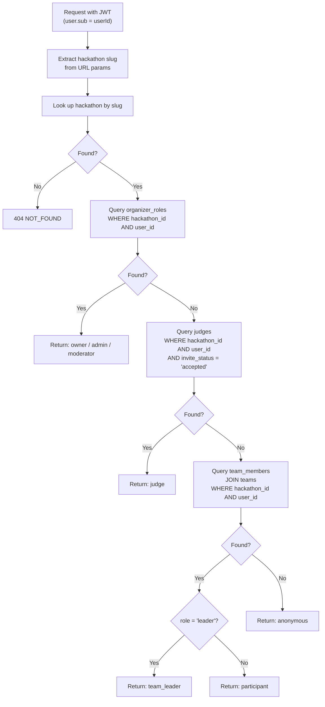
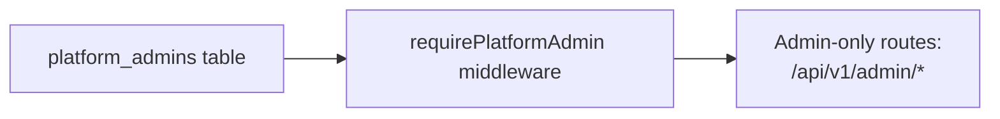
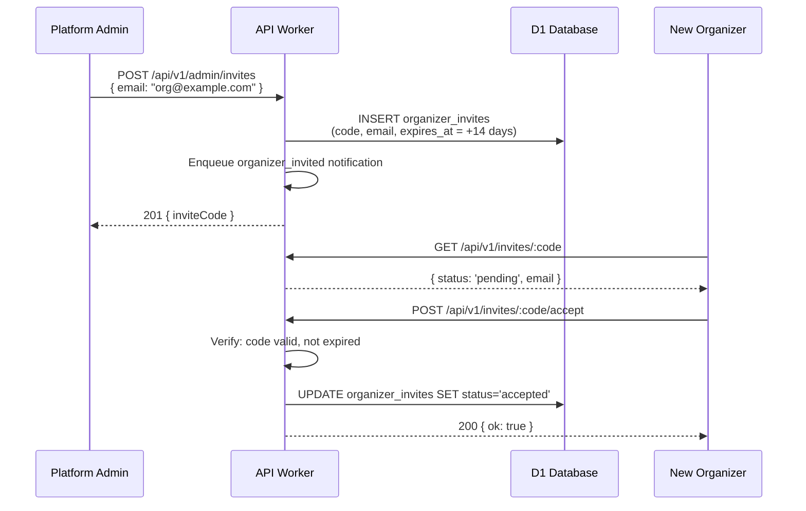
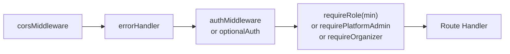
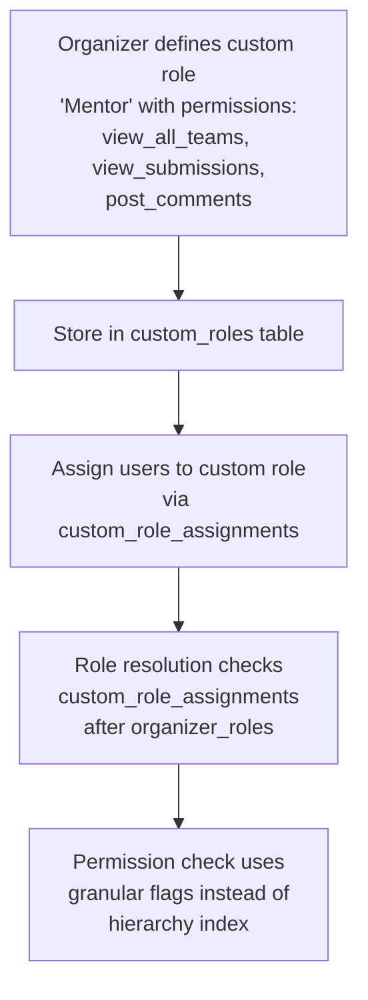
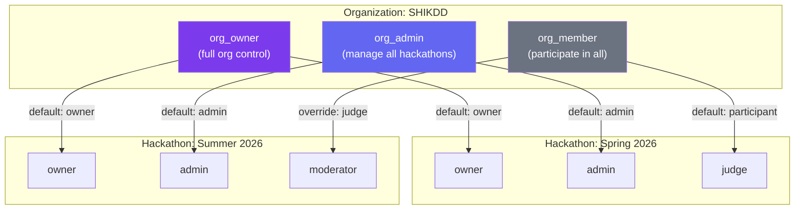

# 06 — Roles & Permissions

> 7-tier per-hackathon role hierarchy resolved per-request via database lookup. Roles are NOT stored in the JWT — a user's role can differ across hackathons.

**Related docs:** [Authentication](./01-authentication.md) | [API Design](./11-api-design.md) | [Data Model](./10-data-model.md)

---

## Role Hierarchy



Higher privilege (lower index) inherits all permissions of lower roles. `requireRole('admin')` grants access to `admin` and `owner`.

---

## Role Definitions

| Role | Source Table | Scope | Description |
|------|-------------|-------|-------------|
| `owner` | `organizer_roles` | Per-hackathon | Created the hackathon. Full control including deletion |
| `admin` | `organizer_roles` | Per-hackathon | Invited organizer with full management access |
| `moderator` | `organizer_roles` | Per-hackathon | Can view all teams, force pushes, activity feeds |
| `judge` | `judges` | Per-hackathon | Invited judge with `invite_status = 'accepted'` |
| `team_leader` | `team_members` | Per-hackathon | Team creator with `role = 'leader'` |
| `participant` | `team_members` | Per-hackathon | Team member with `role = 'member'` |
| `anonymous` | (fallback) | Per-hackathon | Authenticated user with no relationship to the hackathon |

**Note:** `anonymous` here means "authenticated but no role in this hackathon" — not "unauthenticated." Unauthenticated users are blocked by `authMiddleware` before role resolution.

---

## Resolution Algorithm



### Resolution Order (Priority)

1. **organizer_roles** — checked first (highest privilege: owner > admin > moderator)
2. **judges** — only if `invite_status = 'accepted'`
3. **team_members** — joined through `teams` table to match hackathon
4. **Fallback** — `anonymous`

A user can technically exist in multiple tables (e.g., both an organizer and a judge), but the resolution returns the **highest** role found.

---

## Platform Admin (Separate System)

In addition to per-hackathon roles, there's a **platform-level** admin system:



| Field | Description |
|-------|-------------|
| Table | `platform_admins` |
| Scope | Global (not per-hackathon) |
| Check | `requirePlatformAdmin` middleware |
| Routes | `/api/v1/admin/invites`, `/api/v1/admin/admins` |

Platform admins can:
- Create organizer invites
- List/revoke organizer invites
- View all platform admins

---

## Organizer Invite Flow

New organizers join via invite codes (managed by platform admins):



---

## Permission Matrix

| Action | anon | participant | team_leader | judge | mod | admin | owner |
|--------|:----:|:-----------:|:-----------:|:-----:|:---:|:-----:|:-----:|
| View public hackathon info | Y | Y | Y | Y | Y | Y | Y |
| Register team | - | Y | Y | - | - | Y | Y |
| Join team | - | Y | Y | - | - | Y | Y |
| Connect repo | - | - | Y | - | - | Y | Y |
| View own team | - | Y | Y | - | - | Y | Y |
| View all teams | - | - | - | - | Y | Y | Y |
| View own submissions | - | Y | Y | - | - | Y | Y |
| View all submissions | - | - | - | assigned | Y | Y | Y |
| Finalize submission | - | - | Y | - | - | Y | Y |
| Score submissions | - | - | - | Y | - | - | - |
| View commit log (own) | - | Y | Y | - | - | Y | Y |
| View commit log (all) | - | - | - | assigned | Y | Y | Y |
| View force pushes | - | - | - | - | Y | Y | Y |
| View leaderboard | * | * | * | * | Y | Y | Y |
| Edit hackathon config | - | - | - | - | - | Y | Y |
| Manage judges | - | - | - | - | - | Y | Y |
| Set rubric | - | - | - | - | - | Y | Y |
| Transition phase | - | - | - | - | - | Y | Y |
| Delete hackathon | - | - | - | - | - | - | Y |

*Leaderboard visibility depends on hackathon status (see [05-judging.md](./05-judging.md)).

---

## Middleware Implementation

### `requireRole(minRole)`

Applied per-route to enforce minimum role:

```typescript
// Usage in route file:
app.get('/teams', optionalAuth, requireRole('anonymous'), handler);     // Public
app.post('/teams', authMiddleware, requireRole('participant'), handler); // Auth + role
app.put('/', authMiddleware, requireRole('admin'), handler);            // Admin only
app.delete('/', authMiddleware, requireRole('owner'), handler);         // Owner only
```

### Middleware Chain Order



### What `requireRole` Sets on Context

| Key | Type | Value |
|-----|------|-------|
| `c.get('user')` | `JWTPayload` | From auth middleware |
| `c.get('hackathon')` | `Hackathon` | Looked up by slug |
| `c.get('role')` | `Role` | Resolved via `resolveRole()` |

---

## Additional Middleware

### `requireOrganizer`

Checks if user is a platform admin OR has an accepted organizer invite. Used for hackathon creation (before any hackathon-specific role exists).

### `requirePlatformAdmin`

Checks `platform_admins` table. Used exclusively for `/api/v1/admin/*` routes.

---

## Key Design Decisions

| Decision | Rationale |
|----------|-----------|
| Roles NOT in JWT | A user's role differs per hackathon. Embedding roles would require token refresh on every role change |
| Per-request resolution | Always accurate. No stale role data. ~1 DB query per request |
| Highest-wins resolution | User who is both an organizer and a judge gets `admin` (not `judge`) |
| `anonymous` means authenticated | Unauthenticated users are blocked at the auth middleware layer |
| Platform admin is separate | Global admin ≠ per-hackathon admin. Different concern, different table |

---

## v3 Planned Enhancements

### Custom Roles

Allow organizers to define custom roles with granular permissions beyond the fixed 7-tier hierarchy. Custom roles are scoped to a single hackathon and defined as a named set of permission flags. The organizer creates a custom role via `POST /api/v1/hackathons/:slug/roles` with a name and a permissions object. Users assigned to a custom role are stored in a `custom_role_assignments` table. During role resolution, custom roles are checked after `organizer_roles` but before `judges`, and their effective permission level is determined by the highest permission flag in their set.



| Field | Table | Description |
|-------|-------|-------------|
| `id` | `custom_roles` | Role identifier |
| `hackathon_id` | `custom_roles` | Scoped to one hackathon |
| `name` | `custom_roles` | Display name (e.g., "Mentor", "Sponsor Rep") |
| `permissions` | `custom_roles` | JSON object of permission flags |
| `base_level` | `custom_roles` | Equivalent hierarchy level for `requireRole()` compatibility (e.g., 3 = judge-equivalent) |

Permission flags (granular):

| Flag | Description |
|------|-------------|
| `view_all_teams` | See all teams and their members |
| `view_all_submissions` | See all submissions regardless of assignment |
| `score_submissions` | Submit scores (judge capability) |
| `manage_teams` | Approve join requests, merge teams |
| `manage_judges` | Invite/remove judges |
| `edit_config` | Edit hackathon configuration |
| `transition_phase` | Trigger phase transitions |
| `post_comments` | Comment on submissions (advisory, non-scoring) |
| `view_audit_log` | Access audit trail |

### Role-Based Dashboards

Render different dashboard views based on the user's resolved role. Instead of a single dashboard with conditional sections, each role gets a purpose-built view with relevant widgets, navigation, and data. The frontend queries `GET /auth/me` (which now includes the resolved role for the current hackathon context) and renders the appropriate dashboard layout. This reduces cognitive load and ensures each role sees only what they need.

| Role | Dashboard View | Key Widgets |
|------|---------------|-------------|
| `owner` / `admin` | Organizer Dashboard | Phase timeline, team overview, judge progress, submission stats, audit feed |
| `moderator` | Moderation Dashboard | Force push alerts, activity feed, team browser, flagged submissions |
| `judge` | Judge Dashboard | Assigned submissions, scoring progress, calibration status, rubric reference |
| `team_leader` | Team Dashboard | Team members, repo status, submission history, bot activity, chat |
| `participant` | Participant Dashboard | Team info, submission status, hackathon timeline, announcements |
| `anonymous` | Public View | Hackathon info, registration CTA, public leaderboard (if completed) |

### Temporary Role Elevation

Support time-boxed role elevation for volunteers and temporary staff. An admin can grant a user elevated permissions for a specified duration (e.g., "moderator for 4 hours during the event"). The elevation is stored in a `role_elevations` table with an `expires_at` timestamp. The role resolution algorithm checks active elevations before falling back to the standard resolution chain. Expired elevations are automatically ignored (no cleanup job needed — the query filters by `expires_at > now()`).

| Field | Type | Description |
|-------|------|-------------|
| `id` | TEXT PK | Elevation record ID |
| `hackathon_id` | TEXT FK | Scoped to one hackathon |
| `user_id` | TEXT FK | Elevated user |
| `elevated_role` | TEXT | Target role (e.g., "moderator", "admin") |
| `granted_by` | TEXT FK | Admin who granted the elevation |
| `granted_at` | ISO-8601 | When elevation was granted |
| `expires_at` | ISO-8601 | When elevation expires |
| `reason` | TEXT | Why the elevation was granted (audit trail) |
| `revoked_at` | ISO-8601 | Null unless manually revoked early |

Resolution order update:
1. `role_elevations` (active, not expired, not revoked) -- **new, checked first**
2. `organizer_roles`
3. `judges`
4. `team_members`
5. Fallback: `anonymous`

### API Key Authentication for Service Accounts

Support API key-based authentication for CI/CD pipelines, external tools, and service integrations. API keys are scoped to a specific hackathon and role level. They are created by admins via `POST /api/v1/hackathons/:slug/api-keys` and stored as SHA-256 hashes in D1. Requests authenticate via the `Authorization: Bearer <api-key>` header. The auth middleware detects the key prefix (`dsk_` for DevSage Key) and resolves the associated role without a JWT.

| Property | Value |
|----------|-------|
| Key format | `dsk_{hackathonSlug}_{randomBytes(32).hex}` |
| Storage | `api_keys` table (id, hackathon_id, key_hash, role, name, created_by, created_at, expires_at, last_used_at) |
| Hash | SHA-256 of the full key (key is shown once at creation, never stored in plaintext) |
| Scope | Per-hackathon, with a fixed role (e.g., `admin`, `moderator`) |
| Rate limit | 100 requests/minute per key (enforced via Cloudflare Rate Limiting) |
| Revocation | `DELETE /api/v1/hackathons/:slug/api-keys/:id` |
| Audit | All API key actions logged with `actor_type: 'api_key'` |

### Organization-Level Roles

Introduce an organization layer above hackathons. An organization groups multiple hackathons under a single entity with shared membership. Organization-level roles (`org_owner`, `org_admin`, `org_member`) grant default permissions across all hackathons within the org. Per-hackathon roles can override org-level defaults (higher privilege wins). This eliminates the need to re-invite the same organizers for every hackathon.



New tables:

| Table | Key Fields |
|-------|-----------|
| `organizations` | id, name, slug, created_at |
| `org_members` | id, org_id, user_id, role (org_owner / org_admin / org_member), joined_at |
| `hackathons.org_id` | FK to organizations (nullable for standalone hackathons) |

Resolution order update (with org roles):
1. `role_elevations` (if active)
2. `organizer_roles` (per-hackathon)
3. `org_members` mapped to hackathon role (if hackathon belongs to an org)
4. `judges`
5. `team_members`
6. Fallback: `anonymous`

### Permission Audit Log

Track all role and permission changes in a dedicated audit stream. Every role assignment, removal, elevation, revocation, API key creation, and custom role modification is logged with the actor, target user, old role, new role, and timestamp. This extends the existing `audit_events` table with new event types specific to permission changes. The log is queryable via `GET /api/v1/hackathons/:slug/audit?category=permissions` and exportable for compliance.

| Event Type | Logged Fields |
|------------|--------------|
| `role_assigned` | actor, target_user, hackathon_id, role, source (organizer_roles / judges / custom) |
| `role_removed` | actor, target_user, hackathon_id, previous_role |
| `role_elevated` | actor, target_user, hackathon_id, elevated_role, expires_at, reason |
| `elevation_revoked` | actor, target_user, hackathon_id, elevated_role, revoked_at |
| `api_key_created` | actor, hackathon_id, key_name, role, expires_at |
| `api_key_revoked` | actor, hackathon_id, key_name |
| `custom_role_created` | actor, hackathon_id, role_name, permissions |
| `custom_role_modified` | actor, hackathon_id, role_name, old_permissions, new_permissions |
| `org_member_added` | actor, org_id, target_user, org_role |
| `org_member_removed` | actor, org_id, target_user, previous_org_role |

### Planned Feature Summary

| Feature | Priority | Complexity | New Tables / Columns | Key Dependencies |
|---------|----------|------------|---------------------|------------------|
| Organization-level roles | High | High | `organizations`, `org_members`, `hackathons.org_id` | Role resolution update, org management UI |
| API key authentication | High | Medium | `api_keys` | Auth middleware update, key hashing |
| Permission audit log | High | Low | New event types in `audit_events` | Existing audit infrastructure |
| Custom roles | Medium | High | `custom_roles`, `custom_role_assignments` | Granular permission flags, resolution update |
| Role-based dashboards | Medium | Medium | None | Frontend routing per role, role in `/auth/me` response |
| Temporary role elevation | Low | Medium | `role_elevations` | Resolution order update, expiry filtering |

---

## File References

| File | Purpose |
|------|---------|
| `apps/api/src/middleware/role.ts` | `resolveRole()`, `requireRole()`, `ROLE_HIERARCHY`, `isRoleAtLeast()` |
| `apps/api/src/middleware/auth.ts` | `authMiddleware`, `optionalAuth` |
| `apps/api/src/middleware/platform-admin.ts` | `requirePlatformAdmin` |
| `apps/api/src/middleware/require-organizer.ts` | `requireOrganizer` |
| `packages/shared/src/schemas/constants.ts` | `ROLES`, `ORGANIZER_ROLES`, `TEAM_MEMBER_ROLES` |
| `packages/db/src/schema/organizer-roles.ts` | Organizer roles table |
| `packages/db/src/schema/platform-admins.ts` | Platform admins table |
| `packages/db/src/schema/organizer-invites.ts` | Organizer invites table |
| `apps/api/src/routes/admin.ts` | Platform admin routes |
| `apps/api/src/routes/invites.ts` | Organizer invite acceptance |
