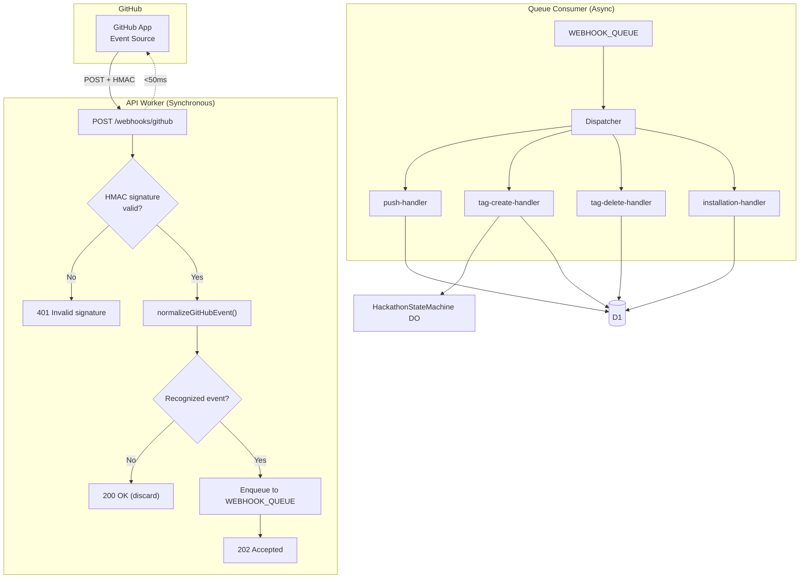
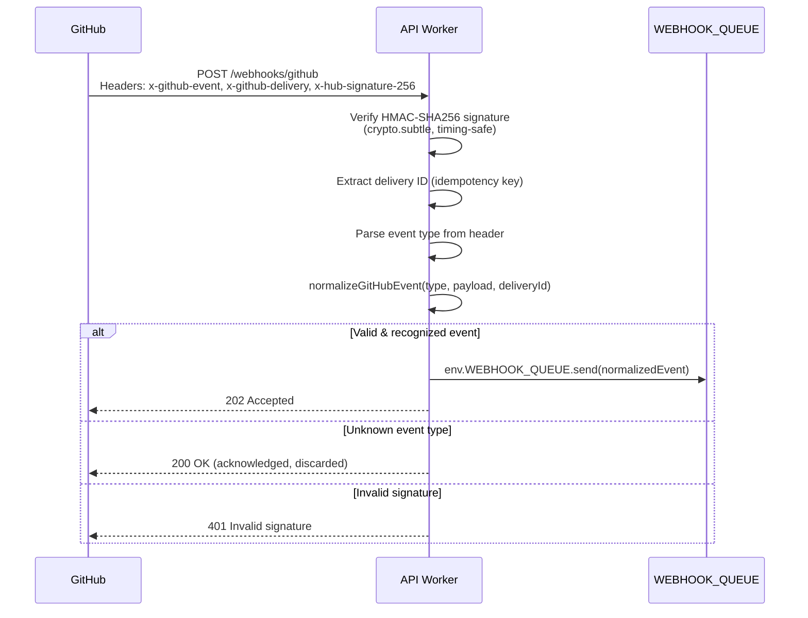
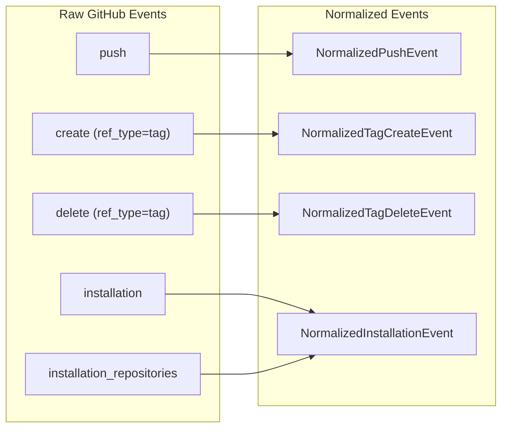
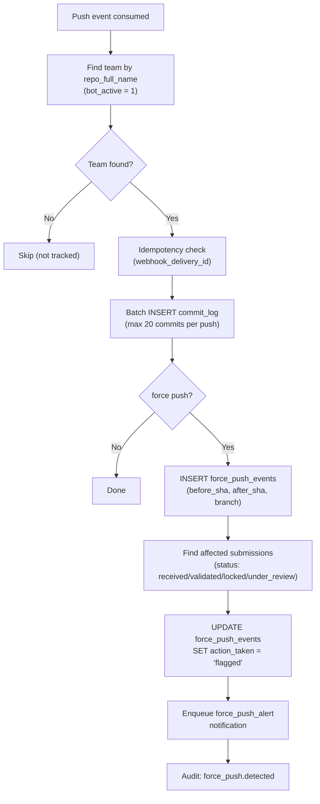
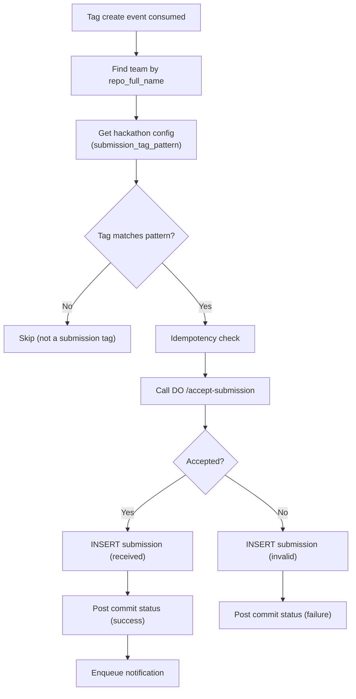
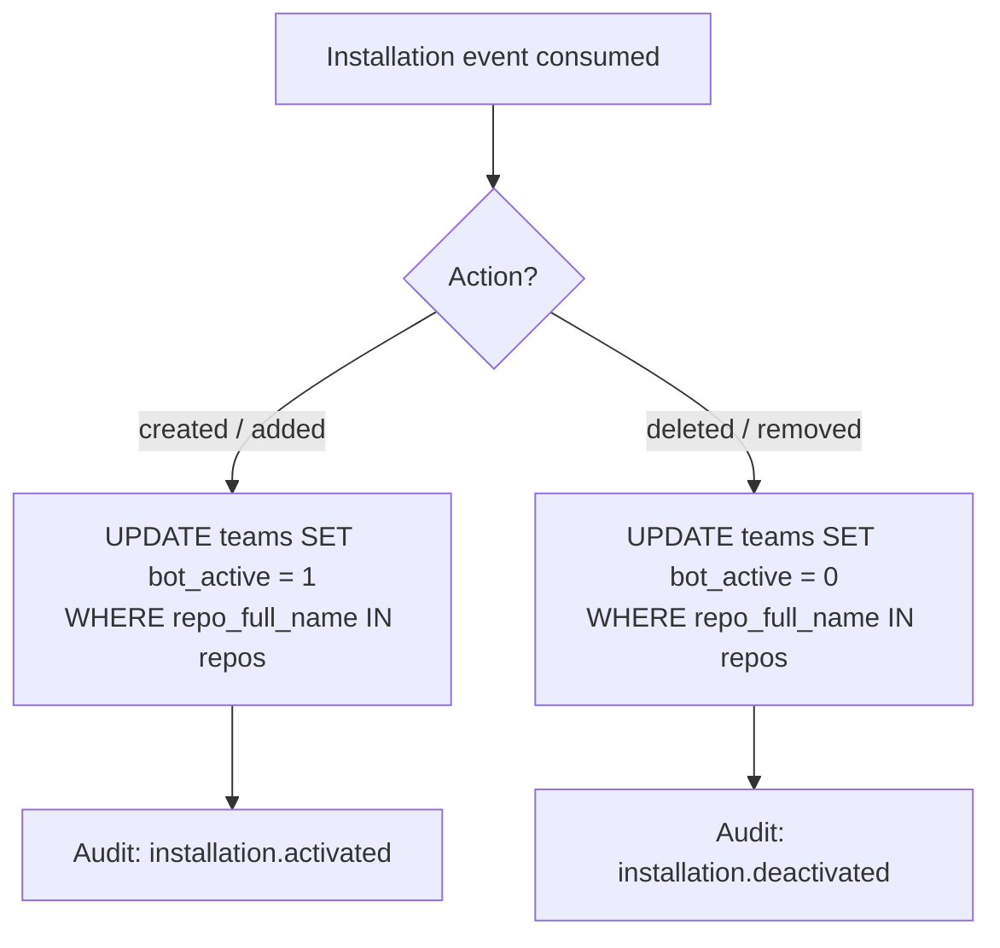
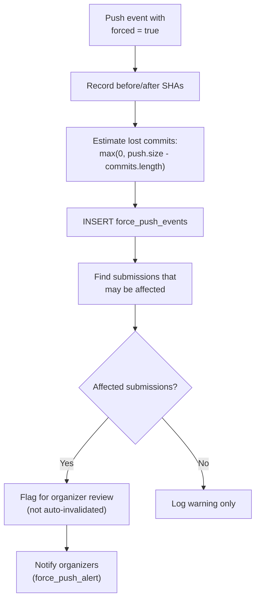
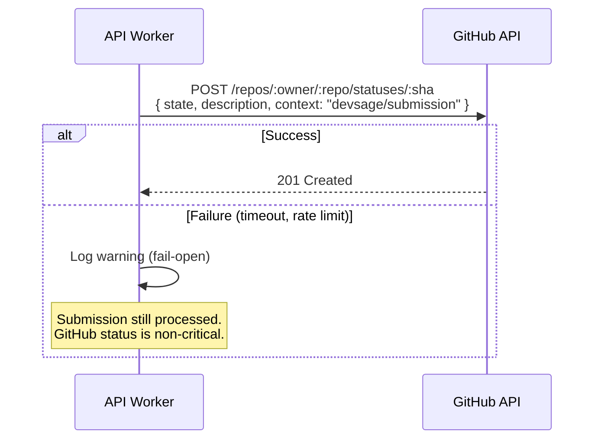
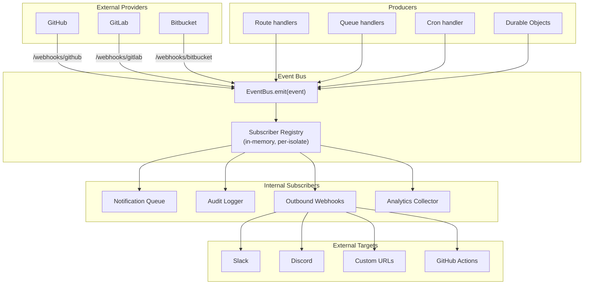

# 07 — Webhooks & GitHub Integration

> A GitHub App tracks commits, detects force pushes, captures tag-based submissions, and manages bot installation — all through an asynchronous webhook pipeline with HMAC verification, event normalization, and queue-based processing.

**Related docs:** [Submissions](./04-submissions.md) | [Notifications](./08-notifications.md) | [Infrastructure](./12-infrastructure.md)

---

## GitHub App Configuration

| Property | Value |
|----------|-------|
| Webhook URL | `https://api.devsage.org/webhooks/github` |
| Permissions | Contents (Read), Metadata (Read) |
| Subscribed Events | `push`, `create`, `delete`, `installation`, `installation_repositories` |
| Authentication | HMAC-SHA256 signature verification |

---

## Webhook Pipeline Architecture

**Design principle:** The synchronous webhook handler is deliberately minimal — verify, normalize, enqueue. No D1 writes, no GitHub API calls, no business logic. Target: <50ms wall-clock.

---

## Webhook Ingestion (Synchronous)

---

## Event Normalization

`normalizeGitHubEvent()` transforms raw GitHub payloads into typed internal events:

### Event Types

| Normalized Type | Source Event | Key Fields |
|----------------|-------------|------------|
| `push` | `push` | `repoFullName`, `branch`, `forced`, `commits[]`, `headSha`, `beforeSha` |
| `tag_created` | `create` (tag) | `repoFullName`, `tagName`, `sha`, `senderLogin` |
| `tag_deleted` | `delete` (tag) | `repoFullName`, `tagName`, `senderLogin` |
| `installation` | `installation` / `installation_repositories` | `action`, `installationId`, `repositories[]` |

---

## Queue Handlers

### Push Handler

Processes push events — logs commits and detects force pushes.

### Tag Create Handler

Processes tag creation events — submission flow. See [04-submissions.md](./04-submissions.md) for the full flow.

### Tag Delete Handler

Minimal: logs the deletion event for audit trail.

### Installation Handler

Manages bot activation when the GitHub App is installed/uninstalled:

---

## Force Push Detection

**Key design decision:** Force pushes are **flagged for organizer review**, not auto-invalidated. This is because verifying commit ancestry would require GitHub API calls that may be rate-limited or fail.

---

## Commit Status Posting

After processing submissions, the API posts status checks back to GitHub:

| Outcome | State | Description |
|---------|-------|-------------|
| Submission accepted | `success` | "Submission submission_v1 received by DevSage" |
| Submission rejected | `failure` | "Submission rejected: Deadline passed" |

**Fail-open:** 10-second timeout via AbortController. If GitHub API is down, submission processing continues normally.

---

## Queue Configuration

| Queue | Binding | Max Batch | Max Retries | Retry Backoff |
|-------|---------|-----------|-------------|---------------|
| `github-webhooks` | `WEBHOOK_QUEUE` | 10 | 3 | Exponential (base × attempts, max 5min) |
| `devsage-notifications` | `NOTIFICATION_QUEUE` | 10 | 3 | Exponential (base × attempts, max 5min) |

### Dead Letter Handling

After `max_retries` failures:
1. Message is acknowledged (removed from queue)
2. Audit event logged: `webhook.dead_lettered`
3. Organizer dashboard shows "unprocessed webhook" indicator

---

## Idempotency Guarantees

| Layer | Key | Mechanism |
|-------|-----|-----------|
| Webhook handler | `x-github-delivery` header | Passed through to queue message |
| Queue handler | `webhook_delivery_id` | Pre-check query before processing |
| D1 submissions | `UNIQUE(webhook_delivery_id)` | DB constraint prevents duplicates |
| DO submission locks | `UNIQUE(webhook_delivery_id)` | DO SQLite constraint |
| D1 submissions | `UNIQUE(team_id, tag_name)` | One submission per tag per team |

GitHub may redeliver webhooks up to 3 times. All handlers are safe for redelivery.

---

## v3 Planned Enhancements

### Multi-Provider VCS Support

v2 is GitHub-only. v3 extends the webhook pipeline to accept events from GitLab and Bitbucket, unifying them through the existing normalization layer.

| Provider | Webhook Format | Auth Mechanism | Normalized Into |
|----------|---------------|----------------|-----------------|
| GitHub | JSON, `x-github-event` header | HMAC-SHA256 (`x-hub-signature-256`) | Existing normalized types |
| GitLab | JSON, `X-Gitlab-Event` header | Secret token (`X-Gitlab-Token`) | Same normalized types |
| Bitbucket | JSON, `X-Event-Key` header | HMAC-SHA256 (`X-Hub-Signature`) | Same normalized types |

Each provider gets its own ingestion endpoint (`/webhooks/github`, `/webhooks/gitlab`, `/webhooks/bitbucket`) with provider-specific signature verification, but all events flow through a single `normalizeVCSEvent()` function that maps provider-specific payloads into the existing `NormalizedPushEvent`, `NormalizedTagCreateEvent`, etc. The queue handlers remain unchanged — they only see normalized events.

### Outbound Webhooks

v2 only receives webhooks. v3 adds outbound webhook delivery — organizers can register external URLs to receive DevSage events (submission received, phase transition, scores finalized, etc.).

| Feature | Implementation |
|---------|---------------|
| Registration | Organizers configure webhook URLs per hackathon via dashboard |
| Payload format | Standard JSON envelope matching the internal event schema |
| Signing | HMAC-SHA256 with per-registration secret, sent in `X-DevSage-Signature` header |
| Delivery | Enqueued to a new `OUTBOUND_WEBHOOK_QUEUE`, processed asynchronously |
| Retry policy | 3 retries with exponential backoff (10s, 30s, 90s) |
| Timeout | 10-second AbortController per delivery attempt |

Built-in integrations for Slack (incoming webhook URL) and Discord (webhook URL) are provided as first-class presets — organizers paste a webhook URL and select the event types to forward.

### Webhook Dashboard

A new organizer-facing dashboard for monitoring webhook health:

| Feature | Description |
|---------|-------------|
| Delivery history | Paginated list of all inbound and outbound webhook deliveries |
| Payload inspector | View raw request/response bodies for any delivery |
| Retry controls | Manual retry button for failed deliveries |
| Status indicators | Success rate, average latency, error breakdown per endpoint |
| Filtering | Filter by event type, status (success/failed/pending), date range |

Delivery records are stored in a new `webhook_deliveries` table with a 30-day retention policy. Older records are archived to R2 as compressed JSON.

### GitHub Actions Integration

Organizers can configure GitHub Actions workflows to trigger on DevSage events:

| Trigger Event | GitHub Actions Use Case |
|---------------|----------------------|
| `submission.received` | Run automated test suite against the submitted commit |
| `submission.finalized` | Build and deploy a preview of the submission |
| `phase_transition` to JUDGING | Generate submission summary reports |

Implementation uses the GitHub API `POST /repos/:owner/:repo/dispatches` endpoint with a `repository_dispatch` event type. The dispatch payload includes the full normalized event data. Organizers opt in per-hackathon and configure which events trigger dispatches.

### Event Bus Architecture

v2 uses direct `env.QUEUE.send()` calls scattered across route handlers and queue consumers. v3 introduces an internal event bus that decouples event producers from consumers.

The event bus is a lightweight in-process abstraction — not a separate service. `EventBus.emit()` iterates over registered subscribers synchronously, and each subscriber decides whether to enqueue to a Cloudflare Queue or handle inline. This keeps the architecture simple while eliminating direct coupling between producers and consumers.

### Integration Marketplace

v3 lays the groundwork for a third-party integration system where external apps can subscribe to DevSage events:

| Component | Description |
|-----------|-------------|
| App registration | Developers register apps with a callback URL, requested event scopes, and OAuth client credentials |
| Event scopes | Granular permissions: `hackathon.read`, `submission.events`, `judging.events`, `team.events` |
| OAuth 2.0 flow | Apps authenticate via standard OAuth 2.0 authorization code flow |
| Webhook delivery | Events matching the app's scopes are delivered to its registered callback URL |
| Rate limiting | Per-app rate limits (100 deliveries/minute default) with backpressure |
| App directory | Organizers browse and install approved integrations from a marketplace UI |

This is a v3-late or v4-early feature. The event bus architecture is designed to support it — adding a new subscriber type that routes events to registered third-party apps requires no changes to the core event pipeline.

### v3 Webhook Feature Summary

| Feature | Priority | Complexity | Dependencies |
|---------|----------|-----------|--------------|
| GitLab + Bitbucket support | High | Medium | New normalizer functions, new ingestion routes |
| Outbound webhooks (Slack, Discord, custom) | High | Medium | New queue, `webhook_deliveries` table, organizer UI |
| Webhook dashboard | Medium | Medium | `webhook_deliveries` table, admin UI components |
| GitHub Actions integration | Medium | Low | GitHub API `repository_dispatch`, per-hackathon config |
| Event bus architecture | High | High | Refactor all `QUEUE.send()` calls, subscriber registry |
| Integration marketplace | Low | High | OAuth 2.0 provider, app registry, scope system |

---

## File References

| File | Purpose |
|------|---------|
| `apps/api/src/routes/webhooks.ts` | Webhook ingestion endpoint with HMAC verification |
| `apps/api/src/lib/webhook-normalize.ts` | `normalizeGitHubEvent()` — typed event normalization |
| `apps/api/src/queue/index.ts` | Queue dispatcher routing |
| `apps/api/src/queue/push-handler.ts` | Commit logging + force push detection |
| `apps/api/src/queue/tag-create-handler.ts` | Submission processing pipeline |
| `apps/api/src/queue/tag-delete-handler.ts` | Tag deletion audit |
| `apps/api/src/queue/installation-handler.ts` | Bot activation/deactivation |
| `apps/api/src/services/github.ts` | `postCommitStatus()` — fail-open GitHub API client |
| `packages/db/src/schema/commit-log.ts` | Commit log table |
| `packages/db/src/schema/force-push-events.ts` | Force push events table |
