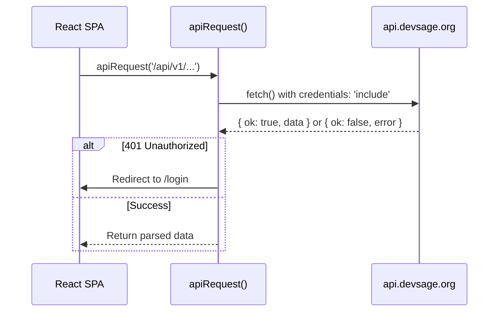

# 08 — Admin Dashboard & Main Site

> The Admin Dashboard at `admin.devsage.org` is the internal DevSage team portal for platform-wide management — organizer invites and admin oversight. The Main Site at `devsage.org` is the public-facing landing page and participant hub — hackathon discovery, team management, and leaderboards.

**Related docs:** [System Overview](./00-overview.md) | [Authentication](./01-authentication.md) | [Organizer Platform](./07-organizer-platform.md) | [Roles & Permissions](./10-roles-permissions.md) | [API Design](./04-api-design.md)

---

## Admin Dashboard (`admin.devsage.org`)

### Purpose

The Admin Dashboard is a lightweight internal tool for the DevSage team. It handles two responsibilities: managing organizer invitations (creating, revoking, tracking) and viewing the list of platform administrators. Only users in the `platform_admins` table can access it.

---

### Tech Stack

| Layer | Technology |
|-------|------------|
| Framework | React 18 |
| Build | Vite |
| Styling | Tailwind CSS v4 |
| Components | shadcn/ui (Radix + CVA) |
| Routing | React Router (v7) |
| Notifications | Sonner (toast) |
| Icons | Lucide React |
| API Client | `apiRequest()` wrapper with `credentials: 'include'` |
| Deployment | Cloudflare Workers Static Assets |

---

### Authentication

The admin dashboard uses the same cross-subdomain cookie authentication as all DevSage surfaces:

1. User visits `admin.devsage.org` — redirected to `/login` if not authenticated
2. OAuth login via `api.devsage.org/auth/github` (or `/auth/google`) with `redirect_to=admin.devsage.org`
3. JWT cookie set with `Domain=.devsage.org`, sent on all subsequent requests
4. `AuthProvider` hydrates user state via `GET /auth/me`
5. All protected routes additionally require `requirePlatformAdmin` middleware on the API side, which checks the `platform_admins` table

If the authenticated user is not a platform admin, API requests return 403 and the dashboard is inaccessible.

---

### Route Structure

```
admin.devsage.org/
├── /login                # Public — OAuth login page
├── /invites              # Protected — Organizer invite management (default page)
├── /admins               # Protected — Platform admin list
└── /profile              # Protected — User profile
```

The root path (`/`) redirects to `/invites`. Unmatched paths redirect to `/`.

---

### Pages

#### Invites Page (`/invites`)

The primary page of the admin dashboard. Manages organizer invitations — the mechanism by which the DevSage team grants organizer access to external users.

**Features:**
- **Invite table** — Lists all organizer invites with columns: email, invite code, status badge, and created date
- **Status badges** — Color-coded by state: pending (yellow), accepted (green), expired (gray), revoked (red)
- **New Invite dialog** — Button opens a modal to create an invite by entering an email address. Calls `POST /api/v1/admin/invites`
- **Revoke action** — Pending invites display a trash icon button that revokes the invite via `DELETE /api/v1/admin/invites/:id`
- **Copy to clipboard** — Invite codes can be copied with a single click
- **Pagination** — 10 invites per page

**API calls:**
- `GET /api/v1/admin/invites` — List all organizer invites
- `POST /api/v1/admin/invites` — Create a new invite by email
- `DELETE /api/v1/admin/invites/:id` — Revoke a pending invite

#### Admins Page (`/admins`)

A read-only view of all platform administrators.

**Features:**
- **Admin table** — Displays avatar, display name, GitHub username (linked to profile), email, and joined date
- No create/delete actions — admin management is handled outside the dashboard

**API calls:**
- `GET /api/v1/admin/admins` — List all platform admins

#### Login (`/login`)

OAuth login page with GitHub and Google sign-in options. Same pattern as the organizer platform — redirects to `api.devsage.org/auth/github` or `/auth/google` with the appropriate `redirect_to` parameter.

#### Profile (`/profile`)

User profile page for viewing account settings. Same pattern as the organizer platform.

---

### Component Architecture

```
App.tsx
├── LoginPage                 (public)
└── ProtectedRoute
    └── DashboardLayout       (navbar + outlet)
        ├── InvitesPage       (invite management)
        ├── AdminsPage        (admin list)
        └── ProfilePage       (user settings)
```

---

### API Routes

All admin API routes require both `authMiddleware` and `requirePlatformAdmin`:

| Method | Route | Purpose |
|--------|-------|---------|
| `POST` | `/api/v1/admin/invites` | Create organizer invite |
| `GET` | `/api/v1/admin/invites` | List all organizer invites |
| `DELETE` | `/api/v1/admin/invites/:id` | Revoke a pending invite |
| `GET` | `/api/v1/admin/admins` | List platform admins |

---

### Deployment

- **Production:** `pnpm deploy:admin` — deploys to Cloudflare Workers Static Assets at `admin.devsage.org`
- **Local development:** Port `5175`, Vite proxies `/api/v1/*` to `http://localhost:8787`

---

## Main Site (`devsage.org`)

### Purpose

The main site is the public-facing entry point to DevSage. It serves two roles: a marketing landing page for unauthenticated visitors, and a participant dashboard for logged-in users to discover hackathons, manage teams, and view leaderboards.

---

### Tech Stack

| Layer | Technology |
|-------|------------|
| Framework | React 18 |
| Build | Vite |
| Styling | Tailwind CSS v4 |
| Components | shadcn/ui (Radix + CVA) |
| Routing | React Router (v7) |
| Animations | Framer Motion |
| Notifications | Sonner (toast) |
| Icons | Lucide React |
| API Client | `apiRequest()` wrapper with `credentials: 'include'` |
| Deployment | Cloudflare Workers Static Assets |

---

### Authentication

Same cross-subdomain cookie authentication as all surfaces:

1. User clicks "Login" on `devsage.org`
2. Redirected to `api.devsage.org/auth/github` (or `/auth/google`) with `redirect_to=devsage.org`
3. OAuth completes, API sets JWT in HttpOnly cookie with `Domain=.devsage.org`
4. `AuthProvider` hydrates user state via `GET /auth/me`
5. `<ProtectedRoute>` component guards authenticated routes, redirecting to `/login` if unauthenticated

---

### Route Structure

```
devsage.org/
├── /                           # Public — Landing page (hero, bento grid, gallery)
├── /login                      # Public — OAuth login
├── /auth/callback              # Public — OAuth callback handler
├── /link-required              # Public — Google account linking required page
├── /about                      # Public — About page
│
├── /dashboard                  # Protected — User's hackathon list
├── /hackathons/:slug           # Protected — Hackathon detail page
├── /hackathons/:slug/teams     # Protected — Team management
├── /hackathons/:slug/leaderboard # Protected — Leaderboard
└── /profile                    # Protected — User profile
```

---

### Pages

#### Home (`/`)

The landing page (1054 LOC) — the first thing visitors see. A dark-themed, animation-heavy showcase of the platform.

**Sections:**
- **Hero** — Full-viewport intro with animated heading and call-to-action
- **Bento grid** — Feature showcase laid out in a CSS grid with varying card sizes
- **Project gallery** — Scrollable gallery of past hackathon projects
- **Animated cursor** — Custom cursor effect for visual polish

Uses Framer Motion for page transitions and scroll-triggered animations.

#### Dashboard (`/dashboard`)

The authenticated user's home page. Lists hackathons the user is participating in or can discover.

**Features:**
- **Hackathon list** — Cards showing hackathon title, description, status, and dates
- **Tab filtering** — Filter by participation status (e.g., active, completed)
- **Discovery** — Browse available hackathons to join

#### Hackathon Detail (`/hackathons/:slug`)

Detailed view of a single hackathon from the participant perspective.

#### Team Management (`/hackathons/:slug/teams`)

Team creation, joining, and repository linking for a specific hackathon.

**Features:**
- **Create team** — Form to create a new team with a name
- **Join team** — Enter an invite code to join an existing team
- **Link repository** — Connect a GitHub repository to the team for submission tracking

#### Leaderboard (`/hackathons/:slug/leaderboard`)

Displays the weighted scoring results for a hackathon.

**Features:**
- **Ranked standings** — Teams ranked by weighted score across all rubric criteria
- **Score breakdown** — Per-criterion scores with weights applied

#### Profile (`/profile`)

User profile page for viewing and managing account settings.

#### About (`/about`)

Static about page with platform information.

#### Login (`/login`)

OAuth login page with GitHub and Google sign-in options.

#### Auth Callback (`/auth/callback`)

Handles the OAuth callback redirect, extracts the token, and redirects to the appropriate page.

#### Link Required (`/link-required`)

Displayed when a Google OAuth login requires linking to an existing account (e.g., when the email matches a GitHub-authenticated account).

#### Not Found

Catch-all page for unmatched routes.

---

### Component Architecture

```
App.tsx (with Suspense + lazy loading)
├── HomePage                   (public, lazy-loaded)
├── LoginPage                  (public)
├── AuthCallbackPage           (public)
├── LinkRequiredPage           (public)
├── AboutPage                  (public)
│
└── ProtectedRoute
    └── DashboardLayout        (sticky navbar + profile dropdown + Outlet)
        ├── DashboardPage      (lazy-loaded)
        ├── HackathonDetailPage (lazy-loaded)
        ├── TeamManagementPage
        ├── LeaderboardPage
        └── ProfilePage        (lazy-loaded)
```

---

### Code Splitting

The main site uses `React.lazy()` for route-level code splitting to reduce the initial bundle size:

| Page | Lazy-loaded |
|------|-------------|
| HomePage | Yes |
| DashboardPage | Yes |
| HackathonDetailPage | Yes |
| ProfilePage | Yes |
| TeamManagementPage | No |
| LeaderboardPage | No |
| LoginPage | No |
| AuthCallbackPage | No |

All lazy-loaded routes are wrapped in a `<Suspense>` boundary at the `App.tsx` level.

---

### Design

| Aspect | Detail |
|--------|--------|
| Theme | Dark theme throughout |
| Accent color | `#CCFF00` |
| Animations | Framer Motion page transitions and scroll effects |
| Layout | Sticky navbar with profile dropdown, full-width content area |

---

### Deployment

- **Production:** `pnpm deploy:web` — deploys to Cloudflare Workers Static Assets at `devsage.org`
- **Local development:** Port `5173`, Vite proxies `/api/v1/*`, `/auth/*`, `/hackathons/*`, `/webhooks/*` to `http://localhost:8787`

---

## API Integration (Shared Pattern)

Both the admin dashboard and main site use the same `apiRequest()` wrapper pattern:



**Shared behaviors:**
- Sends cookies automatically (`credentials: 'include'`)
- Auto-redirects to `/login` on 401 responses
- Prepends `VITE_API_ORIGIN` in production (`https://api.devsage.org`)
- In development, Vite proxies API paths to `http://localhost:8787`
- All responses follow the standard envelope: `{ ok, data, meta }` or `{ ok, error: { code, message } }`

---

## Admin vs. Main Site Comparison

| Aspect | Admin Dashboard | Main Site |
|--------|----------------|-----------|
| URL | `admin.devsage.org` | `devsage.org` |
| Source | `apps/admin/` | `apps/web/` |
| Audience | DevSage team only | Public + participants |
| Auth guard | `requirePlatformAdmin` (API-side) | `ProtectedRoute` (client-side) |
| Routes | 4 | 10 |
| Code splitting | No | Yes (`React.lazy()`) |
| Animations | No | Yes (Framer Motion) |
| Dev port | 5175 | 5173 |
| Complexity | Low (~4 pages) | Medium (~10 pages, 1054 LOC home) |

---

## File References

| File | Purpose |
|------|---------|
| `apps/admin/src/App.tsx` | Admin route definitions |
| `apps/admin/src/pages/invites.tsx` | Organizer invite management (284 LOC) |
| `apps/admin/src/pages/admins.tsx` | Platform admin list (134 LOC) |
| `apps/admin/src/components/protected-route.tsx` | Auth guard (requires platform admin) |
| `apps/admin/src/components/dashboard-layout.tsx` | Shared layout with navigation |
| `apps/admin/src/contexts/auth-context.tsx` | Auth state management |
| `apps/admin/src/lib/api.ts` | API request wrapper |
| `apps/web/src/App.tsx` | Web route definitions (44 LOC, with lazy loading) |
| `apps/web/src/pages/home.tsx` | Landing page (1054 LOC) |
| `apps/web/src/pages/dashboard.tsx` | User dashboard |
| `apps/web/src/pages/hackathon-detail.tsx` | Hackathon detail |
| `apps/web/src/pages/team-management.tsx` | Team creation/joining/repo linking |
| `apps/web/src/pages/leaderboard.tsx` | Weighted scoring results |
| `apps/web/src/components/protected-route.tsx` | Auth guard with allowedRoles |
| `apps/web/src/components/dashboard-layout.tsx` | Shared layout |
| `apps/web/src/contexts/auth-context.tsx` | Auth state management |
| `apps/web/src/lib/api.ts` | API request wrapper |
