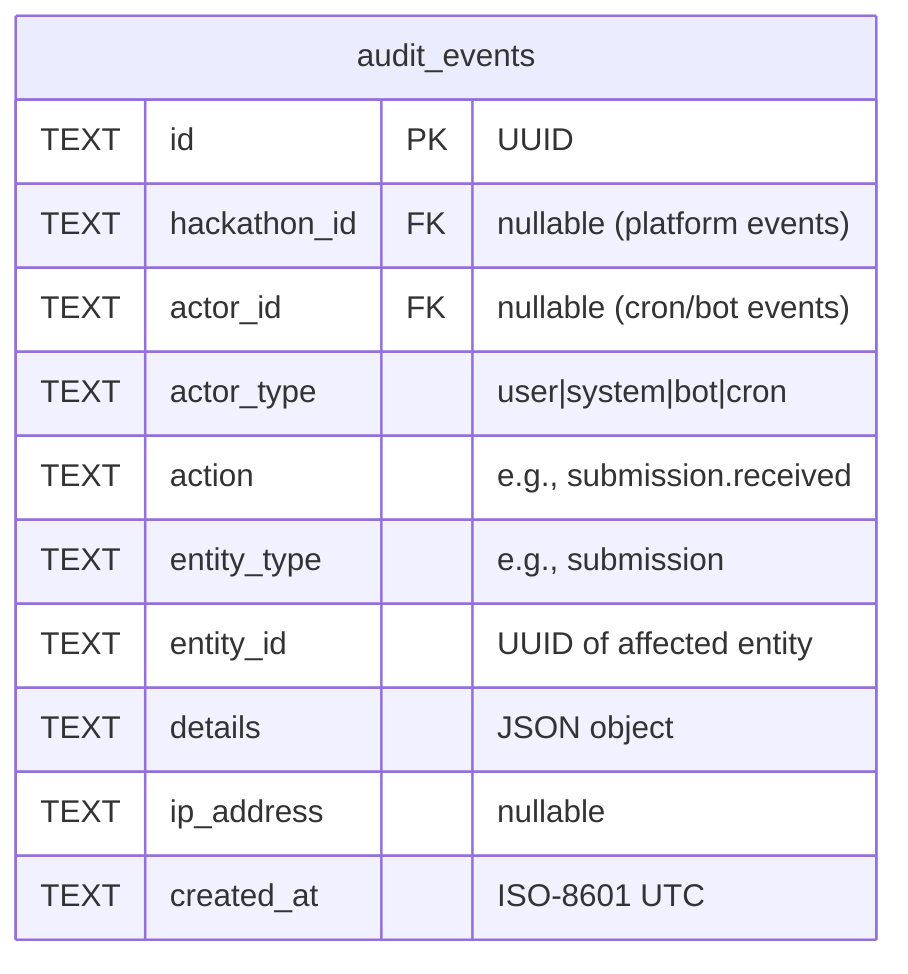
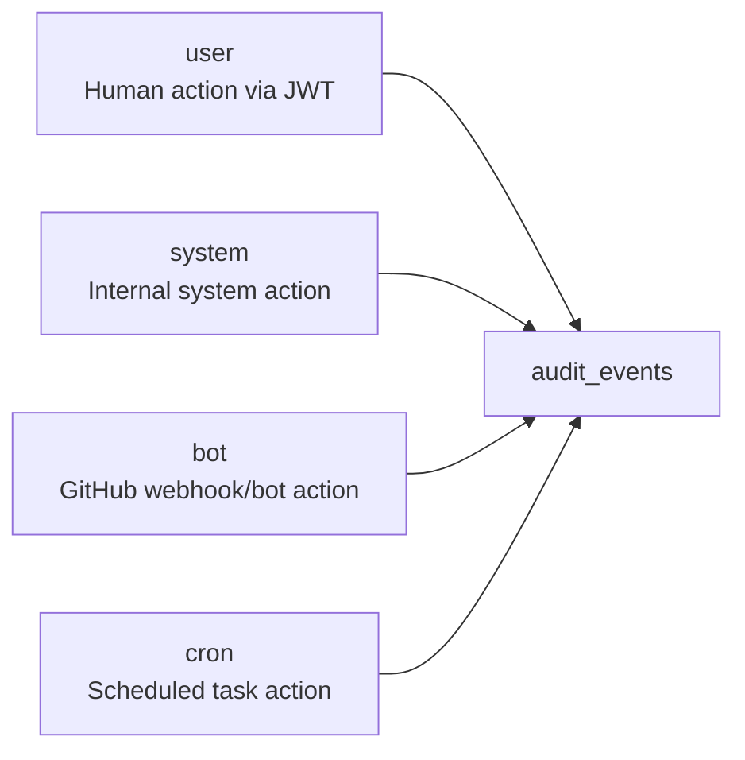
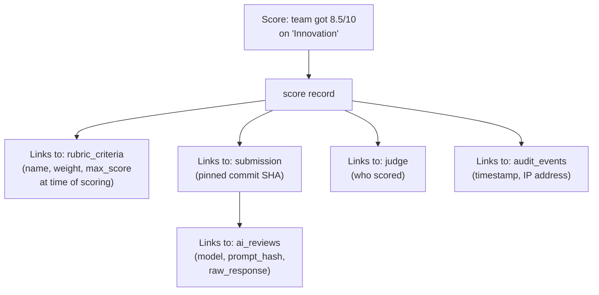
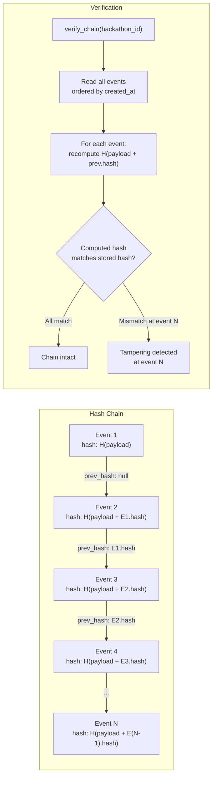

# 09 — Audit Trail

> Every state-changing operation produces an append-only audit event. Events are never updated or deleted. The audit trail enables decision traceability, compliance, and debugging.

**Related docs:** [Roles & Permissions](./06-roles-permissions.md) | [Data Model](./10-data-model.md) | [Submissions](./04-submissions.md)

---

## Design Principles

| Principle | Implementation |
|-----------|---------------|
| **Append-only** | No UPDATE or DELETE on `audit_events` table. Ever. |
| **Fail-open** | `insertAuditEvent()` never throws — logs warning if DB insert fails |
| **Actor attribution** | Every event records WHO (actor_id + actor_type) and WHAT |
| **Context-rich** | JSON `details` field captures action-specific data |
| **Non-blocking** | Audit failures never block the primary operation |

---

## Audit Event Structure



---

## Actor Types



| Actor Type | When | actor_id |
|-----------|------|----------|
| `user` | Human-initiated actions (create, update, delete, score) | User UUID from JWT |
| `system` | Internal system operations (auto-assignment, notifications) | null |
| `bot` | GitHub App webhook-triggered actions (submission, force push) | null |
| `cron` | Scheduled task actions (deadline reminders, auto-transitions) | null |

---

## Event Catalog

### Hackathon Events

| Action | Actor | Entity | Details |
|--------|-------|--------|---------|
| `hackathon.created` | user | hackathon | `{ slug, title }` |
| `hackathon.updated` | user | hackathon | `{ changedFields }` |
| `hackathon.deleted` | user | hackathon | `{ slug }` |
| `hackathon.phase_transitioned` | user/cron | hackathon | `{ from, to }` |

### Team Events

| Action | Actor | Entity | Details |
|--------|-------|--------|---------|
| `team.created` | user | team | `{ name, hackathonId }` |
| `team.joined` | user | team | `{ userId }` |
| `team.member_removed` | user | team | `{ removedUserId, removedBy }` |
| `team.repo_connected` | user | team | `{ repoFullName }` |

### Submission Events

| Action | Actor | Entity | Details |
|--------|-------|--------|---------|
| `submission.received` | bot | submission | `{ tagName, commitSha, version }` |
| `submission.rejected` | bot | submission | `{ tagName, reason }` |
| `submission.finalized` | user | submission | `{ tagName, version }` |

### Force Push Events

| Action | Actor | Entity | Details |
|--------|-------|--------|---------|
| `force_push.detected` | bot | team | `{ before, after, estimatedLost }` |

### Judging Events

| Action | Actor | Entity | Details |
|--------|-------|--------|---------|
| `judge.invited` | user | judge | `{ userId, hackathonId }` |
| `judge.responded` | user | judge | `{ accepted: boolean }` |
| `judge.assigned` | system | judge_assignment | `{ judgeId, teamId, submissionId }` |
| `score.submitted` | user | score | `{ judgeId, criteriaId, score }` |

### Installation Events

| Action | Actor | Entity | Details |
|--------|-------|--------|---------|
| `installation.activated` | bot | team | `{ repos[], installationId }` |
| `installation.deactivated` | bot | team | `{ repos[], installationId }` |

### Tag Events

| Action | Actor | Entity | Details |
|--------|-------|--------|---------|
| `tag.deleted` | bot | team | `{ tagName, repo, sender }` |

### Notification Events

| Action | Actor | Entity | Details |
|--------|-------|--------|---------|
| `notification.sent` | system | notification | `{ type, recipient, subject }` |
| `notification.failed` | system | notification | `{ type, recipient, error }` |

### Cron Events

| Action | Actor | Entity | Details |
|--------|-------|--------|---------|
| `deadline_reminder_24h` | cron | hackathon | `{ hackathonId, deadline }` |
| `deadline_reminder_1h` | cron | hackathon | `{ hackathonId, deadline }` |

### Webhook Events

| Action | Actor | Entity | Details |
|--------|-------|--------|---------|
| `webhook.dead_lettered` | system | webhook | `{ type, deliveryId, attempts }` |

---

## Decision Traceability

Every evaluation decision is fully traceable through the audit trail:



This chain answers:
- **What** was scored? → Exact commit SHA, tag name
- **By whom?** → Judge identity
- **Against what criteria?** → Rubric at time of scoring (with weight)
- **When?** → Timestamp in audit event
- **Was AI involved?** → AI review linked to same submission + commit
- **Was the prompt reproducible?** → Prompt hash stored

---

## Querying the Audit Trail

### Indexes

```sql
CREATE INDEX idx_audit_hackathon ON audit_events(hackathon_id, created_at);
CREATE INDEX idx_audit_entity ON audit_events(entity_type, entity_id);
```

### Common Queries

```sql
-- All events for a hackathon (chronological)
SELECT * FROM audit_events
WHERE hackathon_id = ? ORDER BY created_at DESC;

-- All actions by a specific user
SELECT * FROM audit_events
WHERE actor_id = ? ORDER BY created_at DESC;

-- All events for a specific entity
SELECT * FROM audit_events
WHERE entity_type = 'submission' AND entity_id = ?
ORDER BY created_at;

-- All force push events for a hackathon
SELECT * FROM audit_events
WHERE hackathon_id = ? AND action = 'force_push.detected'
ORDER BY created_at DESC;

-- Idempotency check (used by cron and notifications)
SELECT 1 FROM audit_events
WHERE hackathon_id = ? AND action = ?
LIMIT 1;
```

---

## Implementation

```typescript
// Fail-open: never throws, never blocks
async function insertAuditEvent(db: DbClient, input: {
  hackathonId?: string;
  actorId?: string;
  actorType: 'user' | 'system' | 'bot' | 'cron';
  action: string;
  entityType: string;
  entityId: string;
  details?: Record<string, unknown>;
  ipAddress?: string;
}): Promise<void> {
  try {
    await db.insert(auditEvents).values({
      id: crypto.randomUUID(),
      hackathon_id: input.hackathonId ?? null,
      actor_id: input.actorId ?? null,
      actor_type: input.actorType,
      action: input.action,
      entity_type: input.entityType,
      entity_id: input.entityId,
      details: input.details ? JSON.stringify(input.details) : null,
      ip_address: input.ipAddress ?? null,
    });
  } catch (error) {
    console.warn('Failed to insert audit event:', error);
    // Never throw — audit failure must not block primary operation
  }
}
```

---

## v3 Planned Enhancements

### Audit Trail API

v2 audit events are only queryable via raw SQL. v3 exposes a REST API for organizers and platform admins to search and filter audit records:

| Endpoint | Method | Auth | Description |
|----------|--------|------|-------------|
| `.../:slug/audit` | GET | admin | List audit events for a hackathon (paginated) |
| `.../:slug/audit/:id` | GET | admin | Get single audit event with full details |
| `/api/v1/admin/audit` | GET | platform-admin | Cross-hackathon audit search |

#### Query Parameters

| Parameter | Type | Description |
|-----------|------|-------------|
| `actor_id` | TEXT | Filter by actor UUID |
| `actor_type` | TEXT | Filter by actor type (user/system/bot/cron) |
| `action` | TEXT | Filter by action (exact match or prefix: `submission.*`) |
| `entity_type` | TEXT | Filter by entity type |
| `entity_id` | TEXT | Filter by entity UUID |
| `from` | TEXT | ISO-8601 start date (inclusive) |
| `to` | TEXT | ISO-8601 end date (exclusive) |
| `limit` | INTEGER | 1-100, default 20 |
| `offset` | INTEGER | Default 0 |

Wildcard action filtering uses a `LIKE` query: `action = 'submission.*'` becomes `WHERE action LIKE 'submission.%'`. An additional composite index `idx_audit_action_date ON audit_events(action, created_at)` supports this query pattern efficiently.

### Audit Trail Export

Compliance and reporting require bulk export of audit records:

| Format | Endpoint | Description |
|--------|----------|-------------|
| CSV | `.../:slug/audit/export?format=csv` | Flat CSV with all columns, suitable for spreadsheet analysis |
| JSON | `.../:slug/audit/export?format=json` | JSON array with full `details` objects preserved |

Exports are generated asynchronously for large datasets. The API returns a `202 Accepted` with a download URL that becomes available when the export is complete. Export files are stored in R2 with a 24-hour expiry. A `max_rows` parameter (default 50,000) prevents unbounded exports.

### Real-Time Audit Stream

A WebSocket-based live feed for the admin dashboard:

| Component | Implementation |
|-----------|---------------|
| Connection | `wss://api.devsage.org/ws/audit/:hackathonId` — authenticated via JWT cookie |
| Durable Object | `AuditStreamDO` per hackathon holds open WebSocket connections for subscribed admins |
| Event delivery | `insertAuditEvent()` calls the DO after successful insert to broadcast to connected clients |
| Filtering | Clients send a filter message on connect: `{ actions: ["submission.*"], actor_types: ["user"] }` |
| Backpressure | If a client falls behind (>100 buffered messages), the connection is closed with a reconnect hint |

This enables a real-time activity feed in the organizer dashboard — every submission, score, phase transition, and force push appears instantly without polling.

### Retention Policies

v2 retains all audit events indefinitely. v3 adds configurable retention:

| Policy | Default | Configurable |
|--------|---------|-------------|
| Active hackathons | Retain all | No (always retained during active lifecycle) |
| Completed hackathons | 365 days after completion | Per-hackathon (90, 180, 365 days, or indefinite) |
| Archived hackathons | 90 days after archival | Per-hackathon (30, 60, 90 days, or indefinite) |
| Platform-level events | Indefinite | Platform admin only |

Expired audit events are not deleted — they are moved to R2 as compressed JSON archives (one file per hackathon per month). The cron handler runs a daily retention check, identifies expired records, exports them to R2, then deletes from D1. The export-then-delete pattern ensures no data is lost even if the archive step fails.

### Tamper Detection

A hash chain links sequential audit events to detect unauthorized modification or deletion:



Two new columns are added to `audit_events`:

| Column | Type | Description |
|--------|------|-------------|
| `event_hash` | TEXT | SHA-256 of `JSON.stringify({ action, entity_type, entity_id, actor_id, actor_type, details, created_at })` concatenated with `prev_hash` |
| `prev_hash` | TEXT | `event_hash` of the previous audit event for this hackathon (null for the first event) |

The hash is computed in `insertAuditEvent()` by querying the most recent event's hash for the same `hackathon_id`. A verification endpoint `GET .../:slug/audit/verify` walks the chain and reports integrity status. The cron handler runs weekly verification on all active hackathons and alerts platform admins if a chain break is detected.

### GDPR Compliance

When a user requests data deletion (right to erasure), audit records must be retained for compliance but PII must be removed:

| Field | Anonymization |
|-------|--------------|
| `actor_id` | Replaced with `REDACTED-{hash(actor_id)}` (preserves referential consistency without revealing identity) |
| `details` | PII fields (email, display_name, ip_address) are stripped; non-PII fields (action parameters, IDs) are retained |
| `ip_address` | Set to null |

The anonymization is performed by a dedicated `anonymizeUserAuditTrail(userId)` function that updates all audit events where `actor_id` matches the deleted user. The hash-based replacement ensures that events from the same actor remain linkable for pattern analysis without exposing the original identity. The hash chain remains valid because `actor_id` is not included in the hash computation — only action, entity, and timestamp fields are hashed.

### v3 Audit Trail Feature Summary

| Feature | Priority | Complexity | Dependencies |
|---------|----------|-----------|--------------|
| Audit trail REST API | High | Low | New route file, query parameter parsing, composite index |
| Audit trail export (CSV/JSON) | Medium | Medium | R2 storage for export files, async export job |
| Real-time audit stream (WebSocket) | Medium | High | `AuditStreamDO` Durable Object, WebSocket handling |
| Retention policies | Medium | Medium | Cron job, R2 archival, per-hackathon config |
| Tamper detection (hash chain) | High | Medium | Two new columns, hash computation in `insertAuditEvent()` |
| GDPR compliance (PII anonymization) | High | Low | `anonymizeUserAuditTrail()` function, user deletion flow |

---

## File References

| File | Purpose |
|------|---------|
| `apps/api/src/lib/audit.ts` | `insertAuditEvent()` — core audit function |
| `packages/db/src/schema/audit-events.ts` | Audit events table definition |
| `packages/shared/src/schemas/audit-event.ts` | `AuditEventSchema` Zod schema |
| `packages/shared/src/schemas/constants.ts` | `ACTOR_TYPES` |
