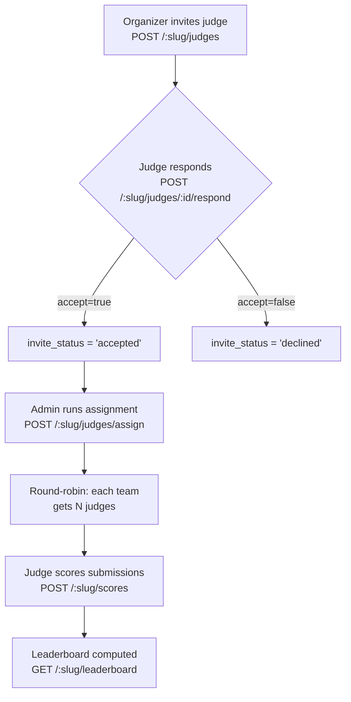
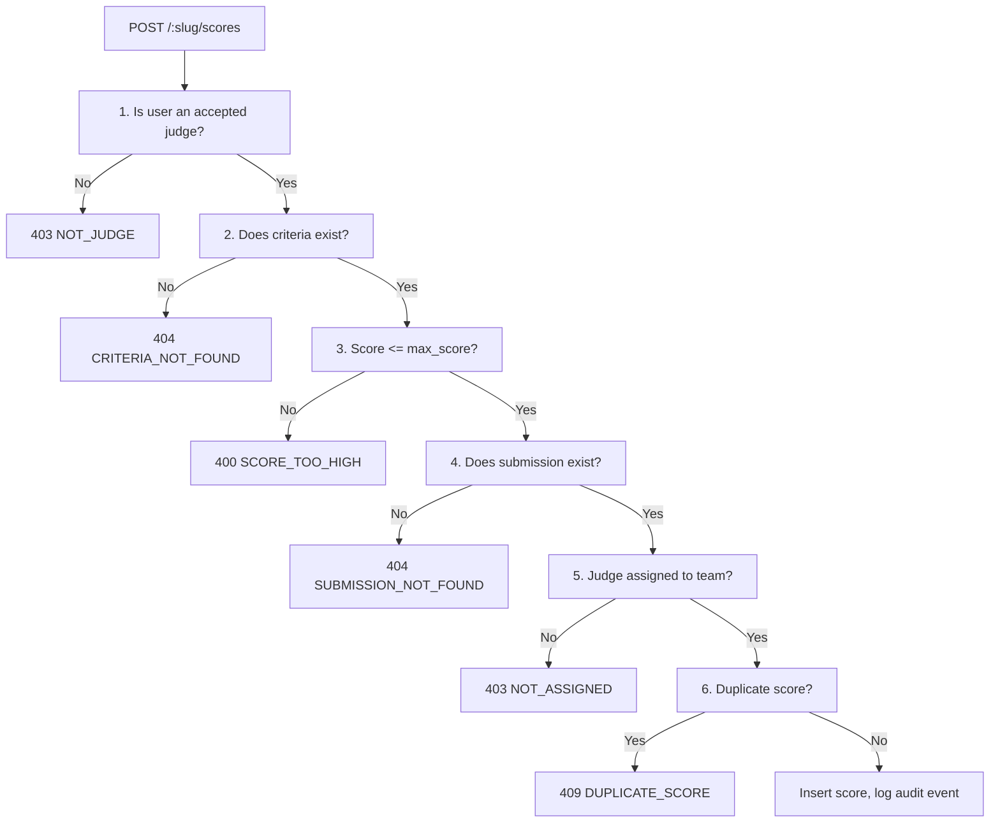

# 09 — Judging System

> DevSage uses a structured judging pipeline: organizers invite judges, define weighted rubric criteria, trigger round-robin assignment of judges to teams, and judges score submissions against the rubric. A leaderboard aggregates weighted scores into a ranked percentage. All scoring is write-once -- no edits, no deletes.

**Related docs:** [System Overview](./00-overview.md) | [Data Model](./03-data-model.md) | [API Design](./04-api-design.md) | [Organizer Platform](./07-organizer-platform.md) | [Roles & Permissions](./10-roles-permissions.md)

---

## Judge Lifecycle

The full flow from invitation to leaderboard:



Each stage has its own validation, error codes, and access controls. The system enforces a strict forward-only flow: judges cannot score until assigned, and the leaderboard only considers final submissions.

---

## Judge Invitations

Organizers invite judges by user ID. Judges accept or decline. Only accepted judges participate in assignment and scoring.

### Invite a Judge

**Endpoint:** `POST /api/v1/hackathons/:slug/judges`

**Access:** `admin` role or higher

**Request body:** Validated by `InviteJudgeRequestSchema`

```json
{ "userId": "uuid-of-the-user" }
```

Creates a record in the `judges` table with `invite_status: 'pending'`. If the user has already been invited to this hackathon, the endpoint returns `409 DUPLICATE_INVITE`.

### Respond to Invite

**Endpoint:** `POST /api/v1/hackathons/:slug/judges/:judgeId/respond`

**Access:** The invited user only (verified by checking `judgeRecord.user_id !== user.sub`)

**Request body:** Validated by `RespondToJudgeInviteRequestSchema`

```json
{ "accept": true }
```

Sets `invite_status` to `'accepted'` or `'declined'` based on the boolean value.

### List Judges

**Endpoint:** `GET /api/v1/hackathons/:slug/judges`

**Access:** `admin` role or higher

Returns all judge records for the hackathon with user details (display name, email, avatar) via a JOIN on the `users` table. Each record includes the current `invite_status`.

---

## Rubric Criteria

The rubric defines the scoring dimensions for a hackathon. Each criterion has a name, optional description, maximum score, weight, and sort order.

### Get Rubric

**Endpoint:** `GET /api/v1/hackathons/:slug/rubric`

**Access:** Public (no auth required)

Returns all criteria for the hackathon, ordered by `sort_order`.

### Bulk Upsert Rubric

**Endpoint:** `POST /api/v1/hackathons/:slug/rubric`

**Access:** `admin` role or higher

**Request body:** Validated by `BulkRubricRequestSchema`

```json
{
  "criteria": [
    {
      "name": "Innovation",
      "description": "Novelty and creativity of the solution",
      "maxScore": 10,
      "weight": 1.5,
      "sortOrder": 1
    },
    {
      "name": "Technical Execution",
      "maxScore": 10,
      "weight": 1.0,
      "sortOrder": 2
    }
  ]
}
```

Uses a **delete-all-then-insert** pattern for atomic replacement -- all existing criteria for the hackathon are deleted, then the new set is inserted. This ensures the rubric is always a consistent snapshot.

### Edit Lock

Rubric editing is only permitted when the hackathon status is `draft` or `registration_open`. Any attempt to modify the rubric after registration closes returns `400 INVALID_STATUS`. This prevents criteria changes while teams are actively working or judges are scoring.

### Schema

Criteria are stored in the `rubric_criteria` table:

| Column | Type | Default | Description |
|--------|------|---------|-------------|
| `id` | TEXT (UUID) | `crypto.randomUUID()` | Primary key |
| `hackathon_id` | TEXT | -- | Foreign key to hackathons |
| `name` | TEXT | -- | Criterion name (e.g., "Innovation") |
| `description` | TEXT | `null` | Optional description |
| `max_score` | INTEGER | `10` | Maximum score a judge can award |
| `weight` | REAL | `1.0` | Multiplier for weighted scoring |
| `sort_order` | INTEGER | -- | Display order |

---

## Round-Robin Judge Assignment

Once judges have accepted their invitations and teams have submitted, an admin triggers automatic assignment of judges to teams.

**Endpoint:** `POST /api/v1/hackathons/:slug/judges/assign`

**Access:** `admin` role or higher

### Prerequisites

The endpoint validates two conditions before running the algorithm:

| Condition | Error |
|-----------|-------|
| At least one judge with `invite_status = 'accepted'` | `400 NO_JUDGES` |
| At least one team with a submission | `400 NO_SUBMISSIONS` |

### Algorithm

The assignment logic lives in `buildJudgeAssignments()` in `services/judging-service.ts`:

1. **Find teams with submissions.** JOIN `teams` and `submissions` for this hackathon to get all teams that have at least one submission.

2. **Pick best submission per team** via `pickBestSubmissions()`. For each team, select the submission marked `is_final = 1`. If no final submission exists, fall back to the latest by `submitted_at`.

3. **Determine judges per team.** Each team gets `min(REVIEWS_PER_TEAM, acceptedJudges.length)` judges. The `REVIEWS_PER_TEAM` constant is defined in `lib/constants.ts`.

4. **Round-robin distribution.** For team at index `i`, assign judges starting at index `i % acceptedJudges.length`, wrapping around. This distributes the workload evenly across all accepted judges.

5. **Insert assignments** with `onConflictDoNothing()`. The unique constraint on `(judge_id, team_id, hackathon_id)` makes the operation safe to re-run -- duplicate assignments are silently skipped.

### Assignment Record

Records are stored in the `judge_assignments` table:

| Column | Type | Description |
|--------|------|-------------|
| `judge_id` | TEXT | Foreign key to judges |
| `team_id` | TEXT | Foreign key to teams |
| `hackathon_id` | TEXT | Foreign key to hackathons |
| `submission_id` | TEXT | Foreign key to the best submission |
| `status` | TEXT | Always `'pending'` on creation |
| `assigned_at` | TEXT | ISO-8601 timestamp |

---

## Score Submission

Judges submit scores one criterion at a time for a given submission.

**Endpoint:** `POST /api/v1/hackathons/:slug/scores`

**Access:** Accepted judges only (enforced by validation pipeline)

**Request body:** Validated by `SubmitScoreRequestSchema`

```json
{
  "submissionId": "uuid-of-submission",
  "criteriaId": "uuid-of-criterion",
  "score": 8,
  "comment": "Strong technical implementation"
}
```

### Validation Pipeline

Score submission passes through `validateScoreSubmission()` in `services/judging-service.ts`, which runs six checks in strict order. The first failure short-circuits:



### Validation Steps

| # | Check | Error Code | Status |
|---|-------|------------|--------|
| 1 | User is an accepted judge for this hackathon | `NOT_JUDGE` | 403 |
| 2 | Criteria exists for this hackathon | `CRITERIA_NOT_FOUND` | 404 |
| 3 | Score does not exceed the criterion's `max_score` | `SCORE_TOO_HIGH` | 400 |
| 4 | Submission exists for this hackathon | `SUBMISSION_NOT_FOUND` | 404 |
| 5 | Judge is assigned to the team that owns this submission | `NOT_ASSIGNED` | 403 |
| 6 | No existing score for this `(submission_id, judge_id, criteria_id)` tuple | `DUPLICATE_SCORE` | 409 |

### Write-Once Semantics

Scores are immutable. A UNIQUE constraint on `(submission_id, judge_id, criteria_id)` prevents any judge from scoring the same criterion on the same submission twice. There is no update endpoint -- re-submitting returns `409 DUPLICATE_SCORE`.

### Score Record

Records are stored in the `scores` table:

| Column | Type | Description |
|--------|------|-------------|
| `id` | TEXT (UUID) | Primary key |
| `submission_id` | TEXT | Foreign key to submissions |
| `judge_id` | TEXT | Foreign key to judges |
| `criteria_id` | TEXT | Foreign key to rubric_criteria |
| `score` | INTEGER | The awarded score (0 to `max_score`) |
| `comment` | TEXT | Optional judge comment |
| `scored_at` | TEXT | ISO-8601 timestamp |

---

## Leaderboard

The leaderboard aggregates all scores into a single ranked list of teams with weighted percentages.

**Endpoint:** `GET /api/v1/hackathons/:slug/leaderboard`

### Access Control

| Hackathon Status | Who Can View |
|------------------|-------------|
| `completed` or `archived` | Anyone (public) |
| Any other status | `admin`, `moderator`, or `owner` only |

This prevents participants from seeing partial results while judging is still in progress.

### Scoring Formula

The leaderboard uses `getLeaderboard()` from `services/judging-service.ts`. The weighted percentage for each team is:

```
weighted_percentage = SUM(score * weight) / SUM(max_score * weight) * 100
```

This normalizes scores across criteria with different max scores and weights into a single 0-100 percentage.

### Query Structure

The SQL query JOINs four tables:

```
scores → rubric_criteria → submissions → teams
```

- Only considers submissions marked `is_final = 1`
- Groups by team
- Orders by weighted percentage descending (highest score first)

### Response Shape

```json
{
  "ok": true,
  "data": [
    {
      "team_id": "uuid",
      "team_name": "Team Alpha",
      "weighted_percentage": 87.5,
      "judges_completed": 3
    }
  ]
}
```

The `judges_completed` field indicates how many distinct judges have scored the team's submission, helping organizers identify teams that still need reviews.

---

## Error Codes

All judging-specific error codes and their HTTP status:

| Code | Status | Trigger |
|------|--------|---------|
| `DUPLICATE_INVITE` | 409 | Judge already invited to this hackathon |
| `INVALID_STATUS` | 400 | Rubric edit attempted after registration closes |
| `NO_JUDGES` | 400 | Assignment triggered with no accepted judges |
| `NO_SUBMISSIONS` | 400 | Assignment triggered with no team submissions |
| `NOT_JUDGE` | 403 | Score submitted by non-judge or non-accepted judge |
| `CRITERIA_NOT_FOUND` | 404 | Score references nonexistent criterion |
| `SCORE_TOO_HIGH` | 400 | Score exceeds criterion's `max_score` |
| `SUBMISSION_NOT_FOUND` | 404 | Score references nonexistent submission |
| `NOT_ASSIGNED` | 403 | Judge not assigned to the submission's team |
| `DUPLICATE_SCORE` | 409 | Judge already scored this criterion on this submission |

---

## File References

| File | Purpose |
|------|---------|
| `apps/api/src/routes/judging.ts` | All judging endpoints: invites, rubric, assignment, scoring, leaderboard (405 LOC) |
| `apps/api/src/services/judging-service.ts` | Business logic: `buildJudgeAssignments()`, `validateScoreSubmission()`, `getLeaderboard()` (291 LOC) |
| `apps/api/src/lib/constants.ts` | `REVIEWS_PER_TEAM` constant |
| `packages/db/src/schema/judges.ts` | `judges` table definition |
| `packages/db/src/schema/rubric-criteria.ts` | `rubric_criteria` table definition |
| `packages/db/src/schema/judge-assignments.ts` | `judge_assignments` table definition |
| `packages/db/src/schema/scores.ts` | `scores` table definition |
| `packages/shared/src/schemas/judging.ts` | Zod schemas: `InviteJudgeRequestSchema`, `RespondToJudgeInviteRequestSchema`, `BulkRubricRequestSchema`, `SubmitScoreRequestSchema` |
| `apps/platform/src/pages/hackathon-manage.tsx` | Organizer UI: Judges tab, Rubric tab, Leaderboard tab |
| `apps/platform/src/pages/judge-scoring.tsx` | Judge scoring interface (395 LOC) |
