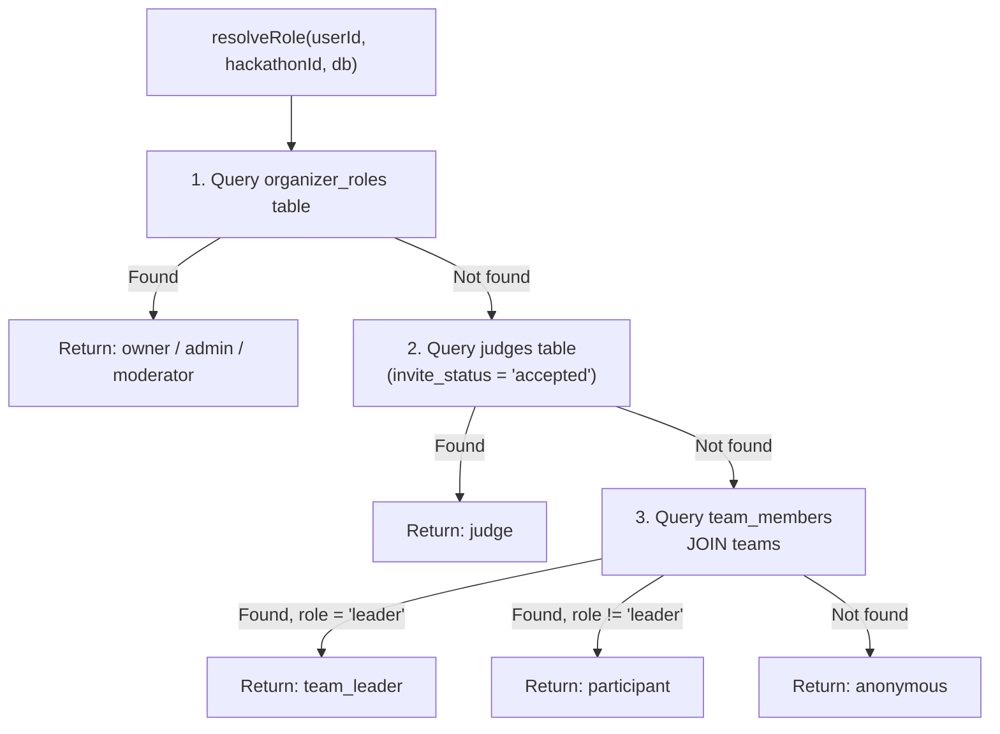
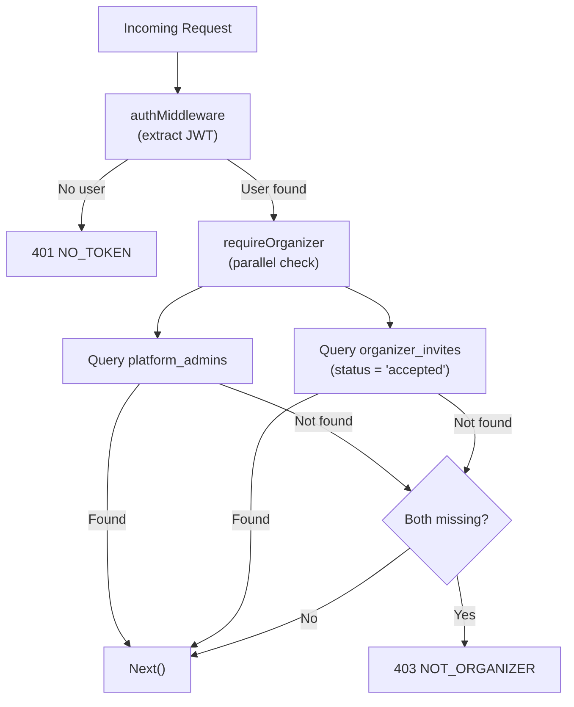

# 10 — Roles & Permissions

> DevSage uses a 7-tier per-hackathon role hierarchy resolved on every request. Roles are never stored in the JWT -- they are computed from database state so a user's access can differ across hackathons. A separate platform-wide admin role exists outside the per-hackathon hierarchy.

**Related docs:** [System Overview](./00-overview.md) | [Authentication](./01-authentication.md) | [API Design](./04-api-design.md) | [Data Model](./03-data-model.md) | [Organizer Platform](./07-organizer-platform.md)

---

## Per-Hackathon Role Hierarchy

Seven roles, ordered from highest to lowest privilege:

| # | Role | Scope | Description |
|---|------|-------|-------------|
| 0 | `owner` | Per-hackathon | Hackathon creator. Full control including deletion |
| 1 | `admin` | Per-hackathon | Organizer with admin privileges. Can manage judges, rubric, transitions |
| 2 | `moderator` | Per-hackathon | Organizer with moderation privileges. Can manage teams, view force pushes |
| 3 | `judge` | Per-hackathon | Accepted judge. Can score assigned submissions |
| 4 | `team_leader` | Per-hackathon | Team leader. Can set repo, manage members, submit |
| 5 | `participant` | Per-hackathon | Team member. Can view team details |
| 6 | `anonymous` | Per-hackathon | Unauthenticated or unaffiliated user. Public read access only |

The hierarchy is numeric -- lower index means higher privilege. A user with role index `N` satisfies any check requiring role index `>= N`.

```typescript
// apps/api/src/middleware/role.ts
const ROLE_INDEX: Record<Role, number> = {
  owner: 0,
  admin: 1,
  moderator: 2,
  judge: 3,
  team_leader: 4,
  participant: 5,
  anonymous: 6,
};

function isRoleAtLeast(actual: Role, minimum: Role): boolean {
  return ROLE_INDEX[actual] <= ROLE_INDEX[minimum];
}
```

---

## Role Resolution

Roles are resolved per-request per-hackathon by `resolveRole()`. The function checks three database tables in priority order and returns the first match:



### Resolution Order (First Match Wins)

1. **organizer_roles** -- If the user has a row in `organizer_roles` for this hackathon, return that role (`owner`, `admin`, or `moderator`).
2. **judges** -- If the user has an accepted judge invite (`invite_status = 'accepted'`) for this hackathon, return `judge`.
3. **team_members JOIN teams** -- If the user is a member of a team in this hackathon, return `team_leader` (if `team_members.role = 'leader'`) or `participant`.
4. **Fallback** -- Return `anonymous`.

### Why Roles Are Not in the JWT

- A user can have different roles in different hackathons (judge in one, participant in another, admin in a third).
- Roles can change mid-session (e.g., judge accepts invite, organizer promotes a user).
- Per-request resolution ensures the user always has their current role without requiring token refresh.
- The JWT payload contains only identity: `{ sub, ghid, ghu, iat, exp }`.

---

## Platform Admin

`platform_admin` is a separate, platform-wide role that exists outside the per-hackathon hierarchy. Platform admins are members of the DevSage team who manage the platform itself.

| Aspect | Detail |
|--------|--------|
| Table | `platform_admins` |
| Scope | Platform-wide (not per-hackathon) |
| Check | `requirePlatformAdmin` middleware queries `platform_admins` by `user_id` |
| Access | Admin dashboard (`admin.devsage.org`), platform configuration |

```typescript
// packages/db/src/schema/platform-admins.ts
export const platformAdmins = sqliteTable('platform_admins', {
  id: text('id').primaryKey(),
  user_id: text('user_id').notNull().unique().references(() => users.id),
  created_at: text('created_at').notNull(),
});
```

---

## Organizer Access

Organizer access (for `platform.devsage.org`) is granted through a separate invite system. The `requireOrganizer` middleware checks two conditions in parallel -- the user passes if **either** is true:

1. The user is a **platform admin** (row in `platform_admins`).
2. The user has an **accepted organizer invite** (row in `organizer_invites` with `status = 'accepted'` and `accepted_by = user.sub`).



### Organizer Invites Table

```typescript
// packages/db/src/schema/organizer-invites.ts
export const organizerInvites = sqliteTable('organizer_invites', {
  id: text('id').primaryKey(),
  email: text('email').notNull(),
  invite_code: text('invite_code').notNull().unique(),
  status: text('status', { enum: ['pending', 'accepted', 'expired', 'revoked'] })
    .notNull().default('pending'),
  invited_by: text('invited_by').notNull().references(() => users.id),
  accepted_by: text('accepted_by').references(() => users.id),
  accepted_at: text('accepted_at'),
  expires_at: text('expires_at').notNull(),
  created_at: text('created_at').notNull(),
});
```

---

## Middleware Chain

Three middleware functions enforce access control. They are composed in route definitions:

| Middleware | Purpose | Checks | Sets on Context |
|-----------|---------|--------|-----------------|
| `requireRole(minRole)` | Per-hackathon role gate | Resolves hackathon from `:slug` param, resolves user role, checks `isRoleAtLeast(resolved, minRole)` | `c.set('role', resolvedRole)`, `c.set('hackathon', hackathon)` |
| `requirePlatformAdmin` | Platform admin gate | Queries `platform_admins` by `user_id` | -- |
| `requireOrganizer` | Organizer gate | Checks `platform_admins` OR accepted `organizer_invites` (parallel) | -- |

All three require `authMiddleware` to run first (to extract the JWT and set `c.get('user')`).

### Typical Middleware Chains

```typescript
// Public route (no auth required)
app.get('/api/v1/hackathons', listHackathons);

// Authenticated + role check
app.post('/api/v1/hackathons/:slug/teams',
  authMiddleware, requireRole('participant'), createTeam);

// Admin-only hackathon operation
app.patch('/api/v1/hackathons/:slug/status',
  authMiddleware, requireRole('admin'), transitionPhase);

// Owner-only
app.delete('/api/v1/hackathons/:slug',
  authMiddleware, requireRole('owner'), deleteHackathon);

// Platform admin (admin dashboard)
app.get('/admin/users',
  authMiddleware, requirePlatformAdmin, listUsers);

// Organizer (platform dashboard)
app.get('/platform/hackathons',
  authMiddleware, requireOrganizer, listManagedHackathons);
```

### Special Case: Anonymous Access

When `requireRole('anonymous')` is used and no JWT is present, the middleware allows the request through with `role = 'anonymous'` and still resolves the hackathon from the slug. This enables public read endpoints (hackathon details, team lists, leaderboard) without authentication.

---

## Role-to-Surface Mapping

| Surface | URL | Required Access |
|---------|-----|-----------------|
| Hackathon Site | `{slug}.devsage.org` | Per-hackathon roles via `requireRole()` |
| Main Site | `devsage.org` | Public (optional auth) |
| Organizer Platform | `platform.devsage.org` | `requireOrganizer` (platform admin OR accepted invite) |
| Admin Dashboard | `admin.devsage.org` | `requirePlatformAdmin` |
| API | `api.devsage.org` | Varies per endpoint |

---

## Database Tables

### organizer_roles

Per-hackathon organizer assignments. Stores the three highest roles in the hierarchy.

| Column | Type | Constraints |
|--------|------|-------------|
| `id` | TEXT | Primary key (UUID) |
| `hackathon_id` | TEXT | FK -> hackathons, CASCADE delete |
| `user_id` | TEXT | FK -> users |
| `role` | TEXT | Enum: `owner`, `admin`, `moderator`. Default: `admin` |
| `created_at` | TEXT | ISO-8601 UTC |

**Unique constraint:** `(hackathon_id, user_id)` -- one role per user per hackathon.

### platform_admins

Platform-wide admin access. Simple user-to-admin mapping.

| Column | Type | Constraints |
|--------|------|-------------|
| `id` | TEXT | Primary key (UUID) |
| `user_id` | TEXT | FK -> users, UNIQUE |
| `created_at` | TEXT | ISO-8601 UTC |

### organizer_invites

Invite-based organizer onboarding. Platform admins invite organizers by email.

| Column | Type | Constraints |
|--------|------|-------------|
| `id` | TEXT | Primary key (UUID) |
| `email` | TEXT | Invite recipient email |
| `invite_code` | TEXT | UNIQUE, used in accept URL |
| `status` | TEXT | Enum: `pending`, `accepted`, `expired`, `revoked` |
| `invited_by` | TEXT | FK -> users (the platform admin) |
| `accepted_by` | TEXT | FK -> users (nullable, set on accept) |
| `accepted_at` | TEXT | ISO-8601 UTC (nullable) |
| `expires_at` | TEXT | ISO-8601 UTC |
| `created_at` | TEXT | ISO-8601 UTC |

---

## Error Responses

| Code | Error Code | Condition |
|------|-----------|-----------|
| 400 | `BAD_REQUEST` | Missing hackathon slug in URL |
| 401 | `NO_TOKEN` | No JWT present and role > anonymous required |
| 403 | `INSUFFICIENT_ROLE` | Resolved role < required minimum |
| 403 | `NOT_PLATFORM_ADMIN` | User not in `platform_admins` table |
| 403 | `NOT_ORGANIZER` | User not a platform admin AND no accepted organizer invite |
| 404 | `NOT_FOUND` | Hackathon slug does not exist |
| 500 | `ROLE_RESOLUTION_ERROR` | Database error during role resolution |

---

## File References

| File | Purpose |
|------|---------|
| `apps/api/src/middleware/role.ts` | `ROLE_HIERARCHY`, `resolveRole()`, `requireRole()`, `isRoleAtLeast()` |
| `apps/api/src/middleware/platform-admin.ts` | `requirePlatformAdmin` middleware |
| `apps/api/src/middleware/require-organizer.ts` | `requireOrganizer` middleware |
| `apps/api/src/middleware/auth.ts` | `authMiddleware` (JWT extraction, prerequisite for role checks) |
| `packages/db/src/schema/organizer-roles.ts` | `organizer_roles` table schema |
| `packages/db/src/schema/platform-admins.ts` | `platform_admins` table schema |
| `packages/db/src/schema/organizer-invites.ts` | `organizer_invites` table schema |
