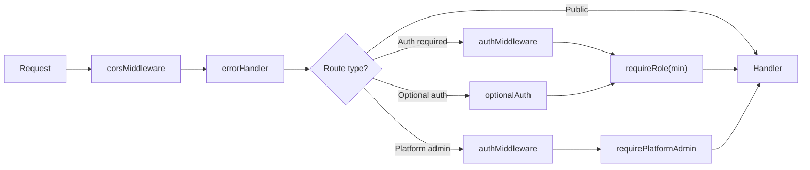
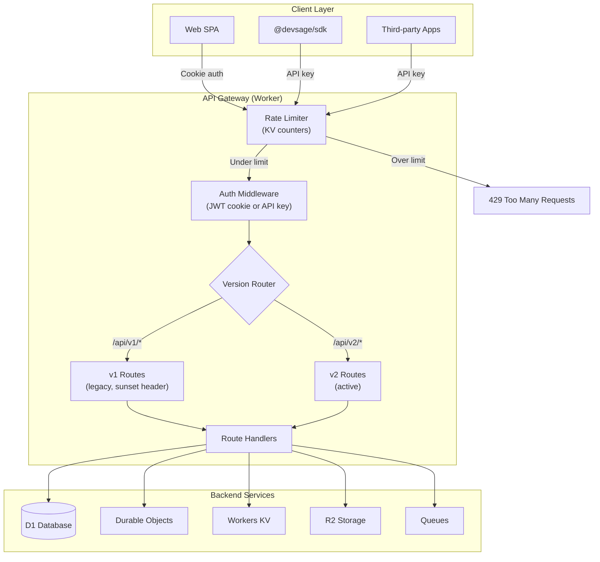

# 11 — API Design & Conventions

> REST API via Hono on Cloudflare Workers. Slug-based hackathon addressing, standard JSON envelope, Zod validation, per-request role resolution, and consistent error codes.

**Related docs:** [Roles & Permissions](./06-roles-permissions.md) | [Authentication](./01-authentication.md) | [Data Model](./10-data-model.md)

---

## Design Principles

| Principle | Implementation |
|-----------|---------------|
| **Slug-based addressing** | `/api/v1/hackathons/:slug` not `/:id` |
| **Consistent envelope** | All responses wrapped in `{ ok, data/error, meta }` |
| **Zod validation** | All request bodies validated via `@hono/zod-validator` |
| **Per-request auth** | Roles resolved per-request per-hackathon |
| **Audit logging** | Every mutation produces audit events |

---

## Response Envelope

### Success Response

```json
{
  "ok": true,
  "data": { ... },
  "meta": {
    "etag": "W/\"abc123\"",
    "cached": false
  }
}
```

### Paginated Response

```json
{
  "ok": true,
  "data": [ ... ],
  "meta": {
    "total": 42,
    "limit": 10,
    "offset": 0
  }
}
```

### Error Response

```json
{
  "ok": false,
  "error": {
    "code": "SUBMISSION_DEADLINE_PASSED",
    "message": "The submission deadline was 2026-03-15T23:59:59Z",
    "details": { ... }
  }
}
```

---

## Pagination

All list endpoints support pagination:

| Parameter | Type | Default | Range |
|-----------|------|---------|-------|
| `limit` | integer | 10-20 (varies) | 1-100 |
| `offset` | integer | 0 | 0+ |

```
GET /api/v1/hackathons?limit=20&offset=40
```

---

## Complete Route Table

### Authentication (`/auth/*`)

| Method | Path | Auth | Description |
|--------|------|------|-------------|
| GET | `/auth/github` | - | Initiate GitHub OAuth |
| GET | `/auth/callback/github` | - | GitHub OAuth callback |
| GET | `/auth/google` | - | Initiate Google OAuth |
| GET | `/auth/callback/google` | - | Google OAuth callback |
| GET | `/auth/me` | JWT | Current user + roles |
| POST | `/auth/logout` | JWT | Clear session cookie |

### Hackathons (`/api/v1/hackathons/*`)

| Method | Path | Auth | Min Role | Description |
|--------|------|------|----------|-------------|
| GET | `/api/v1/hackathons` | - | - | List non-draft hackathons (paginated) |
| POST | `/api/v1/hackathons` | JWT | organizer | Create hackathon |
| GET | `/api/v1/hackathons/:slug` | - | - | Get hackathon by slug |
| PUT | `/api/v1/hackathons/:slug` | JWT | admin | Update hackathon (draft only) |
| PATCH | `/api/v1/hackathons/:slug/status` | JWT | admin | Transition phase |
| DELETE | `/api/v1/hackathons/:slug` | JWT | owner | Delete hackathon (draft only) |

### Teams

| Method | Path | Auth | Min Role | Description |
|--------|------|------|----------|-------------|
| POST | `.../:slug/teams` | JWT | participant | Create team |
| GET | `.../:slug/teams` | JWT | participant | List teams (paginated) |
| GET | `.../:slug/teams/:teamId` | JWT | participant | Get team with members |
| POST | `.../:slug/teams/:teamId/join` | JWT | participant | Join via invite code |
| DELETE | `.../:slug/teams/:teamId/members/:userId` | JWT | participant | Remove member |
| POST | `.../:slug/teams/:teamId/repo` | JWT | participant | Connect GitHub repo |

### Submissions

| Method | Path | Auth | Min Role | Description |
|--------|------|------|----------|-------------|
| GET | `.../:slug/submissions` | JWT | participant | List submissions |
| GET | `.../:slug/submissions/:teamId` | JWT | participant | Get team's submissions |

### Judging

| Method | Path | Auth | Min Role | Description |
|--------|------|------|----------|-------------|
| POST | `.../:slug/judges` | JWT | admin | Invite judge |
| GET | `.../:slug/judges` | JWT | admin | List judges |
| POST | `.../:slug/judges/:id/respond` | JWT | anonymous | Accept/decline invite |
| GET | `.../:slug/rubric` | opt | anonymous | Get rubric criteria |
| POST | `.../:slug/rubric` | JWT | admin | Bulk upsert rubric |
| POST | `.../:slug/judges/assign` | JWT | admin | Round-robin assignment |
| POST | `.../:slug/scores` | JWT | anonymous | Submit score |
| GET | `.../:slug/leaderboard` | opt | anonymous | Weighted leaderboard |

### Webhooks

| Method | Path | Auth | Description |
|--------|------|------|-------------|
| POST | `/webhooks/github` | HMAC | GitHub App webhook receiver |

### Platform Admin (`/api/v1/admin/*`)

| Method | Path | Auth | Description |
|--------|------|------|-------------|
| POST | `/api/v1/admin/invites` | JWT + platform-admin | Create organizer invite |
| GET | `/api/v1/admin/invites` | JWT + platform-admin | List invites (paginated) |
| DELETE | `/api/v1/admin/invites/:id` | JWT + platform-admin | Revoke invite |
| GET | `/api/v1/admin/admins` | JWT + platform-admin | List platform admins |

### Organizer Invites (`/api/v1/invites/*`)

| Method | Path | Auth | Description |
|--------|------|------|-------------|
| GET | `/api/v1/invites/:code` | - | Check invite status |
| POST | `/api/v1/invites/:code/accept` | JWT | Accept organizer invite |

---

## Error Codes

### Authentication Errors (401)

| Code | Description |
|------|-------------|
| `NO_TOKEN` | No JWT cookie present |
| `INVALID_TOKEN` | JWT expired or invalid signature |

### Authorization Errors (403)

| Code | Description |
|------|-------------|
| `INSUFFICIENT_ROLE` | User's role is below minimum required |
| `NOT_PLATFORM_ADMIN` | User is not a platform admin |
| `NOT_ORGANIZER` | User is not an organizer or platform admin |

### Validation Errors (400)

| Code | Description |
|------|-------------|
| `VALIDATION_ERROR` | Zod schema validation failed |
| `BAD_REQUEST` | Missing required parameter |
| `INVALID_TRANSITION` | State machine transition not allowed |
| `SCORE_OUT_OF_RANGE` | Score outside [0, max_score] |
| `DUPLICATE_SCORE` | Score already submitted for this combination |

### Not Found (404)

| Code | Description |
|------|-------------|
| `NOT_FOUND` | Hackathon, team, or resource not found |
| `JUDGE_NOT_FOUND` | Judge record not found |
| `CRITERIA_NOT_FOUND` | Rubric criteria not found |
| `SUBMISSION_NOT_FOUND` | Submission not found |

### Conflict (409)

| Code | Description |
|------|-------------|
| `ALREADY_ON_TEAM` | User already on a team in this hackathon |
| `TEAM_FULL` | Team at max_team_size |
| `DUPLICATE_TEAM_NAME` | Team name already taken |
| `REPO_ALREADY_LINKED` | Repo linked to another team |

### Business Logic (422)

| Code | Description |
|------|-------------|
| `HACKATHON_NOT_ACTIVE` | Operation requires active hackathon |
| `REGISTRATION_CLOSED` | Registration period ended |
| `SUBMISSION_DEADLINE_PASSED` | Deadline has passed |
| `NOT_ASSIGNED` | Judge not assigned to this team |

---

## Middleware Chain



---

## CORS Configuration

```typescript
{
  origin: [
    env.FRONTEND_URL,     // https://devsage.org
    env.PLATFORM_URL,     // https://platform.devsage.org
    env.ADMIN_URL,        // https://admin.devsage.org
    'http://localhost:5173',  // dev
    'http://localhost:5174',
    'http://localhost:5175',
  ],
  credentials: true,
  allowMethods: ['GET', 'POST', 'PUT', 'PATCH', 'DELETE', 'OPTIONS'],
  allowHeaders: ['Content-Type', 'Authorization'],
}
```

---

## Request Validation

All request bodies are validated using `@hono/zod-validator` with schemas from `@devsage/shared`:

```typescript
app.post(
  '/teams',
  authMiddleware,
  requireRole('participant'),
  zValidator('json', CreateTeamRequestSchema),
  async (c) => {
    const body = c.req.valid('json');
    // body is fully typed and validated
  }
);
```

---

## v3 Planned Enhancements

### API Versioning Strategy

v2 uses `/api/v1/` as the route prefix. v3 introduces `/api/v2/` alongside the existing v1 routes, with a deprecation timeline:

| Version | Status | Availability |
|---------|--------|-------------|
| `/api/v1/` | Stable (current) | Maintained for 12 months after v2 launch |
| `/api/v2/` | Active development | All new features land here exclusively |

Both versions share the same Worker, middleware stack, and D1 database. Version routing is handled at the Hono app level:

```typescript
const v1 = new Hono<AuthAppEnv>();
const v2 = new Hono<AuthAppEnv>();

// Mount both versions
app.route('/api/v1', v1);
app.route('/api/v2', v2);
```

v2 endpoints return the same response envelope but may include additional fields in `data` and `meta`. Breaking changes (renamed fields, removed endpoints, changed semantics) only appear in v2. A `Sunset` header is added to v1 responses once the deprecation date is set: `Sunset: Sat, 01 Mar 2027 00:00:00 GMT`.

### GraphQL Consideration

GraphQL was evaluated for v3 and deferred to v4:

| Factor | REST (chosen for v3) | GraphQL (evaluated for v4) |
|--------|---------------------|---------------------------|
| Cloudflare Workers compatibility | Native — Hono routes map directly | Requires `graphql-yoga` or similar; adds ~200 KB to bundle |
| Caching | Standard HTTP caching (ETags, Cache API) | Requires custom cache layer (no HTTP-level caching for POST) |
| Client complexity | Simple `fetch()` wrapper | Requires client library (urql, Apollo) |
| Type safety | Zod schemas shared between API and frontend | Schema-first with codegen — strong but adds build step |
| Real-time | SSE (simple, HTTP-native) | Subscriptions (WebSocket, more complex) |
| Team familiarity | High | Low |

REST remains the primary API surface for v3. If v4 introduces a public developer API or the frontend query patterns become significantly more complex (deeply nested data, client-driven field selection), GraphQL will be reconsidered with `graphql-yoga` on Workers.

### Streaming Responses (SSE)

v3 adds Server-Sent Events for real-time data feeds without WebSocket complexity:

| Endpoint | Purpose | Event Types |
|----------|---------|-------------|
| `GET .../:slug/activity/stream` | Live activity feed | `commit`, `submission`, `phase_change`, `announcement` |
| `GET .../:slug/leaderboard/stream` | Live leaderboard updates | `score_update`, `rank_change` |
| `GET .../:slug/judging/stream` | Judge progress feed | `assignment_completed`, `score_submitted` |

Implementation uses Hono's `stream()` helper with `text/event-stream` content type. Each SSE connection is backed by a Durable Object that fans out events to connected clients. The connection authenticates via JWT cookie and respects role-based access — participants see activity events, judges see judging events, admins see everything.

```
GET /api/v2/hackathons/acmhack/activity/stream
Accept: text/event-stream

event: commit
data: {"teamName":"AlphaTeam","sha":"abc123","message":"Fix auth bug","pushedAt":"2026-03-15T10:30:00Z"}

event: submission
data: {"teamName":"BetaTeam","tagName":"submission_v2","version":2}
```

### API Rate Limiting

v2 has no rate limiting. v3 adds tiered rate limits enforced at the Worker level:

| Tier | Scope | Limit | Window | Enforcement |
|------|-------|-------|--------|-------------|
| Anonymous | Per IP | 60 requests | 1 minute | KV counter with TTL |
| Authenticated | Per user | 300 requests | 1 minute | KV counter keyed by user ID |
| API key | Per key | 600 requests | 1 minute | KV counter keyed by key prefix |
| Webhook | Per source IP | 120 requests | 1 minute | KV counter (separate from API) |

Rate limit headers are included on every response:

```
X-RateLimit-Limit: 300
X-RateLimit-Remaining: 287
X-RateLimit-Reset: 1710500460
```

When the limit is exceeded, the API returns `429 Too Many Requests` with a `Retry-After` header. Rate limit state is stored in Workers KV with TTL matching the window duration. Per-endpoint overrides allow higher limits on read-heavy endpoints (e.g., leaderboard) and lower limits on write-heavy endpoints (e.g., score submission).

### OpenAPI Specification Generation

v3 auto-generates an OpenAPI 3.1 spec from the existing Zod schemas and Hono route definitions:

| Component | Source |
|-----------|--------|
| Request schemas | Zod schemas in `@devsage/shared` — converted via `zod-to-openapi` |
| Response schemas | Zod schemas wrapping the response envelope |
| Route metadata | Hono route definitions with `openapi()` decorator |
| Auth schemes | JWT cookie and API key bearer token |

The generated spec is served at `GET /api/v2/openapi.json` and powers a Swagger UI at `GET /api/v2/docs`. The spec is regenerated at build time and bundled with the Worker. This eliminates hand-maintained API documentation and ensures the spec always matches the implementation.

### SDK Generation

A TypeScript client SDK is generated from the OpenAPI spec and published to npm as `@devsage/sdk`:

| Feature | Implementation |
|---------|---------------|
| Generation | `openapi-typescript-codegen` from the OpenAPI 3.1 spec |
| Type safety | Full request/response types derived from Zod schemas |
| Auth | Supports both cookie-based (browser) and API key (server) authentication |
| Error handling | Typed error responses with discriminated union on error codes |
| Publishing | Automated via CI — new version on every API deployment |

```typescript
import { DevSageClient } from '@devsage/sdk';

const client = new DevSageClient({
  baseUrl: 'https://api.devsage.org',
  apiKey: 'dsk_...',
});

const hackathon = await client.hackathons.getBySlug('acmhack');
const teams = await client.teams.list('acmhack', { limit: 20 });
```

### Batch Endpoints

v3 adds bulk operation endpoints for admin tasks that currently require multiple sequential requests:

| Endpoint | Method | Description |
|----------|--------|-------------|
| `.../:slug/judges/bulk-invite` | POST | Invite multiple judges in one request (array of emails) |
| `.../:slug/teams/bulk-update` | PATCH | Update multiple team properties (track assignment, status) |
| `.../:slug/scores/bulk-export` | GET | Export all scores as a single JSON or CSV response |
| `.../:slug/notifications/bulk-send` | POST | Send announcement to all participants, judges, or organizers |
| `/api/v2/admin/hackathons/bulk-archive` | POST | Archive multiple completed hackathons |

Batch endpoints accept arrays and process items transactionally where possible (D1 batch API). Each item in the batch produces its own audit event. The response includes per-item success/failure status:

```json
{
  "ok": true,
  "data": {
    "succeeded": 8,
    "failed": 2,
    "results": [
      { "email": "judge1@example.com", "status": "invited" },
      { "email": "invalid", "status": "failed", "error": "VALIDATION_ERROR" }
    ]
  }
}
```

### New v3 Route Table

| Method | Path | Auth | Min Role | Description |
|--------|------|------|----------|-------------|
| GET | `/api/v2/hackathons/:slug/notifications` | JWT | participant | List user's notifications for this hackathon |
| PATCH | `/api/v2/notifications/:id/read` | JWT | - | Mark notification as read |
| PATCH | `/api/v2/notifications/read-all` | JWT | - | Mark all notifications as read |
| GET | `/api/v2/hackathons/:slug/activity/stream` | JWT | participant | SSE activity feed |
| GET | `/api/v2/hackathons/:slug/analytics` | JWT | admin | Hackathon analytics dashboard data |
| GET | `/api/v2/hackathons/:slug/analytics/snapshots` | JWT | admin | Historical analytics snapshots |
| GET | `/api/v2/hackathons/:slug/audit` | JWT | admin | Audit trail (paginated, filterable) |
| GET | `/api/v2/hackathons/:slug/audit/export` | JWT | admin | Export audit trail (CSV/JSON) |
| GET | `/api/v2/hackathons/:slug/audit/verify` | JWT | admin | Verify audit hash chain integrity |
| POST | `/api/v2/hackathons/:slug/tracks` | JWT | admin | Create hackathon track |
| GET | `/api/v2/hackathons/:slug/tracks` | opt | - | List tracks |
| GET | `/api/v2/hackathons/:slug/leaderboard/stream` | JWT | participant | SSE leaderboard updates |
| POST | `/api/v2/hackathons/:slug/submissions/:id/artifacts` | JWT | participant | Upload submission artifact |
| GET | `/api/v2/hackathons/:slug/submissions/:id/artifacts` | JWT | participant | List submission artifacts |
| POST | `/api/v2/hackathons/:slug/votes/:submissionId` | JWT | participant | Cast audience vote |
| GET | `/api/v2/hackathons/:slug/votes` | opt | - | Get vote counts |
| GET | `/api/v2/user/preferences/notifications` | JWT | - | Get notification preferences |
| PUT | `/api/v2/user/preferences/notifications` | JWT | - | Update notification preferences |
| POST | `/api/v2/hackathons/:slug/judges/bulk-invite` | JWT | admin | Bulk invite judges |
| POST | `/api/v2/organizations` | JWT | - | Create organization |
| GET | `/api/v2/organizations/:orgSlug` | JWT | - | Get organization |
| POST | `/api/v2/organizations/:orgSlug/members` | JWT | org-admin | Add org member |
| POST | `/api/v2/api-keys` | JWT | - | Create API key |
| GET | `/api/v2/api-keys` | JWT | - | List user's API keys |
| DELETE | `/api/v2/api-keys/:id` | JWT | - | Revoke API key |
| GET | `/api/v2/openapi.json` | - | - | OpenAPI 3.1 specification |
| GET | `/api/v2/docs` | - | - | Swagger UI |

### API Gateway Pattern



### v3 API Feature Summary

| Feature | Priority | Complexity | Dependencies |
|---------|----------|-----------|--------------|
| API versioning (/api/v2/) | High | Low | Hono route restructuring |
| SSE streaming (activity, leaderboard) | High | Medium | Durable Objects for fan-out |
| Rate limiting (per-user, per-IP, per-key) | High | Medium | KV counters, rate limit middleware |
| OpenAPI spec generation | Medium | Medium | `zod-to-openapi`, build pipeline |
| SDK generation (@devsage/sdk) | Medium | Medium | OpenAPI spec, CI publishing |
| Batch endpoints | Medium | Low | D1 batch API, per-item audit |
| GraphQL evaluation | Low | N/A | Deferred to v4 |

---

## File References

| File | Purpose |
|------|---------|
| `apps/api/src/index.ts` | Route mounting, middleware registration |
| `apps/api/src/routes/*.ts` | All route handlers |
| `apps/api/src/middleware/*.ts` | All middleware |
| `apps/api/src/lib/response.ts` | `successResponse()`, `errorResponse()`, `paginatedResponse()` |
| `apps/api/src/middleware/cors.ts` | CORS configuration |
| `apps/api/src/middleware/error-handler.ts` | Global error handler |
| `packages/shared/src/schemas/api.ts` | `ApiErrorSchema`, pagination types |
| `apps/web/src/lib/api.ts` | Frontend API client |
