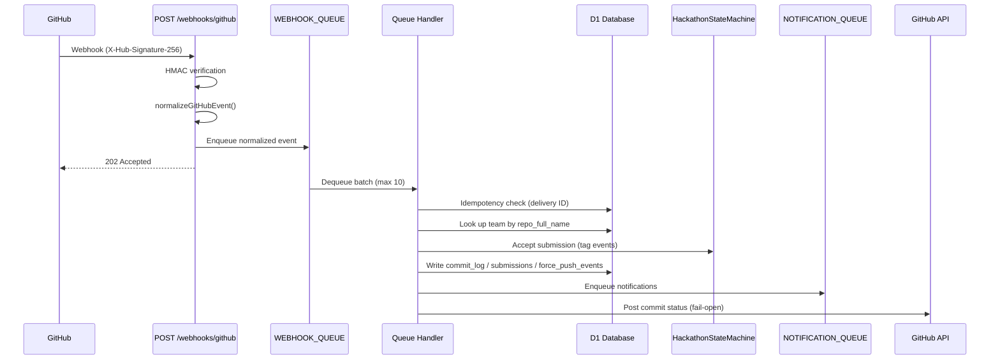
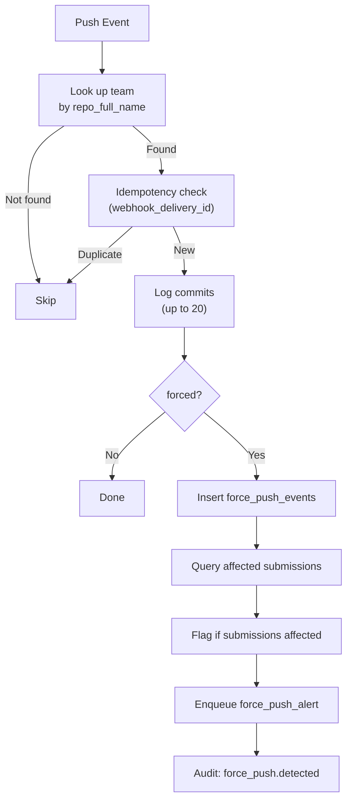
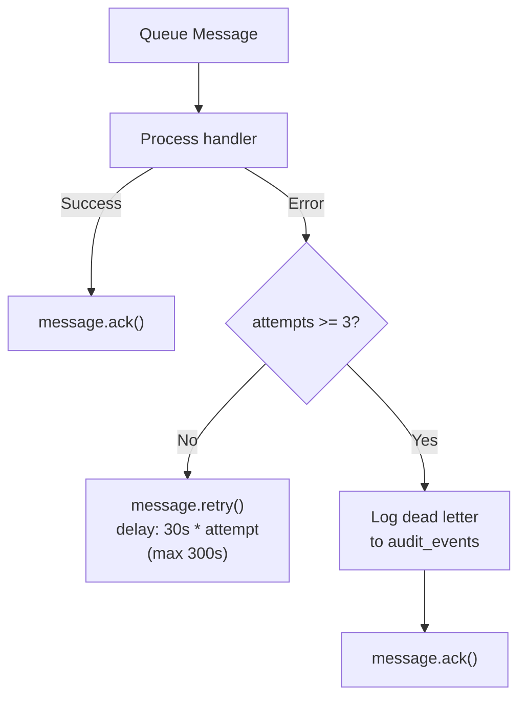

# 11 — Webhooks & GitHub Integration

> DevSage receives GitHub App webhooks at a single endpoint, verifies their HMAC signature, normalizes them into a typed event union, and enqueues them for async processing. Queue handlers log commits, detect force pushes, capture tag-based submissions via Durable Objects, and track GitHub App installations.

**Related docs:** [System Overview](./00-overview.md) | [Hackathon Lifecycle](./02-hackathon-lifecycle.md) | [Notifications](./12-notifications.md) | [Infrastructure](./13-infrastructure.md)

---

## Webhook Pipeline



---

## Webhook Receiver

**Endpoint:** `POST /webhooks/github`

The receiver validates, normalizes, and enqueues -- it never processes events synchronously. This keeps webhook response times fast and within Cloudflare Workers CPU limits.

### HMAC Signature Verification

Every incoming webhook is verified against `GITHUB_WEBHOOK_SECRET` using HMAC SHA-256 via `crypto.subtle`:

```typescript
// apps/api/src/routes/webhooks.ts (simplified)
const key = await crypto.subtle.importKey(
  'raw',
  new TextEncoder().encode(env.GITHUB_WEBHOOK_SECRET),
  { name: 'HMAC', hash: 'SHA-256' },
  false,
  ['sign']
);
const signedBody = await crypto.subtle.sign('HMAC', key, new TextEncoder().encode(body));
const expected = `sha256=${toHex(signedBody)}`;

if (!timingSafeEqual(signature, expected)) {
  return errorResponse(c, 401, 'INVALID_SIGNATURE', 'Invalid webhook signature');
}
```

The comparison uses a constant-time equality check to prevent timing attacks.

### Required Headers

| Header | Purpose |
|--------|---------|
| `X-Hub-Signature-256` | HMAC SHA-256 signature of the request body |
| `X-GitHub-Delivery` | Unique delivery ID (used for idempotency) |
| `X-GitHub-Event` | Event type (`push`, `create`, `delete`, `installation`, etc.) |

If any header is missing, the endpoint returns `400 MISSING_WEBHOOK_HEADERS`.

---

## Event Normalization

`normalizeGitHubEvent()` transforms raw GitHub payloads into a typed discriminated union. Unrecognized or irrelevant events return `null` and are acknowledged without enqueuing.

### Supported Event Types

| GitHub Event | Normalized Type | Condition |
|-------------|----------------|-----------|
| `push` | `NormalizedPushEvent` | Always (branch pushes) |
| `create` | `NormalizedTagCreateEvent` | Only when `ref_type === 'tag'` |
| `delete` | `NormalizedTagDeleteEvent` | Only when `ref_type === 'tag'` |
| `installation` | `NormalizedInstallationEvent` | App install/uninstall |
| `installation_repositories` | `NormalizedInstallationEvent` | Repos added to installation |
| All others | `null` | Acknowledged, not processed |

### Normalized Event Union

```typescript
// apps/api/src/lib/webhook-normalize.ts
type NormalizedGitHubEvent =
  | NormalizedPushEvent        // type: 'push'
  | NormalizedTagCreateEvent   // type: 'tag_created'
  | NormalizedTagDeleteEvent   // type: 'tag_deleted'
  | NormalizedInstallationEvent; // type: 'installation'
```

### Push Event Fields

| Field | Type | Description |
|-------|------|-------------|
| `type` | `'push'` | Discriminator |
| `deliveryId` | `string` | GitHub delivery ID |
| `repoFullName` | `string` | `owner/repo` |
| `branch` | `string` | Branch name (stripped of `refs/heads/`) |
| `forced` | `boolean` | Whether this was a force push |
| `commits` | `Array` | Up to 20 commits (sha, message, author, timestamp) |
| `headSha` | `string` | HEAD commit SHA after push |
| `beforeSha` | `string` | HEAD commit SHA before push |
| `pusherName` | `string` | GitHub username of pusher |

### Tag Event Fields

| Field | Type | Description |
|-------|------|-------------|
| `type` | `'tag_created'` or `'tag_deleted'` | Discriminator |
| `deliveryId` | `string` | GitHub delivery ID |
| `repoFullName` | `string` | `owner/repo` |
| `tagName` | `string` | Tag name (e.g., `submission_v1`) |
| `sha` | `string` | Commit SHA the tag points to (create only) |
| `senderLogin` | `string` | GitHub username |

### Installation Event Fields

| Field | Type | Description |
|-------|------|-------------|
| `type` | `'installation'` | Discriminator |
| `action` | `string` | `created`, `deleted`, `added`, etc. |
| `installationId` | `number` | GitHub App installation ID |
| `repositories` | `Array<{ fullName }>` | Affected repositories |
| `senderLogin` | `string` | GitHub username |

---

## Queue Processing

The `WEBHOOK_QUEUE` (`github-webhooks`) dispatches events to type-specific handlers via an exhaustive switch:

```typescript
// apps/api/src/queue/index.ts (simplified)
switch (event.type) {
  case 'push':        await handlePush(event, env);         break;
  case 'tag_created': await handleTagCreate(event, env);    break;
  case 'tag_deleted': await handleTagDelete(event, env);    break;
  case 'installation': await handleInstallation(event, env); break;
  default: { const _exhaustive: never = event; }
}
```

### Queue Configuration

| Setting | Value |
|---------|-------|
| Queue name | `github-webhooks` |
| Binding | `WEBHOOK_QUEUE` |
| Max batch size | 10 |
| Max retries | 3 |
| Retry backoff | Exponential: `30s * attempt` (capped at 300s) |
| Dead letter | Logged to `audit_events` after max retries |

---

## Handler: Push (`push-handler.ts`)

Processes `push` events. Logs commits and detects force pushes.

### Commit Logging

1. Look up team by `repo_full_name` (must have `bot_active = 1`).
2. **Idempotency check:** Skip if `webhook_delivery_id` already exists in `commit_log`.
3. Insert up to 20 commits into `commit_log` table.
4. Commit logging failures are non-critical -- they do not block force-push detection.

### Force Push Detection

When `event.forced === true`:

1. Insert a `force_push_events` record with `before_sha` and `after_sha`.
2. Query `submissions` for the team with status in `['received', 'validated', 'locked', 'under_review']`.
3. If affected submissions exist, update the force push record with `action_taken: 'flagged'` and the list of invalidated submission IDs.
4. Enqueue a `force_push_alert` notification to `NOTIFICATION_QUEUE`.
5. Log an audit event (`force_push.detected`).



---

## Handler: Tag Create (`tag-create-handler.ts`)

Processes `tag_created` events. This is the core submission capture path.

### Submission Tag Matching

Tags are matched against the hackathon's `submission_tag_pattern` using `matchSubmissionTag()`. The pattern uses `%` as a version-number wildcard:

```typescript
// apps/api/src/lib/submission-tag.ts
matchSubmissionTag('submission_v3', 'submission_v%')
// → { matches: true, version: 3 }

matchSubmissionTag('release-1.0', 'submission_v%')
// → { matches: false }
```

The default pattern is `submission_v%` (configurable per hackathon).

### Submission Flow

1. Look up team by `repo_full_name` (must have `bot_active = 1`).
2. Look up hackathon to get `submission_tag_pattern` and `submission_deadline`.
3. Match tag against pattern. Skip if no match.
4. **Idempotency check:** Skip if `webhook_delivery_id` already exists in `submissions`.
5. **Durable Object locking:** Call `HackathonStateMachine.acceptSubmission()` via `fetchDO()`. The DO enforces exactly-once submission locking per team.
6. If DO rejects: log audit event, post `failure` commit status, return.
7. If DO accepts: insert `submissions` row, check late status, enqueue `submission_received` notification, log audit event, post `success` commit status.

### Late Submission Detection

```typescript
const isLate = submittedMs > deadlineMs ? 1 : 0;
```

Late submissions are still accepted and recorded but flagged with `is_late = 1`.

### Commit Status Posting

After processing, the handler posts a GitHub commit status to the tag's SHA:

| Outcome | Status | Description |
|---------|--------|-------------|
| Accepted | `success` | `Submission {tagName} received by DevSage` |
| Rejected | `failure` | `Submission rejected: {reason}` |

Commit status posting uses the fail-open pattern (10s timeout, never throws).

---

## Handler: Tag Delete (`tag-delete-handler.ts`)

Processes `tag_deleted` events. Currently logs an audit event only -- no submission state changes.

```typescript
await insertAuditEvent(db, {
  actorType: 'bot',
  action: 'tag.deleted',
  entityType: 'tag',
  entityId: event.tagName,
  details: { repoFullName, tagName, senderLogin, deliveryId },
});
```

---

## Handler: Installation (`installation-handler.ts`)

Processes `installation` events. Updates `bot_active` status on teams whose repositories are affected.

| Action | Effect |
|--------|--------|
| `created` or `added` | Set `bot_active = 1` on matching teams |
| `deleted` or `removed` | Set `bot_active = 0` on matching teams |

The handler iterates over `event.repositories` and updates each team whose `repo_full_name` matches. An audit event is logged for every installation action.

---

## GitHub API Integration

The `postCommitStatus()` service function posts commit statuses to GitHub. It follows the fail-open pattern:

- **10s timeout** via `AbortController`
- **Never throws** -- logs a warning on failure
- **Skips silently** if `GITHUB_CLIENT_SECRET` is not configured

```typescript
// apps/api/src/services/github.ts
interface CommitStatusParams {
  repoFullName: string;
  sha: string;
  state: 'success' | 'failure' | 'pending' | 'error';
  description: string;
  context: string;  // Always 'devsage/submission'
}
```

---

## Idempotency

Every handler has idempotency protection to ensure safe retries:

| Handler | Idempotency Key | Mechanism |
|---------|----------------|-----------|
| `push-handler` | `webhook_delivery_id` in `commit_log` | SELECT before INSERT |
| `tag-create-handler` | `webhook_delivery_id` in `submissions` | SELECT before INSERT |
| `tag-delete-handler` | None (audit-only, safe to replay) | -- |
| `installation-handler` | None (SET is idempotent) | UPDATE is naturally idempotent |

The Durable Object's `acceptSubmission()` provides an additional layer of exactly-once protection for submission locking.

---

## Error Handling & Retries



- **Max retries:** 3 (configured in `wrangler.jsonc` and enforced in code via `MAX_QUEUE_RETRIES`)
- **Backoff:** `RETRY_BACKOFF_BASE_SECONDS (30) * attempt`, capped at `MAX_RETRY_DELAY_SECONDS (300)`
- **Dead letters:** After max retries, the message body and error are logged to `audit_events` with action `queue.dead_letter`, then acknowledged
- **Malformed messages:** Discarded immediately (acknowledged without processing)

---

## File References

| File | Purpose |
|------|---------|
| `apps/api/src/routes/webhooks.ts` | Webhook receiver endpoint, HMAC verification |
| `apps/api/src/lib/webhook-normalize.ts` | `normalizeGitHubEvent()`, event type definitions |
| `apps/api/src/lib/submission-tag.ts` | `matchSubmissionTag()` with `%` version wildcard |
| `apps/api/src/queue/index.ts` | Queue dispatcher, retry/dead-letter logic |
| `apps/api/src/queue/push-handler.ts` | Commit logging, force-push detection |
| `apps/api/src/queue/tag-create-handler.ts` | Submission capture via DO, commit status posting |
| `apps/api/src/queue/tag-delete-handler.ts` | Tag deletion audit logging |
| `apps/api/src/queue/installation-handler.ts` | GitHub App install/uninstall, `bot_active` toggle |
| `apps/api/src/services/github.ts` | `postCommitStatus()` -- fail-open GitHub API client |
| `apps/api/src/lib/constants.ts` | Queue retry constants, submission tag defaults |
| `apps/api/wrangler.jsonc` | Queue bindings and consumer configuration |
