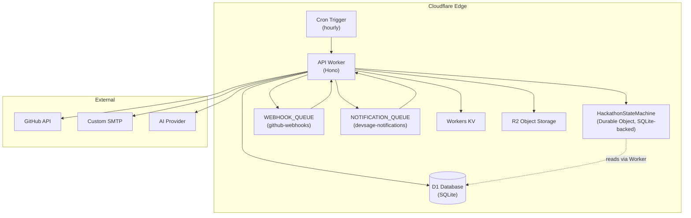
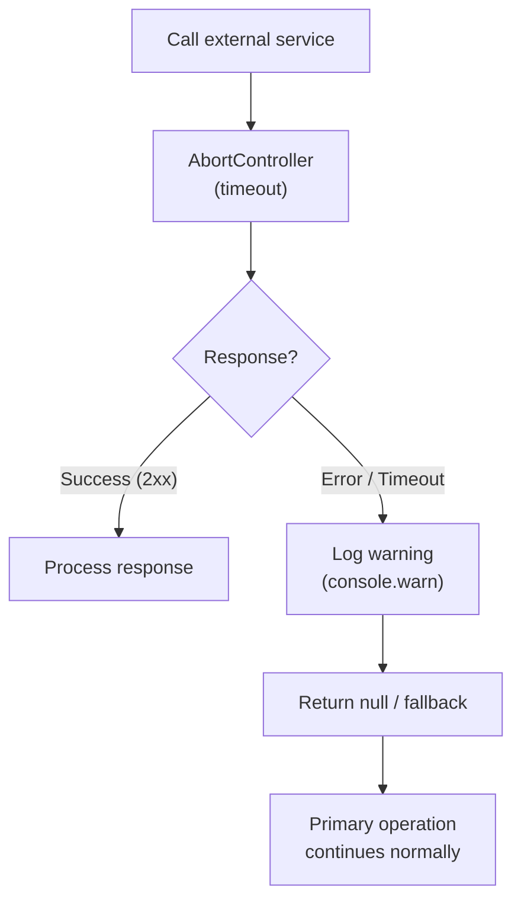
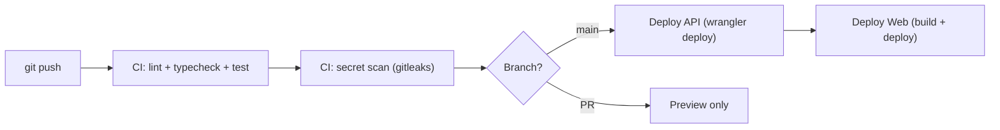
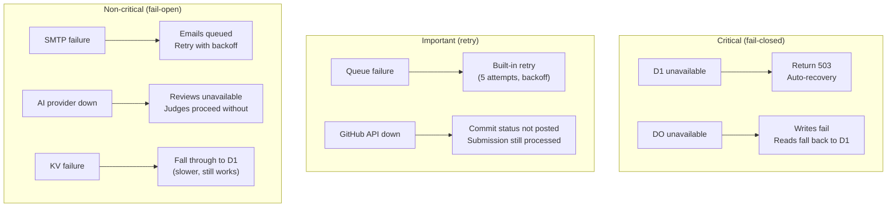
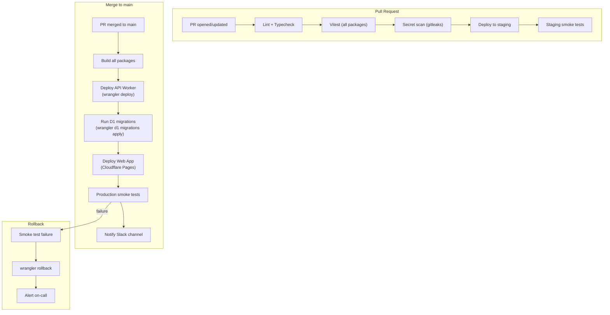
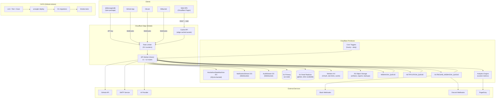

# 12 — Infrastructure & Deployment

> Edge-native on Cloudflare Workers. Single Worker handles API, Durable Objects, Queue consumers, and Cron Triggers. All Cloudflare first-party primitives. $0/month at target scale.

**Related docs:** [Overview](./00-overview.md) | [Data Model](./10-data-model.md) | [Webhooks](./07-webhooks-integrations.md)

---

## Infrastructure Topology



---

## Cloudflare Primitives

### Worker Bindings

| Binding | Type | Name / Class | Purpose |
|---------|------|--------------|---------|
| `DB` | D1 Database | `devsage-db` | Primary datastore (17 tables) |
| `KV` | KV Namespace | — | OAuth state (10-min TTL), session cache |
| `HACKATHON_SM` | Durable Object | `HackathonStateMachine` | State machine, submission locking, alarms |
| `WEBHOOK_QUEUE` | Queue (producer) | `github-webhooks` | GitHub event processing |
| `NOTIFICATION_QUEUE` | Queue (producer) | `devsage-notifications` | Email dispatch |

### Queue Consumer Configuration

| Queue | Max Batch | Max Retries | Retry Backoff |
|-------|-----------|-------------|---------------|
| `github-webhooks` | 10 | 3 | Exponential (capped at 5 min) |
| `devsage-notifications` | 10 | 3 | Exponential (capped at 5 min) |

### Cron Triggers

| Schedule | Purpose |
|----------|---------|
| `0 * * * *` (hourly) | Check approaching deadlines, send reminders, auto-transition phases |

### Worker Configuration

| Setting | Value |
|---------|-------|
| Compatibility date | 2026-01-01 |
| Compatibility flags | `nodejs_compat` |
| DO migrations | `new_sqlite_classes: [HackathonStateMachine]` |
| Observability | Enabled |

---

## Resource Limits & Budget

### Workers Free Plan (Current)

| Resource | Free Limit | DevSage Usage | Headroom |
|----------|-----------|--------------|----------|
| Requests | 100k/day | ~25k/day avg | 4x |
| CPU time | 10ms/invocation | Target <8ms p99 | OK |
| D1 rows read | 5M/day | ~200k/day avg | 25x |
| D1 rows written | 100k/day | ~20k/day avg | 5x |
| D1 storage | 5 GB | ~17 MB | 300x |
| KV reads | 100k/day | ~10k/day avg | 10x |
| KV writes | 1k/day | ~1.7k/day avg | Tight |
| Queues ops | 10k/day | ~3.3k/day avg | 3x |
| DO storage | 5 GB | ~10 MB | 500x |
| Bundle size | 10 MB compressed | ~1 MB | 10x |
| Memory | 128 MB per isolate | Well under | OK |

### Upgrade Trigger ($5/month Workers Paid)

Upgrade when any of these are consistently exceeded:
- Daily requests > 80k (80% of 100k free limit)
- KV writes > 800/day (80% of 1k free limit)
- Queue ops > 8k/day (80% of 10k free limit)

---

## External Services

| Service | Purpose | Failure Mode | Timeout | Rate Limit |
|---------|---------|-------------|---------|------------|
| GitHub API | OAuth, commit status | Fail-open | 10s | 5,000 req/hr |
| Custom SMTP | Email notifications | Fail-open | 10s | 500 emails/hr |
| AI Provider | Advisory code reviews | Fail-open | 25s | Per-token |

### Fail-Open Pattern

All external services follow the same pattern:



---

## Secrets Management

### Development

```
apps/api/.dev.vars  (gitignored)
```

| Secret | Purpose |
|--------|---------|
| `JWT_SECRET` | JWT signing key |
| `GOOGLE_CLIENT_ID` | Google OAuth |
| `GOOGLE_CLIENT_SECRET` | Google OAuth |
| `GITHUB_CLIENT_ID` | GitHub OAuth |
| `GITHUB_CLIENT_SECRET` | GitHub OAuth |
| `GITHUB_WEBHOOK_SECRET` | Webhook HMAC verification |
| `FRONTEND_URL` | CORS origin |
| `PLATFORM_URL` | CORS origin |
| `ADMIN_URL` | CORS origin |
| `SMTP_URL` | SMTP endpoint |
| `SMTP_USERNAME` | SMTP auth |
| `SMTP_PASSWORD` | SMTP auth |
| `SMTP_EMAIL_ADDR` | Sender address |

### Production

```bash
# Individual secret
wrangler secret put JWT_SECRET

# Bulk from file
wrangler secret bulk .env.production
```

### Security Guardrails

| Layer | Protection |
|-------|-----------|
| Pre-commit hook | `secretlint` scans staged files — blocks commits with secrets |
| Pre-push hook | Full repo secret scan — blocks pushes with secrets |
| CI | `gitleaks` on every PR + push to main |
| `.gitignore` | All `.env*` files (except `apps/web/.env.production`) |
| Web app | Only `VITE_*` variables (client-visible, no secrets) |

---

## Deployment

### Commands

```bash
# Deploy API worker
pnpm deploy:api
# → pnpm --filter @devsage/api run deploy → wrangler deploy

# Upload production secrets
pnpm deploy:api:secrets

# Deploy web app
pnpm deploy:web

# Run all locally
pnpm dev
```

### Pipeline



### Wrangler Configuration

Located at `apps/api/wrangler.jsonc` (NOT `.toml`). Never run wrangler from repo root.

Key sections:
- D1 database binding with migrations path (`../../packages/db/migrations`)
- KV namespace binding
- DO binding (`HackathonStateMachine`, SQLite-backed)
- Queue producer bindings (2 queues)
- Queue consumer bindings (2 queues)
- Cron trigger schedule
- DO migrations (new_sqlite_classes)

---

## Monorepo Tooling

| Tool | Purpose |
|------|---------|
| **Turborepo** | Build orchestration, caching, task parallelism |
| **pnpm** | Package manager with workspaces |
| **TypeScript** | Strict mode throughout |
| **Vitest** | Testing (API: `@cloudflare/vitest-pool-workers`, Web: jsdom) |
| **ESLint 9** | Flat config, shared via `packages/config` |
| **Drizzle ORM** | Type-safe D1 access |

### Build Commands

```bash
pnpm dev          # All apps dev (turbo --parallel)
pnpm build        # Build all (turbo)
pnpm test         # Test all (turbo)
pnpm lint         # Lint all
pnpm typecheck    # Type-check all
pnpm secrets:scan # Full repo secret scan
```

---

## Failure Modes



| Dependency | Criticality | Failure Behavior | Recovery |
|-----------|------------|------------------|----------|
| D1 | Critical | Fail-closed: return 503 | Automatic (Cloudflare-managed) |
| Durable Objects | Critical (mutations) | Fail-closed for writes; reads fall back to D1 | Automatic |
| KV | Non-critical | Fall through to D1 (slower) | Automatic |
| Queues | Important | Processing delayed | Built-in retry (3 attempts) |
| GitHub API | Important | Commit status not posted | Retry via queue |
| SMTP | Non-critical | Emails queued, delivered later | Retry with backoff |
| AI Provider | Non-critical | Reviews unavailable | Judges proceed without |

---

## v3 Planned Enhancements

### Multi-Region Deployment

v2 runs on Cloudflare's global edge by default — the Worker executes at the nearest PoP. However, D1 has a single primary region. v3 optimizes for global latency:

| Component | v2 Behavior | v3 Enhancement |
|-----------|------------|----------------|
| Worker | Global edge (automatic) | No change — already optimal |
| D1 primary | Single region (auto-selected) | Pin to `us-east` for consistency |
| D1 read replicas | Not available | Enable when D1 supports read replicas — route read-only queries to nearest replica |
| KV | Global replication (automatic) | No change — already globally replicated |
| Durable Objects | Single region per DO instance | Pin hackathon DOs to the same region as D1 primary via `locationHint` |
| R2 | Single bucket | No change — R2 is globally accessible with automatic edge caching |

The primary optimization is D1 read replicas. When Cloudflare ships this feature, read-heavy endpoints (leaderboard, team listings, activity feeds) route to the nearest replica. Write operations always go to the primary. The application code uses a `readDb` / `writeDb` pattern to make this transparent:

```typescript
const readDb = env.DB_REPLICA ?? env.DB;  // Fallback to primary if no replica
const writeDb = env.DB;                    // Always primary
```

### Staging Environment

v2 deploys directly to production. v3 introduces a full staging pipeline:

| Resource | Production | Staging |
|----------|-----------|---------|
| Worker | `devsage-api` | `devsage-api-staging` |
| D1 database | `devsage-db` | `devsage-db-staging` |
| KV namespace | `devsage-kv` | `devsage-kv-staging` |
| Durable Objects | Production DO namespace | Staging DO namespace |
| Queues | `github-webhooks`, `devsage-notifications` | `github-webhooks-staging`, `devsage-notifications-staging` |
| R2 bucket | `devsage-uploads` | `devsage-uploads-staging` |
| Domain | `api.devsage.org` | `api-staging.devsage.org` |
| Web app | `devsage.org` | `staging.devsage.org` |

Staging uses a separate `wrangler.staging.jsonc` configuration. Secrets are managed independently (`wrangler secret put --env staging`). The staging GitHub App points to the staging webhook URL. Staging data is seeded with synthetic hackathons and users via a `pnpm seed:staging` script.

### CI/CD Automation

v3 implements deploy-on-merge via GitHub Actions:



| Step | Tool | Duration |
|------|------|----------|
| Lint + typecheck | `pnpm lint && pnpm typecheck` | ~30s |
| Tests | `pnpm test` (Turborepo parallel) | ~60s |
| Secret scan | `gitleaks detect` | ~10s |
| API deploy | `wrangler deploy` | ~15s |
| D1 migrations | `wrangler d1 migrations apply` | ~5s |
| Web deploy | Cloudflare Pages (auto from git) | ~45s |
| Smoke tests | k6 script hitting critical endpoints | ~30s |

### Blue-Green Deployments

Cloudflare Workers supports gradual rollouts via deployment versions:

| Phase | Traffic Split | Duration | Rollback Trigger |
|-------|-------------|----------|-----------------|
| Canary | 5% new, 95% old | 10 minutes | Error rate > 1% or p99 latency > 500ms |
| Ramp | 25% new, 75% old | 15 minutes | Error rate > 0.5% or p99 latency > 300ms |
| Majority | 75% new, 25% old | 15 minutes | Error rate > 0.1% |
| Full | 100% new | Permanent | Manual rollback only |

Implementation uses `wrangler versions deploy` with percentage-based traffic splitting. The CI pipeline monitors Cloudflare Analytics Engine metrics during each phase and automatically rolls back if thresholds are exceeded. For database migrations that are not backward-compatible, the migration is deployed first (with the old code still running), then the new code is rolled out.

### Monitoring and Alerting

v2 relies on Cloudflare's built-in dashboard. v3 adds structured observability:

| Layer | Tool | Metrics |
|-------|------|---------|
| Request metrics | Cloudflare Analytics Engine | Request count, latency p50/p95/p99, error rate, status code distribution |
| Custom metrics | Analytics Engine `writeDataPoint()` | Submission count, queue depth, DO operations, auth failures |
| Structured logs | `console.warn`/`console.error` with JSON | Error details, request context, timing breakdowns |
| Uptime monitoring | Cloudflare Health Checks | Synthetic checks against `/api/v2/health` every 60s from 5 regions |
| Alerting | Cloudflare Notifications + Slack webhook | Error rate spike, latency degradation, queue backlog, D1 row limit approaching |

Custom metrics are written via the Analytics Engine binding:

```typescript
env.ANALYTICS.writeDataPoint({
  blobs: ['submission_received', hackathonId],
  doubles: [1],  // count
  indexes: [teamId],
});
```

Alerts are configured in the Cloudflare dashboard and forwarded to a Slack channel via webhook. Critical alerts (error rate > 5%, D1 unavailable) also trigger PagerDuty via a Cloudflare Notification destination.

### Cost Projections

| Resource | Free Tier | Workers Paid ($5/mo) | 10,000-User Usage | Monthly Cost |
|----------|----------|---------------------|-------------------|-------------|
| Worker requests | 100k/day | 10M/month included | ~750k/month | $0 (included) |
| D1 rows read | 5M/day | 25B/month included | ~6M/month | $0 (included) |
| D1 rows written | 100k/day | 50M/month included | ~600k/month | $0 (included) |
| D1 storage | 5 GB | 5 GB included | ~500 MB | $0 (included) |
| KV reads | 100k/day | 10M/month included | ~300k/month | $0 (included) |
| KV writes | 1k/day | 1M/month included | ~50k/month | $0 (included) |
| Queues operations | 10k/day | 1M/month included | ~100k/month | $0 (included) |
| R2 storage | 10 GB | 10 GB included | ~5 GB (artifacts) | $0 (included) |
| R2 operations | 1M Class A, 10M Class B | Same | ~200k/month | $0 (included) |
| Durable Objects | 1M requests | Included | ~500k/month | $0 (included) |
| **Total** | | | | **$5-25/month** |

The $5/month Workers Paid plan covers all v3 requirements at 10,000-user scale. The $25 upper bound accounts for spikes during active hackathon periods (50 concurrent hackathons with high submission volume) and optional add-ons (custom domains, additional KV namespaces). Cloudflare's pricing model is exceptionally favorable for this workload — compute is free beyond the base plan, and storage costs are negligible.

### Load Testing Strategy

| Tool | Target | Scenarios |
|------|--------|-----------|
| k6 (Grafana) | Staging environment | Sustained load, spike testing, soak testing |
| Artillery | Staging environment | Quick smoke tests in CI pipeline |

#### Test Scenarios

| Scenario | Virtual Users | Duration | Target |
|----------|--------------|----------|--------|
| Steady state | 100 concurrent | 10 minutes | p99 < 200ms, 0% errors |
| Submission spike | 500 concurrent (all submitting) | 5 minutes | p99 < 500ms, 0% errors, no duplicate submissions |
| Leaderboard storm | 1,000 concurrent reads | 5 minutes | p99 < 100ms (cached) |
| Webhook flood | 200 webhooks/second | 5 minutes | All enqueued, <50ms response time |
| Auth storm | 300 concurrent OAuth flows | 5 minutes | p99 < 1s, no KV write failures |

Load tests run against the staging environment on a weekly schedule and before every major release. Results are stored in R2 and compared against baseline metrics. Regressions trigger a Slack alert.

### Disaster Recovery

| Component | Backup Strategy | Recovery Time | Recovery Point |
|-----------|----------------|---------------|----------------|
| D1 database | Cloudflare automatic backups (30-day retention) + daily export to R2 | < 5 minutes (Cloudflare restore) | < 24 hours (daily export) |
| Durable Object state | SQLite-backed DO state is durable by default; Cloudflare manages replication | Automatic (Cloudflare-managed) | Zero data loss |
| R2 objects | Cross-region replication (Cloudflare-managed) | Automatic | Zero data loss |
| KV data | Ephemeral by design (OAuth state, rate limit counters) — no backup needed | N/A (regenerated) | N/A |
| Worker code | Git repository is the source of truth; `wrangler rollback` for immediate revert | < 1 minute (rollback) | Last deployment |
| Secrets | Documented in `docs/v2/secrets.md`; stored in password manager | < 5 minutes (re-upload) | Current values |

For D1, the daily R2 export runs as a cron job: `SELECT * FROM each_table` exported as compressed JSON to `r2://devsage-backups/d1/{date}/{table}.json.gz`. This provides a secondary recovery path independent of Cloudflare's built-in backup system.

### CDN Strategy for Static Assets

User-uploaded content (hackathon logos, banners, submission artifacts) is served via R2 with Cache API integration:

| Asset Type | Storage | Cache TTL | Cache Key |
|-----------|---------|-----------|-----------|
| Hackathon logos/banners | R2 (`/hackathons/{id}/logo.png`) | 7 days | URL path |
| Submission artifacts | R2 (`/artifacts/{id}/{filename}`) | 30 days | URL path + ETag |
| AI review reports | R2 (`/reviews/{id}/report.json`) | Indefinite (immutable) | URL path |
| Audit exports | R2 (`/exports/{id}.csv`) | 24 hours (then deleted) | URL path |

The Worker serves R2 objects through a dedicated route (`GET /assets/*`) that checks the Cache API first:

```typescript
const cached = await caches.default.match(request);
if (cached) return cached;

const object = await env.R2.get(key);
const response = new Response(object.body, {
  headers: {
    'Cache-Control': `public, max-age=${ttl}`,
    'ETag': object.etag,
  },
});

ctx.waitUntil(caches.default.put(request, response.clone()));
return response;
```

For public-facing assets (hackathon landing pages), a custom domain (`cdn.devsage.org`) points to the Worker with aggressive caching. Private assets (submission artifacts) require JWT authentication before serving and use shorter cache TTLs with `private` cache-control directives.

### v3 Infrastructure Topology



### v3 Infrastructure Feature Summary

| Feature | Priority | Complexity | Dependencies |
|---------|----------|-----------|--------------|
| Multi-region (D1 read replicas) | Medium | Low | Cloudflare D1 feature availability |
| Staging environment | High | Medium | Separate wrangler config, staging secrets, seed scripts |
| CI/CD automation (GitHub Actions) | High | Medium | Workflow files, staging deploy, smoke tests |
| Blue-green deployments | Medium | Medium | `wrangler versions deploy`, Analytics Engine monitoring |
| Monitoring and alerting | High | Medium | Analytics Engine, Cloudflare Notifications, Slack webhook |
| Cost projections ($5-25/month) | N/A | N/A | Workers Paid plan |
| Load testing (k6/Artillery) | Medium | Medium | Staging environment, test scenarios, baseline metrics |
| Disaster recovery | High | Low | D1 backup export cron, R2 storage, documented runbook |
| CDN strategy (R2 + Cache API) | Medium | Low | Asset serving route, cache configuration |

---

## File References

| File | Purpose |
|------|---------|
| `apps/api/wrangler.jsonc` | Worker configuration |
| `apps/api/src/index.ts` | Entry point: app, DO re-exports, queue handler, cron handler |
| `apps/api/src/types/env.ts` | Worker binding types |
| `turbo.json` | Turborepo task configuration |
| `pnpm-workspace.yaml` | Workspace definition |
| `docs/v2/deployment.md` | Production deployment guide |
| `docs/v2/secrets.md` | Secrets management conventions |
| `docs/v2/setup.md` | Developer setup guide |
