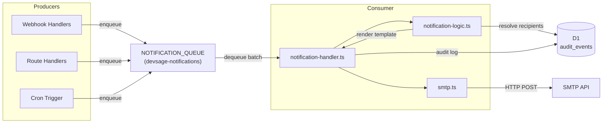
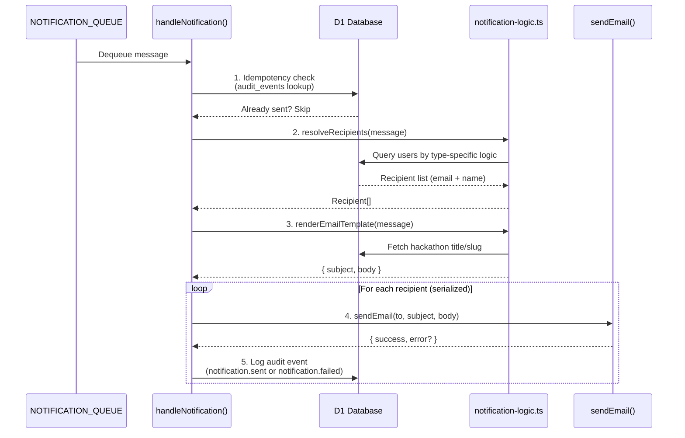
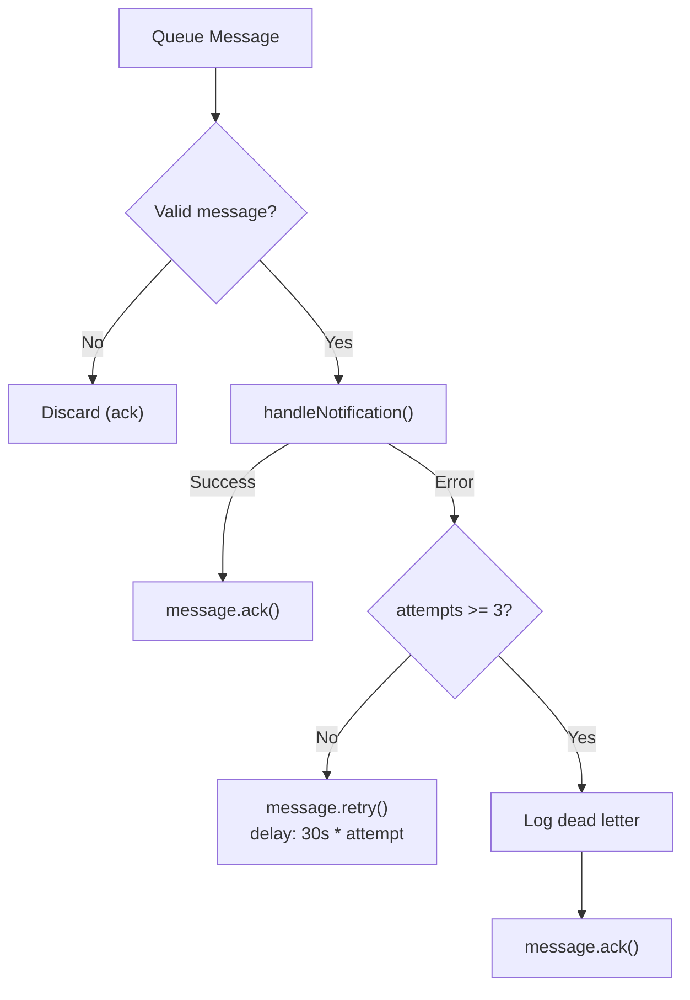

# 12 — Notification System

> DevSage sends transactional emails via a queue-backed notification system. Nine notification types cover the full hackathon lifecycle -- from submission receipts to deadline reminders. Each type has its own recipient resolution logic. Delivery is fail-open: a failed email never blocks the operation that triggered it.

**Related docs:** [System Overview](./00-overview.md) | [Webhooks & GitHub](./11-webhooks.md) | [Infrastructure](./13-infrastructure.md) | [Roles & Permissions](./10-roles-permissions.md)

---

## Architecture



---

## Notification Types

Nine notification types, each with specific trigger conditions and recipient resolution:

| Type | Trigger | Recipients | Description |
|------|---------|------------|-------------|
| `submission_received` | Tag-create handler accepts a submission | All team members | Confirms successful submission with tag name and commit SHA |
| `submission_invalid` | Tag-create handler rejects a submission | All team members | Reports rejection reason (e.g., hackathon not in ACTIVE phase) |
| `force_push_alert` | Push handler detects `forced: true` | All moderator+ organizers | Alerts organizers to potential tampering, includes affected submission count |
| `phase_transition` | Hackathon status change | All hackathon participants | Announces phase change (e.g., ACTIVE to JUDGING) |
| `judge_invited` | Admin invites a judge | The invited judge | Invitation to judge with accept/decline link |
| `judge_assignment` | Admin runs round-robin assignment | The assigned judge | Notifies judge of submission count assigned for review |
| `scores_finalized` | Judging completes for a team | All team members | Informs team that scores are available |
| `deadline_reminder` | Cron trigger (hourly check) | Team members without a final submission | Reminder with hours remaining before deadline |
| `organizer_invited` | Platform admin invites organizer | The invited email address | Organizer onboarding invite with accept link |

---

## Processing Flow



### Step-by-Step

1. **Idempotency check** -- Query `audit_events` for a matching `notification.sent` event with the message's idempotency key. Skip if already processed.
2. **Resolve recipients** -- Call `resolveRecipients()` which queries the database based on notification type. Recipients without email addresses are filtered out.
3. **Render template** -- Call `renderEmailTemplate()` which fetches hackathon metadata and produces a plain-text email with subject line.
4. **Send emails** -- Iterate recipients serially (no concurrent SMTP connections within a batch). Each call goes through `sendEmail()`.
5. **Audit logging** -- Log each send attempt to `audit_events` with `notification.sent` (success) or `notification.failed` (failure).

---

## Recipient Resolution

Each notification type has specific logic for determining who receives the email:

### By Notification Type

| Type | Resolution Logic | Query |
|------|-----------------|-------|
| `submission_received` | All team members | `team_members JOIN users WHERE team_id = ?` |
| `submission_invalid` | All team members | `team_members JOIN users WHERE team_id = ?` |
| `scores_finalized` | All team members | `team_members JOIN users WHERE team_id = ?` |
| `force_push_alert` | Moderator+ organizers | `organizer_roles JOIN users WHERE hackathon_id = ? AND role IN ('owner', 'admin', 'moderator')` |
| `phase_transition` | All hackathon participants | `team_members JOIN teams JOIN users WHERE hackathon_id = ?` |
| `judge_invited` | Single judge | `judges JOIN users WHERE judge_id = ?` |
| `judge_assignment` | Single judge | `judges JOIN users WHERE judge_id = ?` |
| `deadline_reminder` | Members without final submission | Raw SQL: `team_members JOIN teams JOIN users WHERE hackathon_id = ? AND NOT EXISTS (submissions WHERE is_final = 1)` |
| `organizer_invited` | Direct email | Uses `message.email` directly (no DB lookup) |

### Filtering

All resolution functions pass results through `toRecipients()`, which filters out rows where `email` is null or empty. This ensures no emails are sent to users who haven't provided an email address.

---

## Email Templates

All emails are plain text with a consistent format:

- **Subject:** `[DevSage] {Event Title}` (optionally includes hackathon name)
- **Body:** Greeting, event description, relevant details, action link
- **Links:** Point to the appropriate page on the hackathon site or platform

### Example: Submission Received

```
Subject: [DevSage] Submission Received

Hi,

Your team "Team Alpha" has successfully submitted to Hack 2026.

Tag: submission_v1
Commit: a1b2c3d

View your submission: https://devsage.org/hackathons/hack2026/team

Good luck!
```

### Example: Force Push Alert

```
Subject: [DevSage] Force Push Alert

Hi,

A force push was detected in Hack 2026.

Team: Team Alpha
Affected submissions: 2

This event has been logged and flagged for review.

View force push events: https://devsage.org/hackathons/hack2026/admin/force-pushes
```

### Example: Organizer Invited

```
Subject: [DevSage] Organizer Invitation

Hi,

You've been invited to become an organizer on DevSage.

Accept your invitation and set up your account: https://platform.devsage.org/invite/{code}

This invite expires in 14 days. If you didn't expect this email, you can safely ignore it.
```

---

## Email Delivery

### SMTP Service

Email is sent via an HTTP-based SMTP API (Cloudflare Workers cannot make raw TCP connections). The `sendEmail()` function in `services/smtp.ts` follows the fail-open pattern:

| Aspect | Detail |
|--------|--------|
| Transport | HTTP POST to `SMTP_URL` |
| Authentication | Basic Auth (`SMTP_USERNAME:SMTP_PASSWORD`) |
| From address | `SMTP_EMAIL_ADDR` |
| Content type | Plain text only |
| Timeout | 10s via `AbortController` |
| On failure | Returns `{ success: false, error }` -- never throws |
| Missing config | Logs warning, returns failure -- does not block |

### Required Environment Variables

| Variable | Purpose |
|----------|---------|
| `SMTP_URL` | HTTP endpoint of the SMTP relay API |
| `SMTP_USERNAME` | Basic Auth username |
| `SMTP_PASSWORD` | Basic Auth password |
| `SMTP_EMAIL_ADDR` | Sender email address (From field) |

If any SMTP variable is missing, `sendEmail()` returns a failure result and logs a warning. It never throws.

---

## Idempotency

Each notification message generates a stable idempotency key from its fields:

```typescript
// apps/api/src/queue/notification-logic.ts
function notificationIdempotencyKey(message: NotificationMessage): string {
  const parts: string[] = [message.type];
  if ('hackathonId' in message) parts.push(message.hackathonId);
  if ('inviteId' in message) parts.push(message.inviteId);
  if ('teamId' in message) parts.push(message.teamId);
  if ('judgeId' in message) parts.push(message.judgeId);
  if ('forcePushId' in message) parts.push(message.forcePushId);
  if ('fromPhase' in message) parts.push(message.fromPhase);
  if ('hoursRemaining' in message) parts.push(String(message.hoursRemaining));
  return parts.join(':');
}
```

**Example keys:**
- `submission_received:{hackathonId}:{teamId}`
- `force_push_alert:{hackathonId}:{teamId}:{forcePushId}`
- `deadline_reminder:{hackathonId}:24`
- `organizer_invited:{inviteId}`

Before processing, the handler checks `audit_events` for an existing `notification.sent` event with the same `entity_id`. Duplicates are skipped with a warning log.

---

## Queue Configuration

| Setting | Value |
|---------|-------|
| Queue name | `devsage-notifications` |
| Binding | `NOTIFICATION_QUEUE` |
| Max batch size | 10 |
| Max retries | 3 |
| Retry backoff | Exponential: `30s * attempt` (capped at 300s) |
| Dead letter | Logged to `audit_events` after max retries |

### Error Handling



Malformed messages (missing `type` or `hackathonId`) are discarded immediately. Valid messages that fail processing are retried with exponential backoff. After 3 attempts, the message is logged as a dead letter in `audit_events` and acknowledged.

---

## Notification Producers

Notifications are enqueued from multiple places in the codebase:

| Producer | Notification Types | Location |
|----------|-------------------|----------|
| `tag-create-handler.ts` | `submission_received` | Queue handler (webhook pipeline) |
| `push-handler.ts` | `force_push_alert` | Queue handler (webhook pipeline) |
| Hackathon status route | `phase_transition` | Route handler |
| Judge invite route | `judge_invited` | Route handler |
| Judge assignment route | `judge_assignment` | Route handler |
| Scoring route | `scores_finalized` | Route handler |
| Cron trigger | `deadline_reminder` | Scheduled handler |
| Organizer invite route | `organizer_invited` | Route handler |

---

## File References

| File | Purpose |
|------|---------|
| `apps/api/src/queue/notification-handler.ts` | `NotificationMessage` type union, `handleNotification()` orchestration |
| `apps/api/src/queue/notification-logic.ts` | `resolveRecipients()`, `renderEmailTemplate()`, `notificationIdempotencyKey()` |
| `apps/api/src/queue/index.ts` | `processNotificationBatch()` dispatcher, retry/dead-letter logic |
| `apps/api/src/services/smtp.ts` | `sendEmail()` -- fail-open HTTP-based SMTP client |
| `apps/api/src/lib/constants.ts` | `MAX_QUEUE_RETRIES`, `RETRY_BACKOFF_BASE_SECONDS`, `SERVICE_TIMEOUT_MS` |
| `apps/api/wrangler.jsonc` | `NOTIFICATION_QUEUE` binding and consumer configuration |
