# 13 — Frontend Architecture

> React 18 single-page application with Vite, Tailwind CSS v4, and shadcn/ui. Deployed as Cloudflare Workers Static Assets. Serves participant dashboards, organizer tools, and judge interfaces for the DevSage hackathon platform.

**Related docs:** [Authentication](./01-authentication.md) | [API Design](./11-api-design.md) | [Infrastructure](./12-infrastructure.md) | [Roles & Permissions](./06-roles-permissions.md)

---

## Current Frontend Architecture (v2)

### Tech Stack

| Layer | Technology | Version | Purpose |
|-------|-----------|---------|---------|
| Framework | React | 18.3 | Component model, hooks, Suspense |
| Build tool | Vite | 6.x | Dev server, HMR, production bundling |
| Routing | React Router | 7.x | Client-side routing, nested layouts |
| Styling | Tailwind CSS | 4.x | Utility-first CSS with CSS variables |
| Components | shadcn/ui | latest | Radix-based accessible primitives |
| Animations | Framer Motion | 11.x | Page transitions, interactive effects |
| Icons | Lucide React | 0.468 | Consistent icon set |
| Toasts | Sonner | 1.7 | Toast notification system |
| Validation | Zod (via @devsage/shared) | 3.x | Shared schemas between API and frontend |
| Variants | class-variance-authority | 0.7 | Component variant management |
| Class merging | clsx + tailwind-merge | latest | Conditional class composition |
| Deployment | Cloudflare Workers Static Assets | - | Edge-distributed static hosting |
| Testing | Vitest + Testing Library | 3.x / 16.x | Unit and component tests (jsdom) |

### Deployment Model

The frontend is a fully static SPA deployed via Cloudflare Workers Static Assets. The `wrangler.jsonc` configuration uses `not_found_handling: "single-page-application"` to serve `index.html` for all unmatched routes, enabling client-side routing.

```
Build: tsc --noEmit && vite build
Output: apps/web/dist/
Deploy: wrangler deploy (Workers Static Assets)
CDN: Cloudflare global edge network (300+ PoPs)
```

In production, the SPA communicates with the API at `https://api.devsage.org` via the `VITE_API_ORIGIN` environment variable. In development, Vite proxies API paths to `http://localhost:8787` (wrangler dev).

---

### Application Bootstrap

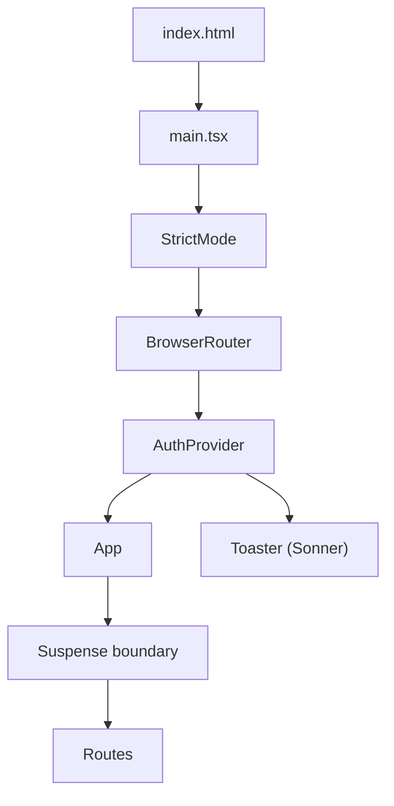

The bootstrap sequence in `main.tsx`:

1. `StrictMode` enables development warnings and double-rendering checks
2. `BrowserRouter` provides client-side routing context
3. `AuthProvider` fetches `/auth/me` on mount to hydrate user state
4. `App` defines all routes inside a top-level `Suspense` boundary
5. `Toaster` renders the toast notification container at `top-right`

---

### Page Structure

DevSage v2 has 14 page components organized by access level:

| Page | File | Route | Auth | Min Role | Description |
|------|------|-------|------|----------|-------------|
| Home | `home.tsx` | `/` | Public | - | Landing page with hero, bento grid, gallery (1054 LOC) |
| Login | `login.tsx` | `/login` | Public | - | OAuth buttons (GitHub + Google) |
| Auth Callback | `auth-callback.tsx` | `/auth/callback` | Public | - | Post-OAuth redirect handler |
| Link Required | `link-required.tsx` | `/link-required` | Public | - | GitHub account linking prompt |
| Dashboard | `dashboard.tsx` | `/dashboard` | Authenticated | participant | Hackathon list with tabs and filtering |
| Hackathon Detail | `hackathon-detail.tsx` | `/hackathons/:slug` | Authenticated | participant | Hackathon overview, team status, submissions |
| Team Management | `team-management.tsx` | `/hackathons/:slug/teams` | Authenticated | participant | Team creation, invites, repo linking |
| Leaderboard | `leaderboard.tsx` | `/hackathons/:slug/leaderboard` | Authenticated | participant | Scores and rankings (public when visible) |
| Judge Dashboard | `judge-dashboard.tsx` | `/hackathons/:slug/judge` | Authenticated | judge | Assigned submissions, rubric scoring |
| Organizer Dashboard | `organizer-dashboard.tsx` | `/organiser` | Authenticated | admin | Hackathon management, phase transitions |
| Profile | `profile.tsx` | `/profile` | Authenticated | participant | User profile and settings |
| About | `about.tsx` | `/about` | Public | - | Platform information (file exists, no route) |
| Not Found | `not-found.tsx` | `*` | Public | - | 404 fallback page |
| Hack001 | `hackathons/hack001.tsx` | - | - | - | Special-case hackathon page |

#### Route Nesting

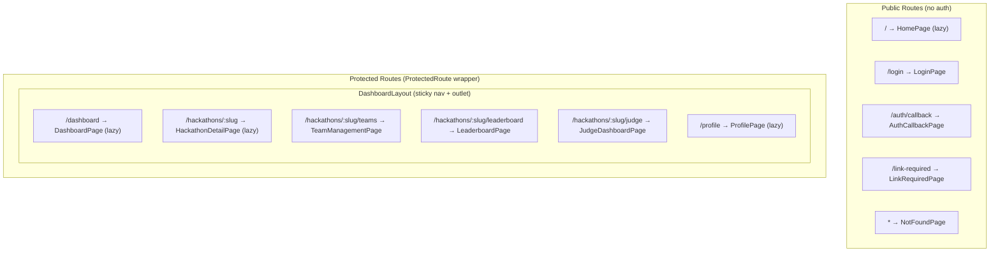

Four pages are already lazy-loaded via `React.lazy()`: `HomePage`, `DashboardPage`, `HackathonDetailPage`, and `ProfilePage`. The remaining protected pages are eagerly imported.

---

### Component Hierarchy

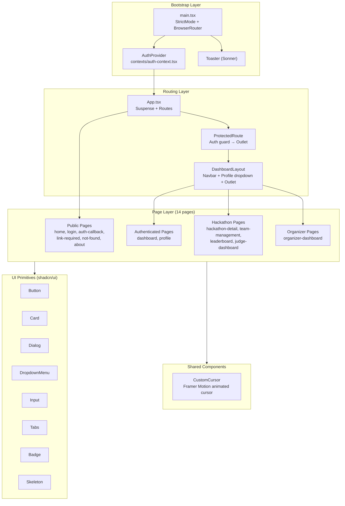

---

### Auth Flow

The frontend authentication flow is entirely cookie-based. The API sets an HttpOnly JWT cookie after OAuth, and the SPA hydrates user state on mount.

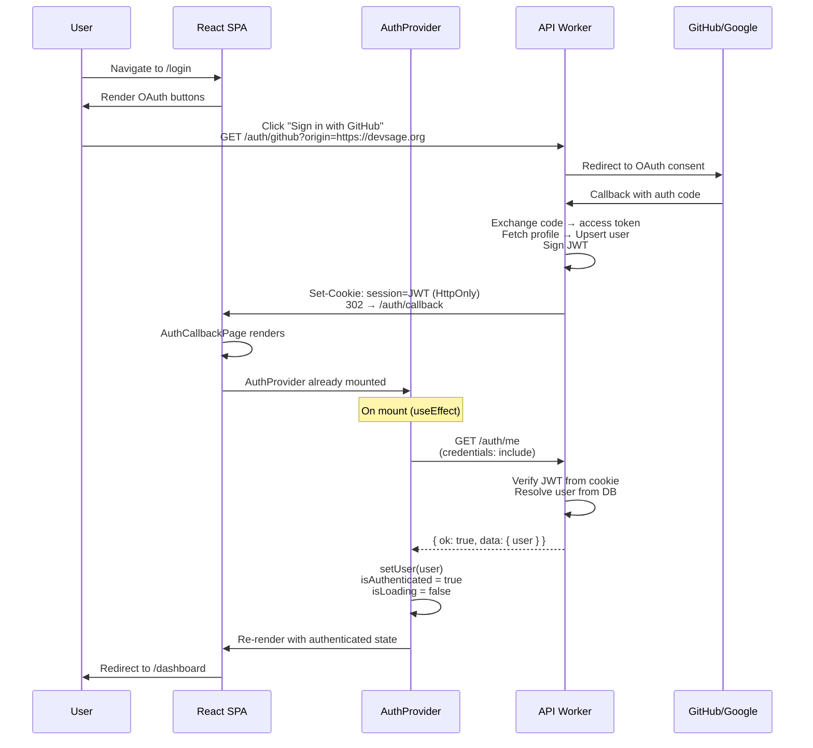

#### AuthContext API

```typescript
interface AuthContextType {
  user: User | null;          // Current user (id, github_username, display_name, email, avatar_url, organizerRoles)
  isAuthenticated: boolean;   // Derived: !!user
  isLoading: boolean;         // True during initial /auth/me check
  logout: () => Promise<void>; // POST /auth/logout → clear state → redirect /login
}

const { user, isAuthenticated, isLoading, logout } = useAuth();
```

---

### API Client Pattern

All API communication flows through `apiRequest<T>()` in `lib/api.ts`:

```typescript
async function apiRequest<T>(endpoint: string, options?: RequestInit): Promise<T>
```

| Behavior | Implementation |
|----------|---------------|
| Base URL | `VITE_API_ORIGIN` in production, relative path (Vite proxy) in dev |
| Credentials | `credentials: 'include'` on every request (sends HttpOnly cookie) |
| Content-Type | `application/json` by default |
| 401 handling | Auto-redirect to `/login` (except for `/auth/me` to avoid loops) |
| Error handling | Throws `ApiError(status, message)` on non-OK responses |
| 204 handling | Returns `{}` for No Content responses |

#### Dev Proxy Configuration

Vite proxies four path prefixes to the local API worker during development:

| Path prefix | Target |
|-------------|--------|
| `/api/v1` | `http://localhost:8787` |
| `/auth` | `http://localhost:8787` |
| `/hackathons` | `http://localhost:8787` |
| `/webhooks` | `http://localhost:8787` |

---

### State Management

v2 uses a minimal state management approach:

| State type | Solution | Scope |
|-----------|----------|-------|
| Auth state | React Context (`AuthProvider`) | Global — user, isAuthenticated, isLoading |
| Page state | `useState` / `useEffect` | Local — form inputs, filters, toggles |
| URL state | React Router params/search | Per-route — `:slug`, query params |
| Server data | Direct `apiRequest()` in `useEffect` | Per-component — no caching layer |
| Notifications | Sonner `toast()` | Ephemeral — auto-dismiss |

There is no global state management library (no Redux, Zustand, or Jotai). Server data is fetched imperatively in `useEffect` hooks with local `useState` for loading/error/data states.

---

### Styling System

#### Tailwind CSS v4 with CSS Variables

The theme is defined in `src/index.css` using Tailwind v4's `@theme` directive and CSS custom properties:

| Variable | Light | Dark | Usage |
|----------|-------|------|-------|
| `--background` | `0 0% 100%` | `222.2 84% 4.9%` | Page background |
| `--foreground` | `222.2 84% 4.9%` | `210 40% 98%` | Primary text |
| `--primary` | `222.2 47.4% 11.2%` | `210 40% 98%` | Primary actions |
| `--accent` | `210 40% 96.1%` | `217.2 32.6% 17.5%` | Accent surfaces |
| `--destructive` | `0 84.2% 60.2%` | `0 62.8% 30.6%` | Error/danger states |
| `--border` | `214.3 31.8% 91.4%` | `217.2 32.6% 17.5%` | Border color |
| `--ring` | `222.2 84% 4.9%` | `212.7 26.8% 83.9%` | Focus ring |
| `--radius` | `0.5rem` | `0.5rem` | Border radius base |

The brand accent color `#CCFF00` is used directly in component classes (not via CSS variables) for the distinctive neon-green highlights throughout the dashboard.

#### Fonts

| Token | Font | Usage |
|-------|------|-------|
| `--font-sans` | Inter | Body text, UI elements |
| `--font-mono` | Geist Mono | Code blocks, technical data |

#### shadcn/ui Component System

Eight Radix-based primitives are installed in `components/ui/`:

| Component | File | Radix dependency | Usage |
|-----------|------|-------------------|-------|
| Button | `button.tsx` | `@radix-ui/react-slot` | Primary actions, OAuth buttons |
| Card | `card.tsx` | - | Content containers, hackathon cards |
| Dialog | `dialog.tsx` | `@radix-ui/react-dialog` | Modals (team invite, confirmations) |
| DropdownMenu | `dropdown-menu.tsx` | `@radix-ui/react-dropdown-menu` | Profile menu, action menus |
| Input | `input.tsx` | - | Form fields |
| Tabs | `tabs.tsx` | `@radix-ui/react-tabs` | Dashboard filtering, detail views |
| Badge | `badge.tsx` | - | Status indicators, role labels |
| Skeleton | `skeleton.tsx` | - | Loading placeholders |

All components use `class-variance-authority` (CVA) for variant management and `cn()` (clsx + tailwind-merge) for class composition.

---

### Protected Routes Pattern

The `ProtectedRoute` component wraps all authenticated routes:

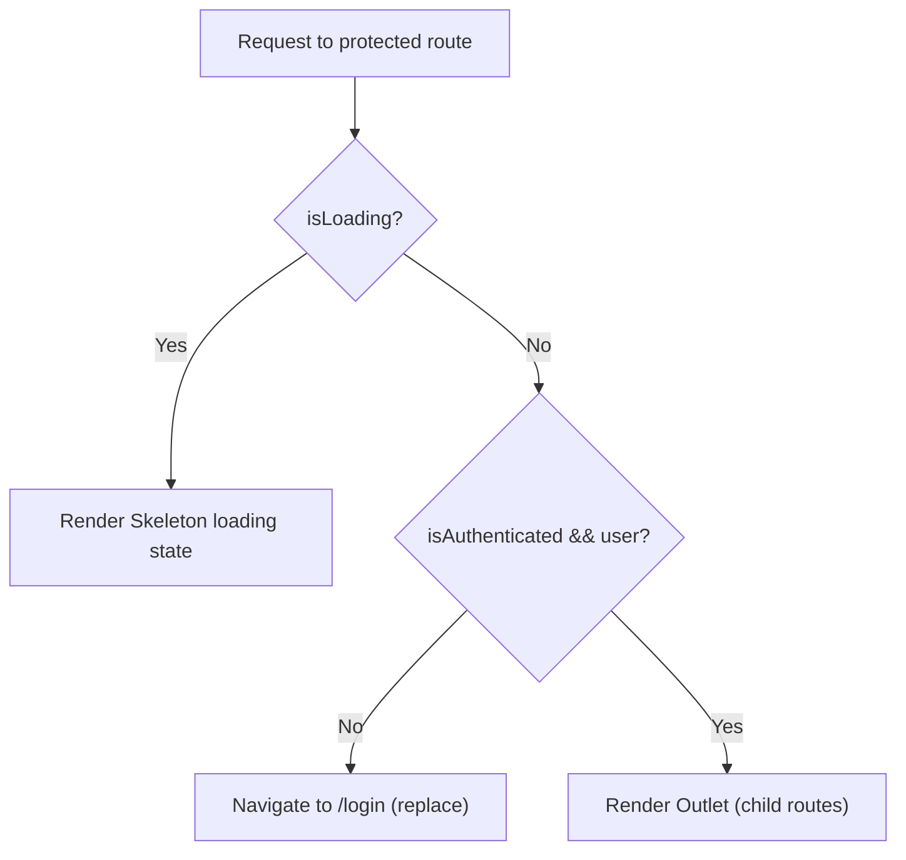

Protected routes are nested inside `DashboardLayout`, which provides:
- Sticky top navbar with DEVSAGE branding
- Navigation links with active state highlighting (`#CCFF00` accent)
- Profile dropdown (avatar, display name, email, profile link, logout)
- Background effects (grid pattern, gradient blurs)
- Content area via `<Outlet />`

---

### Current Directory Structure

```
apps/web/
├── src/
│   ├── main.tsx                    # Bootstrap: StrictMode + BrowserRouter + AuthProvider + Toaster
│   ├── App.tsx                     # All route definitions (single file)
│   ├── index.css                   # Tailwind v4 theme (CSS vars, scrollbar, animations)
│   ├── vite-env.d.ts               # Vite client type declarations
│   ├── pages/                      # Page components (flat structure)
│   │   ├── home.tsx                # Landing page (1054 LOC)
│   │   ├── login.tsx               # OAuth login
│   │   ├── auth-callback.tsx       # Post-OAuth handler
│   │   ├── link-required.tsx       # GitHub linking prompt
│   │   ├── dashboard.tsx           # Hackathon list + tabs
│   │   ├── hackathon-detail.tsx    # Hackathon overview
│   │   ├── team-management.tsx     # Team CRUD + invites
│   │   ├── leaderboard.tsx         # Scores + rankings
│   │   ├── judge-dashboard.tsx     # Judge scoring interface
│   │   ├── organizer-dashboard.tsx # Organizer management
│   │   ├── profile.tsx             # User profile
│   │   ├── about.tsx               # About page (no route)
│   │   ├── not-found.tsx           # 404 page
│   │   └── hackathons/
│   │       └── hack001.tsx         # Special-case hackathon
│   ├── components/
│   │   ├── protected-route.tsx     # Auth guard with skeleton loading
│   │   ├── dashboard-layout.tsx    # Navbar + profile dropdown + outlet
│   │   ├── custom-cursor.tsx       # Framer Motion animated cursor
│   │   └── ui/                     # shadcn/ui primitives
│   │       ├── button.tsx
│   │       ├── card.tsx
│   │       ├── dialog.tsx
│   │       ├── dropdown-menu.tsx
│   │       ├── input.tsx
│   │       ├── tabs.tsx
│   │       ├── badge.tsx
│   │       └── skeleton.tsx
│   ├── contexts/
│   │   └── auth-context.tsx        # AuthProvider + useAuth() hook
│   ├── lib/
│   │   ├── api.ts                  # apiRequest() fetch wrapper
│   │   └── utils.ts                # cn() class merging utility
│   └── __tests__/
│       ├── auth-context.test.tsx   # AuthProvider unit tests
│       └── login.test.tsx          # Login page tests
├── index.html                      # SPA entry point
├── vite.config.ts                  # Vite + React + Tailwind + dev proxy
├── vitest.config.ts                # Vitest + jsdom + path aliases
├── tsconfig.json                   # TypeScript (extends config/tsconfig.react.json)
├── wrangler.jsonc                  # Cloudflare Workers Static Assets config
├── package.json                    # Dependencies and scripts
└── .env.production                 # VITE_API_ORIGIN=https://api.devsage.org
```

---

## v3 Frontend Vision

v3 evolves the frontend from a simple SPA with imperative data fetching into a production-grade application with real-time capabilities, intelligent caching, offline support, and comprehensive accessibility.

### Design Principles

| ID | Principle | Implication |
|----|-----------|-------------|
| F1 | **Server state is not client state** | TanStack Query manages all server data; React Context reserved for client-only state (auth, theme) |
| F2 | **Optimistic by default** | Mutations update UI immediately; reconcile on server response or rollback on error |
| F3 | **Progressive enhancement** | Core flows work without JS hydration; real-time and offline are additive layers |
| F4 | **Accessible first** | WCAG 2.1 AA compliance is a requirement, not an afterthought |
| F5 | **Performance budgeted** | Every page has measurable targets; regressions block deployment |
| F6 | **Feature-isolated** | Each feature owns its components, hooks, and queries; no cross-feature imports except through shared layers |

---

### Real-Time Updates

WebSocket connections via Durable Objects provide live updates for time-sensitive hackathon data.

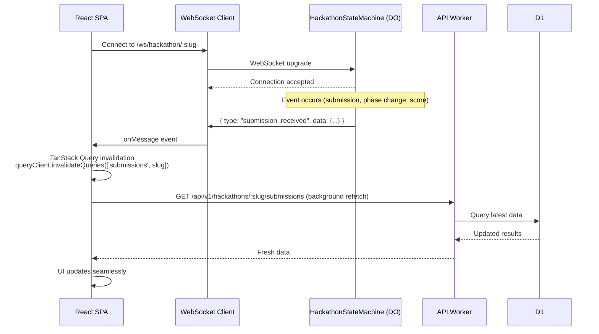

#### Event Types

| Event | Payload | UI Effect |
|-------|---------|-----------|
| `submission_received` | `{ team_id, tag, timestamp }` | Flash new submission in activity feed, update submission count |
| `phase_changed` | `{ from, to, timestamp }` | Update phase badge, show toast, enable/disable actions |
| `score_published` | `{ team_id, total_score }` | Animate leaderboard reorder |
| `team_joined` | `{ team_id, user_id }` | Update participant count |
| `announcement` | `{ title, body }` | Show prominent toast notification |
| `deadline_warning` | `{ deadline, remaining_minutes }` | Show countdown timer, change urgency color |

#### Fallback Strategy

If WebSocket connection fails or is unavailable, the client falls back to polling:

| Condition | Strategy | Interval |
|-----------|----------|----------|
| WebSocket connected | Real-time push | Instant |
| WebSocket disconnected | Exponential backoff reconnect | 1s, 2s, 4s, 8s, max 30s |
| WebSocket unavailable | Polling via TanStack Query `refetchInterval` | 30s (active tab), disabled (background) |

---

### Optimistic UI

Mutations update the UI immediately before the server confirms, providing instant feedback.

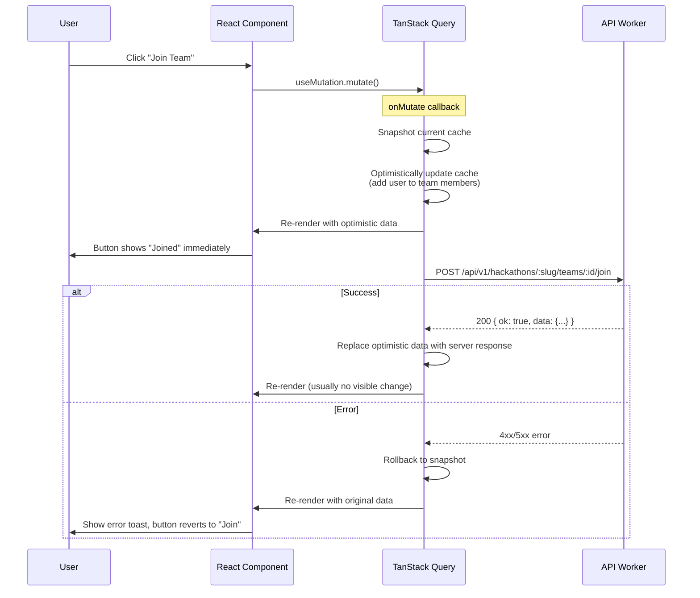

#### Optimistic Mutation Candidates

| Action | Optimistic behavior | Rollback |
|--------|-------------------|----------|
| Join team | Add user to member list | Remove user, show error |
| Submit score (judge) | Update score in local cache | Revert score, show error |
| Update profile | Show new values immediately | Revert to previous values |
| Create team | Show team in list with pending state | Remove team, show error |
| Toggle leaderboard visibility | Flip visibility flag | Revert flag, show error |

---

### Advanced State Management

v3 introduces TanStack Query for server state while keeping React Context lean.

| State category | v2 solution | v3 solution | Rationale |
|---------------|-------------|-------------|-----------|
| Auth state | React Context | React Context (unchanged) | Client-only, rarely changes, needs synchronous access |
| Theme/preferences | - | React Context | Client-only, affects entire tree |
| Server data | `useEffect` + `useState` | TanStack Query | Caching, deduplication, background refetch, optimistic updates |
| Form state | `useState` | `useState` (unchanged) | Ephemeral, component-scoped |
| URL state | React Router | React Router (unchanged) | Already correct abstraction |
| Real-time events | - | WebSocket + Query invalidation | Push-based updates trigger cache refresh |

#### TanStack Query Configuration

```typescript
const queryClient = new QueryClient({
  defaultOptions: {
    queries: {
      staleTime: 30_000,          // 30s before background refetch
      gcTime: 5 * 60_000,         // 5min garbage collection
      retry: 2,                    // Retry failed requests twice
      refetchOnWindowFocus: true,  // Refetch when tab regains focus
      refetchOnReconnect: true,    // Refetch when network reconnects
    },
    mutations: {
      retry: 0,                    // No automatic retry on mutations
    },
  },
});
```

#### Query Key Convention

```typescript
// Hierarchical keys for granular invalidation
['hackathons']                                    // All hackathons
['hackathons', slug]                              // Single hackathon
['hackathons', slug, 'teams']                     // Teams for a hackathon
['hackathons', slug, 'submissions']               // Submissions
['hackathons', slug, 'leaderboard']               // Leaderboard
['hackathons', slug, 'judge', 'assignments']      // Judge assignments
['user', 'me']                                    // Current user profile
['notifications']                                 // User notifications
```

---

### Code Splitting and Lazy Loading

v2 already lazy-loads 4 pages. v3 extends this to all page components and adds Suspense boundaries with meaningful loading states.

#### Lazy Loading Strategy

| Component type | Strategy | Loading state |
|---------------|----------|---------------|
| Page components | `React.lazy()` + dynamic import | Route-level Suspense with skeleton |
| Heavy UI components (charts, editors) | `React.lazy()` | Inline Suspense with spinner |
| shadcn/ui primitives | Eager import | N/A (small, shared) |
| Utility libraries | Vite dynamic import | N/A (loaded on demand) |

#### Suspense Boundary Hierarchy

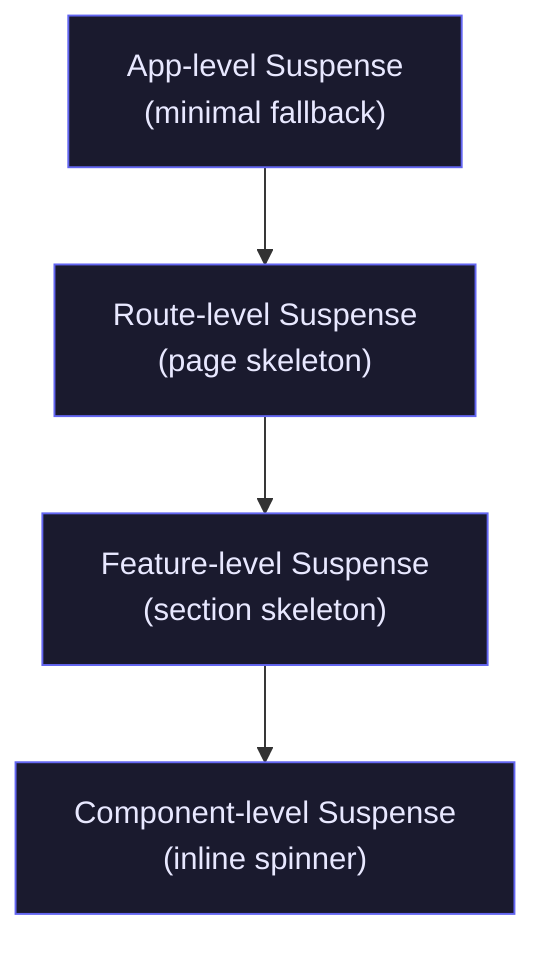

Each boundary provides progressively more specific loading UI:
- **App-level**: Empty container (prevents flash of unstyled content)
- **Route-level**: Full page skeleton matching the target page layout
- **Feature-level**: Section skeleton (e.g., leaderboard table placeholder)
- **Component-level**: Inline spinner or shimmer for individual widgets

---

### Offline Capability

Service Worker caching and IndexedDB storage enable core functionality without network connectivity.

| Layer | Technology | Cached content | Strategy |
|-------|-----------|----------------|----------|
| Static assets | Service Worker (Workbox) | JS bundles, CSS, fonts, images | Cache-first, background update |
| API responses | Service Worker | GET requests for hackathon data | Network-first, cache fallback |
| Draft data | IndexedDB | Unsaved form data, draft scores | Write-through, sync on reconnect |
| Auth state | Memory only | JWT cookie (HttpOnly) | Not cached offline (re-auth required) |

#### Offline User Experience

| Scenario | Behavior |
|----------|----------|
| Viewing cached hackathon | Serve from cache, show "offline" indicator |
| Submitting a score (judge) | Save to IndexedDB, queue for sync, show "pending sync" badge |
| Navigating to uncached page | Show offline fallback page with cached navigation |
| Network restored | Background sync queued mutations, refresh stale caches |

---

### Accessibility (a11y)

WCAG 2.1 AA compliance plan for v3:

| Category | Requirement | Implementation |
|----------|-------------|----------------|
| Keyboard navigation | All interactive elements reachable via Tab | Radix primitives handle focus management; custom components use `tabIndex` and `onKeyDown` |
| Focus management | Focus moves logically on route change | `useEffect` to focus main content heading on navigation |
| Screen readers | All content accessible via ARIA | `aria-label`, `aria-describedby`, `aria-live` regions for dynamic content |
| Color contrast | 4.5:1 minimum for normal text, 3:1 for large text | Audit all CSS variable combinations; `#CCFF00` on dark backgrounds passes AA |
| Motion sensitivity | Respect `prefers-reduced-motion` | Framer Motion `useReducedMotion()` hook; disable animations globally |
| Form accessibility | Labels, error messages, required indicators | `<label>` elements, `aria-invalid`, `aria-errormessage` on inputs |
| Live regions | Dynamic content announced to screen readers | `aria-live="polite"` for toast notifications, `aria-live="assertive"` for errors |
| Skip navigation | Skip to main content link | Hidden skip link visible on focus, targets `<main>` element |
| Image alt text | All images have descriptive alt text | `alt` attributes on avatars, hackathon images; decorative images use `alt=""` |

#### Focus Management on Route Change

```typescript
// Custom hook for route-change focus management
function useRouteFocus() {
  const location = useLocation();
  const mainRef = useRef<HTMLElement>(null);

  useEffect(() => {
    // Move focus to main content on route change
    mainRef.current?.focus({ preventScroll: false });
  }, [location.pathname]);

  return mainRef;
}
```

---

### Internationalization (i18n)

Multi-language support via `react-intl` (FormatJS):

| Aspect | Decision |
|--------|----------|
| Library | `react-intl` (ICU MessageFormat, mature ecosystem) |
| Default locale | `en-US` |
| Initial languages | English, Spanish, Hindi |
| Message extraction | `@formatjs/cli extract` from source |
| Message storage | `src/i18n/{locale}.json` per locale |
| Number/date formatting | `Intl.NumberFormat` / `Intl.DateTimeFormat` via react-intl |
| Pluralization | ICU plural rules (`{count, plural, one {# team} other {# teams}}`) |
| Loading strategy | Lazy-load locale bundles (only load active locale) |

---

### Theme System

v3 extends the existing CSS variable system to support dark mode toggling and per-hackathon custom themes.

#### Dark Mode

| Property | Implementation |
|----------|---------------|
| Toggle mechanism | React Context (`ThemeProvider`) with `localStorage` persistence |
| CSS strategy | `.dark` class on `<html>` element (already defined in `index.css`) |
| System preference | `prefers-color-scheme` media query as default |
| Transition | `transition-colors duration-200` on `<body>` for smooth switching |

#### Per-Hackathon Themes

Hackathons can define a `primary_color` that overrides the default `#CCFF00` accent:

```typescript
// Applied when viewing a hackathon page
function useHackathonTheme(hackathon: Hackathon) {
  useEffect(() => {
    if (hackathon.primary_color) {
      document.documentElement.style.setProperty('--hackathon-accent', hackathon.primary_color);
    }
    return () => {
      document.documentElement.style.removeProperty('--hackathon-accent');
    };
  }, [hackathon.primary_color]);
}
```

CSS variables cascade naturally, so hackathon-scoped overrides apply to all child components without prop drilling.

---

### Component Library

v3 extracts reusable UI components into a shared package:

```
packages/ui/                        # NEW: Shared component library
├── src/
│   ├── primitives/                 # Base components (Button, Input, Card, etc.)
│   ├── composites/                 # Multi-primitive components (DataTable, FormField, etc.)
│   ├── layouts/                    # Layout components (PageShell, Sidebar, etc.)
│   └── index.ts                    # Barrel export
├── package.json                    # @devsage/ui
└── tsconfig.json
```

| Layer | Contents | Consumers |
|-------|----------|-----------|
| Primitives | Current `components/ui/*` (Button, Card, Dialog, etc.) | All apps |
| Composites | DataTable, FormField, StatCard, EmptyState, ConfirmDialog | All apps |
| Layouts | PageShell, DashboardLayout, PublicLayout, AdminLayout | `apps/web` |

This enables future apps (e.g., a mobile-optimized judge interface) to share the same component system.

---

### Performance Budget

| Metric | Target | Measurement |
|--------|--------|-------------|
| Lighthouse Performance | 90+ | CI check on every PR |
| JS bundle (gzipped) | < 200 KB | Vite build output + `rollup-plugin-visualizer` |
| CSS bundle (gzipped) | < 30 KB | Tailwind purge + minification |
| Largest Contentful Paint (LCP) | < 3.0s | Lighthouse + Web Vitals |
| First Input Delay (FID) | < 100ms | Web Vitals |
| Cumulative Layout Shift (CLS) | < 0.1 | Lighthouse + Web Vitals |
| Time to Interactive (TTI) | < 4.0s | Lighthouse |
| Total Blocking Time (TBT) | < 200ms | Lighthouse |

#### Bundle Budget Enforcement

```typescript
// vite.config.ts — chunk size warnings
build: {
  rollupOptions: {
    output: {
      manualChunks: {
        'vendor-react': ['react', 'react-dom', 'react-router-dom'],
        'vendor-ui': ['@radix-ui/react-dialog', '@radix-ui/react-dropdown-menu', '@radix-ui/react-tabs'],
        'vendor-motion': ['framer-motion'],
        'vendor-query': ['@tanstack/react-query'],
      },
    },
  },
  chunkSizeWarningLimit: 150, // KB — warn on large chunks
}
```

---

### Testing Strategy

v3 expands testing from unit tests to a comprehensive three-tier strategy:

| Tier | Tool | Scope | Target |
|------|------|-------|--------|
| Unit | Vitest + jsdom | Hooks, utilities, pure functions | 90% coverage on `lib/`, `contexts/`, custom hooks |
| Component | Vitest + Testing Library | Component rendering, user interactions | All shared components, critical page flows |
| E2E | Playwright | Full user journeys across pages | Auth flow, hackathon creation, team join, submission, judging |

#### E2E Test Scenarios (Playwright)

| Scenario | Steps |
|----------|-------|
| Auth flow | Login via GitHub OAuth mock → verify dashboard loads → logout → verify redirect |
| Hackathon lifecycle | Create hackathon → open registration → join as participant → create team → submit → judge scores → view leaderboard |
| Role-based access | Verify participant cannot access organizer dashboard; judge cannot access admin panel |
| Responsive design | Run critical flows at mobile (375px), tablet (768px), and desktop (1440px) viewports |
| Offline resilience | Disconnect network → verify cached pages load → reconnect → verify sync |

#### Test File Convention

```
src/__tests__/                      # v2 location (kept for backward compat)
src/features/*/tests/               # v3 feature-colocated tests
e2e/                                # Playwright E2E tests (new in v3)
  ├── auth.spec.ts
  ├── hackathon-lifecycle.spec.ts
  ├── judging.spec.ts
  └── fixtures/
      └── test-data.ts
```

---

### Error Boundaries

Per-route error boundaries with fallback UI and error reporting:

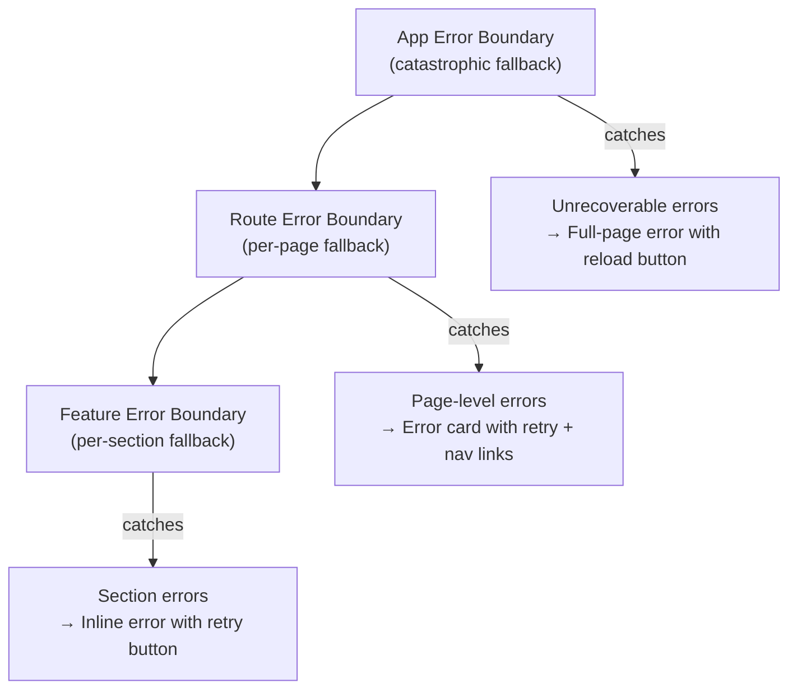

#### Error Boundary Behavior

| Boundary level | Fallback UI | Recovery action | Error reporting |
|---------------|-------------|-----------------|-----------------|
| App | Full-screen error page with DevSage branding | "Reload page" button | `console.error` + future: error tracking service |
| Route | Error card within layout (navbar still visible) | "Try again" button + navigation links | Log route + error details |
| Feature | Inline error message replacing the failed section | "Retry" button | Log component + error details |

---

### New Pages Planned

v3 adds 6 new pages to support analytics, sponsorship, mentoring, notifications, and platform administration:

| Page | Route | Auth | Min Role | Description |
|------|-------|------|----------|-------------|
| Analytics Dashboard | `/hackathon/:slug/analytics` | Authenticated | admin | Submission trends, team activity heatmaps, participation metrics, GitHub commit graphs |
| Sponsor Portal | `/hackathon/:slug/sponsors` | Authenticated | admin | Sponsor tier management, logo uploads, perk configuration, sponsor visibility settings |
| Mentor Matching | `/hackathon/:slug/mentors` | Authenticated | participant | Browse available mentors, request mentorship, schedule office hours, mentor-team pairing |
| Notification Center | `/notifications` | Authenticated | participant | In-app notification inbox, read/unread state, notification preferences, email digest settings |
| Admin Panel | `/admin` | Authenticated | platform_admin | Platform-wide user management, hackathon oversight, system health, feature flags |
| Public Directory | `/` (redesigned) | Public | - | Searchable/filterable hackathon directory, featured events, category tags, location/date filters |

---

## Component Architecture (v3)

### Feature-Based Folder Structure

v3 migrates from the flat `pages/` structure to a feature-based organization:

```
apps/web/src/
├── app/
│   ├── App.tsx                     # Route definitions
│   ├── main.tsx                    # Bootstrap
│   ├── providers.tsx               # Composed providers (Auth, Theme, Query, Intl)
│   └── error-boundary.tsx          # App-level error boundary
├── features/
│   ├── auth/
│   │   ├── pages/                  # login, auth-callback, link-required
│   │   ├── components/             # OAuthButton, AccountLinkForm
│   │   ├── hooks/                  # useAuth (moved from contexts/)
│   │   └── tests/
│   ├── dashboard/
│   │   ├── pages/                  # dashboard
│   │   ├── components/             # HackathonCard, FilterBar, StatsGrid
│   │   ├── hooks/                  # useHackathonList, useDashboardStats
│   │   └── tests/
│   ├── hackathon/
│   │   ├── pages/                  # hackathon-detail, analytics
│   │   ├── components/             # PhaseIndicator, ActivityFeed, DeadlineTimer
│   │   ├── hooks/                  # useHackathon, useHackathonTheme, useWebSocket
│   │   └── tests/
│   ├── team/
│   │   ├── pages/                  # team-management
│   │   ├── components/             # TeamCard, InviteDialog, MemberList
│   │   ├── hooks/                  # useTeam, useTeamMembers
│   │   └── tests/
│   ├── judging/
│   │   ├── pages/                  # judge-dashboard, leaderboard
│   │   ├── components/             # ScoreCard, RubricForm, LeaderboardTable
│   │   ├── hooks/                  # useAssignments, useScoring
│   │   └── tests/
│   ├── organizer/
│   │   ├── pages/                  # organizer-dashboard, sponsor-portal
│   │   ├── components/             # PhaseControl, SettingsForm, SponsorTierEditor
│   │   ├── hooks/                  # useOrganizerHackathons, usePhaseTransition
│   │   └── tests/
│   ├── mentoring/
│   │   ├── pages/                  # mentor-matching
│   │   ├── components/             # MentorCard, ScheduleCalendar, RequestForm
│   │   ├── hooks/                  # useMentors, useMentorRequests
│   │   └── tests/
│   ├── notifications/
│   │   ├── pages/                  # notification-center
│   │   ├── components/             # NotificationList, PreferencesForm
│   │   ├── hooks/                  # useNotifications, useUnreadCount
│   │   └── tests/
│   ├── admin/
│   │   ├── pages/                  # admin-panel
│   │   ├── components/             # UserTable, SystemHealth, FeatureFlags
│   │   ├── hooks/                  # useAdminStats, useUserManagement
│   │   └── tests/
│   └── profile/
│       ├── pages/                  # profile
│       ├── components/             # AvatarUpload, LinkedAccounts
│       ├── hooks/                  # useProfile
│       └── tests/
├── shared/
│   ├── components/                 # Cross-feature components
│   │   ├── error-boundary.tsx
│   │   ├── loading-skeleton.tsx
│   │   ├── empty-state.tsx
│   │   └── confirm-dialog.tsx
│   ├── hooks/                      # Cross-feature hooks
│   │   ├── use-api-query.ts        # TanStack Query wrapper around apiRequest()
│   │   ├── use-websocket.ts        # WebSocket connection manager
│   │   ├── use-route-focus.ts      # a11y focus management
│   │   └── use-reduced-motion.ts   # Motion preference detection
│   └── lib/                        # Utilities
│       ├── api.ts                  # apiRequest() (unchanged)
│       ├── utils.ts                # cn() (unchanged)
│       ├── query-keys.ts           # Centralized query key factory
│       └── websocket.ts            # WebSocket client with reconnection
├── layouts/
│   ├── dashboard-layout.tsx        # Authenticated pages (navbar + sidebar)
│   ├── public-layout.tsx           # Public pages (minimal header + footer)
│   └── admin-layout.tsx            # Admin pages (sidebar nav + breadcrumbs)
├── i18n/
│   ├── en.json                     # English messages
│   ├── es.json                     # Spanish messages
│   ├── hi.json                     # Hindi messages
│   └── provider.tsx                # IntlProvider wrapper with lazy locale loading
└── styles/
    └── index.css                   # Tailwind v4 theme + global styles
```

### Component Tree (v3)

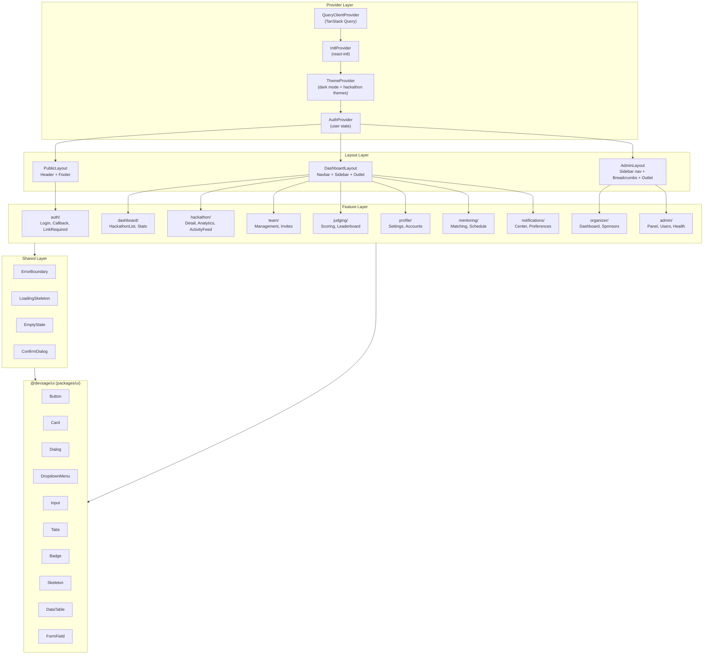

### Layout System

| Layout | Routes | Features |
|--------|--------|----------|
| `PublicLayout` | `/`, `/login`, `/auth/callback`, `/link-required`, `/about` | Minimal header with logo, footer with links, no auth required |
| `DashboardLayout` | `/dashboard`, `/hackathons/*`, `/profile`, `/notifications`, `/hackathon/:slug/mentors` | Sticky navbar, collapsible sidebar, profile dropdown, notification bell, breadcrumbs |
| `AdminLayout` | `/organiser`, `/admin`, `/hackathon/:slug/analytics`, `/hackathon/:slug/sponsors` | Sidebar navigation, breadcrumbs, role indicator, system status bar |

---

## Data Flow (v3)

### Query Data Flow

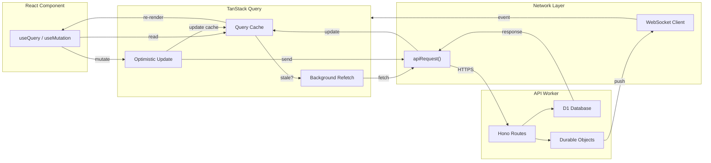

### Real-Time Data Flow

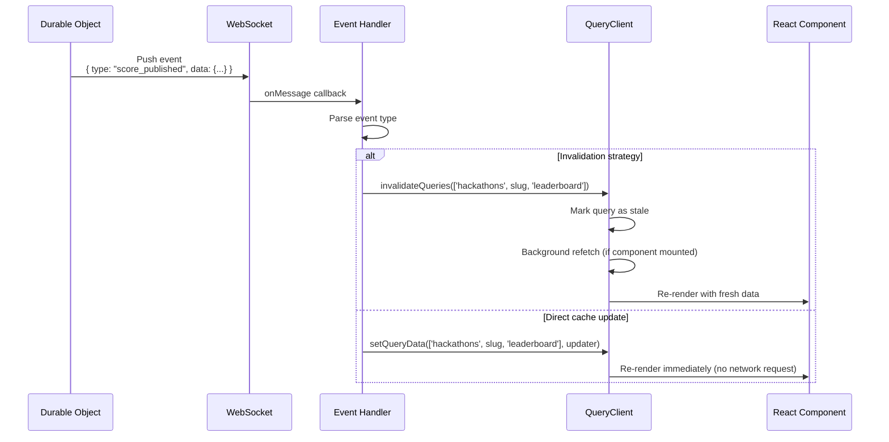

### Mutation Flow with Error Recovery

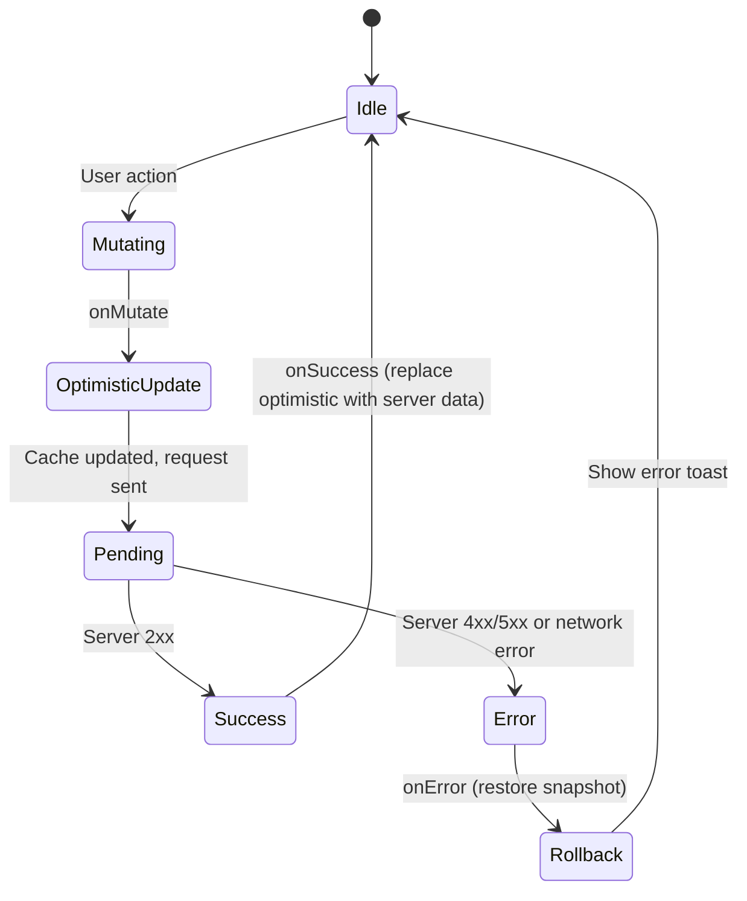

---

## Build and Deploy (v3)

### Vite Build Optimizations

| Optimization | Configuration | Impact |
|-------------|---------------|--------|
| Code splitting | `React.lazy()` for all pages | Smaller initial bundle, faster first load |
| Manual chunks | Vendor splitting (react, radix, motion, query) | Better cache hit rates on deploys |
| Tree shaking | ESM imports + Vite default | Remove unused code paths |
| CSS purging | Tailwind v4 automatic purge | Only ship used utility classes |
| Asset hashing | Vite default content hashing | Aggressive CDN caching with cache busting |
| Minification | esbuild (JS) + Lightning CSS (CSS) | Smaller output |
| Compression | gzip + brotli via Cloudflare | 60-70% size reduction |
| Bundle analysis | `rollup-plugin-visualizer` (ANALYZE=true) | Visual treemap of bundle composition |

### Bundle Splitting Strategy

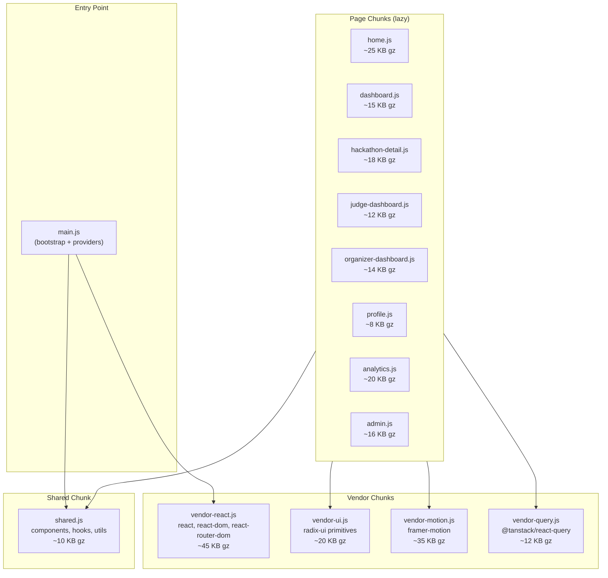

**Total initial load** (home page): ~80 KB gzipped (main + vendor-react + shared + home chunk). Well within the 200 KB budget.

### CDN Strategy with Cloudflare

| Asset type | Cache behavior | TTL |
|-----------|---------------|-----|
| Hashed JS/CSS (`*.abc123.js`) | Immutable | 1 year (`Cache-Control: public, max-age=31536000, immutable`) |
| `index.html` | Revalidate on every request | 0 (`Cache-Control: no-cache`) |
| Static images/fonts | Long-lived | 30 days |
| Service Worker (`sw.js`) | Revalidate | 0 (browser checks for updates) |

Cloudflare Workers Static Assets automatically serves files from the `dist/` directory at the edge. The `not_found_handling: "single-page-application"` setting ensures all unmatched routes serve `index.html` for client-side routing.

### Preview Deployments for PRs

| Feature | Implementation |
|---------|---------------|
| Trigger | GitHub PR opened/updated |
| Environment | Wrangler `--env dev` deployment |
| URL pattern | `https://web-dev.<account>.workers.dev` |
| Cleanup | Automatic on PR close/merge |
| API target | Dev API worker (`api-dev`) |

```yaml
# .github/workflows/preview.yml (planned)
on:
  pull_request:
    paths: ['apps/web/**', 'packages/shared/**', 'packages/ui/**']

jobs:
  preview:
    runs-on: ubuntu-latest
    steps:
      - uses: actions/checkout@v4
      - uses: pnpm/action-setup@v4
      - run: pnpm install --frozen-lockfile
      - run: pnpm --filter @devsage/web build
        env:
          VITE_API_ORIGIN: https://api-dev.devsage.org
      - run: pnpm --filter @devsage/web exec wrangler deploy --env dev
        env:
          CLOUDFLARE_API_TOKEN: ${{ secrets.CF_API_TOKEN }}
      - uses: actions/github-script@v7
        with:
          script: |
            github.rest.issues.createComment({
              issue_number: context.issue.number,
              owner: context.repo.owner,
              repo: context.repo.repo,
              body: 'Preview deployed: https://web-dev.cf3386ad6d48a38a199781a39b2324ad.workers.dev'
            })
```

---

## File References

### Current Frontend Files (v2)

| File | Purpose | LOC |
|------|---------|-----|
| `apps/web/src/main.tsx` | Bootstrap: StrictMode + BrowserRouter + AuthProvider + Toaster | 19 |
| `apps/web/src/App.tsx` | Route definitions with Suspense + lazy loading | 46 |
| `apps/web/src/index.css` | Tailwind v4 theme, CSS variables, scrollbar styles | 154 |
| `apps/web/src/vite-env.d.ts` | Vite client type declarations | - |
| `apps/web/src/pages/home.tsx` | Landing page (hero, bento grid, gallery) | 1054 |
| `apps/web/src/pages/login.tsx` | OAuth login buttons (GitHub + Google) | - |
| `apps/web/src/pages/auth-callback.tsx` | Post-OAuth redirect handler | - |
| `apps/web/src/pages/link-required.tsx` | GitHub account linking prompt | - |
| `apps/web/src/pages/dashboard.tsx` | Hackathon list with tabs and filtering | - |
| `apps/web/src/pages/hackathon-detail.tsx` | Hackathon overview, team status, submissions | - |
| `apps/web/src/pages/team-management.tsx` | Team creation, invites, repo linking | - |
| `apps/web/src/pages/leaderboard.tsx` | Scores and rankings table | - |
| `apps/web/src/pages/judge-dashboard.tsx` | Judge scoring interface | - |
| `apps/web/src/pages/organizer-dashboard.tsx` | Organizer management panel | - |
| `apps/web/src/pages/profile.tsx` | User profile and settings | - |
| `apps/web/src/pages/about.tsx` | About page (no route in App.tsx) | - |
| `apps/web/src/pages/not-found.tsx` | 404 fallback page | - |
| `apps/web/src/pages/hackathons/hack001.tsx` | Special-case hackathon page | - |
| `apps/web/src/components/protected-route.tsx` | Auth guard with skeleton loading state | 26 |
| `apps/web/src/components/dashboard-layout.tsx` | Sticky navbar + profile dropdown + outlet | 125 |
| `apps/web/src/components/custom-cursor.tsx` | Framer Motion animated cursor effect | - |
| `apps/web/src/components/ui/button.tsx` | shadcn/ui Button (CVA variants) | - |
| `apps/web/src/components/ui/card.tsx` | shadcn/ui Card container | - |
| `apps/web/src/components/ui/dialog.tsx` | shadcn/ui Dialog (Radix) | - |
| `apps/web/src/components/ui/dropdown-menu.tsx` | shadcn/ui DropdownMenu (Radix) | - |
| `apps/web/src/components/ui/input.tsx` | shadcn/ui Input field | - |
| `apps/web/src/components/ui/tabs.tsx` | shadcn/ui Tabs (Radix) | - |
| `apps/web/src/components/ui/badge.tsx` | shadcn/ui Badge | - |
| `apps/web/src/components/ui/skeleton.tsx` | shadcn/ui Skeleton loader | - |
| `apps/web/src/contexts/auth-context.tsx` | AuthProvider + useAuth() hook | 72 |
| `apps/web/src/lib/api.ts` | apiRequest() fetch wrapper with 401 redirect | 46 |
| `apps/web/src/lib/utils.ts` | cn() class merging (clsx + tailwind-merge) | 7 |
| `apps/web/src/__tests__/auth-context.test.tsx` | AuthProvider unit tests | - |
| `apps/web/src/__tests__/login.test.tsx` | Login page component tests | - |

### Configuration Files

| File | Purpose |
|------|---------|
| `apps/web/package.json` | Dependencies, scripts (`dev`, `build`, `test`, `deploy`) |
| `apps/web/vite.config.ts` | Vite plugins (React, Tailwind), path aliases, dev proxy, bundle analyzer |
| `apps/web/vitest.config.ts` | Vitest config (jsdom, globals, path aliases) |
| `apps/web/tsconfig.json` | TypeScript config (extends `config/tsconfig.react.json`, strict, path aliases) |
| `apps/web/wrangler.jsonc` | Cloudflare Workers Static Assets deployment config |
| `apps/web/.env.production` | `VITE_API_ORIGIN=https://api.devsage.org` |
| `apps/web/index.html` | SPA entry point (mounts `#root`) |
