# 13 — Frontend Architecture

> DevSage splits its frontend into three independently deployed React SPAs — one for participants, one for organizers, and one for internal platform administration. All three apps share a common tech stack and component library, communicating exclusively with a single Hono API Worker at `apps/api`.

**Related docs:** [Authentication](./01-authentication.md) | [API Design](./11-api-design.md) | [Infrastructure](./12-infrastructure.md) | [Roles & Permissions](./06-roles-permissions.md) | [Real-time](./14-real-time.md)

---

## Frontend Topology

DevSage's frontend is not a single monolith. It is three purpose-built applications, each serving a distinct audience with different feature sets, security boundaries, and deployment cadences.

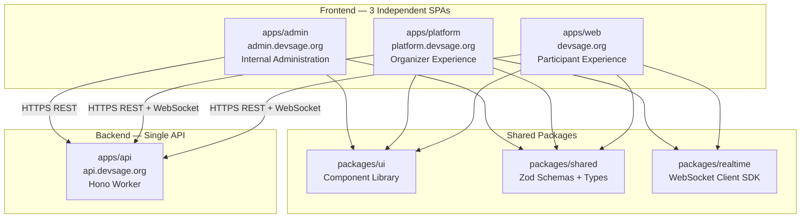

### Why Three Apps

| Reason | Detail |
|--------|--------|
| **Security isolation** | Admin tooling (impersonation, user bans, system config) is never shipped to participant or organizer browsers. Attack surface is minimized per app |
| **Independent deployment** | Ship an organizer bugfix without touching participant code. Different release cadences per audience |
| **Bundle size** | Each app only ships the code its users need. Participants never download organizer analytics or admin moderation tools |
| **Access control** | Each app has its own `ProtectedRoute` logic with audience-appropriate role checks. No shared auth state leaks across apps |
| **Team ownership** | Different teams or contributors can own different apps without merge conflicts on shared routing or layout code |

### App Summary

| App | Package | Audience | Port (dev) | Production URL | Auth |
|-----|---------|----------|------------|----------------|------|
| `apps/web` | `@devsage/web` | Hackathon participants, judges, public visitors | 5173 | `devsage.org` | OAuth (GitHub + Google) → JWT cookie |
| `apps/platform` | `@devsage/platform` | Hackathon organizers | 5174 | `platform.devsage.org` | OAuth → JWT cookie (organizer invite required) |
| `apps/admin` | `@devsage/admin` | DevSage internal team | 5175 | `admin.devsage.org` | OAuth → JWT cookie (team-member only) |

---

## Shared Tech Stack

All three apps share the same foundation. Consistency is enforced via `packages/config` (shared tsconfig + ESLint).

| Layer | Technology | Version | Purpose |
|-------|-----------|---------|---------|
| Framework | React | 18.x | Component model, hooks, Suspense |
| Build tool | Vite | 6.x | Dev server, HMR, production bundling |
| Routing | React Router | 7.x | Client-side routing, nested layouts |
| Styling | Tailwind CSS | 4.x | Utility-first CSS with CSS variables |
| Components | shadcn/ui (via `packages/ui`) | latest | Radix-based accessible primitives |
| Animations | Framer Motion | 11.x | Page transitions, interactive effects |
| Icons | Lucide React | latest | Consistent icon set |
| Toasts | Sonner | 1.x | Toast notification system |
| Validation | Zod (via `@devsage/shared`) | 3.x | Shared schemas between API and frontend |
| Server state | TanStack Query | 5.x | Caching, background refetch, optimistic updates |
| Variants | class-variance-authority | 0.7 | Component variant management |
| Class merging | clsx + tailwind-merge | latest | Conditional class composition |
| Deployment | Cloudflare Workers Static Assets | - | Edge-distributed static hosting per app |
| Testing | Vitest + Testing Library | 3.x / 16.x | Unit and component tests (jsdom) |
| E2E | Playwright | latest | Cross-app user journey testing |

### Shared Configuration

| Config | Package | Consumed by |
|--------|---------|-------------|
| `tsconfig.react.json` | `packages/config` | All three apps |
| `eslint.config.mjs` | `packages/config` | All three apps |
| Tailwind v4 theme tokens | `packages/ui` (exported CSS) | All three apps |
| Path alias `@/` → `src/` | Per-app `tsconfig.json` + `vite.config.ts` | All three apps |

---

## App 1: `apps/web` — Participant Experience

### Purpose

The primary public-facing application. Serves hackathon participants end-to-end: from discovering hackathons, through registration and team formation, to submitting projects and viewing results. Also serves judges with their scoring interface. Contains the marketing landing page and all public content.

### Deployment

```
Package:  @devsage/web
Build:    tsc --noEmit && vite build
Output:   apps/web/dist/
Deploy:   wrangler deploy → Cloudflare Workers Static Assets
Domain:   devsage.org
Env:      VITE_API_ORIGIN=https://api.devsage.org
```

### v3 Pages & Routes

#### Public Pages (no auth)

| Page | Route | Description |
|------|-------|-------------|
| **Landing** | `/` | Marketing hero, featured hackathons, testimonials, platform stats, call-to-action. The front door |
| **Hackathon Directory** | `/hackathons` | Searchable, filterable public listing of all hackathons. Status tabs (upcoming, active, judging, completed). Category tags, date range, location filters. Server-rendered previews for SEO |
| **Hackathon Public Page** | `/hackathons/:slug` | Public hackathon overview — description, timeline, tracks, sponsor showcase, prize breakdown. Registration CTA when open. Read-only when closed |
| **Login** | `/login` | OAuth buttons (GitHub + Google). Redirect to `/dashboard` on success |
| **Auth Callback** | `/auth/callback` | Post-OAuth redirect handler. Hydrates auth state, redirects to intended destination |
| **Link Required** | `/link-required` | Prompt to link GitHub account when signed in via Google without a GitHub connection |
| **About** | `/about` | Platform information, team, open-source credits |
| **Not Found** | `*` | 404 fallback with search suggestions and navigation links |

#### Authenticated Pages — Participant

| Page | Route | Min Role | Description |
|------|-------|----------|-------------|
| **Dashboard** | `/dashboard` | `participant` | Personal home — my hackathons (grouped by status), my teams, upcoming deadlines, recent activity feed, quick-join CTA for open hackathons |
| **Hackathon Detail** | `/hackathons/:slug/overview` | `participant` | Authenticated hackathon view — everything from public page plus: team status, submission status, phase-aware action buttons, real-time activity feed, announcements stream |
| **Team Management** | `/hackathons/:slug/team` | `participant` | Create team, join via invite code, manage members (invite/remove), link GitHub repository, view team activity log, repo commit timeline |
| **Team Discovery** | `/hackathons/:slug/teams` | `participant` | Browse teams looking for members. Filter by skills needed, team size, track. Request to join. Skill-based matching suggestions |
| **Submission** | `/hackathons/:slug/submit` | `team_leader` | Tag-based submission flow — select git tag, confirm artifacts, add description/demo link. Version history. Validation status. Diff viewer between submission versions |
| **Submission Detail** | `/hackathons/:slug/submissions/:id` | `participant` | View submission details — code snapshot at tag, attached artifacts (R2), AI review summary (when available), judge feedback (post-judging) |
| **Leaderboard** | `/hackathons/:slug/leaderboard` | `participant` | Live scores and rankings. Filter by track. Animated rank changes via WebSocket. Expandable score breakdown per rubric criterion. Visibility controlled by organizer |
| **Mentor Matching** | `/hackathons/:slug/mentors` | `participant` | Browse available mentors by expertise and availability. Request a mentorship session. View upcoming/past sessions. Schedule office hours. Session chat interface |
| **Notification Center** | `/notifications` | `participant` | In-app notification inbox — team invites, submission confirmations, deadline warnings, announcements, mentor responses. Read/unread state. Filter by type. Email digest preferences |
| **Profile** | `/profile` | `participant` | User settings — display name, avatar, bio, skill tags. Linked accounts (GitHub, Google). Participation history. Achievement badges. Notification preferences. Danger zone (delete account) |

#### Authenticated Pages — Judge

| Page | Route | Min Role | Description |
|------|-------|----------|-------------|
| **Judge Dashboard** | `/hackathons/:slug/judge` | `judge` | Assigned submissions queue. Rubric scoring interface with inline code viewer. Progress tracker (scored / total). AI review comparison. Submit scores with written feedback. Flag submissions for organizer review |
| **Judge Leaderboard** | `/hackathons/:slug/judge/leaderboard` | `judge` | Judge-only preliminary results view. Score distribution visualization. Consensus tracking across judges |

### Route Nesting

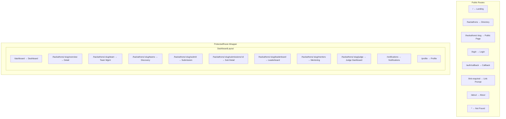

### Key Features

#### Real-Time Activity Feed

Every hackathon detail page streams live events from the WebSocket Gateway DO:

| Event | UI Effect |
|-------|-----------|
| `submission_received` | Flash new submission card in activity feed, update submission count badge |
| `phase_changed` | Update phase indicator badge, show toast, enable/disable phase-gated actions |
| `score_published` | Animate leaderboard row reorder, flash rank change indicator |
| `team_joined` | Update participant count, show toast if user's hackathon |
| `announcement` | Prominent banner notification with dismiss, persist in announcements list |
| `deadline_warning` | Countdown timer with urgency color progression (green → yellow → red) |
| `commit_pushed` | Tick team activity graph, show commit summary in team feed |
| `mentor_session_accepted` | Toast notification, update mentor matching page |

#### Submission Workflow

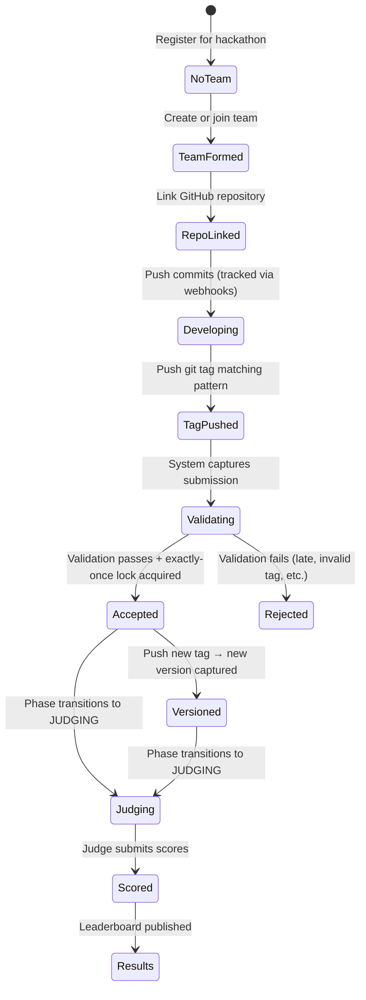

#### Team Collaboration

- **Invite system**: Generate shareable invite codes. Deep-link: `/hackathons/:slug/team?invite=CODE`
- **Repo linking**: Connect a GitHub repository. Webhooks auto-track commits, PRs, and tags
- **Activity timeline**: Real-time commit feed from linked repo. Shows who committed what, when
- **Member management**: Team leader can invite/remove members, transfer leadership
- **Skill tags**: Members declare skills; helps with team discovery matching

#### Offline Capability

| Layer | Technology | What's cached | Strategy |
|-------|-----------|---------------|----------|
| Static assets | Service Worker (Workbox) | JS, CSS, fonts, images | Cache-first, background update |
| API responses | Service Worker | GET hackathon data, team data | Network-first, cache fallback |
| Draft data | IndexedDB | Unsaved form inputs, draft scores | Write-through, sync on reconnect |
| Auth state | Memory only | JWT cookie (HttpOnly) | Not cached (re-auth required) |

### v3 Directory Structure

```
apps/web/src/
├── app/
│   ├── App.tsx                     # Route definitions
│   ├── main.tsx                    # Bootstrap: providers + router
│   ├── providers.tsx               # Composed: QueryClient + Auth + Theme + Intl
│   └── error-boundary.tsx          # App-level error boundary
├── features/
│   ├── auth/
│   │   ├── pages/                  # login, auth-callback, link-required
│   │   ├── components/             # OAuthButton, AccountLinkForm
│   │   └── hooks/                  # useAuth
│   ├── landing/
│   │   ├── pages/                  # home (marketing landing)
│   │   └── components/             # Hero, BentoGrid, FeaturedHackathons, Testimonials
│   ├── directory/
│   │   ├── pages/                  # hackathon-directory
│   │   ├── components/             # HackathonCard, FilterBar, SearchInput, CategoryTags
│   │   └── hooks/                  # useHackathonSearch, useFilterState
│   ├── dashboard/
│   │   ├── pages/                  # dashboard
│   │   ├── components/             # MyHackathonCard, DeadlineWidget, ActivityFeed, QuickJoin
│   │   └── hooks/                  # useMyHackathons, useDashboardStats
│   ├── hackathon/
│   │   ├── pages/                  # hackathon-detail, hackathon-public
│   │   ├── components/             # PhaseIndicator, Timeline, ActivityFeed, DeadlineTimer, AnnouncementBanner
│   │   └── hooks/                  # useHackathon, useHackathonTheme, useWebSocket
│   ├── team/
│   │   ├── pages/                  # team-management, team-discovery
│   │   ├── components/             # TeamCard, InviteDialog, MemberList, RepoLink, SkillTags, ActivityTimeline
│   │   └── hooks/                  # useTeam, useTeamMembers, useTeamDiscovery
│   ├── submission/
│   │   ├── pages/                  # submit, submission-detail
│   │   ├── components/             # TagSelector, VersionHistory, DiffViewer, ValidationStatus, ArtifactList
│   │   └── hooks/                  # useSubmission, useSubmissionVersions
│   ├── judging/
│   │   ├── pages/                  # judge-dashboard, leaderboard
│   │   ├── components/             # ScoreCard, RubricForm, LeaderboardTable, RankAnimation, ScoreBreakdown
│   │   └── hooks/                  # useAssignments, useScoring, useLeaderboard
│   ├── mentoring/
│   │   ├── pages/                  # mentor-matching
│   │   ├── components/             # MentorCard, ScheduleCalendar, RequestForm, SessionChat, AvailabilityGrid
│   │   └── hooks/                  # useMentors, useMentorRequests, useMentorSession
│   ├── notifications/
│   │   ├── pages/                  # notification-center
│   │   ├── components/             # NotificationList, NotificationItem, PreferencesForm, DigestSettings
│   │   └── hooks/                  # useNotifications, useUnreadCount
│   └── profile/
│       ├── pages/                  # profile
│       ├── components/             # AvatarUpload, LinkedAccounts, SkillEditor, ParticipationHistory, AchievementBadges
│       └── hooks/                  # useProfile, useParticipationHistory
├── shared/
│   ├── components/                 # Cross-feature: ErrorBoundary, LoadingSkeleton, EmptyState, ConfirmDialog
│   ├── hooks/                      # Cross-feature: useApiQuery, useWebSocket, useRouteFocus, useReducedMotion
│   └── lib/                        # api.ts, utils.ts, query-keys.ts, websocket.ts
├── layouts/
│   ├── dashboard-layout.tsx        # Navbar + sidebar + notification bell + profile dropdown + outlet
│   └── public-layout.tsx           # Minimal header + footer for unauthenticated pages
├── i18n/
│   ├── en.json
│   ├── es.json
│   └── hi.json
└── styles/
    └── index.css                   # Tailwind v4 theme + global styles
```

---

## App 2: `apps/platform` — Organizer Experience

### Purpose

The organizer-facing application. Hackathon organizers use this to create, configure, manage, and analyze their hackathons. Organizers are invited to the platform via invite codes generated by the DevSage admin team. The platform provides full lifecycle control: from hackathon creation through phase management, judge coordination, and post-event analytics.

### Deployment

```
Package:  @devsage/platform
Build:    tsc --noEmit && vite build
Output:   apps/platform/dist/
Deploy:   wrangler deploy → Cloudflare Workers Static Assets
Domain:   platform.devsage.org
Env:      VITE_API_ORIGIN=https://api.devsage.org
```

### v3 Pages & Routes

#### Public Pages

| Page | Route | Description |
|------|-------|-------------|
| **Login** | `/login` | OAuth login for organizers. Redirects to `/dashboard` on success. Shows "request access" link for non-organizers |
| **Auth Callback** | `/auth/callback` | Post-OAuth redirect handler |
| **Invite Accept** | `/invite/:code` | Accept an organizer invitation. Creates organizer role association. Redirects to dashboard |

#### Authenticated Pages — Organizer Core

| Page | Route | Min Role | Description |
|------|-------|----------|-------------|
| **Organizer Dashboard** | `/dashboard` | `moderator` | Home base — all organizer's hackathons grouped by status (draft, active, judging, completed). Key metrics per hackathon (registrations, submissions, judge progress). Quick actions (create new, open registration, advance phase). Recent activity feed across all hackathons |
| **Hackathon Creation** | `/hackathons/new` | `admin` | Multi-step wizard: (1) Basic info — name, slug, description, dates. (2) Tracks — define challenge tracks with descriptions. (3) Timeline — phase schedule with deadlines, auto-transition toggles. (4) Branding — logo, banner, primary color, custom CSS. (5) Rules — participation rules, code of conduct, eligibility. (6) Review & publish |
| **Hackathon Settings** | `/hackathons/:slug/settings` | `admin` | Edit all hackathon configuration post-creation. Tabs: General, Branding, Tracks, Rules, Danger Zone (archive, delete). Custom domain mapping. SEO metadata |
| **Profile** | `/profile` | `moderator` | Organizer profile, notification preferences, linked accounts |

#### Authenticated Pages — Hackathon Management

| Page | Route | Min Role | Description |
|------|-------|----------|-------------|
| **Phase Management** | `/hackathons/:slug/phases` | `admin` | Visual state machine diagram. Current phase highlighted. Transition buttons with confirmation dialogs. Phase timeline with past transitions and timestamps. Schedule automatic transitions. Override manual deadlines |
| **Registration Management** | `/hackathons/:slug/registrations` | `moderator` | All registered participants. Sortable table with search. Approve/reject (if moderated registration). Waitlist management. Bulk actions (approve all, email selected). Registration stats over time chart |
| **Team Oversight** | `/hackathons/:slug/teams` | `moderator` | All teams with member count, repo link status, submission status, activity score. Filter by track, status, activity level. Click-through to team detail. Flag inactive teams. Intervene (add/remove members, reassign track) |
| **Submission Management** | `/hackathons/:slug/submissions` | `moderator` | All submissions with validation status, timestamps, team info. Filter by track, status, date. View submission diff between versions. Flag submissions for review. Override late detection. Link to GitHub tag |
| **Announcements** | `/hackathons/:slug/announcements` | `moderator` | Create announcements with title, body (markdown), urgency level. Broadcast immediately or schedule for later. Target: all participants, specific tracks, or specific teams. Announcement history with delivery stats |

#### Authenticated Pages — Judging Management

| Page | Route | Min Role | Description |
|------|-------|----------|-------------|
| **Judge Management** | `/hackathons/:slug/judges` | `admin` | Invite judges by email. Manage judge roster with status (invited, accepted, active, removed). Round-robin assignment configuration. Manual assignment overrides. Track judging progress per judge (scored / assigned). Reassign if judge is unresponsive |
| **Rubric Configuration** | `/hackathons/:slug/rubric` | `admin` | Create/edit scoring criteria. Set weights per criterion. Per-track rubric overrides. Preview the judge scoring interface. Import/export rubric templates (JSON). Validation: weights must sum to 100% |
| **Scoring Overview** | `/hackathons/:slug/scoring` | `admin` | Bird's-eye view of all scores. Heatmap: judges × submissions. Outlier detection (flag scores > 2σ from mean). Score dispute resolution workflow. Finalize results (lock scores, compute rankings). Export final results |
| **Leaderboard Configuration** | `/hackathons/:slug/leaderboard-config` | `admin` | Set leaderboard visibility (hidden, judges-only, public). Choose ranking algorithm (weighted sum, normalized). Enable/disable per-track leaderboards. Configure tie-breaking rules |

#### Authenticated Pages — Engagement & Analytics

| Page | Route | Min Role | Description |
|------|-------|----------|-------------|
| **Analytics Dashboard** | `/hackathons/:slug/analytics` | `moderator` | Commit velocity over time (per team, per hackathon). Registration funnel (visited → registered → team formed → submitted). Team activity heatmap. Judge progress tracker. Participation by track. Time-to-submission distribution. Engagement score per team |
| **Sponsor Management** | `/hackathons/:slug/sponsors` | `admin` | Configure sponsor tiers (Bronze, Silver, Gold, Title). Invite sponsors. Manage sponsor accounts. Upload assets (logos, banners) to R2. Configure branded hackathon pages. Sponsor visibility settings. Lead capture configuration. Sponsor ROI reports |
| **Mentor Management** | `/hackathons/:slug/mentors` | `admin` | Invite mentors. Define expertise categories. Set availability slots. Track mentor-team sessions. View feedback and ratings. Mentor leaderboard (sessions completed, average rating) |
| **Export Center** | `/hackathons/:slug/exports` | `admin` | Export participant data (CSV, JSON). Export scores and rankings (CSV, JSON, PDF). Export submission metadata. Export analytics snapshots. Export audit log for hackathon. Scheduled exports via email. All exports generated async, stored in R2, link sent via notification |
| **Integration Management** | `/hackathons/:slug/integrations` | `admin` | GitHub App installation status. Webhook delivery log with retry controls. Integration health dashboard. Configure additional integrations (Slack notifications, Discord bot, custom webhooks). API key management for hackathon-scoped external access |
| **Communication Center** | `/hackathons/:slug/communications` | `moderator` | Bulk email to participants (all, by track, by status). In-app message broadcast. Email template editor (markdown). Delivery status tracking. Scheduled sends. Unsubscribe management |

#### Authenticated Pages — Cross-Hackathon

| Page | Route | Min Role | Description |
|------|-------|----------|-------------|
| **Notification Center** | `/notifications` | `moderator` | Organizer-specific notifications: new registrations, submissions received, judge completions, deadline reminders, system alerts. Filter by hackathon, type, read status |
| **Templates** | `/templates` | `admin` | Save hackathon configurations as reusable templates. Clone from template for quick hackathon creation. Share templates across organizers in the same org |
| **Organization Settings** | `/org/settings` | `owner` | Organization profile, member management (invite/remove organizers), default branding, billing (if applicable) |

### Route Nesting

```mermaid
graph TD
    subgraph Public["Public Routes"]
        P1["/login → Login"]
        P2["/auth/callback → Callback"]
        P3["/invite/:code → Invite Accept"]
    end

    subgraph Protected["ProtectedRoute Wrapper (organizer+)"]
        subgraph OrgLayout["OrganizerLayout (sidebar + breadcrumbs)"]
            R1["/dashboard → Organizer Dashboard"]
            R2["/hackathons/new → Creation Wizard"]
            R3["/profile → Profile"]
            R4["/notifications → Notifications"]
            R5["/templates → Templates"]
            R6["/org/settings → Org Settings"]

            subgraph HackScope["/hackathons/:slug/*"]
                H1["/settings → Settings"]
                H2["/phases → Phase Mgmt"]
                H3["/registrations → Participants"]
                H4["/teams → Team Oversight"]
                H5["/submissions → Submissions"]
                H6["/announcements → Announcements"]
                H7["/judges → Judge Mgmt"]
                H8["/rubric → Rubric Config"]
                H9["/scoring → Scoring Overview"]
                H10["/leaderboard-config → LB Config"]
                H11["/analytics → Analytics"]
                H12["/sponsors → Sponsors"]
                H13["/mentors → Mentors"]
                H14["/exports → Exports"]
                H15["/integrations → Integrations"]
                H16["/communications → Communications"]
            end
        end
    end
```

### Key Features

#### Hackathon Creation Wizard

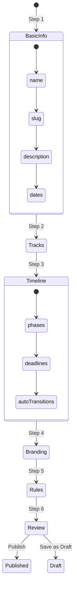

Each step auto-saves to draft. Organizers can leave and resume. The wizard validates completeness before allowing publish.

#### Phase Management Control

The organizer sees the hackathon state machine as an interactive diagram:

```mermaid
graph LR
    DRAFT["DRAFT"] -->|"Open Registration"| REG_OPEN["REGISTRATION_OPEN"]
    REG_OPEN -->|"Close Registration"| REG_CLOSED["REGISTRATION_CLOSED"]
    REG_CLOSED -->|"Start Hackathon"| ACTIVE["ACTIVE"]
    ACTIVE -->|"Begin Judging"| JUDGING["JUDGING"]
    JUDGING -->|"Publish Results"| COMPLETED["COMPLETED"]
    COMPLETED -->|"Archive"| ARCHIVED["ARCHIVED"]

    style ACTIVE fill:#10b981,stroke:#059669,color:#fff
```

- Current phase is highlighted. Only valid forward transitions are clickable
- Each transition shows a confirmation dialog with impact summary ("12 teams will be locked from further submissions")
- Auto-transitions can be scheduled (e.g., "close registration at 2026-03-15 23:59 UTC")
- Phase history timeline shows who triggered each transition and when

#### Analytics Dashboard

| Metric | Visualization | Data source |
|--------|--------------|-------------|
| Registration funnel | Funnel chart | D1 (users → teams → submissions) |
| Commit velocity | Line chart (per team, per hackathon) | Analytics Engine via D1 snapshots |
| Team activity heatmap | Calendar heatmap | Webhook events aggregated |
| Judge progress | Progress bars per judge | D1 (scores / assignments) |
| Submission timeline | Scatter plot | D1 (submission timestamps) |
| Track distribution | Pie chart | D1 (teams per track) |
| Engagement score | Sortable table per team | Computed from commits + PR count + activity |

### v3 Directory Structure

```
apps/platform/src/
├── app/
│   ├── App.tsx                     # Route definitions
│   ├── main.tsx                    # Bootstrap
│   ├── providers.tsx               # QueryClient + Auth + Theme
│   └── error-boundary.tsx
├── features/
│   ├── auth/
│   │   ├── pages/                  # login, auth-callback, invite-accept
│   │   └── components/             # OAuthButton, InviteAcceptCard
│   ├── dashboard/
│   │   ├── pages/                  # organizer-dashboard
│   │   ├── components/             # HackathonOverviewCard, StatsWidget, QuickActions, ActivityFeed
│   │   └── hooks/                  # useOrganizerHackathons, useOrgDashboardStats
│   ├── hackathon-setup/
│   │   ├── pages/                  # hackathon-creation, hackathon-settings
│   │   ├── components/             # WizardStepper, BasicInfoForm, TrackEditor, TimelineBuilder, BrandingEditor, RulesEditor
│   │   └── hooks/                  # useHackathonDraft, useWizardState
│   ├── phase-management/
│   │   ├── pages/                  # phase-management
│   │   ├── components/             # StateMachineVisualization, TransitionDialog, PhaseTimeline, AutoTransitionScheduler
│   │   └── hooks/                  # usePhaseState, usePhaseTransition
│   ├── participants/
│   │   ├── pages/                  # registration-management
│   │   ├── components/             # ParticipantTable, ApprovalActions, WaitlistManager, BulkActions, RegistrationChart
│   │   └── hooks/                  # useParticipants, useRegistrationStats
│   ├── teams/
│   │   ├── pages/                  # team-oversight
│   │   ├── components/             # TeamTable, TeamDetailPanel, ActivityScore, InterventionDialog
│   │   └── hooks/                  # useOrgTeams, useTeamActivity
│   ├── submissions/
│   │   ├── pages/                  # submission-management
│   │   ├── components/             # SubmissionTable, SubmissionDiffViewer, FlagDialog, ValidationBadge
│   │   └── hooks/                  # useOrgSubmissions, useSubmissionValidation
│   ├── judging/
│   │   ├── pages/                  # judge-management, rubric-config, scoring-overview, leaderboard-config
│   │   ├── components/             # JudgeRoster, AssignmentMatrix, RubricEditor, ScoreHeatmap, OutlierAlert, FinalizeDialog
│   │   └── hooks/                  # useJudges, useRubric, useOrgScoring, useAssignmentAlgo
│   ├── announcements/
│   │   ├── pages/                  # announcements
│   │   ├── components/             # AnnouncementEditor, SchedulePicker, TargetSelector, DeliveryStats
│   │   └── hooks/                  # useAnnouncements, useAnnouncementDelivery
│   ├── analytics/
│   │   ├── pages/                  # analytics-dashboard
│   │   ├── components/             # CommitVelocityChart, RegistrationFunnel, ActivityHeatmap, JudgeProgressBar, EngagementTable
│   │   └── hooks/                  # useAnalytics, useAnalyticsExport
│   ├── sponsors/
│   │   ├── pages/                  # sponsor-management
│   │   ├── components/             # SponsorTierEditor, AssetUploader, BrandedPagePreview, LeadCaptureConfig, ROIReport
│   │   └── hooks/                  # useSponsors, useSponsorAssets
│   ├── mentors/
│   │   ├── pages/                  # mentor-management
│   │   ├── components/             # MentorRoster, ExpertiseConfig, AvailabilityEditor, SessionLog, FeedbackSummary
│   │   └── hooks/                  # useOrgMentors, useMentorSessions
│   ├── exports/
│   │   ├── pages/                  # export-center
│   │   ├── components/             # ExportBuilder, FormatSelector, ExportHistory, ScheduledExports
│   │   └── hooks/                  # useExports, useExportStatus
│   ├── integrations/
│   │   ├── pages/                  # integration-management
│   │   ├── components/             # GitHubAppStatus, WebhookLog, IntegrationHealth, APIKeyManager
│   │   └── hooks/                  # useIntegrations, useWebhookLog
│   ├── communications/
│   │   ├── pages/                  # communication-center
│   │   ├── components/             # EmailComposer, RecipientSelector, TemplateEditor, DeliveryLog
│   │   └── hooks/                  # useBulkEmail, useEmailTemplates
│   ├── templates/
│   │   ├── pages/                  # templates
│   │   ├── components/             # TemplateCard, TemplatePreview, CloneDialog
│   │   └── hooks/                  # useTemplates
│   ├── organization/
│   │   ├── pages/                  # org-settings
│   │   ├── components/             # OrgProfile, MemberManager, DefaultBranding
│   │   └── hooks/                  # useOrganization
│   ├── notifications/
│   │   ├── pages/                  # notification-center
│   │   └── hooks/                  # useOrgNotifications
│   └── profile/
│       ├── pages/                  # profile
│       └── hooks/                  # useOrgProfile
├── shared/
│   ├── components/
│   ├── hooks/
│   └── lib/
├── layouts/
│   └── organizer-layout.tsx        # Sidebar nav (hackathon-scoped) + breadcrumbs + outlet
├── i18n/
└── styles/
    └── index.css
```

---

## App 3: `apps/admin` — Internal Administration

### Purpose

Internal tooling for the DevSage team. This app is never exposed to organizers or participants. It provides platform-wide visibility, user management, system configuration, and support tools. Access is restricted to DevSage team members via a team-member-only auth gate.

### Deployment

```
Package:  @devsage/admin
Build:    tsc --noEmit && vite build
Output:   apps/admin/dist/
Deploy:   wrangler deploy → Cloudflare Workers Static Assets
Domain:   admin.devsage.org
Env:      VITE_API_ORIGIN=https://api.devsage.org
```

### v3 Pages & Routes

#### Public Pages

| Page | Route | Description |
|------|-------|-------------|
| **Login** | `/login` | OAuth login. Rejects non-team-members with "Access denied" |

#### Authenticated Pages — Core Admin

| Page | Route | Min Role | Description |
|------|-------|----------|-------------|
| **Admin Dashboard** | `/` → `/invites` | `platform_admin` | Platform health overview — total users, active hackathons, system status, recent activity across all hackathons. Key alerts (queue backlogs, error spikes, approaching limits) |
| **Organizer Invites** | `/invites` | `platform_admin` | Generate invite codes for new organizers. Table of all invites: code, status (pending, accepted, expired, revoked), created by, accepted by, timestamps. Bulk invite via CSV upload. Revoke unused invites. Set expiration |
| **Admin Management** | `/admins` | `platform_admin` | Add/remove DevSage team members. Table of all admins with role, last active, added by. Role levels within admin team (viewer, operator, super-admin). Activity log per admin |

#### Authenticated Pages — User Management

| Page | Route | Min Role | Description |
|------|-------|----------|-------------|
| **User Directory** | `/users` | `platform_admin` | Browse/search all platform users. Table: name, email, GitHub username, registration date, last active, status. Filter by role (participant, organizer, judge), status (active, banned, suspended). Click-through to user detail |
| **User Detail** | `/users/:id` | `platform_admin` | Full user profile: linked accounts, hackathon participations, teams, submissions, scores. Admin actions: ban, suspend (with duration), remove ban, force password reset, delete account. Impersonation button (opens participant view as this user, with audit trail). Activity timeline |

#### Authenticated Pages — Platform Oversight

| Page | Route | Min Role | Description |
|------|-------|----------|-------------|
| **Hackathon Oversight** | `/hackathons` | `platform_admin` | All hackathons across the platform. Table: name, org, status, participant count, submission count, created. Filter by status, org, date range. Admin actions: force phase transition, suspend hackathon, feature/unfeature on landing page. Click-through to read-only hackathon detail |
| **Organization Management** | `/organizations` | `platform_admin` | All organizations. Table: name, domain, verified status, trust level, hackathon count, member count. Create new organization. Verify domain (trigger DNS check). Manage federation links. Set trust levels. Merge duplicate orgs |
| **Content Moderation** | `/moderation` | `platform_admin` | Queue of flagged content — reported hackathons, submissions, user profiles. Review with context. Actions: dismiss flag, warn organizer, suspend content, escalate. Moderation log with audit trail |

#### Authenticated Pages — System Management

| Page | Route | Min Role | Description |
|------|-------|----------|-------------|
| **Feature Flags** | `/feature-flags` | `platform_admin` | Toggle features globally, per-organization, or per-hackathon. Table: flag name, scope, status, last modified, modified by. Create new flags. A/B test configuration with percentage rollouts. Flag dependency graph |
| **System Configuration** | `/system` | `platform_admin` | Rate limit thresholds per endpoint. Global quotas (max hackathons per org, max teams per hackathon). Maintenance mode toggle (shows banner on all apps, blocks mutations). Environment info (Workers runtime version, D1 size, KV key count) |
| **Audit Log Viewer** | `/audit` | `platform_admin` | Search/filter audit events across all hackathons. Filter by actor type (user, system, bot, cron), action, hackathon, date range. Full event detail with before/after state diffs. Export for compliance (CSV, JSON). Hash chain integrity verification |
| **Queue Monitoring** | `/queues` | `platform_admin` | Real-time queue health: WEBHOOK_QUEUE, NOTIFICATION_QUEUE, ANALYTICS_QUEUE. Metrics: depth, processing rate, error rate, oldest message age. Dead letter queue inspection — view failed messages, retry, discard. Queue pause/resume controls |
| **System Health** | `/health` | `platform_admin` | Dashboard: API Worker response times (p50, p95, p99), D1 query latency, DO operation latency, external service status (GitHub API, SMTP, AI provider). Error rate trends. Alert configuration |

#### Authenticated Pages — Support

| Page | Route | Min Role | Description |
|------|-------|----------|-------------|
| **Support Console** | `/support` | `platform_admin` | User lookup by email, GitHub username, or user ID. Quick view of user's current state (teams, submissions, hackathons). Impersonation launcher (opens any app as the user). Data repair tools: fix orphaned team members, re-process failed webhooks, recalculate scores. Run diagnostics: check user's auth state, verify team membership, validate submission integrity |
| **Profile** | `/profile` | `platform_admin` | Admin profile settings |

### Route Nesting

```mermaid
graph TD
    subgraph Public["Public Routes"]
        P1["/login → Login"]
    end

    subgraph Protected["ProtectedRoute (platform_admin only)"]
        subgraph AdminLayout["AdminLayout (sidebar + system status bar)"]
            R1["/ → redirect /invites"]
            R2["/invites → Organizer Invites"]
            R3["/admins → Admin Management"]
            R4["/users → User Directory"]
            R5["/users/:id → User Detail"]
            R6["/hackathons → Hackathon Oversight"]
            R7["/organizations → Org Management"]
            R8["/moderation → Content Moderation"]
            R9["/feature-flags → Feature Flags"]
            R10["/system → System Config"]
            R11["/audit → Audit Log"]
            R12["/queues → Queue Monitoring"]
            R13["/health → System Health"]
            R14["/support → Support Console"]
            R15["/profile → Profile"]
        end
    end
```

### Key Features

#### Impersonation

Admin impersonation allows support team members to see exactly what a user sees, without requiring their credentials:

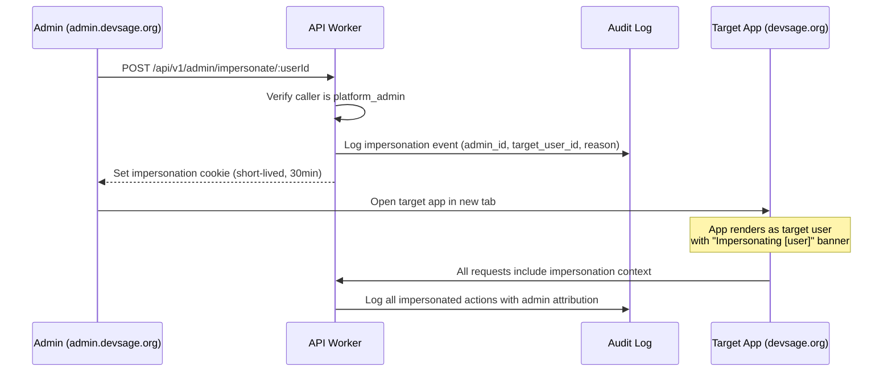

- All impersonated actions are logged in the audit trail with the admin's identity
- Impersonation sessions are time-limited (30 minutes)
- A visible banner prevents accidental actions while impersonating
- Write operations can be optionally blocked (read-only impersonation mode)

#### Queue Monitoring

| Queue | Key Metrics | Alert Thresholds |
|-------|------------|-----------------|
| `WEBHOOK_QUEUE` | Depth, msg/s processed, error rate, p95 latency | Depth > 1000, error rate > 5%, p95 > 30s |
| `NOTIFICATION_QUEUE` | Depth, delivery rate, bounce rate | Depth > 500, bounce rate > 10% |
| `ANALYTICS_QUEUE` | Depth, write rate, Analytics Engine errors | Depth > 5000, AE error rate > 1% |

### v3 Directory Structure

```
apps/admin/src/
├── app/
│   ├── App.tsx
│   ├── main.tsx
│   ├── providers.tsx
│   └── error-boundary.tsx
├── features/
│   ├── auth/
│   │   └── pages/                  # login
│   ├── invites/
│   │   ├── pages/                  # invites
│   │   ├── components/             # InviteTable, GenerateDialog, BulkUpload, InviteStatusBadge
│   │   └── hooks/                  # useInvites, useGenerateInvite
│   ├── admins/
│   │   ├── pages/                  # admin-management
│   │   ├── components/             # AdminTable, AddAdminDialog, RoleSelector, ActivityLog
│   │   └── hooks/                  # useAdmins, useAdminActivity
│   ├── users/
│   │   ├── pages/                  # user-directory, user-detail
│   │   ├── components/             # UserTable, UserProfile, BanDialog, ImpersonateButton, ActivityTimeline
│   │   └── hooks/                  # useUsers, useUserDetail, useImpersonate
│   ├── hackathons/
│   │   ├── pages/                  # hackathon-oversight
│   │   ├── components/             # HackathonTable, ForceTransitionDialog, SuspendDialog, FeatureToggle
│   │   └── hooks/                  # useAllHackathons, useHackathonAdmin
│   ├── organizations/
│   │   ├── pages/                  # org-management
│   │   ├── components/             # OrgTable, VerifyDomainDialog, FederationLinks, TrustLevelSelector
│   │   └── hooks/                  # useOrganizations, useFederation
│   ├── moderation/
│   │   ├── pages/                  # content-moderation
│   │   ├── components/             # ModerationQueue, FlagDetail, ActionDialog, ModerationLog
│   │   └── hooks/                  # useFlaggedContent, useModeration
│   ├── feature-flags/
│   │   ├── pages/                  # feature-flags
│   │   ├── components/             # FlagTable, FlagEditor, ScopeSelector, RolloutConfig
│   │   └── hooks/                  # useFeatureFlags
│   ├── system/
│   │   ├── pages/                  # system-config, system-health
│   │   ├── components/             # RateLimitEditor, QuotaManager, MaintenanceBanner, EnvInfo, LatencyChart, ErrorTrend
│   │   └── hooks/                  # useSystemConfig, useSystemHealth
│   ├── audit/
│   │   ├── pages/                  # audit-log
│   │   ├── components/             # AuditTable, EventDetail, StateDiff, HashChainVerifier, ExportDialog
│   │   └── hooks/                  # useAuditLog, useAuditSearch
│   ├── queues/
│   │   ├── pages/                  # queue-monitoring
│   │   ├── components/             # QueueHealthCard, MessageInspector, DLQViewer, RetryDialog, QueueChart
│   │   └── hooks/                  # useQueueHealth, useDeadLetterQueue
│   ├── support/
│   │   ├── pages/                  # support-console
│   │   ├── components/             # UserLookup, DiagnosticRunner, DataRepairTool, ImpersonationLauncher
│   │   └── hooks/                  # useSupport, useDiagnostics
│   └── profile/
│       └── pages/                  # profile
├── shared/
│   ├── components/
│   ├── hooks/
│   └── lib/
├── layouts/
│   └── admin-layout.tsx            # Sidebar nav + system status bar + outlet
└── styles/
    └── index.css
```

---

## Shared Architecture

### packages/ui — Component Library

All three apps consume a shared component library extracted into `packages/ui`. This ensures visual consistency across the platform.

```
packages/ui/
├── src/
│   ├── primitives/                 # Base components from shadcn/ui
│   │   ├── button.tsx
│   │   ├── card.tsx
│   │   ├── dialog.tsx
│   │   ├── dropdown-menu.tsx
│   │   ├── input.tsx
│   │   ├── tabs.tsx
│   │   ├── badge.tsx
│   │   ├── skeleton.tsx
│   │   ├── select.tsx
│   │   ├── checkbox.tsx
│   │   ├── textarea.tsx
│   │   ├── tooltip.tsx
│   │   ├── progress.tsx
│   │   ├── switch.tsx
│   │   └── separator.tsx
│   ├── composites/                 # Multi-primitive components
│   │   ├── data-table.tsx          # Sortable, filterable, paginated table
│   │   ├── form-field.tsx          # Label + input + error message
│   │   ├── stat-card.tsx           # Metric card with label, value, trend
│   │   ├── empty-state.tsx         # Illustrated empty state with CTA
│   │   ├── confirm-dialog.tsx      # Confirmation dialog with danger variant
│   │   ├── search-input.tsx        # Debounced search with clear button
│   │   ├── status-badge.tsx        # Color-coded status indicator
│   │   ├── avatar.tsx              # User avatar with fallback initials
│   │   ├── date-picker.tsx         # Calendar date picker
│   │   ├── file-upload.tsx         # Drag-and-drop file upload zone
│   │   └── markdown-editor.tsx     # Markdown editor with preview
│   ├── layouts/                    # Layout primitives
│   │   ├── page-shell.tsx          # Standard page container with title + actions
│   │   ├── sidebar.tsx             # Collapsible sidebar navigation
│   │   └── breadcrumbs.tsx         # Breadcrumb navigation
│   └── index.ts                    # Barrel export
├── package.json                    # @devsage/ui
└── tsconfig.json
```

| Layer | Contents | Example |
|-------|----------|---------|
| Primitives | shadcn/ui Radix-based components | `<Button variant="destructive">`, `<Dialog>`, `<Tabs>` |
| Composites | Multi-primitive compositions | `<DataTable columns={[...]} data={[...]} />`, `<StatCard label="Teams" value={42} trend="+12%">` |
| Layouts | Structural components | `<PageShell title="Dashboard" actions={<Button>Create</Button>}>` |

### packages/shared — Schemas & Types

Shared Zod schemas and TypeScript types consumed by all three frontend apps and the API:

| Export | Used by | Purpose |
|--------|---------|---------|
| Hackathon schemas | web, platform | Validation, type inference |
| Team/member schemas | web, platform | Validation, type inference |
| Submission schemas | web, platform | Validation, type inference |
| User schemas | web, platform, admin | Validation, type inference |
| API error schemas | web, platform, admin | Error handling, type inference |
| Constants (roles, phases, etc.) | web, platform, admin | Shared business logic constants |

### packages/realtime — WebSocket Client SDK

Shared WebSocket client with reconnection logic, consumed by `apps/web` and `apps/platform`:

```
packages/realtime/
├── src/
│   ├── client.ts                   # WebSocket client with auto-reconnect
│   ├── types.ts                    # Protocol message types (subscribe, event, presence)
│   ├── channels.ts                 # Channel subscription manager
│   ├── reconnect.ts                # Exponential backoff with jitter (1s → 30s max)
│   └── index.ts                    # Barrel export
├── package.json                    # @devsage/realtime
└── tsconfig.json
```

`apps/admin` does not use WebSocket — it polls for queue metrics and system health via REST.

### Authentication Pattern

All three apps use the same cookie-based JWT auth pattern, but with different audience expectations:

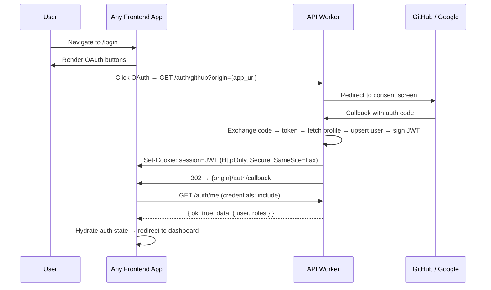

**Per-app auth gates:**

| App | Auth gate logic |
|-----|----------------|
| `apps/web` | Any authenticated user can access. Role checks per-route (participant, judge) |
| `apps/platform` | Must have at least one organizer role (`moderator`+) for any hackathon. No organizer role → "Request access" page |
| `apps/admin` | Must be a DevSage team member (`platform_admin`). Non-team-members → "Access denied" |

Each app has its own `AuthProvider` and `ProtectedRoute` implementation with audience-appropriate logic. The underlying `apiRequest()` and cookie mechanism are identical.

### API Client Pattern

Each app has its own `lib/api.ts` with the same `apiRequest<T>()` function:

```typescript
async function apiRequest<T>(endpoint: string, options?: RequestInit): Promise<T>
```

| Behavior | Implementation |
|----------|---------------|
| Base URL | `VITE_API_ORIGIN` in production, relative path (Vite proxy) in dev |
| Credentials | `credentials: 'include'` on every request (sends HttpOnly cookie) |
| Content-Type | `application/json` by default |
| 401 handling | Auto-redirect to `/login` (except `/auth/me`) |
| Error handling | Throws structured error with status + API error code |

### Dev Proxy Configuration

Each app proxies API routes to the local Worker during development:

| App | Port | Proxied paths | Target |
|-----|------|---------------|--------|
| `apps/web` | 5173 | `/api/v1`, `/auth`, `/hackathons`, `/webhooks` | `http://localhost:8787` |
| `apps/platform` | 5174 | `/api/v1`, `/auth` | `http://localhost:8787` |
| `apps/admin` | 5175 | `/api/v1`, `/auth` | `http://localhost:8787` |

---

## Cross-Cutting v3 Concerns

### Real-Time Updates

`apps/web` and `apps/platform` connect to the WebSocket Gateway Durable Object for live hackathon updates. Each app subscribes to different channels based on audience.

| Channel | `apps/web` (participants) | `apps/platform` (organizers) | Purpose |
|---------|--------------------------|------------------------------|---------|
| `announcements` | ✓ subscribe | ✓ publish + subscribe | Phase changes, organizer messages |
| `submissions` | ✓ (own team only) | ✓ (all teams) | New submissions, version updates |
| `activity` | ✓ subscribe | ✓ subscribe | Commits, PRs, general activity |
| `judging` | ✗ | ✓ subscribe | Score submissions, judge progress |
| `leaderboard` | ✓ subscribe (if public) | ✓ subscribe | Rank changes, score updates |
| `mentorship` | ✓ subscribe | ✓ subscribe | Session requests, availability |
| `presence` | ✓ subscribe | ✓ subscribe | User join/leave, typing |
| `registrations` | ✗ | ✓ subscribe | New registrations, approvals |

`apps/admin` does **not** use WebSocket. System health and queue metrics are polled via REST on configurable intervals (default 30s).

### State Management

All three apps use TanStack Query for server state. React Context is reserved for client-only concerns.

| State category | Solution | Scope |
|---------------|----------|-------|
| Auth state | React Context (`AuthProvider`) per app | Global — user, roles, isAuthenticated |
| Theme/preferences | React Context (`ThemeProvider`) | Global — dark mode, per-hackathon theme |
| Server data | TanStack Query | Per-query — caching, deduplication, background refetch |
| Form state | `useState` | Component-scoped — ephemeral |
| URL state | React Router params/search | Per-route |
| Real-time events | WebSocket → TanStack Query invalidation | Push-triggered cache refresh |

#### TanStack Query Configuration

```typescript
const queryClient = new QueryClient({
  defaultOptions: {
    queries: {
      staleTime: 30_000,          // 30s before background refetch
      gcTime: 5 * 60_000,         // 5min garbage collection
      retry: 2,                    // Retry failed requests twice
      refetchOnWindowFocus: true,  // Refetch on tab focus
      refetchOnReconnect: true,    // Refetch on network reconnect
    },
    mutations: {
      retry: 0,                    // No automatic retry on mutations
    },
  },
});
```

#### Query Key Convention

Consistent across all three apps:

```typescript
['hackathons']                                    // All hackathons
['hackathons', slug]                              // Single hackathon
['hackathons', slug, 'teams']                     // Teams for a hackathon
['hackathons', slug, 'submissions']               // Submissions
['hackathons', slug, 'leaderboard']               // Leaderboard
['hackathons', slug, 'judges']                    // Judges
['hackathons', slug, 'analytics']                 // Analytics snapshots
['hackathons', slug, 'sponsors']                  // Sponsors
['hackathons', slug, 'mentors']                   // Mentors
['user', 'me']                                    // Current user
['notifications']                                 // User notifications
['admin', 'users']                                // All users (admin only)
['admin', 'invites']                              // Invites (admin only)
['admin', 'queues']                               // Queue health (admin only)
```

### Optimistic UI

Mutations in `apps/web` and `apps/platform` update UI immediately before server confirmation:

| App | Action | Optimistic behavior | Rollback |
|-----|--------|-------------------|----------|
| web | Join team | Add user to member list | Remove user, error toast |
| web | Submit score (judge) | Update score in cache | Revert score, error toast |
| web | Create team | Show team with pending state | Remove team, error toast |
| web | Update profile | Show new values | Revert values, error toast |
| platform | Advance phase | Update phase indicator | Revert phase, error toast |
| platform | Approve registration | Move to approved list | Revert to pending, error toast |
| platform | Publish announcement | Add to announcement list | Remove, error toast |

`apps/admin` does **not** use optimistic updates — admin actions (bans, phase overrides, system config) require confirmed server responses before UI update.

### Code Splitting & Lazy Loading

All pages in all three apps are lazy-loaded via `React.lazy()` + Suspense:

| Component type | Strategy | Loading state |
|---------------|----------|---------------|
| Page components | `React.lazy()` + dynamic import | Route-level skeleton |
| Heavy components (charts, editors) | `React.lazy()` | Inline spinner |
| `packages/ui` primitives | Eager import | N/A (small, shared) |

#### Suspense Boundary Hierarchy

```
App-level Suspense (minimal fallback)
  └── Route-level Suspense (page skeleton)
       └── Feature-level Suspense (section skeleton)
            └── Component-level Suspense (inline spinner)
```

### Offline Capability

Applicable to `apps/web` only. Organizer and admin apps require live connectivity.

| Layer | Technology | Cached content | Strategy |
|-------|-----------|----------------|----------|
| Static assets | Service Worker (Workbox) | JS, CSS, fonts, images | Cache-first, background update |
| API responses | Service Worker | GET hackathon data, team data | Network-first, cache fallback |
| Draft data | IndexedDB | Unsaved forms, draft judge scores | Write-through, sync on reconnect |
| Auth state | Memory only | JWT cookie | Not cached (re-auth required) |

### Accessibility (a11y)

WCAG 2.1 AA compliance across all three apps:

| Category | Implementation |
|----------|---------------|
| Keyboard navigation | Radix primitives handle focus management. Custom components use `tabIndex` + `onKeyDown` |
| Focus management | `useRouteFocus()` hook — moves focus to main heading on route change |
| Screen readers | `aria-label`, `aria-describedby`, `aria-live` regions for dynamic content |
| Color contrast | 4.5:1 minimum for normal text. `#CCFF00` on dark backgrounds passes AA |
| Motion sensitivity | `prefers-reduced-motion` via Framer Motion `useReducedMotion()` |
| Forms | `<label>` elements, `aria-invalid`, `aria-errormessage` on all inputs |
| Live regions | `aria-live="polite"` for toasts, `aria-live="assertive"` for errors |
| Skip navigation | Hidden skip link visible on focus, targets `<main>` |

### Internationalization (i18n)

Multi-language support via `react-intl` (FormatJS) in `apps/web` and `apps/platform`:

| Aspect | Decision |
|--------|----------|
| Library | `react-intl` (ICU MessageFormat) |
| Default locale | `en-US` |
| Planned languages | English, Spanish, Hindi |
| Message extraction | `@formatjs/cli extract` |
| Message storage | `src/i18n/{locale}.json` per app |
| Loading strategy | Lazy-load locale bundles (only active locale) |

`apps/admin` is English-only (internal tool).

### Theme System

#### Dark Mode

All three apps support dark mode:

| Property | Implementation |
|----------|---------------|
| Toggle | `ThemeProvider` React Context + `localStorage` persistence |
| CSS | `.dark` class on `<html>` element |
| System preference | `prefers-color-scheme` media query as default |
| Transition | `transition-colors duration-200` on `<body>` |

#### Per-Hackathon Themes (apps/web + apps/platform)

Hackathons can define a `primary_color` that overrides the `#CCFF00` accent:

```typescript
function useHackathonTheme(hackathon: Hackathon) {
  useEffect(() => {
    if (hackathon.primary_color) {
      document.documentElement.style.setProperty('--hackathon-accent', hackathon.primary_color);
    }
    return () => {
      document.documentElement.style.removeProperty('--hackathon-accent');
    };
  }, [hackathon.primary_color]);
}
```

### Error Boundaries

Each app has a three-level error boundary hierarchy:

| Level | Fallback | Recovery |
|-------|----------|----------|
| **App** | Full-screen error page with branding | "Reload page" button |
| **Route** | Error card within layout (nav still visible) | "Try again" + nav links |
| **Feature** | Inline error replacing failed section | "Retry" button |

---

## Performance Budget

### Per-App Budgets

| Metric | `apps/web` | `apps/platform` | `apps/admin` |
|--------|-----------|-----------------|-------------|
| Lighthouse Performance | 90+ | 85+ | 80+ |
| JS bundle (gzipped) | < 200 KB | < 250 KB | < 200 KB |
| CSS bundle (gzipped) | < 30 KB | < 30 KB | < 25 KB |
| LCP | < 3.0s | < 3.5s | < 4.0s |
| FID | < 100ms | < 100ms | < 150ms |
| CLS | < 0.1 | < 0.1 | < 0.15 |
| TTI | < 4.0s | < 5.0s | < 5.0s |
| TBT | < 200ms | < 250ms | < 300ms |

`apps/web` has the strictest budget (public-facing, SEO-relevant). `apps/admin` is more relaxed (internal, data-heavy tables).

### Bundle Splitting Strategy

Each app uses manual chunks to optimize cache hit rates:

```typescript
// Shared across all three apps in vite.config.ts
build: {
  rollupOptions: {
    output: {
      manualChunks: {
        'vendor-react': ['react', 'react-dom', 'react-router-dom'],
        'vendor-ui': ['@radix-ui/react-dialog', '@radix-ui/react-dropdown-menu', '@radix-ui/react-tabs'],
        'vendor-motion': ['framer-motion'],
        'vendor-query': ['@tanstack/react-query'],
      },
    },
  },
  chunkSizeWarningLimit: 150,
}
```

---

## Testing Strategy

### Per-App Testing

| Tier | Tool | Scope |
|------|------|-------|
| Unit | Vitest + jsdom | Hooks, utilities, pure functions |
| Component | Vitest + Testing Library | Component rendering, interactions |
| E2E | Playwright | Full user journeys across apps |

#### Test File Convention

```
apps/{app}/src/features/{feature}/tests/    # Feature-colocated tests
apps/{app}/e2e/                             # Playwright E2E tests
```

### E2E Test Scenarios (Playwright)

E2E tests span across apps where user journeys cross boundaries:

| Scenario | Apps involved | Steps |
|----------|--------------|-------|
| **Participant auth flow** | web | Login via OAuth mock → dashboard loads → logout → redirect |
| **Hackathon lifecycle** | platform → web | Organizer creates hackathon → participant registers → forms team → submits → judge scores → leaderboard |
| **Organizer invite flow** | admin → platform | Admin generates invite → organizer accepts → organizer dashboard loads |
| **Judge scoring** | web | Judge logs in → views assignments → scores submission → submits feedback → leaderboard updates |
| **Role-based access** | web, platform, admin | Participant cannot access platform. Organizer cannot access admin. Judge cannot access organizer views |
| **Admin impersonation** | admin → web | Admin impersonates user → sees user's dashboard → banner visible → actions logged |
| **Real-time updates** | web × 2 | Two participants: one submits, other sees live update on activity feed |
| **Responsive design** | web | Critical flows at 375px, 768px, 1440px viewports |

---

## Deployment Topology

### Production

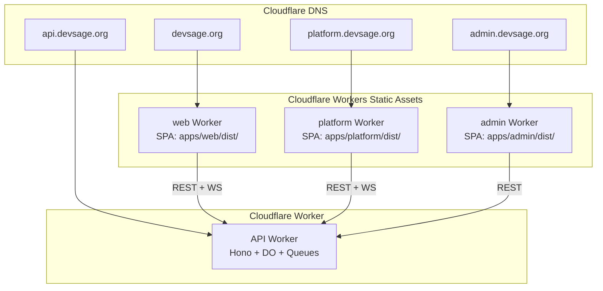

### Deploy Commands

```bash
# Deploy all frontend apps
pnpm deploy:web          # apps/web → devsage.org
pnpm deploy:platform     # apps/platform → platform.devsage.org
pnpm deploy:admin        # apps/admin → admin.devsage.org
pnpm deploy:api          # apps/api → api.devsage.org

# Dev environment
pnpm deploy:web:dev      # apps/web → web-dev.workers.dev
pnpm deploy:platform:dev # apps/platform → platform-dev.workers.dev
pnpm deploy:admin:dev    # apps/admin → admin-dev.workers.dev
```

### Environment Variables

| App | Variable | Production value |
|-----|----------|-----------------|
| `apps/web` | `VITE_API_ORIGIN` | `https://api.devsage.org` |
| `apps/platform` | `VITE_API_ORIGIN` | `https://api.devsage.org` |
| `apps/admin` | `VITE_API_ORIGIN` | `https://api.devsage.org` |

All three apps have `.env.production` committed (contains only `VITE_*` client-visible variables — no secrets).

### Preview Deployments

Each app gets independent preview deployments on PR:

```yaml
# .github/workflows/preview.yml
on:
  pull_request:
    paths:
      - 'apps/web/**'
      - 'apps/platform/**'
      - 'apps/admin/**'
      - 'packages/ui/**'
      - 'packages/shared/**'
      - 'packages/realtime/**'

jobs:
  preview-web:
    if: contains(github.event.pull_request.changed_files, 'apps/web/')
    # ... build + wrangler deploy --env dev

  preview-platform:
    if: contains(github.event.pull_request.changed_files, 'apps/platform/')
    # ... build + wrangler deploy --env dev

  preview-admin:
    if: contains(github.event.pull_request.changed_files, 'apps/admin/')
    # ... build + wrangler deploy --env dev
```

Changes to `packages/ui` or `packages/shared` trigger preview deploys for all three apps.

---

## Dependency Graph

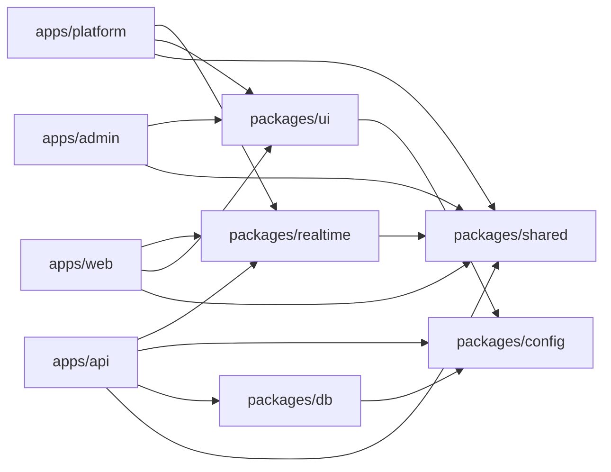

**Key constraints:**
- `apps/admin` does **not** depend on `packages/realtime` (no WebSocket)
- No frontend app depends on `packages/db` (database is API-only)
- `packages/ui` depends on `packages/config` for shared tsconfig + ESLint
- All three frontend apps depend on `packages/shared` for Zod schemas and types

---

## File References

### Configuration Files (per app)

| File | Purpose | apps/web | apps/platform | apps/admin |
|------|---------|----------|---------------|------------|
| `package.json` | Dependencies + scripts | ✓ | ✓ | ✓ |
| `vite.config.ts` | Vite + React + Tailwind + dev proxy | ✓ | ✓ | ✓ |
| `vitest.config.ts` | Vitest + jsdom + path aliases | ✓ | ✓ | ✓ |
| `tsconfig.json` | TypeScript (extends `config/tsconfig.react.json`) | ✓ | ✓ | ✓ |
| `wrangler.jsonc` | Cloudflare Workers Static Assets config | ✓ | ✓ | ✓ |
| `.env.production` | `VITE_API_ORIGIN` (client-visible only) | ✓ | ✓ | ✓ |
| `index.html` | SPA entry point (`#root`) | ✓ | ✓ | ✓ |

### Shared Package Files

| File | Purpose |
|------|---------|
| `packages/ui/src/index.ts` | Barrel export for all UI components |
| `packages/shared/src/index.ts` | Barrel export for schemas + types |
| `packages/realtime/src/index.ts` | Barrel export for WebSocket client SDK |
| `packages/config/tsconfig.react.json` | Shared TypeScript config for all React apps |
| `packages/config/eslint.config.mjs` | Shared ESLint flat config |
