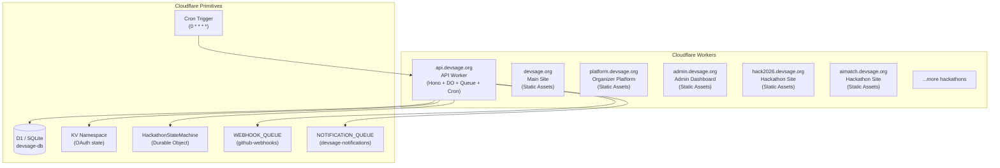
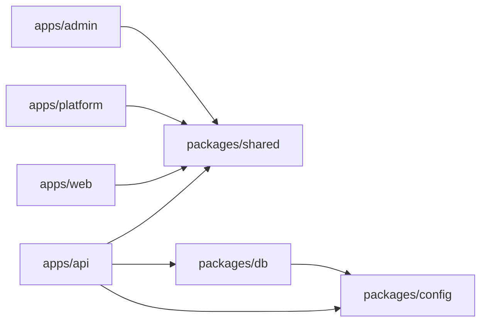

# 13 — Infrastructure & Deployment

> Everything runs on Cloudflare. The API is a single Worker with D1, KV, Durable Objects, and Queues. Frontend apps are Workers serving static assets. Each hackathon gets its own Worker deployment at `{slug}.devsage.org`. The monorepo is managed by Turborepo with pnpm workspaces.

**Related docs:** [System Overview](./00-overview.md) | [Webhooks & GitHub](./11-webhooks.md) | [Notifications](./12-notifications.md) | [CLI](./06-cli.md)

---

## Deployment Model



### Five Deployment Targets

| Surface | URL | Source | Deployment | Type |
|---------|-----|--------|------------|------|
| **API** | `api.devsage.org` | `apps/api/` | `pnpm deploy:api` | Worker (Hono app + DO + Queue + Cron) |
| **Main Site** | `devsage.org` | `apps/web/` | `pnpm deploy:web` | Worker (Static Assets) |
| **Organizer Platform** | `platform.devsage.org` | `apps/platform/` | `pnpm deploy:platform` | Worker (Static Assets) |
| **Admin Dashboard** | `admin.devsage.org` | `apps/admin/` | `pnpm deploy:admin` | Worker (Static Assets) |
| **Hackathon Sites** | `{slug}.devsage.org` | `templates/hackathon-site/` | CLI (`generate-hackathon-site.js`) | Worker (Static Assets) |

All frontend apps (web, platform, admin, hackathon sites) are deployed as Cloudflare Workers serving static assets -- not Cloudflare Pages. Each uses `not_found_handling: "single-page-application"` for SPA routing.

---

## Worker Bindings

The API Worker (`apps/api/wrangler.jsonc`) has the following bindings:

### D1 Database

| Binding | Database Name | Database ID |
|---------|--------------|-------------|
| `DB` | `devsage-db` | `dddf6034-11ca-4d49-a838-cd45fbc6bd86` |

Migrations directory: `../../packages/db/migrations` (relative from `apps/api/`).

### KV Namespace

| Binding | Purpose |
|---------|---------|
| `KV` | OAuth state storage (10-minute TTL) |

### Durable Objects

| Binding | Class Name | Storage |
|---------|-----------|---------|
| `HACKATHON_SM` | `HackathonStateMachine` | SQLite-backed (`new_sqlite_classes`) |

One instance per hackathon, addressed by hackathon ID. Manages phase transitions, submission locking, and deadline enforcement via alarms.

**Migration history:**
- `v1`: Created `HackathonLifecycleDO` and `SubmissionDO` (SQLite-backed)
- `v2`: Deleted both, replaced with unified `HackathonStateMachine` (SQLite-backed)

### Queues

| Binding | Queue Name | Max Batch | Max Retries | Purpose |
|---------|-----------|-----------|-------------|---------|
| `WEBHOOK_QUEUE` | `github-webhooks` | 10 | 3 | GitHub webhook event processing |
| `NOTIFICATION_QUEUE` | `devsage-notifications` | 10 | 3 | Email notification delivery |

The same Worker acts as both producer and consumer for both queues.

### Cron Trigger

| Schedule | Purpose |
|----------|---------|
| `0 * * * *` (hourly) | Check submission deadlines, send reminders, auto-transition phases |

---

## Environment Variables & Secrets

### Env Interface

```typescript
// apps/api/src/types/env.ts
export interface Env {
  // Bindings
  DB: D1Database;
  KV: KVNamespace;
  HACKATHON_SM: DurableObjectNamespace;
  WEBHOOK_QUEUE: Queue;
  NOTIFICATION_QUEUE: Queue;

  // Secrets
  JWT_SECRET: string;
  GOOGLE_CLIENT_ID: string;
  GOOGLE_CLIENT_SECRET: string;
  GITHUB_CLIENT_ID: string;
  GITHUB_CLIENT_SECRET: string;
  GITHUB_WEBHOOK_SECRET: string;
  FRONTEND_URL: string;
  PLATFORM_URL: string;
  ADMIN_URL: string;
  SMTP_URL: string;
  SMTP_USERNAME: string;
  SMTP_PASSWORD: string;
  SMTP_EMAIL_ADDR: string;
}
```

### Secrets Management

| Environment | Method | Location |
|-------------|--------|----------|
| **Local dev** | `.dev.vars` file | `apps/api/.dev.vars` (gitignored) |
| **Production** | Wrangler secrets | `wrangler secret put KEY` or `wrangler secret bulk .env.production` |
| **Dev deploy** | Wrangler vars | `wrangler.jsonc` `env.dev.vars` section |

```bash
# Set a single production secret
wrangler secret put JWT_SECRET

# Bulk upload from file
wrangler secret bulk .env.production

# Deploy secrets via script
pnpm deploy:api:secrets
```

### URL Configuration

| Environment | FRONTEND_URL | PLATFORM_URL | ADMIN_URL |
|-------------|-------------|--------------|-----------|
| Local dev | `http://localhost:5173` | `http://localhost:5174` | `http://localhost:5175` |
| Production | `https://devsage.org` | `https://platform.devsage.org` | `https://admin.devsage.org` |

---

## Custom Domains

All surfaces live under `*.devsage.org`:

```
devsage.org              → apps/web (Main Site)
api.devsage.org          → apps/api (API Worker)
platform.devsage.org     → apps/platform (Organizer Platform)
admin.devsage.org        → apps/admin (Admin Dashboard)
{slug}.devsage.org       → per-hackathon Worker (Hackathon Site)
```

Hackathon site custom domains are configured during CLI-based hackathon creation. The CLI sets up the Worker deployment and custom domain in a single command.

---

## D1 Migrations

Migrations are generated by Drizzle Kit and stored in `packages/db/migrations/`. The API Worker's `wrangler.jsonc` points to this directory via a relative path.

### Migration Workflow

```bash
# 1. Modify schema in packages/db/src/schema/
# 2. Generate migration SQL
pnpm --filter @devsage/db generate

# 3. Apply to local dev database
wrangler d1 migrations apply devsage-db --local

# 4. Apply to production
wrangler d1 migrations apply devsage-db --remote
```

### Dev Environment Database

The dev environment uses a separate D1 database (`devsage-db-dev`) with a placeholder ID, configured in the `env.dev` section of `wrangler.jsonc`.

---

## Monorepo Tooling

### pnpm Workspaces

```yaml
# pnpm-workspace.yaml
packages:
  - apps/*
  - packages/*
```

The `templates/` directory is intentionally excluded -- hackathon site templates are standalone projects, not workspace packages.

### Turborepo

Turborepo orchestrates build, dev, test, lint, and typecheck tasks across all workspace packages:

```jsonc
// turbo.json
{
  "tasks": {
    "build":     { "dependsOn": ["^build"], "outputs": ["dist/**"] },
    "dev":       { "dependsOn": ["^build"], "cache": false, "persistent": true },
    "test":      { "dependsOn": ["^build"] },
    "lint":      { "dependsOn": [] },
    "typecheck": { "dependsOn": ["^build"] }
  }
}
```

Key behaviors:
- **build** depends on upstream builds (`^build`) -- packages build before apps
- **dev** is persistent (long-running) and never cached
- **lint** has no dependencies -- runs immediately in parallel
- **typecheck** depends on upstream builds (needs compiled `.d.ts` files)

### Package Dependency Graph



---

## Deploy Scripts

All deploy commands are defined in the root `package.json`:

| Command | Target | Action |
|---------|--------|--------|
| `pnpm deploy:api` | Production API | `pnpm --filter @devsage/api run deploy` |
| `pnpm deploy:api:dev` | Dev API | `pnpm --filter @devsage/api run deploy:dev` |
| `pnpm deploy:api:secrets` | Production secrets | `pnpm --filter @devsage/api run deploy:secrets` |
| `pnpm deploy:web` | Production main site | `pnpm --filter @devsage/web run deploy` |
| `pnpm deploy:web:dev` | Dev main site | `pnpm --filter @devsage/web run deploy:dev` |
| `pnpm deploy:platform` | Production platform | `pnpm --filter @devsage/platform run deploy` |
| `pnpm deploy:platform:dev` | Dev platform | `pnpm --filter @devsage/platform run deploy:dev` |
| `pnpm deploy:admin` | Production admin | `pnpm --filter @devsage/admin run deploy` |
| `pnpm deploy:admin:dev` | Dev admin | `pnpm --filter @devsage/admin run deploy:dev` |

### Hackathon Site Deployment

Hackathon sites are deployed via the CLI, not through the standard deploy scripts:

```bash
# Create and deploy a new hackathon site
node scripts/generate-hackathon-site.js --slug hack2026 --name "Hack 2026"
```

The CLI copies the template, writes `site.config.json`, generates `wrangler.jsonc` from the template, builds the site, and deploys it as a new Worker with a custom domain.

---

## Development Commands

| Command | Description |
|---------|-------------|
| `pnpm dev` | Start all apps in parallel (Turborepo) |
| `pnpm build` | Build all packages and apps |
| `pnpm test` | Run all test suites |
| `pnpm lint` | Lint all packages |
| `pnpm typecheck` | Type-check all packages |
| `pnpm secrets:scan` | Full repo secret scan (secretlint) |
| `pnpm secrets:staged` | Scan staged files only (pre-commit) |

### Local Development Ports

| App | Port | URL |
|-----|------|-----|
| API (wrangler dev) | 8787 | `http://localhost:8787` |
| Web (Vite) | 5173 | `http://localhost:5173` |
| Platform (Vite) | 5174 | `http://localhost:5174` |
| Admin (Vite) | 5175 | `http://localhost:5175` |

Frontend apps proxy API requests to `localhost:8787` via Vite dev server configuration.

---

## Observability

```jsonc
// wrangler.jsonc
{
  "observability": { "enabled": true }
}
```

Cloudflare Workers observability is enabled, providing request logs, error tracking, and performance metrics through the Cloudflare dashboard.

---

## Security Infrastructure

### Pre-commit Hook

`secretlint` scans staged files for leaked secrets. Blocks commits containing API keys, tokens, or credentials.

```bash
pnpm secrets:staged  # Runs via lint-staged
```

### Pre-push Hook

Full repository secret scan. Blocks pushes if any secrets are detected anywhere in the codebase.

```bash
pnpm secrets:scan
```

### Gitignored Files

- `apps/api/.dev.vars` -- Local development secrets
- `.env*` files (except `apps/web/.env.production` which contains only `VITE_*` public vars)
- `node_modules/`, `dist/`

---

## Compatibility

| Setting | Value |
|---------|-------|
| Compatibility date | `2025-12-01` |
| Compatibility flags | `nodejs_compat` |
| Node.js requirement | `>= 20.0.0` |
| pnpm requirement | `>= 8.0.0` |
| TypeScript | `^5.9.3` |

---

## Failure Modes

| Component | Failure | Behavior |
|-----------|---------|----------|
| D1 Database | Unavailable | API returns 500 errors. No fallback |
| KV Namespace | Unavailable | OAuth login fails. Existing sessions unaffected |
| Durable Object | Unavailable | Submission locking fails. Queue retries (3x) |
| WEBHOOK_QUEUE | Unavailable | Webhook endpoint returns 500. GitHub retries |
| NOTIFICATION_QUEUE | Unavailable | Notifications delayed. Triggering operation succeeds |
| GitHub API | Down/timeout | Commit status not posted. Fail-open (10s timeout) |
| SMTP API | Down/timeout | Email not sent. Fail-open (10s timeout). Logged to audit |
| Cron trigger | Missed | Deadline reminders delayed by up to 1 hour |

---

## File References

| File | Purpose |
|------|---------|
| `apps/api/wrangler.jsonc` | API Worker configuration: bindings, queues, cron, DO migrations |
| `apps/api/src/types/env.ts` | `Env` interface: all Worker bindings and secrets |
| `apps/api/src/index.ts` | Worker entry point: Hono app, DO re-exports, queue/cron handlers |
| `packages/db/migrations/` | D1 migration SQL files |
| `turbo.json` | Turborepo task configuration |
| `package.json` | Root scripts: deploy, dev, build, test, lint, typecheck |
| `pnpm-workspace.yaml` | Workspace package globs |
| `scripts/generate-hackathon-site.js` | CLI for hackathon site creation and deployment |
| `templates/hackathon-site/wrangler.template.jsonc` | Wrangler template for per-hackathon Workers |
