# 14 — Real-time System

> The real-time system pushes every user-facing state change to connected clients within 200ms via a WebSocket Gateway Durable Object. Each hackathon gets its own gateway instance, providing natural tenant isolation. An SSE fallback serves environments that block WebSocket connections. The client SDK in `packages/realtime` handles reconnection with exponential backoff and jitter.

**Related docs:** [System Overview](./00-overview.md) | [Hackathon Lifecycle](./02-hackathon-lifecycle.md) | [Notifications](./08-notifications.md) | [Infrastructure](./12-infrastructure.md) | [Frontend Architecture](./13-frontend.md)

---

## Architecture Overview

The real-time system introduces a single new Durable Object class — `WebSocketGateway` — that sits between the API Worker and connected browser clients. State changes originate from the `HackathonStateMachine` DO, API route handlers, or queue consumers. These sources push events to the gateway, which broadcasts them to subscribed clients over persistent WebSocket connections.

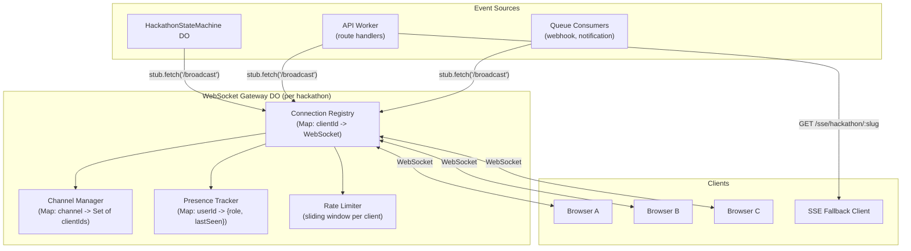

**Design principles:**

| Principle | Implementation |
|-----------|----------------|
| Per-hackathon isolation | One `WebSocketGateway` DO instance per hackathon, keyed by hackathon ID |
| Ephemeral state | Connection registry and presence live in DO memory only — no persistence needed |
| Hibernation-friendly | Uses the WebSocket Hibernation API so idle connections do not consume CPU |
| Additive deployment | REST API is unchanged; WebSocket is a new transport layer alongside it |
| Graceful degradation | If the gateway DO is unavailable, clients fall back to polling; core submission/judging paths are unaffected |

---

## WebSocket Gateway Durable Object

### Class Design

The `WebSocketGateway` class uses the Cloudflare Durable Objects WebSocket Hibernation API. When no messages are in flight, hibernated connections consume zero CPU while maintaining the TCP connection. The DO wakes only when a message arrives or the system broadcasts an event.

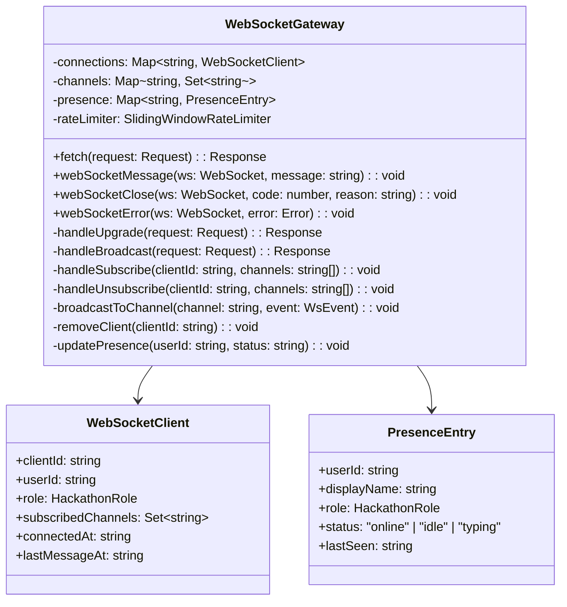

### Internal Endpoints

The gateway DO exposes internal HTTP endpoints consumed by the API Worker and other DOs via `stub.fetch()`. These are not publicly routable.

| Method | Path | Caller | Purpose |
|--------|------|--------|---------|
| GET | `/websocket` | API Worker | WebSocket upgrade (forwarded from client) |
| POST | `/broadcast` | HackathonStateMachine, API Worker | Push event to a channel |
| POST | `/broadcast-targeted` | API Worker | Push event to specific user(s) |
| GET | `/presence` | API Worker | Return current presence map |
| GET | `/stats` | API Worker | Return connection count, channel sizes |

---

## Connection Lifecycle

### Upgrade Flow

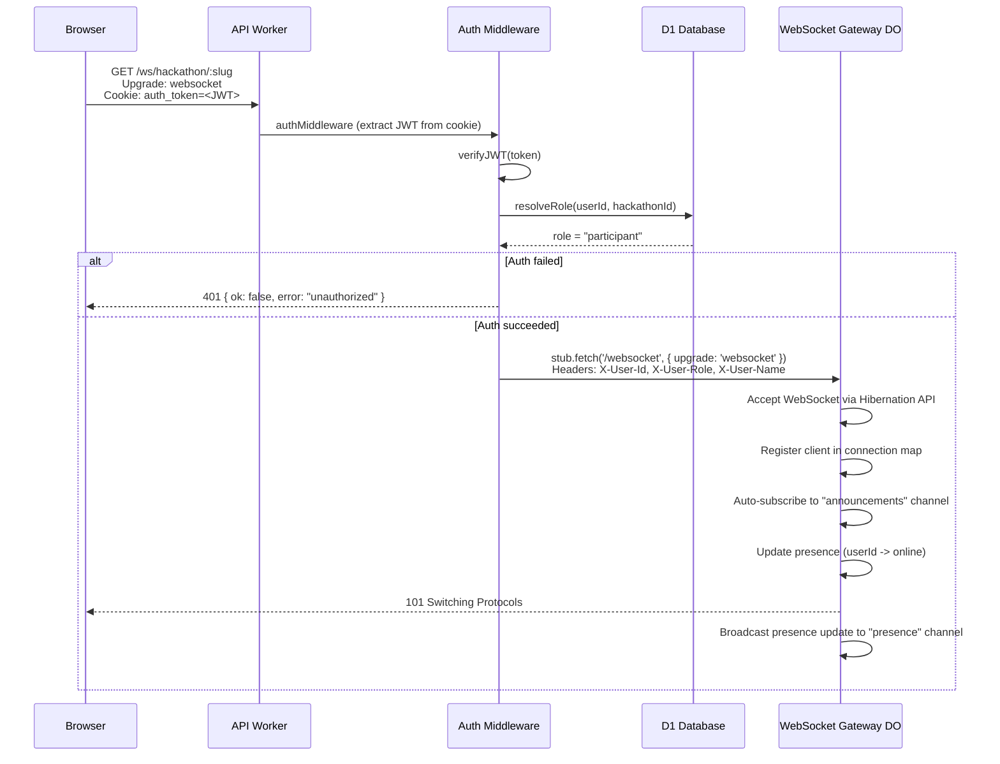

### Subscribe and Receive

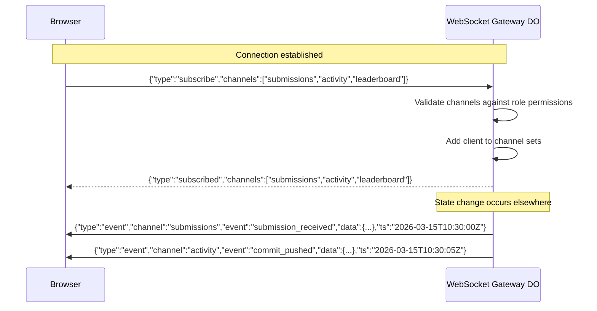

### Disconnect and Reconnect

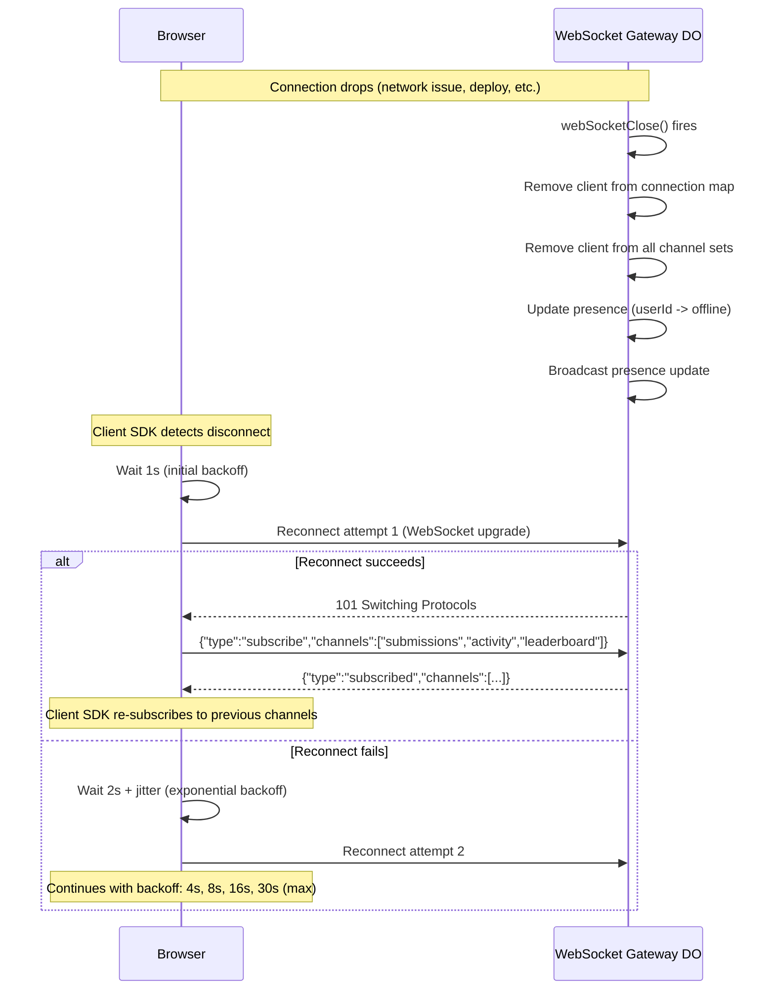

---

## Channel Model

Channels provide topic-based event routing within a hackathon. Clients subscribe to channels based on their interest and role. The gateway enforces role-based access — a participant cannot subscribe to the `judging` channel.

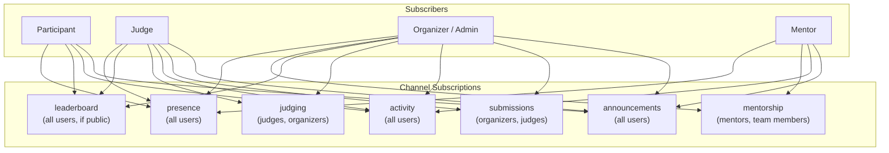

### Channel Definitions

| Channel | Events | Min Role | Description |
|---------|--------|----------|-------------|
| `announcements` | `phase_changed`, `announcement_posted`, `deadline_updated` | anonymous | Organizer broadcasts and lifecycle transitions |
| `submissions` | `submission_received`, `submission_updated`, `submission_locked` | judge | New and updated submissions (excludes content for non-judges) |
| `activity` | `commit_pushed`, `pr_opened`, `tag_created`, `team_created`, `member_joined` | participant | Live activity feed from GitHub integration and team actions |
| `judging` | `score_submitted`, `round_completed`, `judge_assigned` | judge | Judging progress and assignment updates |
| `leaderboard` | `leaderboard_updated`, `rank_changed` | participant | Score updates and rank changes (only when leaderboard is public) |
| `mentorship` | `session_requested`, `session_accepted`, `session_completed`, `mentor_available` | participant | Mentor-team session lifecycle events |
| `presence` | `user_joined`, `user_left`, `user_typing`, `user_idle` | participant | Who is online and their current status |

### Role-Channel Access Matrix

| Channel | anonymous | participant | team_leader | judge | moderator | admin | owner |
|---------|-----------|-------------|-------------|-------|-----------|-------|-------|
| `announcements` | read | read | read | read | read | read | read |
| `submissions` | -- | -- | -- | read | read | read | read |
| `activity` | -- | read | read | read | read | read | read |
| `judging` | -- | -- | -- | read | read | read | read |
| `leaderboard` | read* | read | read | read | read | read | read |
| `mentorship` | -- | read | read | -- | read | read | read |
| `presence` | -- | read | read | read | read | read | read |

*Leaderboard is readable by anonymous users only when the organizer has enabled public leaderboard visibility.

---

## Event Types and Payloads

All WebSocket messages follow a consistent envelope format:

```json
{
  "type": "event",
  "channel": "submissions",
  "event": "submission_received",
  "data": { ... },
  "ts": "2026-03-15T10:30:00.000Z",
  "hackathonId": "hack_abc123"
}
```

### Event Catalog

| Event | Channel | Payload Fields | Trigger |
|-------|---------|----------------|---------|
| `phase_changed` | announcements | `previousPhase`, `newPhase`, `changedBy` | HackathonStateMachine transitions |
| `announcement_posted` | announcements | `title`, `body`, `authorName` | Organizer posts announcement |
| `deadline_updated` | announcements | `deadlineType`, `oldDeadline`, `newDeadline` | Organizer updates deadline |
| `submission_received` | submissions | `teamId`, `teamName`, `tagName`, `submittedAt` | Tag-based submission captured |
| `submission_updated` | submissions | `teamId`, `teamName`, `version`, `tagName` | New version submitted |
| `submission_locked` | submissions | `teamId`, `teamName`, `lockedAt` | Exactly-once lock acquired |
| `commit_pushed` | activity | `teamId`, `teamName`, `commitCount`, `branch` | GitHub webhook processed |
| `pr_opened` | activity | `teamId`, `teamName`, `prTitle`, `prNumber` | GitHub webhook processed |
| `tag_created` | activity | `teamId`, `teamName`, `tagName` | GitHub webhook processed |
| `team_created` | activity | `teamName`, `memberCount` | Team registration |
| `member_joined` | activity | `teamName`, `memberName` | Team join via invite code |
| `score_submitted` | judging | `judgeId`, `teamId`, `criterionCount` | Judge submits scores |
| `round_completed` | judging | `roundNumber`, `teamsScored` | All judges complete a round |
| `judge_assigned` | judging | `judgeId`, `teamIds` | Round-robin assignment runs |
| `leaderboard_updated` | leaderboard | `topTeams[]`, `updatedAt` | Score aggregation completes |
| `rank_changed` | leaderboard | `teamId`, `oldRank`, `newRank` | Team rank shifts |
| `session_requested` | mentorship | `teamId`, `topic`, `preferredMentorId` | Team requests mentor session |
| `session_accepted` | mentorship | `sessionId`, `mentorName` | Mentor accepts session |
| `session_completed` | mentorship | `sessionId`, `duration` | Session ends |
| `mentor_available` | mentorship | `mentorId`, `mentorName`, `expertise` | Mentor comes online |
| `user_joined` | presence | `userId`, `displayName`, `role` | WebSocket connection established |
| `user_left` | presence | `userId`, `displayName` | WebSocket connection closed |
| `user_typing` | presence | `userId`, `displayName`, `channel` | Client sends typing indicator |
| `user_idle` | presence | `userId`, `displayName` | No activity for 5 minutes |

---

## Presence Tracking

Presence tracks which users are currently connected to a hackathon's real-time feed. It is ephemeral by design — presence state lives only in the gateway DO's memory and is rebuilt from active connections after a DO eviction.

### Presence States

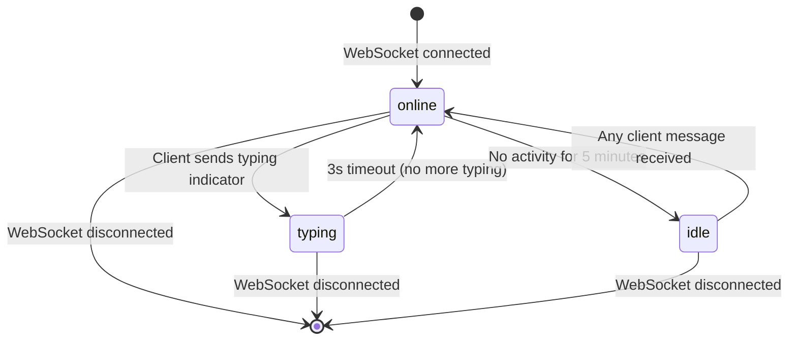

### Presence Data Structure

| Field | Type | Description |
|-------|------|-------------|
| `userId` | string | Unique user identifier |
| `displayName` | string | User's display name |
| `role` | HackathonRole | User's role in this hackathon |
| `status` | `online` / `idle` / `typing` | Current presence state |
| `lastSeen` | ISO-8601 | Timestamp of last activity |
| `typingIn` | string or null | Channel where user is typing (if status is `typing`) |

### Presence API

The API Worker exposes a REST endpoint for clients that need a snapshot of current presence without maintaining a WebSocket connection:

```
GET /api/v1/hackathons/:slug/presence
```

Response:

```json
{
  "ok": true,
  "data": {
    "online": 42,
    "users": [
      { "userId": "usr_1", "displayName": "Alice", "role": "participant", "status": "online" },
      { "userId": "usr_2", "displayName": "Bob", "role": "judge", "status": "idle" }
    ]
  }
}
```

This endpoint calls `stub.fetch('/presence')` on the gateway DO internally.

---

## SSE Fallback

Some environments (corporate networks, restrictive proxies) block WebSocket upgrades. The SSE fallback provides a read-only event stream over standard HTTP. Clients cannot send messages via SSE — they use REST API calls for any write operations.

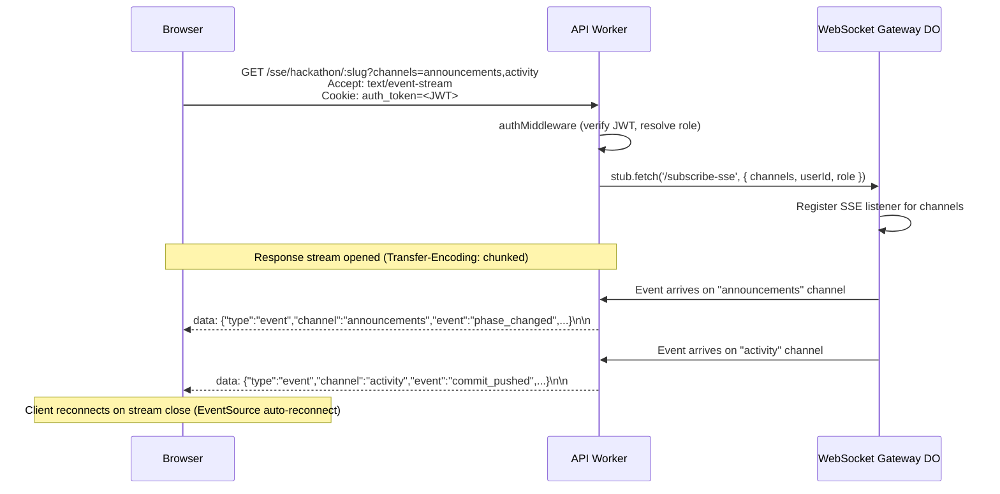

### SSE vs WebSocket Comparison

| Capability | WebSocket | SSE Fallback |
|------------|-----------|--------------|
| Receive events | Yes | Yes |
| Send messages (subscribe, typing) | Yes | No (use REST) |
| Presence tracking | Full (typing, idle) | Online only |
| Reconnection | Client SDK (exponential backoff) | Browser-native EventSource |
| Channel subscription | Dynamic (subscribe/unsubscribe) | Fixed at connection time (query param) |
| Binary data | Supported | Not supported |
| Proxy compatibility | May be blocked | Universally supported |

### Fallback Detection

The client SDK in `packages/realtime` attempts WebSocket first. If the upgrade fails (HTTP 400/403 from proxy, or timeout after 5 seconds), it automatically falls back to SSE:

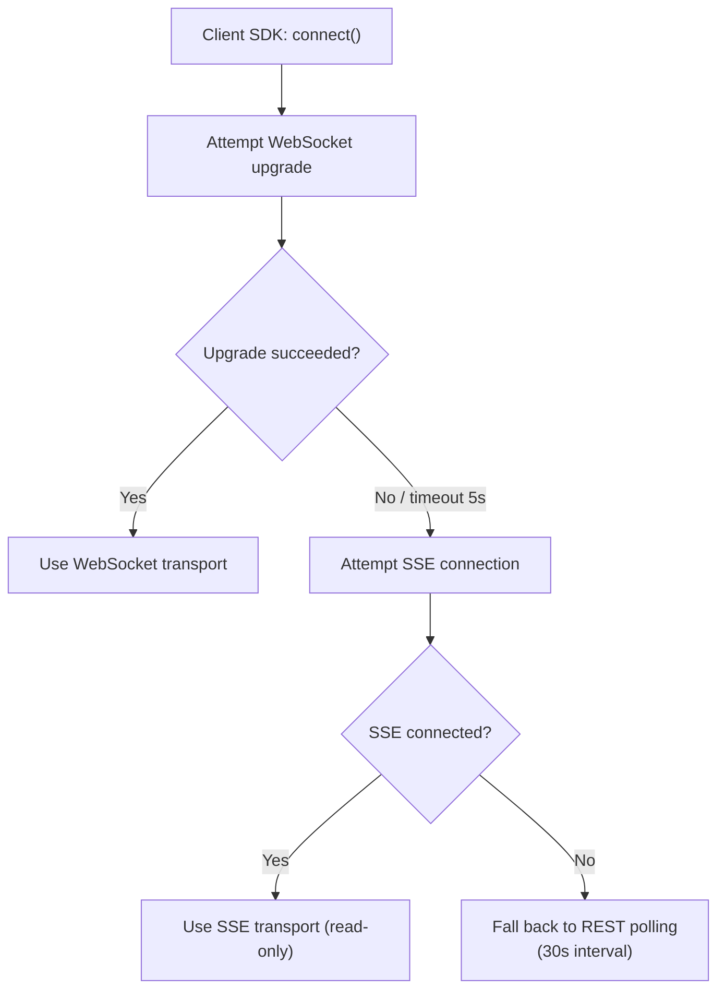

---

## Client SDK (`packages/realtime`)

The `packages/realtime` package provides a TypeScript client SDK consumed by `apps/web` (and potentially `apps/sponsor-portal`). It abstracts transport selection, reconnection, and channel management behind a simple event-emitter API.

### Public API

```typescript
// packages/realtime/src/client.ts

interface RealtimeClientOptions {
  hackathonSlug: string;
  apiOrigin: string;           // e.g., "https://api.devsage.org"
  authToken?: string;          // JWT (if not using cookies)
  channels?: string[];         // Initial channel subscriptions
  transport?: 'websocket' | 'sse' | 'auto';  // Default: 'auto'
  reconnect?: boolean;         // Default: true
  maxReconnectDelay?: number;  // Default: 30000 (30s)
}

interface RealtimeClient {
  connect(): Promise<void>;
  disconnect(): void;
  subscribe(channels: string[]): void;
  unsubscribe(channels: string[]): void;
  sendTyping(channel: string): void;
  on(event: string, handler: (data: WsEvent) => void): void;
  off(event: string, handler: (data: WsEvent) => void): void;
  readonly state: 'connecting' | 'connected' | 'reconnecting' | 'disconnected';
  readonly transport: 'websocket' | 'sse' | 'polling';
  readonly presence: ReadonlyMap<string, PresenceEntry>;
}
```

### Reconnection Strategy

The SDK uses exponential backoff with jitter to prevent reconnection storms after a deployment or network recovery event:

| Attempt | Base Delay | Jitter Range | Effective Delay |
|---------|-----------|--------------|-----------------|
| 1 | 1s | 0-500ms | 1.0-1.5s |
| 2 | 2s | 0-1000ms | 2.0-3.0s |
| 3 | 4s | 0-2000ms | 4.0-6.0s |
| 4 | 8s | 0-4000ms | 8.0-12.0s |
| 5 | 16s | 0-8000ms | 16.0-24.0s |
| 6+ | 30s (max) | 0-15000ms | 30.0-45.0s |

**Formula:** `delay = min(baseDelay * 2^attempt, maxDelay) + random(0, delay / 2)`

After 10 consecutive failed reconnection attempts, the SDK emits a `connection_failed` event and stops retrying. The application layer can call `connect()` again to restart the cycle (e.g., after user interaction).

### React Integration

```typescript
// packages/realtime/src/react.ts

function useRealtime(hackathonSlug: string): RealtimeClient;
function useChannel(channel: string, handler: (event: WsEvent) => void): void;
function usePresence(hackathonSlug: string): ReadonlyMap<string, PresenceEntry>;
```

The `useRealtime` hook creates a single `RealtimeClient` instance per hackathon, shared across all components via React context. The `useChannel` hook subscribes to a specific channel and calls the handler on each event. Both hooks clean up subscriptions on unmount.

---

## Rate Limiting

Each client connection is rate-limited to prevent abuse and protect the gateway DO from message floods.

### Client-to-Server Rate Limits

| Message Type | Limit | Window | Action on Exceed |
|-------------|-------|--------|------------------|
| `subscribe` / `unsubscribe` | 10 | 60s | Reject with error message |
| `typing` | 5 | 10s | Silently drop |
| Any message | 30 | 60s | Warn at 25, disconnect at 30 |

### Server-to-Client Rate Limits

High-frequency channels (e.g., `activity` during peak commit hours) are throttled at the gateway level to prevent overwhelming clients:

| Channel | Max Events/Second | Throttle Strategy |
|---------|-------------------|-------------------|
| `announcements` | Unlimited | No throttle (low frequency by nature) |
| `submissions` | 10 | Queue and batch if exceeded |
| `activity` | 20 | Drop oldest if buffer exceeds 50 |
| `judging` | 10 | Queue and batch if exceeded |
| `leaderboard` | 2 | Debounce (latest value wins) |
| `mentorship` | 5 | Queue and batch if exceeded |
| `presence` | 10 | Debounce per user (latest status wins) |

---

## Broadcasting Pattern

State changes flow from their origin through the WebSocket Gateway to connected clients. The gateway is a fan-out point — it receives a single event and distributes it to all clients subscribed to the relevant channel.

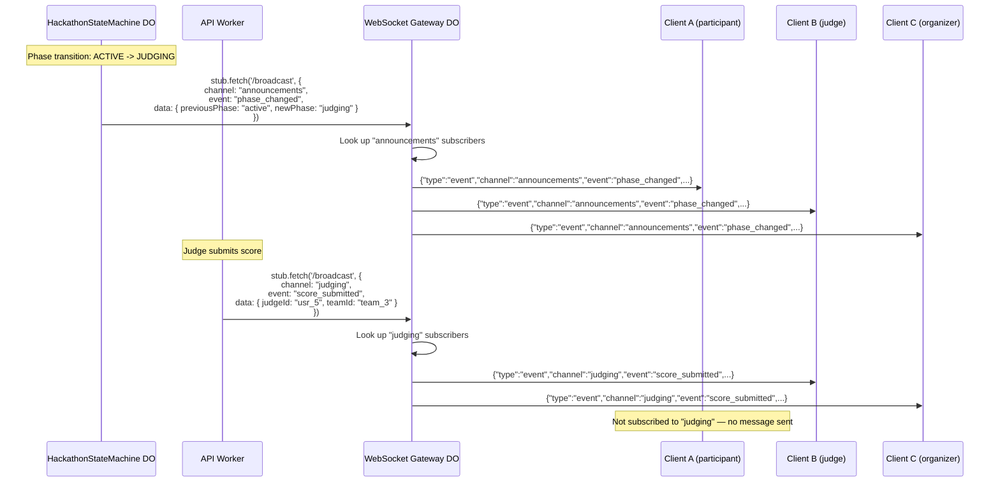

### Broadcast Sources

| Source | Events Generated | Broadcast Mechanism |
|--------|-----------------|---------------------|
| `HackathonStateMachine` DO | `phase_changed`, `submission_received`, `submission_locked` | Direct `stub.fetch('/broadcast')` to gateway |
| API route handlers | `announcement_posted`, `score_submitted`, `judge_assigned`, `team_created`, `member_joined` | API Worker calls `stub.fetch('/broadcast')` after DB write |
| Webhook queue consumer | `commit_pushed`, `pr_opened`, `tag_created` | Queue handler calls `stub.fetch('/broadcast')` after processing |
| `MentorshipSession` DO | `session_requested`, `session_accepted`, `session_completed` | Direct `stub.fetch('/broadcast')` to gateway |

---

## Scaling

### Connection Limits

| Metric | Limit | Rationale |
|--------|-------|-----------|
| Connections per gateway DO | 200 | Cloudflare DO memory budget; tested stable at 200 concurrent WebSockets |
| Gateway DOs per platform | 1 per hackathon | Natural sharding by hackathon ID |
| Total concurrent connections | 10,000 (50 hackathons x 200) | Matches v3 scale target |
| Message size | 64 KB | Cloudflare WebSocket message limit |
| Hibernated connection memory | ~2 KB per connection | WebSocket Hibernation API overhead |

### Sharding Strategy

Each hackathon maps to exactly one `WebSocketGateway` DO instance, keyed by hackathon ID. This provides:

1. **Tenant isolation** — one hackathon's traffic spike cannot affect another's gateway
2. **Natural scaling** — adding hackathons adds gateway instances automatically
3. **Simple routing** — the API Worker resolves the hackathon slug to an ID and derives the DO stub

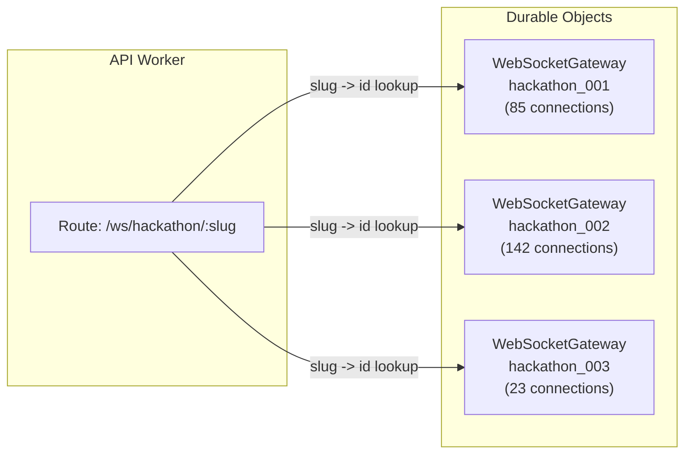

If a single hackathon exceeds 200 connections, the gateway can be further sharded by assigning clients to sub-gateways (e.g., `hackathon_001_shard_0`, `hackathon_001_shard_1`). The API Worker distributes clients round-robin across shards. Broadcasts are sent to all shards. This is a future optimization — the initial implementation uses a single gateway per hackathon.

---

## Error Handling and Graceful Degradation

### Error Categories

| Error | Client Behavior | Server Behavior |
|-------|----------------|-----------------|
| WebSocket upgrade rejected (401) | Show "session expired" prompt, redirect to login | Log auth failure |
| WebSocket upgrade rejected (429) | Show "too many connections" message | Log rate limit hit |
| Gateway DO unavailable | Fall back to SSE, then polling | Log DO error, return 503 |
| Message parse error | Ignore malformed message | Log warning, do not disconnect client |
| Rate limit exceeded | Show throttle warning in UI | Send error frame, disconnect if persistent |
| Network interruption | Auto-reconnect via SDK | Clean up client from connection map |

### Degradation Hierarchy

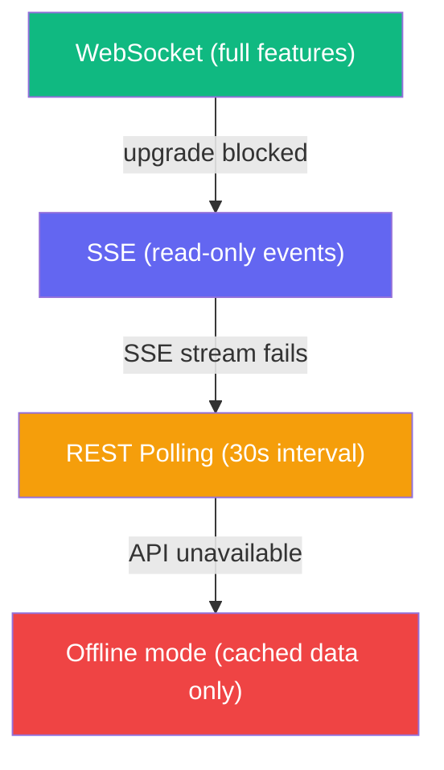

The frontend displays a connection status indicator showing the current transport mode. Users always know whether they are receiving live updates or viewing stale data.

---

## Wire Protocol

### Client-to-Server Messages

| Type | Payload | Description |
|------|---------|-------------|
| `subscribe` | `{ channels: string[] }` | Subscribe to one or more channels |
| `unsubscribe` | `{ channels: string[] }` | Unsubscribe from channels |
| `typing` | `{ channel: string }` | Signal typing activity |
| `ping` | `{}` | Keep-alive (client sends every 30s) |

### Server-to-Client Messages

| Type | Payload | Description |
|------|---------|-------------|
| `event` | `{ channel, event, data, ts, hackathonId }` | Domain event broadcast |
| `subscribed` | `{ channels: string[] }` | Confirmation of subscription |
| `unsubscribed` | `{ channels: string[] }` | Confirmation of unsubscription |
| `error` | `{ code: string, message: string }` | Error notification |
| `pong` | `{}` | Keep-alive response |
| `welcome` | `{ clientId, serverTime, channels }` | Sent on initial connection |

### Error Codes

| Code | Message | Trigger |
|------|---------|---------|
| `INVALID_MESSAGE` | Malformed JSON or unknown message type | Client sends unparseable data |
| `UNAUTHORIZED_CHANNEL` | Insufficient role for channel | Client subscribes to restricted channel |
| `RATE_LIMITED` | Too many messages | Client exceeds rate limit |
| `CHANNEL_NOT_FOUND` | Unknown channel name | Client subscribes to nonexistent channel |
| `CONNECTION_LIMIT` | Gateway at capacity | 200 connection limit reached |

---

## Migration Plan

### Strategy: Additive, No Breaking Changes

The real-time system is deployed as a new capability alongside the existing REST API. No existing endpoints change behavior. Clients that do not upgrade to the real-time SDK continue to work exactly as before.

### Deployment Sequence

| Step | Change | Risk | Rollback |
|------|--------|------|----------|
| 1 | Add `WebSocketGateway` DO class to `apps/api/src/durable-objects/` | Low | Remove class, redeploy |
| 2 | Re-export DO from `apps/api/src/index.ts` | Low | Remove export |
| 3 | Add `WebSocketGateway` binding to `wrangler.jsonc` | Low | Remove binding |
| 4 | Add `/ws/hackathon/:slug` upgrade route | Low | Remove route |
| 5 | Add `/sse/hackathon/:slug` SSE route | Low | Remove route |
| 6 | Add broadcast calls to `HackathonStateMachine` | Low | Remove calls (REST unaffected) |
| 7 | Add broadcast calls to API route handlers | Low | Remove calls |
| 8 | Add broadcast calls to queue consumers | Low | Remove calls |
| 9 | Publish `packages/realtime` client SDK | Low | Unpublish |
| 10 | Integrate SDK into `apps/web` | Medium | Feature flag to disable |

**Database migrations:** None. The real-time system is stateless.

**Breaking changes:** None. REST API continues to function identically.

---

## File References

| File | Purpose |
|------|---------|
| `apps/api/src/durable-objects/websocket-gateway.ts` | WebSocket Gateway DO class (planned) |
| `apps/api/src/routes/realtime.ts` | WebSocket upgrade and SSE fallback routes (planned) |
| `apps/api/src/index.ts` | Must re-export `WebSocketGateway` class |
| `apps/api/wrangler.jsonc` | Must add `WebSocketGateway` DO binding |
| `apps/api/src/types/env.ts` | Must add `WEBSOCKET_GATEWAY` binding type |
| `packages/realtime/src/client.ts` | Client SDK: transport, reconnection, channel management (planned) |
| `packages/realtime/src/react.ts` | React hooks: `useRealtime`, `useChannel`, `usePresence` (planned) |
| `packages/realtime/src/types.ts` | Shared types: `WsEvent`, `PresenceEntry`, `RealtimeClientOptions` (planned) |
| `packages/shared/src/schemas/realtime.ts` | Zod schemas for WebSocket message validation (planned) |
| `apps/web/src/contexts/realtime-context.tsx` | React context provider for real-time client (planned) |
| `apps/web/src/components/connection-status.tsx` | UI indicator for transport mode (planned) |
| `apps/web/src/components/presence-list.tsx` | Online users sidebar component (planned) |
| `apps/web/src/components/activity-feed.tsx` | Live activity feed component (planned) |
