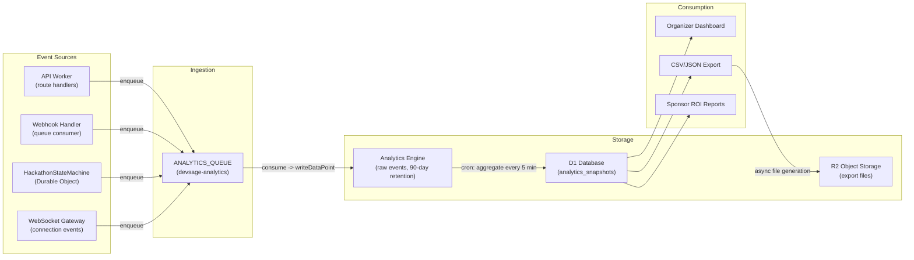
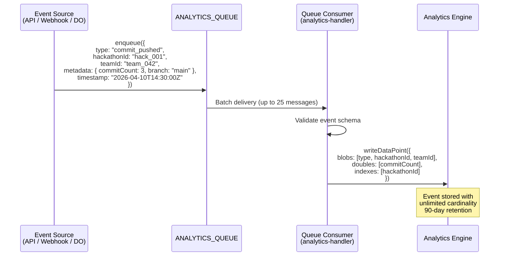
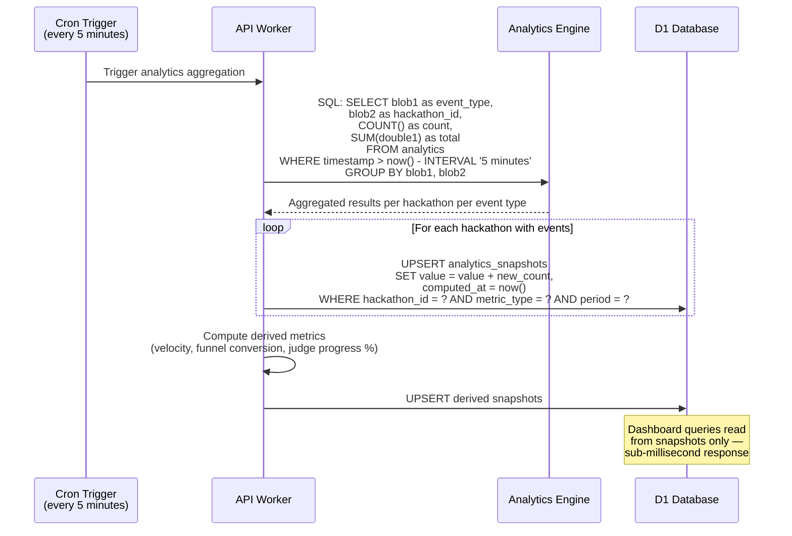
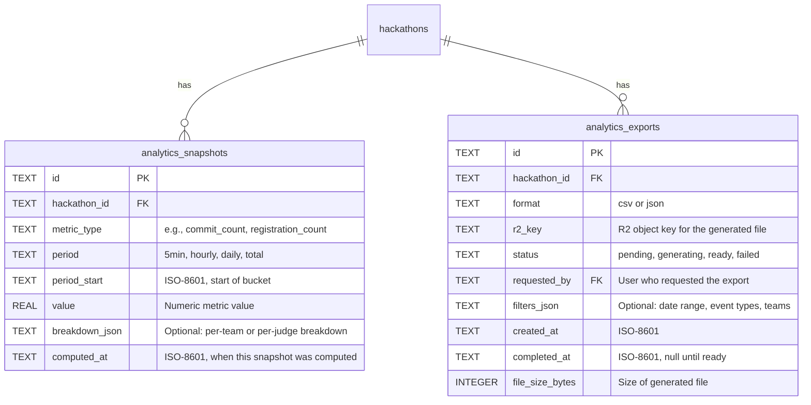
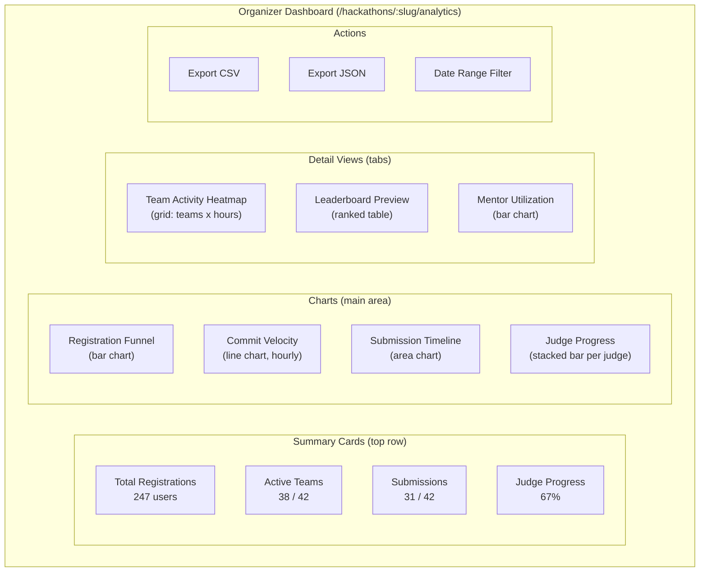
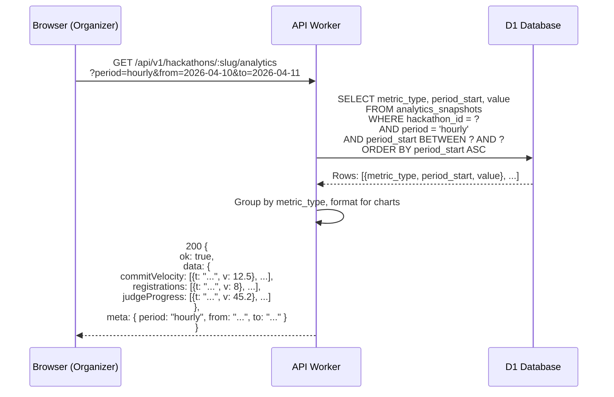
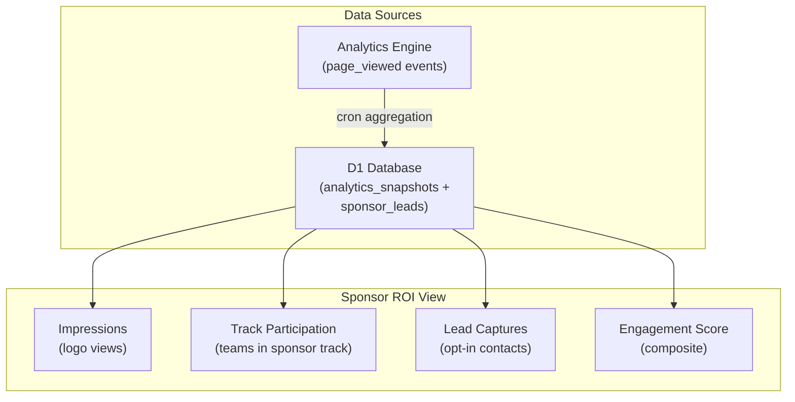
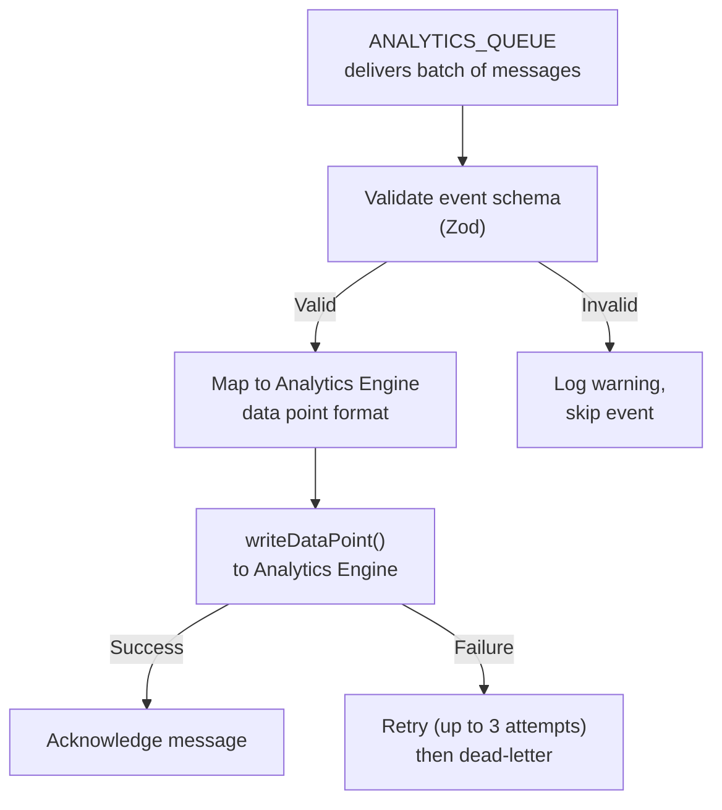

# 15 — Analytics & Insights

> The analytics system captures every meaningful platform event — commits, submissions, scores, registrations — into Cloudflare Analytics Engine via a dedicated queue. A cron job aggregates raw events into pre-computed dashboard views stored in D1. Organizers see real-time metrics on commit velocity, judge progress, registration funnels, and team activity. Exports to CSV/JSON are generated asynchronously via R2.

**Related docs:** [System Overview](./00-overview.md) | [Webhooks & Integrations](./07-webhooks-integrations.md) | [Infrastructure](./12-infrastructure.md) | [Frontend Architecture](./13-frontend.md)

---

## Pipeline Architecture

The analytics pipeline has three stages: ingestion (events enqueued from across the platform), storage (raw events written to Analytics Engine), and consumption (aggregated snapshots served to dashboards and exports).



### Design Principles

| Principle | Implementation |
|-----------|----------------|
| Fire-and-forget ingestion | Event sources enqueue and move on — analytics never blocks the critical path |
| Pre-computed dashboards | All dashboard queries read from `analytics_snapshots` in D1, never from Analytics Engine directly |
| Bounded retention | Raw events in Analytics Engine expire after 90 days; aggregated snapshots in D1 persist indefinitely |
| Additive deployment | No existing tables, routes, or behaviors change; analytics is a new read path |
| Cost-efficient | Analytics Engine free tier supports 100M events/day — well beyond v3 targets |

---

## Event Ingestion

### ANALYTICS_QUEUE

A new Cloudflare Queue (`devsage-analytics`) handles event ingestion. Event sources across the platform enqueue lightweight event payloads. The queue consumer writes each event to Analytics Engine using `writeDataPoint()`.



### Event Envelope

All analytics events share a common envelope:

```json
{
  "type": "commit_pushed",
  "hackathonId": "hack_001",
  "teamId": "team_042",
  "userId": "usr_007",
  "metadata": {
    "commitCount": 3,
    "branch": "main"
  },
  "timestamp": "2026-04-10T14:30:00.000Z"
}
```

| Field | Type | Required | Description |
|-------|------|----------|-------------|
| `type` | string | Yes | Event type identifier (see catalog below) |
| `hackathonId` | string | Yes | Hackathon this event belongs to |
| `teamId` | string | No | Team associated with the event (if applicable) |
| `userId` | string | No | User who triggered the event (if applicable) |
| `metadata` | object | No | Event-specific payload (varies by type) |
| `timestamp` | ISO-8601 | Yes | When the event occurred (UTC) |

### Event Type Catalog

| Event Type | Source | Metadata Fields | Frequency |
|------------|--------|-----------------|-----------|
| `user_registered` | API (auth routes) | `provider` (github/google), `hackathonSlug` | Low (~10/day per hackathon) |
| `team_created` | API (team routes) | `teamName`, `memberCount` | Low (~5/day per hackathon) |
| `commit_pushed` | Webhook consumer | `commitCount`, `branch`, `repoFullName` | High (~500/day per hackathon) |
| `submission_created` | HackathonStateMachine DO | `tagName`, `version`, `commitSha` | Medium (~50/day per hackathon) |
| `score_submitted` | API (judging routes) | `criterionCount`, `totalScore`, `roundNumber` | Medium (~100/day during judging) |
| `phase_changed` | HackathonStateMachine DO | `previousPhase`, `newPhase`, `changedBy` | Very low (~7 per hackathon lifetime) |
| `page_viewed` | API (optional middleware) | `page`, `referrer`, `userAgent` | High (~2000/day per hackathon) |
| `mentor_session_started` | MentorshipSession DO | `mentorId`, `topic`, `teamId` | Low (~20/day per hackathon) |

### Analytics Engine Data Point Mapping

Analytics Engine stores data as `blobs` (strings), `doubles` (numbers), and `indexes` (queryable strings). Each event type maps to this structure:

| Slot | Analytics Engine Field | Content |
|------|----------------------|---------|
| `blob1` | Event type | `"commit_pushed"`, `"user_registered"`, etc. |
| `blob2` | Hackathon ID | `"hack_001"` |
| `blob3` | Team ID | `"team_042"` (or empty) |
| `blob4` | User ID | `"usr_007"` (or empty) |
| `blob5` | Metadata JSON | Serialized event-specific data |
| `double1` | Numeric value 1 | Event-specific (e.g., commit count, score) |
| `double2` | Numeric value 2 | Event-specific (e.g., round number) |
| `index1` | Primary index | Hackathon ID (for efficient per-hackathon queries) |

---

## Cron-Based Aggregation

Raw events in Analytics Engine are optimized for write throughput, not dashboard queries. A cron job runs every 5 minutes, queries Analytics Engine for recent events, computes aggregated metrics, and upserts them into the `analytics_snapshots` table in D1.



### Aggregation Windows

The cron job computes metrics at multiple time granularities:

| Period | Granularity | Retention | Use Case |
|--------|-------------|-----------|----------|
| `5min` | 5-minute buckets | 7 days | Real-time dashboard sparklines |
| `hourly` | 1-hour buckets | 90 days | Trend charts, velocity graphs |
| `daily` | 1-day buckets | Indefinite | Historical reports, exports |
| `total` | Lifetime aggregate | Indefinite | Summary cards, final reports |

### Derived Metrics

Beyond raw event counts, the aggregation job computes derived metrics that power specific dashboard views:

| Metric | Computation | Dashboard View |
|--------|-------------|----------------|
| Commit velocity | `commits_last_hour / teams_with_commits` | Velocity graph (commits/hour/team) |
| Registration funnel | `registered / visited` (requires `page_viewed`) | Funnel chart |
| Judge progress | `scores_submitted / (judges * teams * criteria)` | Progress bar per judge |
| Team activity score | Weighted sum: commits (1x) + PRs (3x) + submissions (5x) | Team activity heatmap |
| Submission rate | `submissions_last_hour / total_teams` | Submission timeline |
| Mentor utilization | `active_sessions / available_mentors` | Mentor dashboard |

---

## Data Model

### `analytics_snapshots` Table



### Constraints

| Constraint | Columns | Purpose |
|------------|---------|---------|
| `UNIQUE(hackathon_id, metric_type, period, period_start)` | analytics_snapshots | One value per metric per time bucket |
| `INDEX(hackathon_id, period)` | analytics_snapshots | Fast dashboard queries by hackathon and time range |
| `INDEX(hackathon_id, metric_type)` | analytics_snapshots | Fast metric-specific lookups |
| `INDEX(hackathon_id, status)` | analytics_exports | Find pending/ready exports per hackathon |

### Metric Types

| `metric_type` | Description | `value` Meaning |
|---------------|-------------|-----------------|
| `user_registered_count` | Registrations in this period | Count of new registrations |
| `team_created_count` | Teams formed in this period | Count of new teams |
| `commit_pushed_count` | Commits pushed in this period | Total commit count |
| `commit_velocity` | Average commits per active team per hour | Derived ratio |
| `submission_created_count` | Submissions in this period | Count of new submissions |
| `score_submitted_count` | Scores submitted in this period | Count of scores |
| `judge_progress_pct` | Percentage of judging completed | 0.0 to 100.0 |
| `team_activity_score` | Weighted activity score | Derived composite score |
| `page_viewed_count` | Page views in this period | Count of views |
| `mentor_session_count` | Mentor sessions in this period | Count of sessions |
| `registration_funnel_pct` | Conversion from visit to registration | 0.0 to 100.0 |
| `active_teams_count` | Teams with at least one commit in this period | Count of active teams |

---

## Organizer Dashboard

The organizer dashboard is a page within `apps/web` accessible to users with `admin` or `owner` role for a hackathon. It reads exclusively from the `analytics_snapshots` table — no direct Analytics Engine queries from the frontend.

### Dashboard Layout



### API Endpoints

| Method | Route | Auth | Description |
|--------|-------|------|-------------|
| GET | `/api/v1/hackathons/:slug/analytics` | admin+ | Dashboard summary (all metric types, latest period) |
| GET | `/api/v1/hackathons/:slug/analytics/metrics/:type` | admin+ | Time-series data for a specific metric |
| GET | `/api/v1/hackathons/:slug/analytics/teams` | admin+ | Per-team activity breakdown |
| GET | `/api/v1/hackathons/:slug/analytics/judges` | admin+ | Per-judge progress breakdown |
| POST | `/api/v1/hackathons/:slug/analytics/export` | admin+ | Request async export (CSV or JSON) |
| GET | `/api/v1/hackathons/:slug/analytics/export/:id` | admin+ | Check export status / download link |

### Dashboard Query Pattern

All dashboard queries follow the same pattern: read pre-computed snapshots from D1, never query Analytics Engine from the request path.



### Visualization Specifications

| Chart | Type | X-Axis | Y-Axis | Data Source |
|-------|------|--------|--------|-------------|
| Registration funnel | Bar chart | Stage (visited, registered, team joined, submitted) | Count | `registration_funnel_pct`, `user_registered_count`, `team_created_count` |
| Commit velocity | Line chart | Time (hourly buckets) | Commits/hour/team | `commit_velocity` |
| Submission timeline | Area chart | Time (hourly buckets) | Cumulative submissions | `submission_created_count` (cumulative) |
| Judge progress | Stacked bar | Judge name | Scores completed / total | `breakdown_json` from `judge_progress_pct` |
| Team activity heatmap | Grid | Hours of day | Team name | `team_activity_score` with `breakdown_json` |
| Mentor utilization | Bar chart | Mentor name | Sessions completed | `mentor_session_count` with `breakdown_json` |

---

## CSV/JSON Export

Organizers can export analytics data for offline analysis, reporting, or sharing with stakeholders. Exports are generated asynchronously because they may involve querying large time ranges from Analytics Engine.

### Export Flow

```mermaid
sequenceDiagram
    participant B as Browser (Organizer)
    participant W as API Worker
    participant Q as ANALYTICS_QUEUE
    participant AE as Analytics Engine
    participant R2 as R2 Object Storage
    participant D1 as D1 Database
    participant GW as WebSocket Gateway

    B->>W: POST /api/v1/hackathons/:slug/analytics/export<br/>{ format: "csv", dateRange: { from, to }, eventTypes: [...] }

    W->>D1: INSERT analytics_exports<br/>(status: "pending", format, filters)
    W-->>B: 202 { ok: true, data: { exportId: "exp_001", status: "pending" } }

    W->>Q: enqueue({ type: "generate_export", exportId: "exp_001" })

    Q->>W: Consumer picks up export job
    W->>AE: SQL query: SELECT * FROM analytics<br/>WHERE hackathon_id = ? AND timestamp BETWEEN ? AND ?
    AE-->>W: Raw event rows

    W->>W: Format as CSV (or JSON)
    W->>R2: PUT analytics-exports/hack_001/exp_001.csv
    R2-->>W: Upload complete

    W->>D1: UPDATE analytics_exports<br/>SET status = 'ready',<br/>    r2_key = 'analytics-exports/hack_001/exp_001.csv',<br/>    file_size_bytes = 245760,<br/>    completed_at = now()

    W->>GW: stub.fetch('/broadcast-targeted', {<br/>  userId: requestedBy,<br/>  event: "export_ready",<br/>  data: { exportId: "exp_001" }<br/>})

    GW->>B: WebSocket: {"type":"event","event":"export_ready","data":{"exportId":"exp_001"}}

    B->>W: GET /api/v1/hackathons/:slug/analytics/export/exp_001
    W->>R2: GET analytics-exports/hack_001/exp_001.csv
    R2-->>W: File content
    W-->>B: 200 (Content-Disposition: attachment; filename="hack_001_analytics.csv")
```

### Export Formats

**CSV format:**

```
timestamp,event_type,hackathon_id,team_id,user_id,metadata
2026-04-10T14:30:00Z,commit_pushed,hack_001,team_042,usr_007,"{""commitCount"":3,""branch"":""main""}"
2026-04-10T14:31:00Z,submission_created,hack_001,team_042,,"{""tagName"":""v1.0.0"",""version"":1}"
```

**JSON format:**

```json
{
  "hackathon": "hack_001",
  "exportedAt": "2026-04-11T10:00:00Z",
  "dateRange": { "from": "2026-04-10T00:00:00Z", "to": "2026-04-11T00:00:00Z" },
  "eventCount": 1247,
  "events": [
    {
      "timestamp": "2026-04-10T14:30:00Z",
      "type": "commit_pushed",
      "hackathonId": "hack_001",
      "teamId": "team_042",
      "userId": "usr_007",
      "metadata": { "commitCount": 3, "branch": "main" }
    }
  ]
}
```

### Export Constraints

| Constraint | Value | Rationale |
|------------|-------|-----------|
| Max date range | 90 days | Analytics Engine retention limit |
| Max file size | 50 MB | R2 single-object upload limit for Workers |
| Concurrent exports per hackathon | 3 | Prevent resource exhaustion |
| Export expiry | 7 days | R2 lifecycle rule deletes old exports |
| Rate limit | 5 exports/hour per user | Prevent abuse |

---

## Sponsor ROI Reporting

Sponsors need visibility into the impact of their investment. The analytics system provides sponsor-specific views that aggregate metrics relevant to ROI measurement.

### Sponsor Metrics

| Metric | Description | Data Source |
|--------|-------------|-------------|
| Logo impressions | Times the sponsor logo was displayed on hackathon pages | `page_viewed` events filtered by pages with sponsor placement |
| Challenge track participation | Teams that selected the sponsor's challenge track | `team_created` events with track metadata |
| Lead capture count | Participants who opted in to sponsor contact | `sponsor_leads` table (see [Sponsor Portal](./16-sponsor-portal.md)) |
| Engagement score | Composite: impressions + track participation + lead captures | Derived metric |
| Hackathon reach | Total registered participants across sponsored hackathons | `user_registered_count` snapshots |

### Sponsor Dashboard Integration



Sponsor ROI reports are accessible via the Sponsor Portal (`apps/sponsor-portal`) and also exportable as PDF summaries. The detailed design of the Sponsor Portal is covered in [16-sponsor-portal.md](./16-sponsor-portal.md).

---

## Cost Analysis

### Analytics Engine Pricing

| Tier | Events/Day | Monthly Cost | Notes |
|------|-----------|--------------|-------|
| Free | Up to 100M | $0 | Included with Workers Paid plan |
| Overage | Per 1M above 100M | $0.25 | Unlikely to reach at v3 scale |

### Projected Event Volume (v3 targets)

| Event Type | Per Hackathon/Day | 50 Hackathons/Day | Monthly Total |
|------------|-------------------|-------------------|---------------|
| `commit_pushed` | 500 | 25,000 | 750,000 |
| `page_viewed` | 2,000 | 100,000 | 3,000,000 |
| `user_registered` | 10 | 500 | 15,000 |
| `team_created` | 5 | 250 | 7,500 |
| `submission_created` | 50 | 2,500 | 75,000 |
| `score_submitted` | 100 | 5,000 | 150,000 |
| `phase_changed` | <1 | <50 | <1,500 |
| `mentor_session_started` | 20 | 1,000 | 30,000 |
| **Total** | **~2,685** | **~134,300** | **~4,029,000** |

**Conclusion:** At ~4M events/month (~134K/day), the platform operates well within the 100M events/day free tier. Analytics Engine adds zero incremental cost at v3 scale.

### Storage Costs

| Component | Size (projected) | Monthly Cost |
|-----------|-----------------|--------------|
| `analytics_snapshots` in D1 | ~50 MB | $0 (within D1 limits) |
| Export files in R2 | ~2 GB (with 7-day expiry) | ~$0.03 (R2: $0.015/GB/month) |
| Analytics Engine storage | Managed by Cloudflare | $0 (included) |
| **Total analytics cost** | | **~$0.03/month** |

---

## Queue Consumer Design

### `analytics-handler.ts`

The analytics queue consumer processes batches of events and writes them to Analytics Engine. It follows the same consumer pattern as the existing webhook and notification handlers.



### Batch Processing

| Property | Value |
|----------|-------|
| Max batch size | 25 messages (Analytics Engine batch limit) |
| Max retries | 3 per message |
| Dead letter queue | Log to `console.error` with full event payload (no separate DLQ) |
| Processing timeout | 30 seconds per batch |
| Idempotency | Analytics Engine handles duplicate writes gracefully (append-only) |

### Wrangler Configuration

The `ANALYTICS_QUEUE` binding is added to `wrangler.jsonc` alongside the existing queues:

```jsonc
{
  "queues": {
    "producers": [
      { "queue": "devsage-analytics", "binding": "ANALYTICS_QUEUE" }
    ],
    "consumers": [
      {
        "queue": "devsage-analytics",
        "max_batch_size": 25,
        "max_retries": 3,
        "dead_letter_queue": null
      }
    ]
  },
  "analytics_engine_datasets": [
    { "binding": "ANALYTICS", "dataset": "devsage_analytics" }
  ]
}
```

---

## Database Migrations

### Migration 1: `analytics_snapshots`

```sql
CREATE TABLE analytics_snapshots (
    id TEXT PRIMARY KEY,
    hackathon_id TEXT NOT NULL REFERENCES hackathons(id),
    metric_type TEXT NOT NULL,
    period TEXT NOT NULL CHECK (period IN ('5min', 'hourly', 'daily', 'total')),
    period_start TEXT NOT NULL,
    value REAL NOT NULL DEFAULT 0,
    breakdown_json TEXT,
    computed_at TEXT NOT NULL
);

CREATE UNIQUE INDEX idx_snapshots_unique
    ON analytics_snapshots(hackathon_id, metric_type, period, period_start);

CREATE INDEX idx_snapshots_hackathon_period
    ON analytics_snapshots(hackathon_id, period);

CREATE INDEX idx_snapshots_hackathon_metric
    ON analytics_snapshots(hackathon_id, metric_type);
```

### Migration 2: `analytics_exports`

```sql
CREATE TABLE analytics_exports (
    id TEXT PRIMARY KEY,
    hackathon_id TEXT NOT NULL REFERENCES hackathons(id),
    format TEXT NOT NULL CHECK (format IN ('csv', 'json')),
    r2_key TEXT,
    status TEXT NOT NULL DEFAULT 'pending' CHECK (status IN ('pending', 'generating', 'ready', 'failed')),
    requested_by TEXT NOT NULL REFERENCES users(id),
    filters_json TEXT,
    created_at TEXT NOT NULL,
    completed_at TEXT,
    file_size_bytes INTEGER
);

CREATE INDEX idx_exports_hackathon_status
    ON analytics_exports(hackathon_id, status);
```

### Drizzle Schema Definitions

The Drizzle ORM schema files will be added to `packages/db/src/schema/`:

| File | Table | Description |
|------|-------|-------------|
| `analytics-snapshots.ts` | `analytics_snapshots` | Pre-computed metric values per time bucket |
| `analytics-exports.ts` | `analytics_exports` | Export job tracking and R2 file references |

Both tables are re-exported from `packages/db/src/schema/index.ts` following the existing barrel export pattern with `.js` extensions.

---

## Error Handling

### Ingestion Errors

| Error | Behavior | Impact |
|-------|----------|--------|
| Invalid event schema | Log warning, skip event | One event lost; no dashboard impact |
| Analytics Engine write failure | Retry up to 3 times, then drop | Events may be missing from raw store; snapshots self-correct on next aggregation |
| Queue delivery failure | Cloudflare retries automatically | Transient; events arrive eventually |

### Aggregation Errors

| Error | Behavior | Impact |
|-------|----------|--------|
| Analytics Engine query timeout | Skip this aggregation cycle; retry in 5 minutes | Dashboard shows slightly stale data |
| D1 write failure | Retry once; log error if persistent | Snapshot not updated; next cycle catches up |
| Cron trigger missed | Next trigger runs normally | 5-minute gap in fine-grained data |

### Export Errors

| Error | Behavior | Impact |
|-------|----------|--------|
| Analytics Engine query failure | Set export status to `failed`; notify user | User can retry |
| R2 upload failure | Retry once; set status to `failed` if persistent | User can retry |
| File exceeds 50 MB | Truncate to date range that fits; warn user | Partial export delivered |

### Graceful Degradation

The analytics system follows the platform's P6 principle (graceful degradation). If Analytics Engine is unavailable:

1. Events continue to be enqueued (queue buffers them)
2. Dashboard shows last-known snapshot data with a "data may be stale" indicator
3. Exports are temporarily unavailable (status: `failed` with retry option)
4. Core platform functionality (submissions, judging, teams) is completely unaffected

---

## Migration Plan

### Strategy: Additive, New Read Path Only

The analytics system introduces new infrastructure (queue, Analytics Engine binding, cron schedule) and new tables. No existing tables, routes, or behaviors change.

### Deployment Sequence

| Step | Change | Risk | Rollback |
|------|--------|------|----------|
| 1 | Run Drizzle migrations for `analytics_snapshots` and `analytics_exports` | Low | Drop tables |
| 2 | Add `ANALYTICS_QUEUE` binding to `wrangler.jsonc` | Low | Remove binding |
| 3 | Add `ANALYTICS` (Analytics Engine dataset) binding to `wrangler.jsonc` | Low | Remove binding |
| 4 | Add `analytics-handler.ts` queue consumer | Low | Remove handler |
| 5 | Wire analytics handler into `queue/index.ts` dispatcher | Low | Remove dispatch case |
| 6 | Add `enqueueAnalyticsEvent()` helper to `apps/api/src/lib/analytics.ts` | Low | Remove helper |
| 7 | Add analytics enqueue calls to API route handlers | Low | Remove calls |
| 8 | Add analytics enqueue calls to webhook consumer | Low | Remove calls |
| 9 | Add analytics enqueue calls to HackathonStateMachine DO | Low | Remove calls |
| 10 | Add 5-minute cron schedule to `wrangler.jsonc` | Low | Remove schedule |
| 11 | Add aggregation cron handler | Low | Remove handler |
| 12 | Add analytics API routes (`/api/v1/hackathons/:slug/analytics/*`) | Low | Remove routes |
| 13 | Add organizer dashboard page to `apps/web` | Low | Remove page |
| 14 | Add export generation and R2 upload logic | Low | Remove logic |

**Database migrations:** Two new tables (`analytics_snapshots`, `analytics_exports`). No changes to existing tables.

**Breaking changes:** None. Analytics is an entirely new subsystem.

---

## File References

| File | Purpose |
|------|---------|
| `apps/api/src/queue/analytics-handler.ts` | Queue consumer: validate events, write to Analytics Engine (planned) |
| `apps/api/src/queue/index.ts` | Queue dispatcher: must add `ANALYTICS_QUEUE` case (planned) |
| `apps/api/src/lib/analytics.ts` | Helper: `enqueueAnalyticsEvent()` for consistent event creation (planned) |
| `apps/api/src/routes/analytics.ts` | Analytics API routes: dashboard, metrics, export (planned) |
| `apps/api/src/cron/analytics-aggregation.ts` | Cron handler: query Analytics Engine, upsert snapshots (planned) |
| `apps/api/wrangler.jsonc` | Must add `ANALYTICS_QUEUE`, `ANALYTICS` dataset, 5-min cron |
| `apps/api/src/types/env.ts` | Must add `ANALYTICS_QUEUE` and `ANALYTICS` binding types |
| `packages/db/src/schema/analytics-snapshots.ts` | Drizzle schema for `analytics_snapshots` table (planned) |
| `packages/db/src/schema/analytics-exports.ts` | Drizzle schema for `analytics_exports` table (planned) |
| `packages/db/src/schema/index.ts` | Must re-export new analytics schemas |
| `packages/shared/src/schemas/analytics.ts` | Zod schemas for analytics event validation (planned) |
| `apps/web/src/pages/analytics-dashboard.tsx` | Organizer analytics dashboard page (planned) |
| `apps/web/src/components/charts/` | Chart components: velocity, funnel, heatmap, progress (planned) |
| `tools/analytics-cli/` | CLI for querying Analytics Engine during local dev (planned) |
