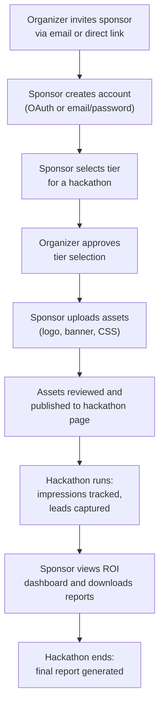
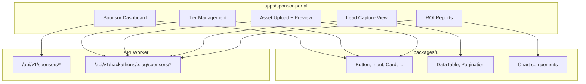
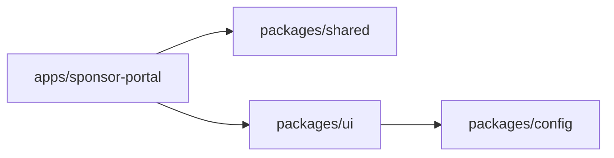
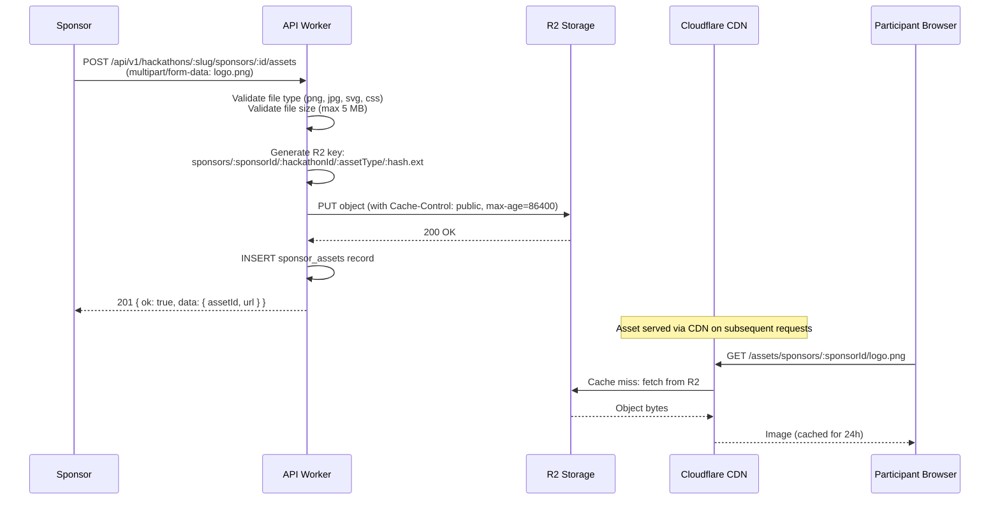
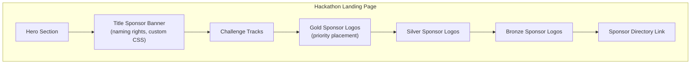
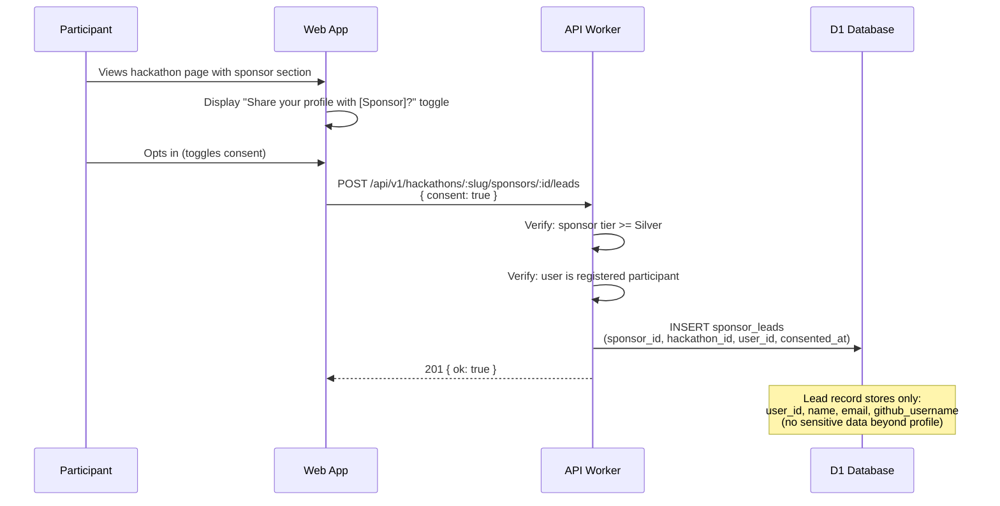
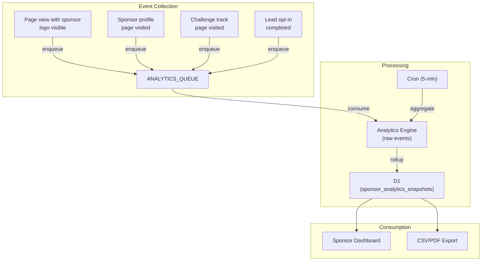
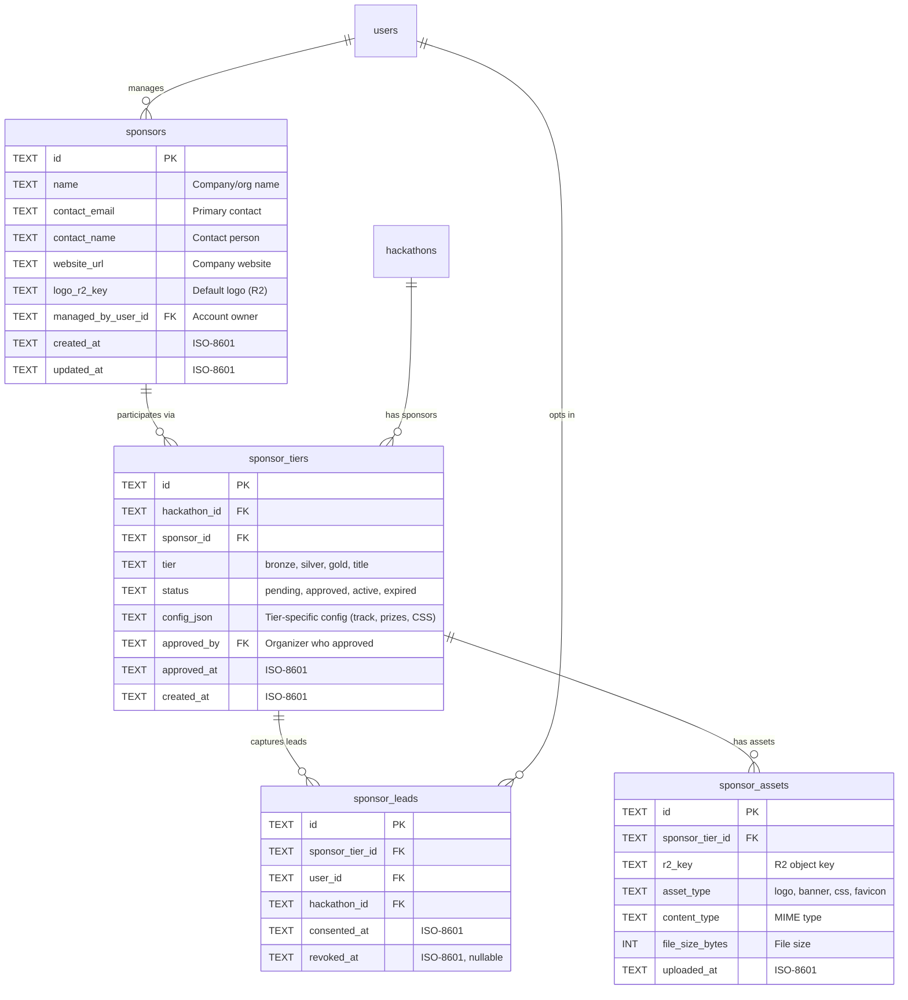
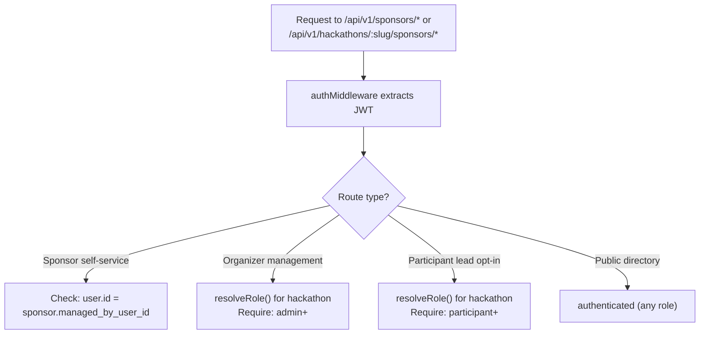

# 16 — Sponsor Portal

> Sponsors interact with DevSage through a dedicated portal that provides tier-based branding, asset management, lead capture, and ROI measurement. A separate React SPA at `apps/sponsor-portal` consumes the shared `packages/ui` component library and communicates with the API via dedicated sponsor routes.

**Related docs:** [System Overview](./00-overview.md) | [Data Model](./10-data-model.md) | [API Design](./11-api-design.md) | [Infrastructure](./12-infrastructure.md) | [Frontend Architecture](./13-frontend.md) | [Analytics & Insights](./15-analytics.md)

---

## Sponsor Lifecycle

---

## Sponsor Tiers

Each hackathon defines which tiers are available and their pricing. Sponsors select a tier when associating with a hackathon. Organizers approve the selection before branding goes live.

| Tier | Features | Price Point |
|------|----------|-------------|
| **Bronze** | Logo on hackathon page, mention in notification emails, listing in sponsor directory | Free / in-kind |
| **Silver** | Bronze + branded challenge track, lead capture (participant opt-in), sponsor profile page | Paid |
| **Gold** | Silver + custom landing page section, dedicated judge seat, full analytics dashboard, priority logo placement | Paid |
| **Title** | Gold + naming rights ("Presented by X"), keynote slot, full participant export (with consent), custom CSS injection on hackathon pages | Paid |

### Tier Feature Matrix

| Feature | Bronze | Silver | Gold | Title |
|---------|--------|--------|------|-------|
| Logo on hackathon page | Yes | Yes | Yes | Yes |
| Email mention | Yes | Yes | Yes | Yes |
| Sponsor directory listing | Yes | Yes | Yes | Yes |
| Branded challenge track | No | Yes | Yes | Yes |
| Lead capture | No | Yes | Yes | Yes |
| Sponsor profile page | No | Yes | Yes | Yes |
| Custom landing page section | No | No | Yes | Yes |
| Judge seat | No | No | 1 seat | 2 seats |
| Analytics dashboard | No | No | Yes | Yes |
| Priority logo placement | No | No | Yes | Yes |
| Naming rights | No | No | No | Yes |
| Keynote slot | No | No | No | Yes |
| Full participant export | No | No | No | Yes (with consent) |
| Custom CSS injection | No | No | No | Yes |

---

## Architecture

### Portal Application

The sponsor portal is a standalone React SPA deployed to Cloudflare Pages at a subdomain (e.g., `sponsors.devsage.org`). It shares the `packages/ui` component library with the main `apps/web` application, ensuring visual consistency without coupling the two apps.

### Dependency Graph

The sponsor portal depends only on `packages/shared` (Zod schemas, types) and `packages/ui` (React components). It does not depend on `packages/db` or `packages/realtime` — all data access goes through the REST API.

---

## API Routes

### Sponsor Management

| Method | Route | Auth | Description |
|--------|-------|------|-------------|
| GET | `/api/v1/sponsors` | authenticated | List all sponsors (public directory) |
| GET | `/api/v1/sponsors/:id` | authenticated | Get sponsor profile |
| PUT | `/api/v1/sponsors/:id` | sponsor (self) | Update sponsor profile |
| GET | `/api/v1/sponsors/:id/hackathons` | sponsor (self) | List hackathons this sponsor is associated with |

### Hackathon-Scoped Sponsor Routes

| Method | Route | Auth | Description |
|--------|-------|------|-------------|
| GET | `/api/v1/hackathons/:slug/sponsors` | authenticated | List sponsors for a hackathon |
| POST | `/api/v1/hackathons/:slug/sponsors` | admin+ | Add sponsor to hackathon (invite or approve) |
| PUT | `/api/v1/hackathons/:slug/sponsors/:id` | admin+ or sponsor (self) | Update tier, config |
| DELETE | `/api/v1/hackathons/:slug/sponsors/:id` | admin+ | Remove sponsor from hackathon |
| POST | `/api/v1/hackathons/:slug/sponsors/:id/assets` | sponsor (self) | Upload asset (logo, banner, CSS) |
| GET | `/api/v1/hackathons/:slug/sponsors/:id/assets` | sponsor (self) | List uploaded assets |
| DELETE | `/api/v1/hackathons/:slug/sponsors/:id/assets/:assetId` | sponsor (self) | Delete an asset |
| GET | `/api/v1/hackathons/:slug/sponsors/:id/leads` | sponsor (self) | List captured leads |
| GET | `/api/v1/hackathons/:slug/sponsors/:id/leads/export` | sponsor (self) | Export leads as CSV |
| GET | `/api/v1/hackathons/:slug/sponsors/:id/reports` | sponsor (self) | Get ROI report data |
| POST | `/api/v1/hackathons/:slug/sponsors/:id/reports/export` | sponsor (self) | Generate downloadable ROI report |

### Organizer Sponsor Management

| Method | Route | Auth | Description |
|--------|-------|------|-------------|
| POST | `/api/v1/hackathons/:slug/sponsors/invite` | admin+ | Send sponsor invitation email |
| PUT | `/api/v1/hackathons/:slug/sponsors/:id/approve` | admin+ | Approve sponsor tier selection |
| GET | `/api/v1/hackathons/:slug/sponsors/summary` | admin+ | Aggregate sponsor stats for organizer dashboard |

---

## Asset Pipeline

Sponsor assets (logos, banners, custom CSS) are stored in R2 with CDN caching via Cloudflare's built-in cache. Assets are keyed by sponsor and hackathon to prevent cross-contamination.

### Asset Constraints

| Property | Value |
|----------|-------|
| Max file size | 5 MB per asset |
| Allowed types (images) | `image/png`, `image/jpeg`, `image/svg+xml`, `image/webp` |
| Allowed types (CSS) | `text/css` (Title tier only) |
| R2 key format | `sponsors/{sponsorId}/{hackathonId}/{assetType}/{contentHash}.{ext}` |
| Cache-Control | `public, max-age=86400` (24 hours) |
| CDN purge | On asset replacement, old key is deleted and new key is written (cache-busting via content hash) |
| Max assets per sponsor per hackathon | 10 |

### Custom CSS Sandboxing (Title Tier)

Title-tier sponsors can inject custom CSS into hackathon pages. To prevent abuse, the CSS is sandboxed:

1. CSS is parsed server-side and validated against an allowlist of properties (colors, fonts, backgrounds, borders)
2. All selectors are automatically scoped to `.sponsor-branding-{sponsorId}` to prevent global style leaks
3. No `@import`, `url()`, or `expression()` allowed
4. Maximum 10 KB after minification
5. Organizer must approve custom CSS before it goes live

---

## Branded Hackathon Pages

Sponsors appear on hackathon pages based on their tier. The main `apps/web` application fetches sponsor data from the API and renders branding elements.

### Challenge Track Sponsorship

Silver+ sponsors can brand a challenge track. When a sponsor is assigned to a track, the track page displays the sponsor's logo, a short description, and optionally a prize description provided by the sponsor.

| Field | Source | Display |
|-------|--------|---------|
| Track name | Organizer-defined | Track listing, submission form |
| Sponsor logo | `sponsor_assets` (R2) | Track header, track listing |
| Sponsor description | `sponsor_tiers.config_json` | Track detail page |
| Prize description | `sponsor_tiers.config_json` | Track detail page, leaderboard |

---

## Lead Capture

Participants opt in to share their profile information with sponsors during registration or on the hackathon page. Lead capture is available to Silver+ tier sponsors.

### Lead Data Shared

| Field | Included | Condition |
|-------|----------|-----------|
| Display name | Yes | Always |
| Email | Yes | Always |
| GitHub username | Yes | Always |
| Team name | Yes | If on a team |
| Skills/interests | Yes | If user has set them |
| Submission details | No | Never (privacy boundary) |
| Judging scores | No | Never (privacy boundary) |

### Consent Management

- Participants can revoke consent at any time via `DELETE /api/v1/hackathons/:slug/sponsors/:id/leads`
- Revocation deletes the lead record from D1 (hard delete, not soft delete)
- Sponsors who have already exported leads retain the exported data (documented in terms of service)
- Consent is per-sponsor, per-hackathon (not global)

---

## ROI Reporting

Sponsors track the return on their investment through impression metrics, registration conversions, and engagement data. Metrics are collected via Analytics Engine and aggregated into D1 for dashboard queries.

### Metrics Tracked

| Metric | Source | Granularity |
|--------|--------|-------------|
| Logo impressions | Analytics Engine (page_viewed events with sponsor visible) | Hourly rollup |
| Profile page views | Analytics Engine (sponsor_profile_viewed) | Hourly rollup |
| Challenge track views | Analytics Engine (track_viewed with sponsor_id) | Hourly rollup |
| Lead opt-ins | D1 (sponsor_leads count) | Real-time |
| Lead conversion rate | Computed: leads / unique hackathon visitors | Daily rollup |
| Email mention opens | Analytics Engine (email_opened with sponsor mention) | Daily rollup |
| Engagement score | Composite: weighted sum of all metrics | Daily rollup |

### ROI Dashboard Views

The sponsor dashboard presents metrics in three views:

| View | Content | Refresh Rate |
|------|---------|-------------|
| **Overview** | Total impressions, leads, conversion rate, engagement score | 5-minute cache |
| **Timeline** | Daily/weekly charts of impressions and leads over hackathon duration | Hourly rollup |
| **Comparison** | Side-by-side metrics across multiple hackathons the sponsor has participated in | On-demand |

---

## Data Model

### Constraints

| Constraint | Columns | Purpose |
|------------|---------|---------|
| `UNIQUE(hackathon_id, sponsor_id)` | sponsor_tiers | One tier per sponsor per hackathon |
| `UNIQUE(sponsor_tier_id, user_id)` | sponsor_leads | One lead record per user per sponsor-hackathon |
| `UNIQUE(sponsor_tier_id, asset_type)` | sponsor_assets | One asset per type per sponsor-hackathon (replacement overwrites) |
| `CHECK(tier IN ('bronze','silver','gold','title'))` | sponsor_tiers | Valid tier values |
| `CHECK(status IN ('pending','approved','active','expired'))` | sponsor_tiers | Valid status values |

---

## Access Control

Sponsor access introduces a new role type: `sponsor`. This role is scoped to the sponsor's own data and does not participate in the existing 7-tier hackathon role hierarchy.

| Actor | Permissions |
|-------|-------------|
| **Sponsor** (authenticated as sponsor account) | View/edit own profile, manage own assets, view own leads, view own ROI reports |
| **Organizer** (admin+) | Invite sponsors, approve tiers, remove sponsors, view all sponsor data for their hackathon |
| **Participant** | View sponsor directory, opt in/out of lead capture |
| **Anonymous** | View sponsor logos on public hackathon pages |

### Role Resolution

Sponsor accounts are linked to regular user accounts via `sponsors.managed_by_user_id`. A user can manage multiple sponsor profiles (e.g., representing different companies). The sponsor role check is a simple ownership comparison, not a role hierarchy lookup.

---

## Sponsor Dashboard UI

The sponsor portal provides four primary views:

### Dashboard Home

- Active hackathon sponsorships with tier badges
- Quick stats: total impressions, total leads, active hackathons
- Upcoming hackathon deadlines (asset upload, review periods)
- Notification feed (tier approved, new leads, report ready)

### Asset Manager

- Upload/replace logos, banners, and custom CSS
- Live preview of how assets appear on the hackathon page
- Asset validation feedback (file size, dimensions, CSS rules)
- Version history (previous assets retained in R2 for 30 days)

### Lead Explorer

- Searchable, sortable table of captured leads
- Filter by hackathon, date range, team membership
- Bulk export to CSV
- Consent status indicator per lead

### ROI Reports

- Interactive charts (impressions over time, lead funnel, engagement breakdown)
- Comparison across hackathons
- Downloadable PDF/CSV reports
- Shareable report links (time-limited, authenticated)

---

## Integration with Analytics Engine

Sponsor impression tracking piggybacks on the existing Analytics Engine pipeline defined in [Analytics & Insights](./15-analytics.md). Sponsor-specific events are tagged with `sponsor_id` in the Analytics Engine blob fields.

| Event Type | Blob1 | Blob2 | Double1 | Index1 |
|------------|-------|-------|---------|--------|
| `sponsor_logo_impression` | hackathon_id | sponsor_id | 1 (count) | timestamp |
| `sponsor_profile_viewed` | hackathon_id | sponsor_id | 1 (count) | timestamp |
| `sponsor_track_viewed` | hackathon_id | sponsor_id | 1 (count) | timestamp |
| `sponsor_lead_captured` | hackathon_id | sponsor_id | 1 (count) | timestamp |

The 5-minute cron job aggregates these events into `analytics_snapshots` rows with `metric_type = 'sponsor_impressions'`, `metric_type = 'sponsor_leads'`, etc. The sponsor dashboard queries D1 for pre-aggregated data, never hitting Analytics Engine directly from the frontend.

---

## Validation Rules

| Rule | Enforcement |
|------|-------------|
| Sponsor name 2-100 characters | Zod schema validation |
| Contact email must be valid | Zod email validation |
| Tier must be one of: bronze, silver, gold, title | Zod enum validation |
| Asset file size max 5 MB | Checked in route handler before R2 upload |
| Asset type must match allowed MIME types | Checked in route handler |
| Custom CSS max 10 KB (minified) | Checked in route handler (Title tier only) |
| Lead capture requires Silver+ tier | Checked in route handler |
| Participant must be registered for hackathon to opt in | Checked via DB query |
| One sponsor tier per hackathon per sponsor | DB UNIQUE constraint |
| Organizer approval required before tier goes active | Status workflow: pending -> approved -> active |

---

## Deployment

The sponsor portal deploys as a separate Cloudflare Pages project alongside the main web app.

| Property | Value |
|----------|-------|
| Build tool | Vite |
| Deploy target | Cloudflare Pages (`sponsors.devsage.org`) |
| API origin | Same as main app (`api.devsage.org`) |
| Auth | Shared JWT cookie (same domain, `SameSite=Lax`) |
| CI/CD | Turborepo builds `packages/ui` first, then `apps/sponsor-portal` |

---

## File References

| File | Purpose |
|------|---------|
| `apps/sponsor-portal/` | Sponsor-facing React SPA (v3 new) |
| `apps/sponsor-portal/src/pages/dashboard.tsx` | Sponsor dashboard home |
| `apps/sponsor-portal/src/pages/assets.tsx` | Asset upload and management |
| `apps/sponsor-portal/src/pages/leads.tsx` | Lead capture viewer |
| `apps/sponsor-portal/src/pages/reports.tsx` | ROI reporting dashboard |
| `apps/api/src/routes/sponsors.ts` | Sponsor CRUD and management routes |
| `apps/api/src/routes/sponsor-assets.ts` | Asset upload/delete routes (R2 integration) |
| `apps/api/src/routes/sponsor-leads.ts` | Lead capture and export routes |
| `apps/api/src/routes/sponsor-reports.ts` | ROI report generation routes |
| `apps/api/src/middleware/sponsor-auth.ts` | Sponsor ownership verification middleware |
| `packages/shared/src/schemas/sponsor.ts` | `SponsorSchema`, `SponsorTierSchema`, `CreateSponsorRequestSchema` |
| `packages/shared/src/schemas/sponsor-asset.ts` | `SponsorAssetSchema`, `UploadAssetRequestSchema` |
| `packages/shared/src/schemas/sponsor-lead.ts` | `SponsorLeadSchema`, `LeadConsentRequestSchema` |
| `packages/db/src/schema/sponsors.ts` | Sponsors table definition |
| `packages/db/src/schema/sponsor-tiers.ts` | Sponsor tiers table definition |
| `packages/db/src/schema/sponsor-assets.ts` | Sponsor assets table definition |
| `packages/db/src/schema/sponsor-leads.ts` | Sponsor leads table definition |
| `packages/ui/src/components/chart.tsx` | Shared chart components (used by ROI reports) |
