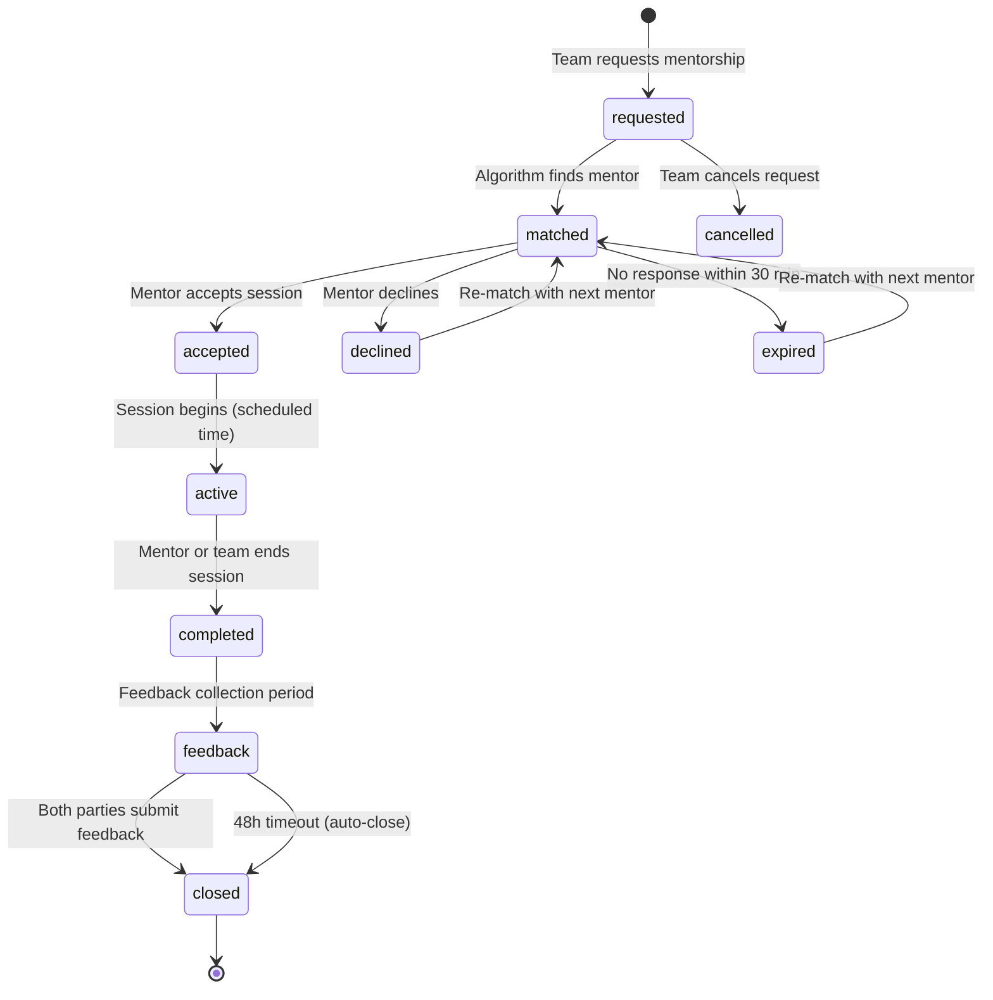
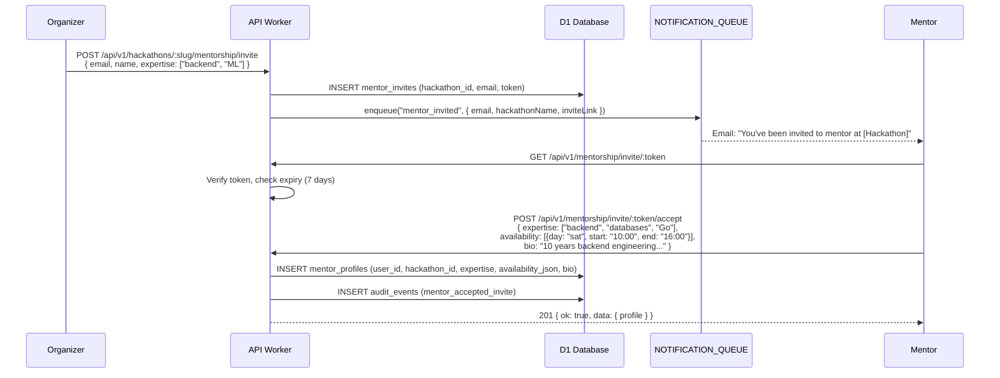
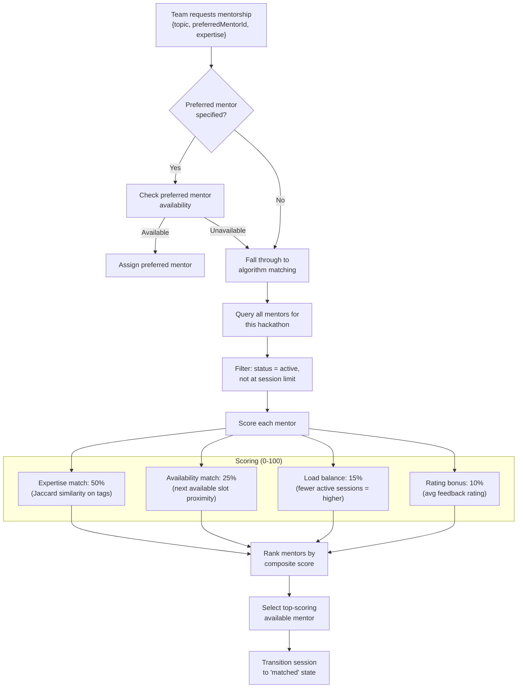
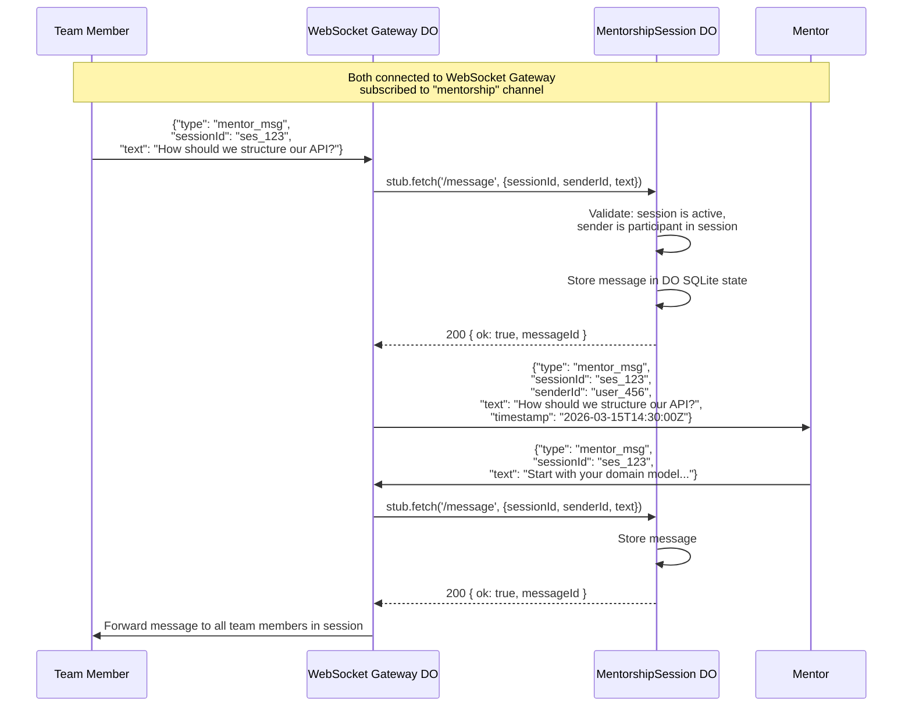
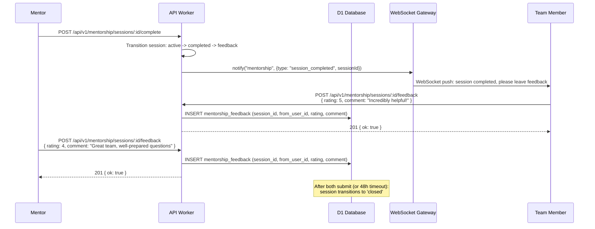
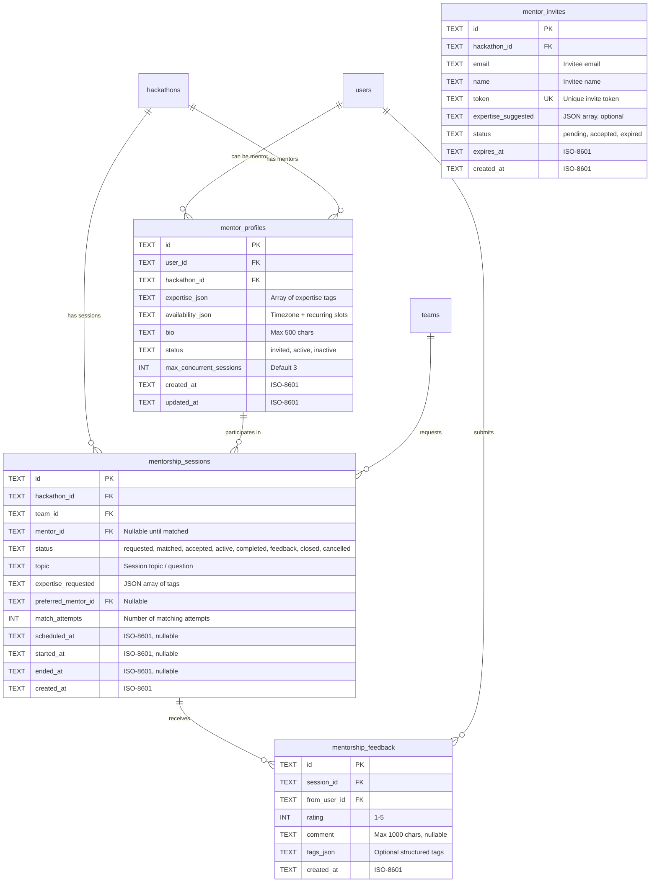
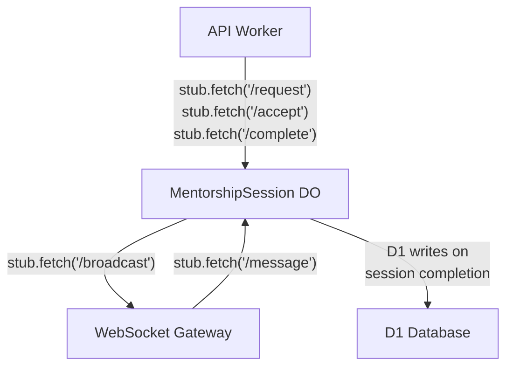

# 17 — Mentorship System

> Mentors are domain experts invited by organizers to guide teams during a hackathon. The mentorship system handles mentor profiles, availability scheduling, team-mentor matching, real-time session messaging via the WebSocket Gateway, and post-session feedback collection. A dedicated `MentorshipSession` Durable Object per hackathon manages all matching and session state.

**Related docs:** [System Overview](./00-overview.md) | [Team Management](./03-team-management.md) | [Data Model](./10-data-model.md) | [Frontend Architecture](./13-frontend.md) | [Real-time System](./14-real-time.md)

---

## Session Lifecycle



### State Transitions

| From | To | Trigger | Actor |
|------|----|---------|-------|
| `requested` | `matched` | Matching algorithm finds available mentor | System (MentorshipSession DO) |
| `requested` | `cancelled` | Team cancels before match | Team member |
| `matched` | `accepted` | Mentor accepts the session | Mentor |
| `matched` | `declined` | Mentor declines the session | Mentor |
| `matched` | `expired` | 30-minute acceptance timeout | System (DO alarm) |
| `declined` / `expired` | `matched` | Re-match with next-best mentor | System (MentorshipSession DO) |
| `accepted` | `active` | Scheduled session time arrives, or immediate start | System (DO alarm) or Mentor |
| `active` | `completed` | Mentor or team marks session complete | Mentor or team member |
| `completed` | `feedback` | Automatic transition after completion | System |
| `feedback` | `closed` | Both parties submit feedback, or 48h timeout | System |

---

## Mentor Invitation and Profile Setup

Organizers invite mentors to a hackathon. Mentors create a profile specifying their expertise and availability.



### Expertise Categories

Mentors select from a controlled vocabulary of expertise categories. The vocabulary is shared with the skill-based team matching system described in [Team Management](./03-team-management.md).

| Category | Example Tags |
|----------|-------------|
| Frontend | React, Vue, Angular, CSS, accessibility, responsive design |
| Backend | Node.js, Go, Python, Rust, API design, databases |
| Mobile | React Native, Flutter, Swift, Kotlin |
| Data / ML | Python, TensorFlow, PyTorch, data pipelines, NLP |
| DevOps | Docker, Kubernetes, CI/CD, cloud infrastructure |
| Design | UI/UX, Figma, prototyping, user research |
| Product | Product strategy, user stories, roadmapping |
| Security | Application security, cryptography, threat modeling |
| General | Project management, presentation skills, pitching |

### Availability Calendar

Mentors define their availability as recurring time slots within the hackathon's active phase. Availability is stored as a JSON array in `mentor_profiles.availability_json`.

```json
{
  "timezone": "America/New_York",
  "slots": [
    { "day": "saturday", "start": "10:00", "end": "16:00" },
    { "day": "sunday", "start": "12:00", "end": "18:00" }
  ],
  "exceptions": [
    { "date": "2026-03-15", "available": false, "reason": "unavailable" }
  ]
}
```

All times are converted to UTC for matching. The frontend displays times in the viewer's local timezone.

---

## Mentor-Team Matching Algorithm

The MentorshipSession Durable Object runs the matching algorithm when a team requests mentorship. The algorithm scores available mentors and selects the best match.



### Scoring Weights

| Factor | Weight | Calculation |
|--------|--------|-------------|
| **Expertise match** | 50% | Jaccard similarity between team's requested expertise tags and mentor's expertise tags. Exact match = 1.0, partial overlap = intersection/union |
| **Availability proximity** | 25% | Inverse of hours until mentor's next available slot. Immediately available = 1.0, 24h away = 0.0 |
| **Load balance** | 15% | `1 - (active_sessions / max_sessions)`. Mentors with fewer active sessions score higher. Default `max_sessions` = 3 |
| **Rating bonus** | 10% | `avg_rating / 5.0`. New mentors with no ratings default to 0.7 (neutral) |

### Re-matching

If a matched mentor declines or the acceptance window expires (30 minutes), the DO automatically re-runs the algorithm excluding the declined/expired mentor. A session can be re-matched up to 3 times before being marked as `unmatched` and surfaced to the organizer for manual intervention.

| Property | Value |
|----------|-------|
| Acceptance timeout | 30 minutes (DO alarm) |
| Max re-match attempts | 3 |
| Max concurrent sessions per mentor | 3 (configurable per hackathon) |
| Matching computation | Synchronous within DO (no background job needed for <100 mentors) |

---

## Session Messaging

Active mentorship sessions use the WebSocket Gateway for real-time messaging. The MentorshipSession DO manages session state; the WebSocket Gateway handles message delivery.



### Message Storage

| Property | Value |
|----------|-------|
| Storage location | MentorshipSession DO SQLite state |
| Retention in DO | Last 200 messages per session (older messages archived to D1) |
| Archive to D1 | On session completion, all messages written to `mentorship_messages` table |
| Max message length | 2000 characters |
| Message format | `{ id, sessionId, senderId, senderName, text, timestamp }` |
| Supported content | Plain text with optional markdown rendering on frontend |
| File sharing | Not supported in v3 (planned for future: R2-backed file attachments) |

### Reconnection

If a participant or mentor disconnects during an active session, the WebSocket Gateway handles reconnection. On reconnect, the client receives the last 50 messages from the DO's SQLite state to restore context.

---

## Feedback Collection

After a session is marked complete, both the mentor and team members are prompted to submit feedback. Feedback is collected for 48 hours before the session auto-closes.



### Feedback Schema

| Field | Type | Constraints |
|-------|------|-------------|
| `rating` | INTEGER | 1-5 stars |
| `comment` | TEXT | Max 1000 characters, optional |
| `from_user_id` | TEXT FK | Must be a participant in the session (mentor or team member) |
| `tags` | JSON | Optional structured tags: `["helpful", "knowledgeable", "patient"]` |

### Rating Aggregation

Mentor ratings are aggregated across all sessions and displayed on the mentor's profile. The aggregate is a weighted average that gives more weight to recent sessions.

| Metric | Calculation |
|--------|-------------|
| Average rating | Weighted average: sessions in last 30 days weighted 2x, older sessions weighted 1x |
| Total sessions | Count of sessions in `completed` or `closed` state |
| Response rate | Percentage of matched sessions that were accepted (not declined/expired) |

---

## Dashboard Views

### Mentor Dashboard

Mentors see their upcoming sessions, active sessions, past sessions, and feedback summary.

| Section | Content |
|---------|---------|
| **Upcoming** | Matched sessions awaiting acceptance, accepted sessions with scheduled times |
| **Active** | Currently active sessions with message interface |
| **History** | Past sessions with team name, topic, duration, feedback received |
| **Feedback Summary** | Average rating, total sessions, rating distribution chart, recent comments |
| **Availability** | Calendar editor for setting/updating availability slots |

### Team View

Teams browse available mentors, request sessions, and view their mentorship history.

| Section | Content |
|---------|---------|
| **Browse Mentors** | Searchable list of mentors with expertise tags, availability indicators, and ratings |
| **Request Session** | Form: select topic, preferred expertise, optional preferred mentor, describe question |
| **Active Sessions** | Current session with message interface |
| **History** | Past sessions with mentor name, topic, duration, feedback given |

### Organizer View

Organizers manage the mentor pool and monitor mentorship activity across the hackathon.

| Section | Content |
|---------|---------|
| **Invite Mentors** | Bulk invite form (email list), pending invitations, accepted mentors |
| **Mentor Pool** | All mentors with status, expertise, availability, session count |
| **Session Monitor** | All sessions with status, participants, duration |
| **Mentor Leaderboard** | Ranked by: sessions completed, average rating, response rate |
| **Unmatched Requests** | Sessions that failed auto-matching (>3 attempts), requiring manual assignment |

---

## API Routes

### Mentor Management

| Method | Route | Auth | Description |
|--------|-------|------|-------------|
| POST | `/api/v1/hackathons/:slug/mentorship/invite` | admin+ | Invite mentor by email |
| GET | `/api/v1/mentorship/invite/:token` | public | Validate invite token |
| POST | `/api/v1/mentorship/invite/:token/accept` | authenticated | Accept invite, create profile |
| GET | `/api/v1/hackathons/:slug/mentorship/mentors` | authenticated | List mentors for hackathon |
| GET | `/api/v1/hackathons/:slug/mentorship/mentors/:id` | authenticated | Get mentor profile |
| PUT | `/api/v1/hackathons/:slug/mentorship/mentors/:id` | mentor (self) | Update profile, expertise, availability |
| DELETE | `/api/v1/hackathons/:slug/mentorship/mentors/:id` | admin+ or mentor (self) | Remove mentor from hackathon |

### Session Management

| Method | Route | Auth | Description |
|--------|-------|------|-------------|
| POST | `/api/v1/hackathons/:slug/mentorship/request` | participant+ | Request mentorship session |
| GET | `/api/v1/hackathons/:slug/mentorship/sessions` | authenticated | List sessions (filtered by role) |
| GET | `/api/v1/mentorship/sessions/:id` | session participant | Get session details |
| POST | `/api/v1/mentorship/sessions/:id/accept` | mentor | Accept matched session |
| POST | `/api/v1/mentorship/sessions/:id/decline` | mentor | Decline matched session |
| POST | `/api/v1/mentorship/sessions/:id/cancel` | session participant | Cancel session (before active) |
| POST | `/api/v1/mentorship/sessions/:id/start` | mentor | Start session immediately |
| POST | `/api/v1/mentorship/sessions/:id/complete` | mentor or team member | Mark session complete |
| GET | `/api/v1/mentorship/sessions/:id/messages` | session participant | Get message history (REST fallback) |

### Feedback

| Method | Route | Auth | Description |
|--------|-------|------|-------------|
| POST | `/api/v1/mentorship/sessions/:id/feedback` | session participant | Submit feedback |
| GET | `/api/v1/mentorship/sessions/:id/feedback` | session participant | View feedback for session |
| GET | `/api/v1/hackathons/:slug/mentorship/mentors/:id/ratings` | authenticated | Get mentor's aggregate ratings |

### Organizer Routes

| Method | Route | Auth | Description |
|--------|-------|------|-------------|
| GET | `/api/v1/hackathons/:slug/mentorship/stats` | admin+ | Mentorship statistics |
| GET | `/api/v1/hackathons/:slug/mentorship/leaderboard` | admin+ | Mentor leaderboard |
| GET | `/api/v1/hackathons/:slug/mentorship/unmatched` | admin+ | Unmatched session requests |
| POST | `/api/v1/hackathons/:slug/mentorship/assign` | admin+ | Manually assign mentor to session |

---

## Data Model



### Constraints

| Constraint | Columns | Purpose |
|------------|---------|---------|
| `UNIQUE(user_id, hackathon_id)` | mentor_profiles | One profile per mentor per hackathon |
| `UNIQUE(token)` | mentor_invites | Global invite token uniqueness |
| `UNIQUE(session_id, from_user_id)` | mentorship_feedback | One feedback per user per session |
| `CHECK(rating BETWEEN 1 AND 5)` | mentorship_feedback | Valid rating range |
| `CHECK(status IN ('requested','matched','accepted','active','completed','feedback','closed','cancelled'))` | mentorship_sessions | Valid session states |
| `CHECK(match_attempts <= 3)` | mentorship_sessions | Max re-match limit |

---

## MentorshipSession Durable Object

The MentorshipSession DO is a SQLite-backed Durable Object, one instance per hackathon. It manages all mentor matching and session state for that hackathon.

### Responsibilities

| Responsibility | Implementation |
|----------------|----------------|
| Matching algorithm | Runs synchronously on session request; scores all active mentors |
| Session state machine | Enforces valid state transitions (see lifecycle diagram) |
| Acceptance timeout | DO alarm fires after 30 minutes; triggers re-match or escalation |
| Message relay | Validates and stores messages; forwards to WebSocket Gateway for delivery |
| Message archival | On session completion, writes all messages to D1 `mentorship_messages` table |
| Session scheduling | DO alarm fires at scheduled session time to transition `accepted` -> `active` |

### DO SQLite Schema

The DO maintains its own SQLite tables for hot-path data:

| Table | Purpose | Rows (est.) |
|-------|---------|-------------|
| `sessions` | Active and recent session state | <100 per hackathon |
| `messages` | Messages for active sessions (last 200 per session) | <2000 per hackathon |
| `mentor_state` | Cached mentor availability and active session count | <50 per hackathon |

### Scaling

| Property | Value |
|----------|-------|
| Instances | 1 per hackathon |
| Concurrent sessions | Up to 50 per hackathon (configurable) |
| Mentors per hackathon | Up to 100 |
| Message throughput | ~10 messages/second per session (WebSocket Gateway handles delivery) |
| State persistence | SQLite-backed (survives DO eviction) |
| Alarm usage | Acceptance timeouts (30 min), session scheduling, feedback window (48h) |

### Communication Pattern



The API Worker mediates all external requests to the DO. The WebSocket Gateway forwards incoming mentor messages to the DO for validation and storage, then the DO broadcasts responses back through the Gateway. On session completion, the DO writes archived messages and final session state to D1 for long-term storage.

---

## Integration with WebSocket Gateway

Mentorship messaging reuses the WebSocket Gateway infrastructure defined in [Real-time System](./14-real-time.md). The `mentorship` channel is one of the standard channels per hackathon.

| Event | Direction | Payload |
|-------|-----------|---------|
| `session_requested` | Server -> Mentor | `{ sessionId, teamName, topic, expertise }` |
| `session_matched` | Server -> Team | `{ sessionId, mentorName, mentorExpertise }` |
| `session_accepted` | Server -> Team | `{ sessionId, mentorName, scheduledAt }` |
| `session_declined` | Server -> Team | `{ sessionId, rematching: true/false }` |
| `session_started` | Server -> Both | `{ sessionId }` |
| `session_completed` | Server -> Both | `{ sessionId, feedbackUrl }` |
| `mentor_msg` | Bidirectional | `{ sessionId, senderId, senderName, text, timestamp }` |
| `mentor_typing` | Bidirectional | `{ sessionId, userId, isTyping }` |

Clients subscribe to the `mentorship` channel on WebSocket connection. The Gateway filters events by session participation — a mentor only receives events for their own sessions, and team members only receive events for their team's sessions.

---

## Validation Rules

| Rule | Enforcement |
|------|-------------|
| Mentorship requests only during `active` phase | Checked in route handler via hackathon state |
| Team must be registered for hackathon | Checked via DB query |
| Mentor must have `active` profile for hackathon | Checked in MentorshipSession DO |
| Session topic 5-500 characters | Zod schema validation |
| Feedback rating 1-5 | Zod schema + DB CHECK constraint |
| Feedback comment max 1000 characters | Zod schema validation |
| One feedback per user per session | DB UNIQUE constraint |
| Mentor bio max 500 characters | Zod schema validation |
| Availability slots must be within hackathon date range | Validated in route handler |
| Max 3 re-match attempts per session | Enforced in MentorshipSession DO |
| Max concurrent sessions per mentor (default 3) | Checked during matching algorithm |
| Invite token expires after 7 days | Checked in route handler |

---

## File References

| File | Purpose |
|------|---------|
| `apps/api/src/durable-objects/mentorship-session.ts` | MentorshipSession Durable Object (v3 new) |
| `apps/api/src/routes/mentorship.ts` | Mentorship CRUD, session management, feedback routes |
| `apps/api/src/routes/mentor-invites.ts` | Mentor invitation and acceptance routes |
| `apps/api/src/lib/mentor-matching.ts` | Matching algorithm (scoring, ranking, re-match logic) |
| `packages/shared/src/schemas/mentorship.ts` | `MentorProfileSchema`, `MentorshipSessionSchema`, `RequestSessionSchema` |
| `packages/shared/src/schemas/mentorship-feedback.ts` | `MentorshipFeedbackSchema`, `SubmitFeedbackRequestSchema` |
| `packages/db/src/schema/mentor-profiles.ts` | Mentor profiles table definition |
| `packages/db/src/schema/mentorship-sessions.ts` | Mentorship sessions table definition |
| `packages/db/src/schema/mentorship-feedback.ts` | Mentorship feedback table definition |
| `packages/db/src/schema/mentor-invites.ts` | Mentor invites table definition |
| `apps/web/src/pages/mentorship.tsx` | Team mentorship view (browse mentors, request sessions) |
| `apps/web/src/pages/mentor-dashboard.tsx` | Mentor dashboard (sessions, feedback, availability) |
| `apps/web/src/components/mentor-chat.tsx` | Real-time session messaging component |
| `apps/web/src/components/availability-calendar.tsx` | Availability slot editor component |
