# 18 — Multi-org Federation

> Organizations register with DevSage, verify domain ownership via DNS TXT records, and establish trust relationships that enable cross-org hackathon discovery, participant registration, profile sharing, and federated leaderboards. Federation is opt-in at both the organization and hackathon level.

**Related docs:** [System Overview](./00-overview.md) | [Authentication](./01-authentication.md) | [Roles & Permissions](./06-roles-permissions.md) | [Data Model](./10-data-model.md) | [Infrastructure](./12-infrastructure.md)

---

## Federation Topology

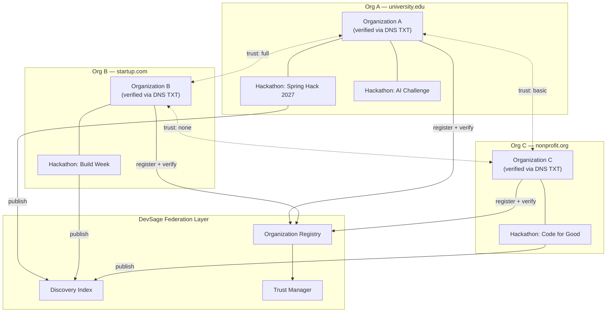

Federation is a hub-and-spoke model where DevSage acts as the registry and discovery layer. Organizations maintain full sovereignty over their data. Trust relationships are bilateral — Org A trusting Org B does not imply Org B trusts Org A.

---

## Trust Levels

Trust between organizations is established incrementally. Each level unlocks additional capabilities.

| Level | Name | Capabilities | Requirements |
|-------|------|-------------|--------------|
| 0 | `none` | Public listing in discovery index only. No data exchange | DNS TXT verification complete |
| 1 | `basic` | Cross-org registration: participants from one org can register for the other's hackathons | Bilateral trust request accepted by both org owners |
| 2 | `full` | Basic + shared judging pools, merged leaderboards, profile sharing with user consent | 30-day `basic` history, no trust violations, bilateral upgrade |

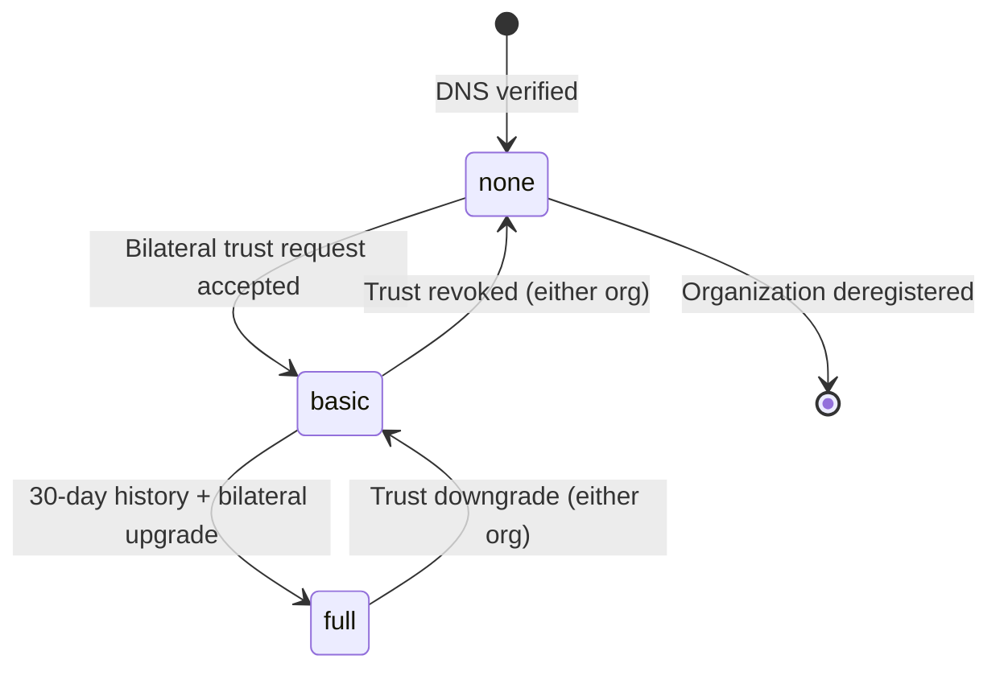

**Trust is always bilateral.** Org A requesting `basic` trust with Org B creates a pending request. Only when Org B accepts does the trust level activate for both sides. Either organization can unilaterally downgrade or revoke trust at any time.

---

## DNS TXT Verification

Organization ownership is verified using DNS TXT records, following the same decentralized pattern as DKIM and SPF. No central authority is required beyond DNS itself.

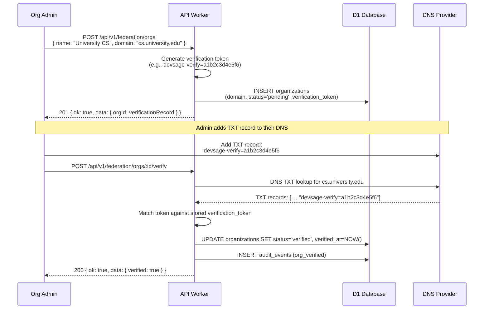

### Verification Rules

| Rule | Detail |
|------|--------|
| Token format | `devsage-verify=<32-char hex>` |
| DNS record location | TXT record on the organization's domain (e.g., `cs.university.edu`) |
| Lookup method | `dns.resolve()` via Cloudflare Workers DNS API |
| Retry window | Admin can retry verification at any time; token does not expire |
| Re-verification | Cron job checks DNS TXT records monthly; revokes if record removed |
| Subdomain support | Organizations can verify subdomains (e.g., `hack.company.com`) |

**Why DNS TXT:** DNS verification is the industry standard for domain ownership proof. It requires no OAuth handshake between organizations, no shared secrets, and no central certificate authority. The organization proves ownership by demonstrating write access to their DNS zone — the same mechanism used by Google Workspace, AWS SES, and email authentication protocols.

---

## Organization Registry

Every organization in the federation is represented by a registry entry. The registry stores identity, verification status, trust relationships, and configuration.

### Registration Flow

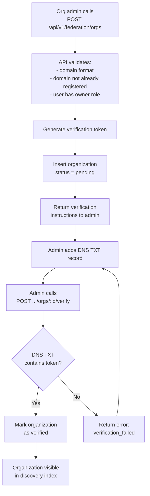

### Organization Configuration

| Setting | Type | Default | Description |
|---------|------|---------|-------------|
| `allow_cross_registration` | boolean | `true` | Whether external participants can register for this org's hackathons |
| `require_profile_consent` | boolean | `true` | Whether profile sharing requires explicit user consent |
| `auto_accept_trust` | boolean | `false` | Automatically accept incoming trust requests (not recommended) |
| `discovery_visibility` | enum | `public` | `public` (all verified orgs see listings) or `trusted_only` (only trusted orgs) |
| `namespace_prefix` | string | domain slug | Prefix for namespaced resources (e.g., `university-cs`) |

---

## Discovery Index

Verified organizations publish their hackathons to a federated discovery endpoint. The discovery index is a read-only aggregation of hackathons across all participating organizations.

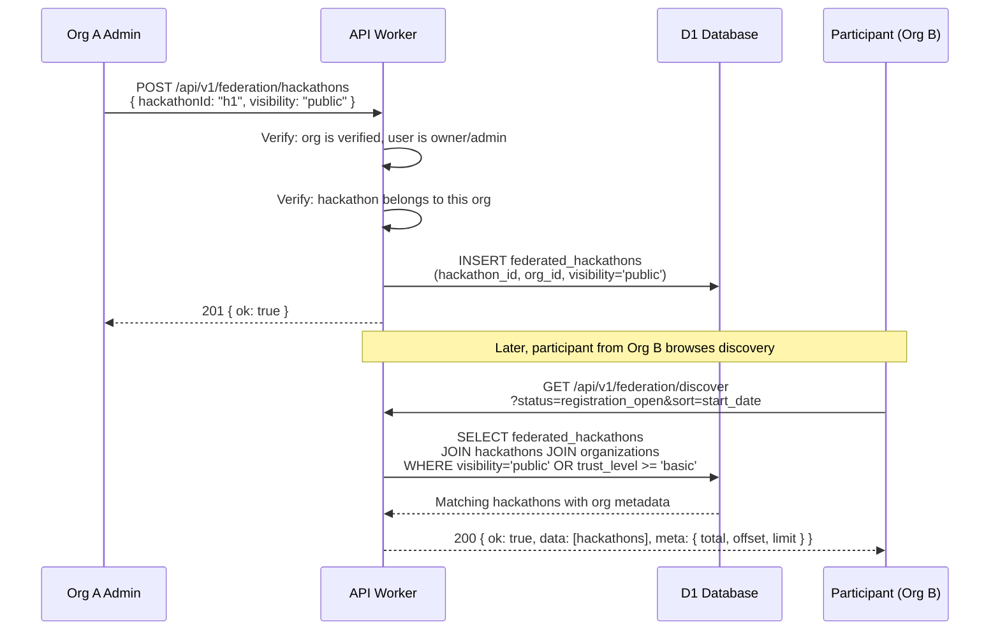

Discovery listings expose: hackathon name, organization name and domain, status, dates, team count/capacity, tracks, registration URL, and the trust level between the viewer's org and the hosting org.

### Visibility Rules

| Viewer's Trust Level | Sees |
|---------------------|------|
| `none` | Hackathons with `visibility = 'public'` only |
| `basic` | Public hackathons + hackathons with `visibility = 'federated'` |
| `full` | All published hackathons including `visibility = 'trusted'` |

---

## Cross-org Registration

When trust level is `basic` or higher, participants from one organization can register for another organization's hackathons. The registration flow adds a federation context to the standard registration process.

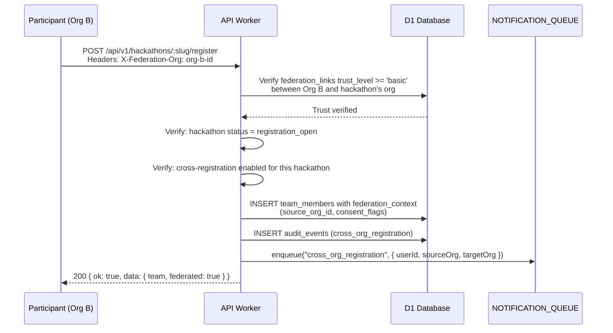

### Cross-registration Constraints

| Constraint | Enforcement |
|------------|-------------|
| Trust level must be `basic` or `full` | Checked against `federation_links` table |
| Hackathon must opt in to cross-registration | `federated_hackathons.allow_cross_registration` flag |
| Participant must have an account on DevSage | Standard authentication required |
| Participant must consent to profile sharing | Consent prompt on first cross-org registration |
| Team size limits still apply | Standard `max_team_size` enforcement |
| Rate limiting per org | Max 100 cross-registrations per org per hackathon |

---

## Profile Sharing

When participants register across organizational boundaries, their profile data can be shared with the hosting organization. Profile sharing is always governed by explicit user consent.

### Consent Model

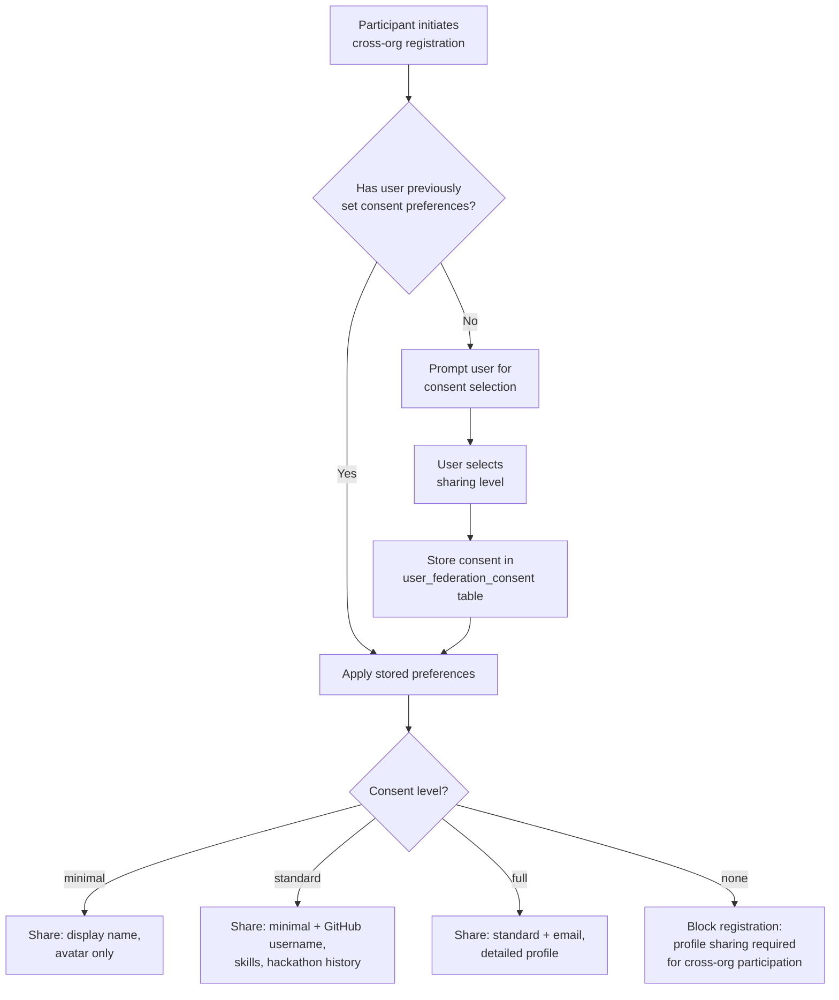

### Consent Levels

| Level | Shared Fields | Use Case |
|-------|--------------|----------|
| `none` | Nothing (registration blocked) | User declines all sharing |
| `minimal` | Display name, avatar | Anonymous participation |
| `standard` | Minimal + GitHub username, skills, past hackathon count | Typical cross-org participant |
| `full` | Standard + email, detailed profile, submission history | Full collaboration with hosting org |

**Consent is revocable.** Users can change their consent level at any time via their profile settings. Revoking consent does not retroactively remove data already shared, but stops future sharing and flags the profile for the hosting org.

---

## Federated Leaderboards

At `full` trust level, organizations can merge leaderboards across hackathons to create aggregate rankings. This enables cross-organizational competitions and seasonal rankings.

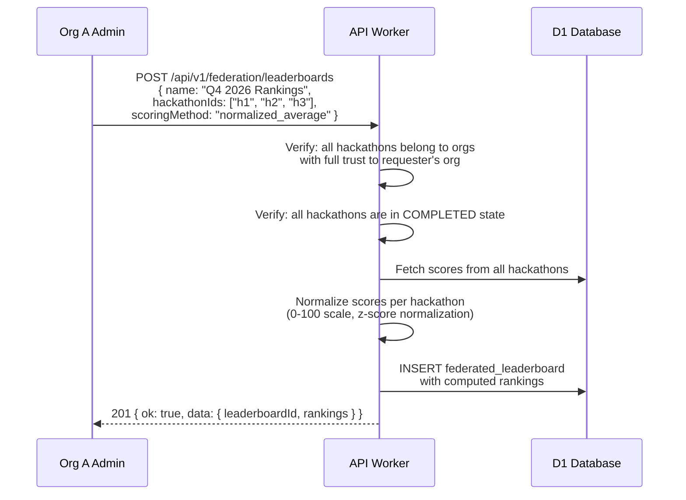

### Scoring Methods

| Method | Description | Best For |
|--------|-------------|----------|
| `normalized_average` | Z-score normalize per hackathon, then average | Different rubrics across hackathons |
| `weighted_sum` | Sum scores with per-hackathon weights | Organizer-defined importance |
| `best_of_n` | Take each team's best score across N hackathons | Seasonal competitions |
| `percentile_rank` | Convert to percentile within each hackathon, then average | Varying participant counts |

### Constraints

- Only hackathons in `COMPLETED` state can be included
- All participating hackathons must belong to organizations with `full` bilateral trust
- Teams appearing in multiple hackathons are matched by team profile ID (see [Team Management](./03-team-management.md), cross-hackathon profiles)
- Leaderboard data is read-only after creation; recalculation creates a new version

---

## Organization Namespaces

Each organization operates within a namespace that provides data isolation and prevents resource collisions across the federation.

| Resource | Namespace Format | Example |
|----------|-----------------|---------|
| Hackathon slugs | `{org-namespace}/{hackathon-slug}` | `university-cs/spring-hack-2027` |
| Team names | Scoped to hackathon (unchanged) | `Team Alpha` within `spring-hack-2027` |
| API keys | Prefixed with org namespace | `university-cs_key_abc123` |
| Webhook endpoints | Org-scoped paths | `/api/v1/federation/orgs/university-cs/webhooks` |
| Export files | R2 path includes org namespace | `exports/university-cs/spring-hack-2027/results.csv` |

### Data Isolation

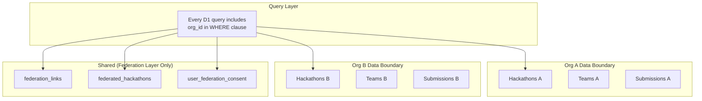

**Isolation guarantees:**
- All hackathon-scoped queries include `org_id` as a mandatory filter
- Cross-org data access is mediated exclusively through federation API routes
- Direct D1 queries never cross organizational boundaries
- Audit events record the source organization for all cross-org operations

---

## Data Model

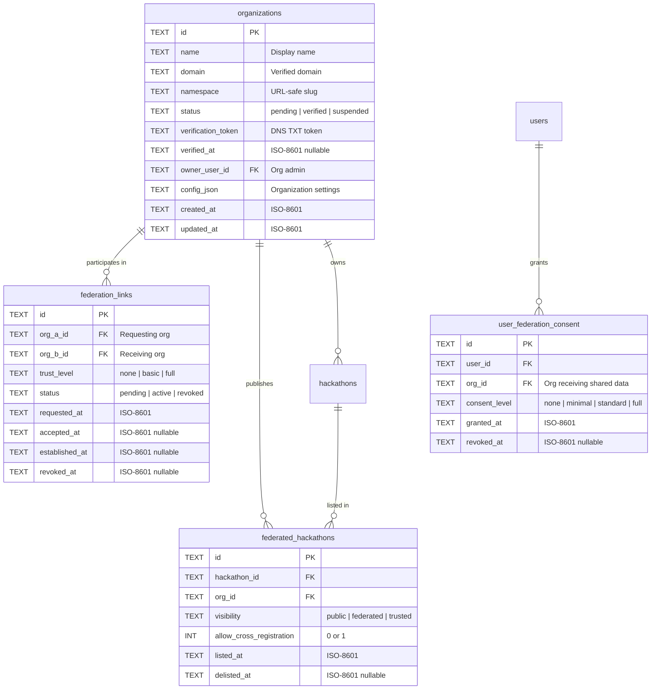

### Table Constraints

| Constraint | Table | Columns | Purpose |
|------------|-------|---------|---------|
| `UNIQUE(domain)` | `organizations` | `domain` | One org per domain |
| `UNIQUE(namespace)` | `organizations` | `namespace` | Unique URL slugs |
| `UNIQUE(org_a_id, org_b_id)` | `federation_links` | `org_a_id`, `org_b_id` | One link per org pair |
| `UNIQUE(hackathon_id, org_id)` | `federated_hackathons` | `hackathon_id`, `org_id` | One listing per hackathon per org |
| `UNIQUE(user_id, org_id)` | `user_federation_consent` | `user_id`, `org_id` | One consent record per user per org |

---

## API Routes

All federation routes live under `/api/v1/federation/*`.

| Method | Route | Auth | Description |
|--------|-------|------|-------------|
| POST | `/api/v1/federation/orgs` | owner | Register a new organization |
| GET | `/api/v1/federation/orgs` | authenticated | List all verified organizations |
| GET | `/api/v1/federation/orgs/:id` | authenticated | Get organization details |
| PUT | `/api/v1/federation/orgs/:id` | owner | Update organization settings |
| POST | `/api/v1/federation/orgs/:id/verify` | owner | Trigger DNS TXT verification |
| DELETE | `/api/v1/federation/orgs/:id` | owner | Deregister organization |
| POST | `/api/v1/federation/trust` | owner | Request trust with another org |
| PUT | `/api/v1/federation/trust/:id` | owner | Accept/reject trust request |
| DELETE | `/api/v1/federation/trust/:id` | owner | Revoke trust relationship |
| POST | `/api/v1/federation/hackathons` | admin+ | Publish hackathon to discovery index |
| DELETE | `/api/v1/federation/hackathons/:id` | admin+ | Delist hackathon from discovery |
| GET | `/api/v1/federation/discover` | authenticated | Browse federated hackathon listings |
| GET | `/api/v1/federation/leaderboards` | authenticated | List federated leaderboards |
| POST | `/api/v1/federation/leaderboards` | admin+ | Create federated leaderboard |
| GET | `/api/v1/federation/leaderboards/:id` | authenticated | Get leaderboard rankings |

---

## Federation Protocol

The complete federation lifecycle follows five sequential steps. Each step must complete before the next is available.

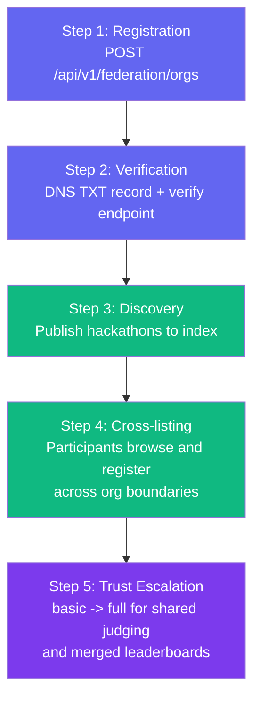

| Step | Prerequisite | Outcome |
|------|-------------|---------|
| 1. Registration | User has `owner` role in at least one hackathon | Organization record created with `pending` status |
| 2. Verification | DNS TXT record added to organization's domain | Organization status changes to `verified`; appears in registry |
| 3. Discovery | Organization is verified | Hackathons can be published to the federated discovery index |
| 4. Cross-listing | Bilateral `basic` trust established | Participants from trusted orgs can register for published hackathons |
| 5. Trust escalation | 30 days at `basic` trust, no violations | Enables shared judging pools and merged leaderboards |

---

## Security Considerations

### Trust Verification

| Threat | Mitigation |
|--------|------------|
| Domain spoofing | DNS TXT verification proves domain ownership; monthly re-verification via cron |
| Trust escalation abuse | 30-day cooling period at `basic` before `full` trust is available |
| Unilateral trust claims | All trust changes require bilateral acceptance (both org owners must agree) |
| Stale trust relationships | Cron job checks DNS records monthly; suspended orgs have trust frozen |

### Data Boundary Enforcement

| Threat | Mitigation |
|--------|------------|
| Cross-org data leakage | All queries include `org_id` filter; federation routes are the only cross-org data path |
| Unauthorized profile access | Profile sharing requires explicit user consent; consent is revocable |
| Bulk data extraction | Rate limiting: max 100 discovery results per request, max 100 cross-registrations per org per hackathon |
| Audit trail gaps | All cross-org operations produce audit events with `source_org_id` and `target_org_id` |

### Consent Management

| Principle | Implementation |
|-----------|---------------|
| Informed consent | Consent prompt explains exactly what data is shared at each level |
| Granular control | Four consent levels (none, minimal, standard, full) per organization |
| Revocability | Users can revoke consent at any time via profile settings |
| Transparency | Users can view all organizations they have shared data with |
| Data minimization | Only the fields specified by the consent level are shared |

---

## Migration Plan

**Phase:** 4 (Q4 2026)
**Strategy:** Additive, non-breaking
**Opt-in:** Per organization and per hackathon

### Migration Sequence

| Step | Action | Risk |
|------|--------|------|
| 1 | Run Drizzle migrations to create 4 new tables | None — additive only |
| 2 | Deploy federation API routes (behind feature flag) | None — new routes, no existing route changes |
| 3 | Add `org_id` nullable column to `hackathons` table | Low — nullable, existing hackathons default to null (single-org mode) |
| 4 | Enable feature flag for early-adopter organizations | None — opt-in |
| 5 | Backfill `org_id` for existing hackathons (optional) | Low — data migration script, reversible |

### Breaking Changes

None. Federation is entirely additive. Existing single-org hackathons continue to function without any organization registration. The `org_id` column on `hackathons` is nullable — `NULL` means "not part of any federation."

---

## File References

| File | Purpose |
|------|---------|
| `apps/api/src/routes/federation.ts` | Federation API routes (planned) |
| `packages/db/src/schema/organizations.ts` | Organizations table definition (planned) |
| `packages/db/src/schema/federation-links.ts` | Federation links table definition (planned) |
| `packages/db/src/schema/federated-hackathons.ts` | Federated hackathons table definition (planned) |
| `packages/shared/src/schemas/federation.ts` | Zod schemas for federation requests/responses (planned) |
| `apps/api/src/lib/dns-verify.ts` | DNS TXT verification utility (planned) |
| `apps/api/src/middleware/federation.ts` | Federation trust verification middleware (planned) |
| `apps/web/src/pages/federation-discover.tsx` | Federated hackathon discovery UI (planned) |
| `apps/web/src/pages/org-settings.tsx` | Organization management UI (planned) |
