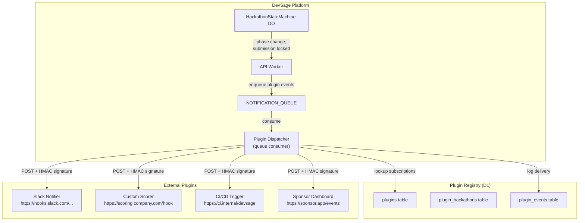
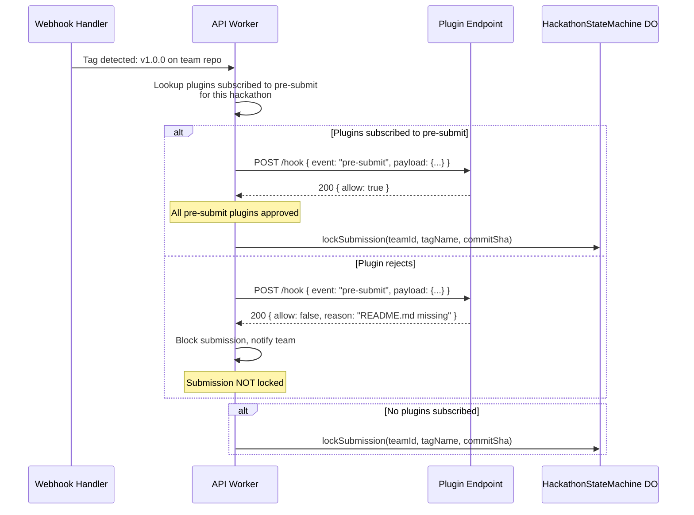
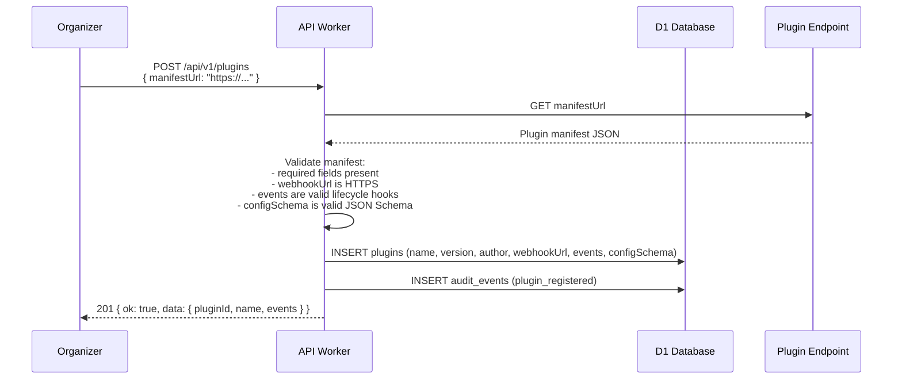
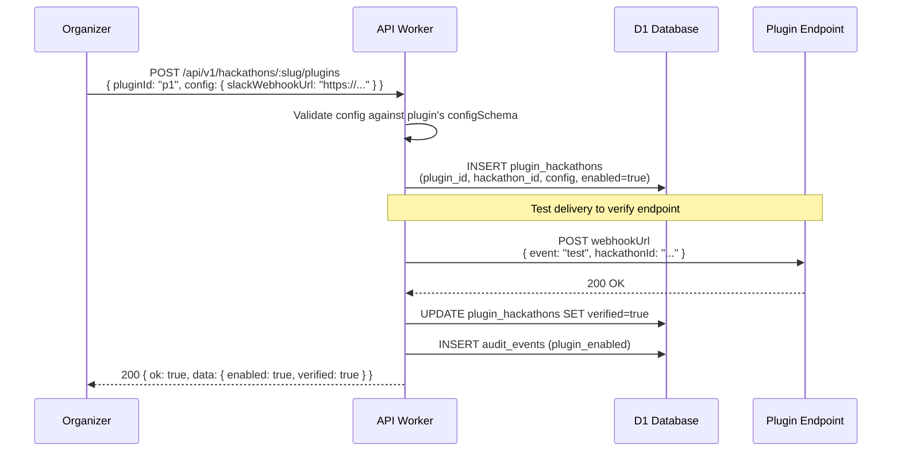
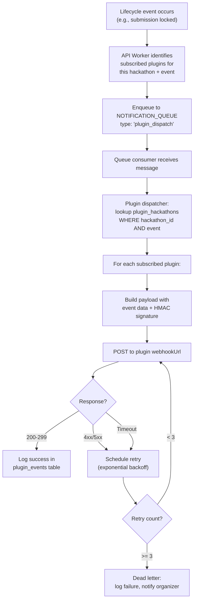
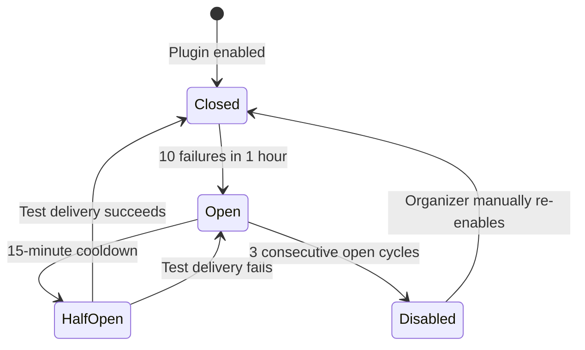
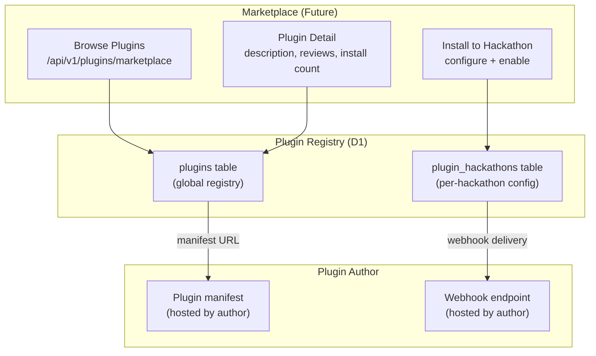
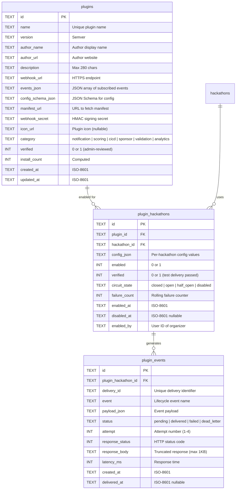
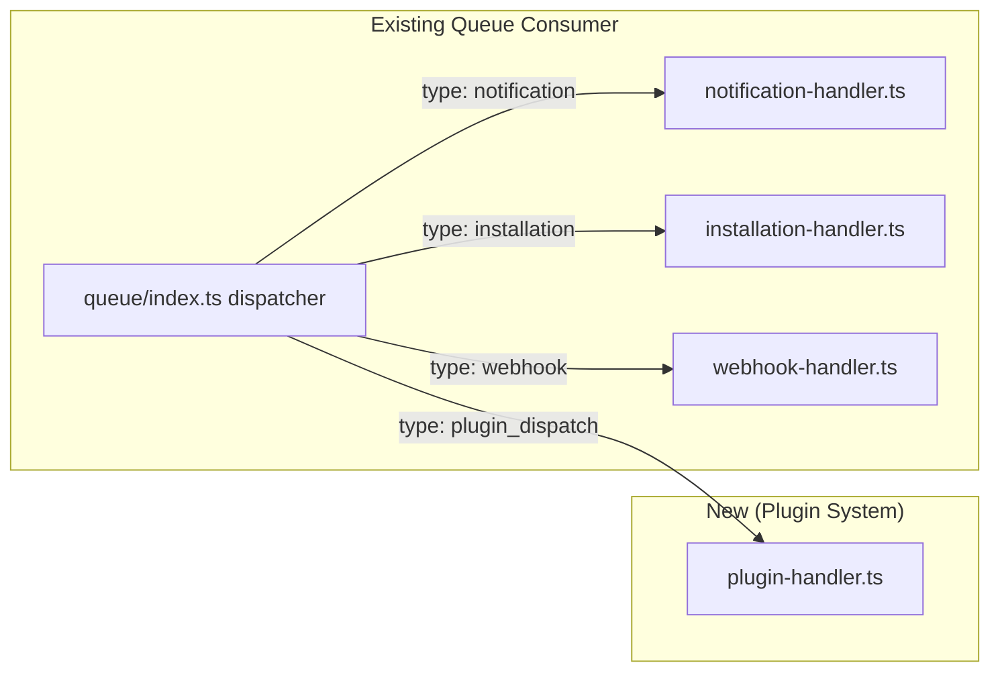

# 19 — Plugin Extensibility

> Organizers extend hackathon behavior by registering external HTTP endpoints that receive lifecycle events via webhook dispatch. Plugins subscribe to events like pre-submit, post-judge, and on-phase-change. Event delivery reuses the existing NOTIFICATION_QUEUE infrastructure — no new runtime dependency, no in-process code execution.

**Related docs:** [System Overview](./00-overview.md) | [Webhooks & Integrations](./07-webhooks-integrations.md) | [Notifications](./08-notifications.md) | [API Design](./11-api-design.md) | [Infrastructure](./12-infrastructure.md)

---

## Plugin Architecture



**Key design decision:** Plugins are external HTTP endpoints, not in-process code. This eliminates the security risks of executing third-party code inside the Workers runtime. Event delivery reuses the existing `NOTIFICATION_QUEUE` consumer pattern — the plugin dispatcher is an additional handler in the queue consumer, alongside the existing notification handler.

---

## Lifecycle Hooks

Plugins subscribe to lifecycle events that fire at specific points in the hackathon workflow. Each event carries a typed payload with all relevant context.

| Event | Trigger | Payload Includes | Timing |
|-------|---------|-----------------|--------|
| `on-registration` | Participant registers for hackathon | `userId`, `teamId`, `hackathonId`, `timestamp` | After registration committed to D1 |
| `on-team-created` | New team created | `teamId`, `teamName`, `leaderId`, `hackathonId` | After team insert committed |
| `pre-submit` | Submission tag detected, before locking | `teamId`, `tagName`, `commitSha`, `hackathonId` | Before DO locks submission |
| `post-submit` | Submission locked by DO | `submissionId`, `teamId`, `tagName`, `commitSha`, `lockedAt` | After exactly-once lock acquired |
| `on-phase-change` | Hackathon transitions to new phase | `hackathonId`, `previousPhase`, `newPhase`, `triggeredBy` | After state machine transition |
| `post-judge` | Judge submits a score | `scoreId`, `judgeId`, `submissionId`, `scores`, `hackathonId` | After score committed to D1 |
| `on-judging-complete` | All submissions scored, leaderboard finalized | `hackathonId`, `leaderboard`, `totalSubmissions` | After final score committed |
| `on-announcement` | Organizer posts announcement | `hackathonId`, `announcementId`, `content` | After announcement created |

### Pre-submit Hook Behavior

The `pre-submit` hook is special: it fires **before** the Durable Object locks the submission. If a plugin returns a rejection response, the submission is blocked. This enables custom validation rules (e.g., "submission must include a README," "repo must have CI passing").



**Pre-submit constraints:**
- Plugin must respond within 5 seconds (shorter than the standard 10-second timeout)
- If the plugin times out or returns a non-200 status, the submission proceeds (fail-open)
- Only one pre-submit plugin per hackathon (to avoid conflicting validation)
- Pre-submit plugins are clearly marked in the UI as "blocking" plugins

---

## Plugin Manifest

Plugins are described by a JSON manifest that defines their identity, capabilities, and configuration schema. Organizers provide the manifest URL when registering a plugin.

```json
{
  "name": "slack-notifier",
  "version": "1.2.0",
  "author": {
    "name": "DevSage Community",
    "url": "https://github.com/devsage-plugins/slack-notifier"
  },
  "description": "Posts hackathon events to a Slack channel",
  "webhookUrl": "https://plugins.example.com/slack-notifier/webhook",
  "events": [
    "on-phase-change",
    "post-submit",
    "on-judging-complete",
    "on-announcement"
  ],
  "configSchema": {
    "type": "object",
    "properties": {
      "slackWebhookUrl": {
        "type": "string",
        "description": "Slack incoming webhook URL"
      },
      "channel": {
        "type": "string",
        "description": "Slack channel name",
        "default": "#hackathon"
      },
      "notifyOnPhaseChange": {
        "type": "boolean",
        "default": true
      }
    },
    "required": ["slackWebhookUrl"]
  }
}
```

### Manifest Fields

| Field | Type | Required | Description |
|-------|------|----------|-------------|
| `name` | string | Yes | Unique plugin identifier (lowercase, hyphens, 3-50 chars) |
| `version` | string | Yes | Semver version string |
| `author` | object | Yes | `{ name, url }` — plugin author identity |
| `description` | string | Yes | Human-readable description (max 280 chars) |
| `webhookUrl` | string | Yes | HTTPS endpoint that receives event payloads |
| `events` | string[] | Yes | List of lifecycle events this plugin subscribes to |
| `configSchema` | object | No | JSON Schema for per-hackathon configuration |
| `iconUrl` | string | No | URL to plugin icon (displayed in marketplace) |
| `documentationUrl` | string | No | Link to plugin documentation |

---

## Plugin Registration and Configuration

### Registration Flow



### Per-Hackathon Configuration

After a plugin is registered globally, organizers enable it for specific hackathons and provide configuration values.



---

## Event Dispatch

Event dispatch reuses the existing `NOTIFICATION_QUEUE` infrastructure. When a lifecycle event occurs, the API Worker enqueues a plugin event message. The queue consumer's plugin dispatcher looks up subscribed plugins and delivers the payload via HTTP POST.



### Webhook Payload Format

Every plugin webhook delivery includes a standard envelope:

```json
{
  "event": "post-submit",
  "deliveryId": "del_abc123",
  "timestamp": "2026-12-15T14:30:00.000Z",
  "hackathon": {
    "id": "hack_xyz",
    "slug": "spring-hack-2027",
    "name": "Spring Hack 2027"
  },
  "payload": {
    "submissionId": "sub_456",
    "teamId": "team_789",
    "tagName": "v1.0.0",
    "commitSha": "abc123def456",
    "lockedAt": "2026-12-15T14:29:58.000Z"
  }
}
```

### HMAC Signature

Every webhook delivery is signed with an HMAC-SHA256 signature using a per-plugin secret. The signature is included in the `X-DevSage-Signature` header.

```
X-DevSage-Signature: sha256=<hex-encoded HMAC of request body>
X-DevSage-Delivery-Id: del_abc123
X-DevSage-Event: post-submit
```

Plugin endpoints verify the signature to ensure the payload originated from DevSage and was not tampered with. This follows the same pattern as GitHub webhook signatures.

---

## Plugin Types

Plugins fall into several categories based on their primary function. The platform does not enforce categories — any plugin can subscribe to any event — but these categories guide the marketplace organization.

| Category | Examples | Typical Events |
|----------|----------|---------------|
| **Notification channels** | Slack, Discord, Microsoft Teams, SMS | `on-phase-change`, `post-submit`, `on-announcement` |
| **Custom scoring** | Automated code quality scoring, test coverage checks | `post-submit`, `post-judge` |
| **CI/CD integration** | GitHub Actions trigger, Jenkins build, deployment verification | `post-submit`, `pre-submit` |
| **Sponsor dashboards** | Real-time sponsor engagement metrics, lead capture | `on-registration`, `post-submit`, `on-judging-complete` |
| **Custom validation** | README checker, license validator, dependency auditor | `pre-submit` (blocking) |
| **Analytics** | External analytics platforms, custom reporting | All events |
| **Communication** | Auto-welcome messages, milestone notifications | `on-registration`, `on-team-created`, `on-phase-change` |

---

## Retry and Failure Handling

Plugin webhook delivery follows a retry policy with exponential backoff. After exhausting retries, failed deliveries are dead-lettered and the organizer is notified.

| Attempt | Delay | Total Elapsed |
|---------|-------|---------------|
| 1 (initial) | Immediate | 0s |
| 2 (retry 1) | 30 seconds | 30s |
| 3 (retry 2) | 2 minutes | 2m 30s |
| 4 (retry 3) | 10 minutes | 12m 30s |
| Dead letter | N/A | Organizer notified |

### Failure Scenarios

| Scenario | Behavior |
|----------|----------|
| Plugin returns 4xx | Retry (plugin may have transient auth issue) |
| Plugin returns 5xx | Retry with backoff |
| Connection timeout (10s) | Retry with backoff |
| DNS resolution failure | Retry with backoff |
| Plugin returns 410 Gone | Do not retry; auto-disable plugin for this hackathon |
| 3 consecutive failures across different events | Auto-disable plugin; notify organizer |
| Dead letter | Log in `plugin_events` with `status = 'dead_letter'`; send notification to organizer |

### Circuit Breaker

If a plugin accumulates 10 failed deliveries within a 1-hour window, the dispatcher activates a circuit breaker:



---

## Plugin Marketplace

The marketplace is a discovery layer where organizers browse, install, and configure plugins for their hackathons. It is a curated registry — not an open app store.



### Marketplace Phases

| Phase | Scope | Timeline |
|-------|-------|----------|
| 1. Internal | DevSage-built plugins only (Slack, Discord, GitHub Actions) | Q1 2027 |
| 2. Curated | Approved third-party plugins via manual review | Q2 2027 |
| 3. Open | Self-service plugin submission with automated validation | Q3 2027+ |

---

## Plugin SDK (Concept)

A TypeScript package (`@devsage/plugin-sdk`) that provides typed event payloads, signature verification utilities, and testing helpers for plugin authors.

### SDK Components

| Component | Description |
|-----------|-------------|
| `EventPayload<T>` | Generic type for all event payloads with discriminated union on `event` field |
| `verifySignature(body, signature, secret)` | HMAC-SHA256 signature verification |
| `PluginHandler` | Express/Hono-compatible middleware that handles signature verification and event routing |
| `createTestEvent(event, overrides)` | Factory function for generating test event payloads |
| `MockDelivery` | Test utility that simulates DevSage webhook delivery |

---

## Data Model



### Table Constraints

| Constraint | Table | Columns | Purpose |
|------------|-------|---------|---------|
| `UNIQUE(name)` | `plugins` | `name` | No duplicate plugin names |
| `UNIQUE(plugin_id, hackathon_id)` | `plugin_hackathons` | `plugin_id`, `hackathon_id` | One config per plugin per hackathon |
| `UNIQUE(delivery_id)` | `plugin_events` | `delivery_id` | Idempotent delivery tracking |
| `INDEX(plugin_hackathon_id, event)` | `plugin_events` | `plugin_hackathon_id`, `event` | Fast lookup for delivery history |
| `INDEX(status, created_at)` | `plugin_events` | `status`, `created_at` | Retry queue queries |

---

## API Routes

| Method | Route | Auth | Description |
|--------|-------|------|-------------|
| POST | `/api/v1/plugins` | owner | Register a new plugin (provide manifest URL) |
| GET | `/api/v1/plugins` | authenticated | List all registered plugins |
| GET | `/api/v1/plugins/:id` | authenticated | Get plugin details |
| PUT | `/api/v1/plugins/:id` | owner | Update plugin (re-fetch manifest) |
| DELETE | `/api/v1/plugins/:id` | owner | Deregister plugin |
| GET | `/api/v1/plugins/marketplace` | authenticated | Browse marketplace listings |
| POST | `/api/v1/hackathons/:slug/plugins` | admin+ | Enable plugin for hackathon |
| GET | `/api/v1/hackathons/:slug/plugins` | admin+ | List plugins for hackathon |
| PUT | `/api/v1/hackathons/:slug/plugins/:id` | admin+ | Update plugin config |
| DELETE | `/api/v1/hackathons/:slug/plugins/:id` | admin+ | Disable plugin for hackathon |
| POST | `/api/v1/hackathons/:slug/plugins/:id/test` | admin+ | Send test event to plugin |
| GET | `/api/v1/hackathons/:slug/plugins/:id/events` | admin+ | View delivery history |

---

## Security

### No In-Process Execution

Plugins are external HTTP endpoints. DevSage never executes plugin code inside the Workers runtime. This eliminates an entire class of security risks:

| Risk | Mitigation |
|------|------------|
| Malicious code execution | Not possible — plugins run on their own infrastructure |
| Resource exhaustion | Plugin timeouts (10s standard, 5s for pre-submit) protect the queue consumer |
| Data exfiltration | Plugins only receive the event payload — no access to D1, KV, or other hackathon data |
| Supply chain attacks | No plugin dependencies installed in DevSage runtime |

### Webhook Security

| Measure | Implementation |
|---------|---------------|
| HMAC signature | Every delivery signed with per-plugin secret via `X-DevSage-Signature` header |
| HTTPS only | Plugin webhook URLs must use HTTPS (enforced at registration) |
| Delivery ID | Unique `X-DevSage-Delivery-Id` header for idempotent processing |
| Payload size limit | Max 64 KB per webhook payload |
| Response size limit | Max 1 KB response body stored (truncated) |

### Rate Limiting

| Limit | Value | Scope |
|-------|-------|-------|
| Events per plugin per minute | 60 | Per plugin-hackathon pair |
| Pre-submit hooks per hackathon | 1 | Per hackathon (only one blocking plugin) |
| Test deliveries per hour | 10 | Per plugin-hackathon pair |
| Plugin registrations per org | 20 | Per organization |
| Concurrent webhook deliveries | 10 | Per plugin (across all hackathons) |

---

## Integration with Existing Infrastructure

The plugin system is designed to layer on top of existing DevSage infrastructure with minimal new components.

| Component | Existing | Plugin System Usage |
|-----------|----------|-------------------|
| `NOTIFICATION_QUEUE` | Handles email, in-app notifications | Adds `plugin_dispatch` message type to the same queue |
| Queue consumer | `apps/api/src/queue/index.ts` dispatcher | New `plugin-handler.ts` case in the dispatcher switch |
| HMAC signing | Used for GitHub webhook verification | Same `crypto.subtle` pattern for plugin webhook signing |
| Audit events | `insertAuditEvent()` for all mutations | Plugin registration, enable/disable, delivery failures logged |
| Rate limiting | KV-based counters for API routes | Same KV pattern for per-plugin rate limits |
| Fail-open pattern | Services use 10s timeout, never throw | Plugin delivery follows same pattern (except pre-submit: fail-open on timeout) |



---

## Migration Plan

**Phase:** 5 (Q1 2027)
**Strategy:** Additive, non-breaking
**Dependencies:** NOTIFICATION_QUEUE (existing), HMAC signing utilities (existing)

### Migration Sequence

| Step | Action | Risk |
|------|--------|------|
| 1 | Run Drizzle migrations to create 3 new tables + indexes | None — additive only |
| 2 | Add `plugin-handler.ts` to queue consumer dispatcher | Low — new case in existing switch statement |
| 3 | Deploy plugin API routes (behind feature flag) | None — new routes, no existing route changes |
| 4 | Build and deploy 3 first-party plugins (Slack, Discord, GitHub Actions) | None — external endpoints |
| 5 | Enable feature flag for early-adopter organizers | None — opt-in |
| 6 | Open marketplace for curated third-party plugins | Low — manual review process |

### Breaking Changes

None. The plugin system is entirely additive. Existing hackathons continue to function without any plugins. The queue consumer gains a new message type (`plugin_dispatch`) that is ignored by existing handlers.

---

## File References

| File | Purpose |
|------|---------|
| `apps/api/src/routes/plugins.ts` | Plugin management API routes (planned) |
| `apps/api/src/queue/plugin-handler.ts` | Plugin event dispatcher in queue consumer (planned) |
| `packages/db/src/schema/plugins.ts` | Plugins table definition (planned) |
| `packages/db/src/schema/plugin-hackathons.ts` | Plugin-hackathon config table definition (planned) |
| `packages/db/src/schema/plugin-events.ts` | Plugin delivery log table definition (planned) |
| `packages/shared/src/schemas/plugin.ts` | Zod schemas for plugin manifest and API requests (planned) |
| `apps/api/src/lib/plugin-signature.ts` | HMAC signing utility for plugin webhooks (planned) |
| `apps/web/src/pages/plugin-marketplace.tsx` | Plugin marketplace browsing UI (planned) |
| `apps/web/src/pages/hackathon-plugins.tsx` | Per-hackathon plugin configuration UI (planned) |
