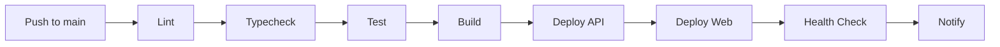

# Production Deployment

DevSage deploys entirely to Cloudflare: the API runs as a Cloudflare Worker and the web app is served via Workers Static Assets. This guide covers both.

## Overview

| Component | Platform | Command |
|-----------|----------|---------|
| API | Cloudflare Worker (Hono + D1 + Durable Objects + Queues) | `pnpm deploy:api` |
| Web | Cloudflare Workers Static Assets (Vite build) | `pnpm deploy:web` |

Production URLs:
- Web: `https://devsage.org`
- API: `https://api.devsage.org`

## First-Time Cloudflare Setup

### Authenticate

```bash
wrangler login
```

This opens a browser for OAuth authentication. No API tokens are needed -- Wrangler stores credentials locally.

### Create the D1 Database

```bash
wrangler d1 create devsage-db
```

This outputs a `database_id`. Update the D1 binding in `apps/api/wrangler.jsonc` with this value.

### Run Migrations

```bash
wrangler d1 migrations apply devsage-db --remote
```

Migrations are located in `packages/db/migrations`. The migration path is configured in `apps/api/wrangler.jsonc` as a relative path (`../../packages/db/migrations`).

## Deploy API

From the repository root:

```bash
# Production deployment
pnpm deploy:api

# Dev environment deployment
pnpm deploy:api:dev
```

This runs `pnpm --filter @devsage/api deploy`, which invokes `wrangler deploy` from the `apps/api/` directory.

Important: Never run `wrangler deploy` from the repo root. There is no `wrangler.jsonc` at the root level.

## Upload API Secrets

Production secrets must be uploaded to Cloudflare separately from the code deployment.

### Bulk Upload

Create an `apps/api/.env.production` file with all production values, then run:

```bash
pnpm deploy:api:secrets
```

### Individual Secrets

```bash
cd apps/api
wrangler secret put JWT_SECRET
wrangler secret put GOOGLE_CLIENT_ID
wrangler secret put GOOGLE_CLIENT_SECRET
wrangler secret put GITHUB_CLIENT_ID
wrangler secret put GITHUB_CLIENT_SECRET
wrangler secret put GITHUB_WEBHOOK_SECRET
wrangler secret put FRONTEND_URL
wrangler secret put SMTP_URL
wrangler secret put SMTP_USERNAME
wrangler secret put SMTP_PASSWORD
wrangler secret put SMTP_EMAIL_ADDR
```

Each command prompts for the secret value interactively.

### Required Production Secrets

| Secret | Description |
|--------|-------------|
| `JWT_SECRET` | HMAC SHA-256 signing key for auth tokens |
| `GOOGLE_CLIENT_ID` | Google OAuth 2.0 client ID |
| `GOOGLE_CLIENT_SECRET` | Google OAuth 2.0 client secret |
| `GITHUB_CLIENT_ID` | GitHub OAuth app client ID |
| `GITHUB_CLIENT_SECRET` | GitHub OAuth app client secret |
| `GITHUB_WEBHOOK_SECRET` | Shared secret for verifying GitHub webhook payloads |
| `FRONTEND_URL` | Production frontend origin (e.g., `https://devsage.org`) |
| `SMTP_URL` | SMTP server connection string |
| `SMTP_USERNAME` | SMTP authentication username |
| `SMTP_PASSWORD` | SMTP authentication password |
| `SMTP_EMAIL_ADDR` | Sender email address for outbound mail |

Never commit `.env.production` to version control. It is gitignored by default.

## Deploy Web

```bash
pnpm deploy:web
```

This runs the build step (`tsc --noEmit && vite build`) followed by `wrangler deploy` from `apps/web/`.

The production environment file `apps/web/.env.production` is committed to the repository. It contains only client-visible `VITE_*` variables (e.g., `VITE_API_ORIGIN=https://api.devsage.org`). Never place secrets in web environment variables.

## DNS Setup

Configure DNS records in your Cloudflare dashboard:

| Record | Name | Target |
|--------|------|--------|
| CNAME or Worker Route | `devsage.org` | Web Worker |
| CNAME or Worker Route | `api.devsage.org` | API Worker |

Exact configuration depends on your Cloudflare zone setup. Both Workers are bound to custom domains via the Cloudflare dashboard or `wrangler.jsonc` route configuration.

## Environment Configuration

The API Worker supports multiple environments defined in `apps/api/wrangler.jsonc`:

- **Production** (top-level config): Used by `pnpm deploy:api`.
- **Dev** (`env.dev` section): Used by `pnpm deploy:api:dev`. Has its own D1 database binding and separate secrets.

Key configuration in `wrangler.jsonc`:
- `account_id`: Baked into the config file (no environment variable needed).
- `d1_databases`: Binds the D1 database with the migration path.
- `durable_objects`: Declares all Durable Object bindings.
- `queues`: Configures producer and consumer bindings.
- `observability.enabled`: Set to `true` for production logging.

## Monitoring

**Logs:**
View real-time logs from a deployed Worker:

```bash
cd apps/api
wrangler tail
```

Or use the Cloudflare dashboard under Workers & Pages > your worker > Logs.

**Observability:**
Observability is enabled in `wrangler.jsonc`. Cloudflare captures request logs, exceptions, and performance metrics automatically.

**Cron Triggers:**
A cron trigger runs hourly to process deadline checks. This is configured in `wrangler.jsonc` under the `triggers` section.

## Rollback

Cloudflare Workers support instant rollback via the dashboard. Navigate to Workers & Pages > your worker > Deployments, and roll back to any previous deployment.

## CI/CD Notes

- `gitleaks` runs on every PR and push to master in CI to catch leaked secrets.
- Deployment is currently manual via the `pnpm deploy:*` commands.
- Ensure all secrets are uploaded before the first production deployment.

## v3 Deployment Enhancements

v3 replaces manual deployment with an automated CI/CD pipeline, adds staging and preview environments, and introduces tooling for safe rollbacks and performance monitoring.

### CI/CD Pipeline

GitHub Actions automates the full build-and-deploy cycle on every merge to `main`. The pipeline runs in strict sequence -- a failure at any stage stops the pipeline and prevents deployment.



The workflow file lives at `.github/workflows/deploy.yml`. It uses `pnpm` caching for fast installs and runs all Turborepo tasks with `--filter` flags to avoid unnecessary rebuilds.

### Staging Environment

A dedicated staging environment mirrors production with its own isolated resources:

| Resource | Staging | Production |
|----------|---------|------------|
| Cloudflare project | `devsage-staging` | `devsage` |
| D1 database | `devsage-db-staging` | `devsage-db` |
| KV namespace | `devsage-kv-staging` | `devsage-kv` |
| Durable Objects | Separate namespace | Separate namespace |
| Domain | `staging.devsage.org` | `devsage.org` / `api.devsage.org` |

Merges to the `staging` branch trigger an automatic deployment to the staging environment. Staging uses its own set of secrets (uploaded separately via `wrangler secret put` with the `--env staging` flag).

### Preview Deployments

Every pull request gets a unique Cloudflare Workers preview URL. The preview deployment runs the full build pipeline and posts the preview URL as a comment on the PR.

Preview URLs follow the pattern `https://<hash>.devsage-preview.workers.dev`. They are ephemeral and automatically cleaned up when the PR is closed.

### Database Migration Strategy

D1 migrations in v3 follow a zero-downtime approach:

1. **Backward-compatible changes only.** New columns must have defaults. Removed columns are dropped in a follow-up migration after all code referencing them is deployed.
2. **Expand-then-contract.** Schema changes happen in two phases: first add the new structure (expand), then remove the old structure (contract) in a later release.
3. **Migration CI check.** The pipeline runs `drizzle-kit generate --dry-run` to verify that pending migrations are consistent with the current schema.

Migrations are applied automatically during deployment via `wrangler d1 migrations apply --remote`.

### Rollback Automation

v3 adds a single-command rollback that handles both the Worker code and the database:

```bash
pnpm rollback:api
```

This command:

1. Identifies the previous Cloudflare deployment via the Workers API.
2. Rolls back the Worker to that deployment.
3. Applies any reverse migration scripts (stored alongside forward migrations in `packages/db/migrations/rollback/`).

For web-only rollbacks, use `pnpm rollback:web`, which reverts to the previous Workers Static Assets deployment.

### Health Check Endpoint

The API exposes a health check at `GET /api/v1/health` that reports the status of all dependencies:

```json
{
  "ok": true,
  "data": {
    "status": "healthy",
    "version": "3.0.0",
    "uptime": 84321,
    "dependencies": {
      "d1": "ok",
      "kv": "ok",
      "r2": "ok",
      "durable_objects": "ok",
      "queues": "ok"
    }
  }
}
```

The CI/CD pipeline hits this endpoint after deployment and fails the pipeline if the health check does not return `ok: true` within 30 seconds.

### Deploy Notifications

Successful deployments trigger notifications to keep the team informed:

- **Slack:** Posts to the `#deployments` channel with the commit SHA, author, and environment.
- **Discord:** Posts to the configured webhook channel with the same information.

Notification webhooks are configured via the `SLACK_WEBHOOK_URL` and `DISCORD_WEBHOOK_URL` secrets. If either is not set, that notification channel is silently skipped.

### Performance Regression Detection

Lighthouse CI runs as part of the GitHub Actions pipeline on every PR. It measures:

- Performance score (target: >= 90)
- Accessibility score (target: >= 95)
- Best practices score (target: >= 90)
- Bundle size delta (fails if the main bundle grows by more than 10%)

Results are posted as a PR comment with a comparison against the `main` branch baseline. Regressions below the target thresholds block the PR from merging.
